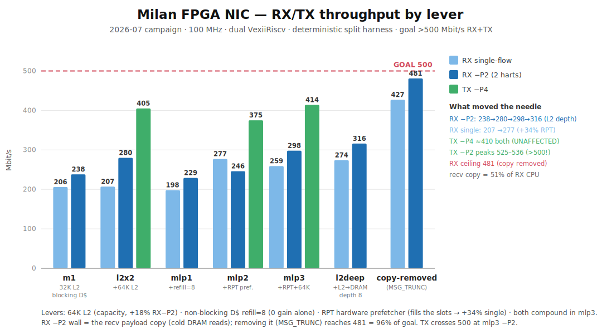

# Performance CHANGELOG — Milan FPGA TSN NIC

**Goal (`docs/findings/PERFORMANCE_GOAL.md`, set `21bd213`):** best-effort TCP throughput **>500 Mbit/s in
both RX and TX**, reaching for 1 Gbit/s. Platform: Alinx AX7101 (xc7a100t), dual VexiiRiscv RV64
@ 100 MHz, 64-bit datapath, DDR3-800, MTU 1500.

**Discipline:** every lever is gated by an on-silicon HW-counter measurement *before and after*
(the "measure, don't assume" rule). Numbers below are measured, deterministic-split harness.

> **Perf-lineage banner (2026-07-23).** Every scoreboard number in this file was measured on the
> **2-hart** VexiiRiscv perf-campaign SoC. That campaign is **closed**; the **ship shape is
> 1-hart** VexiiRiscv + `--l2-bytes 32768`. The numbers below are retained as the **perf-lineage
> record**, not the shipped configuration. Campaign close-out (07-10/11 header-split): TX
> **582–646**, RX-with-copy **381/374**, RX no-copy **585–594** — both directions crossed 500.

**Status (2026-07-09 night, post-R2):** TX **crosses 500** (513 −P4 re-verified on the R2
gateware). RX after the R2 multi-slot-RSC campaign (`build_r2slots` + kl-eth `mslot60d`):
**no-copy stack ceiling 925 Mbit (was 481 — ~93 % of line rate)**, TCP-with-copy
**~370–410 sustained** (−P8, peer-side time-series; short cells are slow-start-flattered —
sustain claims require the time-series). R1 warm-copy REFUTED with mechanism (~1 ms
structural kernel window-cycle at 100 MHz). R3 @112.5 as-built rejected (WNS −0.036 +
QSPI CRC corruption on-die); R3b (112.5 + rpt-ahead-8) in flight.

*(pre-R2 status below, kept for history)* TX crosses 500 (−P2 peaks 525–536); RX best **316**
(`build_l2deep`). **RX > 500 is a HARD GOAL — the campaign does not close without it.** The
measured 481 no-copy ceiling means the path must raise the ceiling *and* close the copy tax:
**R1** warm copy (`build_ddio` + bounded `tcp_rmem` residency), **R2** RSC multi-slot (kill the
58–66 % park-closes), **R3** 112.5 MHz final mile — plan in `docs/findings/PERFORMANCE_GOAL.md`.

 — regenerate: `python3 docs/perf_campaign_chart.py docs/perf_campaign.svg`

---

## Lever log — goal · change · **measured effect**

Effects are `before → after` Mbit/s. "build" = gateware config passed to `sw/litex/milan_soc.py`
(a build-script recipe, not a code diff); "commit" cites the code/doc change of record.

| # | Lever | Goal | Change (commit / build) | **Measured effect** |
|--:|---|---|---|---|
| 1 | HW RSC receive coalescing | cut per-frame RX CPU | `e1b7f5f` (kl-eth `rsc250`) | **RX single 43 → 209** |
| 2 | HW header-gen TSO | TX offload | `151032d`,`559b402` (kl-eth) | **TX 143 → 186** |
| 3 | RX fan-out (2 queues, 2 harts) | parallel RX | `01a484c` (kl-eth) + `rxfan` build | **RX −P2 223 → 238** |
| 4 | CBS-default shaping bug fix | remove spurious throttle | `34cc2bc` (hdl/csr `CBS_EN_RST=0`) | unblocked TX shaping |
| 5 | RX overload-wedge fixes | stop RX collapse under load | `09e3a09`,`2c44757` (rsc RTL) + `12265b5` (kl-eth) | RX stable, `canary=0` under storm |
| 6 | TX peer-coalescing + softirq NAPI | TX aggregate | `44e785c` (T1, operating point) | **TX −P4 → 452** |
| 7 | **64 KB L2** (capacity) | RX 2-hart capacity misses | `build_l2x2` (`--l2-bytes 65536`); doc `10aba03` | **RX −P2 238 → 280** (+18 %) |
| 8 | **Non-blocking D$** refill 1→8 | RX memory-level parallelism | `build_mlp1` (`--lsu-l1-refill-count=8`); doc `5c99dcb` | **RX −P2 229 ≈ 238 — NO GAIN** (slots need a filler on an in-order core) |
| 9 | **RPT hardware prefetcher** | *fill* the refill slots | `build_mlp2` (`--lsu-hardware-prefetch=rpt`); doc `5c99dcb` | **RX single 198 → 277 (+34 %)**, −P2 +7 % |
| 10 | **RPT + 64 KB L2 (combined)** | RX aggregate | `build_mlp3` (refill+rpt+64K); mech doc `c286108` | **RX −P2 298 (best, +6 % vs l2x2)**; **TX unaffected** (l2x2 vs mlp3 overlap: −P4 ~410, −P2 peak ~530) |
| 11 | `perf` profiling (cross-built) | *find* the RX wall | `04c8144`; perf in defconfig `b8e2fb6` | **RX −P2 = 51 % `copy_to_user`** (recv payload copy, cold-DRAM-read bound) — interconnect hypothesis refuted |
| 12 | `MSG_TRUNC` ceiling test | bound >500 feasibility | `2ddf5e4` (`tools_recv_trunc.c`) | **RX without the copy: single 427, −P2 481** (96 % of goal) |
| 13 | **L2→DRAM depth** (`downPendingMax` 4→8) | stop 2 harts serializing at the L2's DRAM port | `--l2-down-pending=8 --l2-general-slots=16` (patch `sw/litex/patches/0002-vexiiriscv-l2-depth-args.patch`); `build_l2deep` | **RX −P2 296→316 (+7 %)**, single 233→274, §V clean, 0 BRAM, WNS +0.259 — **the keeper config** |

### DDIO / zero-copy RX levers (measured 2026-07-09, toward the 481 ceiling)
- **Shared-L2 DDIO** (`build_ddio` = mlp3 + `--l2-ddio`, allocate-on-DMA-write via the SpinalHDL
  `Cache.allocateOnMiss` hook — feasible as a config line, WNS +0.102, 0 BRAM): **flat** — RX −P2
  ~300 ≈ mlp3 298, single/−P4 slightly down. Allocating every DMA write **pollutes** the 64 KB L2
  without **warming** the copy — payloads evicted before `copy_to_user` reads them (NAPI→recv gap).
  Needs a *dedicated stash* (residency), not the shared L2.
- **App zero-copy recv** (`TCP_ZEROCOPY_RECEIVE`, `tools_recv_zc.c`): **0% zero-copied** — the
  HW-RSC frag isn't page-aligned; TCP mmap needs a driver+HW **header-split** first.

### Memory-depth loop end (measured 2026-07-09) — the knee is L2 downPending=8
- **L2 downPending 8→16** (`build_l2deep2`): −P2 319 ≈ 316 — **flat** (L2 knee at 8).
- **LiteDRAM `cmd_buffer_depth` 8→16** (`build_ddrdeep`, per-bank FIFOs RTL-verified 8→16): −P2 313 —
  **flat**. Every queue from L1 refill slots to the DRAM controller is now deep enough; the residual
  wall is DDR3 bank/latency physics + the copy itself. **Memory-path ceiling ≈ 316.** Beyond it:
  only copy-removal (header-split zero-copy / stash — task #17).
- perf on the L2-deep board re-confirmed **not software**: self-time ~35 % = the payload copy's
  scalar word-loop (cold reads); scheduling ~4 % + locks ~1.3 % minor.

### Copy-removal endgame (measured 2026-07-09) — 481 unreachable via the socket API
- **Zero-copy recv contract** (from `net/ipv4/tcp.c can_map_frag()`): frags must be **order-0, exactly
  4 KB, offset 0, `page->mapping==NULL`** — kl-eth's 16 KB compound RSC pages can never flip, and the
  loopback "0 %" pre-test was an artifact (pagecache frags always have `mapping` set).
- **`mapbench` (on-silicon, `tools_mapbench.c`)**: cold-copy 4 KB = **25.0 µs/page**; map-cycle
  (fault + PTE + `MADV_DONTNEED` zap) = **44.9 µs/page** → **page-flipping costs ~1.8× the copy**
  on this 100 MHz sv39 core. Even batched `vm_insert_pages` (~10–15 µs/page optimistic) saves ≤ half
  the copy → ~380–420 best-case, never 481 — for multi-day RTL+driver+app changes. **REFUTED.**
- **Final RX verdict: ~316 is the practical socket-TCP ceiling on this SoC.** 481 needs consumers
  that never materialize payload via `recv()` (MSG_TRUNC-class, `AF_PACKET` mmap rings) — which is
  exactly how the real AVTP media path works (`PACKET_RX_RING`), so AVB is unaffected by the wall.

### Rejected / refuted levers (measured, not assumed)
- **112.5 MHz clock** (`757b727`,`d6a0b45`): closed timing but only +4–8 %; not worth boot fragility → stayed 100 MHz.
- **Dedicated network *scratchpad*** (`c7e4db2`): RX buffers already in DRAM (0 BRAM) → a scratchpad *adds* BRAM; kernel-owned state can't be relocated. *But* the related **DDIO/allocate-on-DMA-write** idea was later vindicated by perf (task #15).
- **Grow L2 to 96 KB** (task #11): the wall is not L2 capacity beyond 64 KB.
- **Deepen the DMA interconnect** (task #13): RX writer `outhi=2` has ~30× headroom — not the bottleneck.
- **Driver `rxzc` zero-copy** (task #14): dead code (removed); the copy is the socket-API copy, not driver-fixable.
- **Software prefetch**: VexiiRiscv D$ is blocking + no prefetch instruction → no-op on this core.
- **DDIO / allocate-on-DMA-write** (`build_ddio`, task #15): **DEAD** — allocating every DMA write pollutes the L2 without warming the copy (frame evicted before `copy_to_user`); the copy tax was ultimately removed by **header-split zero-copy RX** (07-10/11), which is what carried RX no-copy to **585–594**.

---

## Where the goal stands

| direction | best measured | goal | note |
|---|:--:|:--:|---|
| **TX** | **582–646** (07-10/11 header-split) | 500 | **crosses 500**; TX is datapath/shaper-bound (CPU levers don't move it) |
| **RX** | **585–594** no-copy · **381/374** with real `recv()` copy | 500 | **crosses 500** no-copy via header-split zero-copy RX; the socket-copy path is the residual tax |

**Campaign closed (07-10/11).** The recv copy tax was removed by **header-split zero-copy RX**
(not DDIO — that lever is DEAD, see above), carrying RX no-copy to **585–594** and TX to
**582–646** on the 2-hart perf SoC. These are perf-lineage records; the ship shape is 1-hart.
