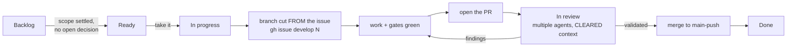

# Contributing — house rules that keep this repo shippable

Short version: SystemVerilog only, banner-documented, one-line commits,
lane-per-worktree, every change grows the test suite, and nothing merges on
"looks right" — TB numbers or silicon numbers.

## Contents

- **[1. HDL house style (Cemal Dogan / Oguz Kahraman school)](#1-hdl-house-style-cemal-dogan--oguz-kahraman-school)** — The naming, reset and banner conventions a new `.sv` file must follow, ending in the CDC rule that cost us the 07-24 link-guard deadlock: clock-liveness observers must be `reset_less`.
- **[2. Workflow](#2-workflow)** — The issue-to-merge lane: an issue moves to *In progress*, a branch is cut **from the issue**, the work lands on it, a PR opens, review runs as **multiple agents with cleared context**, and only then does it merge back to `main-push`. Plus one lane = one worktree, one-line commits, and two traps with history: `cp -r` (never symlink) `third_party/` into a worktree, and rebuild `LAYOUTS` merges semantically rather than by marker-union.
- **[3. Verification bar](#3-verification-bar)** — What a change owes before it merges: a self-checking Verilator harness under `tb/verilator/<name>/`, a ratcheted `scripts/lint_rtl.py --check` that fails on any new lint violation, a justification for every `lint_off`, a matrix row that only turns ✅ with a runnable test, and timing claims quoted with the full cell recipe rather than a bare WNS.
- **[4. Bench discipline (the expensive lessons)](#4-bench-discipline-the-expensive-lessons)** — Four rules paid for on hardware: ≥ 8 min AX boot probes, never resume a frozen PCM ring, dump a QSPI slot before overwriting it, and regenerate the DTB from `csr.csv` on any gateware block-set change.

## 1. HDL house style (Cemal Dogan / Oguz Kahraman school)

- **SystemVerilog only** for new HDL. Python (migen/LiteX) is SoC *glue*,
  never new datapath logic.
- File head: SPDX line + banner comment stating what the module is and the
  one design decision that matters. `` `default_nettype none `` at the top,
  `` `default_nettype wire `` at the bottom.
- Ports documented **inline with `//!`** — the port list IS the spec.
- Naming: `_r` registered, `_w` wire/comb, `_p` one-cycle pulse, `_S` FSM
  states, `_C`/`_P` params. Named `always_ff`/`always_comb` blocks
  (`begin : name … end : name`).
- Reset: synchronous, active-low `rst_n`, every register reset. 2-space
  indent.
- CDC: only via the blessed primitives (`cdc_pulse`, `cdc_handshake`,
  toggle+sync); **clock-liveness observers must be `reset_less`** — never
  place an observer inside a reset cone its consumer drives (the 07-24
  link-guard deadlock).

## 2. Workflow

### 2.1 The issue-to-merge lane

Every change of substance runs this lane, in this order. The point of writing
it down is that the two steps people skip — cutting the branch **from the
issue**, and reviewing with **cleared context** — are the two that keep the
board honest and stop a reviewer from rubber-stamping their own reasoning.

1. **Move the issue to *In progress*** on the project board before the first
   edit, not after. An issue in *Ready* that somebody is already working is
   how two lanes collide — which has happened: the dynamic-state store was
   built twice on 2026-08-16 because the issue was filed after the work
   started.
2. **Cut the branch from the issue**: `gh issue develop <N> --base main-push`.
   This links branch to issue on GitHub, so the PR closes the issue and the
   board moves itself. A hand-named branch does neither.
3. **Do the work on that branch**, with the §3 verification bar met *on the
   branch* — a PR is not the place to discover the sweep is red.
4. **Open the PR** against `main-push`, with the template below and the
   self-test results as a **comment** (a comment is evidence, not approval).
5. **Review with multiple agents, each with CLEARED context.** Not forks of
   the authoring session: agents that have never seen the reasoning that
   produced the diff. An agent that helped write a change will re-derive the
   same blind spot when asked to check it. Give each one a different lens —
   clause conformance, wire format and response sizing, test adequacy and
   whether the tests can actually fail — and let them read the diff cold.
6. **Merge back into `main-push`** only once the findings are answered. The
   issue closes itself; move the card to *Done* if it does not.

Two board rules that go with it:

- **Backlog vs Ready is about decisions, not size.** A large task with settled
  scope is *Ready*. A small task with an open trade-off is *Backlog* until
  somebody makes the call — file the options and the recommendation in the
  issue rather than picking silently.
- **A superseded issue is moved to *In review*, never quietly closed**, with a
  comment saying what landed, where, and which acceptance criteria were **not**
  met. Closing it hides the divergence.

### 2.2 Lanes and traps

- **One lane = one worktree = one branch = one PR** (`~/milan-avb-multiwork`
  pattern). Copy (`cp -r`), never symlink, `third_party/` into a worktree —
  a symlink escapes to the main repo and builds silently stale RTL; then
  delete the copied submodule's `.git` file.
- **Commits: one line, no trailers.** The private bench suite is referenced
  only as *the bench suite* (evidence token `BENCH`) in committed text —
  never by any external name.
- PRs use the template: Status / Description / how-to-reproduce / how-to-
  validate / DoD. **Self-test results go in a PR comment** — a comment is
  evidence, not approval. Maintainer merges by default.
- **`LAYOUTS`-style merges in [`tests/steps/`](tests/steps/) are semantic, never
  marker-union**: rebuild each command's block from its owning commit
  verbatim (naive unions broke main twice; a third time gets you named in
  this file). The rule was written for the PDU-generator step file that carried
  the 1722.1 command layouts; that file went with the AECP/ACMP/ADP step suites
  on 2026-08-13, and the rule stands for whatever table-shaped step module
  replaces it.

## 3. Verification bar

- Every functional RTL change ships with a self-checking Verilator harness
  under `tb/verilator/<name>/` (`make` = build+run, exit code is the gate).
  See [`docs/testing/TESTING.md`](docs/testing/TESTING.md) for the suite index and tiers.
- **Lint before you push**: `python3 scripts/lint_rtl.py --check` (~10 s,
  needs only the Verilator you already have). It sweeps every module in
  `hdl/` and fails on a **new** violation — today's 150 are grandfathered by
  a per-directory ratchet in [`scripts/lint.budget`](scripts/lint.budget) and
  printed in full, so the backlog is never hidden. Lowering an entry is a
  normal commit: `python3 scripts/lint_rtl.py && git add scripts/lint.budget`.
  Raising one is not an option — fix the finding, or add a `RULE_WAIVERS`
  entry naming the reason **and where the reason is recorded**.
  `--pragmas` alone is instantaneous and is the useful pre-commit hook:
  `echo 'python3 scripts/lint_rtl.py --pragmas' >> .git/hooks/pre-commit`.
- **A `// verilator lint_off X` needs a justification**, exactly like a
  tied-off input does — an unexplained suppression is the same defect class
  as an unexplained tie. Put the reason next to the code AND a
  `PRAGMA_WAIVERS` entry in [`scripts/lint_rtl.py`](scripts/lint_rtl.py); the gate fails without
  one. The waiver code must be the **last token on the line**: a trailing
  `// prose` comment builds under Verilator 5.050 and does not build under
  5.020, which is how four suites became unbuildable once.
- Coverage-matrix rows ([`docs/testing/`](docs/testing)) only move ✅ with a runnable test.
  Prefer real-wiring-path tests over unit mocks.
- **Measure, don't assume**: no number from a comment or model drives a
  decision. HW counter first; measure before AND after; a TB-green
  integration change still owes a datapath-regression run
  ([`tb/verilator/milan_dp`](tb/verilator/milan_dp)).
- Timing claims need the full cell recipe (config + directive + seed); a
  bare WNS number is not reproducible. 3×32-thread Vivado discipline:
  single configs become 3-directive sweeps, keep best WNS.

## 4. Bench discipline (the expensive lessons)

- AX boot probes need **≥ 8 min** windows (power→network ≈ 7 min); a probe
  timeout is not a dead board.
- Never freeze the PCM ring mid-stream and plain re-enable (resume desync);
  full reset-reprogram.
- QSPI: never overwrite a slot without the current content dumped to disk
  first; DTB changes go through the **OpenSBI FW_FDT_PATH embed** (the dtb
  flash slot is not what the kernel boots on); regenerate the DTB from the
  build's `csr.csv` on ANY gateware block-set change (CSR-rot rule,
  [`docs/integration/QSPI_FLASHBOOT.md`](docs/integration/QSPI_FLASHBOOT.md)).
