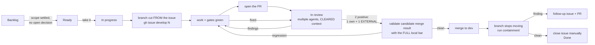

# Contributing — house rules that keep this repo shippable

Short version: SystemVerilog only, banner-documented, one-line commits,
lane-per-worktree, every change grows the test suite, and nothing merges on
"looks right" — TB numbers or silicon numbers.

## Contents

- **[1. HDL house style (Cemal Dogan / Oguz Kahraman school)](#1-hdl-house-style-cemal-dogan--oguz-kahraman-school)** -- The naming, reset and banner conventions a new `.sv` file must follow, ending in the CDC rule that cost us the 07-24 link-guard deadlock: clock-liveness observers must be `reset_less`.
- **[2. Workflow](#2-workflow)** -- The issue-to-merge lane: an issue moves to *In progress*, a branch is cut **from the issue**, the work lands on it, a PR opens, review runs as **multiple agents with cleared context**, and only then does it merge back to `dev`. Plus one lane = one worktree, one-line commits, and two traps with history: `cp -r` (never symlink) `third_party/` into a worktree, and rebuild `LAYOUTS` merges semantically rather than by marker-union.
- **[3. Verification bar](#3-verification-bar)** -- What a change owes before it merges: a self-checking Verilator harness under `tb/verilator/<name>/`, a ratcheted `scripts/lint_rtl.py --check` that fails on any new lint violation, a justification for every `lint_off`, a matrix row that only turns ✅ with a runnable test, and timing claims quoted with the full cell recipe rather than a bare WNS.
- **[4. Bench discipline (the expensive lessons)](#4-bench-discipline-the-expensive-lessons)** -- Four rules paid for on hardware: ≥ 8 min AX boot probes, never resume a frozen PCM ring, dump a QSPI slot before overwriting it, and regenerate the DTB from `csr.csv` on any gateware block-set change.

## 1. HDL house style (Cemal Dogan / Oguz Kahraman school)

- **SystemVerilog only** for new HDL. Python (migen/LiteX) is SoC *glue*,
  never new datapath logic.
- File head: SPDX line + banner comment stating what the module is and the
  one design decision that matters. `` `default_nettype none `` at the top,
  `` `default_nettype wire `` at the bottom.
- Ports documented **inline with `//!`** — the port list IS the spec.
- Naming: `_r` registered, `_w` wire/comb, `_p` one-cycle pulse, `_S` FSM
  states, `_C`/`_P` params. Named `always_ff`/`always_comb` blocks
  (`begin : name … end : name`).
- Reset: synchronous, active-low `rst_n`, every register reset. 2-space
  indent.
- CDC: only via the blessed primitives (`cdc_pulse`, `cdc_handshake`,
  toggle+sync); **clock-liveness observers must be `reset_less`** — never
  place an observer inside a reset cone its consumer drives (the 07-24
  link-guard deadlock).

## 2. Workflow

### 2.1 The issue-to-merge lane

Every change of substance runs this lane, in this order. The point of writing
it down is that the two steps people skip — cutting the branch **from the
issue**, and reviewing with **cleared context** — are the two that keep the
board honest and stop a reviewer from rubber-stamping their own reasoning.

The long-gate policy is machine-checked against the
[Milan feature status ledger](docs/reference/MILAN_FEATURE_STATUS.md):

<!-- milan-feature-status:start -->
| Feature ID | Status | Canonical value |
|---|---|---|
| `verification.long-gate-policy` | `implemented` | `local-required, remote-optional` |
<!-- milan-feature-status:end -->



1. **Move the issue to *In progress*** on the project board before the first
   edit, not after. An issue in *Ready* that somebody is already working is
   how two lanes collide — which has happened: the dynamic-state store was
   built twice on 2026-08-16 because the issue was filed after the work
   started.
2. **Cut the branch from the issue**: `gh issue develop <N> --base dev`.
   This links the branch and issue on GitHub. Because `dev` is not the
   repository's default branch, merging its PR does not auto-close the issue.
   Close the issue manually only after the post-merge containment check passes.
3. **Do the work on that branch**, with the Section 3 verification bar met *on the
   branch* — a PR is not the place to discover the sweep is red.
4. **Open the PR** against `dev`, with the template below and the
   self-test results as a **comment** (a comment is evidence, not approval).
5. **Review with multiple agents, each with CLEARED context.** Not forks of
   the author's session: agents that have never seen the reasoning that
   produced the diff. An agent that helped write a change will re-derive the
   same blind spot when asked to check it. Give each one a different lens and
   let them read the diff cold. **The lens list is
   [`AGENTS.md` reviewer procedure](AGENTS.md#6-reviewer-procedure)** —
   `Conformance`, `RTL`, `Robustness`,
   `Tests`, `Docs` — and those five names are the ones a completion ledger
   counts, so report coverage in them. The angles this file used to list here
   (clause conformance, wire format and response sizing, test adequacy, whether
   the tests can actually fail) are examples of what to look at within them,
   not a second list to report against.

   **Two positive reviews are the merge bar, and one of them must be
   EXTERNAL.** One from this lane's own review agents, at least one from an
   agent outside it. A lane reviewing only itself converges on its own
   assumptions no matter how many agents it spawns — the cleared context stops
   an agent inheriting the *reasoning*, not the lane inheriting its own
   *premises*. Findings are not a review verdict: a round that returns
   blockers is answered and then **re-reviewed**, and it is the re-review that
   can be positive. Do not count the round that found the bugs as the sign-off
   for the fixes.

   **Keep the PR comment short.** State what the PR does and that it is
   validated, with the gate results. The findings, the mutation tables and the
   clause arguments belong in the review itself and in the commit messages —
   a PR thread that reprints them is a PR thread nobody reads to the end.

   **Prefix every PR message with the role.** Session 0 starts every PR body
   and comment with `[A0]` when authoring, or `[R0]` when reviewing. Every other
   session replaces `0` with its assigned session number and keeps that number
   when its role changes. The prefix states which responsibility and session
   the message represents.
6. **Merge back into `dev`** only once the findings are answered, and
   **not while a review round is in flight.** A round that has not reported is
   a round outstanding; merging past it is merging unreviewed code with a
   review thread attached.

   Twice this went wrong, and the two cases are not the same shape - which is
   the point. One merged with a round genuinely mid-flight; the other merged
   having met the bar, while review that was still happening went on to find
   three more blockers. The rule that covers both is that the merge waits for
   review to be **finished**, not for a quota of positives to be reached:

   | PR | merged | state at that moment | cost |
   |---|---|---|---|
   | #77 | 2026-08-16 18:10 | round 3 answered, a positive validation posted 32 min earlier - the stated bar was **met** | review did not stop there, and rounds 4 and 5 returned NEGATIVE afterwards (6 was positive): an ungraded refusal arm where mutating the code was silent, and a test that could not fail. Re-landed as #85 |
   | #86 | 2026-08-17 07:54 | a round running, which then found a hole in its own fix | three commits stranded on the branch; re-landed as #89, tracked by #87 |

   Both were recoverable and neither was noticed by anything except a reviewer
   checking by hand. The failure is silent by construction: `gh pr view` says
   `MERGED`, CI is green, and the branch still has commits ahead of the merge.
   Nothing in the lane compares those two facts unless step 7 does.

7. **Validate the candidate merge result, then prove containment.** A merge is
   a change nobody wrote and nobody reviewed, and *"Merge made by the 'ort'
   strategy"* is not evidence of anything. Before pressing merge, construct a
   candidate from the latest `origin/dev` and the reviewed PR head, then
   gate that tree exactly as Section 3 gates a hand-written one: full Verilator sweep,
   both repos' suites, behave, the lint ratchet, and Yosys. If the reviewed head
   directly descends from the unchanged base, its tree is the candidate merge
   tree; record both object IDs with the local gate results.

   This is not defensive box-ticking. On 2026-08-16 two lanes independently
   added the *same* six AECP settings-face pins to `KL_pp_shadow.sv` — one
   tied off, one connected. Git reported **no conflict** and kept **both**,
   producing duplicate pin connections that would not elaborate. Nothing but
   running the tools on the merged tree could have found it. The same merge
   also silently re-armed a VERSION story describing commands that had been
   split out, and restored an inventory row for an opcode the engine no longer
   decodes.

   **After merge, check that it actually took the branch:**

   ```bash
   python3 scripts/check_merge_containment.py origin/<branch>
   python3 scripts/check_merge_containment.py --merged-prs   # the last 20 PRs
   ```

   It exits non-zero and names the count when commits are left behind. Replayed
   against the two merge points in step 6 it reports **3** stranded commits for
   #77 and **4** for #86 - the latter is 3 as of that merge plus the one pushed
   during the #89 re-land. Nobody was told either number at the time.

   **Run it when the branch stops moving, not at the merge button.** Both
   incidents were *contained* at the instant they merged; the commits that
   ended up stranded were pushed afterwards as review activity continued. For
   #86 a round was in flight. For #77 the stated bar had been met, but review
   did not stop. A check run at merge time cannot see later pushes. The moment
   that catches them is the one where the card moves to *Done*. Once
   containment is clean, close the issue manually and move its project item to
   *Done*.

   `--no-fetch` disables Git ref refresh only. A `--merged-prs` sweep still
   queries GitHub for the merged PR list and branch timeline evidence.

   Its `--selftest` runs inside `scripts/run_all_suites.sh` next to
   `suite_tally.py`'s, so the tool cannot rot into a green that means nothing
   between merges. The check *itself* is still a thing a person runs: nothing
   here can schedule a post-merge action, and CI does not run on `dev`
   at all (both workflows are `on: push: branches: [main]`). That gap is worth
   closing separately. A `push: [dev]` trigger would run the bar and the
   containment self-test on the merge result. It would still need an explicit
   `check_merge_containment.py --merged-prs` step to render a live containment
   verdict.

   **Do not hand-roll it by reading `git log` output.** The script uses
   `git rev-list --count` and `git merge-base --is-ancestor` because one prints
   a single integer and the other answers only through its exit status: neither
   needs its prose parsed, so neither can be half-read or mis-scraped. #89's
   description claimed a fast-forward that was not one, off a `git log A..B`
   that came back empty in the author's terminal. A cause was proposed at the
   time and a later attempt could not reproduce it in twelve variations, so it
   stands unexplained - which is itself the argument. A check whose failure
   mode nobody can characterise is not one to build on, whatever the cause
   turns out to be.

   Three merge-specific traps worth naming, all paid for:

   - **Push the submodule before the superproject.** A superproject pin to a
     processor commit that only exists on a feature branch dangles the moment
     that branch is deleted, and `git submodule update` on a fresh clone fails
     with no useful message.
   - **A conflict in the µcode or the engine means re-running
     `protocol-processor/scripts/check_upc_map.py`.** A merge that lands the engine's dispatch
     constant from one side and the microprogram's entry point from the other
     does not fail to elaborate — the µCPU executes ROM fill and answers a
     well-formed response carrying garbage.
   - **The two long GitHub jobs are optional; their local gates are not.**
     `verilator-suites` and `yosys-portability` are informational GitHub checks.
     A PR may merge without waiting for them, including while GitHub reports
     `MERGEABLE/UNSTABLE`. Before the PR is marked validated, run both equivalent
     gates locally and record their results on the PR:

     ```bash
     suite_logs=$(mktemp -d)
     scripts/run_all_suites.sh "$suite_logs"
     syn/yosys/run.sh
     ```

     The optional status applies only to the remote jobs. The local Verilator
     sweep and Yosys portability sweep are mandatory merge evidence.

Two board rules that go with it:

- **Backlog vs Ready is about decisions, not size.** A large task with settled
  scope is *Ready*. A small task with an open trade-off is *Backlog* until
  somebody makes the call — file the options and the recommendation in the
  issue rather than picking silently.
- **A superseded issue is moved to *In review*, never quietly closed**, with a
  comment saying what landed, where, and which acceptance criteria were **not**
  met. Closing it hides the divergence.

### 2.2 Lanes and traps

- **One lane = one worktree = one branch = one PR** (`~/milan-avb-multiwork`
  pattern). Copy (`cp -r`), never symlink, `third_party/` into a worktree —
  a symlink escapes to the main repo and builds silently stale RTL; then
  delete the copied submodule's `.git` file.
- **Commits: one line, no trailers.** The private bench suite is referenced
  only as *the bench suite* (evidence token `BENCH`) in committed text —
  never by any external name.
- PRs use the template: Status / Description / how-to-reproduce / how-to-
  validate / DoD. **Self-test results go in a PR comment** — a comment is
  evidence, not approval. Maintainer merges by default.
- **`LAYOUTS`-style merges in [`tests/steps/`](tests/steps/) are semantic, never
  marker-union**: rebuild each command's block from its owning commit
  verbatim (naive unions broke main twice; a third time gets you named in
  this file). The rule was written for the PDU-generator step file that carried
  the 1722.1 command layouts; that file went with the AECP/ACMP/ADP step suites
  on 2026-08-13, and the rule stands for whatever table-shaped step module
  replaces it.

## 3. Verification bar

- Every functional RTL change ships with a self-checking Verilator harness
  under `tb/verilator/<name>/` (`make` = build+run, exit code is the gate).
  See [`docs/testing/TESTING.md`](docs/testing/TESTING.md) for the suite index and tiers.
- **Lint before you push**: `python3 scripts/lint_rtl.py --check` (~10 s,
  needs only the Verilator you already have). It sweeps every module in
  `hdl/` and fails on a **new** violation — today's 150 are grandfathered by
  a per-directory ratchet in [`scripts/lint.budget`](scripts/lint.budget) and
  printed in full, so the backlog is never hidden. Lowering an entry is a
  normal commit: `python3 scripts/lint_rtl.py && git add scripts/lint.budget`.
  Raising one is not an option — fix the finding, or add a `RULE_WAIVERS`
  entry naming the reason **and where the reason is recorded**.
  `--pragmas` alone is instantaneous and is the useful pre-commit hook:
  `echo 'python3 scripts/lint_rtl.py --pragmas' >> .git/hooks/pre-commit`.
- **A `// verilator lint_off X` needs a justification**, exactly like a
  tied-off input does — an unexplained suppression is the same defect class
  as an unexplained tie. Put the reason next to the code AND a
  `PRAGMA_WAIVERS` entry in [`scripts/lint_rtl.py`](scripts/lint_rtl.py); the gate fails without
  one. The waiver code must be the **last token on the line**: a trailing
  `// prose` comment builds under Verilator 5.050 and does not build under
  5.020, which is how four suites became unbuildable once.
- Coverage-matrix rows ([`docs/testing/`](docs/testing)) only move ✅ with a runnable test.
  Prefer real-wiring-path tests over unit mocks.
- **Measure, don't assume**: no number from a comment or model drives a
  decision. HW counter first; measure before AND after; a TB-green
  integration change still owes a datapath-regression run
  ([`tb/verilator/milan_dp`](tb/verilator/milan_dp)).
- Timing claims need the full cell recipe (config + directive + seed); a
  bare WNS number is not reproducible. 3×32-thread Vivado discipline:
  single configs become 3-directive sweeps, keep best WNS.

## 4. Bench discipline (the expensive lessons)

- AX boot probes need **≥ 8 min** windows (power→network ≈ 7 min); a probe
  timeout is not a dead board.
- Never freeze the PCM ring mid-stream and plain re-enable (resume desync);
  full reset-reprogram.
- QSPI: never overwrite a slot without the current content dumped to disk
  first; DTB changes go through the **OpenSBI FW_FDT_PATH embed** (the dtb
  flash slot is not what the kernel boots on); regenerate the DTB from the
  build's `csr.csv` on ANY gateware block-set change (CSR-rot rule,
  [`docs/integration/QSPI_FLASHBOOT.md`](docs/integration/QSPI_FLASHBOOT.md)).
