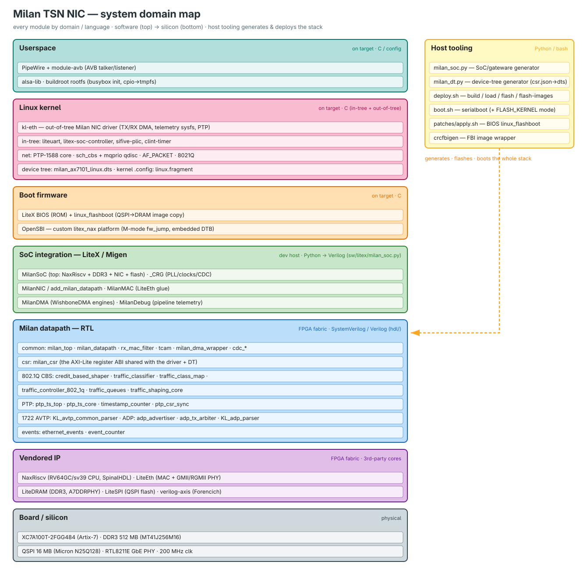

# milan-fpga — IEEE 1722 / 1722.1 / Milan v1.2 on FPGA

> A fully-FPGA **AVnu Milan v1.2 AVB/TSN audio end-station**: a RISC-V/LiteX softcore SoC
> running Linux, with the entire TSN datapath in **vendor-neutral SystemVerilog fabric**, on
> an Alinx AX7101 (Artix-7). Evolving toward a 4-port AVB switch.



## What's proven on silicon

| Area | State |
|---|---|
| Milan v1.2 end-station (talker + listener) | both boards **CERT 63/63** |
| TSN datapath in fabric | MAC · 802.1Qav CBS · gPTP · AVTP/AAF/CRF · ADP/AECP/ACMP · MAAP · lwSRP |
| Media-clock servo | MMCM-DRP, analog loop **−83.9 dB** (converter floor) |
| Networking / boot | ring-DMA line-rate ingest · QSPI flash-boot (zero-upload) |
| Audio | ALSA record over Milan · live talker↔listener E2E |
| CPU / board | 1-hart VexiiRiscv RV64 Linux SoC · xc7a100t · DDR3 512 MB |
| Portability | no Xilinx primitives — machine-checked by the [Yosys/ECP5 flow](syn/yosys/README.md) |

> Live perf numbers live in the measured ledger — [CHANGELOG.md](CHANGELOG.md) +
> [docs/findings/](docs/findings/README.md). Any number quoted elsewhere is a dated snapshot.

## Prerequisites

Everything is open-source **except the final Xilinx bitstream**. Package names are Arch; the
equivalents exist on any distro.

| Tool | Install (Arch) | Needed for | Required? |
|---|---|---|---|
| `riscv64-elf-gcc` + binutils + newlib | `pacman -S riscv64-elf-gcc riscv64-elf-binutils riscv64-elf-newlib` | BIOS + firmware | ✅ always |
| `verilator` ≥ 5.0 (+ a C++17 compiler) | `pacman -S verilator` | the Verilator testbenches + sim | ✅ to run tests |
| `jdk17` + `sbt` | `pacman -S jdk17-openjdk sbt` | generate the VexiiRiscv/NaxRiscv core (SpinalHDL) | ✅ to build gateware |
| `meson ninja cmake dtc` | `pacman -S meson ninja cmake dtc` | build tooling + device tree | ✅ always |
| Python 3 + the **LiteX venv** | `litex_setup.py` (see quickstart) | SoC elaboration (LiteX/Migen) | ✅ always |
| **Vivado 2026.1** with Artix-7 | Xilinx installer | place & route → `.bit` | ⬦ only to build a bitstream |
| `openFPGALoader` | `pacman -S openfpgaloader` | flash the board over JTAG | ⬦ only to flash hardware |

## Quickstart — copy/paste

```sh
# 1 · clone + the one required submodule
git clone <this-repo> milan-fpga && cd milan-fpga
git submodule update --init third_party/verilog-axis

# 2 · toolchain, once (Arch shown — see Prerequisites for your distro)
sudo pacman -S --needed riscv64-elf-gcc riscv64-elf-binutils riscv64-elf-newlib \
                        jdk17-openjdk sbt meson ninja cmake dtc verilator
python3 -m venv ~/litex-milan/venv && . ~/litex-milan/venv/bin/activate
curl -sSL https://raw.githubusercontent.com/enjoy-digital/litex/master/litex_setup.py \
     | python - --init --install --config=full
export JAVA_HOME=/usr/lib/jvm/java-17-openjdk

# 3 · run a self-checking testbench — no vendor tools, exit 0 = PASS
cd tb/verilator/milan_dp && make

# 4 · boot the softcore in simulation — no Vivado; the CPU reads ID = "MILN"
cd sw/litex && ./milan_sim.py

# 5 · build a real bitstream — needs Vivado + Artix-7
cd sw/litex && ./build.sh ax7101
```

> ⚠️ Run builds from **any directory except** the litex-repos parent, or `import litex` resolves
> to the repo root (a namespace package) and `get_data_mod` fails.

## Where to start — pick your lane

New here? **[docs/README.md](docs/README.md)** routes you by role, and everyone's first doc is
the **[Systems-Engineer Guide](docs/SYSTEMS_ENGINEER_GUIDE.md)** (what the system is + a map of
every other doc). Terms → [glossary](docs/GLOSSARY.md).


| I want to… | Go to |
|---|---|
| **Know where to start (by role)** | [docs/README.md](docs/README.md) → [SYSTEMS_ENGINEER_GUIDE.md](docs/SYSTEMS_ENGINEER_GUIDE.md) |
| Understand the whole system | [docs/overview/FULL_FPGA_SOLUTION.md](docs/overview/FULL_FPGA_SOLUTION.md) |
| Integrate the datapath into my SoC | [docs/integration/INTEGRATION_GUIDE.md](docs/integration/INTEGRATION_GUIDE.md) |
| **Build without Vivado / port off-Xilinx** | [docs/integration/PORTING_GUIDE.md](docs/integration/PORTING_GUIDE.md) |
| Program against the registers | [docs/reference/REGISTER_MAP.md](docs/reference/REGISTER_MAP.md) |
| Run the verification suites | [docs/testing/TESTING.md](docs/testing/TESTING.md) |
| Known limitations & issues | [docs/limitations/KNOWN_ISSUES_AND_LIMITATIONS.md](docs/limitations/KNOWN_ISSUES_AND_LIMITATIONS.md) |

## Run the tests

| Suite | Command | Needs |
|---|---|---|
| **All Verilator TBs** (~41, self-checking) | `cd tb/verilator && for d in */; do (cd "$d" && make) \|\| break; done` | verilator ≥ 5.0 |
| One TB | `cd tb/verilator/<suite> && make` (exit 0 = PASS) | verilator |
| Device portability | `cd syn/yosys && make && make ecp5` | yosys |
| behave / tsn_gen fixtures | `~/litex-milan/venv/bin/behave tests` | the venv + `TSAGEN_DIR` |

`ls tb/verilator/` is the authoritative suite list. Full map: [docs/testing/TESTING.md](docs/testing/TESTING.md).

## Build & flash a board

`./build.sh ax7101` (or `arty`) → `./deploy.sh flash` + `flash-images`. The full flow, with the
load-bearing rules (compressed bitstream, matched image set, recovery) in one picture:


Details: [docs/integration/BUILDING.md](docs/integration/BUILDING.md) ·
[docs/integration/QSPI_FLASHBOOT.md](docs/integration/QSPI_FLASHBOOT.md) ·
[docs/findings/BENCH_TOPOLOGY.md](docs/findings/BENCH_TOPOLOGY.md).

## Credits

**Developers:** [Cemal Dogan](https://github.com/cemaldogann) · [Oguz Kahraman](https://github.com/OguzKahramn)
**Maintainer:** [Alexandre Malki](https://github.com/Mister-M-alt)
