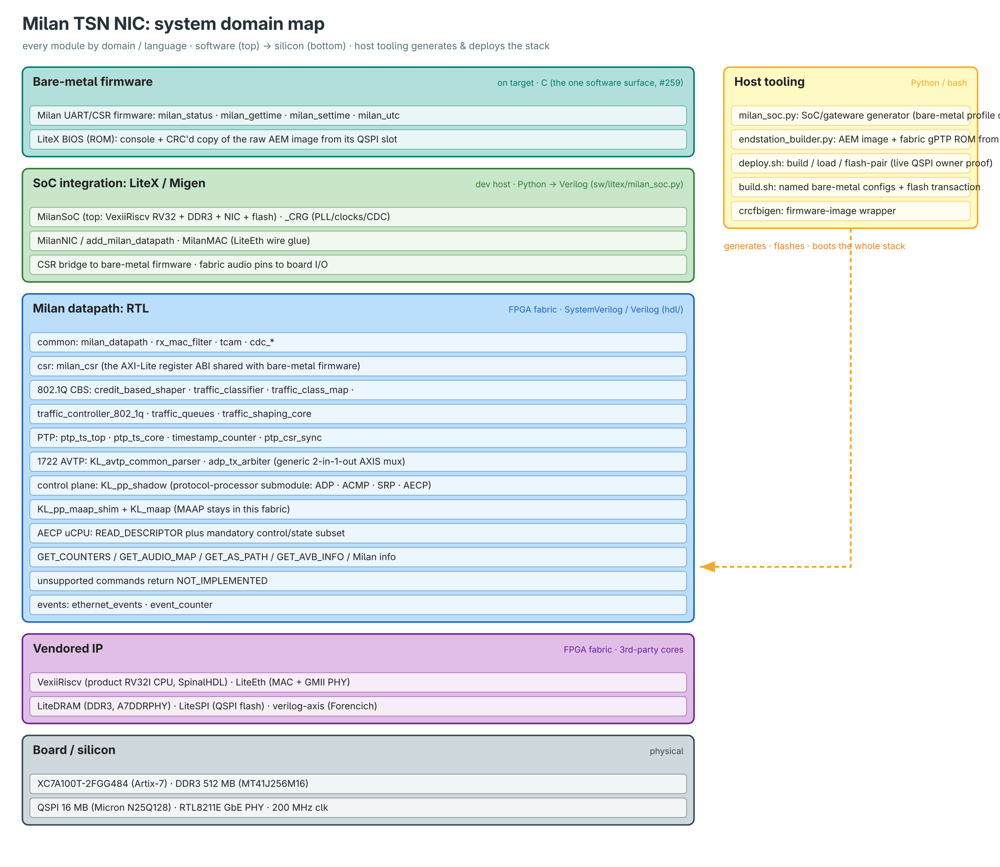
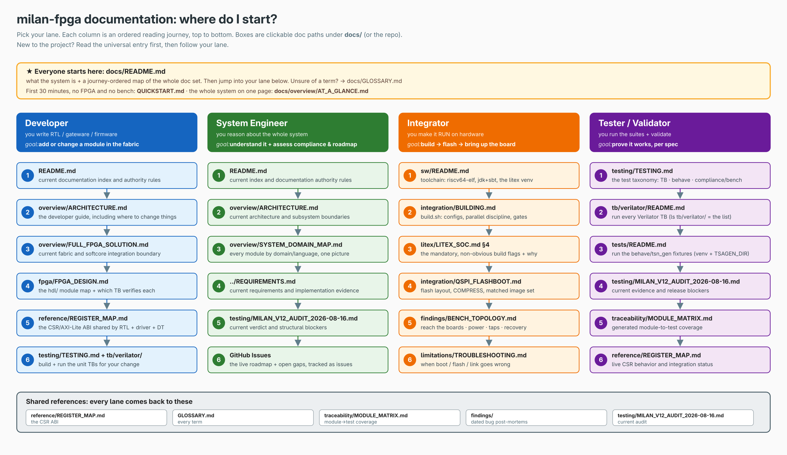
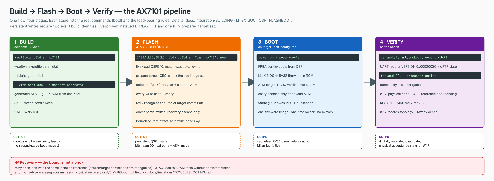

# milan-fpga: IEEE 1722 / 1722.1 and Milan on FPGA

> A fully-FPGA **Milan-oriented AVB/TSN audio end-station**: a RISC-V/LiteX softcore SoC
> running Linux, with the entire TSN datapath in **vendor-neutral SystemVerilog fabric**, on
> an Alinx AX7101 (Artix-7). Evolving toward a 4-port AVB switch.

```sh
git clone https://github.com/kebag-logic/milan-fpga && cd milan-fpga
git submodule update --init third_party/verilog-axis protocol-processor  # required
cd tb/verilator/tcam && make                           # ~5 s → RESULT: PASS
```

**Never seen this repo before?** → **[QUICKSTART.md](QUICKSTART.md)** — clone to a green
test run in 30 minutes, no FPGA and no bench access assumed. Want to know what this *is*
before installing anything? → **[docs/overview/ARCHITECTURE.md](docs/overview/ARCHITECTURE.md)**.



## Who are you?

Four doors, three links each. Every other doc hangs off one of these.

| | You are… | Start | Then | Then |
|---|---|---|---|---|
| 🔌 | **Integrator** — putting this datapath in *your* SoC or on *your* board | [integration/INTEGRATION_GUIDE.md](docs/integration/INTEGRATION_GUIDE.md) — the `milan_datapath` boundary as a port-by-port contract | [reference/REGISTER_MAP.md](docs/reference/REGISTER_MAP.md) — the AXI4-Lite ABI your driver programs | [integration/PORTING_GUIDE.md](docs/integration/PORTING_GUIDE.md) — off-Xilinx, off-Vivado, per-vendor translation |
| 🛠 | **RTL developer** — changing or adding fabric | [overview/ARCHITECTURE.md](docs/overview/ARCHITECTURE.md) §8 "where to change things" | [fpga/FPGA_DESIGN.md](docs/fpga/FPGA_DESIGN.md) — every module in `hdl/` and the harness that verifies it | [CONTRIBUTING.md](CONTRIBUTING.md) — house style; a DUT change ships its testbench in the same commit |
| 🔧 | **Bench operator** — building, flashing, bringing a board up | [integration/BUILDING.md](docs/integration/BUILDING.md) — `build.sh` configs and the gates a build must pass | [integration/QSPI_FLASHBOOT.md](docs/integration/QSPI_FLASHBOOT.md) — flash a **matched** image set, boot Linux | [limitations/TROUBLESHOOTING.md](docs/limitations/TROUBLESHOOTING.md) — symptom → cause → fix, from the field |
| 📖 | **Curious reader / evaluator**, deciding if this is worth your time | [overview/ARCHITECTURE.md](docs/overview/ARCHITECTURE.md) | [the current Milan v1.2 audit](docs/testing/MILAN_V12_AUDIT_2026-08-16.md) | [reference/FR_NFR.md](docs/reference/FR_NFR.md) |

More lanes (system engineer, tester, hobbyist) and the full index:
**[docs/README.md](docs/README.md)**. Everyone's long-form orientation is the
current architecture, verification, and audit entry points are listed there.
Terms → [glossary](docs/GLOSSARY.md).



## What's proven on silicon

| Area | State |
|---|---|
| Milan v1.2 end-station (talker + listener) | internal conformance suite was **green on both boards** at the last measured round — read the control-plane note below before reading that as a current verdict |
| TSN datapath in fabric | MAC · 802.1Qav CBS · gPTP · AVTP/AAF/CRF · MAAP |
| Control plane in fabric | ADP · ACMP · SRP and a partial AECP/AEM surface, served by the pinned `protocol-processor` submodule. See the current boundary below |
| Media-clock servo | MMCM-DRP, analog loop **−83.9 dB** (converter floor) |
| Networking / boot | ring-DMA line-rate ingest · QSPI flash-boot (zero-upload) |
| Audio | ALSA record over Milan · live talker↔listener E2E |
| CPU / board | 1-hart VexiiRiscv RV64 Linux SoC · xc7a100t · DDR3 512 MB |
| Portability | no Xilinx primitives — machine-checked by the [Yosys/ECP5 flow](syn/yosys/README.md) |

> Those rows are **measurements on specific boards on specific dates**, not promises about
> your hardware. Live perf numbers live in the measured ledger — [CHANGELOG.md](CHANGELOG.md) +
> [docs/findings/](docs/findings/README.md). Any number quoted elsewhere is a dated snapshot.

### Current control-plane boundary

Firmware VERSION `0x0002_0051` uses `hdl/milan/KL_pp_shadow.sv` and the pinned
`protocol-processor` as its only IEEE 1722.1 and SRP control plane. MAAP remains
in this repository. There is no legacy fallback.

Machine-checked status rows are defined by the
[Milan feature status ledger](docs/reference/MILAN_FEATURE_STATUS.md):

<!-- milan-feature-status:start -->
| Feature ID | Status | Canonical value |
|---|---|---|
| `gateware.current-version` | `implemented` | `0x0002_0051` |
| `aem.served-command-set` | `implemented` | - |
| `aem.acquire-entity-refusal` | `not-supported` | - |
| `aem.mandatory-missing-set` | `missing` | - |
| `stream-input.start-stop` | `partial` | - |
| `stream-input.stopped-crf-observation` | `missing` | - |
| `crf.media-clock-consumption` | `missing` | - |
| `state.nonvolatile-persistence` | `missing` | - |
| `notifications.change-events` | `partial` | - |
<!-- milan-feature-status:end -->

The current AECP implementation answers these operations with real behavior:

<!-- milan-feature-fact:served_aem_operations:start -->
- `READ_DESCRIPTOR`
- `ACQUIRE_ENTITY` with Milan's required `NOT_SUPPORTED` result
- `LOCK_ENTITY`
- `ENTITY_AVAILABLE` and `GET_CONFIGURATION`
- `SET_CONFIGURATION`
- `GET_STREAM_FORMAT`
- `SET_SAMPLING_RATE` and `GET_SAMPLING_RATE`
- `SET_CLOCK_SOURCE` and `GET_CLOCK_SOURCE`
- `SET_CONTROL` and `GET_CONTROL` for Identify
- `START_STREAMING` and `STOP_STREAMING` for Stream Input, with the known
  response-boundary and stopped-CRF defects tracked by issue #97
- `GET_STREAM_INFO`, `GET_AVB_INFO`, and leaf-only `GET_AS_PATH`
- `REGISTER_UNSOLICITED_NOTIFICATION` and `DEREGISTER_UNSOLICITED_NOTIFICATION`
- `IDENTIFY_NOTIFICATION` commands with the required `BAD_ARGUMENTS` result
- `GET_COUNTERS` for Stream Input, Stream Output, AVB Interface, and Clock Domain
- `GET_AUDIO_MAP` for both stream-port directions
- `ADD_AUDIO_MAPPINGS` and `REMOVE_AUDIO_MAPPINGS`
- `GET_DYNAMIC_INFO` for the IEEE fixed-getter whitelist
<!-- milan-feature-fact:served_aem_operations:end -->

<!-- milan-feature-fact:served_mvu_operations:start -->
- Milan Vendor Unique `GET_MILAN_INFO`
<!-- milan-feature-fact:served_mvu_operations:end -->

Unknown and unimplemented operations still receive the correctly sized IEEE
1722.1 echo. Commands for another entity and incoming AECP responses are
silently discarded as required.

The descriptor image supply chain is also present. During an explicit
`--write-fragment` or `--write-rtl` ownership transfer, the end-station builder
generates `aem_desc.bin`, `aem_desc.json`, and `aem_desc.map` from the selected
configuration in the sibling rootfs overlay. The board-side `aemi-load`
utility loads and verifies the paired image before the entity is enabled. The
store validates its `AEMI` header, version, checksum, and configuration before
serving it, and a late valid image heals without a reset.

This is still not a full Milan v1.2 implementation. These mandatory operations
are missing:

<!-- milan-feature-fact:missing_mandatory_aem_operations:start -->
- `SET_STREAM_FORMAT`
- `SET_STREAM_INFO`
- `SET_NAME`
- `GET_NAME`
<!-- milan-feature-fact:missing_mandatory_aem_operations:end -->

The processor accepts and stores clock-source and sampling-rate changes. The
clock-source selection now reaches the media plane's wrapper but nothing there
reads it yet, and the sampling rate is stored and readable over AECP without
being republished to the fabric at all.
Identify control is stored but the root indication remains tied low.
`GET_AVB_INFO` returns zero propagation delay instead of the value published at
`GPTP_PDELAY`, and the writable AAF admission bypass remains a deployment
hazard.
The integration also reports no nonvolatile backend, so required state does not
survive a power cycle. Solicited Stream Output counters are now served; their
rate-limited unsolicited notification path remains a separate task. These are
compliance blockers, not documentation-only limitations.
The Stream Input START/STOP path is partial until issue #97 makes command
success follow the binding-record commit and keeps stopped CRF traffic visible
to observation counters while suppressing only timing consumption.
`GET_AS_PATH` reports only the grandmaster identity. The PathTrace staging tail
is disconnected from the root processor interface, so multi-bridge topology is
reported incompletely.

The dated evidence and exact gate results are recorded in
[the 2026-08-16 audit](docs/testing/MILAN_V12_AUDIT_2026-08-16.md). The register
interface is in [docs/reference/REGISTER_MAP.md](docs/reference/REGISTER_MAP.md).

## Prerequisites — by what you actually want to do

Everything is open-source **except the final Xilinx bitstream**. Package names are Arch; the
equivalents exist on any distro. Each tier *adds* to the one above it.

**Tier 1 · simulate + run every testbench** — no FPGA, no vendor tools, ~2 min to install:

```sh
sudo pacman -S --needed gcc make python python-yaml verilator git
git submodule update --init third_party/verilog-axis protocol-processor
```

Verilator must be **≥ 5.050** — that is the CI pin, and CI builds it from source
at that tag rather than trusting a distro package, because 5.020 (Ubuntu 24.04)
cannot build four of the suites and 5.032 (Debian trixie) reads back zeros on six
`aecp` checks. The measured table is in
[docs/testing/TESTING.md](docs/testing/TESTING.md) §7. The protocol processor is
required by every datapath-level harness and is fetched over anonymous HTTPS.
The remaining submodules are not needed for this tier and may stay
uninitialised: `external`, `gptp-processor`, and `third_party/buildroot`.
The processor architecture, compliance review, and SystemVerilog
implementation live at
<https://github.com/Mister-M-alt/protocol-processor-control-plane-avb-milan>;
this repository pins that implementation rather than duplicating it.
A GitHub *"Download ZIP"* has no
submodule content, so the datapath testbenches will not build from a zip.

**Tier 2 · prove device portability (generic synthesis + Lattice ECP5)** — add:

| Tool | Install | Note |
|---|---|---|
| `yosys` | `pacman -S yosys` | in the Arch official repos |
| `sv2v` | **not in the Arch repos (AUR only)** — take the upstream prebuilt static Linux binary from [github.com/zachjs/sv2v/releases](https://github.com/zachjs/sv2v/releases) and drop it in `~/.local/bin` | yosys cannot read SystemVerilog interfaces without it |

**Tier 3 · build a bitstream / run on hardware** — add:

| Tool | Install (Arch) | Needed for | Required? |
|---|---|---|---|
| `riscv64-elf-gcc` + binutils + newlib | `pacman -S riscv64-elf-gcc riscv64-elf-binutils riscv64-elf-newlib` | BIOS + firmware | ✅ to build gateware |
| `jdk17` + `sbt` | `pacman -S jdk17-openjdk sbt` | generate the VexiiRiscv/NaxRiscv core (SpinalHDL, in Scala) | ✅ to build gateware |
| `meson ninja cmake dtc` | `pacman -S meson ninja cmake dtc` | build tooling + device tree | ✅ to build gateware |
| Python 3 + the **LiteX venv** | `litex_setup.py` — see [QUICKSTART.md](QUICKSTART.md) §6 | SoC elaboration (LiteX/Migen, installed from git) | ✅ to build gateware |
| **Vivado 2026.1** with Artix-7 | Xilinx installer | place & route → `.bit` | ⬦ **proprietary**; only to build a bitstream |
| `openFPGALoader` | `pacman -S openfpgaloader` | flash the board over JTAG | ⬦ only to flash hardware |

Prefer not to install anything? [`Containerfile.dev`](Containerfile.dev) pins tiers 1 and 2
exactly: `podman build -t milan-fpga-dev -f Containerfile.dev . && podman run --rm -v "$PWD":/work:z milan-fpga-dev`.

## Quickstart — copy/paste

```sh
# 1. clone and initialize the two required RTL submodules
git clone https://github.com/kebag-logic/milan-fpga && cd milan-fpga
git submodule update --init third_party/verilog-axis protocol-processor

# 2 · tier-1 toolchain, once (Arch shown — see Prerequisites for your distro)
sudo pacman -S --needed gcc make python python-yaml verilator git

# 3 · run a self-checking testbench — no vendor tools, exit 0 = PASS
cd tb/verilator/milan_dp && make

# 4 · run the repo gates — pure Python, seconds (the lint one wants verilator)
python3 scripts/docs_check.py
python3 docs/traceability/gen_module_matrix.py --check
python3 sw/builder/test_builder.py
python3 scripts/lint_rtl.py --check      # RTL lint over all of hdl/, ratcheted

# 5 · build a real bitstream — needs the tier-3 toolchain + Vivado
python3 -m venv ~/litex-milan/venv && . ~/litex-milan/venv/bin/activate
curl -sSL https://raw.githubusercontent.com/enjoy-digital/litex/master/litex_setup.py \
     | python - --init --install --config=full
export JAVA_HOME=/usr/lib/jvm/java-17-openjdk
cd sw/litex && ./build.sh ax7101
```

> ⚠️ Run builds from **any directory except** the litex-repos parent, or `import litex` resolves
> to the repo root (a namespace package) and `get_data_mod` fails.

The long form, with what is verified vs what needs a bench: [QUICKSTART.md](QUICKSTART.md).

## Run the tests

| Suite | Command | Needs |
|---|---|---|
| **All Verilator TBs** (one dir per suite, self-checking) | `cd tb/verilator && for d in */; do (cd "$d" && make) \|\| break; done` | verilator ≥ 5.050 (the CI pin) |
| One TB | `cd tb/verilator/<suite> && make` (exit 0 = PASS) | verilator |
| **RTL lint** over all of `hdl/` (ratcheted, ~10 s) | `python3 scripts/lint_rtl.py --check` | verilator (the CI pin) |
| Docs gate (links, wording, dead references) | `python3 scripts/docs_check.py` | python3 — **git optional** |
| Traceability no-drift gate | `python3 docs/traceability/gen_module_matrix.py --check` | python3 |
| End-station builder gates | `python3 sw/builder/test_builder.py` | python3 + pyyaml |
| Device portability | `cd syn/yosys && make && make ecp5` | yosys + sv2v |
| **BDD conformance suite** (15 features / 338 scenarios / 1,615 steps, no skips in the 2026-08-18 run) | `cd tests && behave -f plain` | `behave` (any venv; the `@tsn_gen` tier also wants `TSAGEN_DIR`) |

`ls tb/verilator/` is the authoritative suite list. Full map: [docs/testing/TESTING.md](docs/testing/TESTING.md).

## Build & flash a board

`./build.sh ax7101` (or `arty`) → `./deploy.sh flash` + `flash-images`. The full flow, with the
load-bearing rules (compressed bitstream, matched image set, recovery) in one picture:



Details: [docs/integration/BUILDING.md](docs/integration/BUILDING.md) ·
[docs/integration/QSPI_FLASHBOOT.md](docs/integration/QSPI_FLASHBOOT.md) ·
[docs/findings/BENCH_TOPOLOGY.md](docs/findings/BENCH_TOPOLOGY.md).

## Credits

**Developers:** [Cemal Dogan](https://github.com/cemaldogann) · [Oguz Kahraman](https://github.com/OguzKahramn)
**Maintainer:** [Alexandre Malki](https://github.com/Mister-M-alt)

Licence: CERN-OHL-W-2.0 ([LICENSE](LICENSE)) · vendored third-party code and pins:
[THIRD_PARTY.md](THIRD_PARTY.md).

## Product roadmap

From tonight's bench (protocol engine test-plan-graded, crossbars and
clocking live) to a shippable Milan end-station. Each phase's deliverables
ride the big arrow; dates assume the current cadence.

```text
 2026-08            2026-09            2026-10            2026-11..12         2027-Q1
    |                  |                  |                  |                  |
====\==================\==================\==================\==================\=========>
 P1 CLOSE THE       P2 STATE          P3 ROBUSTNESS      P4 COMPLIANCE          P5 PRODUCT      v1.0
    FABRIC             SURVIVAL          AS A GATE          PCB SPIN           HARDWARE     SHIP
    ROADMAP                                                                                  |
    - deterministic - AEM persistence - redundancy net  - compliance test-house  - PCB bring-up ==>
      listener        journal (mtd)     cabled +          run (Milan v1.2)   (TCXO, audio
      latency       - rootfs: boot-     failover proof  - 802.1AS            I/O, power)
      (setpoint law,  resilient statd/ - temp-range       conformance      - EMC / safety
      0x002E)         ptp4l, prio 248    timing signoff - PCB layout +     - factory
    - software DLL  - dual-slot QSPI  - week-long soak    fab               provisioning
      (GM step        + golden image    + power-cycle                       (MAC/EUI-64,
      re-base)      - field update      torture as                          serials, test
    - CRF sink        path              release gates                       fixture)
      followership                    - service-budget                    - ALSA/PipeWire
      on silicon                        decision                            as supported
    - stream-clock                      (2nd hart?)                         feature
      honesty                                                             - config surface
    - ring one-grid                                                         + hardening
      (retire pb                                                          - user manual +
      override)                                                             support policy
    - stream restart
      latency (open,
      12 to 90 s)
```

Standing invariants across every phase: the ATDECC model stays authoritative
(no side-channel state), every closed bitstream is flashed and soaked, and
the desk suites + internal COMPLIANCE behave gates stay green at 100 % coverage.

> That hole is closed. The entity model is now readable on the wire: the
> protocol processor's AECP engine serves `READ_DESCRIPTOR` out of a DRAM
> descriptor image the build generates, and `tb/verilator/milan_dp`'s
> `[AECP-MODEL]` block proves it by walking **every** descriptor the generator
> emits and grading each answer against the model's own bytes. What is still
> open is the write side. See the mandatory gaps in
> [the current audit](docs/testing/MILAN_V12_AUDIT_2026-08-16.md) and the open GitHub issues.

### P1.5 — Conformance hardening (2026-08, rides P1)

An earlier clause-by-clause traceability review mapped the protocol-facing RTL
elements and identified twelve work packages. The original review page is now
marked obsolete because the 2026-08-13 control-plane substitution changed the
implementation boundary.

> **Most of this campaign was overtaken by the 2026-08-13 substitution**, and
> the AECP half of it has since been partly discharged. The RTL that carried
> these packages is deleted: the ADP, ACMP and SRP items are now the protocol
> processor's to satisfy. The processor's AECP uCPU serves **twenty-six** AEM
> opcodes plus MVU `GET_MILAN_INFO` as of VERSION `0x0051`, so some AECP rows
> below are closed and some are not, and the per-clause status is **not** kept
> here. [The current audit](docs/testing/MILAN_V12_AUDIT_2026-08-16.md) records
> the exact evidence and remaining gaps. This table is kept
> only as the record of what the traceability review found. Do not read a row
> as work in flight against this tree.

| Order | Package | Issue |
|---|---|---|
| 1 | ACMP listener settled-state law (SRP coupling) | [#54](https://github.com/kebag-logic/milan-fpga/issues/54) |
| 1 | ACMP listener response/field laws | [#55](https://github.com/kebag-logic/milan-fpga/issues/55) |
| 2 | AECP stream-command law (STREAM_IS_RUNNING gates and siblings) | [#58](https://github.com/kebag-logic/milan-fpga/issues/58) |
| 3 | ACMP talker success-response field laws | [#56](https://github.com/kebag-logic/milan-fpga/issues/56) |
| 4 | ADP valid_time reset + advertise-timer restart | [#57](https://github.com/kebag-logic/milan-fpga/issues/57) |
| 5 | Unsolicited GET_COUNTERS coverage + rate law | [#60](https://github.com/kebag-logic/milan-fpga/issues/60) |
| 6 | Handshake-blind monitor taps + SRP rIn law | [#65](https://github.com/kebag-logic/milan-fpga/issues/65), [#63](https://github.com/kebag-logic/milan-fpga/issues/63) |
| 7 | AVTP version gate, media-clock-restart plumbing, CRF rounding | [#62](https://github.com/kebag-logic/milan-fpga/issues/62) |
| 8 | CRF counter widths | [#61](https://github.com/kebag-logic/milan-fpga/issues/61) |
| 9 | Departing-controller detection (Milan 5.4.5.3) | [#59](https://github.com/kebag-logic/milan-fpga/issues/59) |
| 10 | gPTP plane (increment reset, asCapable, latency split, AS_PATH) | [#64](https://github.com/kebag-logic/milan-fpga/issues/64) |
| 11 | SRP deep items (declaration gating, Domain adopt, CBS wire time) | [#63](https://github.com/kebag-logic/milan-fpga/issues/63) |

### P1.6 — Stream restart latency after an ACMP rebind (2026-08, OPEN)

Measured on silicon at VERSION 0x0040. A DISCONNECT_RX followed by a
CONNECT_RX on a listener sink returns SUCCESS immediately, but the talker
does not resume streaming for 12 to 90 seconds, and the delay **grows with
repeated reconnects** (three back-to-back cycles measured 12 to 21 s, then
over 16 s, then 57 to 97 s). A rebind should restart the stream in well
under a second.

Bounded by measurement, so the remaining search space is small:

- **Not the media clock lock.** MEDIA_LOCKED goes 0 to 1 in the same sample
  window the first PDU arrives, which is the Milan 5.3.8.10 first-valid-PDU
  law working correctly.
- **Not the stream table, format gate or RX filter.** The pre-match parser
  probe (`A_APRB_BASE` 0x8B4, the only view upstream of the stream-table
  match) freezes at the disconnect and does not advance until the stream
  resumes. No AVTP frame reaches the end station during the gap, so no
  matching decision is being made at all.
- **Not a late declaration from the fabric.** `A_LWSRP_CNT` 0x69C carries
  `{rx_pdus, tx_pdus}`, and our MSRP transmit rate more than triples within
  about 2 seconds of the CONNECT_RX, with receive rising in step.
- **Not the index-bus narrowing** in `KL_lwsrp_ctx.sv`: the row write is
  gated by `idx_ext_w`, which admits only `ctx_idx_i` in 1 to N_CTX_P-1, so
  the narrowed index cannot wrap.

The open lead is that MSRP settles at roughly 11 PDUs per second in both
directions during the gap, against a 2 to 3 per second baseline, for over a
minute without the stream starting. The engine's own refresh cadence is one
declaration per second (`JOIN_TIME_MS_C` 200 ms, every fifth JoinTime), so
that rate is not a converged MRP. `KL_lwsrp_ctx.sv` re-declares on every
received LeaveAll, which admits a re-declaration echo between the end
station and the bridge, but that is a hypothesis and not yet a finding.

**Blocked on instrumentation.** Separating our declaration contents from the
bridge and talker reaction needs MSRP attribute bytes off the wire. MSRP is
link local, so a host hanging off another bridge port cannot see the
exchange and only the in-line tap can. The bench tap currently enumerates
with `bInterfaceClass = ff` (vendor specific) and no driver bound, so it
presents no capture interface; restoring its vendor driver is the
prerequisite for closing this item.

### P1.7 — Media clock lock (2026-08, OPEN, measured)

A listener receiving our stream slips **exactly one 48 kHz sample every
1.96 seconds**, forever, because nothing locks the two media clocks. That
is 10.65 ppm, an ordinary difference between two free-running crystals.
Audibly the tone is essentially perfect (residual −133.85 dB) for two
seconds, then one 50 ms window degrades by about 110 dB, on repeat.

Our arithmetic is not the problem: `media_tick_p` is a Bresenham
fractional-N divider whose residual error is zero, gPTP and the media
tick share one oscillator, and the wire alignment is byte-exact. The gap
is **steerability**. `media_tick_p` is a compile-time constant with no
adjust port, and the MMCM-DRP servo steers only the I2S front-end clock,
so today we cannot act as a media clock sink for the packet grid at all.

A better oscillator does not fix this; it only lengthens the interval
between clicks, because two independent clocks always drift. The fix is a
shared media clock (listener recovers from the stream, or CRF, or both
ends derive from gPTP) plus making the Bresenham remainder a register the
servo drives, which gives 0.01 ppm per LSB for a register and an adder.

Full evidence, the ruled-out list and the oscillator table:
[obsolete historical media-clock finding](docs/findings/MEDIA_CLOCK_LOCK_0810.md).
