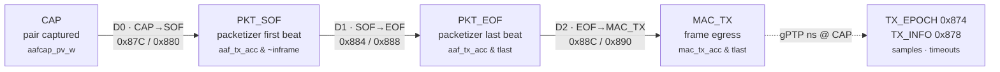
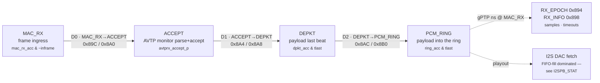

<!--
SPDX-FileCopyrightText: 2026 Kebag Logic
SPDX-License-Identifier: CERN-OHL-W-2.0
-->
# AAF end-to-end latency — where every tap sits (roadmap item-11)

This is deliverable #2 of the AAF-latency-breakdown directive: a picture of
**where in the TX and RX pipeline each latency point is measured**, mapped to
the exact RTL trigger and the CSR that reports it. The measurement engine is
`hdl/ieee1722/aaf/KL_aaf_latency_taps.sv`; the register block is
[`REGISTER_MAP.md`](reference/REGISTER_MAP.md) §0x870; the per-sample DDR3 history is
[`LATENCY_HISTORY_RING.md`](LATENCY_HISTORY_RING.md).

All deltas are in **`axis_clk` cycles** — divide by the datapath clock
(100 MHz on the AX7101 ⇒ 10 ns/cycle) for seconds. Each chain follows **one
in-flight frame at a time**: it arms on a stage-0 edge (latching the gPTP
epoch) and takes the next edge at each later stage, so min/last/max
characterise the latency *envelope*, not one threaded frame id.

## TX pipeline (talker: capture → wire)



* **CAP → PKT_SOF** (`D0`) spans up to one 6-sample AAF accumulation window —
  the packetizer only starts a frame once it has a full PDU's worth of pairs.
* **PKT_SOF → PKT_EOF** (`D1`) is the packetizer's own serialization time.
* **PKT_EOF → MAC_TX** (`D2`) is the CBS/shaper queue + MAC boundary. Under
  mixed traffic this shared boundary may catch a nearer non-AAF edge, which is
  why the envelope (min/max) matters more than a single sample here.
* The existing `ptp_ts_top` **TX hardware timestamp** stamps the actual wire
  egress independently; `TX_EPOCH` records the gPTP ns at the CAP edge so the
  fabric delta and the on-wire stamp can be reconciled.

## RX pipeline (listener: wire → PCM ring)



* **MAC_RX → ACCEPT** (`D0`) is classify + stream-table match + the AVTP
  monitor's parse-to-accept verdict.
* **ACCEPT → DEPKT** (`D1`) is the depacketizer draining the accepted PDU.
* **DEPKT → PCM_RING** (`D2`) is the write into the `_PCMRingNxN` DRAM ring
  the ALSA card / PipeWire source consume.
* The final **I2S DAC playout** stage is FIFO-fill dominated (the CDC pair
  FIFO decouples PDUs from DAC frames), so it is characterised by the
  `I2SPB_STAT` fill/converged rails rather than a delta here.

## Tap → trigger → CSR (the authoritative map)

| # | stage edge | RTL trigger (`milan_datapath.sv`) | delta CSR (last/max · min) |
|---|---|---|---|
| TX0 | CAP (pair captured) | `aafcap_pv_w` | `0x87C` · `0x880` |
| TX1 | PKT_SOF (first beat) | `aaf_tx_acc_w & ~aaf_tx_inframe_r` | `0x884` · `0x888` |
| TX2 | PKT_EOF (last beat) | `aaf_tx_acc_w & aaf_tx_tlast` | `0x88C` · `0x890` |
| TX3 | MAC_TX (egress) | `mac_tx_acc_w & m_axis_mac_tx_tlast` | — (chain end) |
| RX0 | MAC_RX (ingress) | `mac_rx_acc_w & ~mac_rx_inframe_r` | `0x89C` · `0x8A0` |
| RX1 | ACCEPT (monitor) | `avtprx_accept_p` | `0x8A4` · `0x8A8` |
| RX2 | DEPKT (payload last) | `dpkt_acc_w & dpkt_pcm_tlast_w` | `0x8AC` · `0x8B0` |
| RX3 | PCM_RING (ring write) | `ring_acc_w & m_axis_pcm_tlast` | — (chain end) |

`TX_EPOCH`/`RX_EPOCH` (`0x874`/`0x894`) carry the gPTP ns latched at the
stage-0 edge; `TX_INFO`/`RX_INFO` (`0x878`/`0x898`) carry `{timeouts, samples}`.
A per-stage timeout (`MILAN_CLK_FREQ_HZ/2000` ≈ 0.5 ms) aborts and re-arms a
stuck token so a dropped frame can never wedge a chain (counted in `timeouts`).

## Measured on silicon — TX chain (2026-07-26)

Board **AX7101**, flashed gateware `VERSION = 0x0001_000B`, datapath domain
**100 MHz** (10 ns/cycle), talker stream 0 live and paced to the second board,
pilot tone armed. Read straight out of the CSRs above; three independent
windows (since boot, and two `LTAP_CTRL[0]` cleared re-measures) agree.

| stage | min | max | reading |
|---|---|---|---|
| **D0** CAP→PKT_SOF | 1 cycle (10 ns) | **12 504 cycles (125.04 µs)** | the 6-sample AAF accumulation window: 6/48 kHz = 125.0 µs. The max is the *structure* of the packetizer, not a stall; the min is a CAP edge landing on a frame boundary |
| **D1** PKT_SOF→PKT_EOF | 11 cycles (110 ns) | 11 cycles (110 ns) | **constant** — pure serialization of one AAF PDU on the 64-bit datapath; no queueing, no variance across 65 k+ frames |
| **D2** PKT_EOF→MAC_TX | 8 cycles (80 ns) | **12 529 cycles (125.29 µs)** | one class-A observation interval (125 µs): the CBS/shaper slot the frame waits for. Min = a frame arriving into an already-open credit window |

`TX_INFO` reported **0 timeouts** in every window (samples saturate at
`0xFFFF`; the 5 s cleared window closed at 31 303 completed TX chains). So
every measured token walked CAP→SOF→EOF→MAC_TX to completion.

**Worst-case fabric TX ≈ 25 044 cycles ≈ 250 µs** (ΣMAX). Read it as an
envelope bound, not one frame's flight time — each chain follows one in-flight
frame at a time, so the three maxima need not belong to the same frame. Against
the shipped **presentation-time offset of 500 µs**, the fabric talker path
accounts for at most half the budget, and both halves of it (accumulation
window, pacing interval) are protocol-structural: they do not shrink with a
faster clock, only with a smaller `samples_per_frame` or a shorter class
interval.

### RX chain — not yet measurable on this gateware

On the same snapshot the RX chain reports **`samples = 0` with `timeouts`
pinned at saturation**: `MAC_RX` arms the chain on every ingress frame, but
`avtprx_accept_p` never pulses, so every token aborts at the D0 guard.
`AVTPRX_STAT`/`FRX`/`ERR` all read 0 while the ACMP listener context reports a
healthy bind (`ACMPL_STATE = 0x0002_E07E`: bound, stream active, Listener
declared, TalkerAdvertise registered, probing completed, status SUCCESS,
VLAN 2; the SM later reached `SETTLED_RSV_OK` with no change). This is the open
[fabric-listener accept blocker](limitations/KNOWN_ISSUES_AND_LIMITATIONS.md) —
an instrumentation-visible symptom, not a tap defect: the RTL N=8 accept path
is green in `tb/verilator/milan_dp`. The RX numbers land here once a listener
accepts on silicon.

Note for whoever measures the RX chain next: since `VERSION 0x0001_000C` the
chain consumes **same-cycle** stage pulses as 0-cycle hops, so **RX D2
(DEPKT→PCM_RING) legitimately reads `min = 0`** — the `KL_pcm_route`
pass-through is combinational. A 0 there is a correct measurement, not a
missing sample.

## Reading it live

```sh
# one-shot snapshot of every stage (on the board)
for a in 874 878 87C 884 88C  894 898 89C 8A4 8AC; do
  printf '0x%s = %s\n' $a "$(devmem 0x90000$a 32)"; done
# clear stats and re-measure:  devmem 0x90000870 32 0x3   (W1S clear + enable)
```

**Quote cycles, not rates.** The delta words are exact cycle counts and are
the honest unit here. A rate derived from a scripted window (`clear; sleep N;
read`) is not: every `devmem` is a separate process on a loaded softcore, so
the wall-clock window is longer — sometimes much longer — than the `sleep`.
The `samples`/`timeouts` fields also **saturate at `0xFFFF`**, which a busy
talker reaches in seconds. Use them as "did tokens complete / did they abort",
and take timing from the cycle deltas.

The full per-sample time series (not just min/last/max) is streamed to a
DDR3-backed ring and read back through its own CSR window — see
[`LATENCY_HISTORY_RING.md`](LATENCY_HISTORY_RING.md).
