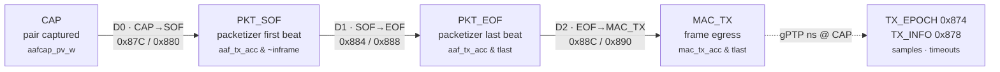
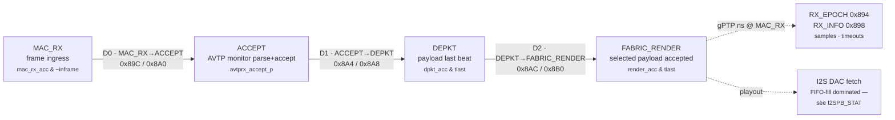

<!--
SPDX-FileCopyrightText: 2026 Kebag Logic
SPDX-License-Identifier: CERN-OHL-W-2.0
-->
# AAF end-to-end latency — where every tap sits (roadmap item-11)

This is deliverable #2 of the AAF-latency-breakdown directive: a picture of
**where in the TX and RX pipeline each latency point is measured**, mapped to
the exact RTL trigger and the CSR that reports it. The measurement engine is
[`hdl/ieee1722/aaf/KL_aaf_latency_taps.sv`](../hdl/ieee1722/aaf/KL_aaf_latency_taps.sv); the register block is
[Section 0x870 of `REGISTER_MAP.md`](reference/REGISTER_MAP.md#0x870-----aaf-per-stage-latency-taps--roadmap-item-11-kl_aaf_latency_taps); the per-sample DDR3 history is
[`LATENCY_HISTORY_RING.md`](LATENCY_HISTORY_RING.md).

All deltas are in **`axis_clk` cycles** — divide by the datapath clock
(100 MHz on the AX7101 ⇒ 10 ns/cycle) for seconds. Each chain follows **one
in-flight frame at a time**: it arms on a stage-0 edge (latching the gPTP
epoch) and takes the next edge at each later stage, so min/last/max
characterise the latency *envelope*, not one threaded frame id.

## Contents

- **[TX pipeline (talker: capture → wire)](#tx-pipeline-talker-capture--wire)** — Flowchart of the three talker hops with their CSR pairs, and the attribution note that matters: `PKT_EOF→MAC_TX` is the arbiter merge chain, **not** a CBS queue — the fabric talker injects after the shaper and never waits for credit.
- **[RX pipeline (listener: wire → fabric render)](#rx-pipeline-listener-wire--fabric-render)** — Same picture for the listener through the selected fabric-render boundary. The final I2S playout stage remains FIFO-fill dominated, so `I2SPB_STAT` characterises it separately.
- **[Tap → trigger → CSR (the authoritative map)](#tap--trigger--csr-the-authoritative-map)** — The lookup table — eight stage edges, each with its literal `milan_datapath.sv` trigger expression and its last/max·min register pair. Also where the 0.5 ms per-stage timeout is defined, which is what stops a dropped frame wedging a chain.
- **[Measured on silicon — TX chain (2026-07-26)](#measured-on-silicon--tx-chain-2026-07-26)** — Real AX7101 numbers: D0 max 125.04 µs is the 6-sample accumulation window, D1 is a constant 110 ns across 65 k+ frames, D2 max 125.29 µs is one class-A interval; 0 timeouts. Worst-case fabric TX ≈ 250 µs against a 500 µs presentation offset, and both halves are protocol-structural — a faster clock does not shrink them. The RX subsection follows here with its own numbers and a saturation caveat.
- **[Reading it live](#reading-it-live)** — The register sequence for a whole-pipeline snapshot and `LTAP_CTRL[0]` clear-and-re-measure. Quote cycle deltas, never rates: `samples`/`timeouts` saturate at `0xFFFF` within seconds on a busy talker.

## TX pipeline (talker: capture → wire)

* **CAP → PKT_SOF** (`D0`) spans up to one 6-sample AAF accumulation window —
  the packetizer only starts a frame once it has a full PDU's worth of pairs.
* **PKT_SOF → PKT_EOF** (`D1`) is the packetizer's own serialization time.
* **PKT_EOF → MAC_TX** (`D2`) is the **`adp_tx_arbiter` merge chain + the MAC
  boundary** — *not* a CBS queue. There is no shaper in the shipped trunk at
  all since `0x0002_0056` (the AAF talker heads the data lane at `crf_dp_mux`
  in `milan_datapath.sv`), so its frames never enter a
  queue and never wait for credit; pacing comes from the SRP admission gate
  instead — published by the protocol processor's class-D face since the lwSRP
  engine was deleted (2026-08-13). See
  [`reference/EGRESS_QUEUE_MAP.md`](reference/EGRESS_QUEUE_MAP.md#where-the-fabric-bypasses-all-of-this)
  and [Section 0 of `fpga/DATAPLANE_WALKTHROUGH.md`](fpga/DATAPLANE_WALKTHROUGH.md#0-the-one-thing-to-know-first). Under
  mixed traffic this shared boundary may catch a nearer non-AAF edge, which is
  why the envelope (min/max) matters more than a single sample here.
* The gPTP plane's `KL_gptp_txstamp` stamps its own frames at the MAC boundary
  independently (the `ptp_ts_top` TX record stamper is no longer instantiated);
  `TX_EPOCH` records the gPTP ns at the CAP edge so the fabric delta and an
  on-wire capture can be reconciled.

## RX pipeline (listener: wire → fabric render)

* **MAC_RX → ACCEPT** (`D0`) is classify + stream-table match + the AVTP
  monitor's parse-to-accept verdict.
* **ACCEPT → DEPKT** (`D1`) is the depacketizer draining the accepted PDU.
* **DEPKT → FABRIC_RENDER** (`D2`) is acceptance at the route-selected
  physical-render boundary.
* The final **I2S DAC playout** stage is FIFO-fill dominated (the CDC pair
  FIFO decouples PDUs from DAC frames), so it is characterised by the
  `I2SPB_STAT` fill/converged rails rather than a delta here.

## Tap → trigger → CSR (the authoritative map)

| # | stage edge | RTL trigger (`milan_datapath.sv`) | delta CSR (last/max · min) |
|---|---|---|---|
| TX0 | CAP (pair captured) | `aafcap_pv_w` | `0x87C` · `0x880` |
| TX1 | PKT_SOF (first beat) | `aaf_tx_acc_w & ~aaf_tx_inframe_r` | `0x884` · `0x888` |
| TX2 | PKT_EOF (last beat) | `aaf_tx_acc_w & aaf_tx_tlast` | `0x88C` · `0x890` |
| TX3 | MAC_TX (egress) | `mac_tx_acc_w & m_axis_mac_tx_tlast` | — (chain end) |
| RX0 | MAC_RX (ingress) | `mac_rx_acc_w & ~mac_rx_inframe_r` | `0x89C` · `0x8A0` |
| RX1 | ACCEPT (monitor) | `avtprx_accept_p` | `0x8A4` · `0x8A8` |
| RX2 | DEPKT (payload last) | `dpkt_acc_w & dpkt_pcm_tlast_w` | `0x8AC` · `0x8B0` |
| RX3 | FABRIC_RENDER (selected payload accepted) | `render_acc_w & render_tlast_i` | — (chain end) |

`TX_EPOCH`/`RX_EPOCH` (`0x874`/`0x894`) carry the gPTP ns latched at the
stage-0 edge; `TX_INFO`/`RX_INFO` (`0x878`/`0x898`) carry `{timeouts, samples}`.
A per-stage timeout (`MILAN_CLK_FREQ_HZ/2000` ≈ 0.5 ms) aborts and re-arms a
stuck token so a dropped frame can never wedge a chain (counted in `timeouts`).

## Measured on silicon — TX chain (2026-07-26)

Board **AX7101**, flashed gateware `VERSION = 0x0001_000B`, datapath domain
**100 MHz** (10 ns/cycle), talker stream 0 live and paced to the second board,
pilot tone armed. Read straight out of the CSRs above; three independent
windows (since boot, and two `LTAP_CTRL[0]` cleared re-measures) agree.

| stage | min | max | reading |
|---|---|---|---|
| **D0** CAP→PKT_SOF | 1 cycle (10 ns) | **12 504 cycles (125.04 µs)** | the 6-sample AAF accumulation window: 6/48 kHz = 125.0 µs. The max is the *structure* of the packetizer, not a stall; the min is a CAP edge landing on a frame boundary |
| **D1** PKT_SOF→PKT_EOF | 11 cycles (110 ns) | 11 cycles (110 ns) | **constant** — pure serialization of one AAF PDU on the 64-bit datapath; no queueing, no variance across 65 k+ frames |
| **D2** PKT_EOF→MAC_TX | 8 cycles (80 ns) | **12 529 cycles (125.29 µs)** | one class-A observation interval (125 µs). The measurement is solid; the *attribution* is not a CBS slot — this lane bypasses the shaper (see the note above), so the interval comes from the talker's own emission pacing and from the shared MAC-boundary tap catching a nearer edge. Min = a frame handed straight through the merge chain |

`TX_INFO` reported **0 timeouts** in every window (samples saturate at
`0xFFFF`; the 5 s cleared window closed at 31 303 completed TX chains). So
every measured token walked CAP→SOF→EOF→MAC_TX to completion.

**Worst-case fabric TX ≈ 25 044 cycles ≈ 250 µs** (ΣMAX). Read it as an
envelope bound, not one frame's flight time — each chain follows one in-flight
frame at a time, so the three maxima need not belong to the same frame. Against
the **presentation-time offset of 500 µs** this run was measured at, the fabric
talker path accounts for at most half the budget, and both halves of it
(accumulation
window, pacing interval) are protocol-structural: they do not shrink with a
faster clock, only with a smaller `samples_per_frame` or a shorter class
interval.

The current command boundary is checked against the
[Milan feature status ledger](reference/MILAN_FEATURE_STATUS.md):

<!-- milan-feature-status:start -->
| Feature ID | Status | Canonical value |
|---|---|---|
| `aem.served-command-set` | `implemented` | - |
| `aem.mandatory-missing-set` | `implemented` | - |
<!-- milan-feature-status:end -->

**That 500 µs is no longer settable (2026-08-13).** `SET_MAX_TRANSIT_TIME` and
`SET_STREAM_INFO`'s `MSRP_ACC_LAT` sub-command were its only writers, and
neither is implemented. The repository-local AECP engine is deleted, while the
protocol processor's AECP uCPU serves its current command inventory and returns
a conformant `NOT_IMPLEMENTED` echo to these two commands. Every Stream
Output therefore holds the **Milan 2 ms default**, a default and not a zero.
Nothing measured above moves: the taps report fabric transit, not policy. What
changes is the comparison — the same ≈ 250 µs envelope now sits inside a 2 ms
budget instead of a 500 µs one, so the fabric path is a smaller fraction of it
and cannot be tuned back down from a controller.

### RX chain — acceptance status

The RX endpoint now measures through the retained fabric-render acceptance
boundary. Measurements taken from images that ended the chain at an obsolete
packet-copy endpoint do not validate this topology and are intentionally not
carried forward as current results. The digital harness proves the stage walk,
same-cycle cascade handling, clear/re-enable behaviour, and stream-data purity;
the two-board timing capture remains part of #117.

The companion instrument for diagnosing a non-accepting listener is the `0x8B4`
parser-probe group (the pre-match view — see
[Section 0x8B4 of `REGISTER_MAP.md`](reference/REGISTER_MAP.md#0x8b4-----rx-stream-parser-probe--aprb-avtp_stream_parser--milan_datapath)); the ordered walk is in
[Section 3 of `fpga/DATAPLANE_WALKTHROUGH.md`](fpga/DATAPLANE_WALKTHROUGH.md#3-ingress-a-frame-off-the-wire-reaches-fabric-render).

The chain consumes **same-cycle** stage pulses as 0-cycle hops, so **RX D2
(DEPKT→FABRIC_RENDER) can legitimately read `min = 0`** — the `KL_pcm_route`
pass-through is combinational. A 0 there is a correct measurement, not a
missing sample.

## Reading it live

Use the bare-metal diagnostic transport (or a JTAG AXI master during bring-up)
to snapshot offsets `0x874`, `0x878`, `0x87C`, `0x884`, `0x88C`, `0x894`,
`0x898`, `0x89C`, `0x8A4`, and `0x8AC`. Write `0x3` to `LTAP_CTRL` at `0x870`
to clear and re-enable the measurement before the next capture. Record every
value and the exact image identity in the #64/#117 evidence artifact.

**Quote cycles, not rates.** The delta words are exact cycle counts and are
the honest unit here. A rate derived from an externally timed sequence is not:
transport and command latency make the wall-clock window longer than the
requested interval.
The `samples`/`timeouts` fields also **saturate at `0xFFFF`**, which a busy
talker reaches in seconds. Use them as "did tokens complete / did they abort",
and take timing from the cycle deltas.

The full per-sample time series (not just min/last/max) is streamed to a
DDR3-backed ring and read back through its own CSR window — see
[`LATENCY_HISTORY_RING.md`](LATENCY_HISTORY_RING.md).
