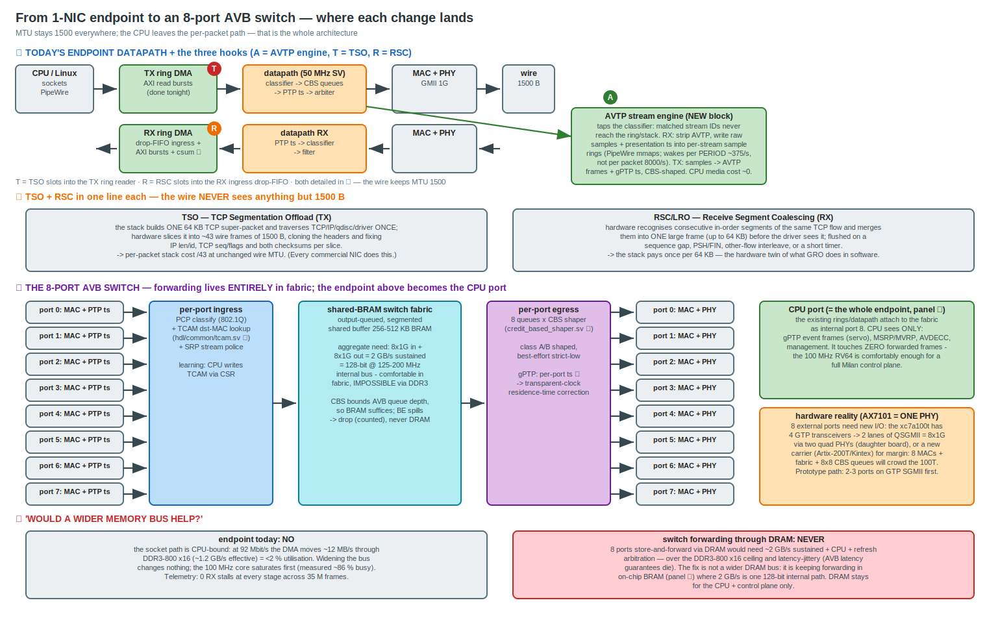

# Direction: from the 1-NIC endpoint to an 8-port AVB switch (MTU fixed at 1500)

*Design note, 2026-07-05. One-picture summary below (source `AVB_SWITCH_DIRECTION.gen.py`,
editable `.drawio`). Companion to [`RX_RING_DMA.md`](RX_RING_DMA.md) (the endpoint ring
DMA work this builds on).*

## The constraint set

* **MTU stays 1500** (interop; AVB frames are small anyway) — so all large-MTU levers are
  off the table, and at 1 Gbps that means **81,274 packets/s ≈ 1,230 CPU cycles/packet**
  on the 100 MHz RV64. No software per-packet path fits in that. Every design below is a
  way of taking the CPU out of the per-packet path.
* **Target platform role: an 8-port AVB switch.** Forwarding 8×1G must not touch the CPU
  at all — the CPU is the control plane (gPTP servo, MSRP/MVRP, AVDECC, management).

## The three endpoint hooks (panel ①/②)

* **A — AVTP stream engine** (the mission-critical one): taps the classifier; matched
  stream IDs bypass ring/driver/stack entirely. RX: strip AVTP, write raw samples +
  presentation timestamps into per-stream sample rings that PipeWire mmaps — the CPU
  wakes **per audio period (~375/s)** instead of per packet (8,000/s/stream). TX mirror:
  sample ring → hardware AVTP framing + gPTP timestamps → CBS. Media cost on the CPU ≈ 0,
  independent of stream count up to line rate.
* **T — TSO** (TCP Segmentation Offload, TX): the stack hands ONE ≤64 KB super-packet
  through TCP/IP/qdisc/driver once; the TX ring reader slices it into 1500-byte wire
  frames (cloned headers, per-slice IP len/id, TCP seq/flags, checksums). Per-packet
  stack cost ÷ ~43 at unchanged wire MTU.
* **R — RSC/LRO** (Receive Segment Coalescing, RX): the ingress drop-FIFO merges
  consecutive in-order segments of one TCP flow into a single large ring frame (flush on
  gap/PSH/FIN/interleave/timer) — the hardware twin of GRO, so the stack pays per-64 KB.

T+R restore (and exceed) the measured large-MTU throughput while the wire never carries
anything but 1500-byte frames. They are classic, bounded, protocol-aware RTL — medium
risk. A is simpler RTL than either and is the Milan roadmap.

## The switch data plane (panel ③)

Per-port MAC + PTP timestamping → per-port ingress (PCP classification + **TCAM** dst-MAC
lookup + SRP policing) → an **output-queued shared-BRAM fabric** → per-port egress with
**8 CBS-shaped queues** → MACs. The existing endpoint (rings, datapath, AVTP engine)
attaches to the fabric as the internal CPU port. Blocks already in the repo and verified:
`tcam.sv`, `credit_based_shaper.sv`, `traffic_classifier.sv`, the PTP timestampers, the
ring DMA engines.

## Memory: "would a wider bus help?" (panel ④)

* **Endpoint, today: no.** The socket path is CPU-bound; at 92 Mbit/s the DMA uses <2 %
  of DDR3-800 x16 (~1.2 GB/s effective). Telemetry: 0 RX stalls across 35 M frames.
* **Switch: the question inverts.** 8×1G in + 8×1G out ≈ **2 GB/s sustained** — above the
  DDR3 ceiling and hostage to refresh/CPU arbitration jitter (AVB latency guarantees
  die). The answer is not a wider DRAM bus but **keeping forwarding on-chip**: 2 GB/s is
  one 128-bit @ 125-200 MHz internal path into a 256-512 KB segmented BRAM buffer. CBS
  bounds AVB queue depth by construction, so BRAM suffices; best-effort overflow drops
  (counted) rather than spilling to DRAM. DRAM remains CPU/control-plane only.

## CPU budget vs the 4-port switch (measured 2026-07-05, xc7a100t = 63,400 LUTs)

The number of CPU cores is **constrained by the switch fabric**, not chosen freely. Measured
Slice-LUT usage with today's 1-port datapath:

| config | Slice LUTs | % of 100T |
|---|---|---|
| 1 core + FPU (rv64imafd, verified) | 48,751 | 77 % |
| 1 core, no FPU | ~43,000 | ~68 % |
| **2 cores + FPU (2-issue)** | **77,366** | **122 % — does NOT fit** |

Going 1→4 GMII adds 3 MACs + the shared-BRAM fabric + TCAM + 4× CBS ≈ **+25–35k LUTs**. So:
one Linux core + the 4-port switch lands **right at the ceiling**; the FPU alongside it is
marginal; **two cores + the 4-port switch cannot fit this part.** Constraints are firm —
**Linux is mandatory** (kept: MMU sv39 + supervisor on every candidate, incl. single-issue) and
**4× GMII is mandatory** — so the 100T production config is **one Linux core + the 4-port
switch** (FPU only if it fits after the fabric lands). Two cores is a deliberate part upgrade
(Artix-200T / Kintex) or a VexiiRiscv swap (smaller cores + higher fmax), **not** a place-time
surprise.

**SMP is coded and ready** for that upgrade: `milan_soc.py --cpu-count 2` (+ the `--scala-args`
passthrough for issue width), a 2-hart DTB (`fpga/dts/milan_ax7101_smp.dts`, regenerated from
the build's `csr.json` with correct PLIC/CLINT contexts), OpenSBI `NAX_HART_COUNT` (set 2 for
SMP), and the kernel's `CONFIG_SMP=y`. Flipping `--cpu-count 2` on a bigger part is all it
takes. The 2-core build was verified to *fit-fail* on the 100T (122 %), which is the point.

## Hardware reality

The AX7101 has **one** PHY. 8 external ports need new I/O: the xc7a100t's 4 GTP
transceivers can carry 8×1G as **2 lanes of QSGMII** into two quad PHYs (daughter
board), or move to a bigger carrier (Artix-200T/Kintex) — 8 MACs + fabric + 64 CBS
queues will crowd the 100T. Prototype path: 2-3 SGMII ports on the GTPs first, with the
current board as the CPU/endpoint port.

## Decision matrix (2026-07-05, scope: **4× GMII/RGMII copper ports**, MTU fixed 1500)

The reframe that drives everything: forwarding lives in fabric, so "1 Gbps through
sockets" is not a goal. The CPU is the control plane + CPU port; sockets need to be
*good enough*, not line-rate.

### Track 1 — switch data plane (the mission)

| # | Work item | Notes at 4-port scope | Risk | Priority |
|---|---|---|---|---|
| S1 | **AVTP stream engine** (panel ① hook A) | Endpoint deliverable + switch CPU-port media path; CPU wakes per audio period, not per packet. **STARTED 2026-07-05**: `hdl/1722/avtp_stream_parser.sv` (stream-id + presentation-time extract + programmable match table, 21/21 harness) — the classifier tap. Next: datapath+CSR integration, then the per-stream sample-ring DMA. | Med | **in progress** |
| S1b | **Per-class ingress** (retire the shared single-classifier ingress) | Removes the head-of-line coupling measured 2026-07-05 (CBS reserved class degraded by BE ingress contention — docs/CBS_DATAPATH_BUG.md); prerequisite for real reservation protection | Med | with S1 |
| S2 | **4-port fabric**: shared-BRAM output-queued + TCAM + per-port CBS egress | Aggregate 1 GB/s = one 128-bit @ 125 MHz BRAM path — comfortable | Med | 2nd |
| S3 | gPTP transparent clock (per-port ts → residence-time correction) | Rides S2 | Med | 2nd |
| S4 | SRP/MSRP + bridge management (software) | Control plane, low rates | Low-Med | 3rd |
| S5 | **3 extra RGMII copper PHYs on the AX7101 expansion headers** | ~12 pins/port × 3 on the 40-pin headers; no SerDes; all GMII lessons (IOB TX FFs, per-PHY gtx-invert A/B) reuse directly. Tasks: header pin/bank audit, PHY daughter card, 100T utilization check | Low-Med | with S2 |
| — | Wider DRAM bus for forwarding | Forwarding never touches DRAM (panel ④) | — | rejected |

### Track 2 — CPU-port socket path at MTU 1500

| # | Work item | Gain | Risk | Status |
|---|---|---|---|---|
| C1 | **Coalescing bundle (driver-only)**: `NETIF_F_SG` + software GSO + checksum-in-copy (`skb_copy_and_csum_dev`); GRO already on | **MEASURED @1500: TX 18.1 → 57.6 Mbit/s (3.2×), RX 57.3 → 63.6** — beats even the MTU-4074 numbers; one 64 KB stack traversal beats 43 | Low | **DONE 2026-07-05** |
| C2 | Diagnose the MTU-1500 "531 spurious retransmits" | **CLOSED, cured by C1**: with GSO, retr = 0 and `TCPLossProbes` delta = 0 over a full run — the storm was an artifact of the per-segment send timing GSO eliminates | Low | **DONE** |
| C3 | Completion IRQ via PLIC | +2-5%, latency | Low | opportunistic |
| C4 | HW TSO / RSC (panel ② as RTL) | The step beyond C1 | High | deferred — C1 captures most of it |
| C5 | SMP 2nd core | ×~1.8 sockets | Med-High | downgraded: a switch control plane doesn't need it |
| C6 | Zero-copy rings / TOE / jumbo / +2.5 MHz | — | — | rejected |

### Track 3 — CPU IPC at constant 100 MHz

| # | Lever | Expected | Risk | Status |
|---|---|---|---|---|
| I1 | **L2 128 → 256 KB** (`milan_soc.py --l2-bytes`, netlist regen via sbt — verified working on this host) | **MEASURED @1500 (ring8, WNS +0.084): TX 57.6 → 62.3 (+8 %), RX 63.6 → 66.7 (+5 %)** — a real win for a config flag; now a deploy.sh default | Low | **DONE 2026-07-05** |
| I2 | L1 I$/D$ + BTB sizing via `--scala-args` | Copy/branch-heavy hot loops | Low-Med | after I1 |
| I3 | Wider dispatch / 2nd ALU (NaxRiscv Scala regen) | +20-50 % integer IPC **if** fmax holds — issue width usually trades against the ~102 MHz Nax ceiling on this -2 Artix | Med-High | prototype build; judge by WNS before believing it |
| I4 | Zba/Zbb bitmanip + `-march` world rebuild | Address/byte-op hot loops | Med | investigate with I2 |
| I5 | RVC (currently no-C) | Fewer I$ misses | Med | only if doing I4 anyway |
| I6 | Hand-tuned rv64 memcpy/csum in driver hot paths | +10-20 % of the copy passes | Low | add-on to C1 |

### Execution order

**C1+C2+I1 (one session, running now)** → S1 (AVTP engine) → S2+S3+S5 (4-port fabric
prototype on copper) → S4 (SRP) → I2/I3 experiments during build waits → C4 only if a
proven CPU-port bulk-TCP requirement appears.

**Production scoreboard @ MTU 1500** (2026-07-05, ring8 + C1 driver): **TX TCP 62.3
Mbit/s 0 retr · RX TCP 66.7 · TX UDP 27.5 lossless · 0 desync/InCsumErrors · 0 fabric
stalls.** (Reference: the same platform measured TX 16.3 / RX 58.4 twenty-four hours
earlier.) Next in sequence: S1 (AVTP engine).

### Step plan for the executed session (C1/C2/I1)

1. Gateware `build_ring8` = ring7 + `--l2-bytes 262144` (new Nax netlist, sbt regen).
2. Driver: `NETIF_F_SG|NETIF_F_HW_CSUM` declared; TX copy is frag-aware
   (`skb_copy_bits`) with checksum-in-copy (`skb_copy_and_csum_dev`) on the linear path
   and a software-csum fallback on the rare ring-wrap path.
3. Boot at **MTU 1500 both ends** (production config), measure: TX/RX TCP + UDP,
   `TcpExtTCPLossProbes`/`TCPSpuriousRTOs` during the TX run (C2 verdict), acceptance
   counters (desync/InCsumErrors == 0), telemetry stalls == 0.
4. A/B the L2 effect: same driver, ring7 (128 KB) vs ring8 (256 KB) numbers.
5. Update this doc + RX_RING_DMA.md with measured results; commit both repos.
