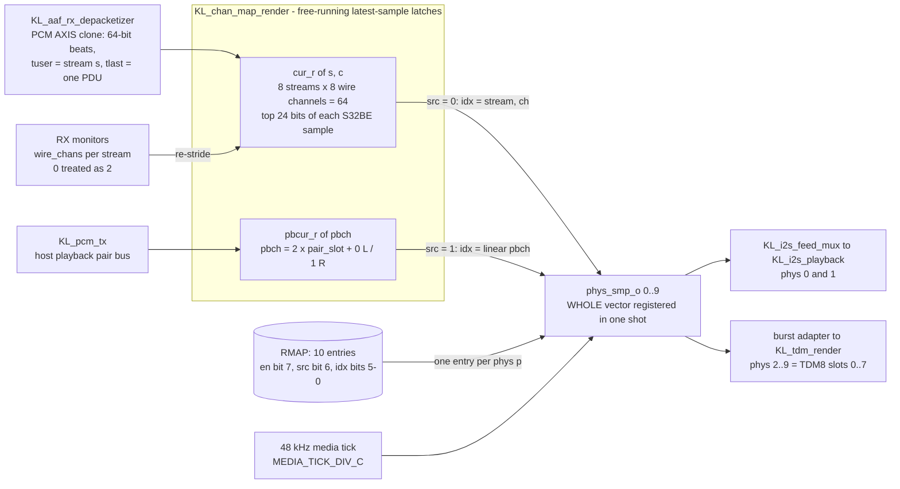
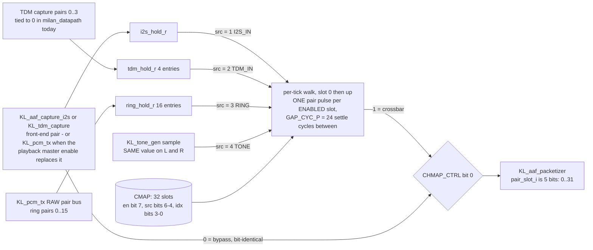
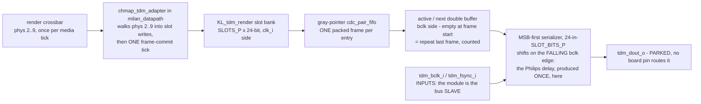

# 64-in / 64-out Channel Mapping — Render Crossbar + Capture Mux + AEM Audio-Map Binding

Normative architecture for the channel-mapping layer on top of the NxN
stream fabric ([`docs/NXN_ARCHITECTURE.md`](NXN_ARCHITECTURE.md), roadmap item 5) and the ALSA
lane (roadmap item 7). Status: **DESIGN — no RTL in this round.**
Decisions in §1–§2 are USER-decided inputs, not open questions.

Companion docs: [`docs/NXN_ARCHITECTURE.md`](NXN_ARCHITECTURE.md) (shared engines, TCTX/LCTX,
the 0x800 indexed window), [`docs/ENDSTATION_BUILDER.md`](ENDSTATION_BUILDER.md) (D1: one
STREAM_PORT per stream, config-selectable clusters),
[`docs/reference/REGISTER_MAP.md`](reference/REGISTER_MAP.md) (CSR ABI authority),
the-private-test-repo `fpga/docs/ALSA_DRIVER_DESIGN.md` (driver side).

## Contents

- **[0. Grounding facts (read from the tree, quoted not assumed)](#0-grounding-facts-read-from-the-tree-quoted-not-assumed)** — Eleven facts G1–G11, each quoted from the RTL or the entity JSON with its file. Two of them set the whole design: G3 (`pair_slot_i` is 4 bits, and 8×8 needs 32 slots) and G7 (any read at/above `0x800` returns 0 unless a term claims it).
- **[1. The 64×64 model](#1-the-6464-model)** — The split that keeps the fabric small: PipeWire composes, the fabric only *selects*. Plus the table fixing every count at the 8×8 shape — 10 physical render channels, 32 TX pair slots, 8-bit map entries — and the parameter each one comes from.
- **[2. ALSA topology + per-stream ring ABI (decided; unchanged ABI)](#2-alsa-topology--per-stream-ring-abi-decided-unchanged-abi)** — Eight 8-channel subdevices per direction, one per stream, over the *existing* PDU-payload ring ABI (S32BE interleaved, base + `s`·stride). Nothing new to implement on the ring side.
- **[3. RENDER crossbar contract (KL_chmap_render, phase-1 name)](#3-render-crossbar-contract-kl_chmap_render-phase-1-name)** — Free-running latest-sample latches with nothing queued, and the whole `phys` vector re-registered in one shot on the media tick — so a mid-tick map edit cannot tear a frame and worst-case remap latency is one sample period.
- **[4. CAPTURE mux contract (KL_chmap_capture, phase-1 name)](#4-capture-mux-contract-kl_chmap_capture-phase-1-name)** — The two ways to be silent that are not the same: `SRC=ZERO` still pulses the slot, `EN=0` skips it. Carries the talker-to-slot arithmetic table (`t` owns `4t..4t+3` at 8 ch) and the required `pair_slot` widening from `[3:0]` to `[4:0]`.
- **[5. MAP RAM — one shared word format](#5-map-ram--one-shared-word-format)** — Answers "I wrote `0x8021`, what did the RAM actually receive?" — the 16-bit CSR word is a transport, each RAM is 8 bits, and the two sides take *different* slices, so the same hex means different things per side. Worked examples and the reset values that reproduce today's wiring.
- **[6. CSR window — 0x900–0x97F (debug override + shadow readback)](#6-csr-window--0x9000x97f-debug-override--shadow-readback)** — Five registers `CHMAP_CTRL/SEL/WORD/STAT`, and the integration trap in bold: without a `rd_in_window` term for `0x900`, every chmap read silently returns 0 — the same defect that hid the servo until 2026-07-23.
- **[7. AEM binding — IEEE 1722.1 dynamic audio maps (Milan es-4.16)](#7-aem-binding--ieee-17221-dynamic-audio-maps-milan-es-416)** — GET_AUDIO_MAP is answered from the AEM store, never from the map RAMs, so a bench CSR poke stays invisible to a controller. Includes the cluster-to-physical table and the pair-consistency rule that refuses a lone half-pair with `BAD_ARGUMENTS`.
- **[8. TDM8 render front-end (summary; module = parallel lane)](#8-tdm8-render-front-end-summary-module--parallel-lane)** — The planned contract, then the correction: the module that actually landed is the bus *slave* (`tdm_bclk_i`/`tdm_fsync_i` are inputs) and `tdm_dout_o` is parked with no board pin. Also pins where the one-bclk Philips delay is produced — once, in the serializer.
- **[9. Clocking and slip policy (phase 1, normative)](#9-clocking-and-slip-policy-phase-1-normative)** — One gPTP-disciplined media clock for everything and no per-stream rate conversion; a stalled source holds its last value, which is the I2S path's existing repeat-last behaviour, so the mapping layer adds no new drift rails.
- **[10. Phase-2 appendix — fabric 64-ch composed device](#10-phase-2-appendix--fabric-64-ch-composed-device)** — Out of scope now, but stated so phase 1 does not paint it out: the word format already carries what composition needs, phase 2 only widens the entry spaces and drops pair granularity.
- **[11. Integration checklist (order matters)](#11-integration-checklist-order-matters)** — Eight steps in dependency order, widening first and the AEM projector last, each with the testbench rows it owes.
- **[12. Silicon validation — the first crossbar walk (2026-07-25)](#12-silicon-validation--the-first-crossbar-walk-2026-07-25)** — All 32 slots on TONE came back sample-exact against the 48-sample period, and the one-slot identity walk gave true digital silence (`nz=0`) at deltas 1, 4 and 8. Scope stated honestly: 1 slot of 32 directly lit. §12.1 gives the per-stream recipe for the full walk and the listener blocker still in the way.

## 0. Grounding facts (read from the tree, quoted not assumed)

| # | Fact | Where verified |
|---|------|----------------|
| G1 | Depacketizer PCM output is a 64-bit AXIS master, one frame per AAF PDU, payload in **wire byte order = S32BE interleaved PCM**, always full 8-byte beats, with `m_axis_tuser[3:0]` = stream index `s` riding each buffered frame | `hdl/ieee1722/aaf/KL_aaf_rx_depacketizer.sv` (header + ports 89–99; "wire byte order = S32BE interleaved PCM", "NXN §1.2: {tuser=s} rides each buffered frame") |
| G2 | Packetizer input is the pair stream `{pair_valid_i, pair_slot_i[3:0], pair_l_i[23:0], pair_r_i[23:0]}`; the pair-slot space is partitioned by a **prefix sum of chans/2** (`pbase_w[t+1] = pbase_w[t] + chans_r[t][3:1]`, `logic [5:0] pbase_w`) — talker `t` owns pair slots `[pbase(t), pbase(t)+chans/2)` | `hdl/ieee1722/aaf/KL_aaf_packetizer.sv` ports 94–98, `pair_base` block |
| G3 | **`pair_slot_i` is 4 bits — 16 slots. 8 streams × 8 ch = 32 pairs. The 8×8 shape structurally exceeds the 4-bit slot space**; the internal ownership compare already zero-extends (`6'(pair_slot_i)` vs `pbase_w[5:0]`), so the widening is interface-level (§4.3) | `KL_aaf_packetizer.sv` line 95 (`input wire [3:0] pair_slot_i`) vs the `[5:0]` prefix sum |
| G4 | The whole capture family shares the pair-stream contract: `KL_tdm_capture` ("emits the same {slot, L, R} pair stream toward KL_aaf_packetizer that KL_aaf_capture_i2s emits"), pairs cross into `clk_i` via a 52-bit gray-pointer `cdc_pair_fifo` (`{cap_slot_r[3:0], cap_l_r[23:0], cap_r_r[23:0]}`); `KL_pcm_tx` is "a drop-in replacement for the physical capture front-end … emits the SAME {pair_valid, pair_slot, pair_l, pair_r} contract", tick-paced ("one media sample tick emits ONE audio sample for EVERY stream and EVERY channel pair") | `KL_tdm_capture.sv`, `KL_pcm_tx.sv` headers |
| G5 | The I2S render path already keeps a latest-sample discipline: `KL_i2s_playback` re-strides the AXIS tap by the **wire-truth** channel count (`wire_chans_i`, "0 until first accept -> 2"), repeats the last pair on underrun, and its physical render is 2-channel (stream ch0/ch1, extras virtual) | `hdl/ieee1722/aaf/KL_i2s_playback.sv` header + walker |
| G6 | `milan_csr` plain-RW readback is a **512-word shadow BRAM covering 0x000–0x7FF only**: `shadow_ram[0:511]`, write gate `wr_fire && !(|wr_addr[ADDR_WIDTH-1:11])`, word address `wr_addr[10:2]` / `rd_addr[10:2]` (milan_csr.sv ~1173–1201). A 0x900 address has bit 11 set → it can never be shadow-served (it would alias word 0x100) | `hdl/common/csr/milan_csr.sv` `shadow_mem` block |
| G7 | Reads **at/above 0x800 return 0 unless explicitly claimed**: `rd_in_window = ~|rd_addr_q[ADDR_WIDTH-1:11] || (rd_addr_q == A_MCSRV_STAT) || (rd_addr_q == A_MCSRV_CTRL)` (milan_csr.sv ~1363). The comment records that 0x8F8 read 0 on every build until 2026-07-23 because this term was missing | `milan_csr.sv` `rd_in_window` + [`REGISTER_MAP.md`](reference/REGISTER_MAP.md) 0x8F8 note |
| G8 | Writes to 0x900+ ARE reachable: the AXI window is 64 KB (`ADDR_WIDTH = 16`) and the write decode is a full-address exact-match `case (wr_addr)` (e.g. `A_MCSRV_CTRL: mcsrv_ctrl <= s_axi_wdata;` at 0x8FC) — new registers above 0x800 follow the MCSRV pattern: dedicated storage + explicit live-read arm + `rd_in_window` term | `milan_csr.sv` write decode ~860–915 |
| G9 | AECP already decodes the audio-map verbs: `CMD_GET_AUDIO_MAP = 15'd43`, `CMD_ADD_AUDIO_MAPPINGS = 15'd44`, `CMD_REMOVE_AUDIO_MAPPINGS = 15'd45`, `DESC_AUDIO_MAP = 16'h0017` | `hdl/ieee17221/aecp/aecp_pkg.sv` 76–78, 128; `KL_aecp_l0_state.sv` 113 |
| G10 | The entity model's mapping entry is `(mapping_stream_index, mapping_stream_channel, mapping_cluster_offset, mapping_cluster_channel)`; every AUDIO_CLUSTER in the model is **1-channel MBLA** (`"channel_count": 1, "format": "MBLA"`), STREAM_PORT_INPUT[0] owns clusters 0–7 (`base_cluster 0`), STREAM_PORT_OUTPUT[0] owns clusters 8–15 (`base_cluster 8`), each port has exactly one AUDIO_MAP (1722.1 7.2.13/7.2.19, builder D1) | `avdecc/milan-v12-entity.json` |
| G11 | Per-stream DRAM PCM rings exist from the NxN work: route flag `DMA` = "payload lands in the stream's DRAM ring at `pcm base + s*stride`"; ring words are "full 64-bit words in wire byte order = S32BE interleaved PCM" | [`REGISTER_MAP.md`](reference/REGISTER_MAP.md) 0x800 route-flags paragraph + PCM-ring section |

## 1. The 64×64 model

Both directions expose **64 stream-channels**: 8 AAF streams × up to 8
channels/stream (Milan base formats, `ut=1` covers 1..8 ch — G10's
format strings). Channel mapping is split into exactly two layers:

1. **PipeWire composition (software)** — cross-stream / cross-channel
   composition for ALSA clients. Driven by the AEM audio-map
   configuration (the daemon reads GET_AUDIO_MAP); no fabric frame
   composer exists in phase 1.
2. **Fabric mapping (this doc)** — two small engines:
   - **RENDER crossbar**: any RX `(stream s ∈ 0..7, wire-ch c ∈ 0..7)`
     → any *physical* output channel (I2S-out ch0..1 + TDM8-out lane 0
     ch0..7 = 10 physical render channels).
   - **CAPTURE mux**: each talker **pair-slot** (the packetizer's G2
     slot space, 32 slots at 8×8) selects its source: I2S-in pair,
     TDM8-in pair, `KL_pcm_tx` ALSA-playback ring pair, tone, or zero.

The fabric never composes frames; it only *selects*. The 64×64 "matrix"
is therefore: RX side = 64 stream-channels fanning into 10 physical
outputs (any-to-any) + 64 ALSA capture channels (per-stream rings,
composed by PipeWire); TX side = 64 stream-channels each fed from a
selected source pair + 64 ALSA playback channels (per-stream rings via
`KL_pcm_tx`).

Every count in that sentence is an elaboration parameter, not a
convention — this is where each one is fixed, at the 8×8 shape
(`N_STREAMS = 8`):

| Quantity | 8×8 value | Where the number comes from |
|---|---|---|
| RX stream-channels latched | 8 streams × 8 wire ch = **64** | `KL_chan_map_render` `cur_r[N_STREAMS_P][N_CH_P]`, instantiated `N_STREAMS_P = N_STREAMS`, `N_CH_P = 8` |
| Physical render channels | **10** (phys 0..9) | `CHMAP_PHYS_C = 10` → `N_PHYS_P` in `milan_datapath.sv` |
| Host-playback render channels | **16** linear `pbch` | `N_PB_SLOTS_P = N_STREAMS`, `PB_CH_C = 2 × N_PB_SLOTS_P` |
| TX pair slots | **32** (8 talkers × 4 pairs) | `KL_chan_map_capture` `N_SLOTS_P = N_STREAMS*4` |
| TDM capture pair sources | **4** | `N_TDM_P = 8` → `N_TDM_PAIRS_C = N_TDM_P/2` |
| ALSA ring pair sources | **16** | `N_RING_P = 16` |
| Map entry width in the RAMs | **8 bits** each side | `map_wr_data_i [7:0]` on both map modules (§5) |

## 2. ALSA topology + per-stream ring ABI (decided; unchanged ABI)

- **8× 8-channel subdevices per direction, one per stream.** Capture
  subdevice `s` fronts listener stream `s`'s DRAM PCM ring; playback
  subdevice `t` fronts talker stream `t`'s ring consumed by
  `KL_pcm_tx`.
- **The ring ABI is today's PDU-payload ABI, unchanged** (G1/G11): full
  64-bit words, wire byte order, S32BE interleaved, INT32
  left-justified (`sample << 8`); ring base + `s`·stride per stream
  (the N×N per-stream ring offsets). The depacketizer writes it; the
  driver mmaps it; `KL_pcm_tx` de-interleaves it byte-identically to
  the packetizer payload (G4).
- Cross-stream/channel composition for ALSA (e.g. "one 16-ch app
  device spanning streams 2+3") is **PipeWire's job**, configured from
  the AEM audio map — never a fabric responsibility in phase 1.

## 3. RENDER crossbar contract (`KL_chmap_render`, phase-1 name)

*Built as `KL_chan_map_render.sv`.* One picture answers the question prose
keeps re-asking: **what decides the sample that leaves physical channel
`p`, and when does a map edit become audible?**



The two latches free-run; **nothing is queued**. A map write lands in the
RAM whenever it arrives, but the whole `phys` vector is re-registered in
one shot on `tick_i`, so a mid-tick edit can never tear a frame — the
worst-case remap latency is one sample period, and the worst-case
staleness of any rendered sample is one sample period.

**Input:** a clone of the depacketizer PCM AXIS (G1) — observe-only
transfers (`tvalid && tready`), exactly like `KL_i2s_playback`'s tap;
`tuser[3:0]` = stream `s`.

**State:** `cur_sample[8][8]` — a 24-bit latest-sample array, streams ×
wire channels. The walker re-strides each PDU frame by that stream's
**wire-truth** channel count (per-stream `wire_chans` from the LCTX
monitor context, the G5 rule generalized per stream): half-beat position
`p` mod `C(s)` latches `cur_sample[s][p]`. `tlast` re-zeros the walk
(PDU = whole sample frames, G1). Channels `c ≥ C(s)` are never written
— they hold reset value 0 (silence).

**Output:** on each media tick (the 48 kHz audio-MMCM grid), for each
physical output channel `p ∈ 0..9`, the xbar reads its map word
(§5) and emits `MAP.EN ? cur_sample[MAP.IDX_HI][MAP.IDX_LO] : 24'd0`
toward the physical serializers:

| Physical channel | Sink |
|---|---|
| 0, 1 | I2S-out L/R (`KL_i2s_playback` serializer path, CS4344) |
| 2..9 | TDM8-out lane 0, slots 0..7 (`KL_tdm_render`, §8) |
| 10..15 | reserved (map entries exist, read 0 / no sink) |

**Semantics (normative):**
- *Wire-truth latching:* what is latched is exactly what the wire
  carried (no format assumption beyond the S32BE re-stride; the AEM
  current-format never overrides the observed `wire_chans` — AAF-4 /
  M-FMT-2 lineage).
- *Unmapped → silence:* `EN = 0` (or an out-of-range source) emits 0.
- *Remap takes effect at the media tick:* map words are read once per
  tick during the output walk; a mid-tick write never tears a frame.
  Worst-case remap latency = one sample period.
- The xbar never backpressures the AXIS tap (G1's tap discipline) and
  adds no per-stream FIFOs: the latch array IS the rate decoupling
  (§9).

The existing 2-channel playback walker inside `KL_i2s_playback` is
subsumed: phase-1 integration feeds the I2S serializer's pair CDC from
xbar channels {0,1} instead of the internal walker (the walker's
underrun/overrun rails and prefill semantics are kept at the CDC).

## 4. CAPTURE mux contract (`KL_chmap_capture`, phase-1 name)

*Built as `KL_chan_map_capture.sv`.* The question here is the mirror of
§3: **what can feed talker pair slot `k`, and what happens to a slot that
is not enabled?**



Two ways to be silent, and they are not the same: `src = 0` (ZERO) and
the reserved values 5..7 still **pulse** the slot, carrying a zero pair;
`en = 0` makes the walk skip the slot and emit no pulse at all. The
second is what keeps a disabled slot from skewing its stream's other
channels (§4.1).

### 4.1 Model

The capture mux becomes the **single authority over the packetizer's
pair-slot space**. Physical front-ends stop being wired straight to the
packetizer; each emits its pair stream with **local** pair numbering,
and the mux emits the global `{pair_valid, pair_slot, pair_l, pair_r}`
per its map.

**Sources** (per pair): `I2S_IN` (one pair, `KL_aaf_capture_i2s`),
`TDM8_IN` (4 pairs, `KL_tdm_capture` — G4), `PCM_TX` (ALSA playback
rings, up to 4 pairs per talker stream, `KL_pcm_tx` — G4), `TONE`
(`KL_tone_gen` 24-bit sample on both L and R), `ZERO`.

**State:** per-source latest-pair latch registers (`cur_pair[src]`),
written on each source `pair_valid` pulse — the same latest-sample
discipline as §3, so arbitrary fan-out (many slots selecting one source
pair) costs nothing.

**Output pacing:** on each media tick the mux walks all 32 pair slots
and emits one `{slot k, L, R}` pulse per **enabled** slot from the
selected source's latch — exactly the pacing model `KL_pcm_tx` already
implements for its slots (G4: "one media sample tick emits ONE audio
sample for EVERY stream and EVERY channel pair"), so the packetizer's
6-sample epoch cadence is preserved for every stream. Disabled slots
emit nothing; the packetizer's slot-structural addressing (G2:
"channel alignment is slot-structural") guarantees a disabled slot can
never skew its stream's other channels — that stream's sample rows
simply never complete, and the stream stays silent on the wire.

**Slot arithmetic — which slots belong to talker `t`.** The packetizer
partitions the slot space by a prefix sum of `chans/2` (G2), so with a
*uniform* per-talker channel count `C` talker `t` owns
`[t·C/2, t·C/2 + C/2)`. The host playback ring is a separate index space:
`KL_pcm_tx` is elaborated `CHANS_P = 2`, so its pair slot **is** the
talker index and its linear channels are `2t` / `2t+1`. Both, side by
side, for the 8×8 shape:

| Talker `t` | CMAP pair slots at `C` = 8 | CMAP pair slot at `C` = 2 | `KL_pcm_tx` linear `pbch` |
|---|---|---|---|
| 0 | 0–3 | 0 | 0, 1 |
| 1 | 4–7 | 1 | 2, 3 |
| 2 | 8–11 | 2 | 4, 5 |
| 3 | 12–15 | 3 | 6, 7 |
| 4 | 16–19 | 4 | 8, 9 |
| 5 | 20–23 | 5 | 10, 11 |
| 6 | 24–27 | 6 | 12, 13 |
| 7 | 28–31 | 7 | 14, 15 |

The `C` = 8 column is the one the §12.1 walk recipe means by "slots
`4j..4j+3`". Note that a *non*-uniform `chans` configuration invalidates
the closed form and only the prefix sum holds — which is why the map is
programmed per slot and never per stream.

### 4.2 Pair granularity (phase-1 restriction, normative)

The capture path is **pair-granular**: L and R of a slot come from ONE
source pair. AEM output-side mappings must therefore arrive
pair-consistent (§7.3); a mapping that would split a pair across
sources or cross L/R parity is refused. Per-channel capture routing is
phase 2.

### 4.3 The pair-slot widening (REQUIRED, normative)

`KL_aaf_packetizer.pair_slot_i` is `[3:0]` today (G3) — a 16-slot
space. The prefix-sum partition at 8 streams × 8 ch needs **32 pair
slots**, so:

> **`pair_slot` widens from `[3:0]` to `[4:0]` across the entire
> pair-stream contract** before any stream whose cumulative pair base
> reaches 16 can be addressed: `KL_aaf_packetizer.pair_slot_i`,
> `KL_aaf_capture_i2s.pair_slot_o`, `KL_tdm_capture.pair_slot_o`
> (incl. `cap_slot_r` and the CDC payload — the 52-bit
> `cdc_pair_fifo` word `{slot[3:0], L[23:0], R[23:0]}` becomes 53
> bits), `KL_pcm_tx`'s slot walk, and the new capture mux output.

The packetizer's *internal* ownership decode needs no logic change —
`pbase_w` is already `[5:0]` and the compares already zero-extend
(`6'(pair_slot_i)`, G3); only the port and its `6'(...)` casts widen.
The N=1 golden byte-compare gates stay green by construction (slot 0
encodings are identical in 4 and 5 bits).

## 5. MAP RAM — one shared word format

Two map RAMs, ONE word format (16 bits stored; CSR view zero-extends
to 32). Per the defect-4 house rule each RAM has one sync write process
and one explicit sync read port.

| RAM | Entries | Entry index |
|-----|---------|-------------|
| `RMAP` (render) | 16 × 16 b | physical output channel `p` (0..15; 10 used, §3) |
| `CMAP` (capture) | 32 × 16 b | packetizer pair-slot `k` (0..31 — the §4.3 widened space) |

**MAP word format (both sides, normative):**

```
[15]    EN      entry enabled. 0 = render: silence / capture: slot not emitted
[14:12] SRC     source class
                  render side : 0 = AVTP_RX, 1 = PCM_TX (host playback
                                ring, roadmap item-7); 2-7 reserved
                  capture side: 0 = ZERO, 1 = I2S_IN, 2 = TDM8_IN,
                                3 = PCM_TX, 4 = TONE, 5-7 reserved
[11:8]  rsvd    write 0, read 0
[7:4]   IDX_HI  render : AVTP_RX: RX stream index s (0-7)
                         PCM_TX : high half of the LINEAR playback channel
                capture: source stream/lane — PCM_TX: talker stream t (0-7);
                         TDM8_IN: lane (0 in phase 1); I2S_IN/TONE/ZERO: 0
[3:0]   IDX_LO  render : AVTP_RX: wire channel c (0-7)
                         PCM_TX : low half of the LINEAR playback channel
                capture: source pair index — TDM8_IN: 0-3; PCM_TX:
                         pair-within-stream 0-3; I2S_IN/TONE/ZERO: 0
```

Nibble-aligned on purpose (hex-readable on the bench: `0x8021` =
EN | AVTP_RX | stream 2 | channel 1). The 4-bit index fields match the
fabric-wide "spec-fixed 4-bit stream index" convention (G1's `tuser`).
Illegal encodings (reserved SRC, out-of-range index for the elaborated
shape) behave as `EN = 0` — never a lockup, RTL-enforced.

**As wired today (`milan_datapath.sv`, the two `map_wr_data_i` slices).**
The 16-bit CSR word is the *transport*; each RAM is **8 bits wide** —
`RMAP` is `N_PHYS_P` = 10 entries deep, `CMAP` is `N_SLOTS_P` = 32 — and
the two sides take **different slices** of the same word, which is why
the same hex constant does not mean the same thing on both sides. This
table is the answer to "I wrote `0x8021`, what did the RAM actually
receive?":

| `CHMAP_WORD` bit | Render side (`CHMAP_SEL[8] = 0` → RMAP) | Capture side (`CHMAP_SEL[8] = 1` → CMAP) |
|---|---|---|
| `[15]` | `en` (RAM bit 7) | `en` (RAM bit 7) |
| `[14:13]` | *dropped* | `src` high 2 bits (RAM bits 6:5) |
| `[12]` | `src` — the whole 1-bit source bank (RAM bit 6): 0 = AVB listener, 1 = host playback ring | `src` low bit (RAM bit 4) |
| `[11:7]` | *dropped* | *dropped* |
| `[6:4]` | `idx[5:3]` — AVB stream `s`, or `pbch[5:3]` | *dropped* |
| `[3]` | *dropped* | `idx[3]` |
| `[2:0]` | `idx[2:0]` — AVB wire channel `c`, or `pbch[2:0]` | `idx[2:0]` |

So the render RAM entry is `{en, src, idx[5:0]}` and the capture RAM
entry is `{en, src[2:0], idx[3:0]}`. Bit `[7]` and bits `[11:8]` reach
neither RAM; the render side additionally drops `[3]`, so **both of its
index nibbles are carried 3 bits wide** — streams 0..7 and channels
0..7, exactly the 8×8 shape, and nothing wider is expressible without a
wider entry. Out-of-range indexes are guarded at the RAM *read*, not at
the write port, and render as 0 / silence.

Worked examples, hex as typed at the bench:

| CSR word | Side | RAM entry | Meaning |
|---|---|---|---|
| `0x8021` | render | `0x91` | EN, AVB, stream 2, channel 1 |
| `0x9002` | render | `0xC2` | EN, playback ring, linear `pbch` 2 = pair slot 1 LEFT |
| `0x9000` | capture | `0x90` | EN, `I2S_IN`, pair 0 — the legacy talker-0 wiring |
| `0xC000` | capture | `0xC0` | EN, `TONE` — the §12 all-slots pilot probe |
| `0x8000` | capture | `0x80` | EN, `ZERO` — a slot that pulses digital silence |

**Render `SRC = 1` (PCM_TX), normative.** On the render side the two
index nibbles are NOT a `{stream, channel}` split: they concatenate into
one **linear playback channel** `pbch = 2*pair_slot + (0 = L, 1 = R)`
over `KL_pcm_tx`'s pair bus, so `0x9002` = EN | PCM_TX | playback
channel 2 = pair slot 1's LEFT sample. With the datapath's all-stereo
NxN shape (`CHANS_P = 2`) pair slot == talker stream index, so talker
`t` owns `pbch` `2t` / `2t+1`. `SRC = 0` keeps its original split
verbatim, and the AEM projector only ever emits `SRC = 0`, so every map
word written before item-7 means exactly what it did.

**Reset state (N=1 bit-compat axiom):** `RMAP[0] = 0x8000` (EN,
AVTP_RX, s=0, c=0), `RMAP[1] = 0x8001`, all other RMAP = 0 — today's
"stream 0 renders ch0/ch1 on I2S" behavior. `CMAP[0] = 0x9000` (EN,
I2S_IN, pair 0) — today's I2S-capture-feeds-talker-0 wiring. All other
CMAP = 0.

**Write-port arbitration (one port, normative):** AEM-projector commit
wins the port; the CSR debug write takes idle cycles and is *refused*
(counted, §6) if it collides with an in-flight AEM burst — mirroring
the packetizer's `tctx_wmux` priority pattern. There is exactly one
map truth: CSR reads shadow the same RAM the AEM writes (§6).

## 6. CSR window — 0x900–0x97F (debug override + shadow readback)

**Decode finding (from G6/G7/G8, drives the implementation):** offset
0x900 is *reachable* — the AXI window is 64 KB and the write decode is
full-address exact-match — **but** (a) the plain-RW shadow BRAM spans
0x000–0x7FF only (`shadow_ram[0:511]`, `wr_addr[10:2]` slice,
milan_csr.sv ~1188–1201): chmap words must NOT be listed in
`is_plain_rw` (a 0x900 shadow write would alias word 0x100); and (b)
the read gate `rd_in_window` (milan_csr.sv ~1363) zeroes every read ≥
0x800 that no term claims — **integration MUST add a
`(rd_addr_q >= 'h900 && rd_addr_q < 'h980)` term**, or every chmap
read silently returns 0 (the exact 0x8F8 dead-read trap: the servo ran
invisibly on every build until 2026-07-23). New registers follow the
MCSRV pattern: dedicated storage, live/window read arm, `rd_in_window`
term.

Indexed window (O(1) decode, the 0x800-window house style; 0x900–0x97F
reserved to this feature, 5 words used):

| Offset | Name | Acc | Reset | Fields |
|--------|------|-----|-------|--------|
| `0x900` | `CHMAP_CTRL` | RW | `0` | `[0]` csr_write_en — debug override arm; while 0, `CHMAP_WORD` writes are ignored (AEM remains the sole programmer). Readback live |
| `0x904` | `CHMAP_SEL` | RW | `0` | `[5:0]` entry index, `[8]` side (0 = RMAP/render, 1 = CMAP/capture). Out-of-range entries read 0, writes ignored (the 0x800-window out-of-range rule) |
| `0x908` | `CHMAP_WORD` | RW | — | `[15:0]` the §5 map word of the selected entry. Write: commits through the shared write port (requires `CHMAP_CTRL[0]`; refused while an AEM burst holds the port). Read: **as built, this is `milan_csr`'s own SHADOW of the last word software wrote — not the RAM.** The "entry's CURRENT word" this row originally specified is served by `CHMAP_LOOP` `0x914` instead (VERSION `0x0017`), as a new register rather than a semantic change to `0x908`, so the existing ABI is untouched |
| `0x90C` | `CHMAP_STAT` | RO | `0` | `[15:0]` aem_commits (map words written by the AEM projector, wraps), `[23:16]` csr_refused (CSR writes dropped: override disarmed or port collision; saturates), `[24]` aem_busy (projector burst in flight) |
| `0x910` | `CHMAP_SNAP` | W1S / RO | `0xC500_0000` | **LANDED, VERSION `0x0017`.** W `[0]` arm a readback of the entry named by `CHMAP_SEL`; R busy/valid/timeout/unsupported/armed + the `CHMAP_RDBK_P` capability in `[9:8]` + the latched `{side,index}` + a constant `0xC5` tag. Full fields in [`REGISTER_MAP.md`](reference/REGISTER_MAP.md) |
| `0x914` | `CHMAP_LOOP` | RO | `0xDEAD_DEAD` | **LANDED, VERSION `0x0017`.** The word the map RAM *actually holds* — the "shadow readback" this section always promised, finally served from the RAM read port rather than from `0x908`'s copy of what software wrote. `[18]` `LOOP_SUSPECT` = mapped & ~fed. Un-armed reads `0xDEADDEAD`, never `0` (`0` is a legal map entry) |
| `0x918`–`0x97C` | — | — | `0` | reserved (phase 2: flat per-entry view / composed-device controls) |

[`REGISTER_MAP.md`](reference/REGISTER_MAP.md) gains the `0x900` group row; `VERSION` minor bumps
(additive change).

## 7. AEM binding — IEEE 1722.1 dynamic audio maps (Milan es-4.16)

The canonical programmer of both map RAMs is the AECP engine handling
`ADD_AUDIO_MAPPINGS` / `REMOVE_AUDIO_MAPPINGS` / `GET_AUDIO_MAP`
(command values 43/44/45 and `DESC_AUDIO_MAP = 0x0017` already decoded
— G9). The CSR window is the debug override (§6). **Arbitration: one
write port per RAM, AEM wins, CSR is shadow-readable always.**

### 7.1 Authority model

The **AEM dynamic-map store** (the descriptor-side mapping list) is the
readback authority: `GET_AUDIO_MAP` is answered from it, never from the
map RAMs. The map RAMs are a *projection* of the store onto the
physical fabric — derived state. This keeps GET_AUDIO_MAP complete even
for mappings that have no fabric backing (§7.2's PipeWire-domain
entries) and keeps the fabric words free to be CSR-poked on the bench
without corrupting AEM readback (a CSR override is bench-visible in
`CHMAP_WORD`, not in GET_AUDIO_MAP).

### 7.2 Cluster ↔ physical-channel table

A mapping entry is `(mapping_stream_index, mapping_stream_channel,
mapping_cluster_offset, mapping_cluster_channel)` (G10). Global cluster
= the port's `base_cluster` + `cluster_offset`; every cluster in the
model is 1-channel MBLA, so `mapping_cluster_channel = 0` always
(non-zero → refused, `BAD_ARGUMENTS`).

The **cluster↔physical table** is emitted by the end-station builder
(the same config that sizes streams — [`ENDSTATION_BUILDER.md`](ENDSTATION_BUILDER.md) D1/D2)
and baked into the AEM projector as a small ROM. Phase-1 default shape
(1×1 model, G10; the 8×8 overlay generalizes the same pattern
port-by-port):

| Global cluster | Model object | Physical backing |
|---|---|---|
| 0, 1 (`STREAM_PORT_INPUT[0]`, offsets 0–1) | "Input" MBLA ×1 | RMAP entries 0, 1 (I2S-out L/R) |
| 2..7 (offsets 2–7) | "Input" MBLA ×1 | RMAP entries 2..7 (TDM8-out lane 0 slots 0..5) — present only when the TDM8 render lane is built; otherwise ALSA-only |
| 8..15 (`STREAM_PORT_OUTPUT[0]`, offsets 0–7) | "Output" MBLA ×1 | capture sources: builder assigns each output cluster a `{SRC, IDX_HI, IDX_LO}` triple (I2S-in pair, TDM8-in pair 0..3, PCM_TX ring pair, TONE) |

Clusters with no physical backing (the common case at 8×8: 64 input
clusters vs 10 physical render channels) are **ALSA/PipeWire-domain**:
their mappings live only in the AEM store and steer PipeWire
composition (§1 layer 1). The projector simply emits no fabric word for
them.

### 7.3 Projection rules (normative)

**Input side** (`ADD_AUDIO_MAPPINGS` on a `STREAM_PORT_INPUT`), per
entry: if the global cluster is physical-backed with RMAP entry `p`:

```
RMAP[p] = {EN=1, SRC=AVTP_RX, IDX_HI=mapping_stream_index[3:0],
           IDX_LO=mapping_stream_channel[3:0]}
```

`REMOVE_AUDIO_MAPPINGS` of a matching entry → `RMAP[p].EN = 0`.
`mapping_stream_index ≥ 8` or `mapping_stream_channel ≥ 8` → refused.

**Output side** (`STREAM_PORT_OUTPUT`), per entry: target slot
`k = pbase(mapping_stream_index) + mapping_stream_channel/2` (the G2
prefix-sum partition; `pbase` from the same chans configuration the
TCTX holds). **Pair-consistency rule (§4.2):** entries are accepted in
L/R-consistent pairs — the even `mapping_stream_channel` entry and its
`+1` partner must name the same source pair (adjacent even/odd
clusters of one source pair per the §7.2 table). The even entry
commits:

```
CMAP[k] = {EN=1, SRC=table(cluster).src, IDX_HI=table(cluster).idx_hi,
           IDX_LO=table(cluster).idx_lo}
```

A lone half-pair mapping, mismatched parity, or a pair straddling two
sources → the whole command is refused with `BAD_ARGUMENTS` (phase-1
pair granularity; per-channel capture is phase 2).

**Timing:** the projector writes map words through the §5 arbitrated
port as a short burst (`aem_busy` in `CHMAP_STAT`); fabric effect lands
at the next media tick (§3/§4 tick sampling). The AECP response is sent
after the burst commits (the store and the projection never diverge
observably).

## 8. TDM8 render front-end (summary; module = parallel lane)

`KL_tdm_render.sv` is being built as a parallel worktree lane; this doc
pins its contract as the mirror of `KL_tdm_capture` (G4 conventions):

- 8 slots × `WORD_BITS_P` (32 default) per frame, MSB first, samples
  left-justified 24-in-slot; `DATA_DELAY_P` 0/1 applied ONCE here
  (never also in a TB chip model — the double-Philips-delay lesson,
  78bbabe).
- Phase-1 clocking: **we are bus master** on the render side — bclk/
  fsync generated from the clean audio MMCM by plain registered
  dividers (the `KL_i2s_playback` clean-clock discipline; never a
  fractional-N edge), `tdm_mclk_o` = clk_audio/2 shared with capture.
- Feed: 8 mapped channels per media tick from the render xbar cross
  one widened `cdc_pair_fifo`-style crossing into the bclk domain
  (one crossing for the whole lane — the §4 CDC-does-not-multiply
  rule of [`NXN_ARCHITECTURE.md`](NXN_ARCHITECTURE.md) §4).
- Status: `frames_out` liveness counter, CSR-exposed later (not in the
  0x900 window; it is a front-end, not the map).

That lane has since landed as `hdl/ieee1722/aaf/KL_tdm_render.sv`. The
chain below is the answer to **how a rendered channel becomes a TDM bit,
and where the one-bclk Philips delay is produced** — the hop the prose
above cannot hold, because it crosses a clock domain twice:



One honest correction the diagram forces: the built module is the bus
**slave** — `tdm_bclk_i` / `tdm_fsync_i` are inputs driven by the
codec/DSP master, per the `KL_tdm_render.sv` header, which also states
the symmetry rule ("the master shifts on the falling edge", so this
render shifts there). The "we are bus master, dividers off the audio
MMCM" bullet above is the phase-1 *plan*, not what the RTL does.

## 9. Clocking and slip policy (phase 1, normative)

- All AAF streams and both physical directions share the
  **gPTP-disciplined media clock** (the coherent chain: audio MMCM +
  CRF/MMCM-DRP servo, silicon-proven). There is **no per-stream SRC in
  phase 1**.
- The latch arrays (§3 `cur_sample`, §4 `cur_pair`) implement
  **latest-sample semantics**: at each media tick every consumer reads
  the newest value ≤ 1 sample old. Bounded inter-stream phase skew is
  absorbed; a stalled/unbound source simply holds its last value
  (render: last sample, then silence on unmap; capture: last pair) —
  the same repeat-last slip-dup the I2S path already uses (G5), with
  the existing per-stream monitor rails counting the underlying
  events. No new drift rails are introduced by the mapping layer
  itself.
- Remap effect point = media tick (§3/§4): switching sources produces
  at worst one sample-step discontinuity; no ramping in phase 1.

## 10. Phase-2 appendix — fabric 64-ch composed device

Phase 2 (explicitly out of scope now) lifts the PipeWire-only
composition into fabric as a **composed 64-channel device**: a frame
composer that presents one contiguous 64-ch ALSA view (single ring)
built from all 8 streams. It reuses THIS map infrastructure unchanged
in kind:

- The §5 word format already carries what composition needs
  (`SRC/IDX_HI/IDX_LO`); phase 2 only *widens the entry spaces* (RMAP
  grows past 16 entries to cover composed-device channels; CMAP's
  capture side gains `SRC = AVTP_RX` for stream→stream bridging).
- The 0x910–0x97C reserved window hosts the composed-device controls.
- The pair-granularity restriction (§4.2) is dropped (per-channel
  capture staging).

Nothing in phase 1 may assume the map RAM is consulted only by the two
phase-1 engines.

## 11. Integration checklist (order matters)

1. **Pair-slot widening (§4.3)** — `[3:0]` → `[4:0]` through
   `KL_aaf_packetizer` / `KL_aaf_capture_i2s` / `KL_tdm_capture`
   (CDC 52→53 b) / `KL_pcm_tx`; N=1 golden byte-compare TBs must stay
   green untouched.
2. **Capture mux in** — insert `KL_chmap_capture` between the
   front-ends and the packetizer; front-ends drop to local pair
   numbering; CMAP reset value reproduces today's wiring (§5). TB:
   tick-paced walk, fan-out, disabled-slot silence, slot-structural
   alignment under drops.
3. **Render xbar in** — `KL_chmap_render` on a depacketizer AXIS
   clone; I2S serializer fed from xbar ch {0,1} (walker subsumed,
   rails kept); RMAP reset reproduces today's ch0/ch1 render. TB:
   wire-truth re-stride per stream, unmapped silence, remap-at-tick.
4. **CSR** — `milan_csr`: `A_CHMAP_*` constants, dedicated
   storage + write-decode arms (G8 pattern), live read arms, and the
   **`rd_in_window` 0x900–0x97F term (G7 — the dead-read trap)**; NOT
   in `is_plain_rw` (G6). [`REGISTER_MAP.md`](reference/REGISTER_MAP.md) group row + VERSION minor
   bump. TB: csr harness window rows incl. the ≥0x800 read gate.
5. **TDM8 render lane merge** (§8) — parallel lane lands
   independently; until merged, RMAP entries 2..9 are writable but
   sink-less (harmless by §3 semantics).
6. **AEM projector** — commit path from the AECP audio-map verbs (G9)
   to the arbitrated map write port; cluster↔physical ROM emitted by
   the builder; GET_AUDIO_MAP from the dynamic store (§7.1);
   pair-consistency refusal (§7.3). TB: aecp harness ADD/REMOVE/GET
   rows + projection vectors + refusal rows.
7. **8×8 elaboration** — `N_TALKERS_P = 8` / `N_LISTENERS_P = 8`
   shapes with per-stream rings; builder overlays emit the 8-port
   cluster blocks + maps (G10 pattern per port); estimator re-run
   (the map layer is small: 2 LUTRAM-class RAMs + latch arrays ≈
   64×24 b + walk FSMs — but measure, don't assume: OOC-synth before
   believing any area number).
8. **Docs/tests close-out** — SPEC_TRACEABILITY rows (1722.1
   7.2.19 / es-4.16), behave-suite scenarios (roadmap 10), this doc
   flipped DESIGN → AS-BUILT per phase.

## 12. Silicon validation — the first crossbar walk (2026-07-25)

Run on the deployed 8×8 chmap bitstream, with the second board's PCM ring
(pair 0 of its bound stream) as the observation window and the pilot tone
(`TONE_CTRL`) as the probe. All programming through the `0x900` bench window
([REGISTER_MAP](reference/REGISTER_MAP.md) `CHMAP_*` rows).

**All-slots proof (G2).** Every capture slot set to `{EN, SRC=TONE}`
(`0xC000`, 32/32 commits in `CHMAP_STAT`): the window shows a full-scale
1 kHz sine, 24-in-32, **sample-exact against the 48-sample period** within
every continuous span of the dump. The seams between spans are the dump
tool's chunk cadence (spacing 5860 samples, zero jitter) with the stream
error counters static - tooling, not path. The digital path delivers the
generator's quality end to end: wire, bridge, depacketizer, ring.

**Identity walk (G3, observable window).** One slot at a time set to TONE,
all others `{EN, SRC=ZERO}`:

| delta on slot | window (stream 0, pair 0) | verdict |
|---|---|---|
| 0 | tone (repeated at walk start AND end) | slot 0 ↔ stream 0 pair 0 |
| 1 | digital silence | no intra-stream pair leak |
| 4 | digital silence | no cross-stream leak |
| 8 | digital silence | kills the pair-major layout misread |

The ZERO source is true digital silence (`nz=0` over a full ring), so the
negatives are exact, not thresholded.

**Scope honestly stated:** this proves the map word decode and the crossbar
mux on the reachable window - 1 of 32 slots directly lit, 3 adjacent
negatives, with the remaining slots driven by the same TB-proven mux logic.
The full 64-channel walk needs a listener that exposes more than one pair
(the NxN ring engine, or an 8-channel ALSA capture on refreshed listener
images) plus per-stream talker arming through the lwSRP admission gate -
that is the next bench lane.

### 12.1 What the full 64-slot walk needs now (2026-07-26)

Two of the three missing pieces are now built; the recipe below is the one to
run on the next flash.

**Built since the first walk.** `VERSION 0x0001_000C` answers `CONNECT_TX` /
`PROBE_TX` for **every talker uid `0..N-1`** with `dmac = MAAP base + uid`
(the MAAP claim already reserves a block of 8), and `t > 0` admission now
mirrors the `t = 0` term-by-term. So a listener can be bound to stream *j*
through a **real Milan probe** instead of a bench poke - that is the
per-stream arming the walk was missing.

**The walk, per stream j = 0..7** (one bound at a time, sequential):

1. Stage talker context *j* through the `0x800` window (`SID`, `DMAC` =
   MAAP base + j, `CTRL`), **with the lwSRP engine on** - engine-off window
   writes are dropped, and the arm truth is a snapped
   `A_STRMW_STATE 0x82C[3]` ([TROUBLESHOOTING §22](limitations/TROUBLESHOOTING.md)).
2. Bind the listener to talker uid *j* with one controller `CONNECT_RX`
   ([PipeWire peer guide](integration/PIPEWIRE_AVB_PEER.md) §6). The probe
   response carries `dmac = base + j`; capture that line - it is the
   per-stream evidence.
3. Walk slots `4j..4j+3` through the `0x900` window: all-on, pair-bit0,
   pair-bit1, all-off, checking the commit count in `CHMAP_STAT`.
4. Verify at the listener's ring, plus paced `PDUS` on the talker window and
   `wire_chans` on the listener's stream window.

**Still missing: a listener window wider than one pair.** A single 2-channel
ring shows pair 0 of the bound stream only, so pairs 1-3 of each stream stay
covered by the crossbar + packetizer frame-placement TB proof rather than by
direct observation (the honest scope statement of §12 still stands). Closing
it needs the NxN ring engine or an 8-channel ALSA capture on a refreshed
listener image.

**And one blocker.** On the currently flashed gateware the fabric listener
never accepts a bound stream
([KNOWN_ISSUES §1.1](limitations/KNOWN_ISSUES_AND_LIMITATIONS.md)), so the
listener-side half of every verification step above has to be re-checked on
the next netlist before the walk is trusted.
