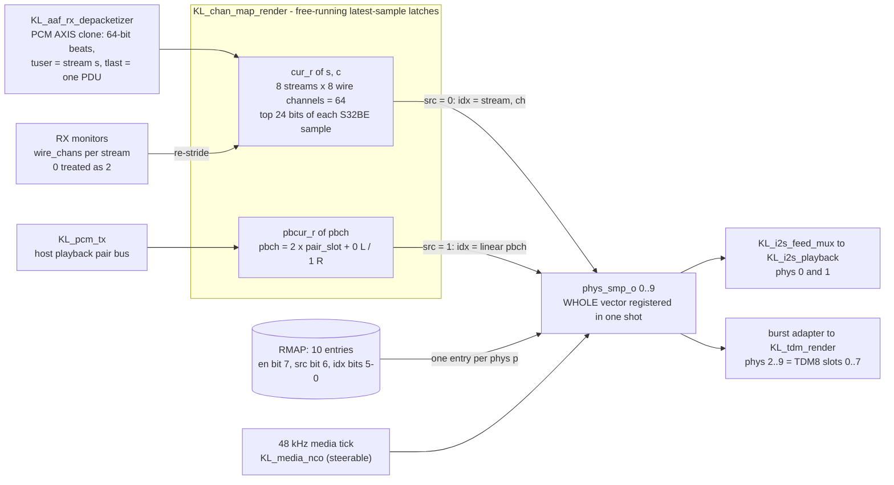
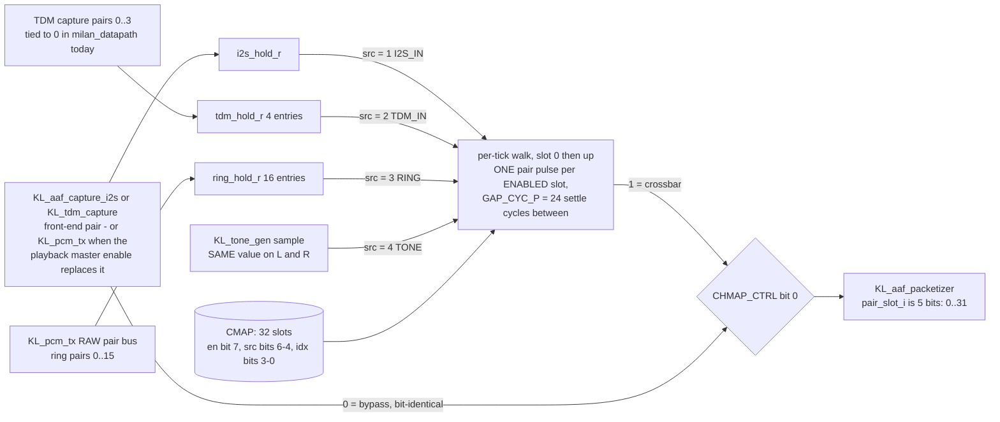
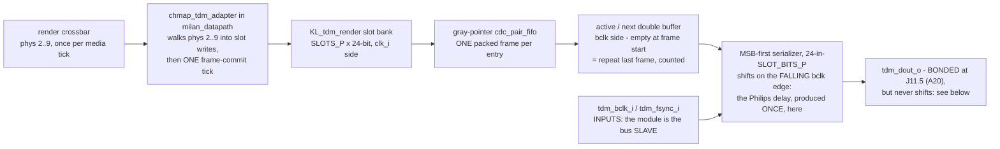

# 64-in / 64-out Channel Mapping -- Render Crossbar + Capture Mux

Current implementation guide for the channel-mapping layer on top of the
multi-stream fabric and ALSA lane. Status: **AS BUILT**.

> **CURRENT BOUNDARY (2026-08-17).** `KL_chan_map_render` and
> `KL_chan_map_capture` are integrated, and the pair-slot path is five bits
> wide for all 32 slots. The current processor serves `GET_AUDIO_MAP` for both
> Stream Port Input and Stream Port Output. Dynamic ports also serve
> `ADD_AUDIO_MAPPINGS` and `REMOVE_AUDIO_MAPPINGS` through an atomic
> processor-to-root transaction. Therefore:
>
> * **AECP is the controller-facing programmer of both map RAMs.** The CSR
>   `0x900` window remains a local debug and override path. Its map writes are
>   refused while `LOCK_ENTITY` is held, as required for a non-ATDECC path;
> * **nothing seeds the RAMs.** `CMAP` resets all-zero and stays that way
>   until AECP or software writes it. Nonvolatile replay remains open in
>   issue #70.
>
> §7 records the implemented validation and projection contract.

Companion docs: [`docs/overview/FULL_FPGA_SOLUTION.md`](overview/FULL_FPGA_SOLUTION.md)
(current system integration), [`docs/ENDSTATION_BUILDER.md`](ENDSTATION_BUILDER.md) (D1: one
STREAM_PORT per stream, config-selectable clusters),
[`docs/reference/REGISTER_MAP.md`](reference/REGISTER_MAP.md) (CSR ABI authority),
the-private-test-repo `fpga/docs/ALSA_DRIVER_DESIGN.md` (driver side).

## Contents

- **[0. Grounding facts (read from the tree, quoted not assumed)](#0-grounding-facts-read-from-the-tree-quoted-not-assumed)** -- Eleven facts G1-G11, each quoted from the RTL or entity JSON. G3 records the landed five-bit slot path, and G7 records the explicit high-address read decode.
- **[1. The 64×64 model](#1-the-6464-model)** -- PipeWire composes while the fabric selects. The section fixes the counts and parameters for the 8x8 shape.
- **[2. ALSA topology + per-stream ring ABI (decided; unchanged ABI)](#2-alsa-topology--per-stream-ring-abi-decided-unchanged-abi)** -- Eight 8-channel subdevices per direction, one per stream, over the *existing* PDU-payload ring ABI (S32BE interleaved, base + `s`·stride). Nothing new to implement on the ring side.
- **[3. RENDER crossbar contract (KL_chmap_render, phase-1 name)](#3-render-crossbar-contract-kl_chmap_render-phase-1-name)** -- Free-running latest-sample latches feed one atomic physical-output update on each media tick.
- **[4. CAPTURE mux contract (KL_chmap_capture, phase-1 name)](#4-capture-mux-contract-kl_chmap_capture-phase-1-name)** -- The two ways to be silent that are not the same: `SRC=ZERO` still pulses the slot, `EN=0` skips it. Carries the talker-to-slot arithmetic table and the landed five-bit pair-slot path.
- **[5. MAP RAM: the two word formats](#5-map-ram-the-two-word-formats)** -- Defines the render and capture stores, their entry fields, and their distinct readback packing.
- **[6. CSR window: 0x900-0x97F (debug and override)](#6-csr-window-0x900-0x97f-debug-and-override)** -- Documents the local override writer, its arm sequence, status counters, and live RAM readback.
- **[7. AEM binding -- IEEE 1722.1 dynamic audio maps (Milan es-4.16)](#7-aem-binding----ieee-17221-dynamic-audio-maps-milan-es-416)** -- Records the implemented getter, transactional writers, and projection contract.
- **[8. TDM8 render front-end (summary; module = parallel lane)](#8-tdm8-render-front-end-summary-module--parallel-lane)** -- Records the landed bus-slave implementation, parked board output, and the single Philips-delay point.
- **[9. Clocking and slip policy (phase 1, normative)](#9-clocking-and-slip-policy-phase-1-normative)** -- One gPTP-disciplined media clock for everything and no per-stream rate conversion; a stalled source holds its last value, which is the I2S path's existing repeat-last behaviour, so the mapping layer adds no new drift rails. Exception since 0x0036: the capture LOOP bucket paces its bursty PDU source through a per-pair elastic queue (repeat-last only on true underrun, counted).
- **[10. Phase-2 appendix: fabric 64-ch composed device](#10-phase-2-appendix-fabric-64-ch-composed-device)** -- Preserves the optional full-fabric composition direction without presenting it as current scope.
- **[11. Integration checklist (order matters)](#11-integration-checklist-order-matters)** -- Lists remaining writer, projection, build, and validation work in dependency order.
- **[12. Silicon validation: the first crossbar walk (2026-07-25)](#12-silicon-validation-the-first-crossbar-walk-2026-07-25)** -- Records the dated slot-walk evidence, its direct-observation limits, and the required release-candidate rerun.

## 0. Grounding facts (read from the tree, quoted not assumed)

| # | Fact | Where verified |
|---|------|----------------|
| G1 | Depacketizer PCM output is a 64-bit AXIS master, one frame per AAF PDU, payload in **wire byte order = S32BE interleaved PCM**, always full 8-byte beats, with `m_axis_tuser[3:0]` = stream index `s` riding each buffered frame | [`hdl/ieee1722/aaf/KL_aaf_rx_depacketizer.sv`](../hdl/ieee1722/aaf/KL_aaf_rx_depacketizer.sv) (header + ports 89–99; "wire byte order = S32BE interleaved PCM", "NXN §1.2: {tuser=s} rides each buffered frame") |
| G2 | Packetizer input is the pair stream `{pair_valid_i, pair_slot_i[4:0], pair_l_i[23:0], pair_r_i[23:0]}`; the pair-slot space is partitioned by a **prefix sum of chans/2** (`pbase_w[t+1] = pbase_w[t] + chans_r[t][3:1]`, `logic [5:0] pbase_w`). Talker `t` owns pair slots `[pbase(t), pbase(t)+chans/2)` | [`hdl/ieee1722/aaf/KL_aaf_packetizer.sv`](../hdl/ieee1722/aaf/KL_aaf_packetizer.sv) input port and `pair_base` block |
| G3 | **`pair_slot_i` is 5 bits and addresses all 32 pair slots required by 8 streams with 8 channels each.** The internal ownership compare zero-extends it against `pbase_w[5:0]` (§4.3) | `KL_aaf_packetizer.sv` (`input wire [4:0] pair_slot_i`) and the `[5:0]` prefix sum |
| G4 | The capture family shares the five-bit pair-stream contract across `KL_tdm_capture`, `KL_aaf_capture_i2s`, `KL_pcm_tx`, `cdc_pair_fifo`, the capture map, and `KL_aaf_packetizer` | module headers and the current root wiring |
| G5 | The I2S render path already keeps a latest-sample discipline: `KL_i2s_playback` re-strides the AXIS tap by the **wire-truth** channel count (`wire_chans_i`, "0 until first accept -> 2"), repeats the last pair on underrun, and its physical render is 2-channel (stream ch0/ch1, extras virtual) | [`hdl/ieee1722/aaf/KL_i2s_playback.sv`](../hdl/ieee1722/aaf/KL_i2s_playback.sv) header + walker |
| G6 | `milan_csr` plain-RW readback is a **512-word shadow BRAM covering 0x000–0x7FF only**: `shadow_ram[0:511]`, write gate `wr_fire && !(|wr_addr[ADDR_WIDTH-1:11])`, word address `wr_addr[10:2]` / `rd_addr[10:2]` (milan_csr.sv ~1173–1201). A 0x900 address has bit 11 set → it can never be shadow-served (it would alias word 0x100) | [`hdl/common/csr/milan_csr.sv`](../hdl/common/csr/milan_csr.sv) `shadow_mem` block |
| G7 | Reads **at/above 0x800 return 0 unless explicitly claimed**: `rd_in_window = ~|rd_addr_q[ADDR_WIDTH-1:11] || (rd_addr_q == A_MCSRV_STAT) || (rd_addr_q == A_MCSRV_CTRL)` (milan_csr.sv ~1363). The comment records that 0x8F8 read 0 on every build until 2026-07-23 because this term was missing | `milan_csr.sv` `rd_in_window` + [`REGISTER_MAP.md`](reference/REGISTER_MAP.md) 0x8F8 note |
| G8 | Writes to 0x900+ ARE reachable: the AXI window is 64 KB (`ADDR_WIDTH = 16`) and the write decode is a full-address exact-match `case (wr_addr)` (e.g. `A_MCSRV_CTRL: mcsrv_ctrl <= s_axi_wdata;` at 0x8FC) — new registers above 0x800 follow the MCSRV pattern: dedicated storage + explicit live-read arm + `rd_in_window` term | `milan_csr.sv` write decode ~860–915 |
| G9 | The processor serves `GET_AUDIO_MAP` for both Stream Port directions and implements atomic `ADD_AUDIO_MAPPINGS` and `REMOVE_AUDIO_MAPPINGS` transactions for dynamic ports. The root accepts the transaction only after all rows validate, then updates the live map RAMs | `protocol-processor/hdl/aecp/KL_aecp_engine.sv`, `hdl/milan/KL_pp_shadow.sv`, and the root `amap_*` transaction face |
| G10 | The generated entity model's mapping entry is `(mapping_stream_index, mapping_stream_channel, mapping_cluster_offset, mapping_cluster_channel)`; every AUDIO_CLUSTER in the selected 8x8 model is **1-channel MBLA**, and each stream port owns its generated cluster block and AUDIO_MAP partition (1722.1 7.2.13/7.2.19, builder D1) | [`configs/endstation_ax7101_8x8.yaml`](../configs/endstation_ax7101_8x8.yaml) and [`sw/builder/endstation_builder.py`](../sw/builder/endstation_builder.py) |
| G11 | Per-stream DRAM PCM rings exist from the NxN work: route flag `DMA` = "payload lands in the stream's DRAM ring at `pcm base + s*stride`"; ring words are "full 64-bit words in wire byte order = S32BE interleaved PCM" | [`REGISTER_MAP.md`](reference/REGISTER_MAP.md) 0x800 route-flags paragraph + PCM-ring section |

## 1. The 64×64 model

Both directions expose **64 stream-channels**: 8 AAF streams × up to 8
channels/stream (Milan base formats, `ut=1` covers 1..8 ch — G10's
format strings). Channel mapping is split into exactly two layers:

1. **PipeWire composition (software)** — cross-stream / cross-channel
   composition for ALSA clients. This was to be driven by the AEM audio-map
   configuration (the daemon reading `GET_AUDIO_MAP`). The getter exposes the
   current map and the transactional AECP writers update it.
   No fabric frame composer exists in phase 1.
2. **Fabric mapping (this doc)** — two small engines:
   - **RENDER crossbar**: any RX `(stream s ∈ 0..7, wire-ch c ∈ 0..7)`
     → any *physical* output channel (I2S-out ch0..1 + TDM8-out lane 0
     ch0..7 = 10 physical render channels).
   - **CAPTURE mux**: each talker **pair-slot** (the packetizer's G2
     slot space, 32 slots at 8×8) selects its source: I2S-in pair,
     TDM8-in pair, `KL_pcm_tx` ALSA-playback ring pair, tone, or zero.

The fabric never composes frames; it only *selects*. The 64×64 "matrix"
is therefore: RX side = 64 stream-channels fanning into 10 physical
outputs (any-to-any) + 64 ALSA capture channels (per-stream rings,
composed by PipeWire); TX side = 64 stream-channels each fed from a
selected source pair + 64 ALSA playback channels (per-stream rings via
`KL_pcm_tx`).

Every count in that sentence is an elaboration parameter, not a
convention — this is where each one is fixed, at the 8×8 shape
(`N_STREAMS = 8`):

| Quantity | 8×8 value | Where the number comes from |
|---|---|---|
| RX stream-channels latched | 8 streams × 8 wire ch = **64** | `KL_chan_map_render` `cur_r[N_STREAMS_P][N_CH_P]`, instantiated `N_STREAMS_P = N_STREAMS`, `N_CH_P = 8` |
| Physical render channels | **10** (phys 0..9) | `CHMAP_PHYS_C = 10` → `N_PHYS_P` in `milan_datapath.sv` |
| Host-playback render channels | **16** linear `pbch` | `N_PB_SLOTS_P = N_STREAMS`, `PB_CH_C = 2 × N_PB_SLOTS_P` |
| TX pair slots | **32** (8 talkers × 4 pairs) | `KL_chan_map_capture` `N_SLOTS_P = N_STREAMS*4` |
| TDM capture pair sources | **4** | `N_TDM_P = 8` → `N_TDM_PAIRS_C = N_TDM_P/2` |
| ALSA ring pair sources | **16** | `N_RING_P = 16` |
| Map entry width in the RAMs | **8 bits** each side | `map_wr_data_i [7:0]` on both map modules (§5) |

## 2. ALSA topology + per-stream ring ABI (decided; unchanged ABI)

- **8× 8-channel subdevices per direction, one per stream.** Capture
  subdevice `s` fronts listener stream `s`'s DRAM PCM ring; playback
  subdevice `t` fronts talker stream `t`'s ring consumed by
  `KL_pcm_tx`.
- **The ring ABI is today's PDU-payload ABI, unchanged** (G1/G11): full
  64-bit words, wire byte order, S32BE interleaved, INT32
  left-justified (`sample << 8`); ring base + `s`·stride per stream
  (the N×N per-stream ring offsets). The depacketizer writes it; the
  driver mmaps it; `KL_pcm_tx` de-interleaves it byte-identically to
  the packetizer payload (G4).
- Cross-stream/channel composition for ALSA (e.g. "one 16-ch app
  device spanning streams 2+3") is **PipeWire's job**, configured from
  the AEM audio map — never a fabric responsibility in phase 1.

## 3. RENDER crossbar contract (`KL_chmap_render`, phase-1 name)

*Built as `KL_chan_map_render.sv`.* One picture answers the question prose
keeps re-asking: **what decides the sample that leaves physical channel
`p`, and when does a map edit become audible?**



The two latches free-run; **nothing is queued**. A map write lands in the
RAM whenever it arrives, but the whole `phys` vector is re-registered in
one shot on `tick_i`, so a mid-tick edit can never tear a frame — the
worst-case remap latency is one sample period, and the worst-case
staleness of any rendered sample is one sample period.

**Input:** a clone of the depacketizer PCM AXIS (G1) — observe-only
transfers (`tvalid && tready`), exactly like `KL_i2s_playback`'s tap;
`tuser[3:0]` = stream `s`.

**State:** `cur_sample[8][8]` — a 24-bit latest-sample array, streams ×
wire channels. The walker re-strides each PDU frame by that stream's
**wire-truth** channel count (per-stream `wire_chans` from the LCTX
monitor context, the G5 rule generalized per stream): half-beat position
`p` mod `C(s)` latches `cur_sample[s][p]`. `tlast` re-zeros the walk
(PDU = whole sample frames, G1). Channels `c ≥ C(s)` are never written
— they hold reset value 0 (silence).

**Output:** on each media tick (the 48 kHz audio-MMCM grid), for each
physical output channel `p ∈ 0..9`, the xbar reads its map word
(§5) and emits `MAP.EN ? cur_sample[MAP.IDX_HI][MAP.IDX_LO] : 24'd0`
toward the physical serializers:

| Physical channel | Sink |
|---|---|
| 0, 1 | I2S-out L/R (`KL_i2s_playback` serializer path, CS4344) |
| 2..9 | TDM8-out lane 0, slots 0..7 (`KL_tdm_render`, §8) |
| 10..15 | reserved (map entries exist, read 0 / no sink) |

**Semantics (normative):**
- *Wire-truth latching:* what is latched is exactly what the wire
  carried (no format assumption beyond the S32BE re-stride; the AEM
  current-format never overrides the observed `wire_chans` — AAF-4 /
  M-FMT-2 lineage).
- *Unmapped → silence:* `EN = 0` (or an out-of-range source) emits 0.
- *Remap takes effect at the media tick:* map words are read once per
  tick during the output walk; a mid-tick write never tears a frame.
  Worst-case remap latency = one sample period.
- The xbar never backpressures the AXIS tap (G1's tap discipline) and
  adds no per-stream FIFOs: the latch array IS the rate decoupling
  (§9).

The existing 2-channel playback walker inside `KL_i2s_playback` is
subsumed: phase-1 integration feeds the I2S serializer's pair CDC from
xbar channels {0,1} instead of the internal walker (the walker's
underrun/overrun rails and prefill semantics are kept at the CDC).

## 4. CAPTURE mux contract (`KL_chmap_capture`, phase-1 name)

*Built as `KL_chan_map_capture.sv`.* The question here is the mirror of
§3: **what can feed talker pair slot `k`, and what happens to a slot that
is not enabled?**



Two ways to be silent, and they now mean the same thing on the wire:
`src = 0` (ZERO) and the reserved values 6..7 pulse the slot carrying a
zero pair, and since 2026-08-03 so does `en = 0`. They differ only in
the readback, which still reports the entry verbatim so software can
tell "unmapped" from "mapped to silence".

`en = 0` used to make the walk **skip** the slot with no pulse at all,
and that was a conformance defect, not a feature. The packetizer
advances a talker's sample count per slot it is fed, so a skipped slot
stalled the talker's frame permanently: one unmapped channel took the
whole stream off the wire. Milan v1.2 5.3.9.1 makes "not mapped" a
legal state for a channel of a Stream Output, and 5.3.7.3 requires the
Stream Output to be streaming AVTP packets for as long as it declares
Talker Advertise and sees a Listener Ready — with no STREAMING_WAIT to
fall back on. So an unmapped channel owes the wire silence, inside a
frame that still goes out. `KL_pair_zero_fill` guarantees exactly this
for the front-end path, but §4 muxes it out whenever the crossbar is
armed, so nothing else was covering it.

### 4.1 Model

The capture mux becomes the **single authority over the packetizer's
pair-slot space**. Physical front-ends stop being wired straight to the
packetizer; each emits its pair stream with **local** pair numbering,
and the mux emits the global `{pair_valid, pair_slot, pair_l, pair_r}`
per its map.

**Sources** (per pair): `I2S_IN` (one pair, `KL_aaf_capture_i2s`),
`TDM8_IN` (4 pairs, `KL_tdm_capture` — G4), `PCM_TX` (ALSA playback
rings, up to 4 pairs per talker stream, `KL_pcm_tx` — G4), `TONE`
(`KL_tone_gen` 24-bit sample on both L and R), `ZERO`.

**State:** per-source latest-pair latch registers (`cur_pair[src]`),
written on each source `pair_valid` pulse — the same latest-sample
discipline as §3, so arbitrary fan-out (many slots selecting one source
pair) costs nothing.

**Output pacing:** on each media tick the mux walks all 32 pair slots
and emits one `{slot k, L, R}` pulse per slot from the selected
source's latch — exactly the pacing model `KL_pcm_tx` already
implements for its slots (G4: "one media sample tick emits ONE audio
sample for EVERY stream and EVERY channel pair"), so the packetizer's
6-sample epoch cadence is preserved for every stream. Unmapped slots
pulse too, carrying zeros, so a stream's sample rows always complete;
the packetizer's slot-structural addressing (G2: "channel alignment is
slot-structural") then guarantees the silence lands in that channel and
only that channel.

**Walk budget.** Covering every slot makes the walk a fixed
`1 + N_SLOTS_P × (GAP_CYC_P+2)` cycles — one to leave idle, then per
slot one step cycle and the `GAP_CYC_P+1` the gap takes to count down
and advance, so 833 at the 8×8 shape — and it must fit inside one media
tick
(`MILAN_CLK_FREQ_HZ/48000`: 2083 at 100 MHz, 1041 at 50 MHz). This is
not a new ceiling: a fully mapped board already paid all 32 slots, and
the shipped 8×8 map is fully mapped. [`tb/verilator/chmap_capture`](../tb/verilator/chmap_capture) [A4]
measures the walk against that budget with an all-unmapped map, which
is now the worst case rather than the cheapest one.

**Slot arithmetic — which slots belong to talker `t`.** The packetizer
partitions the slot space by a prefix sum of `chans/2` (G2), so with a
*uniform* per-talker channel count `C` talker `t` owns
`[t·C/2, t·C/2 + C/2)`. The host playback ring is a separate index space:
`KL_pcm_tx` is elaborated `CHANS_P = 2`, so its pair slot **is** the
talker index and its linear channels are `2t` / `2t+1`. Both, side by
side, for the 8×8 shape:

| Talker `t` | CMAP pair slots at `C` = 8 | CMAP pair slot at `C` = 2 | `KL_pcm_tx` linear `pbch` |
|---|---|---|---|
| 0 | 0–3 | 0 | 0, 1 |
| 1 | 4–7 | 1 | 2, 3 |
| 2 | 8–11 | 2 | 4, 5 |
| 3 | 12–15 | 3 | 6, 7 |
| 4 | 16–19 | 4 | 8, 9 |
| 5 | 20–23 | 5 | 10, 11 |
| 6 | 24–27 | 6 | 12, 13 |
| 7 | 28–31 | 7 | 14, 15 |

The `C` = 8 column is the one the §12.1 walk recipe means by "slots
`4j..4j+3`". Note that a *non*-uniform `chans` configuration invalidates
the closed form and only the prefix sum holds — which is why the map is
programmed per slot and never per stream.

### 4.2 Channel granularity (normative since 0x0027), and history

> The **store granularity** below is a property of `KL_chan_map_capture` and
> is unchanged. The command rules are enforced by the processor and root
> transaction faces before any live map entry changes. The local `0x900`
> override remains available for bring-up and does not provide the command's
> atomic validation contract.

**ONE CLUSTER == ONE AUDIO CHANNEL (USER 2026-08-06).** The capture
store holds one entry per **stream channel** (`2*N_SLOTS_P` entries);
every Stream Output channel independently selects any source pair and
either half of it. The walk still drains pair slots (the packetizer
contract is pair-granular, §4.3) but resolves L and R through two
independent entries.

The pair-granular store this section used to specify forced two vendor
rules - "a cluster that is the R half of a source pair cannot land on
an even stream channel" (half parity) and "the two channels of one
slot cannot be fed by two different source pairs" (one pair per slot).
**Both are retired.** A one-record `ADD_AUDIO_MAPPINGS` re-pointing
any single channel at any cluster - the one-click Hive edit - now
commits. What survives of the 7.4.45.1 vendor-rule delegation:
the port's OWN stream only; `stream_channel` < the declared format's
count; the cluster inside the port's pool, mono (`cluster_channel`
= 0) and resolvable to a capture source; and no two records of one
command claiming the same channel (Milan 5.4.2.27). A REMOVE writes a
ZERO entry - silencing one channel touches only it (Milan 5.3.9.1
makes "not mapped" a legal per-channel state).

**Still NOT a rule: the number of mappings in a command.** The engine
once refused an ODD `number_of_mappings` on the grounds that records
"arrive as L/R-adjacent pairs" (wire-facing defect, 2026-08-03). No
clause permits that. 7.4.45/7.4.46 bound `number_of_mappings` only by
the PDU (9.2.2.6 caps AECP `control_data_length` at 524, and the
payload is `20 + 8n`, so `n <= 63`); Milan v1.2 5.4.2.27/28 enumerate
every legal `BAD_ARGUMENTS` condition and a record count is not among
them; and 5.4.2.26 states the granularity outright - "at most one
dynamic mapping per Stream Output's channel". That granularity is now
also the store's.

### 4.3 The pair-slot widening (LANDED)

The full pair-stream contract is now five bits wide. It covers the 32 pair
slots needed by 8 streams with 8 channels each across
`KL_aaf_packetizer`, `KL_aaf_capture_i2s`, `KL_tdm_capture`,
`cdc_pair_fifo`, `KL_pcm_tx`, and the capture mux. The packetizer ownership
decode keeps its six-bit prefix sum and zero-extends the five-bit slot index.
The N=1 golden byte-compare gates stay green by construction (slot 0
encodings are identical in 4 and 5 bits).

## 5. MAP RAM: the two word formats

Two map RAMs. Per the defect-4 house rule each RAM has one sync write
process and one explicit sync read port. Since 0x0027 the two sides
store DIFFERENT words: the render side keeps the legacy 16-bit
transport slice; the capture side stores one 13-bit entry per STREAM
CHANNEL.

| RAM | Entries | Entry index |
|-----|---------|-------------|
| `RMAP` (render) | 16 × 16 b | physical output channel `p` (0..15; 10 used, §3) |
| `CMAP` (capture) | `2*N_SLOTS_P` × 13 b | **stream channel key** `port*8 + sc` (pair slot `k` walks entries `2k`/`2k+1`) |

**RENDER word format (unchanged, normative):**

```
[15]    EN      entry enabled; 0 = silence
[14:12] SRC     0 = AVTP_RX, 1 = PCM_TX (host playback ring); 2-7 rsvd
[11:8]  rsvd    write 0, read 0
[7:4]   IDX_HI  AVTP_RX: RX stream index s (0-7); PCM_TX: high half of
                the LINEAR playback channel
[3:0]   IDX_LO  AVTP_RX: wire channel c (0-7); PCM_TX: low half of the
                LINEAR playback channel
```

**CAPTURE entry format (per channel, normative, 0x0027):**

```
[12]    EN      channel mapped; 0 = this stream channel emits silence
[11]    HALF    which half of the source pair feeds this channel:
                0 = L (first/even), 1 = R (second/odd). Any channel may
                take either half of any pair - the §4.2 freedom.
[10:8]  SRC     0 = ZERO, 1 = I2S_IN, 2 = TDM8_IN, 3 = PCM_TX (host
                ring), 4 = TONE (mono - both halves carry the pilot),
                5 = LOOP (rx->talker, task #65); 6-7 reserved
[7:4]   IDX_HI  source stream/lane — PCM_TX: talker stream t (0-7);
                LOOP: RX stream; TDM8_IN: lane (0 in phase 1);
                I2S_IN/TONE/ZERO: 0
[3:0]   IDX_LO  source pair index — TDM8_IN: 0-3; PCM_TX:
                pair-within-stream 0-3; LOOP: pair; I2S_IN/TONE/ZERO: 0
```

**Cluster pool layout, and the off-by-one that looks like a fabric bug.**
`cluster_offset` indexes the port's cluster pool in the order the YAML
declares the sources. For the shipping 1x1x8 TDM8 shape (`host: 8`, then
`pilot: true`, then `loopback: 8`) that is 17 clusters:

| offset | source | template |
|---|---|---|
| 0 to 7 | host PCM ring, pairs 0 to 3 x L/R | `0x1300`, `0x1B00`, `0x1301`, ... |
| **8** | **Pilot tone** | `0x1400` |
| 9 to 16 | loopback, pairs 0 to 3 x L/R | `0x1500`, `0x1D00`, ... |

Offset 7 sits immediately below the Pilot and is `0x1B03`, the host ring
pair 3 R half, which is **silent unless something is playing**. Selecting
7 when you meant 8 therefore presents as "the tone does not forward on
this channel" and looks exactly like a mapping defect. Silicon
2026-08-10 hit this on channels 0 and 1.

Two diagnostic rules followed from that, and **both are now history**
(2026-08-13) — recorded because the cluster-offset arithmetic above is still
how a config's pools are laid out, and because a reader coming from a bench
recipe needs to know why the recipe no longer applies:

- **The boot seed WAS the identity map** — `AEM_ODMAP_INIT_C` = `6'h20 ..
  6'h27` loaded into `oco_r[k]`, so a freshly booted port read cluster `k` on
  channel `k` and any deviation proved a controller had written it. The
  seeder lived in the AEM store and is deleted: **`CMAP` now resets all-zero
  and stays there until software writes it.** The power-on map is not the
  identity image any more, it is *nothing* — which is why the front-end path
  (not the crossbar) is what the packetizer sees at reset (§6).
- **`GET_AUDIO_MAP` agreeing with the capture-map RAM proves the served view,
  not an independent projector**: the getter reads the same live RAM that the
  CSR path writes. A key shift could therefore move both views together and
  still appear internally consistent. The
  RAM readback at `CHMAP_LOOP 0x914` is served from the RAM read port, while
  `GET_AUDIO_MAP` uses the flattened view of the same store.

The capture entry remains structurally aligned with the AEM cluster source
encoding. A successful `ADD_AUDIO_MAPPINGS` transaction writes the addressed
channel's encoded source and `REMOVE` clears it. The `0x900` window can write
the same entry format as a local override. Readback adds
`{loop_fed, loop_mapped}` above the
entry (15 bits, §6). Hex stays bench-readable: `0x1B01` = EN | R half |
PCM_TX | pair 1. Illegal encodings (reserved SRC, out-of-range index for the
elaborated shape) behave as `EN = 0` — never a lockup, RTL-enforced.

**As wired today (`milan_datapath.sv`, the two `map_wr_data_i` paths).**
The 16-bit CSR word is the local override transport. The AEM transaction face
is the controller-facing transport, so
what follows is not a translation table for a debug path, it is the ABI.
The render side keeps its 8-bit RAM slice; the capture side (0x0027)
composes the full 13-bit per-channel entry, with `CHMAP_SEL[5:0]` naming a
**channel key**, not a pair slot:

| `CHMAP_WORD` bit | Render side (`CHMAP_SEL[8] = 0` → RMAP) | Capture side (`CHMAP_SEL[8] = 1` → CMAP) |
|---|---|---|
| `[15]` | `en` (RAM bit 7) | `EN` (entry bit 12) |
| `[14:12]` | `[12]` = `src` (RAM bit 6): 0 = AVB listener, 1 = host playback ring; `[14:13]` dropped | `SRC` (entry bits 10:8) |
| `[11:9]` | *dropped* | *dropped* |
| `[8]` | *dropped* | `HALF` (entry bit 11) — was reserved, so every pre-0x0027 word means "L half" |
| `[7:4]` | `[6:4]` = `idx[5:3]` — AVB stream `s`, or `pbch[5:3]`; `[7]` dropped | `IDX_HI` (entry bits 7:4) |
| `[3:0]` | `[2:0]` = `idx[2:0]` — AVB wire channel `c`, or `pbch[2:0]`; `[3]` dropped | `IDX_LO` (entry bits 3:0) |

The render RAM entry stays `{en, src, idx[5:0]}` — both of its index
nibbles carried 3 bits wide (streams 0..7, channels 0..7). Out-of-range
indexes are guarded at the RAM *read*, not at the write port, and
render as 0 / silence.

> **THE CSR PACKING TRAP.** The render
> RAM word is 8 bits, `{en[7], src[6], stream[5:3], ch[2:0]}`. The CSR field
> is 16 bits and its live bits sit at **`{[15] en, [12] src, [6:4] stream,
> [2:0] ch}`** — the positions in the table above, not a zero-extension.
> Writing the 8-bit RAM word straight into `CHMAP_WORD` therefore programs
> **nothing useful**: `en` lands in a dropped bit, `src` lands inside the
> stream nibble, and the entry commits enabled-bit-clear. `0x8021`, not
> `0x91`, is how you say "EN, AVB, stream 2, channel 1". The same rule is why
> `src = 1` (the host playback ring) is reachable **only** through this
> window: the AEM input mapping projector intentionally emits `SRC = 0`
> because its source is an AVTP stream channel.

Worked examples, hex as typed at the bench:

| CSR word | Side | RAM entry | Meaning |
|---|---|---|---|
| `0x8021` | render | `0x91` | EN, AVB, stream 2, channel 1 |
| `0x9002` | render | `0xC2` | EN, playback ring, linear `pbch` 2 = pair slot 1 LEFT |
| `0x9000` | capture | `0x1100` | EN, `I2S_IN` L, pair 0 onto THIS channel — the legacy wiring, one channel at a time |
| `0x9100` | capture | `0x1900` | EN, `I2S_IN` R, pair 0 — the same source's other half |
| `0xC000` | capture | `0x1400` | EN, `TONE` — the §12 pilot, mono so `HALF` is moot |
| `0xB000` | capture | `0x1300` | EN, host ring pair 0, L half |
| `0x8000` | capture | `0x1000` | EN, `ZERO` — a channel that pulses digital silence |

**Render `SRC = 1` (PCM_TX), normative.** On the render side the two
index nibbles are NOT a `{stream, channel}` split: they concatenate into
one **linear playback channel** `pbch = 2*pair_slot + (0 = L, 1 = R)`
over `KL_pcm_tx`'s pair bus, so `0x9002` = EN | PCM_TX | playback
channel 2 = pair slot 1's LEFT sample. With the datapath's all-stereo
NxN shape (`CHANS_P = 2`) pair slot == talker stream index, so talker
`t` owns `pbch` `2t` / `2t+1`. `SRC = 0` keeps its original split
verbatim, and the AEM projector emits `SRC = 0` for input mappings, so every
existing map word keeps its meaning.

**Reset state:** `RMAP[0] = 0x8000` (EN, AVTP_RX, s=0, c=0),
`RMAP[1] = 0x8001`, all other RMAP = 0 — today's "stream 0 renders
ch0/ch1 on I2S" behavior (the N=1 bit-compat axiom). `CMAP` resets
ALL-ZERO: the hardware holds no floor mapping. **It also no longer gets
seeded** — the AEM builder that re-seeded every mapped channel with its
cluster template a few cycles after reset died with the AEM store, so the
observable power-on capture map is empty, not the entity's identity image.
An all-unmapped map still pulses every slot (silence, never absence), which
is why an armed-but-unprogrammed crossbar is silent audio on a healthy
stream rather than a stalled talker.

**Capture `SRC = 5` (LOOP — the rx → talker loopback), normative.** The
capture side's `IDX_HI` nibble is no longer dropped: `SRC = 5` reads it as
the **RX stream index** and `IDX_LO` as the **channel pair within that
stream**, so the entry names one (received stream, channel pair) and the
mux emits it as that talker pair slot's L/R. Per IEEE 1722-2016 7.3.5
(chronological, channel-ordered interleave) pair `p` is wire channels
`{2p, 2p+1}` = `{L, R}`, and the packetizer emits a pair back into those
same two channels, so a pair that goes round the loop keeps its channel
identity. The channel count used to de-interleave is the **wire's**
`channels_per_frame` (7.3.3) reported per stream by the RX monitors —
never the AEM store — with the pre-first-accept value 0 read as 2, the
same rule `KL_chan_map_render` and `KL_i2s_playback` apply.

| CSR word | Side | RAM entry | Meaning |
|---|---|---|---|
| `0xD000` | capture | `0x1500` | EN, `LOOP`, RX stream 0, pair 0, L = its wire channel 0 |
| `0xD131` | capture | `0x1D31` | EN, `LOOP`, RX stream 3, pair 1, R = its wire channel 3 |
| `0xD073` | capture | `0x1573` | EN, `LOOP`, RX stream 7, pair 3, L = its wire channel 6 |

so the word is `0xD000 | (half << 8) | (s << 4) | p`. An entry naming a
stream or a pair this build does not keep renders **silence** and still
pulses its slot (the §4 "two ways to be silent" rule); `EN = 0` remains
absence.

**Why this source exists.** It is the only per-channel-**distinct**,
multi-channel audio source the AX7101 has. That board's `_connectors` list
is empty, so `milan_soc.py` leaves `i2s_pads = None` and drives
`i_i2s_sdout_i = 0` — the I2S capture front-end clocks in a constant zero;
the TDM slave pins are tied to 0 on every SoC; and `TONE` is by
construction the *same* sample on L and R (`{tone_smp_i, tone_smp_i}`), so
it cannot expose a channel swap. A received stream can.

**Entry width (implementation note).** `CMAP` entries are 13 bits,
`{en[12], half[11], src[10:8], idxh[7:4], idx[3:0]}`, delivered whole
on `map_wr_data_i[12:0]` with the channel key on `map_wr_addr_i[5:0]`.
The loopback payload-AXIS pins stay defaulted, so an integration that
has not wired the listener side yet gets a permanently silent bucket.

**Write-port arbitration (one port, normative):** an AEM transaction freezes
the CSR writer until the command commits or aborts. This prevents local writes
from invalidating the command's validation snapshot. `csr_refused` still
counts a write made with the override disarmed.

## 6. CSR window: 0x900-0x97F (debug and override)

**Decode finding (from G6/G7/G8, drives the implementation):** offset
0x900 is *reachable* — the AXI window is 64 KB and the write decode is
full-address exact-match — **but** (a) the plain-RW shadow BRAM spans
0x000–0x7FF only (`shadow_ram[0:511]`, `wr_addr[10:2]` slice,
milan_csr.sv ~1188–1201): chmap words must NOT be listed in
`is_plain_rw` (a 0x900 shadow write would alias word 0x100); and (b)
the read gate `rd_in_window` (milan_csr.sv ~1363) zeroes every read ≥
0x800 that no term claims — **integration MUST add a
`(rd_addr_q >= 'h900 && rd_addr_q < 'h980)` term**, or every chmap
read silently returns 0 (the exact 0x8F8 dead-read trap: the servo ran
invisibly on every build until 2026-07-23). New registers follow the
MCSRV pattern: dedicated storage, live/window read arm, `rd_in_window`
term.

Indexed window (O(1) decode, the 0x800-window house style; 0x900–0x97F
reserved to this feature, 5 words used):

| Offset | Name | Acc | Reset | Fields |
|--------|------|-----|-------|--------|
| `0x900` | `CHMAP_CTRL` | RW | `0` | `[0]` csr_write_en — arms the `CHMAP_WORD` write window; while 0, `CHMAP_WORD` writes are ignored. **It is also the crossbar routing arm** (see the note below). Readback live |
| `0x904` | `CHMAP_SEL` | RW | `0` | `[5:0]` entry index, `[8]` side (0 = RMAP/render, 1 = CMAP/capture). Out-of-range entries read 0, writes ignored (the 0x800-window out-of-range rule) |
| `0x908` | `CHMAP_WORD` | RW | — | `[15:0]` the §5 map word of the selected entry. Write: commits through the shared write port (requires `CHMAP_CTRL[0]`; refused while an AEM burst holds the port). Read: **as built, this is `milan_csr`'s own SHADOW of the last word software wrote — not the RAM.** The "entry's CURRENT word" this row originally specified is served by `CHMAP_LOOP` `0x914` instead (VERSION `0x0017`), as a new register rather than a semantic change to `0x908`, so the existing ABI is untouched |
| `0x90C` | `CHMAP_STAT` | RO | `0` | `[15:0]` committed CSR override writes (wraps); `[23:16]` CSR writes refused while disarmed (saturates). AEM transaction state is internal and is not counted in this CSR register |
| `0x910` | `CHMAP_SNAP` | W1S / RO | `0xC500_0000` | **LANDED, VERSION `0x0017`.** W `[0]` arm a readback of the entry named by `CHMAP_SEL`; R busy/valid/timeout/unsupported/armed + the `CHMAP_RDBK_P` capability in `[9:8]` + the latched `{side,index}` + a constant `0xC5` tag. Full fields in [`REGISTER_MAP.md`](reference/REGISTER_MAP.md) |
| `0x914` | `CHMAP_LOOP` | RO | `0xDEAD_DEAD` | **LANDED, VERSION `0x0017`.** The word the map RAM *actually holds* — the "shadow readback" this section always promised, finally served from the RAM read port rather than from `0x908`'s copy of what software wrote. `[18]` `LOOP_SUSPECT` = mapped & ~fed. Un-armed reads `0xDEADDEAD`, never `0` (`0` is a legal map entry) |
| `0x918`–`0x97C` | — | — | `0` | reserved (phase 2: flat per-entry view / composed-device controls) |

[`REGISTER_MAP.md`](reference/REGISTER_MAP.md) gains the `0x900` group row; `VERSION` minor bumps
(additive change).

> **ONE BIT, TWO JOBS, AND THE SHAPE SELECTS THE NORMAL PATH.**
> `CHMAP_CTRL[0]` arms the write window *and* selects the crossbar in place
> of the front-end pair stream (`cap_xbar_live` in `milan_datapath.sv`; the
> DAC feed mux takes the same bit). The generated shape selects the dynamic
> crossbar for a dynamic port. Every shipped Stream Port Input is dynamic per
> Milan v1.2 5.3.3.9, so its render crossbar is live independently of this
> debug bit. Stream Port Outputs may be static or dynamic, but the builder
> requires one uniform output mode because the capture selector is global.
> For a static output image, using the CSR override follows this sequence:
>
> 1. write `CHMAP_CTRL[0] = 1`: **the crossbar goes live over an all-zero
>    map, i.e. silence, from this instant**;
> 2. write the entries through `CHMAP_SEL` / `CHMAP_WORD`;
> 3. audio appears as each entry commits (effect lands at the next media
>    tick).
>
> There is no way to program first and arm second, because the arm bit is
> what opens the write window. The silent interval is bounded by how fast
> software writes, the stream keeps flowing throughout (unmapped slots pulse
> zeros), and `CHMAP_LOOP 0x914` reads back what the RAM actually holds if
> the result is not what you expected.

## 7. AEM binding -- IEEE 1722.1 dynamic audio maps (Milan es-4.16)

The notification, persistence, and clock-consumption boundaries on this page
are checked against the
[Milan feature status ledger](reference/MILAN_FEATURE_STATUS.md):

<!-- milan-feature-status:start -->
| Feature ID | Status | Canonical value |
|---|---|---|
| `crf.media-clock-consumption` | `missing` | - |
| `state.nonvolatile-persistence` | `missing` | - |
| `notifications.change-events` | `partial` | - |
<!-- milan-feature-status:end -->

> **STATUS 2026-08-17: GETTER AND TRANSACTIONAL WRITERS ARE BUILT.** The
> protocol processor serves `GET_AUDIO_MAP`, `ADD_AUDIO_MAPPINGS`, and
> `REMOVE_AUDIO_MAPPINGS`. It stages a full command, validates every row,
> rechecks at commit, and applies no changes when any row is invalid. The root
> updates the model store and any backed render or capture projection only on
> a successful commit.
> Every successful ADD or REMOVE generates an unsolicited response for each
> registered controller other than the requester, including an idempotent ADD.
> Only a changed command marks the mapping state dirty. Nonvolatile replay
> remains open in issue #70.
> IEEE 1722.1-2021 9.2.2.6 limits a command's control_data_length to 524
> octets, so the 20 + 8N mapping command body carries at most 63 records.
> Milan v1.2 5.4.1 permits the corresponding response to exceed that limit.

The AECP write path handles `ADD_AUDIO_MAPPINGS` and
`REMOVE_AUDIO_MAPPINGS` (command values 44/45 and
`DESC_AUDIO_MAP = 0x0017`, IEEE 1722.1-2021 7.4.45/46). The root provides one
transactional port for each map direction and freezes CSR updates while a
transaction is active.

Phase 1 acceptance is the commit reservation and point of no return. The root
has no deferred resource allocation and never asserts back-pressure, so every
phase 5 record write and the phase 2 finish complete after that acceptance.
An integration that cannot make the same guarantee must refuse phase 1.

For an output transaction, the same phase-1 acceptance also latches a stream
reservation for every claimed output key. The effective AAF enable is the raw
ACMP, SRP, and local-bypass request masked by that reservation. A new start is
therefore deferred through phase-5 write-back and becomes effective only after
phase 2 clears the reservation. A stream that was already effective is refused
by the phase-1 streaming check and is never stopped by this mechanism. The T66
datapath regression holds 63 legal records in write-back, raises the local
bypass during the reservation, and observes raw enable high while effective
enable remains low until transaction completion.

### 7.1 Authority model

The authoritative input mapping store covers every cluster key published by
the entity model. `GET_AUDIO_MAP` reads this store. A generated `RPHYS` table
projects only physical clusters into RMAP, so a host or virtual cluster cannot
alias a physical render slot. `CHMAP_LOOP 0x914` reads that physical projection,
not the full protocol store.

Output mappings use CMAP as the live source-word store. Per-key sideband holds
the owning Stream Port Output and exact port-relative cluster offset. The
sideband is required because two model clusters can resolve to the same fabric
source word. `GET_AUDIO_MAP`, idempotence checks, removal matching, and
cross-port conflict checks use the live word and both sideband fields.

### 7.2 Cluster ↔ physical-channel table

A mapping entry is `(mapping_stream_index, mapping_stream_channel,
mapping_cluster_offset, mapping_cluster_channel)` (G10). Global cluster
= the port's `base_cluster` + `cluster_offset`; every cluster in the
model is 1-channel MBLA, so `mapping_cluster_channel = 0` always
(non-zero → refused, `BAD_ARGUMENTS`).

The cluster projection tables are emitted by the end-station builder from the
same normalized port pools used by the descriptor image. The two AX7101
shipping shapes deliberately differ:

| Shape | Input topology | Output topology |
|---|---|---|
| AX7101 8x8 | Eight ports, bases 0, 8, ... 56, each with host offsets 0..7 and no physical RMAP projection | Eight ports, each with host 0..7, Pilot 8, and loopback 9..16. The shipping lane-off model marks loopback source templates invalid |
| AX7101 1x1 TDM8 | One port with host offsets 0..7 and no physical RMAP projection | One port with physical 0..7, host 8..15, Pilot 16, and loopback 17..24 |

Other platforms receive their own `PBASE`, `PCLS`, `RPHYS`, `PCBASE`, and
`CSRC` constants. There is no RTL fallback to either AX7101 layout.

### 7.3 Projection rules (normative)

**Input side** (`ADD_AUDIO_MAPPINGS` on a `STREAM_PORT_INPUT`), per
entry: if the global cluster is physical-backed with RMAP entry `p`:

```
RMAP[p] = {EN=1, SRC=AVTP_RX, IDX_HI=mapping_stream_index[3:0],
           IDX_LO=mapping_stream_channel[3:0]}
```

`REMOVE_AUDIO_MAPPINGS` of a matching entry → `RMAP[p].EN = 0`.
`mapping_stream_index ≥ 8` or `mapping_stream_channel ≥ 8` → refused.

**Output side** (`STREAM_PORT_OUTPUT`), per entry: target key
`k = 8 * mapping_stream_index + mapping_stream_channel`. One record is one
channel, following Milan v1.2 5.4.2.26: "at most one dynamic mapping per
Stream Output's channel". The cluster offset selects the generated source
template at `CSRC[PCBASE[port] + cluster_offset]`:

```
CMAP[k] = {HALF=table(cluster).half,
           EN=table(cluster).valid, SRC=table(cluster).src,
           IDX_HI=table(cluster).idx_hi,
           IDX_LO=table(cluster).idx_lo}
```

`REMOVE` of the exact owner, cluster, stream index, and stream channel clears
the key to zero. `PCBASE` plus `PCLS` defines the protocol-valid cluster range.
The generated source template's valid bit only states whether that media bucket
is elaborated in this build. A clear bit leaves CMAP disabled but does not make
a published cluster invalid. The owner-valid, owner-port, and cluster sideband
is therefore the mapping-presence authority used by GET and conflict checks.
Output GET uses one fixed subset because at most eight Stream Output channels
can be mapped, independent of how many selectable clusters the port publishes.

**Timing:** the projector writes map words through the §5 arbitrated
port as a short burst (`aem_busy` in `CHMAP_STAT`); fabric effect lands
at the next media tick (§3/§4 tick sampling). The AECP response is sent
after the burst commits (the store and the projection never diverge
observably).

## 8. TDM8 render front-end (summary; module = parallel lane)

`KL_tdm_render.sv` is being built as a parallel worktree lane; this doc
pins its contract as the mirror of `KL_tdm_capture` (G4 conventions):

- 8 slots × `WORD_BITS_P` (32 default) per frame, MSB first, samples
  left-justified 24-in-slot; `DATA_DELAY_P` 0/1 applied ONCE here
  (never also in a TB chip model — the double-Philips-delay lesson,
  78bbabe).
- Phase-1 clocking: **we are bus master** on the render side — bclk/
  fsync generated from the clean audio MMCM by plain registered
  dividers (the `KL_i2s_playback` clean-clock discipline; never a
  fractional-N edge), `tdm_mclk_o` = clk_audio/2 shared with capture.
- Feed: 8 mapped channels per media tick from the render xbar cross
  one widened `cdc_pair_fifo`-style crossing into the bclk domain
  (one crossing for the whole lane, following the current shared-lane CDC
  implementation).
- Status: `frames_out` liveness counter, CSR-exposed later (not in the
  0x900 window; it is a front-end, not the map).

That lane has since landed as [`hdl/ieee1722/aaf/KL_tdm_render.sv`](../hdl/ieee1722/aaf/KL_tdm_render.sv). The
chain below is the answer to **how a rendered channel becomes a TDM bit,
and where the one-bclk Philips delay is produced** — the hop the prose
above cannot hold, because it crosses a clock domain twice:



One honest correction the diagram forces: the built module is the bus
**slave** — `tdm_bclk_i` / `tdm_fsync_i` are inputs driven by the
codec/DSP master, per the `KL_tdm_render.sv` header, which also states
the symmetry rule ("the master shifts on the falling edge", so this
render shifts there). The "we are bus master, dividers off the audio
MMCM" bullet above is the phase-1 *plan*, not what the RTL does.

And that slave role — not the pin — is what keeps the lane dark on the
shipping AX7101. The pin is real: `tdm_dout_o` lands on **J11.5, ball
A20**, claimed by `tdm_pads.dout`
([`alinx_ax7101.py:180`](../sw/litex/platforms/alinx_ax7101.py),
[`milan_soc.py:5233`](../sw/litex/milan_soc.py)). But the AX shape is a
TDM8 **master**, and a master build ties `tdm_bclk_i`/`tdm_fsync_i` to
`0` (`milan_soc.py:751`) because it generates bclk/fsync on the *output*
side. The serializer's clock is therefore a constant zero and
`tdm_dout_o` never leaves reset. The capture side got a master sibling;
render did not. Three things must land before `render: 8` is real —
a `KL_tdm_render_master`, an `AEM_DMAP_PHYS_C` key cap lifted past 10,
and the `CHMAP_PHYS_C` blend layout — all three enumerated in the
`render: 0` comment of
[`configs/endstation_ax7101_1x1_tdm8.yaml`](../configs/endstation_ax7101_1x1_tdm8.yaml).

## 9. Clocking and slip policy (phase 1, normative)

- All AAF streams and both physical directions currently share the fixed
  internal audio MMCM clock. The root pins the CRF selection to INTERNAL, so
  the exported AECP clock-source selection does not enable the MMCM-DRP or NCO
  servos. There is **no per-stream SRC in phase 1**.
- The latch arrays (§3 `cur_sample`, §4 `cur_pair`) implement
  **latest-sample semantics**: at each media tick every consumer reads
  the newest value ≤ 1 sample old. Bounded inter-stream phase skew is
  absorbed; a stalled/unbound source simply holds its last value
  (render: last sample, then silence on unmap; capture: last pair) —
  the same repeat-last slip-dup the I2S path already uses (G5), with
  the existing per-stream monitor rails counting the underlying
  events. No new drift rails are introduced by the mapping layer
  itself.
- **Exception (VERSION 0x0036, normative): the capture LOOP bucket is
  QUEUED, not latched.** Latest-sample is correct for once-per-sample
  front-end sources and was audibly WRONG for the bursty PDU source: a
  received PDU delivers 6 samples per channel at wire speed, so a
  latest-sample hold emits ~6 copies of the block's last sample and
  skips the rest — a dup+skip stair on the 8 kHz PDU lattice (silicon
  + user audio 2026-08-09, ~10000 glitches/s). The LOOP bucket now
  runs a per-pair elastic queue (depth 8 = one PDU + margin) popped
  once per media tick: paced in-order replay, slip honest and bounded
  (queue empty at a tick = repeat last, counted; full at a push = drop
  the OLDEST, counted; both ZERO with locked clocks), flushed on bind
  wipe so no stale samples replay on a rebind. See the
  `KL_chan_map_capture` LOOP QUEUE banner and [`tb/verilator/milan_dp`](../tb/verilator/milan_dp)
  [T68].
- Remap effect point = media tick (§3/§4): switching sources produces
  at worst one sample-step discontinuity; no ramping in phase 1.

## 10. Phase-2 appendix: fabric 64-ch composed device

Phase 2 (explicitly out of scope now) lifts the PipeWire-only
composition into fabric as a **composed 64-channel device**: a frame
composer that presents one contiguous 64-ch ALSA view (single ring)
built from all 8 streams. It reuses THIS map infrastructure unchanged
in kind:

- The §5 word format already carries what composition needs
  (`SRC/IDX_HI/IDX_LO`); phase 2 only *widens the entry spaces* (RMAP
  grows past 16 entries to cover composed-device channels; CMAP's
  capture side gains `SRC = AVTP_RX` for stream→stream bridging).
- The 0x910–0x97C reserved window hosts the composed-device controls.
- The pair-granularity restriction (§4.2) is dropped (per-channel
  capture staging).

Nothing in phase 1 may assume the map RAM is consulted only by the two
phase-1 engines.

## 11. Integration checklist (order matters)

1. **Pair-slot widening (§4.3)** — `[3:0]` → `[4:0]` through
   `KL_aaf_packetizer` / `KL_aaf_capture_i2s` / `KL_tdm_capture`
   (CDC 52→53 b) / `KL_pcm_tx`; N=1 golden byte-compare TBs must stay
   green untouched.
2. **Capture mux in** — insert `KL_chmap_capture` between the
   front-ends and the packetizer; front-ends drop to local pair
   numbering; CMAP reset value reproduces today's wiring (§5). TB:
   tick-paced walk, fan-out, disabled-slot silence, slot-structural
   alignment under drops.
3. **Render xbar in** — `KL_chmap_render` on a depacketizer AXIS
   clone; I2S serializer fed from xbar ch {0,1} (walker subsumed,
   rails kept); RMAP reset reproduces today's ch0/ch1 render. TB:
   wire-truth re-stride per stream, unmapped silence, remap-at-tick.
4. **CSR** — `milan_csr`: `A_CHMAP_*` constants, dedicated
   storage + write-decode arms (G8 pattern), live read arms, and the
   **`rd_in_window` 0x900–0x97F term (G7 — the dead-read trap)**; NOT
   in `is_plain_rw` (G6). [`REGISTER_MAP.md`](reference/REGISTER_MAP.md) group row + VERSION minor
   bump. TB: csr harness window rows incl. the ≥0x800 read gate.
5. **TDM8 render lane merge** (§8) — parallel lane lands
   independently; until merged, RMAP entries 2..9 are writable but
   sink-less (harmless by §3 semantics).
6. **AEM projector** -- commit path from the AECP audio-map verbs to the
   arbitrated map write port; cluster↔physical ROM emitted by the builder;
   GET_AUDIO_MAP from the dynamic store (§7.1); the surviving vendor rules
   (§7.3). **Implemented 2026-08-17.** The processor stages and validates the
   complete command, while the root transaction server enforces live ownership
   and commits the render or capture updates atomically. The `pp_top` and root
   8x8 regressions grade both sides of the interface.
7. **8×8 elaboration** — `N_TALKERS_P = 8` / `N_LISTENERS_P = 8`
   shapes with per-stream rings; builder overlays emit the 8-port
   cluster blocks + maps (G10 pattern per port); estimator re-run
   (the map layer is small: 2 LUTRAM-class RAMs + latch arrays ≈
   64×24 b + walk FSMs — but measure, don't assume: OOC-synth before
   believing any area number).
8. **Docs/tests close-out** -- update current traceability rows for 1722.1
   7.2.19 / es-4.16 and keep getter and writer behavior separately graded.

## 12. Silicon validation: the first crossbar walk (2026-07-25)

Run on the deployed 8×8 chmap bitstream, with the second board's PCM ring
(pair 0 of its bound stream) as the observation window and the pilot tone
(`TONE_CTRL`) as the probe. All programming through the `0x900` bench window
([REGISTER_MAP](reference/REGISTER_MAP.md) `CHMAP_*` rows).

**All-slots proof (G2).** Every capture slot set to `{EN, SRC=TONE}`
(`0xC000`, 32/32 commits in `CHMAP_STAT`): the window shows a full-scale
1 kHz sine, 24-in-32, **sample-exact against the 48-sample period** within
every continuous span of the dump. The seams between spans are the dump
tool's chunk cadence (spacing 5860 samples, zero jitter) with the stream
error counters static - tooling, not path. The digital path delivers the
generator's quality end to end: wire, bridge, depacketizer, ring.

**Identity walk (G3, observable window).** One slot at a time set to TONE,
all others `{EN, SRC=ZERO}`:

| delta on slot | window (stream 0, pair 0) | verdict |
|---|---|---|
| 0 | tone (repeated at walk start AND end) | slot 0 ↔ stream 0 pair 0 |
| 1 | digital silence | no intra-stream pair leak |
| 4 | digital silence | no cross-stream leak |
| 8 | digital silence | kills the pair-major layout misread |

The ZERO source is true digital silence (`nz=0` over a full ring), so the
negatives are exact, not thresholded.

**Scope honestly stated:** this proves the map word decode and the crossbar
mux on the reachable window - 1 of 32 slots directly lit, 3 adjacent
negatives, with the remaining slots driven by the same TB-proven mux logic.
The full 64-channel walk needs a listener that exposes more than one pair
(the NxN ring engine, or an 8-channel ALSA capture on refreshed listener
images) plus per-stream talker arming through the lwSRP admission gate -
that is the next bench lane.

### 12.1 What the full 64-slot walk needs now (2026-07-26)

Two of the three missing pieces are now built; the recipe below is the one to
run on the next flash.

> **Re-read the recipe against the 2026-08-13 plane (it still runs, with two
> substitutions).** Step 1's "with the lwSRP engine on" now means the
> **protocol processor's** SRP: `LWSRP_CTRL` still enables the admission
> term, but the reservation, the granted slope and the adopted domain come
> off the processor's class-D face, and the MRPDU counters at `0x680` are
> structural zeros. Step 2's probe is answered by the processor's
> `KL_acmp_talker` rather than by `KL_acmp_responder`, and its `dmac` still
> comes from the same `KL_maap` block claim (through `KL_pp_maap_shim`), so
> the "capture that line" evidence is unchanged. Step 3 may use the AECP writer
> for controller-facing validation or the `0x900` window for local debug.

**Built since the first walk.** `VERSION 0x0001_000C` answers `CONNECT_TX` /
`PROBE_TX` for **every talker uid `0..N-1`** with `dmac = MAAP base + uid`
(the MAAP claim already reserves a block of 8), and `t > 0` admission now
mirrors the `t = 0` term-by-term. So a listener can be bound to stream *j*
through a **real Milan probe** instead of a bench poke - that is the
per-stream arming the walk was missing.

**The walk, per stream j = 0..7** (one bound at a time, sequential):

1. Stage talker context *j* through the `0x800` window (`SID`, `DMAC` =
   MAAP base + j, `CTRL`), **with the lwSRP engine on** - engine-off window
   writes are dropped, and the arm truth is a snapped
   `A_STRMW_STATE 0x82C[3]` ([TROUBLESHOOTING §22](limitations/TROUBLESHOOTING.md)).
2. Bind the listener to talker uid *j* with one controller `CONNECT_RX`
   ([PipeWire peer guide](integration/PIPEWIRE_AVB_PEER.md) §6). The probe
   response carries `dmac = base + j`; capture that line - it is the
   per-stream evidence.
3. Walk slots `4j..4j+3` through the `0x900` window: all-on, pair-bit0,
   pair-bit1, all-off, checking the commit count in `CHMAP_STAT`.
4. Verify at the listener's ring, plus paced `PDUS` on the talker window and
   `wire_chans` on the listener's stream window.

**Still missing: a listener window wider than one pair.** A single 2-channel
ring shows pair 0 of the bound stream only, so pairs 1-3 of each stream stay
covered by the crossbar + packetizer frame-placement TB proof rather than by
direct observation (the honest scope statement of §12 still stands). Closing
it needs the NxN ring engine or an 8-channel ALSA capture on a refreshed
listener image.

**Hardware evidence remains open.** No current listener-side hardware walk is
attached to this audit round, so every listener-side step above must be
repeated on the release candidate before the walk is accepted. This is part of
the external-evidence blocker in the
[current Milan audit](testing/MILAN_V12_AUDIT_2026-08-16.md).
