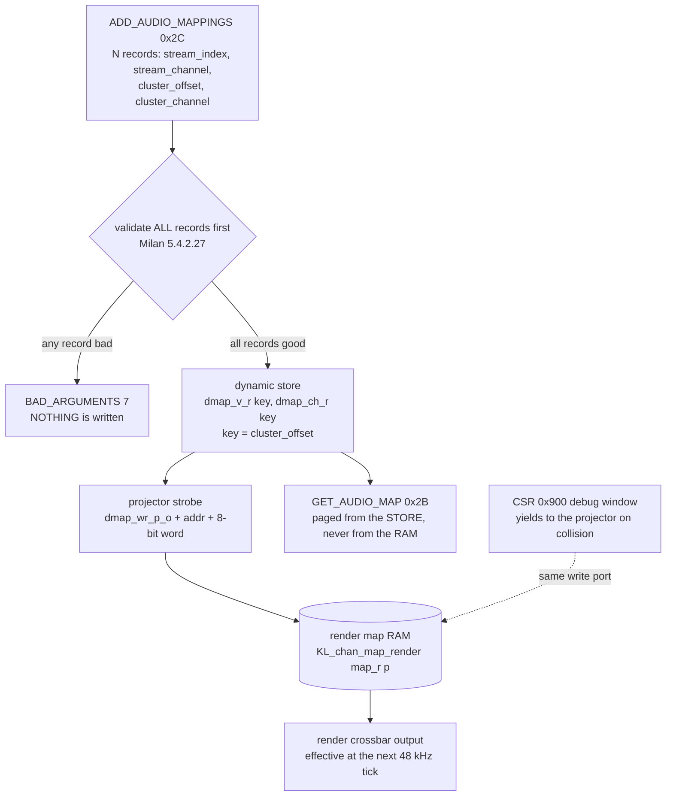

<!--
SPDX-FileCopyrightText: 2026 Kebag Logic
SPDX-License-Identifier: CERN-OHL-W-2.0
-->

# chmap64 — AEM dynamic-audio-map → fabric map-word binding contract

The `chmap64` feature adds a **render crossbar** (listener side: incoming AAF
stream channels → physical render/DAC channels) and a **capture mux** (talker
side: physical capture/ADC channels → outgoing stream channels), both
programmed by a small **map RAM**. Each RAM entry is a *map word*:

```
map word  = { en[7], src[6], idx[5:0] }       // 8 bits, as stored in the RAM
              en      1 = this physical channel is driven
              src     0 = AVB listener stream  -> idx = { stream[2:0], ch[2:0] }
                      1 = host playback ring   -> idx = ring channel
```

> **`src` is not optional.** The word was 7 bits — `{en, stream, ch}` — until
> item-7 added the host-ring source bank; the bit that chooses between the two
> banks is `src`, and `KL_chan_map_render` reads `map_wr_data_i` as **8 bits**
> (`hdl/ieee1722/aaf/KL_chan_map_render.sv`, `MAP_EN_B_C = 7`,
> `MAP_SRC_B_C = 6`). The AEM projector always emits `src = 0`
> (`KL_aecp_response_builder.sv`: `{1'b1, 1'b0, stream[2:0], ch[2:0]}`), which
> is why every map word written before item-7 still means AVB.

### Programming it directly (CSR 0x900 debug port)

The AEM command set above is the **canonical** programmer. The CSR window is a
debug port, and it does **not** take the 8-bit word — it takes a 16-bit `§5`
word whose fields sit at scattered positions, which `milan_datapath` narrows on
the way in:

```
CHMAP_WORD[15:0]   ->   { [15], [12], [6:4], [2:0] }   =   { en, src, stream, ch }
        bit 15  en        bit 12  src        bits 6:4  stream      bits 2:0  ch
```

Writing the 8-bit RAM word into `CHMAP_WORD` therefore programs **nothing
useful** — `en` would land in `ch`. The mapping is one line of
`hdl/milan/milan_datapath.sv`; read it there before poking the port.

The **canonical programmer** of that RAM is the IEEE 1722.1 / Milan dynamic
audio-map command set, not a bespoke register poke. This document is the
normative binding between the two; the executable form lives in
`tests/features/item10_audio_maps.feature` +
`tests/steps/tsn_gen_steps.py::MilanAudioMapModel` (item-10 row
`item-10-audio-maps`, matrix `M-AECP-4`).

## Contents

- **[Commands (codes verified against hdl/ieee17221/aecp/aecp_pkg.sv)](#commands-codes-verified-against-hdlieee17221aecpaecp_pkgsv)** — Three command codes, and a correction: they are decimal 43/44/45 = 0x2B/0x2C/0x2D, **not** 0x1A/0x1B/0x1C. Also why mono clusters make `cluster_offset` alone the store key.
- **[The projection rule (AEM → map word)](#the-projection-rule-aem--map-word)** — The core of the page: the exact word an accepted `ADD` writes (`0x80 | si<<3 | sc`), the all-or-nothing rule that nothing is written until every record validates, and the deliberate split where `GET_AUDIO_MAP` answers from the store while a `0x900` poke changes only the RAM — so the two *can* legitimately disagree. Sub-sections give the five validity terms, why REMOVE is lenient, and the status-code table.
- **[Cluster ↔ physical-channel table (I2S 2ch + TDM8 8ch)](#cluster--physical-channel-table-i2s-2ch--tdm8-8ch)** — The flattened `cluster_offset` → physical channel map you need to aim a mapping: 0/1 are the I2S pair, 2 upward are TDM8 slots. Notes that `AEM_DMAP_KEYS_C` is 10 for full render while the builder fixture uses 8.
- **[Arbitration — who owns the map write port](#arbitration--who-owns-the-map-write-port)** — One rule: the AEM engine is authoritative, the CSR window is a bring-up override with **no lock semantics**, and driving both in production is unsupported.
- **[Traceability — PDU_GETTER_SETTER_VERIFICATION.md audio-maps row](#traceability--pdu_getter_setter_verificationmd-audio-maps-row)** — Historical: written while the item-10 page was still on an unlanded PR, so it describes a merge hazard that no longer exists. What survives is the row it says this fixture satisfies.

## Commands (codes verified against `hdl/ieee17221/aecp/aecp_pkg.sv`)

| Command | `aecp_pkg.sv` | code | Spec | Milan |
|---|---|---|---|---|
| `GET_AUDIO_MAP` | `CMD_GET_AUDIO_MAP = 15'd43` | **0x2B** | §7.4.44 | 5.4.2.26 |
| `ADD_AUDIO_MAPPINGS` | `CMD_ADD_AUDIO_MAPPINGS = 15'd44` | **0x2C** | §7.4.45 | 5.4.2.27 |
| `REMOVE_AUDIO_MAPPINGS` | `CMD_REMOVE_AUDIO_MAPPINGS = 15'd45` | **0x2D** | §7.4.46 | 5.4.2.28 |

> The values are the AEM `command_type` (Table 7.128) — decimal 43/44/45.
> They are **not** 0x1A/0x1B/0x1C; always read `aecp_pkg.sv`, never a comment.

A mapping record (8 bytes on the wire) is
`(stream_index, stream_channel, cluster_offset, cluster_channel)`. Clusters
model the physical channels; per Milan 5.4.2.26 the deployed clusters are
**mono** (one channel each), so `cluster_channel == 0` and the store key is the
`cluster_offset` alone — *at most one dynamic mapping per Audio-Cluster
channel*.

## The projection rule (AEM → map word)

One command from a controller touches three things in sequence, and the
all-or-nothing rule means the *order* is load-bearing — **nothing is written
until every record has passed**:



The store and the RAM are deliberately **not** the same truth: `GET_AUDIO_MAP`
answers from the store, so a CSR poke at `0x900` changes what the crossbar
does without changing what a controller reads back. That is a bench
affordance, and it is exactly why the CSR path is not the production one.

The dynamic map lives on **every** `map_mode: dynamic` `STREAM_PORT_INPUT`
(the render side). Milan v1.2 5.3.3.9 is the reason it is plural:

> The Stream Port Input of a Configuration shall not contain any AUDIO_MAP
> descriptor. Note: this means that a PAAD-AE implements dynamic mappings on
> all of its Stream Port Inputs.

The RTL responder is `KL_aecp_response_builder` under ``` `AEM_DYNMAP ```; the
store is `dmap_v_r[key]` / `dmap_si_r[key]` / `dmap_ch_r[key]` with

```
key = AEM_DMAP_PBASE_C[port] + cluster_offset     // GLOBAL cluster index
```

sized `AEM_DMAP_KEYS_C` (generated from the end-station config by
`avdecc/gen_aem_store.py`; builder self-test defaults `KEYS=8`, `PAGE=4`,
`PNMAPS=[2]`; `endstation_arty_4x4` = 4 ports × 4 clusters = `KEYS=16`,
`endstation_ax7101_8x8` = 8 × 8 = `KEYS=64`).

> **Global key, port-relative wire.** `mapping_cluster_offset` is
> "the offset from the base_cluster of the STREAM_PORT_INPUT" (1722.1-2021
> Table 7-33), so it is always **port-relative on the wire** and the engine
> adds the port's `base_cluster` to reach the store — which is also the
> render RAM address. An offset that would step past the addressed port's own
> cluster block is `BAD_ARGUMENTS`; it never lands in a neighbouring port's
> keys.

For every mapping record `(si, sc, co, cc)` addressed to `STREAM_PORT_INPUT[p]`:

```
address  = AEM_DMAP_PBASE_C[p] + co   // global cluster idx = physical render
                                      //   channel (cc == 0, mono clusters)

ADD    (accepted)  →  RAM[address] = { en=1, src=0, stream=si, ch=sc }
REMOVE (matched)   →  RAM[address] = { en=0, src=0, stream=0,  ch=0  }
```

Packed: `word = (en<<7) | (src<<6) | (stream<<3) | ch`. Example: adding
`si=0, sc=3, co=0` on port 0 yields `RAM[0] = 0x83` (`en=1, src=0, stream=0,
ch=3`); the same record on port 1 of a 4-cluster shape yields `RAM[4] = 0x83`.

> **Model keys outnumber pads.** `CHMAP_PHYS_C` is 10 (2 I2S + 8 TDM) while
> the 8×8 model declares 64 input clusters. `milan_datapath` **gates** the
> projector write on `addr < CHMAP_PHYS_C` — a key with no physical channel
> behind it is dropped, never truncated (a 4-bit truncation would have
> aliased key 16 onto the I2S L channel). The AEM store still holds the
> mapping and `GET_AUDIO_MAP` still reports it: the model stays truthful
> about a route the board has no pad for.

**Field table, as the RTL emits it today.** The map word is **8 bits** —
`KL_chan_map_render.sv` declares `input wire [7:0] map_wr_data_i` with
`MAP_EN_B_C = 7` and `MAP_SRC_B_C = 6`, which is where `en` and `src` sit. The
`src` bit is what the host playback ring gained when it became a render source
(item-7); a pre-item-7 7-bit reading of the same word puts every field one
place too low, so program against the positions below:

| Bit | Field | On `ADD` (accepted) | On `REMOVE` (matched) |
|---|---|---|---|
| `[7]` | `en` | `1` | `0` |
| `[6]` | `src` — source bank | `0` = AVB listener (the projector **never** emits 1) | `0` |
| `[5:3]` | `stream` | `mapping_stream_index[2:0]` | `0` |
| `[2:0]` | `ch` | `mapping_stream_channel[2:0]` | `0` |

So the accepted word is `0x80 | (si << 3) | sc`, and a matched REMOVE writes
`0x00` — the same arithmetic the worked example above uses. `src = 1` — the
same entry pointing at a `KL_pcm_tx` playback channel instead of a wire
channel — is reachable only through the `0x900` debug window; no AEM command
can produce it, which is what keeps every pre-item-7 map word meaning exactly
what it did.

### Validity (ADD, 5.4.2.27 — all-or-nothing)

A record is valid iff **all** hold; any invalid record fails the *whole*
command with `BAD_ARGUMENTS` and **nothing** is written:

| Check | Rule | RTL term |
|---|---|---|
| single audio input | `stream_index == 0` | `w_dm_shape_ok` |
| mono cluster | `cluster_channel == 0` | `w_dm_shape_ok` |
| key in range | `cluster_offset < AEM_DMAP_KEYS_C` | `w_dm_key_ok` |
| channel in format | `stream_channel < channels(STREAM_INPUT[0])` | `w_dm_ch_ok` |
| no intra-command dup | same `cluster_offset` used twice in one command → reject | `dmap_claim_r[key]` |

A valid ADD to an already-mapped key **replaces** it (the 5.4.2.27 accept-and-
replace option). `stream_index` is fixed at 0 in the current single-input build;
the chmap64 8×8 build widens `KEYS` and the `stream` field — the projection rule
above is unchanged.

### REMOVE (5.4.2.28 — lenient)

REMOVE clears an **exact** `(cluster_offset, stream_channel)` match and *ignores*
everything else (unmatched, duplicate); it always returns `SUCCESS` on the input
port. GET then shows the key gone / the word disabled.

### GET_AUDIO_MAP (getter)

`STREAM_PORT_INPUT[0]` pages the live store: `number_of_maps` is the fixed
partition count `AEM_DMAP_NMAPS_C`; each page emits `PAGE` keys, listing the
mapped ones as `(stream_index=0, stream_channel, cluster_offset, cluster_channel=0)`.
`map_index >= NMAPS` → `BAD_ARGUMENTS` (§7.4.44.1). `STREAM_PORT_OUTPUT[0]` is
the static capture map (well-formed, `number_of_maps=1`). Any other
descriptor/index → `NO_SUCH_DESCRIPTOR`.

### Status codes returned (as the RTL actually returns them)

| Situation | Status | value |
|---|---|---|
| accepted ADD/REMOVE/GET | `SUCCESS` | 0 |
| unknown descriptor/index | `NO_SUCH_DESCRIPTOR` | 2 |
| invalid record / dup key / bad map_index | `BAD_ARGUMENTS` | 7 |
| ADD/REMOVE on the static output map | `NOT_SUPPORTED` | 11 |
| locked/acquired by another controller | `ENTITY_LOCKED` / `ENTITY_ACQUIRED` | 3 / 4 |

## Cluster ↔ physical-channel table (I2S 2ch + TDM8 8ch)

The `AUDIO_CLUSTER` descriptors of the end-station
(`avdecc/milan-v12-entity.json`) enumerate the physical channels; the render
crossbar addresses them by flattened `cluster_offset` (mono clusters):

| cluster_offset | physical render channel | interface |
|---|---|---|
| 0 | render L | I2S stereo, ch 0 |
| 1 | render R | I2S stereo, ch 1 |
| 2 | render 2 | TDM8 slot 0 |
| 3 | render 3 | TDM8 slot 1 |
| 4 | render 4 | TDM8 slot 2 |
| 5 | render 5 | TDM8 slot 3 |
| 6 | render 6 | TDM8 slot 4 |
| 7 | render 7 | TDM8 slot 5 |
| … | … | TDM8 slots 6-7 when `KEYS ≥ 10` |

`AEM_DMAP_KEYS_C` is generated to cover the deployed physical channel count
(I2S 2 + TDM8 8 = 10 for the full render; the builder unit-test fixture uses 8).
The capture mux mirrors this on `STREAM_PORT_OUTPUT` (static in the current
RTL: I2S/TDM8 capture channels → outgoing stream channels).

## Arbitration — who owns the map write port

- **The AEM engine owns the map RAM write port.** `ADD`/`REMOVE_AUDIO_MAPPINGS`
  is the authoritative, spec-visible programmer; every accepted edit projects to
  a map word as above, and `GET_AUDIO_MAP` is the read-back of record.
- **The CSR window is a debug-override**, not the normal control path. It exists
  for bring-up / bench pokes and is subordinate to the AEM engine: a controller
  issuing dynamic maps is the source of truth, and any CSR scribble is expected
  to be re-asserted by the next AEM edit / `GET_AUDIO_MAP` reconciliation. Do not
  drive both concurrently in production; the CSR path carries no lock semantics.

## Traceability — [`PDU_GETTER_SETTER_VERIFICATION.md`](testing/PDU_GETTER_SETTER_VERIFICATION.md) audio-maps row

The item-10 plan doc [`docs/testing/PDU_GETTER_SETTER_VERIFICATION.md`](testing/PDU_GETTER_SETTER_VERIFICATION.md) is owned
by the sibling open PR `item-10-pdu-getter-setter-verify` and is **not present on
`main`** (this PR's base), so its table cannot be appended here without an
add/add collision. When that PR lands, its AECP/AEM table row

> `GET_AUDIO_MAP + ADD/REMOVE_AUDIO_MAPPINGS | getter + action (es-4.16) | matrix M-AECP-4 | item-10-audio-maps`

is satisfied by this fixture; update its "Existing coverage" cell to
`item10_audio_maps (getter + action + fabric)` and mark the row done.
