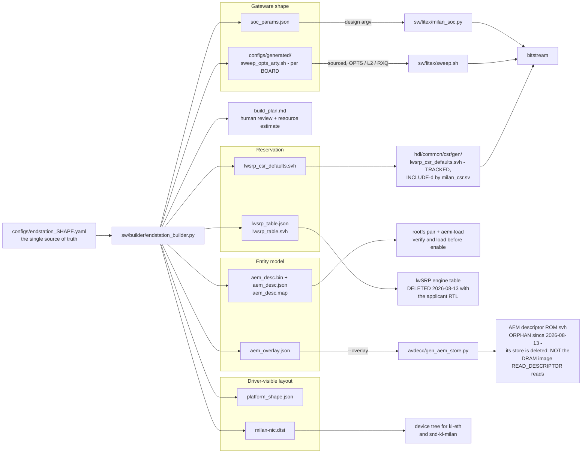

# Software-defined End-Station builder — spec basis (roadmap item 4)

**Purpose.** One declarative config (`configs/endstation_*.yaml`, schema
`kebag-logic/milan-endstation-config`) drives gateware elaboration, the AEM
entity model, lwSRP tables and the DT/driver shape consistently. The current
compliance boundary is recorded in
[`testing/MILAN_V12_AUDIT_2026-08-16.md`](testing/MILAN_V12_AUDIT_2026-08-16.md).

This document is the specification-referenced design record for that
builder: the settled design decisions with their clause basis, and the
config-schema → AEM-descriptor mapping.

> **WHAT THE ENTITY MODEL STILL DRIVES, AND WHAT IT NO LONGER REACHES
> (2026-08-13).** The builder is unchanged and still the single source of
> truth for the *shape*: `soc_params.json` still sizes the gateware,
> `adp_shape_defaults.svh` still carries the advertised stream counts and
> capability words, and the protocol processor's ACMP arrays
> (`ACMP_SINKS_C` / `ACMP_SRC_C`) are sized from exactly that header.
>
> What changed is the other end of the chain. This repository's AECP/AEM
> engine was deleted in favour of the pinned `protocol-processor` submodule,
> whose AECP uCPU serves the command inventory recorded by the current audit.
> The builder now supplies the descriptor store used by `READ_DESCRIPTOR`:
>
> * the processor serves descriptors out of a **flat image in DRAM** at a
>   compile-time base with no base register;
> * this builder generates `aem_desc.bin`, `aem_desc.json`, and `aem_desc.map`
>   from the selected configuration. When the deployed board shape is written,
>   it packages the paired image and manifest under the rootfs overlay;
> * board-side `aemi-load` verifies the pair and loads the image at
>   `PP_DESC_BASE_P` before the entity is enabled. A custom integration that
>   omits this step fails closed with `BAD_ARGUMENTS`;
> * the `aecp_aem_rom.svh` the builder **still writes** under
>   `sw/builder/out/<cfg>/` is the ROM of the **deleted** in-fabric
>   `KL_aecp_aem_store`. It has no RTL path (it is written nowhere an
>   `+incdir` can reach) and it is **not** the image the processor reads. Treat
>   it as an orphan, a readable artifact of the model rather than a deliverable.
>
> Say it plainly: the entity model is still the source of truth for what this
> device *is*, and the tracked build and boot flow connects that model to the
> processor's descriptor store. The old golden header (`aem_golden.h`) went
> with the deleted fabric `aecp` suite; the current image and wire checks replace
> that supply-chain evidence.
>
> The lwSRP emitters split. The engine table that used to land under the
> srp gen directory (lwsrp_table.svh) went with the applicant RTL — SRP is
> the processor's now.
> The CSR-facing subset [`hdl/common/csr/gen/lwsrp_csr_defaults.svh`](../hdl/common/csr/gen/lwsrp_csr_defaults.svh)
> **survives and is still `` `include ``-d by `milan_csr.sv`**, because the
> `0x680` reset words are an ABI and the register map keeps every register it
> ever had. Rows and gates below are marked where they are affected.

Every clause reference below was verified against the local standards PDFs
(`$STANDARDS_DIR`) using a 2026-07-22 pdftotext extraction. Cited documents: IEEE
1722.1-2021 ("1722.1"), IEEE 1722-2016 ("1722"), Milan Specification v1.2
Consolidated ("Milan"), IEEE 802.1Q-2022 ("Q").

The implementation lane ([`sw/builder/endstation_builder.py`](../sw/builder/endstation_builder.py), the three
emitters, the `test_builder.py` identity gate against today's ROM) runs in
parallel; this document is the contract it converges on. Its rows are reflected
in the generated [`traceability/MODULE_MATRIX.md`](traceability/MODULE_MATRIX.md)
and in executable verification where the behavior is implemented.

## Contents

- **[1. Artifacts and flow](#1-artifacts-and-flow)** -- What one config emits and, more usefully, who reads each file and where a stale one is caught. The descriptor ROM remains an orphan of the deleted fabric store; the flat image, manifest, and map are the processor deliverables. The section ends with the three example shapes side by side, where the 8x8 role-pool policy emits 200 clusters.
- **[2. Settled design decisions](#2-settled-design-decisions)** -- Ten recorded decisions with their clause basis, opening with the index that says which you can rely on today. D3 keeps talker `channels` and `clusters` separate, D8 records the role-tagged cluster pools, D10 names every cluster without moving `entity_model_id`, and D6 records the processor DRAM image contract and its implemented supply chain.
- **[3. Config schema → AEM descriptor mapping](#3-config-schema--aem-descriptor-mapping)** -- The field-by-field contract numbered through row 29: each config key, the descriptor or argv it generates, the clause that governs it, and which consumer reads it. Three rows generate *planned* artifacts; the config validates and the build plan marks them rather than erroring.
- **[4. What the 8x8 shape adds (endstation_ax7101_8x8.yaml)](#4-what-the-8x8-shape-adds-endstation_ax7101_8x8yaml)** -- Descriptor growth from 1×1 to 8×8 with the clause driving each count, and the new obligation the shape triggers: two or more AAF inputs make a CRF Media Clock Output mandatory, now enforced as a validation error. Also the honest split -- the model half is done, the provisioning half rides with item 5, and the area cost at 100 MHz is a measurement this page declines to claim.
- **[5. Relation to the bench suite and the traceability matrix](#5-relation-to-the-bench-suite-and-the-traceability-matrix)** -- Why the builder adds no normative behaviour of its own, and the two gates that hold it honest: today's config must reproduce the shipped ROM and `sweep.sh` argv byte-for-byte, and an unchanged model must keep an unchanged `entity_model_id`.

## 1. Artifacts and flow

```
configs/endstation_<shape>.yaml          (single source of truth)
        │  endstation_builder.py
        ├── soc_params.json   → sw/litex/milan_soc.py design argv
        │                       (flow flags — --build, threads, directives —
        │                        stay in sw/litex/sweep.sh)
        ├── aem_overlay.json  → avdecc/gen_aem_store.py migration contract
        │                       (descriptor counts, formats, cluster/map
        │                        layout, entity identity)
        ├── lwsrp_table.json  → the SRP (802.1Q MSRP/MVRP) reservation table:
        │   lwsrp_table.svh     SR class, MRP timers, class-A bandwidth math,
        │                       the 0x680 CSR reset words, the engine's
        │                       elaboration parameters, one record per stream.
        │                       NOTE 2026-08-13: the ENGINE half of this
        │                       (hdl/ieee8021q/srp/gen/lwsrp_table.svh) went
        │                       with the deleted applicant; the CSR half
        │                       below is what still lands in the tree
        ├── platform_shape.json → driver-visible layout: the Milan CSR base, the
        │   milan-nic.dtsi       DMA window map DERIVED from
        │                        board.constraints.rx_queues, the addresses
        │                        kl-eth hardcodes, and the kl,dma-ether /
        │                        kl,milan-pcm device-tree nodes
        └── build_plan.md     → human review; shapes beyond current RTL
                                VALIDATE and are marked "planned"

plus, repo-level and single-sourced so nothing can drift:
    configs/generated/sweep_opts_<board>.sh    OPTS / L2 / RXQ, sourced by
                                               sw/litex/sweep.sh (its inline
                                               tables are the loud FALLBACK only)
    (deleted 2026-08-13)                       the DEPLOYED shape's lwSRP
                                               engine table went with the
                                               applicant RTL
    hdl/common/csr/gen/lwsrp_csr_defaults.svh  the CSR-facing SUBSET of it (the
                                               0x680 reset words + the
                                               PriorityAndRank byte) - SURVIVES
    configs/generated/<config>/gen/            this config's ADP shape include
      adp_shape_defaults.svh                   (select a shape by include path)

and, ONLY on an explicit `--write-rtl`, the ENTITY DEFINITION the gateware
compiles in:
    hdl/common/csr/gen/adp_shape_defaults.svh  the advertised stream counts +
                                               capabilities (RO 0x618/0x61C)
                                               AND the ACMP context sizing
    (no RTL path since 2026-08-13)             the AEM descriptor ROM svh. Still
                                               emitted to out/<cfg>/, but its
                                               consumer (KL_aecp_aem_store) is
                                               deleted: an ORPHAN, and NOT the
                                               DRAM image the processor serves
                                               READ_DESCRIPTOR from
```

**`milan_csr.sv` and `milan_datapath.sv` both `` `include ``
`adp_shape_defaults.svh``**, so the number a controller is told and the number
of ACMP contexts that can answer it come from one config in one pass — the
processor's `ACMP_SINKS_C` / `ACMP_SRC_C` are sized from that same header.
The third member of that sentence has moved out of the gateware entirely:
**the descriptor set a controller enumerates is no longer compiled in at all.**
The processor's AECP uCPU answers `READ_DESCRIPTOR` from an image in DRAM.
During an explicit deployment ownership transfer, `--write-fragment` or
`--write-rtl` generates the paired image in the sibling rootfs overlay, and
`aemi-load` verifies and loads it before entity enable. An ordinary builder run
does not touch that deployment overlay.
`--write-rtl` is explicit rather than automatic because `build()` runs on
throwaway config variants during testing and a shape nobody chose must never
end up in the tree; `sw/litex/build.sh` and `sweep.sh` REFUSE to launch unless
the tracked definition is the config being built
(`scripts/check_entity_shape.py --built-config`). Before 2026-07-27 nothing
checked, the tracked ROM was the 1x1 shape, and every build compiled it in -
including the 8x8 ([`ADP_SHAPE_STATIC_0727.md`](findings/ADP_SHAPE_STATIC_0727.md)). The generator's own
header (`sw/builder/endstation_builder.py`) is authoritative for this list.

The tree above says *what is emitted*; it cannot say **who reads each file
and where a stale one gets caught** — which is the question you actually
have after editing a config:



Two things in that graph are still **tracked in the repo** and compiled in:
`lwsrp_csr_defaults.svh` and `adp_shape_defaults.svh`, plus the per-board
sweep fragment. Those are the files that can go stale inside a commit, and
each has a byte-identity gate below. The two struck rows were tracked until
2026-08-13 and are now unbuilt outputs — the builder still *emits* the
overlay and the table JSON, because the model is still the source of truth
for the shape and for whatever serves it next; nothing in this gateware
consumes them. Everything else is regenerated into
`sw/builder/out/<config-stem>/` and is not tracked at all.

| Artefact | What it carries | Read by | Gate in [`sw/builder/test_builder.py`](../sw/builder/test_builder.py) |
|---|---|---|---|
| `soc_params.json` | the `milan_soc.py` **design** argv this config implies (no flow flags) | [`sw/litex/milan_soc.py`](../sw/litex/milan_soc.py) | 2 — argv equals `sweep.sh`'s design flags for arty *and* ax7101 |
| `aem_overlay.json` | descriptor counts, stream formats, per-stream STREAM_PORT / cluster / map layout, entity identity | `avdecc/gen_aem_store.py --overlay`; `_entity_model_image()` consumes it only during an explicit deployment ownership transfer | 3 (counts equal the hardcoded model), 6 (port-layout invariants), 10 (the former tracked-ROM identity gate), 15–17 (CRF output, dynamic maps), plus image identity and directory-shape gates |
| `aem_desc.bin` + `aem_desc.json` + `aem_desc.map` | flat processor image, paired manifest with derived base and identity, and readable directory report | generated in the sibling rootfs overlay only by `--write-fragment` or `--write-rtl`, when the overlay is present; `aemi-load` verifies and writes the image before entity enable | image identity, image/manifest pairing, directory shape, and builder artifact gates; root wire `READ_DESCRIPTOR` coverage grades the served result |
| `lwsrp_table.json` + `lwsrp_table.svh` | SR class, MRP timers, class-A bandwidth math, TSpec, one record per stream, the engine's elaboration parameters | **the lwSRP RTL tree is DELETED (2026-08-13)** — the engine `.svh` no longer lands anywhere; the JSON is still emitted and still describes the reservation policy the CSR half provisions | 18a–18d covered emitted word ⇄ RTL symbol ⇄ reset block ⇄ readback table ⇄ register-map Reset column. The RTL-symbol leg has no target any more; the CSR legs still bite through `lwsrp_csr_defaults.svh` |
| `lwsrp_csr_defaults.svh` | the CSR-facing **subset**: the `0x680` reset words + the PriorityAndRank byte | `` `include ``-d by [`hdl/common/csr/milan_csr.sv`](../hdl/common/csr/milan_csr.sv) | 20a — the loop is closed: no `0x680` literal survives in the RTL, and every flow compiling `milan_csr.sv` carries the include dir |
| `adp_shape_defaults.svh` | the **advertised shape**: `talker_stream_sources` / `listener_stream_sinks` (1722.1-2021 6.2.1.9/6.2.1.11), both capability words, and `TALKER_WIRE_CHANS_C` — the **emitted** channel width (roadmap item 00) | `` `include ``-d by **both** [`hdl/common/csr/milan_csr.sv`](../hdl/common/csr/milan_csr.sv) (the RO `0x618`/`0x61C` words) and [`hdl/milan/milan_datapath.sv`](../hdl/milan/milan_datapath.sv) (the ACMP source/sink context array sizing) | [`scripts/check_entity_shape.py`](../scripts/check_entity_shape.py) — config → svh → AEM descriptor counts, for every config, plus 7 mutation cases and a pre-build `--built-config` mode wired into `build.sh`/`sweep.sh`; [`scripts/check_wire_accountability.py`](../scripts/check_wire_accountability.py) — the advertised width against the **fabric that has to produce it** (expected red until roadmap item 5) |
| `adp_shape_defaults.svh` | the **advertised shape**: `talker_stream_sources` / `listener_stream_sinks` (1722.1-2021 6.2.1.9/6.2.1.11) and both capability words | `` `include ``-d by **both** [`hdl/common/csr/milan_csr.sv`](../hdl/common/csr/milan_csr.sv) (the RO `0x618`/`0x61C` words) and [`hdl/milan/milan_datapath.sv`](../hdl/milan/milan_datapath.sv) (the ACMP source/sink context array sizing) | [`scripts/check_entity_shape.py`](../scripts/check_entity_shape.py) — config → svh → AEM descriptor counts, for every config, plus 10 mutation cases and a pre-build `--built-config` mode wired into `build.sh`/`sweep.sh` |
| AEM descriptor ROM (`aecp_aem_rom.svh`) | the legacy AEM descriptor set generated from this config's `aem_overlay.json` | **ORPHANED 2026-08-13**: still written to `sw/builder/out/<cfg>/`, deliberately never into `hdl/` or any `gen/` include path because its consumer, `KL_aecp_aem_store`, is deleted. The processor instead serves the flat DRAM image generated from the same overlay during deployment ownership transfer | gate 10 (byte identity against the tracked ROM) has no tracked artefact to compare against. `check_entity_shape.py` still holds the config-to-shape leg that the processor's ACMP arrays depend on |
| AEM golden header (`aem_golden.h`) | the same ROM image as C, the oracle the deleted `aecp` suite compared against | **DELETED 2026-08-13** with the fabric `aecp` suite. The builder-generated flat image, manifest, map, image-shape gates, and root `READ_DESCRIPTOR` wire coverage replace the old supply-chain evidence | gate 24d compared the old golden and ROM. Current gates instead pair the processor image with its manifest and verify the served descriptor path |
| `platform_shape.json` + `milan-nic.dtsi` | Milan CSR base, the DMA window map **derived from** `board.constraints.rx_queues`, the addresses `kl-eth` hardcodes, the `kl,dma-ether` / `kl,milan-pcm` nodes | device tree / driver | 19a (queue count is one number across config, argv, sweep fragment and DT), 19b (window bases byte-match the generated CSR listing and the deployed tree), 19c (flipping `rx_queues` under a pinned boot chain is refused) |
| `build_plan.md` | human review, capability marks, the LUT/FF/BRAM36/DSP estimate and its OK / TIGHT / OVER verdict | a human | 4 (planned marks), 11 (estimate within ±15 % of the real place report), 12 (deterministic), 13 (verdict thresholds and UPPER BOUND labelling) |
| `configs/generated/sweep_opts_<board>.sh` | `OPTS` / `L2` / `RXQ` for the board | sourced by [`sw/litex/sweep.sh`](../sw/litex/sweep.sh), whose inline tables are the loud fallback | 9 — byte-for-byte against `sweep.sh`, per board, and `sh -n` on all three files |

Five tracked shapes exist. Descriptor counts below are read out of the
**emitted** `aem_overlay.json`, not predicted. They are what
`gen_aem_store.py` is handed:

| | `arty_current` | `arty_4x4` | `arty_8ch` | `ax7101_1x1_tdm8` | `ax7101_8x8` |
|---|---|---|---|---|---|
| Board, audio interface | arty, `i2s_philips` | arty, `tdm8` | arty, `tdm8` | ax7101, `tdm8` | ax7101, `tdm32` |
| AAF listeners × talkers | 1 × 1 | 4 × 4 | 4 × 4 | 1 × 1 | 8 × 8 |
| Listener / talker channels | 8 / 2 | 4 / 4 | 8 / 8 | 8 / 8 | 8 / 8 |
| Talker `clusters` (D3) | 8 | 4 | 8 | *(unused under `role-pools`)* | *(unused under `role-pools`)* |
| `audio_interface.physical_channels` | default (2/2) | **8 / 2** | **8 / 2** | **8 / 0** | **0 / 0** |
| `cluster_mapping.policy` | `cluster-per-stream-channel` | `cap-at-interface` | `cap-at-interface` | `role-pools` (D8) | `role-pools` (D8) |
| `clocking.crf_output` | absent (legal at 1 listener) | enabled | enabled | enabled | enabled |
| STREAM_INPUT / STREAM_OUTPUT | 2 / 1 | 5 / 5 | 5 / 5 | 2 / 2 | 9 / 9 |
| STREAM_PORT_INPUT / _OUTPUT | 1 / 1 | 4 / 4 | 4 / 4 | 1 / 1 | 8 / 8 |
| AUDIO_CLUSTER | 16 | 32 | 64 | 33 | **200** |
| AUDIO_MAP | 2 | 4 | 4 | 0 | 0 |
| CLOCK_SOURCE | 3 | 6 | 6 | 3 | 10 |

The cluster row is where the policy bites and where a guess would have been
wrong. `cap-at-interface` takes `min(stream.clusters, interface channels per
direction)`. The TDM8 interface has eight channels per direction, so each 4ch
stream keeps all four clusters and `arty_4x4` emits 32.

The 8×8 row moved on 2026-07-28: it now selects **`role-pools`** (D8), so its
ports carry role-tagged pools instead of a copy of a stream field —
8 input ports × 8 `host` + 8 output ports × (8 `host` + 1 `pilot` +
8 `loopback`) = **200**. Its `physical` pool is **empty**, because the AX7101
routes no audio pins in either direction (see D8 status), and that is
precisely why the loopback pool is there.

## 2. Settled design decisions

The decisions below include planned and partially integrated work. Read this
index first; it states which behavior can be relied on today.

| # | Decision, in one line | Rests on | Status |
|---|---|---|---|
| **D1** | one STREAM_PORT per AAF stream, each owning a contiguous cluster block and one AUDIO_MAP; CRF gets no port | 1722.1 7.2.13, 7.2.19; Milan 5.4.2.27/28 | **implemented** — emitted and layout-gated (gate 6) |
| **D2** | cluster policy is config-selectable; a stream channel maps to a mono MBLA AUDIO_CLUSTER | 1722.1 7.2.16/7.2.16.1; Milan 6.4, 5.3.10.1, 5.4.2.27 | **implemented** — both policies gated (gate 7) |
| **D3** | talker `clusters` is its own config field, never derived from `channels` | 1722.1 7.2.6, 7.4.10.2; Milan 5.3.7.1, 5.3.9.1, 6.3 | **implemented** — the shapes table above shows 8 vs 2 |
| **D4** | `entity_model_id` = deterministic hash of the model-shaping fields only, or a pin for flashed silicon | 1722.1 6.2.2.8 (incl. its exclusion list) | **implemented** — determinism, shape-sensitivity and the pin are gated (gate 8) |
| **D5** | the config is the single source of truth; flow flags stay in `sweep.sh`; `audio_interface.kind` selects the ser/des family | engineering + 1722.1 7.2.7/7.2.14/7.2.3 | **implemented** for `i2s_philips` and `tdmN`; `aes3`/`spdif` ser/des exists, its SoC plumbing is *planned*; the JACK / EXTERNAL_PORT model is *planned* |
| **D6** | AEM store uses a DRAM descriptor tree loaded from a builder-emitted, verified image pair | engineering (area: ~80 RAMB36 vs ~36 free) | **implemented in the tracked flow**: the processor fetches the whole model from DRAM at a compile-time base; the builder emits the image, manifest, and map; `aemi-load` verifies and loads the pair before entity enable. See D6 below |
| **D7** | dynamic-map store keyed by the **target** stream channel, not the source cluster | Milan 5.4.2.27/28 (one source per stream channel) | **not implemented** — today's RTL is input[0]-scoped and cluster-keyed |
| **D8** | role-named 8×8 port model: per-platform cluster pools, a Pilot cluster, a stream-loopback lane | 1722.1 7.2.19 (port-relative offsets) | **model implemented** (2026-07-28) — `role-pools` policy emits per-platform pools, gates 24a/24b + `sim_pools`; the loopback **fabric lane** is still pending and marked *planned* |
| **D10** | every AUDIO_CLUSTER is named for its ROLE, not `"Input"`/`"Output"` | 1722.1 7.2.16; 6.2.2.8 (object_name excluded from model structure) | **implemented** (2026-07-28) — gates 24c/24d; `entity_model_id` provably unmoved |

> **D2 has moved on since it was written.** The builder's schema is 1.1: the
> field is `cluster_mapping.policy` (a `rule` key is an explicit error), and
> `cap-at-interface` — described below as the rejected alternative — is a
> supported policy that both NxN example shapes select. The row above states
> the schema; the section below states the reasoning that made
> `cluster-per-stream-channel` the default. Read them in that order.

### D1 — one STREAM_PORT per AAF stream

**Decision.** The builder's NxN model gives every AAF stream its own
STREAM_PORT_INPUT (listeners) / STREAM_PORT_OUTPUT (talkers), each owning a
contiguous group of clusters and exactly one AUDIO_MAP. The CRF
STREAM_INPUT carries no audio channels and gets no port. Today's
1(+CRF)x1 shape degenerates to one port per direction — numerically
identical to the shipped ROM ([`avdecc/gen_aem_store.py`](../avdecc/gen_aem_store.py)), which is what the
v1.0 overlay gate asserts.

**Clause basis.**
- 1722.1 7.2.13 (Table 7-23): each STREAM_PORT_INPUT/OUTPUT descriptor
  carries its own `number_of_clusters`/`base_cluster` and
  `number_of_maps`/`base_map` — the cluster/map ownership boundary in AEM
  *is* the port.
- 1722.1 7.2.19: an AUDIO_MAP "contained in" a port maps channels of
  STREAM_INPUTs/OUTPUTs to channels of the AUDIO_CLUSTERs "contained in the
  same" port, and `mapping_cluster_offset` is "the offset from the
  base_cluster of the STREAM_PORT_INPUT or STREAM_PORT_OUTPUT" — map
  contents are port-relative by construction.
- Milan 5.4.2.27/5.4.2.28: the static-vs-dynamic mapping regime is decided
  **per port** ("For each Stream Port Input and for each Stream Port Output
  that has no Audio Map, the PAAD-AE shall implement the
  ADD_AUDIO_MAPPINGS command…"; ports *with* Audio Maps answer
  NOT_SUPPORTED). 1722.1 7.2.13 encodes the same split: dynamic-mapping
  entities set `number_of_maps = 0` and serve GET_AUDIO_MAP (7.4.44).

**Why.** Port-relative map offsets mean each stream's map is the identity
map over its own cluster group regardless of global cluster numbering —
adding or removing a stream never rewrites another stream's AUDIO_MAP
contents, only base indices.

The 7.2.19 uniqueness rules (input: at most one entry per cluster channel;
output: at most one entry per stream channel across the entire
Configuration) hold trivially for per-port identity maps.

And because Milan's static/dynamic split is per-port, one-port-per-stream
is what later lets roadmap item 8 (dynamic maps, es-4.16) flip individual
streams to `number_of_maps = 0` without touching the rest of the model.

### D2 — cluster policy: mono cluster per stream channel (cap-at-interface rejected)

**Decision.** Schema 1.0 defines a single `cluster_mapping.rule`:
`mono-cluster-per-stream-channel` — every stream channel gets one mono
MBLA AUDIO_CLUSTER (1722.1 7.2.16/7.2.16.1), so a stream's cluster count
defaults to its channel count. The rejected alternative ("cap at
interface") would have sized the cluster space to the physical audio
interface width instead.

**Clause basis.**
- 1722.1 7.2.16: an audio cluster "describes groups of audio channels in a
  stream" with a per-cluster `channel_count` and a single `format` for all
  its channels (7.2.16.1: MBLA = Multi-bit Linear Audio) — mono clusters
  are legal and give per-channel granularity.
- Milan 6.4, third paragraph (+ its note): a Stream Input that advertises
  one 48 kHz Base format shall advertise **all** the other 48 kHz Base
  formats — i.e. every channel count in Milan 6.2's N ∈ {1, 2, 4, 6, 8},
  whatever the stream's own width. The model must be able to represent
  maps for the largest advertised format, not for the physical interface.
  Derived, not enumerated: see "Base format completeness" below.
- Milan 5.3.10.1: a mapped cluster channel must reference a Stream Input
  channel "lower than the number of channels in the current format" — with
  one mono cluster per stream channel the representable map space exactly
  tiles the format family.
- Milan 5.4.2.27: a (dynamic) mapping referencing a stream channel that
  does not exist in the currently set format is invalid — cluster capacity
  and format family have to agree, and they only agree for every member of
  the ut family (1722 I.2.4) if clusters cover the maximum channel count.

**Why.** Cap-at-interface makes the AEM model a function of the hardware
SKU: an 8ch-capable Stream Input behind Arty's 2ch I2S could not represent
mappings for channels 2..7, violating the Milan 6.4 all-channel-counts
posture the moment a controller selects a wider family member.

With cluster-per-stream-channel the model is constant across interface
families and the *physical* truth lives in the binding rule instead
(project wire-truth 1-to-1 rule, `c705091`): physical interface channels
bind in order to the first clusters per direction; extra stream channels
are virtual; missing physical channels render 0.

Mono clusters also match the PipeWire reference layout the ROM was
byte-derived from.

### D3 — talker cluster count as config

**Decision.** `streams.talkers[].clusters` is an explicit config field,
independent of `streams.talkers[].channels` (today's shape: 8 output
clusters, 2-channel talker framer — the shipped ROM's PipeWire reference
layout).

**Clause basis.**
- 1722.1 7.2.6 + 7.4.10.2: GET_STREAM_FORMAT returns "the current stream
  format… equivalent to the current_format field in the addressed…
  descriptor" — the *declared current format* is the contract a controller
  reads, and it must equal what the framer actually transmits
  (channels_per_frame, 1722 7.3.3: "the number of audio channels
  represented in the audio sample frame").
- Milan 5.3.7.1: a Stream Output shall always be using a format from its
  advertised formats list (one ut entry may describe the whole family).
- Milan 5.3.9.1: "each channel of each Stream Output **(in the current
  format)** is either not mapped or mapped to a channel of an Audio
  Cluster" — the map/cluster space may be larger than the current format's
  channel count; only currently-formatted channels participate.
- Milan 6.3: a talker "may advertise any Base Format that is reasonable
  for its functionality" — the advertisement is a functional choice, not a
  hardware echo.

**Why.** Wire truth and model capacity are different quantities.

- The talker's `channels` is wire truth (what the framer emits — the value
  GET_STREAM_FORMAT must report, and the pure-ACMP compatibility gate:
  listeners with no SET_STREAM_FORMAT round-trip connect against the
  *current* format).
- The talker's `clusters` is model shape (how much routing capacity the
  entity exposes; today 8, per the reference layout).

Deriving one from the other silently is exactly the class of divergence
that produced the declared-8ch/wire-2ch silence incident — so both are
config, and the builder refuses to guess.

### D4 — entity_model_id derivation

**Decision.** `entity.entity_model_id` accepts either a pinned EUI-64 (the
form used for already-deployed silicon) or a derivation contract: a
deterministic hash of exactly the model-shaping config fields, folded into
a vendor-OUI-based EUI-64 base. Abstract contract only here — the concrete
field walk lives with the implementation lane.

**Clause basis (1722.1 6.2.2.8, all load-bearing).**
- "Different ATDECC Entity data models **shall** have different
  entity_model_id values", and "if a firmware revision changes the
  structure of an ATDECC Entity data model then it **shall** use a new
  unique entity_model_id" — any config change that alters a generated
  descriptor field must change the id.
- The clause then enumerates the fields **excluded** from "structure":
  - `object_name` everywhere; ENTITY `entity_name`, `firmware_version`,
    `group_name`, `serial_number`, `available_index`, `association_id`,
    `current_configuration`;
  - AUDIO_UNIT `current_sampling_rate`; STREAM_INPUT/OUTPUT
    `current_format`;
  - CLOCK_SOURCE `clock_source_identifier`/`flags`; CLOCK_DOMAIN
    `clock_source_index`; control current values;
  - AVB_INTERFACE `mac_address` + gPTP dynamics.
- These must **not** feed the hash, so renaming a unit, bumping
  `firmware_version`, changing a serial number or re-selecting a clock
  source never bumps the model id. This is what makes the derived
  `firmware_version` (row 4b) safe: it tracks `milan_csr.sv`'s `VERSION`
  parameter on every ABI bump and no `entity_model_id` follows it — least of
  all `endstation_arty_current`'s **pinned** deployed identity. Builder gate
  24 asserts exactly that.
- NOTE in 6.2.2.8: "The entity_model_id is not a device's product or model
  number" — hence hash-of-model, not SKU constant.
- 6.2.2.8 also defines dynamically-assigned ids via the EUI-64 I/G bit; the
  builder does not use them (controllers may not cache descriptors for
  dynamic ids — the caching benefit is the point of a stable id).

**Why + the pin override.** Controllers cache descriptor trees keyed by
entity_model_id (the ADP-6 traceability row's field catch: reusing an id
across ROM changes serves stale models — and the inverse, gratuitous id
churn, defeats caching and can strand saved bindings, cf. 1722.1's own
note on stale connections after entity_model_id changes).

Hashing the model-shaping fields makes "model changed ⇔ id changed"
structural instead of a release-checklist item.

The pin override exists because both flashed boards already advertise
fixed ids; a pinned config must reproduce them byte-exactly, and the
builder's job there is to *verify* the pin still matches the generated
model rather than to invent a new id.

### D5 — config as single source of truth (sweep flags generated)

**Decision.** The YAML config is the only place a design fact lives; the
`milan_soc.py` design argv (`soc_params.json`), the AEM overlay, and the
DT/driver shape are all emitted from it. Flow flags (`--build`,
`--vivado-max-threads`, `--place-directive`, output dirs) are explicitly
*not* end-station definition and stay in [`sw/litex/sweep.sh`](../sw/litex/sweep.sh).

**Why (engineering, no clause needed).** Today the same fact lives in up to
four places — `sweep.sh` OPTS, `gen_aem_store.py` constants,
`milan_soc.py` defaults, the DT — and every desynchronization so far became
a field incident: declared-8ch vs wire-2ch silence, the honest-counts
provisioning round, the AEM-default-8ch trap that rejected 2ch pure-ACMP
connects.

A generated artifact can be stale but never *divergent*; the
`test_builder.py` gate pins the emitted argv to `sweep.sh`'s BASE and the
overlay counts to the shipped ROM for today's shape.

**Audio-interface family subtask** (gaps item 4 subtask). The config's
`audio_interface.kind` — `tdm8|tdm16|tdm32|i2s_philips|aes3|spdif` — selects
the ser/des RTL family and its parameters (slots, word length, frame
format).

In RTL today: `i2s_philips` (`KL_i2s_playback` /
`aaf_talker_i2s`/`KL_aaf_capture_i2s`, the default) and the `tdmN` kinds.
The builder emits `--audio-interface tdmN`, which `milan_soc.py` maps to
the `milan_datapath` `AUDIO_IF_SLOTS_P` generate select instantiating the
`KL_tdm_capture` TDM slave (N slots × 32-bclk words, pulse or 50%-duty
frame sync, data delay 0/1).

Its per-slot pair stream feeds the `KL_aaf_packetizer` multi-channel
payload builder (TCTX `chans` = `channels_per_frame`, even 2..8 per
stream, partitioning the pair-slot space).

`aes3`/`spdif` are the biphase-mark family. Since 2026-07-26 the ser/des
RTL exists — `KL_aes3_rx` (recovered symbol clock, X/Y/Z subframe and
192-frame block framing, P-parity, channel status, honest lock/error
census) and `KL_aes3_tx` (the encoder), proven by [`tb/verilator/aes3`](../tb/verilator/aes3) — so
the config now SELECTS a real family member: one core serves both
transports and `audio_interface.kind` picks `CONSUMER_P` (AES3-2009
professional vs IEC 60958-3 consumer channel status) while
`word_length_bits` picks `WORD_BITS_P` (16/20/24). The builder emits those
parameters plus the serial clock the transport forces
(`sampling_rate_hz × 128 UI/frame × 4 oversample`, refused unless it is an
exact `audio_pll_hz` divide) in `build_plan.md` and in `interface_params`.
What is still a **planned** mark is the SoC plumbing: the `milan_datapath`
front-end generate for the AES3 family and the `milan_soc.py
--audio-interface` value that selects it (the `tdmN` path, reused). The
pair-stream contract lives in
[`hdl/ieee1722/aaf/doc/audio_frontend_family.md`](../hdl/ieee1722/aaf/doc/audio_frontend_family.md).

On the AEM side the physical interface is modeled by, per 1722.1:
- **JACK_INPUT/JACK_OUTPUT** (7.2.7): the physical connector, with
  `jack_type` from Table 7-12 — `SPDIF` and `AES_EBU` are dedicated types;
  TDM and I2S headers use the generic `DIGITAL` type.
- **EXTERNAL_PORT_INPUT/OUTPUT** (7.2.14): the Unit-side port "matching"
  the Jack, carrying the `signal_type`/`signal_index` chain into the unit.
- **AUDIO_UNIT** (7.2.3): "represents a single audio clock domain"; its
  external-port base/count fields and `sample_rates` list are where the
  interface's port count and the rate set surface.
- **AUDIO_CLUSTER** (7.2.16): the `signal_type`/`signal_index` fields tie
  clusters into that signal chain (INVALID for clusters on a
  STREAM_PORT_INPUT).

Today's ROM deviates knowingly: it defines **no** JACK/EXTERNAL_PORT
descriptors (deviation recorded in the `gen_aem_store.py` header — the
entity JSON's 8 external ports are not emitted). The schema reserves the
physical-side model for this subtask; the builder's capability marks call
every non-I2S `kind` "planned".

### D6 — descriptor storage split: BRAM hot stub + DRAM bulk tree (model as a file)

**Decision** (USER 2026-07-25). The AEM store splits in two:

- a small **BRAM stub** keeps the hot, latency-critical rows single-cycle —
  ENTITY, CONFIGURATION, the identity registers, the dynamic overlays and
  counter paths (none of which depend on the bulk ROM);
- the **bulk descriptor tree** (AUDIO_CLUSTERs, STRINGS/LOCALEs — cold and
  bulky) lives in **DRAM** behind a read-only fetch master, loaded at boot
  by the driver from a **builder-emitted model blob** and verified against
  the D4 `entity_model_id` hash.

**Why.** The D8 per-port cluster pools cost roughly 250–300 KB — ~80 RAMB36
against ~36 free on the ship build (impossible in BRAM, trivial in 512 MB
DDR3). AECP is control-plane: at the measured DDR3 floor a 512 B descriptor
assembles in tens of µs against 250 ms-class protocol timeouts, and a full
fat-tree enumeration stays in the low milliseconds. DRAM-backed fabric
structures are established practice here (the PCM ring and the latency
history ring). The prize beyond area: the entity model becomes a **loadable
file** — a model change no longer needs a bitstream rebuild.

**Rules pinned with the decision:**

1. **Boot sequencing** — the entity **advertises only after the blob is
   loaded and hash-verified** (an advertised entity that cannot be
   enumerated is worse than a late one). Fabric ACMP saved-state restore is
   independent of the bulk tree and keeps working before the load.
2. **QoS** — the descriptor fetch master takes the lowest priority on the
   DRAM port; it never delays the PCM or Ethernet rings; the bounded worst
   case gets documented with the RTL.
3. **Integrity** — a hash mismatch means no advertise plus a diagnostic CSR
   code, never a silently wrong model.

**Status 2026-08-13: the DRAM half of this decision landed — in the protocol
processor, not here, and with one rule dropped.** The processor's descriptor
store *is* the read-only fetch master this decision asked for: the whole entity
model (not just the bulk tree) lives in main memory at a **compile-time** base,
`milan_datapath` surfaces it as `o_desc_mem_*` / `i_desc_mem_*`, and the LiteX
SoC bridges it to DDR3 at the top 1 MiB of `main_ram`. The blob emitter exists
too — `protocol-processor/hdl/aecp/desc/gen_desc_image.py` — but it lives in the
submodule and **this builder does not feed it**, and **no driver loader
exists**: nothing in `sw/builder`, `scripts/`, the SoC builder or the boot path
writes an image into DRAM. Rule 1 (boot sequencing) did **not** survive as
written: nothing gates the advertisement on a loaded model, so today the device
advertises and then answers `BAD_ARGUMENTS` — precisely the "advertised
entity that cannot be enumerated" this decision called worse than a late one.
What replaces the hash gate is detection rather than prevention: the image
header's magic (`"AEMI"`), layout version and checksum make an unloaded or
damaged region read as *not loaded*, a fetch error degrades that locate instead
of serving a corrupt descriptor, and a late load heals without a reset. The open
subtask is therefore the **supply chain**, not the engine: config → image JSON →
image → DRAM, plus somewhere to put the D4 hash check.

### D7 — dynamic-map store keyed by the TARGET (stream channel), not the source cluster

**Decision** (USER 2026-07-25). The dynamic audio-map store flips its key:
per dynamic port, one entry **per stream channel** holding `{valid,
source}` — replacing today's `key = cluster_offset` store.

**Why.** The invariant Milan 5.4.2.27/28 protects is *one source per stream
channel* (no mixing). The cluster-keyed store enforces the converse — one
target per source — which forbids legal **selection fan-out** (the Pilot
cluster onto many channels). The target-keyed word is structurally the
CHMAP map word (`{EN, SRC, IDX}` per slot,
[`reference/REGISTER_MAP.md`](reference/REGISTER_MAP.md) 0x900
group): the AEM engine becomes the canonical projector into the fabric map.
Per-port store instances keep `stream_index` implicit, exactly as D1 intends.
The ADD/REMOVE contract (all-or-nothing validate-commit, unsolicited on
change, lock rules) is unchanged and owed on every dynamic port.

**Status 2026-08-13: the projector this decision reshapes no longer exists.**
The AEM engine, its dynamic-map store and the boot seeder are deleted. The
processor's AECP uCPU serves `GET_AUDIO_MAP`, but the audio-map writers
(`ADD_AUDIO_MAPPINGS` and `REMOVE_AUDIO_MAPPINGS`) are answered with the
`NOT_IMPLEMENTED` fallback, which is a refusal, not a projector. So the
`0x900` window is the only writer of the fabric map, and the decision below is
an obligation on whoever implements those verbs rather than a migration of live
RTL. The fabric-side contract is
[`CHANNEL_MAP_64.md`](CHANNEL_MAP_64.md) §5/§7.

Status: recorded 2026-07-25; today's RTL is input[0]-scoped and
cluster-keyed (`` `AEM_DYNMAP ``) — the migration is the store flip,
per-port instances, and the render/capture consumption follow-up.

### D8 — role-named 8×8 port model: per-platform cluster pools, Pilot cluster, loopback lane

**Decision** (USER sketch 2026-07-25, reconciled to D1/D2). The NxN model
keeps one STREAM_PORT per stream (D1) and mono clusters (D2), but ports are
**role-named** ("TDM 1..8", "PipeWire 1..8"). Because a mapping's
`cluster_offset` is **port-relative** (1722.1 7.2.19), there are no shared
cluster pools: each port carries its own pool, and pool contents are
**derived from the platform config, never hardcoded** —

- the physical audio-interface channels (the AX today: TDM8 + I2S = 10 per
  direction — a "64 TDM" pool is only honest on a platform that
  instantiates it);
- the PipeWire lane channels for that stream (8 per subdevice);
- on talker ports, **one Pilot cluster** (the tone source; fan-out is legal
  selection under D7);
- on talker ports, **stream_loopback clusters** (the received pair streams
  as talker sources — same media-clock domain, so coherent). This is a
  **new fabric lane**: the rx pair streams are not in today's capture-mux
  source set; RTL plus traceability rows are a pending subtask.

Talker-port maps program the capture mux; listener-port maps program the
render map. The all-channels pilot run uses D7 fan-out (or the 0x900 bench
override until D7 lands). The CRF Media Clock Output rule (7.2.3) and the
clock tree are untouched by this decision.

#### D8 status (2026-07-28): the MODEL is implemented; the FABRIC lane is not

**What landed.** `cluster_mapping.policy: role-pools` is a real third
policy. Under it a STREAM_PORT's cluster block is no longer a copy of the
stream's `clusters` field — it is the sum of role-tagged **pools**, and
every pool width is read out of the platform declaration:

| Pool | Width from | Where |
|---|---|---|
| `physical` | `audio_interface.physical_channels.{capture,render}` | both directions |
| `host` | `cluster_mapping.pools.host` (the ALSA/PipeWire lane per stream) | both directions |
| `pilot` | `cluster_mapping.pools.pilot` (one `KL_tone_gen` cluster) | **talker ports only** |
| `loopback` | `cluster_mapping.pools.loopback` | **talker ports only** |

`physical_channels` is the load-bearing new field, and **zero is the
important value**. The AX7101 platform ships `_connectors = []`
([`sw/litex/platforms/alinx_ax7101.py`](../sw/litex/platforms/alinx_ax7101.py)), so [`sw/litex/milan_soc.py`](../sw/litex/milan_soc.py) leaves
`self.i2s_pads = None` and drives `i_i2s_sdout_i = 0` — the capture
front-end clocks in a constant zero — and the TDM pins are tied off in the
same wrapper ("neither board has a TDM header today":
`i_tdm_bclk_i = 0, i_tdm_fsync_i = 0, i_tdm_data_i = 0`). **The board has no
audio input at all.** Declaring 16 physical channels there would be the
roadmap-item-00 defect in miniature — an advertised capability the fabric
cannot back — so `endstation_ax7101_8x8.yaml` now declares `{capture: 0,
render: 0}` and emits **no physical clusters**.

That is *why* the loopback pool matters rather than being a nicety: on that
board the loopback clusters are the only source that can hand a talker
per-channel-distinct audio.

**Static-map fall-through.** Only one segment can be the power-on source, so
each port's AUDIO_MAP is written against its *primary* segment: `physical`
first where it exists, then (talker) `loopback`, `host`, `pilot`. On the AX
`physical` is empty, so **the talker's map lands on the loopback pool** —
USER 2026-07-28, "For the AX Loopback, use the loopback cluster created."
Talker *t*'s loopback pool starts at received stream *t* channel 0, so the
eight talkers offer eight *different* source sets, not eight copies of one.

Because 7.2.19 offsets are port-relative, both talker ports carry the
**same** offsets `{3,4}` onto **different** global clusters — the property
D1 was chosen for, now checked over the wire.

**Emitted counts** (`endstation_ax7101_8x8.yaml`): 8 input ports × 8 host +
8 output ports × (8 host + 1 pilot + 8 loopback) = **200 AUDIO_CLUSTERs**,
descriptor ROM 23 713 B.

**What is still pending, and it is the half that makes sound.** The
loopback **fabric lane** is built but not *bought*. `KL_chan_map_capture`'s
map entry is `{en[7], src[6:4], idx[3:0]}`, and bucket `5` is `SRC_LOOP`:
it de-interleaves the depacketizer payload clone into per-`{stream, pair}`
holds so talker *t* carries rx stream *t*. `milan_datapath` connects it
when `LOOPBACK_P` is set, which `milan_soc.py --loopback-lane` drives,
which the config declares as
`audio_interface.cluster_mapping.fabric.loopback_lane`.

That declaration is **off** on the AX for one reason: measured OOC on the
leaf at the 8×8 shape, driving the bucket costs **+2303 LUT / +1542 FF**
(32 pair holds × 48 b that cannot become LUTRAM — the bank takes a reset
and two writes per beat, so it is flops plus a 32:1 48-bit read mux), and
the device is at 61 039 / 63 400 LUT and dies in *packing*.

The important part is what the declaration also does: `primary_segment()`
reads the **same fact**, so with the lane off the loopback pool is not a
candidate for the power-on image and the talkers wake on the **host** pool
instead. Before task #65 the preference was unconditional, and because the
AX routes no audio pins the fall-through always reached loopback — so every
talker woke mapped to a cluster whose fabric source did not exist. The
entity answered `GET_AUDIO_MAP` perfectly and the wire carried digital
silence. Milan v1.2 **5.3.9.1** is what makes the fix legal rather than a
compromise: a Stream Output channel is "either **not mapped** or mapped to
a channel of an Audio Cluster", and **5.4.2.26** requires `GET_AUDIO_MAP`
to answer with zero mappings for a subset that has none. Declaring less is
conformant; declaring a source that cannot exist is merely undetectable.

The Pilot cluster's *source* does exist (`KL_tone_gen`, `src = 4 TONE`);
what is planned there is fanning ONE pilot cluster onto MANY stream
channels, which the cluster-keyed dynamic-map store forbids and **D7**
fixes.

**The size ceiling is real and now enforced.** The full pool D8 sketches
(64-wide loopback + 16 physical + 8 host on every port) emits 792
AUDIO_CLUSTERs and a ROM past 64 KiB. The AEM store svh addresses itself
with 16-bit words throughout, so `gen_aem_store.py` now *refuses* to emit
such a ROM; the builder records it as `aem_rom_unsupported`, the plan marks
the shape planned, and `--write-rtl` refuses it. That is **D6's** job (BRAM
hot stub + DRAM bulk descriptor tree), exactly as D6 predicted.

Gates: `test_builder.py` 24a (pool composition, primary-role fall-through,
distinct per-talker loopback sets, the 16-bit ceiling), 24b (8 refused
contradictory pool configs), and the `aecp` suite's `sim_pools`
harness — 120 checks reading the pooled model back over real AECP frames.

### D10 — every AUDIO_CLUSTER is named for what it IS

**Defect.** Every cluster of every shape was literally named `"Input"` or
`"Output"`. On an 8×8 board a controller operator saw eighty identical rows
with no way to tell a pilot tone from a dead TDM slot from a loopback lane.

**Decision (USER).** The name comes from the cluster's **role**:

| Role | object_name |
|---|---|
| `physical` | `"<IFACE> Out <n>"` / `"<IFACE> In <n>"` — e.g. `I2S Out 0`, `TDM16 In 3` |
| `virtual` | `"Virtual Out <n>"` / `"Virtual In <n>"` |
| `host` | `"Host Play <n>"` / `"Host Cap <n>"` |
| `pilot` | `"Pilot Tone"` |
| `loopback` | `"Loopback S<s> ch <c>"` — the received stream channel it offers |

**Clause basis — and why this is free.** 1722.1-2021 6.2.2.8 lists
`object_name` among the fields that do **not** constitute "the structure of
an ATDECC Entity data model". So renaming clusters **must not** move
`entity_model_id`, and it does not: `model_shape()` never sees a name, and
all three shipped configs hash to exactly what they hashed before
(`arty_current` `0x001BC5AB73EC9D1D`, `arty_4x4` `0x001BC565E07E0DD6`).
`cstr()` pads every name to a fixed 64 bytes, so no descriptor length,
offset or directory entry moves either — only the name bytes. And because
6.2.2.8 excludes it precisely *because* it is dynamic, `SET_NAME` on a
cluster still works and is gated.

**The DEPLOYED shape's ROM did change**, deliberately: the tracked AEM
descriptor ROM, the `aecp` suite's golden header and
[`avdecc/aem_rom.json`](../avdecc/aem_rom.json) were all regenerated
together. Which was the trap — worth keeping, because it is a *two-writer*
trap and the next descriptor implementation will have the same shape:

> **The golden header was written ONLY by `python3 avdecc/gen_aem_store.py`.**
> The builder's `--write-rtl` wrote the ROM svh and
> [`hdl/common/csr/gen/adp_shape_defaults.svh`](../hdl/common/csr/gen/adp_shape_defaults.svh)
> and **not** the golden. Regenerating one and not the other is what turned
> the first D10 attempt red: measured 2026-07-28, the `aecp` suite reported
> exactly **16 failures — `desc 0x0014[0..15] byte-exact off=42`**, one per
> AUDIO_CLUSTER, at the `object_name` field, and nothing else. Regenerating
> the golden alone took it back to 490 checks / 0 failures. `test_builder.py`
> gate 24d then compared the golden's ROM bytes to the generated ones so a
> stale golden failed the builder gate instead of the suite.

Status: **the model half is implemented and still emitted; the tracked ROM, the
golden and the `aecp` suite are DELETED (2026-08-13)**, so gate 24d has nothing
left to compare. A controller can read cluster names again in principle —
`READ_DESCRIPTOR` is answered from the builder-generated processor image after
`aemi-load` verifies and loads it. A custom flow that skips the load receives
`BAD_ARGUMENTS`. Note that the
two-writer trap below is *not* retired by the deletion: it comes back the moment
the image generator becomes a second writer of the same model. `sim_pools`
sections [2]/[6] went with the suite. What survives is the naming rule itself
and its clause basis — including the
proof that renaming cannot move `entity_model_id`, which is a property of
the model, not of the ROM.

### D11 — Base format completeness is derived, and it is a listener rule

**Decision.** A config states a stream's **current** format and nothing
else. Milan v1.2 6.4's Base format family is derived by
`endstation_builder.base_format_complete()` and appended to every Stream
Input's `formats` list; Stream Outputs get no completion at all. Restating
the family in a config is a `ConfigError`.

**Clause basis.**
- Milan 6.2 + Table 6.1 define the Base Format Type: AAF, PCM, bit depth
  32, "sampling rate = SR, where SR is an element from {48 kHz, 96 kHz,
  192 kHz}", "number of channels = N, where N is an element from
  {1, 2, 4, 6, 8}", NS = 6/12/24 samples per PDU. Fifteen formats, listed
  as ATDECC format strings in Table 6.2 — reproduced by
  `aaf_pcm32()` from the field encoding (1722 I.2.4/I.2.4.1) and checked
  string-for-string by `test_builder.py` gate 29.
- Milan 6.4, third paragraph: "If the PAAD-AE Base Listener advertises
  support for a 48kHz (resp. 96kHz, 192kHz) Base format in a Stream Input,
  then it shall also advertise support for all the other 48kHz (resp.
  96kHz, 192kHz) Base formats in this Stream Input." Its Note: "This
  ensures that a Stream Input that supports the Base format supports all
  defined channel counts." Fifth paragraph extends the **rate** across
  every Base Stream Input of a Configuration.
- Milan 6.5: "If a PAAD-AE supports any count from 1 up to N channels per
  frame, then it should use the ut bit, as specified in [AVTP, Annex
  I.2.4], to describe all the related formats using a single ATDECC format
  string" — so the family is **one** entry, not five, and 5.3.3.4 confirms
  a controller must read it that way ("a single entry in the formats list
  can describe a range of formats when using the "up to" bit").
- Milan 6.3 is the **whole** of a Base Talker's obligation: one
  Configuration, one Stream Output advertising a Base format, Class A
  transport, and "A PAAD-AE Base Talker may advertise any Base Format that
  is reasonable for its functionality". Section 6 has no all-channel-counts
  rule and no cross-Stream-Output rate rule. The input/output asymmetry is
  that clause difference.
- Milan 5.3.3.4 keeps the CRF Media Clock streams out: a Stream
  Input/Output that supports the Pro Audio CRF Media Clock Stream Format
  "shall not support the [...] AAF Audio Stream Format, and vice versa".
  They are appended from `clocking.crf_format` / `crf_output_format`, so
  they never reach the completion at all.
- IEEE 1722-2016 I.2.4: "The ut field shall be set to zero (0) when the
  stream format is the current format of the stream" — the derived entry is
  appended, never made `formats[0]`.

**Why derived.** `endstation_arty_4x4.yaml` spelled the family out by hand
as a ut entry capped at **four** channels. That advertised Base channel
counts 1, 2 and 4 and left the 6- and 8-channel 48 kHz Base formats
unadvertised: a 6.4 violation visible only to a controller, in four Stream
Inputs at once, in a file where the encoding sat one character away from
the right one. Deriving it from the rate and 6.2's channel counts is the
only spelling that cannot be written wrong.

**Cost.** The completion adds one 8-octet entry per Stream Input, so a
STREAM descriptor is 138 + 8×2 = **154 octets** (1722.1-2021 Table 7-8 at
N = 2, R = 0) against `KL_aecp_desc_store`'s 576-octet line buffer.

## 3. Config schema → AEM descriptor mapping

Consumers: **AEM** = [`avdecc/gen_aem_store.py`](../avdecc/gen_aem_store.py) (via `aem_overlay.json` —
the migration contract), **SoC** = [`sw/litex/milan_soc.py`](../sw/litex/milan_soc.py) (via
`soc_params.json` argv), **DT** = device tree / `kl-eth` driver shape,
**prov** = boot-time provisioning (CSR writes: ADP identity/counts block).
"—" in the clause column = engineering fact, no normative clause governs
the field itself.

| # | Config field | Generates (descriptor / field) | Clause ref | Consumer |
|---|--------------|--------------------------------|-----------|----------|
| 1 | `entity.name` | ENTITY `entity_name` (identity only — excluded from model hash) | 1722.1 7.2.1, 6.2.2.8 | AEM |
| 2 | `entity.entity_model_id` (pin or hash, D4) | ENTITY + ADPDU `entity_model_id` | 1722.1 6.2.2.8 | AEM, prov |
| 3 | `entity.entity_id: mac-derived` | ENTITY/ADPDU `entity_id` EUI-64 from port MAC | 1722.1 6.2.2.7 | prov |
| 4 | `entity.vendor_name` / `serial_number` / `group_name` | ENTITY strings + LOCALE/STRINGS refs (all 6.2.2.8-excluded) | 1722.1 7.2.1, 7.2.11–12 | AEM |
| 4b | `entity.firmware_rev` (optional, default 0) — **there is no `entity.firmware_version` key and declaring one is refused** | ENTITY `firmware_version` = `VERSION[31:16]`.`VERSION[15:0]`.`firmware_rev`, DERIVED from [`hdl/common/csr/milan_csr.sv`](../hdl/common/csr/milan_csr.sv) (6.2.2.8-excluded, so it moves no model id) | 1722.1 7.2.1 Table 7-2 (offset 116, 64 octets), 7.2 (zero padding), 6.2.2.8 | AEM |
| 5 | `board.target` + `board.constraints.*` (clk, l2, phy, flashboot, uart, probes, GMII knobs) | `milan_soc.py` design argv | — | SoC |
| 6 | `board.constraints.rx_queues` / `hs_page_bytes` | DT/driver shape (STRICT `hsplit` pairing) | — | DT |
| 7 | `clocking.sampling_rate_hz` | AUDIO_UNIT `current_sampling_rate` (6.2.2.8-excluded) | 1722.1 7.2.3 | AEM |
| 8 | `clocking.audio_unit_rates_hz` | AUDIO_UNIT `sample_rates` list | 1722.1 7.2.3 | AEM |
| 9 | `clocking.media_clock_sources` | CLOCK_SOURCE set: INTERNAL + one INPUT_STREAM per AAF listener (+ CRF, row 11) | 1722.1 7.2.9, 7.2.9.2 | AEM |
| 10 | `clocking.default_source` | CLOCK_DOMAIN `clock_source_index` reset value (6.2.2.8-excluded; persisted per Milan) | 1722.1 7.2.32; Milan 5.3.11.1 | AEM, SoC |
| 11 | `clocking.crf_sink` | CRF STREAM_INPUT (appended after AAF listeners) + its INPUT_STREAM CLOCK_SOURCE + `KL_crf_rx` instance | Milan 7.2.2; 1722.1 7.2.9.2 | AEM, SoC |
| 12 | `clocking.crf_format` | CRF STREAM_INPUT `formats` entry (48 kHz base, 1 ts/PDU, interval 96) | Milan 7.3.2 | AEM |
| 13 | `clocking.audio_pll_hz` | audio MMCM constraint (MCLK derivation) | — | SoC |
| 14 | `audio_interface.kind` | ser/des RTL family + params (`i2s_philips` = default front-end; `tdmN` → `--audio-interface` → `AUDIO_IF_SLOTS_P` / `KL_tdm_capture`; `aes3`/`spdif` → `KL_aes3_rx`/`KL_aes3_tx` `CONSUMER_P`, SoC plumbing planned); planned: JACK_IN/OUT `jack_type`, EXTERNAL_PORT_IN/OUT, AUDIO_UNIT ext-port counts (D5) | 1722.1 7.2.7 (Table 7-12), 7.2.14, 7.2.3 | SoC, AEM (planned) |
| 15 | `audio_interface.word_length_bits` | ser/des word length; bounds usable AAF `bit_depth` | 1722 7.3.4 | SoC |
| 16 | `audio_interface.cluster_mapping.policy` | AUDIO_CLUSTER + AUDIO_MAP generation policy (D2). Schema 1.1 name; `endstation_builder.py` raises `ConfigError` on a legacy `rule` key rather than accepting it. Three policies: `cluster-per-stream-channel`, `cap-at-interface`, `role-pools` (D8) | 1722.1 7.2.16, 7.2.19; Milan 5.3.9.1/5.3.10.1 | AEM |
| 16a | `audio_interface.physical_channels.{capture,render}` | the cluster ROLE split: channels the BOARD actually routes, per direction (default = the interface family width). Clusters past it are `virtual` under the legacy policies and simply absent under `role-pools`. **0 is legal and load-bearing** — the AX7101 routes none | — (platform truth; the wire-truth 1-to-1 rule) | AEM, build_plan.md |
| 16b | `audio_interface.cluster_mapping.pools.{host,pilot,loopback}` | D8 role pools, read ONLY by `role-pools` (declaring them under another policy is a `ConfigError`). Widths become the port's cluster block; `pilot`/`loopback` are talker-port-only. The static AUDIO_MAP is written against the first non-empty of `physical`, `loopback`, `host`, `pilot`. `pilot` fan-out is *planned* (needs D7); the `loopback` **fabric lane** is *planned* (`KL_chan_map_capture` has no such source bucket) | 1722.1 7.2.13, 7.2.16, 7.2.19 | AEM (planned RTL) |
| 16c | cluster ROLE (derived, D10) | AUDIO_CLUSTER `object_name`: `I2S Out 0` / `TDM16 In 3` / `Virtual Out 5` / `Host Cap 2` / `Pilot Tone` / `Loopback S3 ch 1`. **Excluded from the model hash** — 6.2.2.8 lists `object_name` among the fields that do not constitute model structure, so a rename never moves `entity_model_id` | 1722.1 7.2.16, 6.2.2.8 | AEM |
| 17 | `streams.listeners[].channels` | STREAM_INPUT default `current_format` channel count (= wire `channels_per_frame`) | 1722.1 7.2.6; 1722 7.3.3; Milan 6.4 | AEM, SoC |
| 18 | `streams.listeners[].formats` | STREAM_INPUT `formats` list. **Optional, and states the CURRENT format only** (`formats[0]`; defaults to the Base format for row 17's `channels` at `clocking.sampling_rate_hz`). Milan 6.4's family is DERIVED after it by `base_format_complete()` as one ut string per advertised rate, never enumerated per config — a hand-written ut entry is now a `ConfigError`, and so is a ut entry at `formats[0]` (1722 I.2.4 forbids ut in `current_format`) | 1722.1 7.2.6; Milan 5.3.8.1, 6.2, 6.4, 6.5; 1722 I.2.4 | AEM |
| 19 | `streams.listeners[].buffer_length_ns` | STREAM_INPUT `buffer_length` (ns, MAC ingress buffer) | 1722.1 7.2.6 (Table 7-8) | AEM |
| 20 | `streams.listeners[].clusters` | input AUDIO_CLUSTERs (mono MBLA) + STREAM_PORT_INPUT `number_of_clusters`/`base_cluster` + identity AUDIO_MAP (D1/D2) | 1722.1 7.2.13, 7.2.16, 7.2.19 | AEM |
| 21 | `streams.talkers[].channels` | STREAM_OUTPUT `current_format` = framer wire truth (D3) | 1722.1 7.2.6, 7.4.10.2; Milan 5.3.7.1; 1722 7.3.3 | AEM, SoC |
| 22 | `streams.talkers[].formats` | STREAM_OUTPUT `formats` list. Optional, defaults to the Base format for row 21's `channels` at `clocking.sampling_rate_hz`. **No family completion**: Milan 6.3 is the whole of a Base Talker's obligation and ends "may advertise any Base Format that is reasonable for its functionality" — 6.4's SHALL is Stream Inputs only, and a talker cannot honour a wider claim anyway (one emitted width, `SET_STREAM_FORMAT` on a STREAM_OUTPUT answers NOT_SUPPORTED) | 1722.1 7.2.6; Milan 6.3 | AEM |
| 23 | `streams.talkers[].clusters` | output AUDIO_CLUSTERs + STREAM_PORT_OUTPUT bases + AUDIO_MAP (D1/D3) | 1722.1 7.2.13, 7.2.16, 7.2.19; Milan 5.3.9.1 | AEM |
| 24 | `len(listeners)` / `len(talkers)` | CONFIGURATION `descriptor_counts`; ADPDU `talker_stream_sources` / `listener_stream_sinks` (honest counts) | 1722.1 7.2.2, 6.2.2.10, 6.2.2.12 | AEM, prov |
| 25 | stream count (NxN shapes) | per-stream ACMP/MAAP/monitor contexts + per-stream SRP attribute instances (capacity is an implementation decision, stated in PICS). Since 2026-08-13 the ACMP and SRP halves are the protocol processor's arrays, sized from `adp_shape_defaults.svh` as `ACMP_SINKS_C` / `ACMP_SRC_C`; MAAP and the monitors stay this fabric's | Q 35.2.7 | SoC |
| 26 | whole config (stream/cluster/L2 counts) | build-plan `## Resource estimate`: LUT/FF/BRAM36/DSP vs xc7a100t + OK/TIGHT/OVER verdict (cost table calibrated from the real mf48 place report; NxN rows UPPER BOUND; recipe in [sw/builder/README-parameters.md](../sw/builder/README-parameters.md)) | - (engineering budget; area-70 directive) | build_plan.md |
| 27 | `clocking.crf_output` (enabled + format) | CRF STREAM_OUTPUT appended after the AAF talkers (mirrors the CRF sink: no STREAM_PORT/cluster/map — it carries no audio); `stream_flags` = CLOCK_SYNC_SOURCE\|CLASS_A (0x0003); domain wiring = the STREAM descriptor's own `clock_domain_index` 0 — 7.2.9.2 defines no OUTPUT_STREAM CLOCK_SOURCE type, so the CLOCK_SOURCE/CLOCK_DOMAIN sets are unchanged; ADPDU `talker_stream_sources` +1. **RULE ENFORCED**: >=2 AAF listener streams reject without it, citing Milan 7.2.3 | Milan 7.2.3, 7.3.2 (format 0x041060010000BB80), 7.3.3 (Class A); 1722.1 7.2.6, 7.2.6.1, 7.2.9.2, 7.2.32 | AEM; SoC (provisioning planned, item 5) |

| 28 | `board.features.*` (6 optional blocks) | ELABORATION-TIME prune of `KL_mmcm_drp_servo` / `KL_aaf_latency_taps` / `KL_maap` / `KL_i2s_playback` / `rx_mac_filter`+`tcam` / `KL_pcm_lpf` via the `milan_datapath` parameters `MCSERVO_P` `LTAP_P` `MAAP_P` `I2SPB_P` `RXFILT_P` `LPF_P` and the matching `milan_soc.py --no-*` flags. **Every key defaults to `true` = PRESENT**, so a config that omits the section emits today's argv byte-for-byte. `validate_features()` REFUSES a config that prunes a block another element still needs (servo vs non-internal `media_clock_sources`, taps vs `strip_probes: false`, MAAP vs `stream_dmac_base: maap`, playback vs `i2s_philips`, filter vs `platform.rx_address_filter: hardware`, LPF kept with its only consumer pruned). Worth ~4.5 k LUT as a **yosys estimate** — recipe, per-block terms and re-measurement obligations in [docs/design/AREA_BUDGET.md](design/AREA_BUDGET.md) | - (engineering budget; area-70 directive) | SoC, build_plan.md |
| 29 | `platform.rx_address_filter` | Declares WHERE the RX destination-address decision is taken (`hardware` default \| `software` \| `promiscuous`). Gates row 28's `rx_mac_filter` prune: a pruned filter makes the port promiscuous, which is a change in what the station accepts and must be stated, not inferred | 802.3 station address filtering; REQ-MAC-02 | SoC (gate), build_plan.md |

29 rows. Rows 14 (AEM half), 25, and the SoC half of 27 generate *planned*
artifacts: the config validates and the overlay is complete, but the RTL
lands with the referenced roadmap items — the build plan marks them, never
errors.

## 4. What the 8x8 shape adds (`endstation_ax7101_8x8.yaml`)

Descriptor growth under D1–D3, relative to today's 1(+CRF)x1 model
(counts per 1722.1 7.2.2 CONFIGURATION `descriptor_counts`):

| Descriptor | today | 8x8 | clause driving the count |
|------------|-------|-----|--------------------------|
| STREAM_INPUT | 2 (1 AAF + CRF) | 9 (8 AAF + CRF) | 1722.1 7.2.6; Milan 7.2.2 (CRF input stays mandatory) |
| STREAM_OUTPUT | 1 | 9 (8 AAF + CRF output) | 1722.1 7.2.6; Milan 7.2.3 (>=2 AAF inputs => CRF Media Clock Output) |
| STREAM_PORT_INPUT / _OUTPUT | 1 / 1 | 8 / 8 (D1: one per AAF stream; CRF gets none) | 1722.1 7.2.13 |
| AUDIO_CLUSTER | 16 (8 in + 8 out) | 200 (`role-pools`, D8) | 1722.1 7.2.16; Milan 6.4 |
| AUDIO_MAP | 2 | 0 (all ports dynamic) | 1722.1 7.2.19; Milan 5.3.3.9 |
| CLOCK_SOURCE | 3 | 10 (internal + 8× INPUT_STREAM + CRF) | 1722.1 7.2.9.2 |
| ADP `talker_stream_sources` / `listener_stream_sinks` | 1 / 2 | 9 / 9 (CRF output counted) | 1722.1 6.2.2.10 / 6.2.2.12 |

Unchanged: ENTITY, CONFIGURATION, AUDIO_UNIT (still one clock domain,
1722.1 7.2.3), AVB_INTERFACE, CLOCK_DOMAIN, CONTROL, LOCALE, STRINGS.

> The tracked `endstation_ax7101_8x8.yaml` selects **`role-pools`** (D8), so
> the overlay it emits carries **200** clusters (8 input ports ×
> 8 `host`, 8 output ports × 8 `host` + 1 `pilot` + 8 `loopback`, and **no**
> `physical` clusters because the board routes no audio pins). All listener
> and talker ports are dynamic and therefore emit no AUDIO_MAP descriptors.
> See the shapes table in section 1 and the D8 status block.

**Milan obligation triggered by the shape.** With two
or more AAF Media Inputs, Milan 7.2.3 makes a **CRF Media Clock Output**
mandatory (7.2.2 already mandates the CRF input, which we have).

The builder now ENFORCES the rule (`clocking.crf_output`, mapping row 27:
a >=2-AAF-listener config without it is a validation error citing 7.2.3)
and the overlay/`gen_aem_store.py` advertise the CRF STREAM_OUTPUT
(Milan 7.3.2 format `0x041060010000BB80`, `clock_domain_index` 0,
CLOCK_SYNC_SOURCE|CLASS_A, no audio port, mirroring the CRF sink; counts
above include it).

The model count is not a compliance verdict. The current root uses the
processor-owned ADP, ACMP, and SRP plane, while the media engines remain in
this fabric. Runtime gaps, including CRF clock selection and CRF Stream Input
counter coverage, are recorded in
[`MILAN_V12_AUDIT_2026-08-16.md`](testing/MILAN_V12_AUDIT_2026-08-16.md).
Physical area, timing, and interoperability evidence also remain separate
release obligations in that audit.

## 5. Relation to the bench suite and the traceability matrix

The builder does not add new normative behavior — it *generates* the
artifacts whose behavior the existing rows already verify (AEM-1..8,
M-FMT-1/2, ADP-7 honest counts, M-AECP-4 static-maps posture).

Its own gates are:

- (a) the `test_builder.py` identity gate — today's config must reproduce
  the shipped ROM's descriptor counts and `sweep.sh`'s design argv
  byte-for-byte;
- (b) on migration, `gen_aem_store.py` consuming the overlay must keep the
  bench conformance suite green on both boards with an unchanged
  entity_model_id for an unchanged model (D4).

> **What those gates prove (2026-08-16).** The argv leg keeps the gateware shape
> honest. The model and image gates cover descriptor structure, identity, and
> image/manifest pairing. `READ_DESCRIPTOR` wire coverage then proves the
> processor can serve the loaded image. Do not read a green builder run alone
> as controller-path evidence; the image-pair and root wire gates are the
> separate evidence that carries the model to a controller.

Any new descriptor content the NxN shapes introduce (per-stream
ports/maps, CRF output) gets new traceability rows before it gets RTL,
per the matrix's review workflow.
