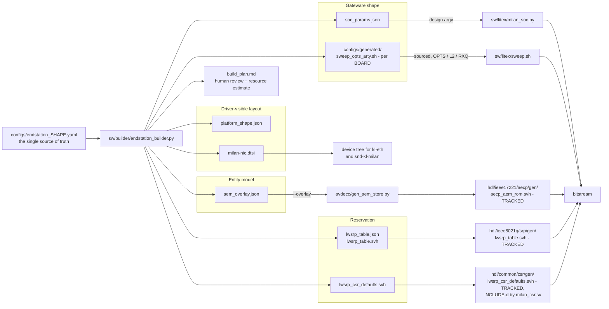

# Software-defined End-Station builder — spec basis (roadmap item 4)

**Purpose.** One declarative config (`configs/endstation_*.yaml`, schema
`kebag-logic/milan-endstation-config`) drives gateware elaboration, the AEM
ROM, lwSRP tables and the DT/driver shape consistently
([`docs/MILAN_COMPLIANCE_GAPS.md`](MILAN_COMPLIANCE_GAPS.md) attack item 4).

This document is the specification-referenced design record for that
builder: the settled design decisions with their clause basis, and the
config-schema → AEM-descriptor mapping.

Every clause reference below was verified against the local standards PDFs
(`$STANDARDS_DIR`) (pdftotext extraction, 2026-07-22) — the same rule as
[`SPEC_TRACEABILITY.md`](SPEC_TRACEABILITY.md). Cited documents: IEEE
1722.1-2021 ("1722.1"), IEEE 1722-2016 ("1722"), Milan Specification v1.2
Consolidated ("Milan"), IEEE 802.1Q-2022 ("Q").

The implementation lane (`sw/builder/endstation_builder.py`, the three
emitters, the `test_builder.py` identity gate against today's ROM) runs in
parallel; this document is the contract it converges on, and its rows are
meant to be promoted into the traceability matrix / bench features per the
[`SPEC_TRACEABILITY.md`](SPEC_TRACEABILITY.md) review workflow.

## Contents

- **[1. Artifacts and flow](#1-artifacts-and-flow)** — What one config emits and, more usefully, *who reads each file and where a stale one is caught* — a per-artefact table naming its consumer and its `test_builder.py` gate number. Only four files are tracked in the repo and can therefore go stale inside a commit; everything else is regenerated. Ends with the three example shapes side by side, where the cluster row shows the policy biting (8×8 emits 80 clusters, not 128).
- **[2. Settled design decisions](#2-settled-design-decisions)** — D1-D8 with their clause basis, opening with the index that says which four you can actually rely on today. The reasoning worth reading whole: D3 keeps talker `channels` and `clusters` as separate config fields because deriving one from the other is what produced the declared-8ch/wire-2ch silence, and D6/D7/D8 are recorded decisions with no RTL behind them yet.
- **[3. Config schema → AEM descriptor mapping](#3-config-schema--aem-descriptor-mapping)** — The 27-row field-by-field contract: each config key, the descriptor or argv it generates, the clause that governs it, and which consumer reads it. Three rows generate *planned* artifacts — the config validates and the build plan marks them rather than erroring.
- **[4. What the 8x8 shape adds (endstation_ax7101_8x8.yaml)](#4-what-the-8x8-shape-adds-endstation_ax7101_8x8yaml)** — Descriptor growth from 1×1 to 8×8 with the clause driving each count, and the new obligation the shape triggers: two or more AAF inputs make a CRF Media Clock Output mandatory, now enforced as a validation error. Also the honest split — the model half is done, the provisioning half rides with item 5, and the area cost at 100 MHz is a measurement this page declines to claim.
- **[5. Relation to the bench suite and the traceability matrix](#5-relation-to-the-bench-suite-and-the-traceability-matrix)** — Why the builder adds no normative behaviour of its own, and the two gates that hold it honest: today's config must reproduce the shipped ROM and `sweep.sh` argv byte-for-byte, and an unchanged model must keep an unchanged `entity_model_id`.

## 1. Artifacts and flow

```
configs/endstation_<shape>.yaml          (single source of truth)
        │  endstation_builder.py
        ├── soc_params.json   → sw/litex/milan_soc.py design argv
        │                       (flow flags — --build, threads, directives —
        │                        stay in sw/litex/sweep.sh)
        ├── aem_overlay.json  → avdecc/gen_aem_store.py migration contract
        │                       (descriptor counts, formats, cluster/map
        │                        layout, entity identity)
        ├── lwsrp_table.json  → the lwSRP (802.1Q MSRP/MVRP) reservation table:
        │   lwsrp_table.svh     SR class, MRP timers, class-A bandwidth math,
        │                       the 0x680 CSR reset words, the engine's
        │                       elaboration parameters, one record per stream
        ├── platform_shape.json → driver-visible layout: the Milan CSR base, the
        │   milan-nic.dtsi       DMA window map DERIVED from
        │                        board.constraints.rx_queues, the addresses
        │                        kl-eth hardcodes, and the kl,dma-ether /
        │                        kl,milan-pcm device-tree nodes
        └── build_plan.md     → human review; shapes beyond current RTL
                                VALIDATE and are marked "planned"

plus, repo-level and single-sourced so nothing can drift:
    configs/generated/sweep_opts_<board>.sh    OPTS / L2 / RXQ, sourced by
                                               sw/litex/sweep.sh (its inline
                                               tables are the loud FALLBACK only)
    hdl/ieee8021q/srp/gen/lwsrp_table.svh      the DEPLOYED shape's lwSRP table
    hdl/common/csr/gen/lwsrp_csr_defaults.svh  the CSR-facing SUBSET of it (the
                                               0x680 reset words + the
                                               PriorityAndRank byte)
```

That last file is the one to notice: **`milan_csr.sv` `` `include ``-s it**, so
the end-station config and the `LWSRP_*` register reset values are the same
source and cannot drift apart. The generator's own header
(`sw/builder/endstation_builder.py`) is authoritative for this list.

The tree above says *what is emitted*; it cannot say **who reads each file
and where a stale one gets caught** — which is the question you actually
have after editing a config:



Four things in that graph are **tracked in the repo**: the three `gen/`
headers marked TRACKED (one of them written by `gen_aem_store.py` rather than
by the builder) plus the per-board sweep fragment. Those are the only files
that can go stale inside a commit, and each has a byte-identity gate below.
Everything else is regenerated into `sw/builder/out/<config-stem>/` and is not
tracked at all.

| Artefact | What it carries | Read by | Gate in `sw/builder/test_builder.py` |
|---|---|---|---|
| `soc_params.json` | the `milan_soc.py` **design** argv this config implies (no flow flags) | `sw/litex/milan_soc.py` | 2 — argv equals `sweep.sh`'s design flags for arty *and* ax7101 |
| `aem_overlay.json` | descriptor counts, stream formats, per-stream STREAM_PORT / cluster / map layout, entity identity | `avdecc/gen_aem_store.py --overlay` | 3 (counts equal the hardcoded model), 6 (port-layout invariants), 10 (**the** gate: generated ROM byte-identical to the tracked `aecp_aem_rom.svh`), 15–17 (CRF output, dynamic maps) |
| `lwsrp_table.json` + `lwsrp_table.svh` | SR class, MRP timers, class-A bandwidth math, TSpec, one record per stream, the engine's elaboration parameters | the lwSRP RTL tree; the `rtl_table` config also writes the tracked copy | 18a–18d — emitted word ⇄ RTL symbol ⇄ reset block ⇄ readback table ⇄ register-map Reset column; the tracked `.svh` regenerates byte-identically |
| `lwsrp_csr_defaults.svh` | the CSR-facing **subset**: the `0x680` reset words + the PriorityAndRank byte | `` `include ``-d by `hdl/common/csr/milan_csr.sv` | 20a — the loop is closed: no `0x680` literal survives in the RTL, and every flow compiling `milan_csr.sv` carries the include dir |
| `platform_shape.json` + `milan-nic.dtsi` | Milan CSR base, the DMA window map **derived from** `board.constraints.rx_queues`, the addresses `kl-eth` hardcodes, the `kl,dma-ether` / `kl,milan-pcm` nodes | device tree / driver | 19a (queue count is one number across config, argv, sweep fragment and DT), 19b (window bases byte-match the generated CSR listing and the deployed tree), 19c (flipping `rx_queues` under a pinned boot chain is refused) |
| `build_plan.md` | human review, capability marks, the LUT/FF/BRAM36/DSP estimate and its OK / TIGHT / OVER verdict | a human | 4 (planned marks), 11 (estimate within ±15 % of the real place report), 12 (deterministic), 13 (verdict thresholds and UPPER BOUND labelling) |
| `configs/generated/sweep_opts_<board>.sh` | `OPTS` / `L2` / `RXQ` for the board | sourced by `sw/litex/sweep.sh`, whose inline tables are the loud fallback | 9 — byte-for-byte against `sweep.sh`, per board, and `sh -n` on all three files |

Three example shapes exist: `endstation_arty_current.yaml` (today's real
Arty build — the identity gate), `endstation_arty_4x4.yaml` and
`endstation_ax7101_8x8.yaml` (the roadmap-item-5 NxN test shapes). Descriptor
counts below are read out of the **emitted** `aem_overlay.json`, not
predicted — they are what `gen_aem_store.py` is handed:

| | `arty_current` | `arty_4x4` | `ax7101_8x8` |
|---|---|---|---|
| Board · audio interface | arty · `i2s_philips` | arty · `tdm8` | ax7101 · `tdm16` |
| AAF listeners × talkers | 1 × 1 | 4 × 4 | 8 × 8 |
| Listener / talker channels | 8 / 2 | 4 / 4 | 8 / 8 |
| Talker `clusters` (D3) | 8 | 2 | 2 |
| `cluster_mapping.policy` | `cluster-per-stream-channel` | `cap-at-interface` | `cap-at-interface` |
| `clocking.crf_output` | absent (legal at 1 listener) | enabled | enabled |
| STREAM_INPUT / STREAM_OUTPUT | 2 / 1 | 5 / 5 | 9 / 9 |
| STREAM_PORT_INPUT / _OUTPUT | 1 / 1 | 4 / 4 | 8 / 8 |
| AUDIO_CLUSTER | 16 | 24 | 80 |
| AUDIO_MAP | 2 | 8 | 16 |
| CLOCK_SOURCE | 3 | 6 | 10 |

The cluster row is where the policy bites and where a guess would have been
wrong: `cap-at-interface` takes `min(stream.clusters, interface channels per
direction)`, so the 8×8 shape emits 8 input ports × 8 + 8 output ports × 2 =
**80** clusters, not one per stream channel in both directions.

## 2. Settled design decisions

Eight decisions, four of them still unimplemented. Read this index first —
it is the only place that says which of D1–D8 you can rely on today:

| # | Decision, in one line | Rests on | Status |
|---|---|---|---|
| **D1** | one STREAM_PORT per AAF stream, each owning a contiguous cluster block and one AUDIO_MAP; CRF gets no port | 1722.1 7.2.13, 7.2.19; Milan 5.4.2.27/28 | **implemented** — emitted and layout-gated (gate 6) |
| **D2** | cluster policy is config-selectable; a stream channel maps to a mono MBLA AUDIO_CLUSTER | 1722.1 7.2.16/7.2.16.1; Milan 6.4, 5.3.10.1, 5.4.2.27 | **implemented** — both policies gated (gate 7) |
| **D3** | talker `clusters` is its own config field, never derived from `channels` | 1722.1 7.2.6, 7.4.10.2; Milan 5.3.7.1, 5.3.9.1, 6.3 | **implemented** — the shapes table above shows 8 vs 2 |
| **D4** | `entity_model_id` = deterministic hash of the model-shaping fields only, or a pin for flashed silicon | 1722.1 6.2.2.8 (incl. its exclusion list) | **implemented** — determinism, shape-sensitivity and the pin are gated (gate 8) |
| **D5** | the config is the single source of truth; flow flags stay in `sweep.sh`; `audio_interface.kind` selects the ser/des family | engineering + 1722.1 7.2.7/7.2.14/7.2.3 | **implemented** for `i2s_philips` and `tdmN`; `aes3`/`spdif` ser/des exists, its SoC plumbing is *planned*; the JACK / EXTERNAL_PORT model is *planned* |
| **D6** | AEM store splits: BRAM hot stub + DRAM bulk descriptor tree loaded from a builder-emitted, hash-verified blob | engineering (area: ~80 RAMB36 vs ~36 free) | **not implemented** (recorded 2026-07-25) |
| **D7** | dynamic-map store keyed by the **target** stream channel, not the source cluster | Milan 5.4.2.27/28 (one source per stream channel) | **not implemented** — today's RTL is input[0]-scoped and cluster-keyed |
| **D8** | role-named 8×8 port model: per-platform cluster pools, a Pilot cluster, a stream-loopback lane | 1722.1 7.2.19 (port-relative offsets) | **not implemented** — loopback lane and pool emission are pending |

> **D2 has moved on since it was written.** The builder's schema is 1.1: the
> field is `cluster_mapping.policy` (a `rule` key is an explicit error), and
> `cap-at-interface` — described below as the rejected alternative — is a
> supported policy that both NxN example shapes select. The row above states
> the schema; the section below states the reasoning that made
> `cluster-per-stream-channel` the default. Read them in that order.

### D1 — one STREAM_PORT per AAF stream

**Decision.** The builder's NxN model gives every AAF stream its own
STREAM_PORT_INPUT (listeners) / STREAM_PORT_OUTPUT (talkers), each owning a
contiguous group of clusters and exactly one AUDIO_MAP. The CRF
STREAM_INPUT carries no audio channels and gets no port. Today's
1(+CRF)x1 shape degenerates to one port per direction — numerically
identical to the shipped ROM (`avdecc/gen_aem_store.py`), which is what the
v1.0 overlay gate asserts.

**Clause basis.**
- 1722.1 7.2.13 (Table 7-23): each STREAM_PORT_INPUT/OUTPUT descriptor
  carries its own `number_of_clusters`/`base_cluster` and
  `number_of_maps`/`base_map` — the cluster/map ownership boundary in AEM
  *is* the port.
- 1722.1 7.2.19: an AUDIO_MAP "contained in" a port maps channels of
  STREAM_INPUTs/OUTPUTs to channels of the AUDIO_CLUSTERs "contained in the
  same" port, and `mapping_cluster_offset` is "the offset from the
  base_cluster of the STREAM_PORT_INPUT or STREAM_PORT_OUTPUT" — map
  contents are port-relative by construction.
- Milan 5.4.2.27/5.4.2.28: the static-vs-dynamic mapping regime is decided
  **per port** ("For each Stream Port Input and for each Stream Port Output
  that has no Audio Map, the PAAD-AE shall implement the
  ADD_AUDIO_MAPPINGS command…"; ports *with* Audio Maps answer
  NOT_SUPPORTED). 1722.1 7.2.13 encodes the same split: dynamic-mapping
  entities set `number_of_maps = 0` and serve GET_AUDIO_MAP (7.4.44).

**Why.** Port-relative map offsets mean each stream's map is the identity
map over its own cluster group regardless of global cluster numbering —
adding or removing a stream never rewrites another stream's AUDIO_MAP
contents, only base indices.

The 7.2.19 uniqueness rules (input: at most one entry per cluster channel;
output: at most one entry per stream channel across the entire
Configuration) hold trivially for per-port identity maps.

And because Milan's static/dynamic split is per-port, one-port-per-stream
is what later lets roadmap item 8 (dynamic maps, es-4.16) flip individual
streams to `number_of_maps = 0` without touching the rest of the model.

### D2 — cluster policy: mono cluster per stream channel (cap-at-interface rejected)

**Decision.** Schema 1.0 defines a single `cluster_mapping.rule`:
`mono-cluster-per-stream-channel` — every stream channel gets one mono
MBLA AUDIO_CLUSTER (1722.1 7.2.16/7.2.16.1), so a stream's cluster count
defaults to its channel count. The rejected alternative ("cap at
interface") would have sized the cluster space to the physical audio
interface width instead.

**Clause basis.**
- 1722.1 7.2.16: an audio cluster "describes groups of audio channels in a
  stream" with a per-cluster `channel_count` and a single `format` for all
  its channels (7.2.16.1: MBLA = Multi-bit Linear Audio) — mono clusters
  are legal and give per-channel granularity.
- Milan 6.4 (+ its note): a Stream Input that advertises one 48 kHz Base
  format shall advertise **all** 48 kHz Base formats — i.e. all channel
  counts up to 8 (Milan 6.2: N ∈ {1, 2, 4, 6, 8}). The model must be able
  to represent maps for the largest advertised format, not for the
  physical interface.
- Milan 5.3.10.1: a mapped cluster channel must reference a Stream Input
  channel "lower than the number of channels in the current format" — with
  one mono cluster per stream channel the representable map space exactly
  tiles the format family.
- Milan 5.4.2.27: a (dynamic) mapping referencing a stream channel that
  does not exist in the currently set format is invalid — cluster capacity
  and format family have to agree, and they only agree for every member of
  the ut family (1722 I.2.4) if clusters cover the maximum channel count.

**Why.** Cap-at-interface makes the AEM model a function of the hardware
SKU: an 8ch-capable Stream Input behind Arty's 2ch I2S could not represent
mappings for channels 2..7, violating the Milan 6.4 all-channel-counts
posture the moment a controller selects a wider family member.

With cluster-per-stream-channel the model is constant across interface
families and the *physical* truth lives in the binding rule instead
(project wire-truth 1-to-1 rule, `c705091`): physical interface channels
bind in order to the first clusters per direction; extra stream channels
are virtual; missing physical channels render 0.

Mono clusters also match the PipeWire reference layout the ROM was
byte-derived from.

### D3 — talker cluster count as config

**Decision.** `streams.talkers[].clusters` is an explicit config field,
independent of `streams.talkers[].channels` (today's shape: 8 output
clusters, 2-channel talker framer — the shipped ROM's PipeWire reference
layout).

**Clause basis.**
- 1722.1 7.2.6 + 7.4.10.2: GET_STREAM_FORMAT returns "the current stream
  format… equivalent to the current_format field in the addressed…
  descriptor" — the *declared current format* is the contract a controller
  reads, and it must equal what the framer actually transmits
  (channels_per_frame, 1722 7.3.3: "the number of audio channels
  represented in the audio sample frame").
- Milan 5.3.7.1: a Stream Output shall always be using a format from its
  advertised formats list (one ut entry may describe the whole family).
- Milan 5.3.9.1: "each channel of each Stream Output **(in the current
  format)** is either not mapped or mapped to a channel of an Audio
  Cluster" — the map/cluster space may be larger than the current format's
  channel count; only currently-formatted channels participate.
- Milan 6.3: a talker "may advertise any Base Format that is reasonable
  for its functionality" — the advertisement is a functional choice, not a
  hardware echo.

**Why.** Wire truth and model capacity are different quantities.

- The talker's `channels` is wire truth (what the framer emits — the value
  GET_STREAM_FORMAT must report, and the pure-ACMP compatibility gate:
  listeners with no SET_STREAM_FORMAT round-trip connect against the
  *current* format).
- The talker's `clusters` is model shape (how much routing capacity the
  entity exposes; today 8, per the reference layout).

Deriving one from the other silently is exactly the class of divergence
that produced the declared-8ch/wire-2ch silence incident — so both are
config, and the builder refuses to guess.

### D4 — entity_model_id derivation

**Decision.** `entity.entity_model_id` accepts either a pinned EUI-64 (the
form used for already-deployed silicon) or a derivation contract: a
deterministic hash of exactly the model-shaping config fields, folded into
a vendor-OUI-based EUI-64 base. Abstract contract only here — the concrete
field walk lives with the implementation lane.

**Clause basis (1722.1 6.2.2.8, all load-bearing).**
- "Different ATDECC Entity data models **shall** have different
  entity_model_id values", and "if a firmware revision changes the
  structure of an ATDECC Entity data model then it **shall** use a new
  unique entity_model_id" — any config change that alters a generated
  descriptor field must change the id.
- The clause then enumerates the fields **excluded** from "structure":
  - `object_name` everywhere; ENTITY `entity_name`, `firmware_version`,
    `group_name`, `serial_number`, `available_index`, `association_id`,
    `current_configuration`;
  - AUDIO_UNIT `current_sampling_rate`; STREAM_INPUT/OUTPUT
    `current_format`;
  - CLOCK_SOURCE `clock_source_identifier`/`flags`; CLOCK_DOMAIN
    `clock_source_index`; control current values;
  - AVB_INTERFACE `mac_address` + gPTP dynamics.
- These must **not** feed the hash, so renaming a unit, bumping
  `firmware_version`, changing a serial number or re-selecting a clock
  source never bumps the model id.
- NOTE in 6.2.2.8: "The entity_model_id is not a device's product or model
  number" — hence hash-of-model, not SKU constant.
- 6.2.2.8 also defines dynamically-assigned ids via the EUI-64 I/G bit; the
  builder does not use them (controllers may not cache descriptors for
  dynamic ids — the caching benefit is the point of a stable id).

**Why + the pin override.** Controllers cache descriptor trees keyed by
entity_model_id (the ADP-6 traceability row's field catch: reusing an id
across ROM changes serves stale models — and the inverse, gratuitous id
churn, defeats caching and can strand saved bindings, cf. 1722.1's own
note on stale connections after entity_model_id changes).

Hashing the model-shaping fields makes "model changed ⇔ id changed"
structural instead of a release-checklist item.

The pin override exists because both flashed boards already advertise
fixed ids; a pinned config must reproduce them byte-exactly, and the
builder's job there is to *verify* the pin still matches the generated
model rather than to invent a new id.

### D5 — config as single source of truth (sweep flags generated)

**Decision.** The YAML config is the only place a design fact lives; the
`milan_soc.py` design argv (`soc_params.json`), the AEM overlay, and the
DT/driver shape are all emitted from it. Flow flags (`--build`,
`--vivado-max-threads`, `--place-directive`, output dirs) are explicitly
*not* end-station definition and stay in `sw/litex/sweep.sh`.

**Why (engineering, no clause needed).** Today the same fact lives in up to
four places — `sweep.sh` OPTS, `gen_aem_store.py` constants,
`milan_soc.py` defaults, the DT — and every desynchronization so far became
a field incident: declared-8ch vs wire-2ch silence, the honest-counts
provisioning round, the AEM-default-8ch trap that rejected 2ch pure-ACMP
connects.

A generated artifact can be stale but never *divergent*; the
`test_builder.py` gate pins the emitted argv to `sweep.sh`'s BASE and the
overlay counts to the shipped ROM for today's shape.

**Audio-interface family subtask** (gaps item 4 subtask). The config's
`audio_interface.kind` — `tdm8|tdm16|tdm32|i2s_philips|aes3|spdif` — selects
the ser/des RTL family and its parameters (slots, word length, frame
format).

In RTL today: `i2s_philips` (`KL_i2s_playback` /
`aaf_talker_i2s`/`KL_aaf_capture_i2s`, the default) and the `tdmN` kinds.
The builder emits `--audio-interface tdmN`, which `milan_soc.py` maps to
the `milan_datapath` `AUDIO_IF_SLOTS_P` generate select instantiating the
`KL_tdm_capture` TDM slave (N slots × 32-bclk words, pulse or 50%-duty
frame sync, data delay 0/1).

Its per-slot pair stream feeds the `KL_aaf_packetizer` multi-channel
payload builder (TCTX `chans` = `channels_per_frame`, even 2..8 per
stream, partitioning the pair-slot space).

`aes3`/`spdif` are the biphase-mark family. Since 2026-07-26 the ser/des
RTL exists — `KL_aes3_rx` (recovered symbol clock, X/Y/Z subframe and
192-frame block framing, P-parity, channel status, honest lock/error
census) and `KL_aes3_tx` (the encoder), proven by `tb/verilator/aes3` — so
the config now SELECTS a real family member: one core serves both
transports and `audio_interface.kind` picks `CONSUMER_P` (AES3-2009
professional vs IEC 60958-3 consumer channel status) while
`word_length_bits` picks `WORD_BITS_P` (16/20/24). The builder emits those
parameters plus the serial clock the transport forces
(`sampling_rate_hz × 128 UI/frame × 4 oversample`, refused unless it is an
exact `audio_pll_hz` divide) in `build_plan.md` and in `interface_params`.
What is still a **planned** mark is the SoC plumbing: the `milan_datapath`
front-end generate for the AES3 family and the `milan_soc.py
--audio-interface` value that selects it (the `tdmN` path, reused). The
pair-stream contract lives in
[`hdl/ieee1722/aaf/doc/audio_frontend_family.md`](../hdl/ieee1722/aaf/doc/audio_frontend_family.md).

On the AEM side the physical interface is modeled by, per 1722.1:
- **JACK_INPUT/JACK_OUTPUT** (7.2.7): the physical connector, with
  `jack_type` from Table 7-12 — `SPDIF` and `AES_EBU` are dedicated types;
  TDM and I2S headers use the generic `DIGITAL` type.
- **EXTERNAL_PORT_INPUT/OUTPUT** (7.2.14): the Unit-side port "matching"
  the Jack, carrying the `signal_type`/`signal_index` chain into the unit.
- **AUDIO_UNIT** (7.2.3): "represents a single audio clock domain"; its
  external-port base/count fields and `sample_rates` list are where the
  interface's port count and the rate set surface.
- **AUDIO_CLUSTER** (7.2.16): the `signal_type`/`signal_index` fields tie
  clusters into that signal chain (INVALID for clusters on a
  STREAM_PORT_INPUT).

Today's ROM deviates knowingly: it defines **no** JACK/EXTERNAL_PORT
descriptors (deviation recorded in the `gen_aem_store.py` header — the
entity JSON's 8 external ports are not emitted). The schema reserves the
physical-side model for this subtask; the builder's capability marks call
every non-I2S `kind` "planned".

### D6 — descriptor storage split: BRAM hot stub + DRAM bulk tree (model as a file)

**Decision** (USER 2026-07-25). The AEM store splits in two:

- a small **BRAM stub** keeps the hot, latency-critical rows single-cycle —
  ENTITY, CONFIGURATION, the identity registers, the dynamic overlays and
  counter paths (none of which depend on the bulk ROM);
- the **bulk descriptor tree** (AUDIO_CLUSTERs, STRINGS/LOCALEs — cold and
  bulky) lives in **DRAM** behind a read-only fetch master, loaded at boot
  by the driver from a **builder-emitted model blob** and verified against
  the D4 `entity_model_id` hash.

**Why.** The D8 per-port cluster pools cost roughly 250–300 KB — ~80 RAMB36
against ~36 free on the ship build (impossible in BRAM, trivial in 512 MB
DDR3). AECP is control-plane: at the measured DDR3 floor a 512 B descriptor
assembles in tens of µs against 250 ms-class protocol timeouts, and a full
fat-tree enumeration stays in the low milliseconds. DRAM-backed fabric
structures are established practice here (the PCM ring and the latency
history ring). The prize beyond area: the entity model becomes a **loadable
file** — a model change no longer needs a bitstream rebuild.

**Rules pinned with the decision:**

1. **Boot sequencing** — the entity **advertises only after the blob is
   loaded and hash-verified** (an advertised entity that cannot be
   enumerated is worse than a late one). Fabric ACMP saved-state restore is
   independent of the bulk tree and keeps working before the load.
2. **QoS** — the descriptor fetch master takes the lowest priority on the
   DRAM port; it never delays the PCM or Ethernet rings; the bounded worst
   case gets documented with the RTL.
3. **Integrity** — a hash mismatch means no advertise plus a diagnostic CSR
   code, never a silently wrong model.

Status: decision recorded 2026-07-25, **not implemented** — the accessor
fetch engine, the driver loader and the blob emitter are pending subtasks;
verification rows land with the RTL.

### D7 — dynamic-map store keyed by the TARGET (stream channel), not the source cluster

**Decision** (USER 2026-07-25). The dynamic audio-map store flips its key:
per dynamic port, one entry **per stream channel** holding `{valid,
source}` — replacing today's `key = cluster_offset` store.

**Why.** The invariant Milan 5.4.2.27/28 protects is *one source per stream
channel* (no mixing). The cluster-keyed store enforces the converse — one
target per source — which forbids legal **selection fan-out** (the Pilot
cluster onto many channels). The target-keyed word is structurally the
CHMAP map word (`{EN, SRC, IDX}` per slot,
[`reference/REGISTER_MAP.md`](reference/REGISTER_MAP.md) 0x900
group): the AEM engine becomes the canonical projector into the fabric map,
completing [`CHMAP64_AEM_BINDING.md`](CHMAP64_AEM_BINDING.md). Per-port
store instances keep `stream_index` implicit, exactly as D1 intends. The
ADD/REMOVE contract (all-or-nothing validate-commit, unsolicited on change,
lock rules) is unchanged and owed on every dynamic port.

Status: recorded 2026-07-25; today's RTL is input[0]-scoped and
cluster-keyed (`` `AEM_DYNMAP ``) — the migration is the store flip,
per-port instances, and the render/capture consumption follow-up.

### D8 — role-named 8×8 port model: per-platform cluster pools, Pilot cluster, loopback lane

**Decision** (USER sketch 2026-07-25, reconciled to D1/D2). The NxN model
keeps one STREAM_PORT per stream (D1) and mono clusters (D2), but ports are
**role-named** ("TDM 1..8", "PipeWire 1..8"). Because a mapping's
`cluster_offset` is **port-relative** (1722.1 7.2.19), there are no shared
cluster pools: each port carries its own pool, and pool contents are
**derived from the platform config, never hardcoded** —

- the physical audio-interface channels (the AX today: TDM8 + I2S = 10 per
  direction — a "64 TDM" pool is only honest on a platform that
  instantiates it);
- the PipeWire lane channels for that stream (8 per subdevice);
- on talker ports, **one Pilot cluster** (the tone source; fan-out is legal
  selection under D7);
- on talker ports, **stream_loopback clusters** (the received pair streams
  as talker sources — same media-clock domain, so coherent). This is a
  **new fabric lane**: the rx pair streams are not in today's capture-mux
  source set; RTL plus traceability rows are a pending subtask.

Talker-port maps program the capture mux; listener-port maps program the
render map. The all-channels pilot run uses D7 fan-out (or the 0x900 bench
override until D7 lands). The CRF Media Clock Output rule (7.2.3) and the
clock tree are untouched by this decision.

Status: model shape recorded 2026-07-25; the loopback lane and the
per-platform pool emission are pending subtasks.

## 3. Config schema → AEM descriptor mapping

Consumers: **AEM** = `avdecc/gen_aem_store.py` (via `aem_overlay.json` —
the migration contract), **SoC** = `sw/litex/milan_soc.py` (via
`soc_params.json` argv), **DT** = device tree / `kl-eth` driver shape,
**prov** = boot-time provisioning (CSR writes: ADP identity/counts block).
"—" in the clause column = engineering fact, no normative clause governs
the field itself.

| # | Config field | Generates (descriptor / field) | Clause ref | Consumer |
|---|--------------|--------------------------------|-----------|----------|
| 1 | `entity.name` | ENTITY `entity_name` (identity only — excluded from model hash) | 1722.1 7.2.1, 6.2.2.8 | AEM |
| 2 | `entity.entity_model_id` (pin or hash, D4) | ENTITY + ADPDU `entity_model_id` | 1722.1 6.2.2.8 | AEM, prov |
| 3 | `entity.entity_id: mac-derived` | ENTITY/ADPDU `entity_id` EUI-64 from port MAC | 1722.1 6.2.2.7 | prov |
| 4 | `entity.vendor_name` / `firmware_version` / `serial_number` / `group_name` | ENTITY strings + LOCALE/STRINGS refs (all 6.2.2.8-excluded) | 1722.1 7.2.1, 7.2.11–12 | AEM |
| 5 | `board.target` + `board.constraints.*` (clk, l2, phy, flashboot, uart, probes, GMII knobs) | `milan_soc.py` design argv | — | SoC |
| 6 | `board.constraints.rx_queues` / `hs_page_bytes` | DT/driver shape (STRICT `hsplit` pairing) | — | DT |
| 7 | `clocking.sampling_rate_hz` | AUDIO_UNIT `current_sampling_rate` (6.2.2.8-excluded) | 1722.1 7.2.3 | AEM |
| 8 | `clocking.audio_unit_rates_hz` | AUDIO_UNIT `sample_rates` list | 1722.1 7.2.3 | AEM |
| 9 | `clocking.media_clock_sources` | CLOCK_SOURCE set: INTERNAL + one INPUT_STREAM per AAF listener (+ CRF, row 11) | 1722.1 7.2.9, 7.2.9.2 | AEM |
| 10 | `clocking.default_source` | CLOCK_DOMAIN `clock_source_index` reset value (6.2.2.8-excluded; persisted per Milan) | 1722.1 7.2.32; Milan 5.3.11.1 | AEM, SoC |
| 11 | `clocking.crf_sink` | CRF STREAM_INPUT (appended after AAF listeners) + its INPUT_STREAM CLOCK_SOURCE + `KL_crf_rx` instance | Milan 7.2.2; 1722.1 7.2.9.2 | AEM, SoC |
| 12 | `clocking.crf_format` | CRF STREAM_INPUT `formats` entry (48 kHz base, 1 ts/PDU, interval 96) | Milan 7.3.2 | AEM |
| 13 | `clocking.audio_pll_hz` | audio MMCM constraint (MCLK derivation) | — | SoC |
| 14 | `audio_interface.kind` | ser/des RTL family + params (`i2s_philips` = default front-end; `tdmN` → `--audio-interface` → `AUDIO_IF_SLOTS_P` / `KL_tdm_capture`; `aes3`/`spdif` → `KL_aes3_rx`/`KL_aes3_tx` `CONSUMER_P`, SoC plumbing planned); planned: JACK_IN/OUT `jack_type`, EXTERNAL_PORT_IN/OUT, AUDIO_UNIT ext-port counts (D5) | 1722.1 7.2.7 (Table 7-12), 7.2.14, 7.2.3 | SoC, AEM (planned) |
| 15 | `audio_interface.word_length_bits` | ser/des word length; bounds usable AAF `bit_depth` | 1722 7.3.4 | SoC |
| 16 | `audio_interface.cluster_mapping.rule` | AUDIO_CLUSTER + AUDIO_MAP generation policy (D2) | 1722.1 7.2.16, 7.2.19; Milan 5.3.9.1/5.3.10.1 | AEM |
| 17 | `streams.listeners[].channels` | STREAM_INPUT default `current_format` channel count (= wire `channels_per_frame`) | 1722.1 7.2.6; 1722 7.3.3; Milan 6.4 | AEM, SoC |
| 18 | `streams.listeners[].formats` | STREAM_INPUT `formats` list (ut families per Milan) | 1722.1 7.2.6; Milan 5.3.8.1, 6.5; 1722 I.2.4 | AEM |
| 19 | `streams.listeners[].buffer_length_ns` | STREAM_INPUT `buffer_length` (ns, MAC ingress buffer) | 1722.1 7.2.6 (Table 7-8) | AEM |
| 20 | `streams.listeners[].clusters` | input AUDIO_CLUSTERs (mono MBLA) + STREAM_PORT_INPUT `number_of_clusters`/`base_cluster` + identity AUDIO_MAP (D1/D2) | 1722.1 7.2.13, 7.2.16, 7.2.19 | AEM |
| 21 | `streams.talkers[].channels` | STREAM_OUTPUT `current_format` = framer wire truth (D3) | 1722.1 7.2.6, 7.4.10.2; Milan 5.3.7.1; 1722 7.3.3 | AEM, SoC |
| 22 | `streams.talkers[].formats` | STREAM_OUTPUT `formats` list | 1722.1 7.2.6; Milan 6.3 | AEM |
| 23 | `streams.talkers[].clusters` | output AUDIO_CLUSTERs + STREAM_PORT_OUTPUT bases + AUDIO_MAP (D1/D3) | 1722.1 7.2.13, 7.2.16, 7.2.19; Milan 5.3.9.1 | AEM |
| 24 | `len(listeners)` / `len(talkers)` | CONFIGURATION `descriptor_counts`; ADPDU `talker_stream_sources` / `listener_stream_sinks` (honest counts) | 1722.1 7.2.2, 6.2.2.10, 6.2.2.12 | AEM, prov |
| 25 | stream count (NxN shapes) | per-stream ACMP/MAAP/monitor contexts + per-stream lwSRP attribute instances (capacity is an implementation decision, stated in PICS) | Q 35.2.7 | SoC (planned, item 5) |
| 26 | whole config (stream/cluster/L2 counts) | build-plan `## Resource estimate`: LUT/FF/BRAM36/DSP vs xc7a100t + OK/TIGHT/OVER verdict (cost table calibrated from the real mf48 place report; NxN rows UPPER BOUND; recipe in [sw/builder/README-parameters.md](../sw/builder/README-parameters.md)) | - (engineering budget; area-70 directive) | build_plan.md |
| 27 | `clocking.crf_output` (enabled + format) | CRF STREAM_OUTPUT appended after the AAF talkers (mirrors the CRF sink: no STREAM_PORT/cluster/map — it carries no audio); `stream_flags` = CLOCK_SYNC_SOURCE\|CLASS_A (0x0003); domain wiring = the STREAM descriptor's own `clock_domain_index` 0 — 7.2.9.2 defines no OUTPUT_STREAM CLOCK_SOURCE type, so the CLOCK_SOURCE/CLOCK_DOMAIN sets are unchanged; ADPDU `talker_stream_sources` +1. **RULE ENFORCED**: >=2 AAF listener streams reject without it, citing Milan 7.2.3 | Milan 7.2.3, 7.3.2 (format 0x041060010000BB80), 7.3.3 (Class A); 1722.1 7.2.6, 7.2.6.1, 7.2.9.2, 7.2.32 | AEM; SoC (provisioning planned, item 5) |

27 rows. Rows 14 (AEM half), 25, and the SoC half of 27 generate *planned*
artifacts: the config validates and the overlay is complete, but the RTL
lands with the referenced roadmap items — the build plan marks them, never
errors.

## 4. What the 8x8 shape adds (`endstation_ax7101_8x8.yaml`)

Descriptor growth under D1–D3, relative to today's 1(+CRF)x1 model
(counts per 1722.1 7.2.2 CONFIGURATION `descriptor_counts`):

| Descriptor | today | 8x8 | clause driving the count |
|------------|-------|-----|--------------------------|
| STREAM_INPUT | 2 (1 AAF + CRF) | 9 (8 AAF + CRF) | 1722.1 7.2.6; Milan 7.2.2 (CRF input stays mandatory) |
| STREAM_OUTPUT | 1 | 9 (8 AAF + CRF output) | 1722.1 7.2.6; Milan 7.2.3 (>=2 AAF inputs => CRF Media Clock Output) |
| STREAM_PORT_INPUT / _OUTPUT | 1 / 1 | 8 / 8 (D1: one per AAF stream; CRF gets none) | 1722.1 7.2.13 |
| AUDIO_CLUSTER | 16 (8 in + 8 out) | 128 (64 + 64, mono MBLA) | 1722.1 7.2.16; Milan 6.4 |
| AUDIO_MAP | 2 | 16 (one identity map per port) | 1722.1 7.2.19 |
| CLOCK_SOURCE | 3 | 10 (internal + 8× INPUT_STREAM + CRF) | 1722.1 7.2.9.2 |
| ADP `talker_stream_sources` / `listener_stream_sinks` | 1 / 2 | 9 / 9 (CRF output counted) | 1722.1 6.2.2.10 / 6.2.2.12 |

Unchanged: ENTITY, CONFIGURATION, AUDIO_UNIT (still one clock domain,
1722.1 7.2.3), AVB_INTERFACE, CLOCK_DOMAIN, CONTROL, LOCALE, STRINGS.

> **The AUDIO_CLUSTER row is the count under `cluster-per-stream-channel`
> with talker `clusters` = 8.** The tracked `endstation_ax7101_8x8.yaml`
> selects `cap-at-interface` and talker `clusters: 2` instead, so the overlay
> it actually emits carries **80** clusters (8 input ports × 8 + 8 output
> ports × 2) — see the shapes table in §1. Every other row above matches the
> emitted overlay exactly.

**New Milan obligation the shape triggers — model half DONE.** With two
or more AAF Media Inputs, Milan 7.2.3 makes a **CRF Media Clock Output**
mandatory (7.2.2 already mandates the CRF input, which we have).

The builder now ENFORCES the rule (`clocking.crf_output`, mapping row 27:
a >=2-AAF-listener config without it is a validation error citing 7.2.3)
and the overlay/`gen_aem_store.py` advertise the CRF STREAM_OUTPUT
(Milan 7.3.2 format `0x041060010000BB80`, `clock_domain_index` 0,
CLOCK_SYNC_SOURCE|CLASS_A, no audio port — mirrors the CRF sink; counts
above include it).

The fabric talker exists (`KL_crf_tx`, CSRs 0x750–0x764, silicon-proven at
500 PDU/s); what still rides with the item-5 round is the *provisioning*
half: S50 boot wiring + the ACMP talker context for the CRF stream (plus
its Class-A reservation, Milan 7.3.3 — traceability M-CLK-2).

**Stays planned-item-5** (config validates, build plan marks it):

- per-stream ACMP listener/talker contexts;
- per-stream MAAP allocations and RX-monitor counter blocks;
- per-stream lwSRP registrar/declaration instances (Q 35.2.7 — today's
  engine is single-stream, traceability row SRP-9);
- the CRF stream's own reservation (Milan 7.3.3, Class A — traceability
  M-CLK-2);
- the TDM16 ser/des (item-4 audio subtask, D5).

What 8 depacketizer/framer contexts cost the AX7101 in area/timing at
100 MHz is an item-5 measurement, not a claim this document makes.

## 5. Relation to the bench suite and the traceability matrix

The builder does not add new normative behavior — it *generates* the
artifacts whose behavior the existing rows already verify (AEM-1..8,
M-FMT-1/2, ADP-7 honest counts, M-AECP-4 static-maps posture).

Its own gates are:

- (a) the `test_builder.py` identity gate — today's config must reproduce
  the shipped ROM's descriptor counts and `sweep.sh`'s design argv
  byte-for-byte;
- (b) on migration, `gen_aem_store.py` consuming the overlay must keep the
  bench conformance suite green on both boards with an unchanged
  entity_model_id for an unchanged model (D4).

Any new descriptor content the NxN shapes introduce (per-stream
ports/maps, CRF output) gets new traceability rows before it gets RTL,
per the matrix's review workflow.
