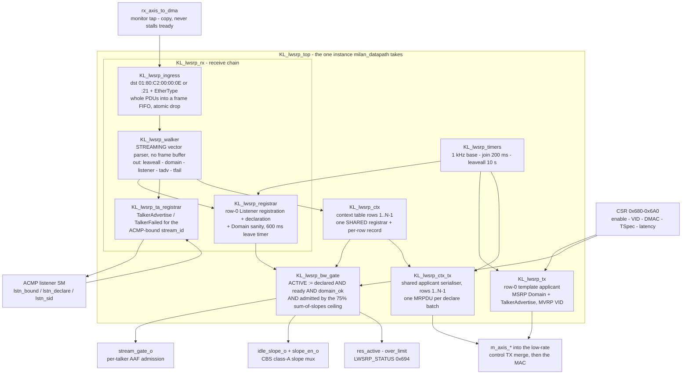

# lwSRP-fpga — lightweight SRP engine in fabric

Status: **IMPLEMENTED 2026-07-14** (talker endpoint; RTL in [`hdl/ieee8021q/srp/`](../hdl/ieee8021q/srp),
integrated into `milan_datapath`; CSR group re-homed to **0x680-0x6A0** —
[REGISTER_MAP.md](reference/REGISTER_MAP.md) is normative for the map, §4 below matches it). Verified:
Verilator `lwsrp_tx` 363 / `lwsrp_rx` 75 / `lwsrp` 36 checks + `milan_dp`
53 + `csr` 76 regressions green; Yosys portability green (counts as of
2026-07-14 — the `tops=()` array in [`syn/yosys/run.sh`](../syn/yosys/run.sh) and `ls tb/verilator/`
are the authoritative counts). Wire contract extracted from
pipewire module-avb mrp.c/msrp.c/mvrp.c (byte-exact; one deliberate
deviation: we gate the talker on the four-packed Ready/ReadyFailed
declaration, the reference ignores it — see §1). Silicon vs the AVB switch +
the peer host = the remaining §6.3 gate. Listener half lands with STREAM_INPUT.
Pattern of record: the ADP/AECP/ACMP responder recipe (registered monitor tap,
template TX, low-rate merge, CSR status) — proven Milan=1-clean four times.

## Contents

- **[1. What lwSRP must do (and what it deliberately does not)](#1-what-lwsrp-must-do-and-what-it-deliberately-does-not)** — The scope cut that makes a conformant engine small: an always-declare applicant subset instead of the 12-state MRP machine, no MMRP, no class B. Also the ACTIVE predicate that gates media — declared AND ready AND domain-ok AND under 75 % of port rate.
- **[2. Wire formats (byte-exact, the part that must never be guessed)](#2-wire-formats-byte-exact-the-part-that-must-never-be-guessed)** — Every constant you need to build or decode an MRPDU: the two link-local DMACs, EtherTypes `0x22EA`/`0x88F5`, three/four-packed event arithmetic, and each FirstValue layout. Carries the vector trap — value *k* is FirstValue incremented *k* times, so the RX walker must range-match the StreamID, not equality-match. Ends with the idleSlope formula and where the 42-byte overhead comes from.
- **[3. Block architecture (hdl/ieee8021q/srp/, KL_lwsrp_\*)](#3-block-architecture-hdlieee8021qsrp-kl_lwsrp_)** — Where an MSRP attribute enters and what three things it leaves as, plus a module-by-module table of who owns which piece of MSRP state (the walker owns none). Includes a 2026-07-26 audit note: the tree holds 11 modules, not the 9 this page and [`SPEC_TRACEABILITY.md`](SPEC_TRACEABILITY.md) still quote, and `KL_lwsrp_applicant` was never built. §3.2 is the superseded 2026-07-14 sketch, kept as a design record.
- **[4. CSR group (0x680-0x6A0 as built — re-homed from the original 0x660](#4-csr-group-0x680-0x6a0-as-built--re-homed-from-the-original-0x660)** — Eight registers, with `LWSRP_STATUS 0x694` broken out bit by bit — the single read that tells you whether a reservation is live and why not. Notes that the class-A queue field moved and its reset changed at `VERSION 0x0011`/`0x0014`, and that two TCAM entries must admit the link-local DMACs.
- **[5. Integration contract](#5-integration-contract)** — What each neighbour gets from the engine: the slope mux into the shaper, `stream_gate[0]` as the AAF framer's transmit enable (no reservation, no media, by construction), real fields for GET_STREAM_INFO, and `reservation_active` as the ACMP acceptance check.
- **[6. Verification plan (the campaign recipe)](#6-verification-plan-the-campaign-recipe)** — Three tiers and what each must prove, down to the specific bridge-side PDUs to hand-build (multi-value vectors offset from our StreamID — the +k trap). The silicon gate uses the peer host's module-avb as the listener oracle, and unplugging it must close the gate within the leave time.
- **[7. Implementation order (each step green before the next)](#7-implementation-order-each-step-green-before-the-next)** — Five build steps in dependency order, ending with the area estimate (well under the AECP entity; the walker is the only nontrivial FSM).

## 1. What lwSRP must do (and what it deliberately does not)

Milan v1.2 §5.6 pins SRP usage down enough that a small engine is conformant:

DOES (talker endpoint):
- **Declare** as MRP applicant, always-declare subset:
  - MSRP **Domain** (SR class A: classID 6, priority 3, VID from CSR, default 2
    — or the **adopted operational pair** after a mismatching class-A Domain
    declaration, Milan 4.2.7.2.1: the registrar latches the received
    FirstValue, every serializer and the AAF/CRF C-TAG follow it as one pair,
    and it reverts on enable-fall/link-down only; surfaced at `LWSRP_DOM`
    0x788)
  - MSRP **Talker Advertise** per enabled stream (N_STREAMS param) — GATED
    per Milan 4.3.3.1 since gh #63 I2: the declaration opens on a
    PROBE_TX/CONNECT_TX within the 15 s window OR a registered Listener
    attribute for the stream (AND the MAAP validity term), withdraws with an
    LV when the last term lapses; `LWSRP_CTRL[5]` (reset 0) restores the
    declared-from-boot bring-up posture. "Always-declare" therefore now
    describes the applicant MACHINERY (no 12-state MRP), not an
    unconditional Talker attribute.
  - MVRP **VLAN** membership for the SR VID (the operational pair's)
- **Register** as MRP registrar, only what gates us:
  - **Listener** attribute for OUR StreamID(s): Ready / AskingFailed /
    ReadyFailed (four-packed declaration types)
  - Bridge **Domain** (class/priority/VID sanity -> SRP domain-boundary flag)
  - **LeaveAll** handling (re-declare on LeaveAll; registrar ages out)
- **Gate + provision bandwidth**: reservation ACTIVE :=
  (talker declared) AND (listener READY registered) AND (domain ok) AND
  (sum of granted BW <= 75 % of port rate). On ACTIVE: drive the class-A
  CBS idleSlope from the TSpec and OPEN the stream gate into the class-A
  queue (FR-SRP-03: no reservation -> no stream tx). On withdraw/leave/
  LeaveAll-timeout: close the gate first, then release the slope.

DOES NOT (lw choices, all safe against bridges):
- No full 12-state MRP applicant; we run the always-declare subset:
  periodic JoinIn on the Join timer, re-declare on LeaveAll, explicit Lv on
  disable. Bridges only need our attribute refreshed inside LeaveAll period.
- No MMRP. No SR class B (constants parameterized, class A only enabled).
- Domain handling is ADOPT-then-flag (Milan 4.2.7.2.1, gh #63 I4): a
  mismatching class-A declaration updates the operational pair (declared,
  serialized and tagged as one), and the boundary flag latches against the
  OPERATIONAL pair until the adopted network re-declares or it ages out.
- No PDU generation with multi-value vectors (we declare exactly 1 value
  per attribute type; RX side handles arbitrary bridge vectors).

## 2. Wire formats (byte-exact, the part that must never be guessed)

MSRP: dst **01:80:C2:00:00:0E** (link-local, never forwarded), EtherType
**0x22EA**. MVRP: dst **01:80:C2:00:00:21**, EtherType **0x88F5**.

MRPDU = ProtocolVersion(1)=0, then Messages, then EndMark 0x0000.
MSRP Message = { AttributeType(1), AttributeLength(1),
                 **AttributeListLength(2) — MSRP only, MVRP has none**,
                 VectorAttributes..., EndMark }.
VectorAttribute = { VectorHeader(2) = LeaveAllEvent*8192 + NumberOfValues,
                    FirstValue(AttributeLength),
                    ThreePackedEvents ceil(N/3): v = e1*36 + e2*6 + e3
                      (0 New · 1 JoinIn · 2 In · 3 JoinMt · 4 Mt · 5 Lv),
                    [Listener only: FourPackedEvents ceil(N/4):
                      0 Ignore · 1 AskingFailed · 2 Ready · 3 ReadyFailed] }

FirstValue layouts:
- Domain (type 4, len 4):   { SRclassID(1)=6, SRclassPriority(1)=3, VID(2) }
- TalkerAdvertise (type 1, len 25):
    { StreamID(8) = station MAC(6) + UniqueID(2),
      DataFrameParameters { dest MAC(6), VID(2) },
      TSpec { MaxFrameSize(2), MaxIntervalFrames(2) },
      PriorityAndRank(1) = { prio[7:5]=3, rank[4]=1, rsvd[3:0] },
      AccumulatedLatency(4) }
- TalkerFailed (type 2, len 34): + { BridgeID(8), FailureCode(1) } — RX-only
  for us (we track the code for AECP/STREAM_INFO exposure).
- Listener (type 3, len 8): { StreamID(8) } + four-packed declarations.
- MVRP VID (type 1, len 2): { VID(2) }.

Vector semantics trap: value k of a vector is FirstValue **incremented k
times** (StreamID+k, VID+k). The RX walker must range-match our StreamID,
not equality-match the FirstValue.

Class-A idleSlope from TSpec (per reservation):
  idleSlope[bps] = MaxIntervalFrames x (MaxFrameSize + 42) x 8 x 8000
  (42 = preamble 8 + eth hdr 14 + VLAN 4 + FCS 4 + IPG 12; class A
  measurement interval 125 us -> 8000/s). 75 % gate vs port rate
  (1 Gb/s AX7101 · 100 Mb/s Arty via is_1g).

## 3. Block architecture (hdl/ieee8021q/srp/, KL_lwsrp_*)

### 3.1 The instantiation tree as built

*Where does an MSRP attribute enter the engine, and where does it leave?* It
enters as bytes on a passive RX tap and leaves as three different things: a
declaration back on the wire, a gate bit that admits AAF frames, and a slope
number the credit shaper obeys.



Which module owns which piece of MSRP state — the question the frame flow does
not answer, because most of these modules are on the same wire:

| Module | The state it owns | Fed by | Hands on |
|---|---|---|---|
| `KL_lwsrp_top` | none — wiring, CSR fan-out, and the row map (`N_CTX_P` = L+T-1 attribute rows; `N_TALKERS_P` sizes `stream_gate_o`) | `milan_datapath` | everything below |
| `KL_lwsrp_ingress` | the packet FIFO (whole PDUs) + the atomic-drop counter | the RX tap | walker |
| `KL_lwsrp_walker` | **no attribute state** — only per-PDU parse state: message header, 25 B FirstValue accumulator, vector countdown | ingress FIFO, byte-serially | event pulses to both registrars and to the context table |
| `KL_lwsrp_registrar` | row 0's **Listener** registration, its four-packed declaration, and the leave timer; Domain class/priority/VID sanity | walker + the 1 kHz tick | `listener_ready_o`, `domain_ok_o` |
| `KL_lwsrp_ta_registrar` | the **TalkerAdvertise / TalkerFailed** registration for the ACMP-bound stream id, plus the registered VLAN, AccumulatedLatency and failure bridge id | walker + the 1 kHz tick | the ACMP listener SM's TK_REGISTERED / TK_UNREGISTERED events |
| `KL_lwsrp_ctx` | rows 1..N-1: the record (sid, DMAC, priority/rank, TSpec, latency) **and** the dynamic bits (declared, registered, ready, failed) behind one shared state machine; `ctx_oor_o` when a request names a row past the table | walker + the provisioning request/grant port | per-context status vectors, and the rows the serialiser walks |
| `KL_lwsrp_tx` | row 0's applicant lifecycle (NEW on the first TX after declaring, JoinIn on every refresh) and the MRPDU bytes | join tick, LeaveAll, CSR + stream-table row 0 | the control TX merge |
| `KL_lwsrp_ctx_tx` | the same lifecycle for rows 1..N-1, packed into **one** MRPDU per batch | join tick + the context table | the control TX merge |
| `KL_lwsrp_bw_gate` | the reservation verdict per stream, the granted slope sum, and the gate-before-slope teardown ordering | registrar + context table + `is_1g` | `stream_gate_o`, `idle_slope_o`, `slope_en_o`, CSR status |
| `KL_lwsrp_timers` | the three MRP periods, as one-cycle pulses off a 1 kHz base | `CLK_FREQ_HZ_P` | every ageing and refresh decision above |

`lwsrp_pkg.sv` holds the wire-format and timing constants the whole engine
shares; it is a package, not a module.

> **WHO PROVISIONS `KL_lwsrp_ctx`'s ROWS (2026-07-30).** The single
> request/grant port on that table is shared by three kinds of writer, and
> for a long time only two of them existed — which is a defect, not a
> design: the 0x800 CSR window (software staging) and the fabric's CRF
> Media Clock Output row. **No board software drives that window**, so on a
> 4×4 board `A_STRMW_SRP` read `0x0000_0000` for talkers 1/2/3 and a
> ProfiShark capture with a licensed stream running showed MSRP declaring a
> Talker Advertise for exactly `uid 0` and `uid 4` (the CRF output) — the
> two rows that had a provisioner. Under Milan v1.2 §5.3.7.3 an
> unadvertised stream can never be licensed, so no talker but 0 could
> stream. `milan_datapath` now gives **every AAF talker row its own fabric
> requester** (`aaf_srp_prov`), wanting on the row's own TCTX enable and
> deriving `{station MAC, uid}` / MAAP base+uid / `24 + 24*C`; all fabric
> slots share ONE rotating arbiter with the CRF row so the
> window-versus-fabric priority rule (yield to a pending CSR **write**,
> never to its level-high **poll**) lives in exactly one place. Full
> register-level rules: [`reference/REGISTER_MAP.md`](reference/REGISTER_MAP.md)
> "AAF talker-row provisioning is FABRIC-OWNED".

> **Counted against the source, 2026-07-26 — reported, not resolved.**
> [`hdl/ieee8021q/srp/`](../hdl/ieee8021q/srp) contains **11** `KL_lwsrp_*` modules plus `lwsrp_pkg.sv`,
> not the nine this page and the module-to-family map in
> [`SPEC_TRACEABILITY.md`](SPEC_TRACEABILITY.md) still quote. The 2026-07-14
> sketch in §3.2 also names `KL_lwsrp_applicant`, which was never built: the
> applicant role shipped as `KL_lwsrp_tx` (row 0) and `KL_lwsrp_ctx_tx`
> (rows 1..N-1), and `KL_lwsrp_rx`, `KL_lwsrp_ta_registrar` and `KL_lwsrp_ctx`
> arrived later with the NxN work. The graph and table above are read off the
> RTL; the sketch below is kept as the design record it is. Neither has been
> rewritten here.

### 3.2 The original design sketch (2026-07-14)

```
rx_axis_to_dma (the tap point, little lane) ──┐ (copy, never stalls)
                                              v
                 ┌──────────────────────────────────────────┐
                 │ KL_lwsrp_ingress — registered tap;        │
                 │ dst ∈ {..:0E, ..:21} + ethertype match    │
                 └───────────────┬──────────────────────────┘
                                 v  beats (no frame buffer!)
                 ┌──────────────────────────────────────────┐
                 │ KL_lwsrp_walker — STREAMING vector parser │
                 │ (constant state: msg hdr, FirstValue      │
                 │ accumulator 25 B, vector countdown;       │
                 │ handles any PDU length — no truncation)   │
                 │ out: leaveall_p · domain_seen{cls,prio,   │
                 │ vid} · listener_evt{idx, 4packed}         │
                 └───────┬───────────────────┬──────────────┘
                         v                   v
        ┌───────────────────────┐  ┌───────────────────────────┐
        │ KL_lwsrp_registrar    │  │ KL_lwsrp_applicant  NEVER │
        │                       │  │   BUILT - shipped as      │
        │                       │  │   KL_lwsrp_tx + _ctx_tx   │
        │ per attribute:        │  │ always-declare: Join tick │
        │ MT/IN/LV + leave      │  │ (200 ms) refresh; LeaveAll│
        │ timer 600 ms;         │  │ -> re-declare; disable -> │
        │ LeaveAll -> LV        │  │ Lv then silence           │
        │ out: listener_state[i]│  └──────────┬────────────────┘
        │ domain_ok             │             v
        └──────────┬────────────┘  ┌───────────────────────────┐
                   │               │ KL_lwsrp_tx — template     │
                   │               │ MRPDU serialiser (the      │
                   │               │ adp_advertiser recipe):    │
                   │               │ MSRP {Domain + TalkerAdv}  │
                   │               │ + MVRP {VID}; fields       │
                   │               │ patched from CSR/stream    │
                   │               │ table; 64b AXIS LE        │
                   │               └──────────┬────────────────┘
                   v                          v
        ┌───────────────────────┐    lwsrp_tx ── into the low-rate
        │ KL_lwsrp_bw_gate      │    merge chain (4th input; chain
        │ ACTIVE := declared &  │    one more adp_tx_arbiter —
        │ READY & domain_ok &   │    established pattern)
        │ Σslope <= 75 % rate   │
        │ out: o_stream_gate[i] │──> AAF framer / class-A queue admission
        │ o_idle_slope (bps)    │──> traffic_shaping_core slope MUX
        │ o_res_state (CSR)     │    (lwsrp_en ? granted : CSR slope)
        └───────────────────────┘
        KL_lwsrp_timers: join 200 ms · leave 600 ms · leaveall 10 s
        (from the datapath 1 kHz tick — KL_aecp_timers pattern)
        KL_lwsrp_top: wiring + CSR + N_STREAMS=1 stream table
```

### 3.3 Key structural choices

- **Streaming walker, no frame buffer.** Bridge MRPDUs can be ~1500 B with
  many vectors; buffering invites truncation bugs. The walker keeps only
  the current attribute header + a 25 B FirstValue accumulator + counters —
  constant area, any PDU length. (AECP buffered because it must ECHO;
  lwSRP never echoes.)
- **Gate-before-slope ordering** on teardown (close stream gate, then
  release bandwidth) so a withdrawn reservation can never leak frames.
- **Slope MUX, not CSR write-back**: the grant drives the shaper through a
  hardware mux (lwsrp_en selects granted slope over the 0x400 CSR value);
  software can still inspect both. No CDC writes into the CSR file.
- The **stream table** row i = { enabled, unique_id, dest_mac(6) [MAAP-range
  constant from CSR until fabric MAAP], vid, max_frame, interval_frames,
  latency } — AECP GET_STREAM_INFO and the future ACMP connection table read
  the same row: one source of stream truth, like the 0x600 identity group.

## 4. CSR group (0x680-0x6A0 as built — re-homed from the original 0x660
sketch, whose addresses had been claimed by AAF/DIAG/ACMP; full field
detail in [`docs/reference/REGISTER_MAP.md`](reference/REGISTER_MAP.md))

| Offset | Field |
|---|---|
| 0x680 | LWSRP_CTRL (RW, reset `0x10`): [0] enable · [1] talker0 enable · [4:2] class-A queue for the slope mux (reset **4** = q4, the SR class A queue of the five-queue map; the field was [3:2] until VERSION `0x0011` and its reset was 5 until `0x0014`) |
| 0x684 | LWSRP_VID (RW): [11:0] SR VID (reset 2) |
| 0x688/0x68C | LWSRP_DMAC lo/hi (RW): stream dest MAC (until fabric MAAP) |
| 0x690 | LWSRP_TSPEC (RW): {MaxIntervalFrames[31:16], MaxFrameSize[15:0]} |
| 0x694 | LWSRP_STATUS (RO): [1:0] listener decl · [2] registered · [3] listener ready · [4] declared · [5] domain_ok · [6] reservation_active · [7] over_limit · [8] stream gate · [9] slope mux · [10] TalkerFailed sticky · [23:16] failure code · [31:24] ingress drops |
| 0x698 | LWSRP_SLOPE (RO): granted idleSlope, bps |
| 0x69C | LWSRP_CNT (RO): {rx_pdus[31:16], tx_pdus[15:0]} |
| 0x6A0 | LWSRP_LATENCY (RW): AccumulatedLatency, ns |

CAP[14] advertises the group.

TCAM note: two entries must admit the link-local dst MACs
(01:80:C2:00:00:0E, :21) to rx_axis_to_dma — add to the default entry set
next to the AVDECC multicast (default-pass covers it today; make explicit).

## 5. Integration contract

- **CBS**: `o_idle_slope` + `lwsrp_en` -> slope mux in traffic_shaping_core
  (class-A queue only). Reset behaviour unchanged when disabled.
- **AAF framer (next increment)**: `o_stream_gate[0]` is its transmit
  enable; no reservation, no media — by construction.
- **AECP**: GET_STREAM_INFO gains real {dest_mac, vid, msrp_failure_code,
  flags.CONNECTED}; GET_AVB_INFO flags gain SRP domain-boundary; overlay
  reads the stream table (same recipe as the 0x600 identity overlay).
- **ACMP connection table (follows lwSRP)**: acceptance check =
  `reservation_active`; PROBE_TX fast-connect arms `talker0 enable`.
- **gPTP**: none required for reservation itself; AccumulatedLatency is a
  constant until measured.

## 6. Verification plan (the campaign recipe)

1. **Verilator TB ([tb/verilator/lwsrp](../tb/verilator/lwsrp))** — hand-built bridge-side MRPDUs:
   Listener Ready/AskingFailed/ReadyFailed (single + multi-value vectors
   spanning our StreamID at an offset — the +k trap), Domain match/mismatch,
   LeaveAll storm, leave-timer expiry, TalkerFailed code capture, gate/slope
   ordering on teardown, byte-exact TX templates (MSRP + MVRP), 75 % refusal.
2. **Yosys/lint gates** — every module carries a top in the [`syn/yosys/run.sh`](../syn/yosys/run.sh)
   `tops=()` array, same discipline as the rest (streaming walker is plain
   FSM logic; no memories beyond the stream table FFs).
3. **Silicon** — the AVB switch is a real SRP bridge: talker attribute must
   appear in its registration database; **the peer host's pipewire module-avb acts as
   the listener** (Listener Ready on connect — the same
   reference-as-validator move that closed the AECP campaign); OpenAvnu
   `mrpd` on the peer host as a second oracle. Gate: reservation_active=1 on the
   board, bandwidth visible on the switch, stream gate opens; unplug the
   listener -> Ready withdrawn -> gate closes within the leave time.

## 7. Implementation order (each step green before the next)

1. `lwsrp_pkg` + TX templates + applicant timers -> TB checks TX bytes.
2. Streaming walker + registrar -> TB bridge-PDU suite.
3. bw_gate + slope mux into CBS + stream gate -> milan_dp integration test.
4. CSR group + status; lint/yosys; build sweep; silicon vs the switch + the peer host.
5. Then: fabric ACMP connection table consuming `reservation_active`.

Est. size: well under the AECP entity (~8-10K LUTs by analogy with the
ACMP responder 8.8K; the walker is the only nontrivial FSM).
