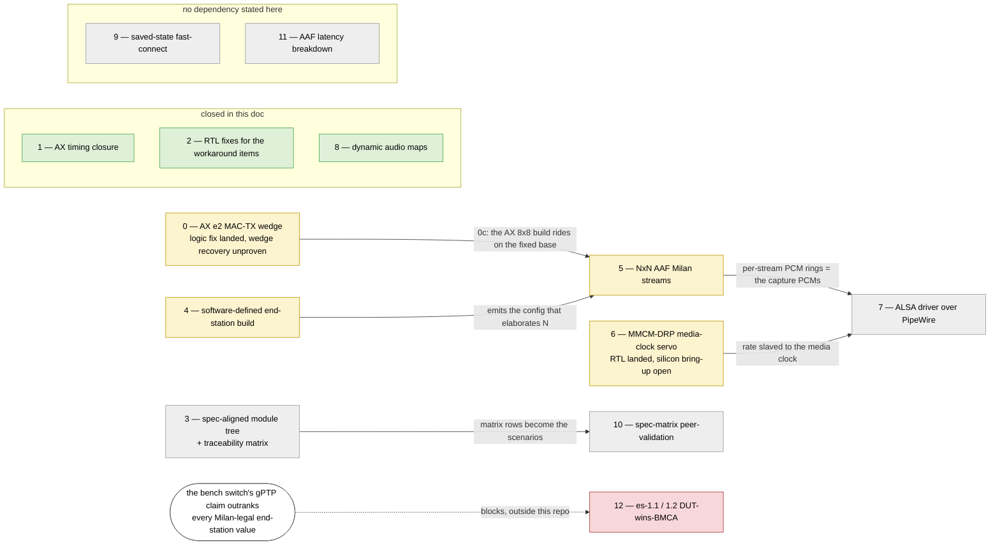

# Milan v1.2 — remaining gaps to FULL compliance

Status date: 2026-07-23 (was 07-21 morning, after the close-all-gaps night):

- ARTY 63/63 on `eppo_milanfinal41`, ALINX 63/63 on `eppo_milanfinal30`
  QSPI-self-boot; both 0x4B byte-exact; CRF e2e locked at +6.7 ppm.
- Since then the MMCM-DRP media-clock servo is silicon-proven at −83.9 dB
  and the AX42 logic fix has landed — see item 0.

This file lists ONLY what is still missing or approximate. What already
passes is recorded row-by-row in [`SPEC_TRACEABILITY.md`](SPEC_TRACEABILITY.md)
and is not repeated here.

## Contents

- **[0-bis. 2026-07-28 evening round — what closed, what opened (VERSION 0x0019)](#0-bis-2026-07-28-evening-round--what-closed-what-opened-version-0x0019)** — Eight closures in one pass, each with its governing clause quoted: the 5.3.7.3 silence fill (a bound talker always frames), the 8.3b Arty TDM8+I2S blend, per-index GET_COUNTERS with real Table 5.4 semantics, TSpec from the wire, the CRF class-A software half, the wired persistence journal, the SRP-only licence proof, and the recovered C12/C13 wire oracles. Then the honest other column: nine more persistence *shalls*, the sink-0-only binding SM, CRF-input counters, the talker-CBS deviation-with-rationale, and an lwSRP RX framing question — all desk-proven, none on silicon yet.
- **[0. Where the remaining work actually lives](#0-where-the-remaining-work-actually-lives)** — Read the last column first: a triage table sorting every open item by what kind of block it is. Only three rows are RTL this project can sit down and write; the rest wait on a bench drill, a missing MDIO pad, an instrument nobody has built, or switch credentials this project does not hold.
- **[1. AECP / AEM](#1-aecp--aem)** — Mostly a record of things that *stopped* being gaps, with their post-mortems kept: the `GET_DYNAMIC_INFO` saga of four stacked silicon-only defects (ending in LUTRAM replication serving stale zeros to one reader and correct bytes to another) and the distilled house rules it produced. Genuinely open: the D6-D8 AEM store redesign, and `SET_STREAM_INFO` accepting only `MSRP_ACC_LAT`.
- **[2. Streaming / media](#2-streaming--media)** — The media-path ledger. Its sharpest entry is the 2026-07-26 scope correction on CRF: it is fully in fabric but is *not a class A stream*, and that is three jobs not one — no VLAN tag, merged onto the control lane rather than the shaped queue, and only then the reservation row. Also the BRAM PCM-ring proposal that would kill both DRAM-path failure classes at the root, and the 1-to-1 wire-truth channel rule.
- **[3. SRP (lwSRP)](#3-srp-lwsrp)** — Short, because the engine-side gap closed: the N-context table landed with a shared serializer (~1.9K cells per attribute versus ~10.7K for replication). What remains is the CRF-reservation integration lane and SR class B, which neither the engine nor the bench has ever exercised.
- **[4. gPTP](#4-gptp)** — Two items, both blocked outside the RTL. The DUT-wins-BMCA recreation cannot run while the bench switch outranks every Milan-legal end-station value, and the ingress/egress latency split has only ever been measured as a sum — the registers now reach the capture point, but that point is the AXIS SOP, not the GMII SFD.
- **[5. Robustness items carried as workarounds (not spec gaps)](#5-robustness-items-carried-as-workarounds-not-spec-gaps)** — The long tail, opening with a 2026-07-26 re-audit: everything here fixable in RTL has been fixed, so what is left is a missing pad, an unimplemented feature, or tooling. Then four dated addition rounds carrying the field traps worth reading before a bench session — the rotted DT window that perfectly mimicked dead silicon, the RMON event bus that was tied to zero on both boards while every module TB passed, and the MDIO sampling and ACMP sequence-id traps.
- **[6. Conformance scope](#6-conformance-scope)** — The honest framing of what the bench suite is: an in-house recreation, not an official lab run, with the two things still not recreated named and the reason each is blocked.
- **[Suggested order of attack (reordered 2026-07-22 per USER)](#suggested-order-of-attack-reordered-2026-07-22-per-user)** — The thirteen roadmap items with a dependency graph up front — colour-coded closed / partial / unstated / blocked — showing that only three actually wait on another item. Each item carries its current landing state, including item 0's corrected verdict: the guard FSM is silicon-proven but the freeze hook fakes the liveness indicators without wedging anything, so recovery from a *real* wedge is still unproven.

## 0-bis. 2026-07-28 evening round — what closed, what opened (VERSION 0x0019)

Eight items landed in one pass; every one is TB-proven at desk and **none has
reached silicon yet** (R6 — the flash that carries them is the next step).

**Closed (with the clause that governed each):**

| item | clause | mechanism |
|---|---|---|
| a BOUND talker with no source emitted NO frames (W3) | 5.3.7.3 "…it shall be streaming AVTP packets" | `KL_pair_zero_fill`: every consumed pair slot strobes at the true media rate (`clk_audio/512`), silence where unfed; `check_wire_accountability` **PASSES for the first time** (68 checks, W5 guards the fill structurally) |
| Arty audio shape (HANDOVER 8.3b) | — (a board decision) | TDM8 MASTER on pmodb + the I2S pair blended at slot 0 (`KL_pair_blend`, "channels 1/2 stay the I2S Pmod"); supply 5 pairs, declared == emitted == 4ch, **no new clock domain** (24.576 MHz plan A kept) |
| GET_COUNTERS index/mask lies | 5.4.2.25 Tables 5.16/5.17 "shall implement **and return**" | `KL_talker_diag_ctx` (Table 5.4 semantics: interval counts, reset-on-start, tu **qualified by transmission**) per STREAM_OUTPUT incl the CRF; the RX monitor's all-context mirror per AAF STREAM_INPUT. Sink 1's full-mask-over-zeros lie is gone |
| TSpec followed the declaration | 802.1Q 35.2.2.8.4 a) "the maximum frame size that the Talker **will produce**" | `load_srp` derives from `framer_wire_channels` — the same constant that resets the packetizer; `arty_current`'s pinned 224 → derived 72 (its only stated reason, "needs a reflash", is spent by this round's reflash) |
| CRF untagged flood | 7.3.3 "An AVB Class A Stream Reservation shall be used" | landed earlier in the session (`CRFT_CTRL[1]` + the fabric-owned lwSRP row + tag-from-row-validity interlock); this round finished the SOFTWARE half: `S50milan` writes `0x3`, identity goes AUTO (the explicit dmac recomputed *claim base + 1* = **AAF talker 1's address** on the 8x8), MAAP claim sized N_STREAMS+1 |
| binds died at power-off | 5.3.8.2 "The current bound state **shall** be saved … and restored after a power cycle" | the 0x7B8 journal-ingest group is WIRED (E3); atomic replay through E1; board-side journald + boot replay ride the flash round |
| the talker licence vs ACMP state | 5.5.2.7 "Talkers rely **only on SRP** (not ACMP)… do not maintain any internal state related to bound/settled Listeners" | verdict: the fabric was already conformant (`talker_active = probe_armed \| listener_observed`, and `listener_observed` IS the SRP hook); the missing piece was the PROOF — the `milan_dp` SRP-only case opens the licence with a Listener Ready and zero ACMP, `LWSRP_STATUS` landing on the bench-predicted `0x37E` |
| lost C5/C6 wire-oracle checks | — (merge collision) | re-added as C12 (descriptor `current_format` == `GET_STREAM_FORMAT`) and C13 (bind the reference device, watch ITS `UNSUPPORTED_FORMAT`); **not yet calibrated** — 8.3.2 rule applies |

**Opened / recorded (new rows for the 8.4 table):**

| item | clause | note |
|---|---|---|
| nine more persistence *shalls* | 5.3.6.x/5.3.8.x/5.3.13 | Milan mandates non-volatile save+restore for: sampling rate, STREAM_INPUT current format, presentation time offset, STREAM_OUTPUT current format, started/stopped state, output channel mappings, input channel mappings, clock source, and the user-name list ("shall save them in a non-volatile memory and restore them after a power cycle"). The binding (this round) was the fabric-critical one; the rest need an AECP-settings restore path into the store scratch that does not exist — designing it in the same round as everything else risked the byte-exact AEM behaviours, so it is the top of the next round |
| per-sink binding SM | 5.5.3 | `PROBE_SM_EN` defaults to **sink 0 only** and the datapath never overrides it: sinks 1..N-1 carry record-only binds — no Auto Connect, no journal restore target. The full per-sink SM is the P-series listener follow-up |
| CRF Media Clock **Input** counters | 5.4.2.25 Table 5.16 | the CRF sink answers the truthful empty mask (no monitor context). Milan's "shall implement and return" reads as wanting them; `KL_crf_rx` exports need a look |
| talker CBS | 4.3.4 "A Talker PAAD shall implement the CBS… shall shape each individual Stream, as well as the overall SR class (34.6.1)" | fabric streams inject post-shaper with the lwSRP bw-gate as the reservation regime (USER-blessed architecture). Per-stream pacing is inherent (media clock); the residual deviation is the class-level burst of ≤ N frames per 125 µs interval that a CBS would spread. Recorded as a deviation-with-rationale, not silently |
| lwSRP RX min-size/keep | — | a 60 B final-keep-0x0F MRPDU alone does not register where a full-keep 64 B copy does, and the first PDU after a torn tap stream only resyncs — recorded in the `milan_dp` SRP-only case for a future `lwsrp_rx` lane |

---

## 0. Where the remaining work actually lives

*One question, answered before the detail: of everything still open, how much
of it is RTL this project can sit down and write?*

| Where | Still open | What the block actually is |
|---|---|---|
| §1 AECP / AEM | AEM store redesign D6–D8 (RTL, loader, traceability rows); `SET_STREAM_INFO` beyond `MSRP_ACC_LAT`; the render-consumption walker generalization | **RTL** — designed, unwritten |
| §2 streaming | CRF is not a class A stream: no VLAN tag, control-lane merge, no reservation row (three jobs, not one). Plus the BRAM PCM-ring proposal and a true >2ch physical render | **RTL** |
| §3 SRP | the CRF-reservation datapath/CSR integration lane | **RTL** — the engine-side gap is gone |
| §2 media clock | MMCM-DRP servo bring-up: set the polarity knob, bless `auto_repair`, rails-zero soak | **bench drill** — the RTL landed 2026-07-22 |
| order item 0 | link-guard recovery from a *real* TX wedge | **bench drill** — a physical cable pull; the FSM and `eth_rst` sequence are already silicon-proven |
| §3 SRP | SR class B — declarations, domain, the 250 µs interval — never exercised | **bench setup that has never existed**; class A only, engine and bench both |
| §4 gPTP | es-1.1 / es-1.2 DUT-wins-BMCA and marker variants | **outside this repo** — the bench switch outranks every Milan-legal end-station claim and cannot be weakened without its management credentials |
| §4 gPTP | the ingress/egress latency split (only the sum was ever measured) | **missing instrument** — needs a PHY-boundary tap; the capture point is the AXIS SOP, not the GMII SFD |
| §5 robustness | Arty link detection is an RX-liveness heuristic, not carrier state | **hardware** — the MII-PMOD has no MDIO pad |
| §5 robustness | ACMP binds do not survive a reboot | **an unimplemented Milan feature** (saved-state fast-connect), not a workaround — order-of-attack item 9 |
| §5 bench & tooling | ProfiShark driver kernel-pinning; linkmon back-off vs guard-era gateware; `SIOCGMIIREG` in kl-eth; the software talker's host media clock | **housekeeping** — no DUT compliance impact |
| §6 scope | a formal external validation run, plus one clean interactive Hive diagnostics pass | **outside this bench entirely** |

Read the last column first. Only the top three rows are RTL debt, and that is
the point of §5's 2026-07-26 re-audit: everything in that section that could
be fixed in RTL has been, so what is left waits on a bench drill, a missing
pad, an instrument nobody has built, or credentials this project does not
hold.

## 1. AECP / AEM

- **AEM store redesign decided (2026-07-25, builder D6–D8):** BRAM hot
  stub + DRAM bulk tree loaded as a hash-verified model blob
  (advertise-after-load rule), target-keyed dynamic-map store (= the CHMAP
  projector), role-named 8×8 ports with per-platform cluster pools, a Pilot
  cluster, and a NEW rx→talker loopback mux lane. Decisions recorded in
  [`ENDSTATION_BUILDER.md`](ENDSTATION_BUILDER.md) §2 (D6–D8); RTL,
  loader and traceability rows all pending.

- ~~GET_DYNAMIC_INFO (0x4B)~~ **RESOLVED ON SILICON, BOTH ENTITIES
  (2026-07-21 morning): dyninfo probe byte-exact PASS on mf41 + AX30.**
  History of the four stacked silicon defects (kept for the record):
  - The 7.4.76 batch semantics landed (512 B capture, BSCAN validate/size
    pass, per-record dispatch through the segment engine, NOT_SUPPORTED+echo
    for legal-unimplemented, whole-cmd BAD_ARGUMENTS for illegal/truncated
    records; byte-exact TB vs classic responses).
  - TWO silicon-only defects were then caught by the wire probe and fixed:
    (a) the BSCAN capture race (a4c0630 - frame_ok leads the builder's beat
    consumption; cap_done gate).
  - (b) the cbuf RAM written inside the async-reset engine block - Vivado
    refuses RAM inference (Synth 8-4767) and falls back to flops with
    mangled set/reset priority (Synth 8-7137 "may cause simulation
    mismatches"): silicon read garbage on every record scan while every TB
    passed (empty batch SUCCESS / 1-record 0-for-50 was the discriminator).
  - Fixed f3f4b15 (own sync-only write process); builds before mf41/AX30
    remain non-conformant on 0x4B on silicon.
  - Defect (c) was the block-local `automatic` temporaries hazard (hoisted).
  - Defect (d) — THE mechanism, BDBG-caught in one read on mf40 — was
    implicit multi-port LUTRAM inference REPLICATING cbuf (RAM64M ×66) with
    the scan's replica reading stale zeros while the echo's replica was
    byte-perfect. Fix = ONE explicit state-muxed async read port +
    capture/verdict phase staging (16cacc8 + ed39d9e).
  - House rules distilled: RAMs get a sync-only write process and ONE
    explicit read port; grep every build log for Synth 8-4767; no
    block-local automatics in clocked processes; fabric forensics CSRs
    pay for themselves the first time.

- ~~Dynamic audio maps~~ **RESOLVED AS COMPLIANT (2026-07-20 spec read):**
  Milan v1.2 5.4.2.27/28 requires ADD/REMOVE_AUDIO_MAPPINGS only for stream
  ports **that have no Audio Map descriptor**, and REMOVE on a port WITH
  Audio Maps SHALL return NOT_SUPPORTED.
  - Our ports carry static AUDIO_MAP descriptors, and the entity answers
    NOT_SUPPORTED - exactly the specified behavior for this topology.
    Dynamic maps only become mandatory if the static maps are dropped
    (which the future 8ch/dynamic-routing work would do).
  - **IMPLEMENTED for dynamic ports (2026-07-22, roadmap item 8):** the
    model gained a per-port `map_mode: static|dynamic` (builder
    `listeners[].map_mode` + gen_aem_store spec/overlay key).
  - A dynamic STREAM_PORT_INPUT[0] emits NO AUDIO_MAP descriptor and
    advertises `number_of_maps=0` (1722.1-2021 7.2.13 — the
    dynamic-capability signal is exactly that, there is no port flag), and
    the svh emits the `` `AEM_DYNMAP`` engine constants
    (keys/page/number_of_maps + the static output map address).
  - RTL: KL_aecp_response_builder gets a direct-mapped mappings flop store
    (key = cluster_offset, mono clusters; entry = {valid, stream_channel},
    stream_index locked 0), plus:
    - a two-pass ADD walk (validate-all-then-commit = 5.4.2.27
      all-or-nothing; intra-command same-key conflict + out-of-range
      cluster/channel + current-format channel bound rejects);
    - lenient REMOVE (exact-match clear, duplicates/unmatched ignored per
      5.4.2.28);
    - GET_AUDIO_MAP paging over the fixed partition (5.4.2.26:
      number_of_maps constant, per-page mappings, map_index out of range
      = BAD_ARGUMENTS);
    - u=1 replay on actual change through the existing unsol path
      (nochg-suppressed), and the lock rule via l0 (ADD/REMOVE are not
      lock-exempt).
  - Static shapes: byte-identical svh, identical RTL, NOT_SUPPORTED
    regression TB-locked (sim_main [18]); the dynamic shape is TB-locked
    by tb/verilator/aecp/sim_dynmap.cpp (72 checks) + builder gate 17.
  - Deliberate bounds: dynamic maps on STREAM_PORT_OUTPUT / ports beyond
    input 0 are codegen-rejected (outputs keep the Milan-mandated static
    NOT_SUPPORTED), and one ADD/REMOVE carries <= 60 mappings (an AECPDU
    fits 63 anyway).
  - **Render-consumption follow-up (documented flag):** the builder
    exports live render taps `dmap_l/r_{ch,en}_o` (cluster 0/1 = the DAC
    pair) through KL_aecp_top into milan_datapath, where they terminate.
  - Generalizing the KL_i2s_playback half-beat walker's fixed pos0/pos1
    latch into per-position selects is the follow-up (the walker is
    silicon-proven at the -83.9 dB record — MMCM-DRP servo coherent chain,
    converter floor — and a remap rewrite is not bench-verifiable this
    round — honesty over reach).

- ~~No-change SET suppression covers only SET_STREAM_INFO and
  SET_CONFIGURATION~~ **RESOLVED (2026-07-20):** WRITE_S reads the old
  store byte before writing (2-phase) and `wb_diff` gates the u=1
  replay for every replayed SET (NAME/SAMPLING_RATE/CLOCK_SOURCE/
  STREAM_FORMAT beyond the original two).

- **SET_STREAM_INFO supports only the MSRP_ACC_LAT sub-command**; every
  other spec-defined flag is NOT_SUPPORTED. Milan talker requirements are
  met, but a controller writing e.g. STREAM_VLAN_ID gets refused.

- ~~Declared capability counts exceed reality~~ **RESOLVED
  (2026-07-27):** the counts are no longer *provisioned* at all.
  `ADP_TALKER` (`0x618`) and `ADP_LISTENER` (`0x61C`) are **read-only**
  words hardwired from the elaboration parameters, so the ENTITY
  descriptor overlays and the ADPDU carry the shape the gateware was
  actually built with.

  The 2026-07-20 fix was the boot script writing "honest counts" — talker
  sources 1, listener sinks 2 — and that was honest for the 1×1 board it
  was written on. When the AX7101 went 8×8 the script did not, so on
  2026-07-27 the board advertised **1 source / 2 sinks** beside a
  reference device advertising 4/10 and a peer host advertising 8/8:
  every controller on the segment could see and bind exactly one of its
  eight streams, and the CRF Media Clock Output at `talker_unique_id =
  N_STREAMS` was outside the advertised range and therefore invisible to
  ATDECC while its PDUs were on the wire every 2 ms. A stream count is a
  physical fact about the built bitstream; a writable count buys nothing
  and buys a way for the device to lie about itself invisibly, because
  the register faithfully holds what was written.

## 2. Streaming / media

- **PROPOSAL — PCM ring in on-chip BRAM (USER 2026-07-23).** The listener
  PCM ring is a LiteDRAM window today (`pcmring` @0x4ff00000,
  WishboneDMAWriter loop). Two silicon failure classes live on that DRAM
  path:
  - (a) the real-time writer SHEDS a beat when the wishbone side stalls
    under CPU DRAM contention (the CDC-depth-16 → 128 fix,
    `test_pcm_ring.py`);
  - (b) I6, the 1-in-24 read artifact that survives CDC-128 (write-posting
    vs the OFFSET CSR / arbitration ambiguity, still open).
  - A **dual-port BRAM ring kills BOTH at the root**: the BRAM write port
    is always ready (no shed, CDC depth moot) and there is no DRAM
    controller / L2 / posting between the writer and the reader (I6 cannot
    exist).
  - Budget FITS: mf53e uses 99/135 RAMB36 (73 %), **36 free**; a
    period-latency ring needs only ~16–32 KB (4–8 RAMB36 = 42–85 ms
    stereo/48k — the ALSA buffer only has to cover the period-IRQ latency,
    not seconds of audio).
  - Design: swap the WishboneDMAWriter target for a BRAM behind the SAME
    `base/length/enable/loop/offset` CSR ABI so the snd-kl-milan driver is
    unchanged (map the BRAM into the CPU address space RO for the reader;
    the offset CSR stays the hw_ptr).
  - If taken, this SUPERSEDES the AX CDC-128 carry and closes I6. AX 8×8
    would need N×32 KB — still inside 36 tiles for N≤8 at 16 KB/stream,
    gate on the utilization report.

- **CRF media clocking: the measurement half is IN (2026-07-20).**
  KL_crf_rx validates the Milan CRF media-clock stream (7.3.2:
  subtype 4/type 1/pull 0/48k/interval 96/1 ts) selected by CSRs
  0x738-0x74C, and produces the phase delta (0x744, ts_delta contract),
  the 512-ms frequency error (0x748), lock state + CLOCK_DOMAIN
  LOCKED/UNLOCKED events (muxed in when clock_source = CRF descriptor 2).
  - **The talker half is IN too (2026-07-20 night, USER-requested):**
    KL_crf_tx sources the Milan CRF media-clock stream (500 PDU/s, one
    gPTP-ns timestamp per PDU captured on the REAL audio-MMCM 96-sample
    event grid — the wire carries the true media-clock rate).
  - CSRs 0x750-0x764 {en, sid, dmac, RO count}, 6th low-rate control-merge
    source; S50 provisions the ALINX with DMAC = MAAP claim+1 on
    gateware >= 0x0005.
  - Rx silicon-proven against a synthetic peer-host source (lock,
    13000/13000 counted, rate-from-field, timeout unlock); board-to-board
    e2e = the AX24/mf39 wire test.
  - **The sink-1 bind SM is IN (2026-07-21, b692395):** listener uid=1 is
    a real bind record (fast-connect sid/dmac, {eid,tuid} fallback), the
    datapath drives the CRF engine's en/sid from the bind, GET_RX_STATE/
    GET_STREAM_INFO(input 1) reflect it (dp-TB closure: CONNECT_RX →
    lock on the bound sid → DISCONNECT cuts); **SILICON-PROVEN on mf40
    (bind → lock with CSR en=0 → disconnect cuts).**
  - ~~CRF is not a class A stream~~ **RTL RESOLVED (2026-07-28), default
    OFF pending a silicon run.** All three jobs landed together, wired so
    that they cannot come apart:
    1. **The 802.1Q C-TAG** — `KL_crf_tx` gained `vlan_en_i / vlan_pcp_i /
       vlan_vid_i` and a second frame shape: TPID `0x8100` at octets 12–13,
       TCI `{PCP, DEI=0, VID}` at 14–15 (802.1Q 9.5/9.6), EtherType pushed
       to 16–17, the whole CRF AVTPDU +4. **Both shapes are the same
       60-octet frame** — the tag eats pad, so the AXIS beat count, `tkeep`
       and the MSRP `MaxFrameSize` all stay put. `vlan_en_i` is latched at
       frame launch beside `ts_r`/`tu_r`.
    2. **The lane** — the CRF AXIS moved off the low-rate control merge onto
       the **data lane** beside AAF (`crf_dp_mux`), so the media clock no
       longer queues behind ADP/AECP/ACMP/MAAP/lwSRP bursts *and* the
       control min-IFG gasket's 512-cycle per-frame spacing. A Hive
       enumeration storm was adding ~10 µs per intervening control frame to
       a PDU that carries a gPTP timestamp. **Honest bound: this is not the
       CBS shaped queue** — AAF is not in it either (it is injected after
       the shaper), and credit-shaping the fabric's own stream sources
       remains the same open `is_1g` follow-up for both.
    3. **The reservation** — the CRF output is now a real lwSRP **talker
       context**, provisioned *by the fabric* (its `stream_id`/DMAC are
       derived from the ACMP answer for `talker_unique_id = N_STREAMS`, so
       software could only restate them and get them wrong).
       `N_TALKERS_P` = N+1 and `N_CTX_P` = L+T-1 = 2N, i.e. the CRF row is
       ctx row 2N-1. At 8×8 that is **exactly 16 rows, the whole 4-bit
       `ctx_idx`** — guarded by a `milan_datapath` elaboration assert and
       by the builder's `SRP_CTX_IDX_BITS` `ConfigError`, so 9×9 fails the
       build rather than losing a reservation in silence.
       TSpec: `MaxFrameSize` **42** (the PADDED MSDU of the tagged 60-octet
       frame — see the correction below), `MaxIntervalFrames` **1**,
       `PriorityAndRank` `0x70`; idleSlope 5.376 Mb/s, now inside the
       builder's ceiling check (arty_4x4 41.47 % → **46.85 %**, ax7101_8x8
       13.21 % → **13.75 %**).
  - **THE INTERLOCK, and why it is structural.** `vlan_en_i` is driven by
    `crft_class_a_w = crf_srp_val_r & lwsrp_enable & lwsrp_talker_en` — the
    *provisioned row*, never the CSR bit. `CRFT_CTRL[1]` **asks** for class
    A; only a granted attribute row **grants** it, so tagged-but-undeclared
    is unreachable rather than merely discouraged. Reset is untagged and
    `CRFT_CTRL[1]` resets 0, so every existing bitstream behaves exactly as
    before.
  - **CORRECTION — the old justification here was wrong.** This section (and
    `KL_crf_tx`'s own header) said "an SR-tagged *unregistered* stream is
    pruned to zero ports". The bench measured the opposite and
    [`TROUBLESHOOTING.md`](limitations/TROUBLESHOOTING.md) already recorded
    it: *"An unregistered VLAN-2 stream DMAC is **flooded** by the bridge …
    while a **registered but listener-less** stream is pruned."* That is
    802.1Q behaving as specified — pruning is what a declaration BUYS
    (35.1.2); with no registration the DMAC is ordinary multicast. So the
    real hazard of tagging alone is not disappearance, it is an unreserved
    stream squatting *inside* the reserved SR VLAN. Both halves are still
    required; the reason is now the right one.
  - **NOT SILICON-VERIFIED.** RTL green is not silicon fixed: this needs a
    Vivado rebuild + reflash. Baseline to beat, measured 2026-07-28 with
    `sudo python3 /tmp/floodclass.py enp6s0 8` on the peer: **4001 untagged
    AVTP/CRF frames in 8 s** from `02:00:00:00:00:01` (= 500 pps, the
    `KL_crf_tx` rate) on a port with **zero** AAF frames. Expected after the
    change with `CRFT_CTRL[1]=1` and no CRF Listener registered: the CRF
    frames are **ABSENT** from that capture, not tagged — a registered
    stream with no Listener is pruned, and that IS the fix. They reappear,
    tagged PCP 3 / VID 2, only once a listener ACMP-binds `talker_unique_id
    = N_STREAMS` and declares Listener Ready. `0x750[4]/[5]/[6]` tell
    "declared", "tagged" and "reserved" apart from software so a pruned
    stream is readable rather than inferred from silence.
  - **SR class B is still untested** and is not made reachable by any of
    this; Milan 7.3.3 fixes the CRF stream at class A and the builder
    refuses class B.

  - REMAINING for the full chain (**scope corrected 2026-07-26 from the
    RTL** — this is three jobs, not one; **all three landed 2026-07-28,
    see above**): CRF is *fully in fabric*
    (`KL_crf_tx`/`KL_crf_rx`/`KL_mmcm_drp_servo` all live in
    `milan_datapath`), but it is not a class A stream. (1) `KL_crf_tx`
    emits **no VLAN tag** — no `0x8100`, no PCP, no TCI — so a bridge
    cannot classify it as class A and untagged/VID-0 SR traffic floods
    unshaped; (2) its AXIS is merged into the **control** lane by an
    `adp_tx_arbiter` (with ADP/ACMP/AECP/MAAP/lwSRP) and through the
    control min-IFG gasket, so it never enters the CBS class A shaped
    queue; (3) only then does it need the lwSRP attribute row for the
    reservation itself. The untagged state is a deliberate interim
    compromise — an SR-tagged *unregistered* stream is pruned to zero
    ports by the bridge, so half-done tagging is worse than none. Plus
    bench validation of the clock-recovery actuator below.
  - **Clock-recovery ACTUATOR — RTL LANDED (2026-07-22, roadmap item 6):**
    `KL_mmcm_drp_servo` (hdl/ieee1722/crf/) closes the loop at
    clock_source==2: differential-rate FLL (CRF_RATE 0x748 vs a local
    512 ms audio-vs-gPTP window, same ns/512ms units) → PI (halve error
    per window, bounded step, ±200 ppm authority) → the MMCME2 **dynamic
    fine phase shift** + an **XAPP888 DRP engine**.
  - The fine phase shift (UG472: 1/(56·F_VCO) ≈ 16.9 ps steps, glitch-free,
    round-robin wrap ⇒ a sustained step rate is a permanent frequency
    trim; ceiling 260 ppm at 200 MHz PSCLK). The DRP engine: read-VERIFY
    of the CLKOUT0 ClkRegs on engage; full reset-sequenced RMW repair
    path, auto_repair tied OFF until bench confirms the Vivado ClkReg
    encoding.
  - The honest granularity math forced the PS actuator: the DRP fractional
    fields are 1/8-resolution (≥1953 ppm per LSB) — three orders too
    coarse for a ppm servo, and every write costs a relock outage.
  - Audio clocking reworked integer-only two-stage (100→31.081081 via PLL
    /2×23/37 → MMCM ×34/43 = 24.576 MHz −10.6 ppm; best single-stage
    integer is −186 ppm, beyond the PS budget).
  - HOLDOVER on CRF unlock (frozen trim keeps stepping), CSR MCSRV_STAT
    0x8F8, TB-proven (unit 40 checks + rails-cease closed loop: control
    +8 rail events, servo 0). REMAINING: silicon bring-up (bench drill in
    the roadmap item), then delete the drift-lottery caveats above.

- **Channel policy: 1-to-1 wire-truth mapping (USER rule, 2026-07-21,
  c705091).** The render follows the WIRE's channels_per_frame (exported
  by the RX monitor from the last accepted PDU), never the AEM store.
  - Stream ch0/ch1 map onto the physical stereo DAC at full sample rate
    for ANY C in 1..8 (half-beat position walker: even C beat-aligned,
    odd C straddled, mono renders L with R=0); extra stream channels are
    virtual (skipped). The talker stays a truthful 2ch device.
  - A true >2ch physical render remains future work, but a bound 8ch
    stream now plays its first pair CORRECTLY at full rate (the old
    store-driven stride played 1/4-rate garbage when the store defaulted
    8ch after a reboot — root cause of the 07-21 music-glitch episode,
    along with the underrun rail below).

- **Playback FIFO rails are now symmetric (c705091):** the underrun
  rail enters a prefill hold (one bounded gap, then recenter to the
  release level) instead of repeating samples every few ms - the
  drift-lottery glitch storm class is closed.
  - Residual polish: the TOP rail still sheds one pair per drift period
    when pinned full (as it always did, incl. during every record
    measurement); a drop-to-mid jump on full would make both rails
    one-bounded-event-per-cycle.
  - A drift-slaved media clock (MMCM-DRP servo) remains the real fix; the
    LPF burst-FIFO count leak (silent m_tvalid wedge) is also fixed in
    the same commit.

## 3. SRP (lwSRP)

- ~~Single-stream engine~~ **RTL RESOLVED (2026-07-22): N-attribute
  context table.** `KL_lwsrp_top` takes `N_CTX_P` (default 1 = the old
  single talker+listener pair, byte-identical — TX mux is a generate
  passthrough at N=1).
  - Rows 1..N-1 are generic contexts (talker OR listener each) in
    `KL_lwsrp_ctx` (table + ONE shared registrar over flop-vector context
    bits + a 120-bit record LUTRAM with sync-only write and ONE explicit
    read port).
  - `KL_lwsrp_ctx_tx` is ONE shared serializer packing every declared
    attribute into one MRPDU — never module replication; ~1.9K generic
    cells/attribute vs ~10.7K for replication, yosys N=1/2/8 OOC.
  - The walker grew per-context +k match lanes (a 64-bit compare each).
  - Provisioning = an indexed request/grant port on `KL_lwsrp_top` (the
    future NxN CSR lane's shape) + live per-context status vectors.
  - TB `lwsrp_ctx` (N=4): golden N=1 byte-equivalence, CRF-listener row
    (Ready follows TA, TF code readback), 25-B TalkerAdvertise from the
    record RAM, multi-attribute single-MRPDU packing, one bridge vector
    covering several contexts at different +k, add/remove LV, LeaveAll
    aging.
  - **REMAINING for the CRF reservation e2e:** the datapath/CSR
    integration lane (wire the CRF bind SM to the ctx port, VLAN-tag the
    CRF stream once Ready is registered) — the engine-side gap is gone.

- 🔴 **`AAF_CTRL[1]` `gate bypass` defeats Milan 5.3.7.3, and its RESET
  VALUE IS 1.** This is the single reason SR-class-A-tagged AAF leaves this
  fabric with no reservation. Measured 2026-07-28 on the ProfiShark inline
  taps, both boards, nothing bound: 18,488 tagged (VID 2, PCP 3) AAF frames
  in 6 s from a talker reading `LWSRP_STATUS 0x694 = 0x00000030` — no
  Listener declaration, no registration, reservation ACTIVE 0, stream gate
  0, MSRP failure code 0.

  Milan v1.2 5.3.7.3, verbatim: *"As long as a PAAD is declaring a Talker
  Advertise attribute **and receiving a Listener Ready or Listener Ready
  Failed attribute** for a Stream Output, it shall be streaming AVTP
  packets. This specification excludes the possibility for a Stream Output
  to be stopped (STREAMING_WAIT state shall not be implemented)."* The
  obligation is **conditional**; the second sentence only forbids
  implementing STREAMING_WAIT. This repo's own traceability row M-DEV-13a
  paraphrased it as an unconditional "a Stream Output SHALL NOT be stopped"
  until 2026-07-28 — that paraphrase is what licensed the bypass, and it is
  corrected in [`docs/traceability/milan-v12.md`](traceability/milan-v12.md).

  **The lwSRP engine is NOT at fault and never was.** With a real Listener
  the reservation completes and holds: binding ALINX talker 0 → Arty sink 0
  moved `0x694` to `0x0000037E` (declaration Ready, registered, ready,
  talker declared, domain ok, **reservation ACTIVE**, **stream gate open**,
  **slope mux engaged**) and it stayed there — the bridge refreshes the
  Listener attribute only in its LeaveAll PDU, every 20 s, and the
  registration survives that cadence. What is missing when nothing is bound
  is simply a Listener, which is correct 802.1Q behaviour, not a defect.

  The mechanism, in `milan_datapath.sv`:

  ```
  aaf_gate = cfg_aaf_enable & (~cfg_maap_enable | maap_addr_valid) &
             (cfg_aaf_bypass |
              (acmp_talker_active & (~cfg_lwsrp_enable | lwsrp_stream_gate[0])))
  ```

  `cfg_aaf_bypass` ORs past **both** qualifying terms. Proof from the CSRs
  alone, on both boards: `ACMP_TALKER 0x66C = 0x08` — bit `[3]` *resolved
  AAF admission gate* = 1 — while bit `[1]` `talker_active` = 0 **and**
  `LWSRP_STATUS[8]` stream gate = 0. A composed gate of 1 with both of its
  qualifying terms at 0 is reachable only through the bypass.

  **Runtime remedy, no rebuild** (proven on silicon 2026-07-28, both
  directions, tap-verified):

  ```sh
  devmem 0x90000654 32 0x00020001   # bit-preserving: keep VID 2, clear bypass
  ```

  | state | `0x654` | `0x694` | `0x66C` | tagged AAF on the tap |
  |---|---|---|---|---|
  | bound, bypass **on** | `0x00020003` | `0x0000037E` | `0x0B` | 17,956 / 6 s |
  | bound, bypass **off** | `0x00020001` | `0x0000037E` | `0x0B` | 18,012 / 6 s |
  | unbound, bypass **on** | `0x00020003` | `0x00000030` | `0x08` | 18,488 / 6 s |
  | unbound, bypass **off** | `0x00020001` | `0x00000030` | `0x00` | **0 / 8 s** |

  MSRP TalkerAdvertise, Domain and MVRP declarations continue in every row —
  Milan 5.3.7.2 (*"a PAAD shall always declare an MSRP Talker attribute as
  soon as it has valid SRP parameters for this stream"*) is unaffected, and
  must stay that way.

  **The durable fix is a one-value change in `milan_csr.sv`: `AAF_CTRL`
  reset `0x0002_0002` → `0x0002_0000`** (bypass clear at reset), plus the
  [`docs/reference/REGISTER_MAP.md`](reference/REGISTER_MAP.md) enable recipe moving from `0x0002_0003` to
  `0x0002_0001`. That file is owned by another lane at the time of writing,
  so the change is specified here rather than applied. Until it lands, every
  board that boots with the documented recipe streams unreserved.

- **Class B untested.** The engine and the bench run SR class A only;
  class-B declarations/domain and the 250 µs observation interval have
  never been exercised.

## 4. gPTP

- **es-1.1 / es-1.2: the wire-observable halves ARE recreated + green
  (2026-07-21)** — es-1.1 ALINX-GM half measures announce 1.0001 s /
  sync 8 per s / pdelay 1 per s + priority1/clockClass at the tap;
  es-1.2 verifies every MSRP Domain declaration = {class A, prio 3,
  VID 2}.
  - Remaining = the DUT-wins-BMCA/marker variants only: **BLOCKED ON THE
    BENCH SWITCH**: es-1.1 requires the DUT to win the BMCA against a
    255-claimant test machine and free-run its Announce/Sync cadence.
  - Our switch claims priority1=246 clockClass=248 clockAccuracy=0x20
    (tap-read) and outranks every Milan-legal end-station value (246|248
    tie loses on clockAccuracy).
  - Until the switch's gPTP claim is weakened (via the switch's management
    interface), the recreation cannot run and the bench ships the 100
    override to keep the ALINX-GM one-oscillator media architecture.
  - **The shipping priority1 must be 246** (the Milan es-1.1 posture;
    100 is bench-only).

- **ingressLatency constants are bench-calibrated** (tap-measured 3511 ns
  Arty / 1490 ns AX; egressLatency 0). A production story needs a
  per-board calibration procedure, and the split between ingress/egress
  was never measured separately — only the sum.
  - **2026-07-26:** the fabric can now apply them itself — `PTP_INGRESS_LAT`
    (0x540, subtracted on RX) and `PTP_EGRESS_LAT` (0x544, added on TX) reach
    `ptp_ts_core`'s capture point instead of stopping at a `milan_datapath`
    wire declaration (REQ-PTP-06 register half, TB `ptp_ts`). Both reset 0 and
    the bench applies its pair in `ptp4l` today: apply the correction on ONE
    side only, or it double-counts. The capture point is still the AXIS SOP,
    not the GMII SFD — the constants stay characterisation-derived until a
    PHY-boundary tap exists.

## 5. Robustness items carried as workarounds (not spec gaps)

**Re-audit 2026-07-26.** Every item below that is fixable *in RTL* is fixed in
RTL: the GMII link-bounce CDC reinit (the headline one) is sequenced by
`KL_link_guard` and gated by `tb/verilator/link_guard` (104/104 PASS in this
tree); the CSR shadow/counter invalidate-on-reset and the I2SPB W1C rails
likewise. What remains in this section is **not RTL debt**: the Arty
RX-liveness heuristic is a missing MDIO *pad* on the MII-PMOD, the ACMP
fast-connect persistence is an unimplemented Milan *feature* (not a
workaround), and the rest are bench, driver or tooling items. The actionable
RTL debt this round therefore sat in the open `REQ-*` ledger in
[`../TODO.md`](../TODO.md), where REQ-CLS-05/06/07, REQ-MAC-02, REQ-PTP-05/09
were closed and REQ-PTP-06's register half landed. Two of those were the same
failure shape as a workaround: an ABI that milan_csr exported and **nothing in
fabric consumed** (the RX address-filter fields; the PTP latency-correction
registers) — decorative registers read as "implemented" from software and are
worse than an admitted gap.

- **AX GMII link-bounce CDC desync**: RESOLVED in RTL 2026-07-22. The
  link guard now sequences BOTH CDC halves:
  - `eth_rst_o` (KL_link_guard, LINKG_STAT[2]) asserts with `reinit_o` on
    clock death and holds through the first half of SETTLE (clean clocked
    reset cycles for the eth-side halves via per-eth-domain
    AsyncResetSynchronizers on the MAC's derived maceth_tx/maceth_rx
    domains, milan_soc.py).
  - It releases mid-settle — strictly before the sys side — so both
    pointer sets restart matched with zero software involvement.
  - The LINK_CTRL[1] manual strobe stays sys-only (the daemon owns
    phy_crg_reset in that flow).
  - TB: tb/verilator/link_guard (sequencing + re-death re-arm + disable).
    NOT yet bench-proven: needs a gateware build + link-bounce drill.

- **Arty link detection is an RX-liveness heuristic** (the MII-PMOD MDIO
  floats). No true carrier state; a totally idle-but-up network segment
  would read as link-down after the quiet threshold (gPTP makes this
  practically impossible on an AVB network, but it is a heuristic).

- **CSR shadow/counter staleness across resets**: RESOLVED in RTL
  2026-07-22 to the extent RTL can.
  - The config shadow was already invalidated on any CSR-visible reset
    (aresetn defaults-ROM sweep, 7c5f053); the remaining hole was the MAC
    reinit, which restarts the MAC path with NO aresetn event here - a
    pre-reset STAT0-8 RMON snapshot kept serving stale counts.
  - milan_csr now takes the effective MAC-reset line (`i_mac_reinit` =
    guard | LINK_CTRL[1]) and zeroes the snapshot on its release edge
    (all-zero = "no valid snapshot", software re-arms via STATS_CTRL[0]).
    TB: tb/verilator/csr.
  - The RST_EPOCH canary + daemon reconfig stay as the defense for resets
    the CSR clock never sees (clock-dead reset pulses are invisible to
    any synchronous fix).

- **Synthesis-style landmines (2026-07-20 cbuf lesson):** `fword_r`
  (KL_acmp_responder) and `nochg_q` (response builder) draw the same
  Vivado Synth 8-7137 "set/reset same priority - may cause simulation
  mismatches" warning that broke cbuf_r on silicon; both happen to be
  silicon-proven today.
  - Standing gate: any RAM-like array must live in its own sync-only
    process, and every new build log gets `grep "Synth 8-4767"` - a hit
    on our modules means Vivado refused RAM inference and the fallback
    semantics are suspect.

### 5b. Additions found 2026-07-21 afternoon (power-event + music round)

- ~~AX 100 MHz timing vs the link guard~~ **RESOLVED (2026-07-22):
  buffered dp-CDCs closed it — AX34 all 3 seeds keep (asl +0.053 /
  eto +0.076 / eppo +0.066) after 12 missed draws.**
  - The tx_sf 1024→512 lever deleted its ADDR[9] cone but AX33 still
    missed ×3 with a NEW common violator: the mac_rx_cdc 16×74 CDC FIFO
    mapped into BRAM, its CLK→Q fanning into ptp_ts_rx/aaf_rx_depkt/aecp.
  - Fix = `stream.ClockDomainCrossing(..., buffered=True)` in
    `_axis_dp_cdc` (migen AsyncFIFOBuffered: a read-domain dout
    register — its documented purpose is exactly sluggish BRAM
    clock-to-out; +1 cycle on a handshaked stream = transparent).
  - The same lever lifted the ARTY to mf46 eto **+0.378 = new record
    margin**.
  - Trap burned: LiteX `storage_N` names reshuffle between builds — map
    the name in the generated .v before chasing a violator.
  - AX flashed eto_milanfinal34: guard drills silicon-proven (freeze
    byte-exact 0x000102D0→0x00010083, real phy_crg_reset bounce, TX
    alive after = the old permanent-wedge scenario auto-recovers).

- **ACMP binds do not persist across a board reboot** (fabric state
  only). Milan's saved-state fast-connect (listener re-connects on its
  own after power-up) is not implemented; after a reboot/reflash a
  controller must re-issue CONNECT_RX.
  - This is why the "overnight lapse" happened: the ARTY was reflashed to
    mf42, the bind died with the old bitstream, and the switch pruned the
    unregistered stream.
  - (In contrast: a SWITCH reboot self-heals — proven today, one unlock
    then auto re-lock; the lwSRP applicants re-register.)

- **Sink-0 ignores the fast-connect stream_id field**: the uid-0 bind
  always derives `sid = {talker_mac, tuid}` (`sid_from_eid`); only sink 1
  honors an explicit sid (cap_sid_r).
  - Software/synthetic talkers must choose their EID so the derivation
    lands on the sid they stamp (recipe proven: EUI64-from-MAC form,
    tuid = sid low16).
  - **Update 2026-07-22 (roadmap-5 ACMP half):** the sid-source policy is
    now PER-CONTEXT config in the N-context engine (`KL_acmp_lstn_ctx`
    `SID_EXPLICIT_P`, TB-proven on probe-SM contexts too); the DEFAULT
    2-sink wrapper deliberately keeps sink-0 = derive for wire
    compatibility, so the synthetic-talker EID recipe still applies to
    default builds until the NxN config lane flips the bit.

- **I2SPB_STAT rail counters saturate at 0xFFFF and stick**: RESOLVED
  2026-07-22 - W1C per half (write any bit of a half to restart that
  rail; halves independent, zero write inert, readback stays live).
  - W1C over clear-on-bind: the rails are diagnostics, not Milan Table
    5.6 counters - see [docs/reference/REGISTER_MAP.md](reference/REGISTER_MAP.md) 0x6D8. VERSION
    0x0007.
  - TBs: tb/verilator/i2spb (counter behavior incl. re-arm after clear)
    + tb/verilator/csr (strobe decode).

- **Controller tooling must use distinct ACMP sequence_ids** —
  back-to-back commands with the same {controller, seq} are eaten by
  the responder's 1722.1 duplicate detection (correct DUT behavior,
  easy tooling trap; bit us today with seq 0/0).

- **Bench: ProfiShark driver is kernel-pinned** — an apt kernel update
  + reboot silently kills both taps (no enx netdevs). Fix applied for
  7.0.0-28; recurs on every kernel bump: install the matching
  `profishark-linux-driver-<kver>` from the Profitap repo (exists for
  each kernel) or hold the kernel package.

- **Bench: peer-host /tmp tooling is volatile** — the reboot deleted
  milan_controller.py / bind_sink1.py / dyninfo_probe.py /
  silicon_battery.py etc. Rebuilt so far in persistent ~/milanmusic/:
  acmp_bind.py (connect/disconnect incl. synthetic-talker recipe) and
  aaf_stream.py (software AAF talker, 8000 fr/s pacer). The rest needs
  re-creation or a move into the bench repo; /tmp is not a home.

- **Software-talker media clock is the host clock** (aaf_stream.py):
  tens of ppm off the audio MMCM → playback FIFO recenters with an
  audible click every few minutes. Fine for listening; a tick-trim or
  a CRF-disciplined pacer would fix it properly.

### 5c. Additions 2026-07-22 (counter fix + ethtool/MDIO round)

- **LINK_UP/LINK_DOWN double-count per physical flap (FIXED in RTL,
  found by the bench link-flap re-run on mf45):** the AECP counters
  counted edges of `eff_link = i_link_up & cfg_sw_link & linkg_est`,
  so one flap produced the guard pair (41 µs detect / 21 ms settle)
  PLUS a second linkmon pair (sw_link drops 7–14 s AFTER the link is
  back — rx-liveness lags; console-timeline-proven).
  - Milan wants +1. Pre-guard mf39 passed because only the linkmon term
    existed.
  - Fix: the counter tap now uses `cnt_link = i_link_up & (linkg_dis |
    linkg_est)` — the physical+guard view — while eff_link keeps gating
    ADP/datapath.
  - Heisenberg trap burned: AECP polling during the outage FEEDS
    rx-liveness and suppresses the linkmon pair — quiet runs read +2,
    polled runs +1.

- **kl-eth ethtool ops implemented (driver `mdio1`):** clause-22 MDIO
  bitbang over the LiteEthPHYMDIO CSRs (0xf0003804/08, DT reg-name
  "phy" with fixed-address fallback for flashed DTBs).
  - Implemented: PHY discovery; `ethtool -r` (nway_reset = real BMCR
    autoneg restart — the guard rightly does NOT count it as a bounce:
    MII/GMII clocks keep running; phy_crg_reset stays the clock-death
    drill); get/set_link_ksettings (100/Full verified on the ARTY
    DP83848, id 2000:5c90 byte-exact); `-S` forensics stats; drvinfo
    version.
  - Sampling trap burned: the CSR-write + 2-FF-sync read lands one MDC
    cycle late — consume ONE turnaround cycle, not two, or every
    register reads (val<<1)|1.
  - **The AX7101 e1 PHY had NO MDIO pads wired in the platform** (the
    handover's "AX MDIO works" claim was wrong — ethtool -r returned
    EOPNOTSUPP on the old driver and the pads did not exist).
  - e1_mdio traced through the Alinx schematics to ball K16 (EX SCH:
    E1_MDIO = B15_L23_N; CORE SCH: B15_L23_N = K16), e1_mdc = J17 (every
    vendor XDC); wired in platforms/alinx_ax7101.py, in gateware from
    AX35 on.

### 5d. Additions 2026-07-22 (merge-validation + AX e1 rounds)

- ~~RMON STATS SNAPSHOT HAS NEVER WORKED ON SILICON~~ **ROOT CAUSE
  FOUND AND FIXED IN RTL (2026-07-22 night, silicon pending):** the
  event bus was NEVER CONNECTED on the LiteX SoCs.
  - `milan_soc.py` *used to tie* `i_i_mac_events` to `0` at BOTH
    datapath instantiations (LiteEth exposes no Forencich-style event
    pulses), so every counter lane was structurally silent on both
    boards while module TBs (which drive the port directly) passed. The
    latch/read CSR chain was always correct.
  - Fix (part 1): `milan_datapath` now derives `TX/RX_FIFO_GOOD_FRAME`
    itself from the MAC AXIS boundary handshake (one accepted `tlast`
    beat = one frame) and IGNORES those two bits of `i_mac_events`
    (double-count impossible).
  - Fix (part 2, 2026-07-26): the tie is GONE. `KL_mac_rmon_events`
    synthesises the pulse vector at the SoC's MAC boundary from what
    LiteEth does expose — its per-frame `error` flag (FCS failure or
    runt) and its `crc_errors` / `preamble_errors` counters, the same
    registers the GMII bring-up used as its precise RX signal — so
    `RX_ERROR_BAD_FCS`, `RX_ERROR_BAD_FRAME` and `RX_FIFO_BAD_FRAME`
    count too. The four lanes that remain MAC-internal
    (TX underflow / TX FIFO overflow / TX bad frame / RX FIFO overflow)
    are declared UNSUPPORTED in the new `STATS_CAP` (`0x204`) instead of
    reading as a lying zero, and are NOT faked from AXIS backpressure.
  - Also found on the way: the datapath consumes LiteEth's RX stream
    WITHOUT its `error` field, so FCS-failed and undersize frames are
    handed to the classifier as if good. They are now at least counted
    (`STAT_RX_FIFO_BAD_FRAME`); dropping them is a separate change.
  - TB: `tb/verilator/milan_dp` `[RMON]` case pushes real frames through
    the boundary ports and reads the latched lanes over AXI — 4 FAILs on
    the pre-fix RTL (TX_GOOD/RX_GOOD = 0 with 3/2 real frames = the
    exact silicon symptom), 158/158 after.
  - ABI reconciled: the enum WAS already 1:1 with [REGISTER_MAP.md](reference/REGISTER_MAP.md)
    (lane n at `0x210 + 4*n`: TX_GOOD = lane 3 = `0x21C`, RX_GOOD =
    lane 8 = `0x230`); the earlier "TX_GOOD=0x210 / RX_GOOD=0x224"
    reading of the svh was a misread (it forgot the `0x210` base is
    lane 0) — the svh now carries the per-lane CSR addresses.
  - Silicon verification = normal sweep + flash, then: traffic,
    `STATS_CTRL[0]`, read `0x21C`/`0x230` vs kernel counters (mind the
    invalidate: any link-guard episode or `LINK_CTRL[1]` between latch
    and read re-zeroes the window).

- ~~AX7101 e1 GMII-RX hardware fault~~ **ROOT CAUSE FOUND AND FIXED
  (2026-07-22 evening): ROTTED DTB dma-ts WINDOW, not hardware.**
  - The AX images flashed 06:52 carried dma-ts = 0xf0003064 — on current
    gateware that is `milan_dma_rx_rsc_en`, so the driver's TS-ring
    writes corrupted the RX RSC block → RX dead from that flash onward,
    bitstream-independent and cold-boot-persistent.
  - The poison lives in FLASH — a perfect hardware-fault mimic that also
    invalidated the cold-soak "proof".
  - Fix: dts → 0xf0003100 (verified against the build csr.csv), dtb +
    opensbi_ax_vexii rebuilt, images reflashed → RX alive instantly; all
    drills green on AX38-eppo (+0.063, --eth-port e2, VERSION 0x0007).
  - **TRAP: dma-ts DT windows rot across CSR-map shifts and the failure
    mimics dead silicon — diff the flashed dtb's windows against the
    build's csr.csv before every images flash (or set the dma_ts_addr
    modprobe belt).**
  - The e2 migration stays (vendor wires e2 as GMII like e1; e2_mdio =
    AB22 anchor-verified; --eth-port flag; sweep.sh ax7101 defaults to
    e2); e1 is probably fine — retest with fixed images pending (only
    the act=0-under-flood-on-e1-direct datum stays unexplained — suspect
    cable seating).
  - e1/e2 PHY addr = 0 on this board (silicon-proven; the vendor
    example's 0b00001 is not this board).

- **linkmon vs guard-era gateware:** linkmon's eth_reinit hardware-
  resets the PHY every ~30 s while RX liveness fails — an interference
  storm for any MDIO user (slow console bitbangs read garbage; even
  ethtool ksettings can race it) and redundant next to the guard's
  <50 ms auto-recovery.
  - Back it off / gate it on VERSION >= 0x0006; serialize MDIO users.
  - Also: add SIOCGMIIREG/SIOCSMIIREG to kl-eth (mii-tool access; would
    have replaced the console-bitbang saga).

- **Boot-images trap re-burned (silent hang at "Liftoff!"):**
  buildroot's generic fw_jump.bin is SILENT on this SoC — the boot
  opensbi must be the custom litex_nax build (fpga/boot/
  build_opensbi.sh; embeds the DTB via FW_FDT_PATH, per-board
  NAX_HARTS/TIMER_HZ/BOARD_TAG). Never flash `images/fw_jump.bin`.

## 6. Conformance scope

- **The bench suite is an in-house recreation of the interop test plan,
  not an official lab run.**
  - **2026-07-21: the recreation gap is closed to this bench's limits** —
    es-4.1/4.2/4.6/4.11/4.14/4.15/4.17/4.18 are now features (suite 43 →
    63 scenarios; ARTY mf39 = 61/61 + the 2 tap features green), es-1.1's
    ALINX-GM half (tap-measured cadences + announce fields) and es-1.2's
    SRP wire half (Domain {A,3,2}) are features too.
  - Still not recreated: the es-1.1/1.2 DUT-wins-BMCA/marker variants
    (gated on weakening the bench switch's gPTP claim — user credentials)
    and es-4.16 (dynamic maps — NOT_SUPPORTED by design with static maps,
    see §1).
  - A formal external validation (and one clean interactive Hive
    diagnostics pass) is the final word.

- **PipeWire consumer topology** (the peer host as the Milan listener
  rendering to the host audio stack): the milan_listener_* behave
  features for that topology still fail on the peer host's pipewire
  environment (greeter-session pipewire cannot be stopped by the
  harness). Bench goal, not DUT compliance.

## Suggested order of attack (reordered 2026-07-22 per USER)

*The numbering below is a priority order, not a dependency order.* This is the
dependency order — which is why item 7 sits downstream of both 5 and 6, and
why only three of the thirteen (5, 7, 10) actually wait on another item:



Green = this doc records it closed. Amber = partly landed, with the remainder
named inside the item. Grey = no status recorded here. Red = blocked outside
this repo.

00. **THE ENTITY MODEL MUST BE ACCOUNTABLE TO THE FABRIC — a gate that
   compares what we ADVERTISE against what the hardware can actually EMIT
   (USER 2026-07-27, the very next item).** Every consistency gate in this
   repo today checks a declaration against **another declaration**: config to
   generated `svh` to CSR to descriptor counts, plus the `milan_datapath`
   elaboration guard. Not one of them can see the wire. So the 8x8 talkers
   advertised `0x0205022002006000` — AAF 48 kHz, **8 channels** — while the
   framer emits **stereo**, and every gate stayed green: 57/57 Verilator
   suites, 2.1 M checks, yosys 48/48, behave 113/113, lint at ratchet.
   The only thing that noticed was a Milan-validated reference device on the
   bench, which bound to talker 0, passed the 5.5.1.2 format check, returned
   ACMP SUCCESS with a correct MAAP dmac and MSRP latency, and then counted
   `UNSUPPORTED_FORMAT` on **100 % of 296,294 frames at 8000/s**. The
   deviation was recorded — in a *prose comment* in
   `configs/endstation_ax7101_8x8.yaml` — and a comment does not fail a build.
   - **What is missing is one constant.** The talker's real wire channel
     capability is implicit in the RTL (the framer is stereo until item-5)
     and is not expressed anywhere a gate can read. It must become a
     first-class build constant derived FROM the framer, sitting beside
     `N_STREAMS`, so the rule becomes checkable: *a declared
     `channels_per_frame` must equal what the fabric emits.*
   - **Two wrong attempts, recorded so they are not repeated** (2026-07-27):
     (a) gating format-channels == `clusters` — REFUSED `arty_current`, which
     ships `clusters: 8` with a 2ch format and demonstrably works on the wire,
     so `clusters` is the AEM AUDIO_CLUSTER count and NOT the wire width;
     (b) down-declaring the 8x8 talkers to 2ch (`dade536`) — "fixed" the
     mismatch by abandoning the requirement and would have shipped an 8x8
     board advertising itself as stereo forever; REVERTED in `e103d8e`.
   - **This gate is EXPECTED TO FAIL the moment it exists**, loudly and in CI,
     naming item-5 as the owner — that is the point. It converts a prose
     deviation into a build failure.
   - Scope beyond channels: the same accountability gap covers any advertised
     capability the fabric cannot back. A `SET_STREAM_FORMAT` we ACCEPT must
     be a format we can EMIT — unverified today and suspected to be the same
     defect reachable at runtime.
   - Acceptance oracle already exists and is baselined: bind talker 0 to a
     reference-device 8ch sink and watch `UNSUPPORTED_FORMAT` go from 100 %
     of frames to zero.

   **THE GATE LANDED 2026-07-27 night and is RED, as specified.**
   [`scripts/check_wire_accountability.py`](../scripts/check_wire_accountability.py),
   its own CI job (red-by-design, kept out of `docs-check` so it cannot mask a
   real regression there). 53 checks, 16 findings, self-test green in both
   directions — `arty_current` PASSES and is the negative control, because it
   ships `clusters: 8` with a 2ch format and streams clean to the reference
   device; gating on `clusters` was wrong attempt (a) and refused exactly that
   config.
   - **The one constant exists**: `TALKER_WIRE_CHANS_P` on `milan_datapath`
     (default 2), beside `N_STREAMS`. It is not a description — it DRIVES
     `KL_aaf_packetizer.WIRE_CHANS_P` (the reset of every talker's `chans`
     field, i.e. the 7.3.3 `channels_per_frame` and the 24*C payload) and
     `KL_pcm_tx.CHANS_P`, and the builder emits it as `TALKER_WIRE_CHANS_C`
     into `gen/adp_shape_defaults.svh` so advertised and emitted are one
     generated pass apart. Default 2 keeps every shipping build byte-identical.
   - **It cannot be raised to silence the gate.** A `milan_datapath`
     elaboration guard refuses any width the capture front-end cannot feed:
     `KL_aaf_capture_i2s` hardwires `pair_slot_o = 4'd0` (ONE pair),
     `KL_tdm_capture` gives S/2. Raising the number requires raising the
     framer, which is item 5 — exactly the intended ownership.
   - **Scope correction found while writing it:** the rule is per TALKER, not
     `N_STREAMS*C/2` engine-wide. A talker whose pair slots are never driven
     never advances `nsamp_r`, so `pend_r` never sets and it emits NO FRAME AT
     ALL — it goes silent, it does not put a wrong channel count on the wire.
     That is a real gap but a different one, and making it an elaboration
     error would have refused the `milan_dp` N=4/N=8 TBs and the shipping 8x8
     bitstream over a pre-existing condition — the shape of wrong attempt (a)
     again. It is reported by the gate (W3) instead.
   - **NEW FINDING, same defect one layer down: `audio_interface` is itself
     unbacked.** Both NxN configs declare a TDM front-end (`tdm16` on the
     AX7101, `tdm8` on the 4x4) and **nothing in the fabric drives it**:
     `sw/litex/milan_soc.py` ties `i_tdm_bclk_i` / `i_tdm_fsync_i` /
     `i_tdm_data_i` to 0 on every SoC in this tree ("neither board has a TDM
     header today") and no platform provides TDM pads. `fsync` never toggles,
     so `KL_tdm_capture` yields no pairs and **every talker of that build
     would emit nothing at all**. The shipping bitstream only avoids this by
     having been hand-built WITHOUT `--audio-interface` — i.e. as something
     other than what its own config declares. Owner: item 4's audio-interface
     subtask / the platform. Gate check W2, read out of `milan_soc.py` rather
     than assumed, so wiring a header changes the verdict without an edit.
   - Sharper still on the AX7101: `_connectors = []`, so there is no pmoda, so
     `i2s_pads = None` and `i_i2s_sdout_i = 0`. Its capture front-end clocks in
     a constant zero and produces one pair of digital SILENCE — which is
     exactly the 2-channel frame the reference device received where 8 were
     promised.
   - **CLOSED 2026-07-28 — W1 reads 8 == 8 and 4 == 4, by RAISING THE FRAMER.**
     The unbacked-interface finding above is answered by making the fabric the
     bus **MASTER** instead of waiting for a codec that was never wired:
     `hdl/ieee1722/aaf/KL_tdm_capture_master.sv` generates `bclk` and `fsync`
     itself and needs nobody to drive it, so it is a fabric fact rather than a
     declaration. `milan_datapath` selects it on `AUDIO_IF_MASTER_P`
     (default 0 — every existing shape stays byte-identical), the AX7101
     platform gets a real TDM header on **J11** (bank 16, LVCMOS33, the five
     balls the vendor's own WM8731 example uses: B22/A20/B20/F20/F19), and the
     capture supply goes from ONE pair to 16 (TDM32) / 4 (TDM8). The gate went
     from 27 checks / 14 findings to **53 checks / 2 findings**, and all
     twelve "declares 8ch, fabric emits 2ch" rows are gone.
   - **The clock had to move, and it is stated rather than assumed.** A master
     divides its own clock, so `bclk = SLOTS × 32 × fs` and the serial domain
     must run at `2 × bclk`: TDM32 × 32-bit slots at 48 kHz needs **98.304
     MHz**, and the shipping audio MMCM is 24.576 MHz — 4× *below* it, not
     above. `clk_audio` could not simply be re-rated: it is 24.576 MHz **by
     contract** (`KL_crf_tx` /512 for the 48 kHz CRF event, `KL_i2s_playback`
     /2 /8 /512 for the DAC, `KL_mmcm_drp_servo` measures it). So the master
     gets its **own output off the same VCO**, and the two-stage integer plan
     is re-derived — pre-PLL `/2 ×23` (VCO 1150 MHz, unchanged) `/67` →
     17.164179 MHz; MMCM `×63` → VCO 1081.3433 MHz; `CLKOUT0 /44` → 24.575984
     MHz and `CLKOUT1 /11` → 98.303935 MHz. The audio clock's error **improves
     from −10.64 ppm to −0.66 ppm** (44 divides the new VCO where the old 43,
     being odd, could never yield an integer 2× or 4× sibling); the fine-PS
     step becomes 16.51 ps and the sustained-slew ceiling 254 ppm, still
     covering base + 100 ppm talker with >2× margin. `CLKOUT1` also carries
     `USE_FINE_PS` so the media-clock servo trims capture and render together.
     **This plan is only selected when a master is asked for** — a clocking
     change that happened merely because a parameter exists would move every
     bench number measured through the DAC on builds that never asked.
     `milan_datapath` **refuses at elaboration** any `clk_tdm_i` that is not an
     exact even multiple of `SLOTS × 32 × fs`, naming the clock it needs.
   - **What is still OPEN (W3), and it is a different defect.** 16 pair slots
     back **four** 8-channel talkers, not eight; the AX7101's other four are
     advertised, bindable, and structurally silent — they emit NO FRAME, they
     do not put a wrong channel count on the wire. Owner: item 5.
   - Still deferred, and now said out loud in the gate's docstring rather than
     left implied: the listener half ("a `SET_STREAM_FORMAT` we ACCEPT must be
     a format we can EMIT"). It needs a runtime probe — offer a format, read
     what comes back on the wire — not a static read of the config.

0. **ROADMAP BUG FIX (USER 2026-07-23): the AX e2 MAC-TX wedge must be
   fixed IN THE LOGIC — the AX42 round. → LOGIC FIX LANDED; guard FSM
   silicon-proven 2026-07-26; **WEDGE RECOVERY STILL UNPROVEN** (corrected
   2026-07-27).** The guard `eth_rst` reset scope covers the
   PHY-side `eth_tx`/gtx path, the deployed netlist wires it into the
   `eth_tx`/`eth_rx` async reset synchronisers and the PHY reset, and the
   `LINK_CTRL[3]` `linkg_freeze` hook was fired **9 times**: every one
   detected, `eth_rst` asserted, recovered to RUN in ~2 s, `bounce_cnt` counted
   all 9, `RST_EPOCH` never moved. **But a control run with the guard DISABLED
   showed TX still ticking throughout** — so `linkg_freeze` fakes the liveness
   indicators without wedging anything, and the wedge was never induced. The
   guard's FSM and the `eth_rst` sequence are proven; **recovery from a real
   wedge is not**, and needs a physical cable-pull drill. Evidence: [`findings/STRESS_0726.md`](findings/STRESS_0726.md) §H. Residual: a physical
   cable-pull drill (adds PHY autoneg / link-loss detection) and the same
   drills on the Arty.
   - Silicon truth: a link bounce wedges the e2 TX path permanently
     (internal TX counters tick, the WIRE stays empty — the RMON
     live-counter test is blind to it, only the tap tells the truth).
   - KL_link_guard DETECTS every outage and fires its auto-reinit, but
     the wedge lives OUTSIDE the reinit's reset scope (macsys + maceth
     CDC domains are reset; the PHY-side TX/gtx clock path — GMII gtx
     ODDR / eth_tx-domain proper — is not).
   - The bench link-flap features re-trigger it every run; JTAG reconfig
     is the only recovery.

   AX42 scope:
   - a. root-cause the wedge flop/FIFO on the e2 TX clock path and put
     it INSIDE a guard-sequenced reset (the clock-outage sequencing
     class: quiesce -> reset the eth_tx-side path incl. the gtx
     output primitive -> settle -> release), TB-first with a
     clock-stop model;
   - b. carry the PCM ring CDC depth-128 fix (80ee795, sim-proven by
     sw/litex/test_pcm_ring.py) — the AX ring writer still sheds
     1-in-24 under CPU ring reads until then (low impact today: no
     ALSA/DAC use on the AX);
   - c. then the AX 8x8 stream round with its area levers (L2 32K is
     already in; **crf_rx ts-ring->BRAM DONE 2026-07-25** — the 8x8+chmap
     placer overflow at 90.97% synth LUT unplaced exactly
     `crf_rx/ts_hist_r_reg[*]`; the 256x64 flop file became a 256x32
     single-port READ_FIRST BRAM ring (bit-exact: `rate` subtraction is
     congruent mod 2^32, the high words were dead), OOC −3177 LUT /
     −8159 FF / +1 RAMB18, `rate_o` one clock later (pinned by the new
     `tb/verilator/crf_rx` 7073-check suite); pruning stays queued) on
     top of the fixed base.

1. ~~AX timing closure with the link guard~~ **DONE 2026-07-22**
   (buffered dp-CDCs; AX34 3/3 keep + silicon drills green — §5b).
   Residual: AX36 = the e1 MDIO pin correction (L16) sweep → flash →
   RTL8211E ethtool drills.
2. RTL fixes for the workaround items (GMII CDC reinit, shadow
   invalidate-on-reset, I2SPB counters W1C) — **moved to #2 (USER
   2026-07-22)**.
3. **Spec-aligned module tree (USER 2026-07-22):** re-arrange hdl/ to
   mirror the standards' clause structure — IEEE 1722.1
   (ADP / ACMP / AECP/AEM/DESCRIPTORS / AECP/GET_* command units),
   IEEE 1722 (AAF, CRF), IEEE 802.1Q (TS/ = the traffic shaper, SRP,
   MRP, VLAN/TCAM), IEEE 802.1AS (gPTP) — so what is missing is
   visible from the tree itself. Mechanical round (git mv + file-list
   sync in milan_soc.py/TBs/yosys), own clean commit.
   - **Subtask (USER 2026-07-22): per-module spec-test traceability** —
     for every module, what SHOULD be tested per 1722.1-2021 /
     1722-2016 / 802.1Q (clause refs) and how to verify it with
     tsn_gen.
   - Deliverable = a 1:1 matrix spec clause → behavior → test
     (existing / tsn_gen / MISSING) → why. The tree shows missing
     implementation; the matrix shows missing verification.
4. **Software-defined End-Station build (USER 2026-07-22):** one
   declarative definition (build params / config file, cf.
   avdecc/milan-v12-entity.json) drives gateware elaboration, AEM
   ROM, lwSRP tables and DT/driver shape consistently.
   - **Generator round DONE 2026-07-22** (sw/builder/, 10-gate suite):
     - config-selectable cluster policy (cap-at-interface |
       cluster-per-stream-channel);
     - one STREAM_PORT per stream (per-port cluster blocks +
       §7.2.19-relative AUDIO_MAPs);
     - talkers[].clusters = single authority (examples wire-truth 2,
       legacy-8 expressible);
     - sweep.sh sources generated configs/generated/sweep_opts_<board>.sh
       (inline tables = fallback, byte-match gated);
     - hash-derived entity_model_id (sha256 shape fold under the
       00-1B-C5 OUI; arty_current PINNED to the deployed
       0x001BC50AC1000001);
     - gen_aem_store.py --overlay consumes the emitted overlay and
       reproduces the tracked aecp_aem_rom.svh byte-identically for the
       current shape.
   - Recipe + limits: [sw/builder/README-parameters.md](../sw/builder/README-parameters.md).
   - Remaining in item 4: lwSRP tables + DT/driver shape emitters,
     per-module SV parameterization, audio-interface ser/des RTL
     (subtask below).
   - Spec-referenced design record: [`docs/ENDSTATION_BUILDER.md`](ENDSTATION_BUILDER.md)
     (clause-verified design decisions D1–D8 + schema→descriptor
     mapping; every ref PDF-extracted per the traceability-matrix rule).
   - **Refined (USER):** every submodule parameterizable (if needed) so
     the endstation builder composes correctly — SV parameters where
     they fit + codegen (aecp_aem_rom.svh pattern) where structure
     changes.
   - Each element keeps its TBs + README-tests.md (MERGED with the #3
     traceability matrix: clause → behavior → test → why) +
     README-parameters.md (how to parameterize), at BOTH levels: per
     leaf module dir + a rolled-up per-spec-family index.
   - **Subtask (USER 2026-07-22): approximate resource-usage
     estimator** — the builder estimates LUT/FF/BRAM/DSP for a config
     BEFORE any Vivado run: per-module cost table calibrated from real
     utilization reports (anchor on OOC/synth figures — the area-70
     lesson: hierarchical reports mislead) × instance counts from the
     config.
   - The estimate is emitted in the build plan with a budget verdict vs
     the part (xc7a100t; flag >~70-80%). Feeds NxN sizing before
     burning sweeps.
   - **Subtask (USER 2026-07-22): audio interfaces + cluster mapping** —
     the config defines the physical audio interface (TDM8/16/32, I2S
     Philips, AES3, S/PDIF) and how its channels map onto the AEM
     audio clusters (AUDIO_CLUSTER/AUDIO_MAP generation + the matching
     ser/des RTL selection and parameters: slots, word length, frame
     format).
   - The current fixed Philips-stereo I2S becomes one selectable
     instance; AES3/S-PDIF add a biphase-mark + channel-status RTL
     family under the spec-aligned tree.
5. **NxN AAF Milan streams (USER 2026-07-22):** N talker + N listener
   streams configurable via the command parameters — test shapes
   AX7101 = 8x8, Arty = 4x4.
   - Subsumes the multi-stream registrar direction (and the 2nd lwSRP
     listener attribute / CRF reservation); needs per-stream
     ACMP/MAAP/monitor contexts.
   - **Milan 7.2.3 CRF Media Clock Output — model half DONE
     2026-07-22:** builder `clocking.crf_output` (rule ENFORCED: >=2
     AAF listener streams reject without it, citing 7.2.3) + CRF
     STREAM_OUTPUT in the overlay/gen_aem_store (7.3.2 word
     0x041060010000BB80, clock_domain_index 0, no audio port —
     mirrors the CRF sink; 4x4/8x8 configs carry it; arty_current
     ROM byte-identity kept).
   - Remaining here: RTL *provisioning* — S50 boot wiring + the ACMP
     talker context for the CRF stream (KL_crf_tx itself exists, CSRs
     0x750-0x764, silicon-proven 500 PDU/s).
   - **Architecture (normative): [`docs/NXN_ARCHITECTURE.md`](NXN_ARCHITECTURE.md)** — shared
     engines + per-stream context RAM (replication is dead: estimator
     prices it 142%/107.5% LUT on 8x8/4x4); context-record layouts,
     indexed CSR window at 0x800, CRF output provisioning per Milan
     7.2.3, TB-gated phasing P0–P12, resource budget ~87.7%/87.3% LUT.
6. MMCM-DRP media-clock servo — **RTL LANDED 2026-07-22** (retires the
   drift-lottery rails for good; shares the clock-outage sequencing
   with the GMII CDC reinit): `KL_mmcm_drp_servo` fine-PS FLL + XAPP888
   DRP verify/repair, integer two-stage audio clocking, MCSRV_STAT
   0x8F8, rails-cease TB-proven (§2).
   - **Silicon bring-up 2026-07-23 (mf51):** (a) 0x8F8 was UNREADABLE on
     every build (rd_in_window cut the read space at 0x800) - fixed +
     dp-TB SERVO leg.
   - (b) the servo ACTUATES on silicon but steps the fine-PS the WRONG
     way (rails 25x worse under the servo vs internal clock; the TB
     model bakes the UG472 sign so only silicon could catch it) - bench
     knob MCSRV_CTRL 0x8FC[0] ps_invert added (U9 symmetric TB leg).
   - Remaining on mf52+: set the knob, verify rails cease + trim reads
     sane vs the crystal offsets, bake the winning polarity as the RTL
     default, one-shot ClkReg readback to bless auto_repair, hour-long
     rails-zero soak.
   - THD+N of the coherent chain — **DONE 2026-07-23: −83.9 dB measured
     = the −83.8 dB CS4344⊕CS5343 datasheet power-sum limit (the loop
     is at the converter silicon floor; budget + history in
     the-private-test-repo fpga/docs/AUDIO_THDN_BUDGET.md)** — (AX
     tone_gen + CRF + clock_source 2 - the old internal-clock -73.4
     protocol is obsolete: the NCO actuator is gone by the USER
     exact-recovery rule).
7. **ALSA driver (USER 2026-07-22):** record/play music from/to
   over-Milan using PipeWire — a real ALSA card on the boards (PCM
   ring DMA as the ALSA buffer, period IRQs from the ring pointers,
   rate slaved to the media clock = why it follows the DRP servo);
   listener streams = capture PCMs, talker streams = playback PCMs;
   stock PipeWire ALSA source/sink replaces pw-milan-ring-source.
8. ~~Dynamic audio maps (ADD/REMOVE + es-4.16)~~ **DONE (2026-07-22):**
   map_mode model + `AEM_DYNMAP RTL engine + sim_dynmap TB + builder
   gate 17 (see §1); the render-consumption walker generalization is
   the documented follow-up.
9. Milan saved-state fast-connect (binds surviving reboot).
10. **Spec-matrix peer-validation (USER 2026-07-22):** peer-test the
   specification matrix ONE-TO-ONE with a human — every clause →
   behavior → test row reviewed and confirmed — and write behave
   features that validate each confirmed row (the bench-harness
   pattern: the matrix rows become executable scenarios).
11. **AAF end-to-end latency breakdown (USER 2026-07-22):**
    per-stage TX/RX pipeline latency taps (TX: DMA fetch → packetizer
    → shaper queue → MAC egress; RX: MAC ingress → classifier →
    depacketizer → PCM ring → DAC fetch), measurement points
    documented on the pipeline diagrams, results exposed through the
    CSR space (telemetry-block pattern) with a DDR3-backed history
    readable via a CSR window.
12. **es-1.1/1.2 DUT-wins-BMCA variants — VERY END (USER 2026-07-22
    final reorder):** blocked on the bench switch's gPTP claim anyway;
    the wire-observable halves are green.
