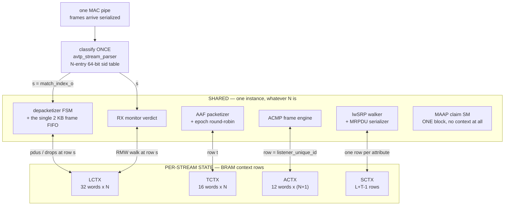
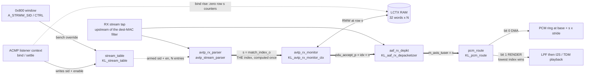
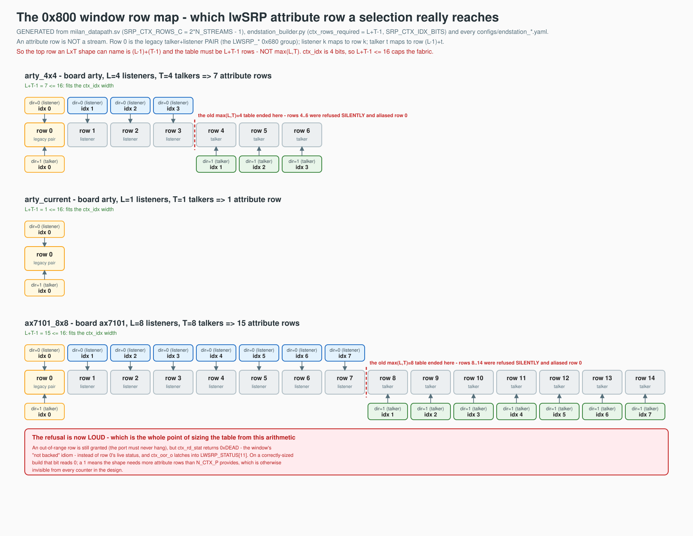
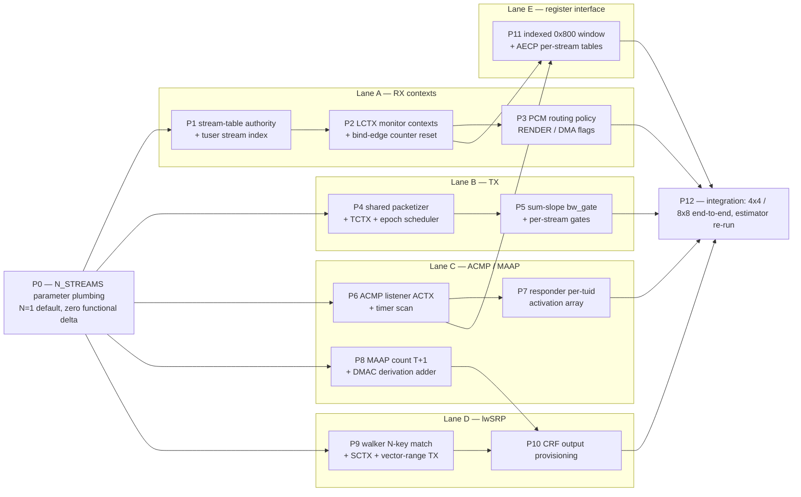
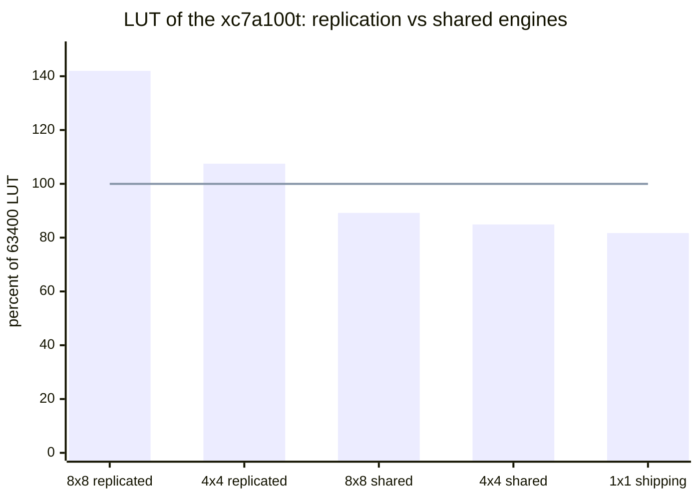

# NxN AAF Milan Streams — Shared Engines + Per-Stream Context RAM

Normative architecture for roadmap item 5 ([`docs/MILAN_COMPLIANCE_GAPS.md`](MILAN_COMPLIANCE_GAPS.md),
"Suggested order of attack" item 5). Test shapes: **AX7101 = 8x8**,
**Arty = 4x4** (`configs/endstation_ax7101_8x8.yaml`,
`configs/endstation_arty_4x4.yaml`). Status: IMPLEMENTED — shared-engine RTL
is live; the 8x8 shape elaborates and sim-scales green (§6 item-5 note).

**The replication verdict (why this doc exists).** The calibrated resource
estimator (`sw/builder/endstation_builder.py`, per-module costs measured from
the real mf48/mf38 hierarchical place reports) prices full per-stream
replication at **142.0% LUT for 8x8 and 107.5% LUT for 4x4** on the xc7a100t
(see `sw/builder/out/endstation_*/build_plan.md`, rows marked UPPER BOUND).
Replication is dead. The architecture is therefore:

> **ONE engine per function, N contexts per engine.** Every per-stream
> engine (depacketizer, monitor, packetizer, ACMP listener SM, MAAP claim,
> lwSRP registrar) becomes a single shared datapath whose per-stream mutable
> state lives in a BRAM-backed context record, indexed by a stream index
> `s` produced once, at classification time. BRAM-based context is cheap
> (a full 8-stream RX context is 8 Kb — 1/4 of one RAMB36); **muxing is the
> cost**, so the design rules below exist to bound mux growth.

*The one question this picture answers: when N grows, what is actually
replicated?*



Only the lower band deepens with N. Term by term:

| Grows with N | Stays ×1 whatever N is |
|---|---|
| Context-RAM depth: LCTX 32 w/stream (§1.4), TCTX 16 w/stream (§2.2), ACTX one row per sink (§3.1), SCTX `L+T-1` rows (§3.4.1) | The engines themselves — depacketizer FSM, monitor verdict, packetizer framer, ACMP frame engine, lwSRP walker and MRPDU serializer |
| Stream-table `stream_id` flops, 64 b per entry (§6.1) | The RX frame FIFO — single, 2 KB, `{tuser=s}` tagged (§1.2) |
| Narrow per-stream timer flop arrays: 100 ms silence = a 7-bit ms counter ×N (56 FF at N=8, §1.4); responder activation N × 6 b (§3.2) | The render path — LPF + playback walker, instantiated once; the lowest-indexed RENDER stream wins (§1.3) |
| lwSRP match lanes — one 64-bit compare per context, 2 → 18 at N=8 (§3.4) — and the per-stream `stream_gate` (§2.4) | MAAP — ONE contiguous block claim of `T+1` addresses covers every stream; DMACs are `base + t` (§3.3) |
| Index and mux widths — by `log2 N` only (§6.1) | `KL_crf_rx` / `KL_crf_tx` — dedicated engines, not stream slots (§2.5) |
| | The class-A egress queue and its CBS credit accounting (§2.4) |
| | Every clock-domain crossing: one TX capture, one RX render, one CRF event pulse (§4) |

**The no-regression axiom (normative).** Every increment in §5 keeps ALL
existing TBs green, and a build with `N = 1` SHALL produce today's behavior:
same wire bytes from the talker, same CSR map semantics at the legacy
addresses, byte-identical `aecp_aem_rom.svh` for `endstation_arty_current`
(the tracked-ROM identity gate). The legacy flat per-stream CSRs remain and
alias stream index 0.

Companion docs: [`docs/ENDSTATION_BUILDER.md`](ENDSTATION_BUILDER.md) (design decisions D1–D8; one
STREAM_PORT per stream; config-selectable clusters),
[`docs/LWSRP_FPGA_ARCHITECTURE.md`](LWSRP_FPGA_ARCHITECTURE.md) (single-attribute engine being scaled
here), [`docs/SPEC_TRACEABILITY.md`](SPEC_TRACEABILITY.md) rows M-CNT-2 (Table 7-156 counters),
AAF-4 / M-FMT-2 (wire-truth channel policy), SRP-9 (per-stream attribute
instances).

## Contents

- **[0. Clause references (verified via pdftotext against the local standards PDFs, $STANDARDS_DIR)](#0-clause-references-verified-via-pdftotext-against-the-local-standards-pdfs-standards_dir)** — The standards receipts. Every requirement this architecture rests on, traced to a clause verified against the local PDFs rather than recalled — Milan 5.3.8 per-stream state, the 10 diagnostic counters per Stream Input, GET_COUNTERS coherency.
- **[1. Dataplane RX — shared depacketizer + monitor engine](#1-dataplane-rx--shared-depacketizer--monitor-engine)** — The listener side, and the key discovery that shaped the whole design: `avtp_stream_parser` ALREADY carries an 8-entry match table, so classification needed no new matcher — only new table writers. Covers the stream table as single authority, then the shared depacketizer and monitor.
- **[2. Dataplane TX — shared packetizer](#2-dataplane-tx--shared-packetizer)** — The talker side. Where `aaf_talker_i2s` splits cleanly — the audio capture front-end is physical-interface-scoped and stays x1, while the framer/serializer becomes the shared packetizer with per-stream state lifted into context.
- **[3. Control plane](#3-control-plane)** — ACMP, MAAP, lwSRP and AECP at N contexts. `KL_acmp_listener` already had the right split (shared frame engine, per-sink binding record) — it was just duplicating the record by hand.
- **[4. Clock domains, CDC, and the timing-risk register](#4-clock-domains-cdc-and-the-timing-risk-register)** — The CDC audit for the NxN shape, and the load-bearing invariant that keeps it simple: every context engine and context RAM lives entirely in the milan clock domain, verified per module. Also the timing-risk register.
- **[5. Phasing — TB-gated increments (no-regression axiom throughout)](#5-phasing--tb-gated-increments-no-regression-axiom-throughout)** — How this lands without a big-bang merge — TB-gated increments under the no-regression axiom, with the N=1 shape staying bit-compatible at every step. Names which lanes parallelize and which integration steps must stay serial.
- **[6. Resource budget per subsystem](#6-resource-budget-per-subsystem)** — What NxN costs per subsystem, with the shared-engine numbers set against the replicated upper bound. Read the stated assumptions first — context RAM is charged at BRAM cost only, which is what makes the comparison fair.

## 0. Clause references (verified via pdftotext against the local standards PDFs, `$STANDARDS_DIR`)

| Ref | Source | Clause | Requirement grounded here |
|-----|--------|--------|---------------------------|
| [M-5.3.8] | Milan v1.2 | 5.3.8 (.2 bound, .3 binding params, .5 probing/settled, .6 probing/ACMP status) | Per-Stream-Input dynamic state — the fields of the ACMP listener context record, per sink |
| [M-5.3.8.10] | Milan v1.2 | 5.3.8.10, Table 5.6 | 10 diagnostic counters per Stream Input; 32-bit wrap; reset on not-bound→bound edge only |
| [M-5.4.2.25] | Milan v1.2 | 5.4.2.25 | GET_COUNTERS per descriptor — needs a coherent per-stream counter block read |
| [M-5.5.3] | Milan v1.2 | 5.5.3 | Listener sink state machine — one instance per sink (the SM the shared ACMP engine time-multiplexes) |
| [M-5.5.4] | Milan v1.2 | 5.5.4 | Talker behavior (PROBE_TX per talker_unique_id) |
| [M-6.3/6.4] | Milan v1.2 | 6.3, 6.4 | Base formats Class A; listener advertises all 48 kHz base formats per Stream Input |
| [M-7.2.2] | Milan v1.2 | 7.2.2 | "an AAF Media Listener with two or more AAF Media Inputs shall implement a CRF Media Clock Input" (have: KL_crf_rx) |
| [M-7.2.3] | Milan v1.2 | 7.2.3 | "an AAF Media Listener with two or more AAF Media Inputs shall implement a CRF Media Clock Output" — **mandatory the moment N≥2 listeners exist** (KL_crf_tx exists; §3.5 provisions it) |
| [M-7.3.2–7.3.4] | Milan v1.2 | 7.3.2–7.3.4, Table 7.1 | CRF stream: base 48000, interval 96, 1 ts/PDU, Class A reservation, format 0x041060010000BB80 |
| [A-7.4.42] | 1722.1-2021 | 7.4.42, Table 7-156/7-157 | STREAM_INPUT counters_valid bits and counters_block offsets — the context-RAM counter word order in §1.4 IS the Table 7-157 offset order |
| [A-7.2.13/7.2.19] | 1722.1-2021 | 7.2.13, 7.2.19 | STREAM_PORT owns clusters + one AUDIO_MAP (builder D1) |
| [P-7.3.3] | 1722-2016 | 7.3.3 | AAF PCM channels_per_frame = wire truth (AAF-4 row; per-stream `wire_chans` export) |
| [P-10] | 1722-2016 | 10 | CRF encapsulation (KL_crf_tx/rx) |
| [P-AnnexB] | 1722-2016 | Annex B | MAAP block claim (one contiguous block of `count` addresses) |
| [Q-35] | 802.1Q-2018 | 35, 35.1, 35.2.7 | MSRP per-stream attribute instances (SRP-9 row); attribute vectors carry ranges — exploited in §3.4 |

## 1. Dataplane RX — shared depacketizer + monitor engine

### 1.1 Stream table (classification, the single authority)

`avtp_stream_parser.sv` **already** carries an `N_STREAMS = 8` match table
(`cfg_stream_id_i[64*N-1:0]` + `cfg_stream_en_i[N-1:0]`, combinational
64-bit compare loop emitting `match_index_o`) — classification needs no new
matcher, only new table writers. Normative:

- The stream table is indexed `s = 0..N_LISTENERS-1` for AAF sinks; the CRF
  sink keeps its dedicated compare inside `KL_crf_rx` (single media clock
  domain, one sink — no table entry burned).
- Match key is the 64-bit **stream_id** (wire truth), never the DMAC. Table
  entries are written by the ACMP listener context on bind/settle
  ([M-5.3.8.3]: sid/dmac/vlan come from the last PROBE_TX_RESPONSE) and may
  be overridden per stream via the CSR window (§1.5) for bench use.
- `match_index_o` rides the frame as sideband (`tuser[3:0]`) into the
  depacketizer frame FIFO and the monitor pulse bundle. The index is
  computed ONCE; every downstream engine consumes it — no re-matching.

*Where the stream index is born and who consumes it* — the thick arrows are
the index itself, and it is never recomputed:



### 1.2 Shared depacketizer

Finding from the single-stream RTL: the AAF frames arrive serialized on one
MAC pipe, and `KL_aaf_rx_depacketizer`'s in-flight scratch (`rstate_r`,
`rbeat_r`, `hold_r`, `remain_r`, `vlan_r`, `good_r`, `in_frame_r`) only ever
describes ONE frame at a time.

Therefore the depacketizer engine stays a **single instance with zero
context duplication of its FSM**; only its counters (`pdus`, `drops`)
become per-stream context words.

The frame FIFO stays single (2 KB) and stores `{tuser=s}` alongside each
frame; the read side emits `{s, pcm beats}`.

### 1.3 PCM routing policy

Each listener context carries a 2-bit `route` field of INDEPENDENT flags
(reworked from the P3 exclusive enum per the ALSA driver design feedback,
the-private-test-repo `fpga/docs/ALSA_DRIVER_DESIGN.md` open question 4):

| bit | Flag | Meaning |
|-----|------|---------|
| 0 | `DMA` | Depacketized PCM written to the per-stream PCM DMA ring in DRAM (ring base + `s`·ring_stride, the existing LiteX PCM-ring DMA generalized with an index) — the capture-PCM feed for roadmap item 7 (ALSA). |
| 1 | `RENDER` | Feeds the physical render path: LPF (x1, engages per today's `chans==2` rule) → `KL_i2s_playback`/TDM serializer. **Exactly one stream renders; if several carry the flag, the lowest-indexed one wins (deterministic rule, RTL-enforced).** |

`0b00` = NULL (discarded — monitor still counts, [M-5.3.8.10] counters run
regardless of rendering); `0b11` = RENDER|DMA = capture-while-rendering.
Mapping from the P3 enum: `0 NULL`→`0b00`, `1 RENDER`→`0b11` (P3's RENDER
de-facto also forwarded the ring copy), `2 DMA`→`0b01`.

Default at reset: stream 0 = RENDER|DMA, others NULL — the N=1 shape is
bit-identical to today. The render path (LPF, playback walker, wire-truth
1-to-1 channel rule per AAF-4/M-FMT-2) is instantiated ONCE; `wire_chans`
delivered to the walker is the RENDER stream's context field.

### 1.4 Listener context record (LCTX) — bit-accurate layout

One RAMB18 (SDP, 32-bit ports), address `{s[2:0], word[4:0]}` — 32 words
(1024 bits) per stream, 8 streams = 8 Kb.

**CFG region (CSR/ACMP-written, engine-read):**

| Word | Field | Bits | Source |
|------|-------|------|--------|
| w0 | `SID_LO` | [31:0] | ACMP bind (or CSR override) |
| w1 | `SID_HI` | [31:0] | " |
| w2 | `FMT_LO` | [31:0] | AECP SET_STREAM_FORMAT (current format u64, [M-5.3.8.1]) |
| w3 | `FMT_HI` | [31:0] | " |
| w4 | `CTRL` | [0] en, [2:1] route, [31:3] rsvd | CSR |

**DYN region (engine-owned; today's `KL_avtp_rx_monitor` scalar registers):**

| Word | Field | Bits |
|------|-------|------|
| w8 | `MON_STATE` | [7:0] prev_seq, [11:8] settle, [12] media_locked, [13] bound_q, [21:14] wire_chans, [31:22] rsvd |
| w9 | `LAST_TS` | [31:0] avtp_timestamp of last accepted PDU |
| w10 | `LAST_TSD` | [31:0] signed ts_delta |
| w11 | `DEPKT_CNT` | [15:0] pdus, [31:16] drops |

**CNT region — w16..w25, in 1722.1-2021 Table 7-157 offset order** so a
GET_COUNTERS block is a linear burst read (10 × 32 b, wrap-to-zero, reset ONLY
on that stream's not-bound→bound edge — [M-5.3.8.10]). RAM word, wire offset
and window address are the same ordering three times over:

| Word | Table 7-157 offset | Counter | Window read (§1.5) |
|------|------|---------|--------|
| w16 | 0 | `MEDIA_LOCKED` | `A_STRMW_CNT0` 0x830 |
| w17 | 4 | `MEDIA_UNLOCKED` | 0x834 |
| w18 | 8 | `STREAM_INTERRUPTED` | 0x838 |
| w19 | 12 | `SEQ_NUM_MISMATCH` | 0x83C |
| w20 | 16 | `MEDIA_RESET` | 0x840 |
| w21 | 20 | `TIMESTAMP_UNCERTAIN` | 0x844 |
| w22 | 24 | `UNSUPPORTED_FORMAT` | 0x848 |
| w23 | 28 | `LATE_TIMESTAMP` | 0x84C |
| w24 | 32 | `EARLY_TIMESTAMP` | 0x850 |
| w25 | 36 | `FRAMES_RX` | `A_STRMW_CNT9` 0x854 |

The three regions start at words 0, 8 and 16 of the 32-word record; w5–w7,
w12–w15 and w26–w31 are unallocated.

**Timer rule (normative, applies to every context engine in this doc):**
free-running per-stream timers do NOT go to RAM. They are re-based to the
shared 1 ms tick and held as narrow per-stream flop arrays.

The monitor's 100 ms silence watchdog becomes a 7-bit ms-counter × N
(56 FF for N=8) instead of a 32-bit cycle counter × N in RAM needing a
RMW every cycle.

Context RAM holds event-driven state only; the engine performs a serial
read-modify-write walk per accepted frame (≥ ~780 cycles available between
frames of one stream at 8 kHz class-A cadence; total RX PDU rate 64 k/s at
N=8 leaves > 700 datapath cycles per PDU at 50 MHz — a ~15-cycle RMW walk
has > 40x margin).

### 1.5 Per-stream counter access — indexed CSR window (the register interface)

Today's per-stream CSRs are flat fixed addresses (0x6A4–0x6F0 listener
group, 0x6B8 `AVTPRX_STAT` = "STREAM_INPUT[0], Milan Table 7-156"). Flat
replication for 8+8 streams would add ~500 decoded words to `milan_csr`
(~1.6 k LUT today for ~120 registers — decode scales with word count).
**Decision: indexed window, placed in the free CSR tail (map is used up to
0x774; 0x778+ is free — see [`docs/reference/REGISTER_MAP.md`](reference/REGISTER_MAP.md)).**

| Addr | Name | R/W | Fields |
|------|------|-----|--------|
| 0x800 | `A_STRM_SEL` | RW | [3:0] stream index, [8] dir (0 = listener, 1 = talker) |
| 0x804 | `A_STRM_SNAP` | W strobe / R [0] busy | Latches the selected stream's full CNT region + STATE into the window shadow in one engine-arbitrated burst — the coherent block [M-5.4.2.25] GET_COUNTERS needs |
| 0x810 | `A_STRMW_CTRL` | RW | [0] en, [2:1] route (listener) / [0] en (talker) |
| 0x814/0x818 | `A_STRMW_SID_LO/HI` | RW(talker)/RO(listener-bound) | stream_id |
| 0x81C/0x820 | `A_STRMW_DMAC_LO/HI` | RW/RO | stream DMAC |
| 0x824/0x828 | `A_STRMW_FMT_LO/HI` | RW | current stream format |
| 0x82C | `A_STRMW_STATE` | RO | packed: ACMP lsm state[2:0], probing[4:3], acmp_status[9:5], media_locked[10], wire_chans[18:11], SRP bits[27:19] |
| 0x830–0x857 | `A_STRMW_CNT0..9` | RO | the 10 Table 7-157 counters (offsets 0..36 preserved) |
| 0x858 | `A_STRMW_PDUS` | RO | {drops[31:16], pdus[15:0]} (listener) / frames_sent (talker) |
| 0x85C | `A_STRMW_SRP` | RO | per-stream lwSRP attribute status (mirrors 0x694 bit layout) |

Window reads are served from the context RAM's second port (SDP port B) —
no shadow copies except the SNAP latch block.

Justification of indexed over flat:

- (a) decode area O(1) instead of O(N);
- (b) the reader is the single softcore daemon — sequential SEL-then-read
  costs nothing;
- (c) SNAP gives GET_COUNTERS atomicity that flat regs never had;
- (d) legacy flat registers (0x648–0x764) stay wired to index 0 / the
  dedicated CRF engines, which IS the no-regression axiom for N=1.

AECP GET_COUNTERS handling in firmware switches from fixed 0x6B8-group
reads to SEL/SNAP/window reads keyed by descriptor index.

## 2. Dataplane TX — shared packetizer

### 2.1 Engine

`aaf_talker_i2s` splits cleanly: the audio-domain capture front-end (I2S
today, TDM8/16 with item 4's ser/des subtask) is physical-interface-scoped
(x1), and the framer/serializer (seq, ts latch, header build, 12-beat AXIS
emit) becomes the shared packetizer. Per-stream mutable state (today's
scalars `seq_r`, `ts_r`, `nsamp_r`, `frame_pend_r`, `buf_l/r[0:5]`,
`frames_sent_o`) moves to the talker context.

### 2.2 Talker context record (TCTX) — bit-accurate layout

RAMB18 region, `{t[2:0], word[3:0]}`:

| Word | Field | Bits |
|------|-------|------|
| w0 | `CTRL` | [0] en, [4:1] chans (wire truth, [P-7.3.3]), [16:5] vlan_vid, [31:17] rsvd |
| w1 | `DMAC_LO` | [31:0] (default = MAAP base + t, §3.3; CSR-overridable) |
| w2 | `DMAC_HI` | [15:0]; [31:16] `UID` (stream_id = {station_mac, uid}, uid default = t) |
| w3 | `SEQ_TS` | [7:0] sequence_num, [31:8] rsvd |
| w4 | `TS` | [31:0] latched presentation time (ptp_ns + transit_ns at first-sample capture) |
| w5 | `FRAMES` | [31:0] frames_sent counter |

Sample staging: a double-buffered BRAM region, `6 samples × chans × 24 b`
per stream (8 × 8 ch = 9.2 Kb per bank; both banks fit one RAMB36 beside
the TCTX). The audio-domain TDM deserializer writes bank A while the
packetizer drains bank B; the bank swap IS the epoch boundary.

### 2.3 Scheduling across N talker streams

All N talker streams share the media clock, so all frame on the same
6-sample cadence (48 kHz / 6 = 8 kHz per stream, the class-A observation
interval, [M-6.3]).

Normative scheduler: an **epoch round-robin** — on each 8 kHz epoch strobe
(media_adv-derived / audio-MMCM grid), the packetizer walks `t = 0..T-1`,
emits one AAF PDU per enabled stream back-to-back into the AAF class-A
queue.

Worst case 8 streams × ~25 beats ≈ 200 datapath cycles per 6250-cycle
epoch (50 MHz) — 3% occupancy; no per-stream pacing needed. Per-stream ts
is latched per epoch from the shared PHC read (one read, N stamps).

### 2.4 CBS interaction

The shaper is untouched: all AAF streams map to the same class-A queue
(qidx from `LWSRP_CTRL[4:2]`). The epoch burst (≤ 8 × ~190 B ≈ 1.5 KB) is
spread across the 125 µs interval by CBS credits exactly as designed.

What generalizes is the **reservation math**: `KL_lwsrp_bw_gate` becomes a
Σ-slope accumulator — idleSlope(queue) = Σ granted per-stream slopes, and
`over_limit` compares the Σ against the 75% ceiling (§3.4).

Per-stream `stream_gate[t]` gates each stream's epoch slot individually
(a torn-down stream stops instantly; others keep their slots). Bandwidth
sanity at N=8×8ch: 8 × 8000 × ~190 B ≈ 97 Mbit/s < 750 Mbit/s ceiling.

### 2.5 CRF output — dedicated engine, not a stream slot

`KL_crf_tx` (exists, wire-proven, CSRs 0x750–0x764, 6th low-rate
control-merge source) stays a dedicated engine rather than talker context
N: its cadence (500 PDU/s, [M-7.3.2] interval 96), its 60-byte fixed frame,
and its audio-MMCM event-grid timestamp capture share nothing with the AAF
packetizer walk. What it lacks is provisioning, not datapath — §3.5.

## 3. Control plane

### 3.1 ACMP listener SM × N

`KL_acmp_listener` already contains the exact split this architecture
needs: a shared frame engine (COLLECT/CLASSIFY/RESPOND scratch: 9×64
frame buffer, `cap_*` captures, TX watchdog, LFSR/ms timebase — stays x1)
and a per-sink binding record — which the RTL **already duplicates by hand
once** (the sink-1 CRF record `s1_*`). That duplication generalizes into
the ACMP context RAM (ACTX), `N_LISTENERS + 1` entries (AAF sinks + CRF
sink), selected by `listener_unique_id` from the classified ACMPDU:

| Field | Bits | [M-5.3.8] anchor |
|-------|------|------------------|
| `lsm_state` | 3 (acmp_lsm_t, [M-5.5.3] states) | 5.3.8.5/.6 |
| `bnd_ctlr` | 64 | 5.3.8.3 |
| `bnd_talker` | 64 | 5.3.8.3 |
| `bnd_tuid` | 16 | 5.3.8.3 |
| `bnd_flags` | 16 | STREAMING_WAIT etc. |
| `sid` | 64 | 5.3.8.5 (authoritative post-probe) |
| `dmac` | 48 | " |
| `vlan` | 12 | " |
| `active` | 1 | started/stopped |
| `probe_seq` | 16 | outgoing PROBE_TX sequence_id |
| `acmp_status` | 5, `probing` 2 | 5.3.8.6 |
| `tk_avail` | 1 | 5.3.8.4 (per-sink ADP discovery watch) |
| `clock_sink` | 1 | flavor bit — CRF sink record semantics (today's sink-1 SM) |
| `cmd_count`/`probe_count` | 16+16 | forensics |

= 366 bits → 12 words × 32 b; 9 entries ≈ 4.3 Kb (RAMB18). Timers
(`tmr` 200 ms/4 s/10 s, `adp_age` 63 s) follow the §1.4 timer rule: ms/s
tick scan, one context per tick slot. On bind edge the engine pulses
`ctx_bind_rise[s]`, which resets that stream's LCTX CNT region ([M-5.3.8.10]
reset rule) and writes the stream table entry (§1.1).

### 3.2 Talker activation × N

`KL_acmp_responder`: shared frame engine stays; the per-talker activation
state (`probe_armed`, 5-bit `probe_tmr`, 15 s window, [M-5.5.4]) becomes a
flop array indexed by `talker_unique_id` (N × 6 b = 48 FF — below the RAM
threshold, stays in flops). `talker_active[t] = probe_armed[t] |
listener_observed[t]`, where `listener_observed[t]` comes from the
per-stream lwSRP listener-ready bit (§3.4).

### 3.3 MAAP — one block claim covers all N (block count 8 already)

`KL_maap` claims ONE contiguous block of `count_i` addresses ([P-AnnexB]);
`MAAP_CTRL[15:8]` already resets to 8. Normative: **no per-stream claim
contexts.**

Per-stream DMACs are derived: `dmac(t) = claimed_base + t` for AAF
talkers, `dmac(CRF) = claimed_base + T`; the block count becomes `T + 1`
(CSR default lifted 8→9 when the CRF output is enabled).

Conflict detection and DEFEND are already range-based over the whole
block, so the single SM defends all stream DMACs at today's cost. The
`eff_aaf_dmac` mux generalizes to a per-context adder.

This is the cheapest subsystem of the whole item — by design the protocol
did the N-scaling for us.

### 3.4 lwSRP — N + N attribute contexts (subsumes the CRF-reservation gap)

The walker (`KL_lwsrp_walker`) already carries TWO hard-coded match
contexts (`{val_match_r, k_r, cap_evt_r, cap_par_r}` for our talker sid,
`{lval_match_r, lk_r, lcap_evt_r}` for the ACMP-bound sid) — the seed of
the context engine. Generalization (SRP-9, [Q-35.2.7]):

- **Match stage:** `T+1` talker keys + `L+1` listener keys (AAF + CRF each
  side), 64-bit range compares against the streaming FirstValue — for N=8
  this is 18 compares, structurally today's 2 × 9. Keys come from the SRP
  attribute context RAM (SCTX), maintained by ACMP bind (listener side) and
  the talker config (talker side).
- **Talker attribute context** (per t): `{uid[15:0], vid[11:0],
  max_frame[15:0], interval[15:0], acclat[31:0], declared, fresh, evt[2:0],
  listener_reg, listener_decl[1:0], lstn_leave_ms[9:0], tfail_valid,
  tfail_code[7:0], tfail_bridge[63:0], slope[31:0], gate, over}` ≈ 210 b.
- **Listener attribute context** (per l): `{sid[63:0], declare, ready,
  ta_registered, ta_failed, ta_fail_code[7:0], ta_vlan[11:0],
  ta_acclat[31:0], ta_bridge[63:0], ta_leave_ms[9:0], tf_leave_ms[9:0]}`
  ≈ 200 b. (Today's `KL_lwsrp_registrar` + `KL_lwsrp_ta_registrar` state,
  one row each.)
- Leave/age timers per the §1.4 ms-tick scan rule.
- **TX declaration walk:** `KL_lwsrp_tx` emits per JoinTime one MSRP PDU
  whose TalkerAdvertise / Listener vector attributes cover all declared
  contexts. Because uid = t, our stream_ids are consecutive — the MRP
  vector encoding carries them as ONE FirstValue + NumberOfValues = T
  attribute (a wire-size and LUT win; per-context event values ride the
  packed vector). Non-consecutive overrides fall back to one attribute per
  context.
- **Σ-slope:** bw_gate accumulates granted slopes over contexts (walked on
  the ms tick), drives the single class-A `idle_slope`, per-context
  `stream_gate`, and `over_limit` vs the 75% ceiling.
- **This closes the CRF reservation gap:** the CRF sink gets listener
  attribute context `L`, the CRF output gets talker attribute context `T`
  with the Class A reservation [M-7.3.3] — the CRF stream stops riding
  untagged best-effort (gaps §2 REMAINING item).

#### 3.4.1 Attribute-row map and sizing  *(SHIPPED 2026-07-26)*

An lwSRP attribute row is **not** a stream. The CSR `0x800` window
(`milan_csr` `srp_sel_row_w`) addresses `KL_lwsrp_ctx` rows as

| window selection | ctx row |
|---|---|
| row 0 | the legacy talker+listener pair (`LWSRP_*` 0x680 group) |
| listener idx `k` (1..L-1) | `k` |
| talker idx `t` (1..T-1) | `(L-1)+t` |

*Which row does my selection actually reach, and does it exist in this build?*
— the same three rules, drawn for **every shipping shape**:



**Generated, not drawn.** [`nxn_window_map.gen.py`](diagrams/nxn_window_map.gen.py)
takes `L` and `T` from each `configs/endstation_*.yaml`, confirms
`SRP_CTX_ROWS_C = 2*N_STREAMS - 1` is still what `milan_datapath.sv`
elaborates and `ctx_rows_required = L+T-1` is still what `sw/builder` demands,
and refuses to emit anything if either formula has moved. The dashed red line
on each shape is where the old `max(L,T)` table stopped — the rows that were
refused *silently* while their readback aliased row 0. Regenerate with:

```
python3 docs/diagrams/nxn_window_map.gen.py docs/diagrams/nxn_window_map
rsvg-convert -w 1800 docs/diagrams/nxn_window_map.svg -o docs/diagrams/nxn_window_map.png
```

so the highest row an `LxT` shape can name is `(L-1)+(T-1)` and the table
must be **`L+T-1` rows**, *not* `max(L,T)`. `milan_datapath` therefore
elaborates

```
localparam int SRP_CTX_ROWS_C = 2*N_STREAMS - 1;      // L = T = N_STREAMS
KL_lwsrp_top #(.N_CTX_P(SRP_CTX_ROWS_C),
               .N_LISTENERS_P(N_STREAMS),
               .N_TALKERS_P (N_STREAMS)) ...
```

`N_TALKERS_P` is deliberately separate from `N_CTX_P`: `stream_gate_o`,
`res_active` and the Σ-slope engine stay **T** wide (indexed by talker
stream index, which is what `aaf_stream_en_w` consumes), so the bw-gate
does not grow to 15 slope slots at 8x8 for 7 usable talkers. Inside
`KL_lwsrp_top` talker `t` reads extra lane `(L-1)+t-1`.

> **What this fixed.** With `N_CTX_P = N_STREAMS` the arithmetic was short
> by `min(L,T)-1` rows: at 4x4 every talker row (4,5,6) and at 8x8 rows
> 8..14 were `>= N_CTX_P`, and `KL_lwsrp_ctx` refused them **silently**
> while the readback aliased row 0 — so the window reported the legacy
> pair's live status and the legacy stream_id for a row that had never been
> provisioned. The talker gate compounded it by reading lane `t-1`, a
> *listener* row, whose `~row_dir` term is 0: every `t>0` admission gate was
> pinned shut whenever the engine was enabled. `N=1` is unchanged
> (`2*1-1 = 1`).

**The refusal is now loud.** An out-of-range row is still granted (the port
must never hang) but `ctx_rd_stat` returns `0xDEAD` — the window's
"not backed" idiom — instead of row 0's status, and `ctx_oor_o` latches to
`LWSRP_STATUS[11]`. On a correctly-sized build that bit reads 0; a 1 means
the shape needs more attribute rows than `N_CTX_P` provides, which is
otherwise invisible from every counter in the design.

`sw/builder` already computes `ctx_rows_required = L+T-1` and refuses a
shape needing more than `1 << SRP_CTX_IDX_BITS = 16` rows, so `ctx_idx_i`
staying 4 bits caps the fabric at `L+T-1 <= 16`, i.e. **N_STREAMS ≤ 8**.

#### 3.4.2 Per-row TSpec  *(SHIPPED 2026-07-26)*

The ctx record carries `{dmac, prio_rank, max_frame, interval, latency}`
per row and `KL_lwsrp_ctx_tx` serializes each row's own values into its own
TalkerAdvertise vector, but the `0x800` window has no per-stream TSpec word
and used to source `max_frame` from the shared `LWSRP_TSPEC` (0x690) for
every row — a 2-channel and an 8-channel talker reserved identically.

`milan_datapath` now derives it from the geometry the packetizer itself
frames with: the **same** TCTX w0 `chans` field, under the **same** clamp
(`chn_clamp`, even 2..8), so the reservation and the wire cannot disagree:

```
payload       = SAMPLES_PER_FRAME(6) x C x 4  = 24*C octets
MaxFrameSize  = 24 + 24*C            (the MSDU / AVTPDU — what MSRP wants)
L2 frame      = 42 + 24*C            = MaxFrameSize + the 802.1Q overhead
```

which is `sw/builder`'s `srp_frame_geometry` verbatim, so the emitter's
per-talker `max_frame_bytes` in `lwsrp_table.json` is now what the fabric
actually declares. Row 0 keeps `LWSRP_TSPEC` untouched (the silicon-proven
legacy path), and `MaxIntervalFrames` stays shared on purpose — it is an
SR-class property, and the builder emits one value for every row.

The bw-gate's per-row TSpec shadow captures on the **service beat**
(`ctx_req_i && !ctx_gnt_o`) — the same cycle `KL_lwsrp_ctx` writes the
record RAM — not on the grant beat one cycle later, so a caller that drops
`req/we` at the grant can no longer write a record whose slope is 0.

### 3.5 CRF Media Clock Output provisioning ([M-7.2.3])

With N ≥ 2 AAF listener sinks, the CRF Media Clock Output is mandatory.
KL_crf_tx exists; the item-5 round provisions it: (a) AEM overlay emits the
CRF `STREAM_OUTPUT` descriptor (builder change — the 8x8/4x4 overlays gain
one STREAM_OUTPUT with format 0x041060010000BB80, no STREAM_PORT per D1);
(b) MAAP DMAC slot `base + T` (§3.3); (c) lwSRP talker attribute context
`T` (§3.4); (d) provisioning daemon arms `A_CRFT_*` from the claimed DMAC
and station identity. The CRF sink side ([M-7.2.2]) is already compliant.

*Which quarter of that list is actually done* — the four steps are settled
individually and the rest of this section is their detail:

| Step | What it is | Status |
|---|---|---|
| (a) | AEM overlay emits the CRF `STREAM_OUTPUT`; `ADP_TALKER_SOURCES` and the AEM output count include it | **OPEN** — builder + the `0x600` group. Without it no controller ever learns the uid exists |
| (b) | MAAP DMAC slot `base + T` (§3.3) | **SHIPPED 2026-07-26** — the responder answers `stream_dest_mac` = block base + `N_STREAMS`; `MAAP_CTRL`'s claimed count must therefore be `N_STREAMS+1` |
| (c) | lwSRP talker attribute context `T` — the Class A reservation ([M-7.3.3]) | **OPEN** — the `0x800` window addresses talker idx `< T` only, so no selection reaches the row; needs `N_CTX_P = L+T` plus a way to name it |
| (d) | provisioning daemon arms `A_CRFT_*` from the claimed DMAC and identity | **COLLAPSED TO NOTHING** — `KL_crf_tx` takes the responder's own pair whenever `CRFT_SIDLO/HI` + `CRFT_DMLO/HI` are left at 0 |

**Fabric half SHIPPED 2026-07-26 — (b) + the bindable talker context, and
(d) reduced to nothing.** `milan_datapath` elaborates the ACMP talker
responder at

```
localparam int ACMP_SRC_C = (N_STREAMS > 1) ? N_STREAMS + 1 : 1;
localparam int CRF_TUID_C = N_STREAMS;
```

so at `N > 1` — exactly the "N ≥ 2 sinks" rule above — source context
`talker_unique_id = N_STREAMS` **is** the CRF Media Clock Output. A
controller binds it with the same `CONNECT_TX_COMMAND` / PROBE_TX it uses
for audio: the responder answers SUCCESS with `stream_id = {station MAC,
N_STREAMS}` (it echoes the uid tail) and `stream_dest_mac = MAAP block slot
base + N_STREAMS`, one past the audio sources — so `MAAP_CTRL`'s claimed
count must be `N_STREAMS+1`. `uid = N_STREAMS+1` still returns
`TALKER_UNKNOWN_ID`. At `N_STREAMS = 1` the extra context does not exist
and the responder is the byte-identical single-source shape.

`KL_crf_tx` then takes **that same pair** whenever `CRFT_SIDLO/HI` and
`CRFT_DMLO/HI` are left at their 0 reset, so what the controller was told
and what the fabric emits cannot disagree and no daemon has to recompute
them — step (d) collapses to "leave the registers alone". A non-zero
`CRFT_SID`/`CRFT_DMAC` still wins outright (today's static provisioning,
exact).

Still open on the CRF path:

* **(c) the lwSRP talker attribute row.** The `0x800` window addresses
  talker idx `< T` only, so there is no selection that reaches a row for
  the CRF output; giving it one needs `N_CTX_P = L+T` plus a window/CSR way
  to name it. Until then the CRF stream is declared by nothing and its
  ACMP activation is the PROBE_TX window plus the `A_ACMP_LOBS` socket —
  honest, but not a Class A reservation ([M-7.3.3]).
* **(a) the AEM/ADP advertisement.** `ADP_TALKER_SOURCES` and the AEM
  `STREAM_OUTPUT` count must include the CRF output or a controller never
  learns the uid exists (builder + `0x600` group).
* The 8-bit `A_ACMP_TLK*` CSR vectors carry the **audio** sources only;
  the CRF context would not fit the field at N = 8.

### 3.6 AEM / AECP changes

The overlay path already builds structurally valid multi-port ROMs (one
STREAM_PORT per stream, per-port cluster blocks, §7.2.19-relative maps —
builder D1/D2/D3); nothing in fabric consumes them yet.

AECP RTL changes: DONE (item-4 follow-up) — the svh validation tables
became per-descriptor arrays (`AEM_STRIN_*`/`AEM_STROUT_FMT_C` +
`WB_STRIN/STROUT_FMT_ADDR_C`) emitted by `gen_aem_store.py` for
multi-stream shapes behind `` `AEM_PER_STREAM_FMT`` (the deployed
1-AAF-in shape keeps the legacy layout byte-identical).

SET/GET_STREAM_FORMAT and the RX monitor's format-compare reference key
the addressed descriptor's own entry (tb/verilator/aecp `sim_fmt2`).

Remaining: GET_STREAM_INFO and GET_COUNTERS handlers keying the §1.5
window by descriptor index. ADP source/sink counts already come honest
from the overlay.

## 4. Clock domains, CDC, and the timing-risk register

Domains (unchanged set): `axis/milan clk` (AX 100 MHz / Arty 50 MHz),
`gtx_clk` 125 MHz (MAC-RX timestamping only), audio MMCM 24.576 MHz,
CPU/system. **All context engines and context RAMs live entirely in the
milan clk domain** — parser, monitor, depacketizer, ACMP, MAAP, lwSRP,
CRF-rx are single-domain today (verified per module) and stay so; the
context-RAM refactor adds ZERO new CDC. The audio boundary crossings do
not multiply with N:

- TX capture: ONE widened `cdc_pair_fifo` carries `{slot, sample}` from the
  TDM deserializer (all streams' samples ride one crossing).
- RX render: ONE `cdc_pair_fifo` to the DAC serializer (only the RENDER
  stream crosses).
- CRF-tx keeps its `cdc_pulse` event-grid crossing.

**Timing-risk register** (the cones that grow, against the AX 100 MHz
history — AX31 guard-netlist round: 6–8 seed misses from a single
`storage_32`/`tx_sf ADDR[9]` cone; defect 4: LUTRAM read-port replica
divergence caught by BDBG):

| # | Cone | Risk | Mitigation (normative) |
|---|------|------|------------------------|
| T1 | Context-RAM RMW (read→modify→write counter/state walk) | New RMW loop per engine; same-address back-to-back hazard | 2-stage pipelined RMW with a single bypass register; serial walk (one word/cycle) — never a parallel 10-counter update |
| T2 | CSR window readback mux | Widening the `milan_csr` read mux was the historic decode-cone trap | Window served from context-RAM port B (registered BRAM output, 2-cycle read latency); ONE explicit read port per RAM (defect-4 rule: no inferred read-port replicas) |
| T3 | Parser 8-way 64-bit sid compare | — | Already exists at N_STREAMS=8 and closes at AX 100 MHz today; adding table-write muxing only. lwSRP walker grows 2→18 compares: register the FirstValue once, tree the compares, allow one extra pipeline stage (MRP has ms-scale timing slack) |
| T4 | TX epoch scheduler arbitration | New round-robin grant + context fetch feeding the header builder | Context prefetch one slot ahead; header build already serial (12 beats) |
| T5 | Σ-slope accumulator | 49-bit multiply-accumulate over contexts | Walked on the ms tick, one context per cycle — sequential by construction (the CBS sequential-slope-engine pattern that saved 8 K LUTs in the area-70 campaign) |
| T6 | AX 100 MHz closure at ~88% LUT | Historic: seed lottery above ~80% utilization | 3×32-thread seed sweeps (standing rule); levers of §6 before any timing heroics; QSPI-corruption floor: never ship below the WNS ≥ +0.03 rule if a clock bump is ever attempted |

## 5. Phasing — TB-gated increments (no-regression axiom throughout)

Every increment: full `tb/verilator/*` sweep green (`for d in */; do (cd $d
&& make) done`), yosys portability check, builder gates
(`python3 sw/builder/test_builder.py` incl. the ROM byte-identity gate),
and the N=1 shape bit-compatible. Lanes A–D are parallelizable after P0;
integration steps are serial at the end.

| # | Increment | Lane | TB gate | Parallel? |
|---|-----------|------|---------|-----------|
| P0 | `N_STREAMS` parameter plumbing: milan_datapath/milan_top/milan_soc `--num-streams` (builder emits it in soc_params); N=1 default, zero functional delta | — | full sweep unchanged; `datapath`, `milan_dp` | serial (root) |
| P1 | Stream-table CSR authority + `tuser` stream-index tag parser→FIFO→monitor bundle; index constant 0 at N=1 | A | `avtp_stream` extended (multi-entry match already covered), `avtp_rxmon` 75 + coverage gate | lane root |
| P2 | Monitor context RAM: LCTX DYN+CNT regions, bind-edge reset per stream, silence→ms-tick flop array; 0x6B8 group aliases stream 0 | A | `avtp_rxmon` (≥95% line cov held) + new N-stream interleave TB | ∥ with B,C,D |
| P3 | PCM routing policy: `route` field, RENDER-lowest-wins, per-stream DMA rings, NULL default for s>0 | A | `i2spb` untouched-green, `datapath` | after P2 |
| P4 | Shared TX packetizer + TCTX + epoch scheduler; golden-frame check: N=1 emits today's exact wire bytes | B | `aaf` + new golden-frame byte-compare TB | ∥ with A,C,D |
| P5 | Σ-slope bw_gate + per-stream gates | B | `lwsrp` 36 (bw math rows) + `cbs` | after P4 |
| P6 | ACMP listener ACTX (sink-1 record folds into context N flavor); timer scan | C | `acmp_lstn` 89 checks + xN bind/probe interleave checks | ∥ with A,B,D |
| P7 | Responder per-tuid activation array | C | `acmp` | after P6 |
| P8 | MAAP count=T+1 + per-stream DMAC derivation adder | C | `maap` | ∥ within C |
| P9 | lwSRP walker N-key match + SCTX registrar/declaration contexts + vector-range TX (closes SRP-9 + CRF reservation) | D | `lwsrp` 36, `lwsrp_rx` 75, `lwsrp_tx` 363, `lwsrp_switchpdu` | ∥ with A,B,C |
| P10 | CRF output provisioning: overlay STREAM_OUTPUT + MAAP slot + SRP context + daemon arming ([M-7.2.3]) | D | `crf_tx` + builder gates (overlay counts) | after P8, P9 |
| P11 | Indexed CSR window (0x800 block) + AECP per-stream validation tables (codegen) | E | `csr`, `aecp` 474, ROM byte-identity gate | after P2, P6 |
| P12 | Integration: 4x4/8x8 config builds end-to-end, 2-stream smoke in `milan_dp`, estimator re-run with shared-engine rows replacing UPPER BOUNDs | — | `datapath`, `milan_dp`, full sweep, `test_builder` | serial (last) |

*What can start the moment P0 lands, and what is genuinely blocked* — the
table is the contract, this is its shape:



Lanes: **A (RX contexts), B (TX), C (ACMP/MAAP), D (lwSRP)** run
concurrently after P0 (lane A additionally needs P1 first); P11 joins A+C;
P12 closes. Silicon sweeps (3-seed Vivado rule) happen after P12, outside
this doc's scope.

## 6. Resource budget per subsystem

Baseline = the estimator's calibrated per-module numbers (mf48 measured
x1); "replicated" = the estimator's UPPER BOUND (dead); "shared" = this
architecture.

**Stated assumptions:** context RAM in BRAM is charged at its BRAM cost
only; the shared-engine LUT/FF overhead for context indexing, RMW
pipelining and muxing is modeled at **+35% LUT / +20% FF** of the measured
single-instance engine (+50%/+40% for the TX packetizer whose scheduler is
new; +40% for ACMP; +60% for the lwSRP walker whose compare tree really
grows).

The model is deliberately conservative, and to first order N-independent
(mux widths grow with log2 N only). All rows LUT/FF/BRAM36/DSP.

| Subsystem | Measured x1 | 8x8 replicated (estimator UB) | 8x8 shared (this doc) | 4x4 shared |
|---|---|---|---|---|
| RX stream engine (depkt+parser+monitor+LPF) | 1223/2094/1.5/1 | 9784/16752/12/8 | 1650/2500/2.5/1 | 1590/2400/2.5/1 |
| TX packetizer (talker framer) | 338/645/0/0 | 2704/5160/0/0 | 510/800/1.0/0 | 490/750/1.0/0 |
| ACMP listener SM | 1569/1527/0/0 | 12552/12216/0/0 | 2200/1900/0.5/0 | 2120/1850/0.5/0 |
| MAAP | 480/267/0/0 | 3840/2136/0/0 | 540/280/0/0 | 540/280/0/0 |
| lwSRP attribute contexts (beyond base) | 926/750/0/0 | 12964/10500/0/0 | 1500/1200/0.5/0 | 1435/1150/0.5/0 |
| CSR indexed window (delta) | — | — | 300/400/0.5/0 | 300/400/0.5/0 |
| AECP per-stream tables (delta) | — | — | 400/200/0/0 | 400/200/0/0 |
| TDM interface delta (item-4 ser/des) | — | — | 200/300/0/0 | 200/300/0/0 |
| CRF-out provisioning delta | — | — | 100/100/0/0 | 100/100/0/0 |
| Fixed base (soc_infra, cpu, tc, aecp, crf_rx, csr, ptp, rx_filter, i2s, misc, lwsrp_base) | 48181/47419/…/… | 48181/47419 | 48181/47419 | 48181/47419 |
| AEM ROM cluster growth (model) | — | 0/0/2.0/0 | 0/0/2.0/0 | 0/0/0.25/0 |
| L2 delta (8x8 config: 32 KB) | — | −8 BRAM | −8 BRAM | 0 (64 KB) |

**Totals vs xc7a100t (63400 LUT / 126800 FF / 135 BRAM36 / 240 DSP):**

| Shape | LUT | FF | BRAM36 | DSP | vs estimator replicated |
|---|---|---|---|---|---|
| 8x8-ax shared | ~55.6 k (**87.7%**) | ~55.1 k (43.5%) | ~94.5 (70.0%) | 43 (17.9%) | 142.0% → 87.7% LUT |
| 4x4-arty shared | ~55.4 k (**87.3%**) | ~54.5 k (43.0%) | ~100.7 (74.6%) | 43 (17.9%) | 107.5% → 87.3% LUT |
| Today's shipping 1x1 (reference) | 51.8 k (81.7%) | 52.0 k (41.0%) | 97.0 (71.9%) | 42 | — |

The shared-engine architecture makes 4x4 and 8x8 nearly the same size —
that is the point: cost is per-ENGINE, and N only widens indexes and
deepens BRAMs.

**Both shapes fit the part arithmetically with ~12% LUT headroom**, but
both land in the estimator's OVER band (> 80%, area-70 directive: expect
placement/timing pain), only +6 points over the shipping 81.7% build that
closes timing on both boards today.

Honest split: **4x4 on Arty (50 MHz milan domain) is expected to close**
on the shipping precedent; **8x8 on AX at 100 MHz is the timing-risk
shape** (§4 T6). Levers, in order, if a shape refuses to close:

1. **L2 32 KB** (standing USER authorization when space-bound; already in
   the 8x8 config, applicable to 4x4 too: −8 BRAM + placement relief; note
   the perf delta per the authorization's terms).
2. `crf_rx` ts-history ring 256×64 b → BRAM — **SPENT 2026-07-25**: the flop
   file became a 256×32 single-port `READ_FIRST` BRAM ring (bit-exact deltas),
   measured OOC **−3 177 LUT / −8 159 FF / +1 RAMB18**. It was the exact
   placer-overflow victim of the first 8×8+chmap build.
3. Compile-time `N_RENDER=1` pruning already assumed (LPF + playback walker
   x1); further: compile out DMA-ring writers for shapes that don't enable
   ALSA capture yet. **Measured (2026-07-26) — see §6.2 before spending
   this one: the LPF is a 428-LUT prize, 20× smaller than levers 1–2.**
4. Area-70 playbook trims (sequentialize any remaining parallel cones —
   T5's pattern; `tx_sf` 512 lever from the AX seed-miss round).
5. If 8x8-ax still refuses: ship 8x8 with the 4x4 gateware config on AX
   (config-selectable N is exactly what the builder emits) and keep 8x8 as
   the sweep target — the architecture does not change.

*What each lever is actually worth* — the order above is the order to pull
them in, and the sizes are two orders of magnitude apart:

| # | Lever | What it buys | State |
|---|---|---|---|
| 1 | L2 cache 32 KB | −8 BRAM36 + placement relief | already in the 8x8 config; applies to 4x4 too, perf delta per the standing authorization |
| 2 | `crf_rx` ts-history ring → single-port BRAM | **−3 177 LUT / −8 159 FF** / +1 RAMB18 (OOC) | **SPENT 2026-07-25** — it was the exact placer-overflow victim of the first 8x8+chmap build |
| 3 | Prune the render LPF (`LPF_P = 0`) | −428 LUT / −756 FF (§6.2, shipping place report) | **banked, do not spend** — 0.8% of used LUTs, and the analog loop record was measured *through* it |
| 4 | Sequentialize a remaining parallel cone (area-70 playbook) | ≈ **8 000 LUT** on the precedent (the CBS slope engine) | pattern available; T5's Σ-slope is already built this way |
| 5 | Ship the 4x4 gateware config on AX | the whole 8x8 delta | fallback of last resort; the architecture is unchanged |

The estimator's `RESOURCE_COSTS` UPPER BOUND rows are to be replaced by
shared-engine rows (engine x1 + per-context marginal ≈ 0 LUT + BRAM model)
in P12, keeping the calibration gate honest.

**P12 DONE (2026-07-22):** the shared-engine rows landed — engines charged
once at the measured x1 + yosys-OOC-derived per-context marginals (N=1→8
deltas of the merged engines, LUT4:LUT6 charged 1:1 = safe-side). Recomputed
verdicts: **4x4 = 84.9% LUT, 8x8 = 89.2% LUT** — both FIT the part with
headroom, both in the OVER band as this table predicted (87.3/87.7 modeled);
`test_builder` gate 13 pins the envelope (< 88% / < 92%).

*Why replication is dead, in one picture.* The line is the part; the two bars
above it are shapes that cannot be built at all. Shared-engine bars are the
post-P12 recomputed calibration:



### 6.1 item-5 ELABORATION + SIM PROOF (2026-07-23)

The 8x8 shape is no longer design-only — it elaborates and sim-scales:

- **Elaborates.** `milan_soc.py --full --milan-clk-freq 50e6 --num-streams 8
  --output-dir /tmp/elab_nxn8` emits `gateware/alinx_ax7101.v` clean
  (43 359 lines; `.N_STREAMS(4'd8)` on the `milan_datapath` instance). No N=8
  elaboration errors. The `--num-streams 4` netlist is identical except the
  deltas below.
- **Sim-scales green.** `tb/verilator/milan_dp` builds an N=8 config
  (`obj_nxn8`, `-GN_STREAMS=8 -DNSTREAMS_TB=8`) of the same self-checking
  `sim_nxn` harness: **82 checks / 0 fail**, adding a full-index routing sweep
  that provisions streams 3..7 *simultaneously* and proves each lands on the
  PCM ring with its own `tuser` + byte-exact payload, isolated per-stream
  Table 7-157 counters, and unknown-sid drop at width N — the 8-stream
  independent-routing proof. N=4 (`obj_nxn`) stays green 70/0; legacy 172/0.
- **Measured 4→8 resource delta.**
  - The LiteX netlist grows ~84 lines: the per-stream PCM-ring offset CSRs
    `milandma_pcm_offsets{0..N-1}` gain +4 32-bit regs, the ring-select
    muxes widen to a 3-bit index, and the `>= N` user/sel clamps move 4→8.
  - The real per-stream growth lives inside `milan_datapath`
    (parameter-passed, not flattened into this netlist): the LCTX monitor
    context RAM `lctx_r` (32×32b = 1 Kib/stream) doubles 128→256 words
    (4→8 Kib — still ¼ of one RAMB36 as this section predicted).
  - The stream-table SID flops add 64 b/stream (256→512 b);
    ACMP/lwSRP/packetizer contexts index-widen by log2 N only.
  - Confirms the thesis: cost is per-ENGINE, N only widens indexes and
    deepens BRAM.
- **Ship levers to fit 8x8 on xc7a100t** (bench Vivado build is gated, not
  this round):
  - the shipping config is **1-hart NaxRiscv** (`--cpu-count 1`, the arg
    default) **+ `--l2-bytes 32768`** (lever 1 above: −8 BRAM + placement
    relief; perf delta per the standing USER authorization);
  - with both, the modeled 8x8 envelope holds at 89.2% LUT / 70% BRAM
    (gate 13 ceiling < 92%);
  - if it still refuses to close, levers 2–5 apply, ending in the
    config-selectable-N fallback (ship the 4x4 gateware on AX, keep 8x8
    as the sweep target — the architecture is unchanged).

### 6.2 Lever 3 priced: is removing the render LPF worth it? (2026-07-26)

Asked directly, answered with the place report of the **shipping 8x8
bitstream** (`utilization_hierarchical_place.rpt`, Vivado 2026.1,
xc7a100t-2, postPlace):

| item | LUTs | FFs | BRAM | DSP |
|---|---|---|---|---|
| `KL_pcm_lpf` (whole instance) | **428** (all logic, no LUTRAM/SRL) | 756 | 0 | 0 |
| design total | 53 727 (**84.74 %** of 63 400) | 50 829 (40.09 %) | 85.5 tiles (63.33 %) | 43 |

So the LPF is **0.8 % of the used LUTs** — in a design placed at
**99.93 % slice occupancy** (15 839 / 15 850 slices), which is the real
pressure: slices, not LUT count. Compare the ranked levers of §6:
sequentializing a parallel cone bought **≈ 8 000 LUTs** (the area-70
CBS slope engine), and lever 2 moved **8 159 FFs + 3 177 LUTs** out of
`crf_rx` for one BRAM. The LPF is a **20× smaller prize**.

Scope matters as much as size. `KL_pcm_lpf` sits on the **render path
only** (`milan_datapath` → I2S DAC). Every digital acceptance surface —
the PCM DMA ring, ALSA capture, the channel-map walk evidence, the wire
tone comparison — is taken *upstream* of it, so removing it changes no
measurement in this repo's evidence trail. It is also **already
runtime-bypassable** (`LPF_CTRL 0x72C[0]` → `cfg_lpf_enable`, default on),
so nothing is blocked by its presence today.

**Verdict: do not remove it, bank it.** The −72.7 dB analog loop record
was measured *through* this filter, so deleting it is a behaviour change
with a re-measurement cost, for 0.8 % of the LUTs. The right form is an
**elaboration-time prune parameter** (`LPF_P = 0` → tie the bypass and
let synthesis drop the instance) added when a shape is genuinely
space-bound: a banked headroom lever with zero cost until it is pulled,
spent only *after* levers 1–2, and never as a first response to a
placement failure.

**WIRED, THEN SPENT (2026-07-27, §6.3 lever S5).** `LPF_P` exists as a
`milan_datapath` parameter, **default 1 = filter PRESENT**, and
`milan_soc.py --no-render-lpf` passes `p_LPF_P = 0` (passed *only* when
pruning, so a default build's generated top stays byte-identical — the
`AAF_PLAYBACK_P` discipline). Pruned, the render tap ties to the exact nets
`LPF_CTRL[0] = 0` already produces (`active_o = 0` → `KL_i2s_playback` takes
the raw AXIS path), so no new state and no new behaviour and **no CSR
moves** — `pcm_lpf_active` is not read back anywhere, so `VERSION` does not
change.

**It has now been pulled, on `ax7101` only**, because that is the board
whose 6-queue map missed placement. It is declared once, in
`board.constraints.render_lpf` of `configs/endstation_ax7101_8x8.yaml`, and
flows from there into `configs/generated/sweep_opts_ax7101.sh`, `sweep.sh`
and `build.sh cfg_ax8x8`; `scripts/check_sweep_shape.py` refuses a build
whose flag and config disagree (mutation-checked: flipping `build.sh` alone
fails the gate). `arty` keeps the filter. Setting the key back to `true`
restores it and nothing else has to change.

**What it bought and what it cost.** It buys **428 LUT / 756 FF** — the
shipping place report's own row, and the **only Vivado-proven figure in the
whole 2026-07-27 round**; the same row shows **0 DSP and 0 BRAM**, so the
"1 DSP" that open synthesis attributes to this block is a yosys mapping
choice Vivado did not make and must not be counted. At the failing build's
own 63 298 LUT / 16 132 slice ratio (3.92 LUT/slice) that is **≈ 109
slices**. It costs the analog loop THD+N record its bitstream: that number
was measured *through* the filter and must be re-measured before it is
quoted against a pruned build.


### 6.3 Area round 2026-07-27: logic levers, re-measured on the 5-queue tree

Three Vivado seeds overflowed the placer on the `ax8x8` shape, identically:

```
ERROR: [Place 30-487] ... 15850 slices in the device, of which 11673 are available,
                          however the unplaced instances require 11955 slices
Luts: 63298 (combined) 72347 (total), available capacity: 63400
Flip flops: 53341, available capacity: 126800     <- FFs are NOT the constraint
```

The whole design therefore wanted `15850 − 11673 + 11955` = **16 132
slices** of a **15 850**-slice `xc7a100t` — **282 short**, with LUTs at
99.84 % of capacity and flip-flops at 42 %. **The binding resource is
combinational area.** The failing build's own ratio, 63 298 LUT over
16 132 slices, is **3.92 LUT per slice**, and every slice figure below is
converted with it.

This section is the second pass. The first was measured against the
**6-queue** tree; [lane Q's five-queue map](reference/EGRESS_QUEUE_MAP.md)
landed mid-round and changed the baseline, so **every number here was
re-taken against `origin/main` with five queues**. It also corrects two
things the first pass got wrong: it measured the *config* shape
(`tdm16` + playback) rather than the shape `sweep.sh` actually builds, and
it quoted the LPF at 441 LUT / 1 DSP where the place report says
**428 LUT / 0 DSP**.

#### The ladder this round has to climb

| step | slices recovered | status | left over |
|---|---|---|---|
| the 6-queue build as it failed | — | Vivado result | **+282 over** |
| 5 queues (lane Q, already on trunk) | ≈ 147 | estimate, Vivado-to-Vivado anchored | +135 over |
| `LPF_P = 0` (lever S5, now spent) | ≈ 109 | **428 LUT / 756 FF PROVEN** | +26 over |
| lane S logic levers S1–S4 | **383 … 877** | estimate, band below | **−357 … −851 spare** |

So the minimum this round had to supply was **≈ 26 slices**; the measured
band is **15× to 34× that**, landing the shape at an estimated
**94.6 % … 97.7 %** slice occupancy against the 100.0 % it needs — for
reference the last bitstream that *did* place sat at 99.93 %.

#### How every number here was produced (and what it is not)

**There is no Vivado on the lane that produced this section.** Two
independent open-synthesis instruments were used, and where they disagree
the disagreement is reported rather than averaged away:

* **Flattened OOC** — `syn/yosys/ooc.sh`: `sv2v` → `synth_xilinx -family
  xc7 -flatten` → `stat`, counting `LUT1..6` / `FD[CPRS]E?` / `RAM32M` /
  `RAM64M` / `RAMB*` / `DSP48E1` / `CARRY4`. Closest in spirit to what
  Vivado does (it optimises across module boundaries), but `abc` renames
  every cell, so nothing in the result can be attributed back to a block.
* **Hierarchical** — the same sources with **no** `-flatten`, then
  `stat -top milan_datapath`, which sums each submodule into its parent.
  No cross-boundary optimisation, so it over-counts in absolute terms —
  but it keeps the hierarchy, and it is the instrument
  [lane Q](reference/EGRESS_QUEUE_MAP.md) used, so its numbers are
  comparable with theirs.

`syn/yosys/run.sh` cannot answer this question at all: it runs a
hierarchical synth and then `stat`s **top-level cells only**, so a lever
inside a submodule reads as exactly **zero** — a clean "no regression" that
is nothing of the kind. That trap is why `ooc.sh` exists.

`ooc.sh` also takes `OOC_CHPARAM`, because **the SV defaults are not the
ship shape**: `milan_datapath` defaults `N_STREAMS = 1`, which
constant-folds the NxN engines away and would read as a free win, and
`KL_lwsrp_walker` defaults `EXT_LANES_P = 1` against the ship shape's 14.
`chparam` cannot re-elaborate `sv2v` output for the interface-carrying
tops, so the whole-datapath rows force `N_STREAMS = 8` by rewriting the
parameter default in a scratch copy of `hdl/`.

**The shape measured is the shape `sweep.sh` builds**: `N_STREAMS = 8`,
`AUDIO_IF_SLOTS_P = 0`, `AAF_PLAYBACK_P = 0`. The 8x8 *config* declares
`tdm16` and playback, but neither flag is on the sweep's argv, so measuring
there would describe a bitstream nobody builds.

#### Calibration: what a yosys LUT is worth in Vivado

Three anchors exist in this tree, and they do not agree, so the result is
quoted as a **band**:

| anchor | yosys | Vivado | ratio |
|---|---|---|---|
| `KL_pcm_lpf`, hierarchical | 1 368 LUT | **428 LUT** (place report) | **0.31** |
| `KL_pcm_lpf`, flip-flops | 756 FF | **756 FF** | **1.00** |
| 6 → 5 queues (lane Q) | 812 LUT | ≈ 577 LUT (147 slices × 3.92) | **0.71** |

Two things follow. **Flip-flops convert one-for-one** — the LPF's 756 FF
is exact, which is the strongest single validation the hierarchical
instrument gets. **LUTs do not**, and the honest band is **0.31 … 0.71**,
so every Vivado LUT figure below is a range and the low end is used for
planning. Note also that yosys claimed **1 DSP48** for the LPF where the
place report shows **0** — an open-toolchain mapping choice Vivado did not
make. Do not bank a DSP on a yosys count.

#### What landed

| # | lever | block | hierarchical ΔLUT | ΔFF | flattened ΔLUT | proof |
|---|---|---|---|---|---|---|
| S1 | `fword_r` → reset-free RAM process | `KL_acmp_lstn_ctx` | **−208** | −540 | −70 | `acmp_lstn` 132 checks 0 fail; 2 mutations caught |
| S2 | `fword_r` → reset-free RAM process | `KL_acmp_tlkr_ctx` | **−396** | −485 | −253 | `acmp` 0 fail; 2 mutations caught |
| S3 | one 65-bit borrow subtract per context | `KL_lwsrp_walker` | **−981** | 0 | −715 | 4 lwSRP suites 0 fail; 4 mutations caught |
| S4 | per-phys source tracker | `KL_chan_map_render` | **−4 857** | +240 | −4 963 | `chmap_render` 88 checks 0 fail; 6 mutations caught |
| S5 | `LPF_P = 0` prune (spent on `ax7101`) | `milan_datapath` | −1 368 | −756 | −172 | **428 LUT / 756 FF Vivado-PROVEN**; `milan_dp` `LPF_P=0` leg; 1 mutation caught |

Each row is a **separate synthesis of `origin/main` plus that one file**,
so no row borrows another's win.

**The suites did not cover this code, and mutation testing is how that was
found.** Fifteen deliberate defects were injected one at a time and the
owning suite re-run: **five escaped on the first pass**, every one of them
in an arm of a *new* behavioural surface —

* the `smp1` (odd wire lane) write-match arm of the S4 tracker: dropped
  entirely, the odd-lane physical output keeps rendering its last value
  for ever, which reads as a plausible steady signal;
* the two `< N_CH_P` guards that stop a **virtual** wire channel (`ch8`
  aliasing onto `ch0` through `ch[2:0]`) from updating the tracker, and
  the same guard on the latch itself, which is only observable through a
  map write *after* the frame;
* the borrow term on the **`lsid`** matcher and on the **context lanes** —
  S3 rewrote three independent matchers and only the first was pinned.

Each escape was closed by a check that fails on that exact defect, and all
fifteen mutations are now caught: `chmap_render` grew Phases 9 and 10
(both AVB write-match arms, virtual channels through both the tracker and
the seed path), `lwsrp_rx` grew case 16b (the `lsid` lane), `lwsrp_ctx`
grew case 12 (a provisioned context row), and `milan_dp` grew a whole
`LPF_P = 0` leg. The suites were 79 / 130 / 61 checks before and are
88 / 132 / 65 after.

The whole-datapath rows:

| `milan_datapath`, ship shape | hier. LUT | hier. FF | flat LUT | flat FF | CARRY4 | DSP |
|---|---|---|---|---|---|---|
| `origin/main` 63edf88 (5 queues, S1–S5 absent) | 57 833 | 33 874 | 37 271 | 21 514 | 3 161 | 20 |
| after S1–S4 (`LPF_P = 1`) | **52 986** | 33 054 | **31 888** | 21 754 | 3 081 | 20 |
| after S1–S4 + `LPF_P = 0` | **51 618** | 32 298 | **31 716** | 21 754 | 3 043 | 19 |

**S1–S4 = −4 847 hierarchical LUT (−8.4 %) / −5 383 flattened (−14.4 %)**,
for −820 FF; with the LPF pruned, **−6 215 / −5 555 LUT and −1 576 FF**.

**Where the two instruments agree, and where they do not.** On S1–S4 they
agree on sign, on ranking (S4 ≫ S3 > S2 > S1) and within 11 % on the total
— which is the useful outcome, because a sibling lane's `-flatten` run once
reported **+97 LUT** where its hierarchical run said **−812**, and a
~1 k-cell delta at 55 k cells is exactly where optimisation noise wins.
They disagree hard on **S5**: −1 368 hierarchical against −172 flattened.
The hierarchical figure is the one to trust, because it reproduces the
Vivado place report's **756 FF and the DSP/BRAM columns exactly**, while the
flattened run's flip-flop total does not move *at all* when the entire
filter is deleted — `abc` has folded the filter's state into the
surrounding cone and the delta has stopped being attributable. **When the
two disagree, prefer the instrument that reproduces a known Vivado row.**

#### What that is worth in slices

| lever | yosys LUT (hier.) | Vivado LUT @0.31…0.71 | slices @3.92 |
|---|---|---|---|
| S1–S4 | −4 847 | −1 503 … −3 441 | **−383 … −877** |
| S5 (`LPF_P = 0`) | — | **−428 (proven)** | **−109** |
| lane S total | | | **−492 … −986** |

Against a **26-slice** minimum, that is a margin of **357 … 851 slices**,
or **2.3 % … 5.4 % of the whole device**. Take the low end: the shape
lands at an estimated **15 493 / 15 850 = 97.7 %**, and at the high end
**14 999 / 15 850 = 94.6 %**.

#### Why each lever works

**S1/S2 — the reset-free RAM process.** Both ACMP context engines hold the
in-flight frame in `fword_r [0:NUM_BEATS_C-1]` and echo the un-overridden
response bytes straight back out of it (`rword_w = fword_r[beat_r]`). The
write sat inside the main `always_ff @(posedge clk or negedge rst_n)`, and
`fword_r` never appeared in that block's reset branch — so the reset bought
nothing and cost RAM inference (Vivado Synth 8-4767 declines to infer a RAM
written under an async reset; yosys says the same, `Replacing memory
\fword_r with list of registers`, five times over the baseline datapath and
zero times after). `ctx_ram` one block above was already hoisted into its
own reset-free process, with a comment saying why; `fword_r` had simply
been missed. Hoisting it is bit-exact by construction — same enable,
address, data and edge — and the shared capture gate is now **one**
expression (`w_cap_hs`) used by both the RAM port and the field-capture
branch, so they cannot drift apart. The win is the 64-bit `NUM_BEATS_C`:1
read mux, not the storage: in context the array turns into **+11 `RAM32M`
per engine**, which is LUTRAM and costs slices back. Count it in the
Vivado band, not in the headline.

**S3 — one carry chain instead of two.** The MSRP `+k` range match asked
`(sid >= base) && (diff[63:13] == 0) && (diff[12:0] < nv)` with `diff` a
*separate* 64-bit subtract, so synthesis built a magnitude-compare carry
chain **and** a subtract carry chain per context — and there are 16 of each
at the ship shape (`our_sid`, the ACMP-bound `lsid`, and 14 context lanes).
Widening the subtract to 65 bits makes the borrow-out *be* the comparison:
for unsigned 64-bit `a`, `b`, `d = {1'b0,a} - {1'b0,b}` has `d[64] = 0`
exactly when `a >= b`, so the old triple is term-for-term
`(d[64:13] == 0) && (d[12:0] < nv)` — the borrow bit joins the zero-detect
it was duplicating. **−80 `CARRY4` in context**, and `k` is the same
`d[12:0]` it always was.

**S4 — write-side tracking instead of ten wide muxes.** The render was
`N_PHYS_P` *independent* muxes, each selecting one of the 64 + `PB_CH_C`
latch entries with its own map word: ten 80:1 24-bit muxes standing side by
side, and by far the module's whole cost. They are redundant, because a map
word only changes when the map is written. So the module now keeps, per
phys channel, **the value its map word points at** (`sel_r[p]`), maintained
by two rules — a map write re-reads the addressed entry through the one
remaining wide mux, and a latch write is compared against the map words
with 7-bit compares. This is the biggest single lever of the round by a
factor of five, and the only one whose two instruments agree to within
2 %.

**S5 — see §6.2.** Spent on `ax7101`, declared once in the end-station
config (`board.constraints.render_lpf`), gated by
`scripts/check_sweep_shape.py` — which now compares the flag against the
config for *both* `sweep.sh` and `build.sh`, and was mutation-checked by
removing the flag from `build.sh` alone (gate fails). The pruned shape is a
**shipping** shape, so `tb/verilator/milan_dp` builds a fourth leg at
`LPF_P = 0` and re-runs the **entire unchanged** self-checking harness:
196 checks, identical answers. That is the proof of "no digital acceptance
surface moves", and it has teeth — tying `pcm_lpf_active` to 1 instead of 0
in the pruned branch fails the byte-exact I2S sample check.

#### What was rejected, and the numbers that killed it

- **Flop-array → BRAM, the `crf_rx` template.** `crf_rx` returned
  −3 177 LUT / −8 159 FF for one RAMB18 because it held a genuine
  256×64 = 16 384-bit flop file. **Nothing of that shape is left.** A yosys
  memory-inference scan over the whole datapath (`Replacing memory …`)
  found only `const_q`/`seg_*_q`/`unsol_*` in the AECP builder,
  `slope_*`/`hold_r` in the bandwidth gate, `min/max/last_r` in the latency
  taps and the two `fword_r` — and every one of the survivors is written at
  **several distinct indices in the same cycle**, which is what a RAM cannot
  do. The blocks the placer report fingers are **logic**: their declared
  arrays total ~5.5 kbit. And the direction of travel is wrong anyway —
  flip-flops sit at **42 %** of capacity while LUTs sit at **99.84 %**, so
  trading LUTs for flops is the lever, not the reverse. Expected gain from
  another BRAM audit: ~zero.
- **Control-set consolidation as a LUT lever.** It is not one, and the
  ceiling is measurable. A slice holds **one** control set, so fragmented
  enable/reset domains stop 53 k flops packing into slices whose LUTs are
  already spoken for — that is what the **1 546 control sets** line in the
  placer error complains about, and it is a real effect. But the shipping
  build's own `report_control_sets` puts the entire prize at **2 839 unused
  register locations** — ≈ **355 slices, and 0 LUTs**. Enough to matter
  when the miss is a few hundred slices; never a substitute for logic
  reduction. **Quantify it in slices, never in LUTs.** (The biggest single
  offender in that report — 266 control sets and 8 468 flops under
  `crf_rx` — is already gone with the ts-history ring of §6 lever 2, which
  is why the count fell 1 612 → 1 546. What remains is fragmented across
  ~110 sets in the AECP builder, ~59 in the ring DMA writer and ~51 in
  ACMP, none of them a single big win.)
  **This lane could not measure it.** A yosys control-set proxy was built
  and discarded: it reports **18 691** sets for the datapath's 24 002 flops
  against Vivado's **1 612** design-wide, because yosys keeps a private
  enable net per flop and never merges them the way `opt_design` does — so
  the proxy is ~12× wrong and its *delta* is meaningless too. Control sets
  are a **Vivado-only** measurement (`<board>_control_sets.rpt`); do not
  accept an open-toolchain estimate of them.
- **Serialising the walker's 14-lane scan.** The lane compare is evaluated
  on one cycle per vector, so a serial scan across the FirstValue walk
  would collapse 14 comparators to one — order 700 LUT. But the module's
  emit path passes captured values *through* `vector_done` as arguments
  precisely because the register write and the emit land on the same edge
  (a bug already fixed once in silicon). Restructuring the scan re-opens
  that. **Deferred, not refuted** — and with the margin now measured at
  357 … 851 slices there is no reason to take the risk.
- **`aem_name_lookup` → ROM** (29 arms of 48-bit compare plus a 29-deep
  priority mux inside the AECP builder, order 400–500 LUT). Real, but it
  lives in `hdl/ieee17221/aecp/gen/aecp_aem_rom.svh`, a **generated** file —
  the lever is a change to `avdecc/gen_aem_store.py`, not to RTL.
- **`probe_byte()` replicated ×8** in `KL_acmp_lstn_ctx` (a ~66-arm byte
  selector instantiated once per lane; order 700 LUT by the same reasoning
  that priced the other cones). The fix shape is the per-beat 64-bit case
  `w_resp` already uses.

#### Banked levers, in the `LPF_P` style

Both are **wired nowhere**; they are recorded so the next space-bound round
does not have to rediscover them.

| lever | buys (estimated) | costs | forces a re-measurement of |
|---|---|---|---|
| `aem_name_lookup` → ROM | ≈ 400–500 LUT ≈ 100–130 slices | a generator change, not an RTL one; the AEM store's byte-exactness becomes a `gen_aem_store.py` property | the `aecp` suite's descriptor byte-compares, and `tsn_fuzz`'s 2 644 AECP checks |
| `probe_byte()` shared selector | ≈ 700 LUT ≈ 180 slices | re-opens the ACMP probe response path, which has a silicon-deafness history (07-18) | the whole `acmp_lstn` suite plus the ACMP field campaign |
| walker serial lane scan | ≈ 700 LUT ≈ 180 slices | re-opens the same-edge write/emit hazard fixed once in silicon | `lwsrp_rx`, `lwsrp_ctx`, `lwsrp_switchpdu` |

#### Does it reach 80 %? No — and that was never a fabric-lever target

Post-synthesis the overflowing shape is **63 298 LUT of 63 400 (99.84 %)**.
80 % is 50 720, so the ask is **−12 578 LUT**. This round supplies
**1 931 … 3 869** of them (S1–S4 plus the proven LPF row) — **15 % to
31 %** of the ask, and the named banked levers above add ~1 800 more.

The honest reading is that **80 % is not a fabric-lever target on this
shape** — it is an architecture target. 63 298 LUTs is ~35 k of datapath
and ~19 k of CPU plus ~15 k of LiteX/DDR/L2 infrastructure, and a
12 500-LUT cut has to come from one of those three wholesale: a smaller CPU
(VexiiRiscv is already the small one), fewer traffic queues (spent: 6 → 5),
or the config-selectable-N fallback of §6 lever 5 (ship the 4x4 gateware on
AX and keep 8x8 as the sweep target). What this round does deliver is
enough to clear the **282-slice** overflow with real margin, which was the
blocker.

#### Limits of this section

**No Vivado ran; no board was touched.** Nothing here is a placement,
timing or power result. The only Vivado-sourced figures are the placer
error at the top and the LPF row (428 LUT / 756 FF / 0 DSP) from the
shipping bitstream's own place report; **everything else is a yosys
estimate** converted through a ratio band derived from those same two
anchors. In particular:

* **Timing is completely unmeasured.** S4 replaces ten parallel muxes with
  a registered tracker, which should shorten the render cone, and S3
  removes a carry chain — both plausibly help, neither is proven. The
  8x8 shape's last failure before this one was a *timing* miss, not an
  area miss.
* **Slice packing is not linear in LUTs.** 3.92 LUT/slice is the failing
  build's own average; a design that frees LUTs unevenly may pack worse.
  Control sets (above) are the mechanism by which that happens, and they
  could not be measured here.
* The first build after this round should re-derive the ratio band from
  its own utilisation report and correct this section.
