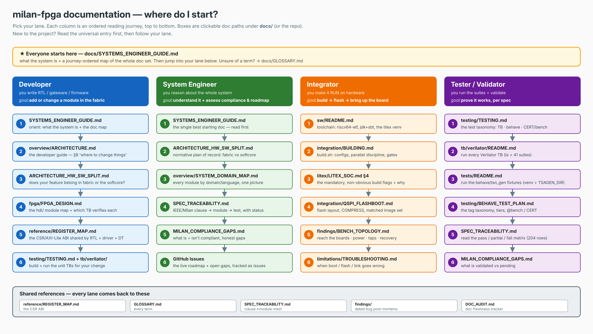
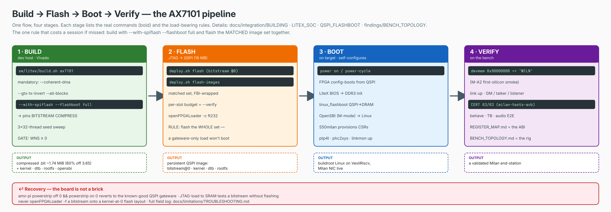

# Documentation index

Documentation for the Milan TSN FPGA network interface (and its evolution
toward a 4-port AVB switch). The tree is organized by purpose - every
directory below is a bucket with one job. Unsure what a term means? →
[GLOSSARY.md](GLOSSARY.md).

```
docs/
├─ overview/      what the system is (start here)
├─ integration/   make it work in YOUR SoC / on YOUR board (incl. non-Vivado)
├─ litex/         the LiteX softcore host in depth
├─ fpga/          the gateware: every module, DMA/BD design docs, telemetry
├─ testing/       every verification layer + how to run it
├─ limitations/   known issues, limitations, hazards, troubleshooting
├─ reference/     contracts: register ABI, FR/NFR, Milan v1.2 matrix
└─ findings/      dated bug post-mortems + perf-campaign logs (indexed)
```

## ⭐ New here? Start with the guide, then pick your lane

**Everyone starts here → [SYSTEMS_ENGINEER_GUIDE.md](SYSTEMS_ENGINEER_GUIDE.md)** — what the
system is, plus a journey-ordered map of the whole doc set. Then follow the lane below that
matches what you're here to do. Unsure of a term? → [GLOSSARY.md](GLOSSARY.md).



> The picture above is generated (editable [DOC_MAP.drawio](DOC_MAP.drawio); regenerate with
> `python3 docs/DOC_MAP.gen.py docs/DOC_MAP && rsvg-convert -w 2400 docs/DOC_MAP.svg -o docs/DOC_MAP.png`).

### 👩‍💻 Developer — *you write RTL / gateware / firmware*
Goal: add or change a module in the fabric.
1. [SYSTEMS_ENGINEER_GUIDE.md](SYSTEMS_ENGINEER_GUIDE.md) — orient.
2. [overview/ARCHITECTURE.md](overview/ARCHITECTURE.md) — the developer guide; **§8 "where to change things"**.
3. [ARCHITECTURE_HW_SW_SPLIT.md](ARCHITECTURE_HW_SW_SPLIT.md) — fabric vs softcore (decide where your feature belongs).
4. [fpga/FPGA_DESIGN.md](fpga/FPGA_DESIGN.md) — the `hdl/` module map + which TB verifies each (`ls hdl/` is authoritative).
5. [reference/REGISTER_MAP.md](reference/REGISTER_MAP.md) — the CSR/AXI-Lite ABI shared by RTL ⇄ driver ⇄ DT.
6. [testing/TESTING.md](testing/TESTING.md) + [../tb/verilator/README.md](../tb/verilator/README.md) — a DUT change ships its harness in the same commit.

### 🧭 System Engineer — *you reason about the whole system*
Goal: understand it + assess compliance & roadmap.
1. [SYSTEMS_ENGINEER_GUIDE.md](SYSTEMS_ENGINEER_GUIDE.md) — the single best starting doc.
2. [ARCHITECTURE_HW_SW_SPLIT.md](ARCHITECTURE_HW_SW_SPLIT.md) — **normative** plan of record: fabric vs softcore (wins where overview docs conflict).
3. [overview/SYSTEM_DOMAIN_MAP.md](overview/SYSTEM_DOMAIN_MAP.md) — every module by domain/language, one picture.
4. [SPEC_TRACEABILITY.md](SPEC_TRACEABILITY.md) — IEEE/Milan clause → module → test, with status (204 rows).
5. [MILAN_COMPLIANCE_GAPS.md](MILAN_COMPLIANCE_GAPS.md) — what is + isn't compliant, honest gaps.
6. **GitHub Issues** — the current roadmap + open gaps are tracked as issues (not FULL_FPGA_SOLUTION §9).

### 🔧 Integrator — *you make it RUN on hardware*
Goal: build → flash → bring up the board. → **[the pipeline at a glance](BUILD_FLASH_BOOT.png)**.
1. [../sw/README.md](../sw/README.md) — toolchain (riscv64-elf, jdk+sbt, the LiteX venv) + `git submodule update --init third_party/verilog-axis`.
2. [integration/BUILDING.md](integration/BUILDING.md) — `build.sh` configs, the 3×32-thread discipline, WNS gate.
3. [litex/LITEX_SOC.md](litex/LITEX_SOC.md) §4 — the mandatory, non-obvious flags (`--coherent-dma`, `--gtx-tx-invert`, `--with-spiflash --flashboot full`) and why.
4. [integration/QSPI_FLASHBOOT.md](integration/QSPI_FLASHBOOT.md) — flash layout, `COMPRESS`, **flash a matched image set** (a gateware-only load won't boot).
5. [findings/BENCH_TOPOLOGY.md](findings/BENCH_TOPOLOGY.md) — reach the boards, power, taps, recovery (`amx-pi powerstrip off/on 0`).
6. [limitations/TROUBLESHOOTING.md](limitations/TROUBLESHOOTING.md) — when boot / flash / link goes wrong.

### 🧪 Tester / Validator — *you run the suites + validate*
Goal: prove it works, per spec.
1. [testing/TESTING.md](testing/TESTING.md) — the test taxonomy (Verilator TB · behave · CERT/bench).
2. [../tb/verilator/README.md](../tb/verilator/README.md) — run every Verilator TB; `ls tb/verilator/` = ~41 suites (the count wins over any prose).
3. [../tests/README.md](../tests/README.md) — run the behave/tsn_gen fixtures: `~/litex-milan/venv/bin/behave tests` (needs `TSAGEN_DIR`).
4. [testing/BEHAVE_TEST_PLAN.md](testing/BEHAVE_TEST_PLAN.md) — the tag taxonomy, tiers, the `@bench`/CERT tier (CERT suites live in the sibling **milan-tests-avb** repo).
5. [SPEC_TRACEABILITY.md](SPEC_TRACEABILITY.md) — read the pass/partial/fail matrix (✅ verified · 🟡 partial · ❌ missing · ➖ N/A).
6. [MILAN_COMPLIANCE_GAPS.md](MILAN_COMPLIANCE_GAPS.md) — what is validated vs pending.

## Quick task jumps

| If you want to… | read, in order |
|---|---|
| **Understand the system** (new contributor) | [overview/FULL_FPGA_SOLUTION](overview/FULL_FPGA_SOLUTION.md) → [overview/ARCHITECTURE](overview/ARCHITECTURE.md) → [ARCHITECTURE_HW_SW_SPLIT](ARCHITECTURE_HW_SW_SPLIT.md) (normative HW/SW plan-of-record) → [overview/SYSTEM_DOMAIN_MAP](overview/SYSTEM_DOMAIN_MAP.md) → [GLOSSARY](GLOSSARY.md) |
| **Integrate the datapath into your own SoC** | [integration/INTEGRATION_GUIDE](integration/INTEGRATION_GUIDE.md) → [reference/REGISTER_MAP](reference/REGISTER_MAP.md) → [fpga/FPGA_DESIGN](fpga/FPGA_DESIGN.md) |
| **Build it without Vivado / port to another board** | [integration/PORTING_GUIDE](integration/PORTING_GUIDE.md) → [integration/OPEN_SOURCE_MIGRATION](integration/OPEN_SOURCE_MIGRATION.md) → [integration/BOARD_PORTING_AX7101](integration/BOARD_PORTING_AX7101.md) (worked example) |
| **Build / boot / operate the AX7101 board** | [litex/LITEX_SOC](litex/LITEX_SOC.md) → [integration/QSPI_FLASHBOOT](integration/QSPI_FLASHBOOT.md) → [limitations/TROUBLESHOOTING](limitations/TROUBLESHOOTING.md) |
| **Run the tests** | [testing/TESTING.md](testing/TESTING.md) (the map) → [../tb/verilator/README.md](../tb/verilator/README.md) (suite detail) |
| **Know what does NOT work** | [limitations/KNOWN_ISSUES_AND_LIMITATIONS](limitations/KNOWN_ISSUES_AND_LIMITATIONS.md) |
| **See where the project is heading** | [overview/AVB_SWITCH_DIRECTION](overview/AVB_SWITCH_DIRECTION.md) → [integration/FULLY_FPGA_RISCV_MIGRATION](integration/FULLY_FPGA_RISCV_MIGRATION.md) |
| **Debug a datapath problem** | [fpga/pipeline-telemetry](fpga/pipeline-telemetry.md) → [findings/](findings/README.md) (how every past bug was cornered) → [testing/SIMULATION](testing/SIMULATION.md) |
| **Write driver / DT / register code** | [reference/REGISTER_MAP](reference/REGISTER_MAP.md) → [`../sw/driver/README.md`](../sw/driver/README.md) + [`../sw/dts/README.md`](../sw/dts/README.md) |

## 1 - overview/ (what the system is)

| Document | Purpose |
|----------|---------|
| [FULL_FPGA_SOLUTION.md](overview/FULL_FPGA_SOLUTION.md) | **The master guide to the fully-FPGA solution** - high/medium-level architecture, the three datapath boundaries, build/run, roadmap. **Read first.** |
| [ARCHITECTURE.md](overview/ARCHITECTURE.md) | System map: datapath, control plane, clock domains, HDL↔software mapping, where to change things - fully-FPGA primary, Zynq legacy appendix. |
| [ARCHITECTURE_HW_SW_SPLIT.md](ARCHITECTURE_HW_SW_SPLIT.md) | **Normative HW/SW plan-of-record (rev 2)**: what runs in fabric vs the softcore (lwSRP/AAF/MAAP/ADP/AECP/ACMP all in fabric, silicon-validated; the softcore does linuxptp + PCM ring + provisioning). |
| [SYSTEM_DOMAIN_MAP.md](overview/SYSTEM_DOMAIN_MAP.md) | Which module lives in which domain/language (userspace → kernel → firmware → LiteX → RTL → vendored IP → silicon). Diagram: [SYSTEM_DOMAIN_MAP.svg](SYSTEM_DOMAIN_MAP.svg). |
| [AVB_SWITCH_DIRECTION.md](overview/AVB_SWITCH_DIRECTION.md) | The direction: endpoint → 4-port AVB switch (decision matrix + scoreboard). Diagram: [AVB_SWITCH_DIRECTION.svg](AVB_SWITCH_DIRECTION.svg). |
| [GLOSSARY.md](GLOSSARY.md) | Every term of art in one place. |

## 2 - integration/ (your SoC, your board, your toolchain)

**The build → flash → boot → verify pipeline in one picture** (the flow otherwise spread
across BUILDING / LITEX_SOC / QSPI_FLASHBOOT / BENCH_TOPOLOGY). Editable
[BUILD_FLASH_BOOT.drawio](BUILD_FLASH_BOOT.drawio).




| Document | Purpose |
|----------|---------|
| [INTEGRATION_GUIDE.md](integration/INTEGRATION_GUIDE.md) | **The `milan_datapath` boundary as a contract**: port-by-port tables, minimum-viable attach (M-A2), source list, software contract. |
| [PORTING_GUIDE.md](integration/PORTING_GUIDE.md) | **Vendor-neutral porting**: building without Vivado / off-Xilinx - what is portable (audited), per-vendor translation tables, constraint rules, the Yosys/ECP5 proof, two porting routes. |
| [BOARD_PORTING_AX7101.md](integration/BOARD_PORTING_AX7101.md) | The worked board port: pin extraction, DDR3/LiteDRAM, verification. |
| [BUILDING.md](integration/BUILDING.md) | **Building + flashing bitstreams in the two-board lab** (`build.sh`): named configs (ax7101/arty), parallel launch discipline, the `flash` subcommand per-board QSPI policy interlocks, gates. |
| [QSPI_FLASHBOOT.md](integration/QSPI_FLASHBOOT.md) | Boot Linux from QSPI flash (zero-upload achieved 2026-07-06); flash layout + `deploy.sh flash-images`. |
| [OPEN_SOURCE_MIGRATION.md](integration/OPEN_SOURCE_MIGRATION.md) | How the RTL became vendor-neutral (XPM → Forencich cores + in-repo CDC); the de-Xilinx track record. |
| [FULLY_FPGA_RISCV_MIGRATION.md](integration/FULLY_FPGA_RISCV_MIGRATION.md) | The step-numbered Zynq→softcore migration plan (now largely as-built - see its status banner). |
| [AXIS_CORES_ON_NAXRISCV.md](integration/AXIS_CORES_ON_NAXRISCV.md) | The general pattern: attaching AXI-Stream cores to a LiteX softcore (control/data/event planes). |
| [`../THIRD_PARTY.md`](../THIRD_PARTY.md) | Vendored third-party code, pins and licenses. |

## 3 - litex/ (the softcore host)

| Document | Purpose |
|----------|---------|
| [LITEX_SOC.md](litex/LITEX_SOC.md) | **`sw/litex/` in depth**: `milan_soc.py` anatomy (CRG, datapath attach, ring-DMA, MAC, flash-boot), the VexiiRiscv/NaxRiscv choice, the mandatory flags, patches, version pins, sims and tools. |

Plus the in-tree quickrefs: [`../sw/README.md`](../sw/README.md) (build/boot
walkthrough), [`../sw/litex/patches/README.md`](../sw/litex/patches/README.md),
[`../sw/dts/README.md`](../sw/dts/README.md), [`../sw/driver/README.md`](../sw/driver/README.md).

## 4 - fpga/ (the gateware)

| Document | Purpose |
|----------|---------|
| [FPGA_DESIGN.md](fpga/FPGA_DESIGN.md) | **Every module in `hdl/`**: purpose, interfaces, clock domain, verifying harness, doc link; the wrappers; the full CDC inventory. |
| [PIPELINE_STAGES.md](fpga/PIPELINE_STAGES.md) | Canonical stage-by-stage pipeline prose (datapath + DMA/BD engines as running on silicon). |
| [pipeline-telemetry.md](fpga/pipeline-telemetry.md) | The `milan_tlm` in-fabric observability block: per-stage counters, Little's-law occupancy, sysfs/BIOS access. |
| [CPPI_DMA_REDESIGN.md](fpga/CPPI_DMA_REDESIGN.md) | The DMA/MAC memory-architecture plan + the dated silicon addenda (BD zero-copy, TX-BD v1/v2/v2b, the 2026-07-07 campaign). |
| [HW_GRO_RSC.md](fpga/HW_GRO_RSC.md) | HW-GRO/RSC receive coalescing in the RX BD engine (phases A+B sim-verified). |
| [HEADER_SPLIT_DESIGN.md](fpga/HEADER_SPLIT_DESIGN.md) / [HSPLIT14_DESIGN.md](fpga/HSPLIT14_DESIGN.md) | Header-split zero-copy RX design + per-page cut-through delivery. |
| [LSU_NONBLOCKING_DCACHE.md](fpga/LSU_NONBLOCKING_DCACHE.md) | VexiiRiscv non-blocking D$ / refill mechanics reference. |
| Per-module TerosHDL pages | `hdl/**/doc/*.md`, linked from [FPGA_DESIGN.md](fpga/FPGA_DESIGN.md) §2; regenerate with the TerosHDL documenter (`//!` comments are the source). |

## 5 - testing/

| Document | Purpose |
|----------|---------|
| [TESTING.md](testing/TESTING.md) | **The map of all six verification layers** + exact commands + known gaps. Start here. |
| [RUNNING_TESTS.md](testing/RUNNING_TESTS.md) | The all-layers walkthrough (elaboration smoke test → Migen sims → harnesses → board). |
| [SIMULATION.md](testing/SIMULATION.md) | The three simulation layers in detail (RTL harnesses, softcore boot, softcore+NIC M-A2). |
| [PROTOCOL_VALIDATION_MATRIX.md](testing/PROTOCOL_VALIDATION_MATRIX.md) | Every protocol × where implemented × the test that validates it. |
| [`../tb/verilator/README.md`](../tb/verilator/README.md) | The self-checking harnesses (~41 dirs; `ls tb/verilator/` is authoritative), suite by suite. |
| [`../syn/yosys/README.md`](../syn/yosys/README.md) | The device-portability check (~39 tops; generic + ECP5). |

## 6 - limitations/ (make the problems apparent)

| Document | Purpose |
|----------|---------|
| [KNOWN_ISSUES_AND_LIMITATIONS.md](limitations/KNOWN_ISSUES_AND_LIMITATIONS.md) | **The single page of everything that does not work, is not built, or bites**: scope limits, reproducibility gaps, timing constraints, lethal gateware⇄driver pairings, refuted perf levers, where the real numbers live. |
| [TROUBLESHOOTING.md](limitations/TROUBLESHOOTING.md) | Field log of every bring-up problem: symptom → cause → fix (17 sections). |

## 7 - reference/ (contracts)

| Document | Purpose |
|----------|---------|
| [REGISTER_MAP.md](reference/REGISTER_MAP.md) | The AXI4-Lite CSR ABI (groups 0x000-0x700) + the ring-DMA CSR windows - the HDL/driver/DT contract, asserted by the `csr` harness. |
| [FR_NFR.md](reference/FR_NFR.md) | Functional / non-functional requirement register (FR-*/NFR-*). |
| [MILAN_V12_DEPENDENCY_MATRIX.md](reference/MILAN_V12_DEPENDENCY_MATRIX.md) | Milan v1.2 → FR/NFR dependency matrix with verification traceability. |
| [`../REQUIREMENTS.md`](../REQUIREMENTS.md) | Normative requirements + the 802.1 gap analysis (REQ-*; partly Zynq-era). |
| [`../TODO.md`](../TODO.md) | Phased, dependency-ordered task list with status. |
| [`../aem-and-aecp.md`](../aem-and-aecp.md) | AVDECC entity-model / AECP design notes (pairs with [`../avdecc/README.md`](../avdecc/README.md)). |

## 8 - findings/ (the engineering record)

**[findings/README.md](findings/README.md)** indexes every dated post-mortem
and campaign log - the CBS bugs, the TX saga, the ring-DMA rework, the RX
wedges, the latency investigation, the >500 Mbit/s campaign, the session
handoffs. The per-lever measured ledger is [`../CHANGELOG.md`](../CHANGELOG.md)
(chart: [perf_campaign.svg](perf_campaign.svg)).

> Current performance numbers live in [`../CHANGELOG.md`](../CHANGELOG.md) and
> [findings/](README.md); numbers quoted anywhere else are dated snapshots (why:
> [limitations/KNOWN_ISSUES_AND_LIMITATIONS.md](limitations/KNOWN_ISSUES_AND_LIMITATIONS.md) §6).

## Conventions

* **RTL:** SystemVerilog, `` `default_nettype none ``, TerosHDL/Doxygen `//!`
  documentation comments on every generic, port and signal; named `always_*`
  processes with a preceding `//!` description.
* **Register maps:** offsets and reset values are defined once in the RTL and
  documented in [reference/REGISTER_MAP.md](reference/REGISTER_MAP.md); the CSR
  harness asserts they agree.
* **Verification:** every DUT change ships with its harness update in the same
  commit.
* **Diagrams:** every `*.svg`/`*.png`/`*.drawio` in this directory is
  generated - edit the sibling `*.gen.py`, never the outputs.
* **Counts:** suite/top counts in prose go stale; the directory listing and
  `run.sh` are authoritative.
* Board-recipe skills for the sibling test rig live out-of-repo in the
  `milan-tests-avb` repo (`fpga/skills/milan-fpga-nic/SKILL.md` there).
