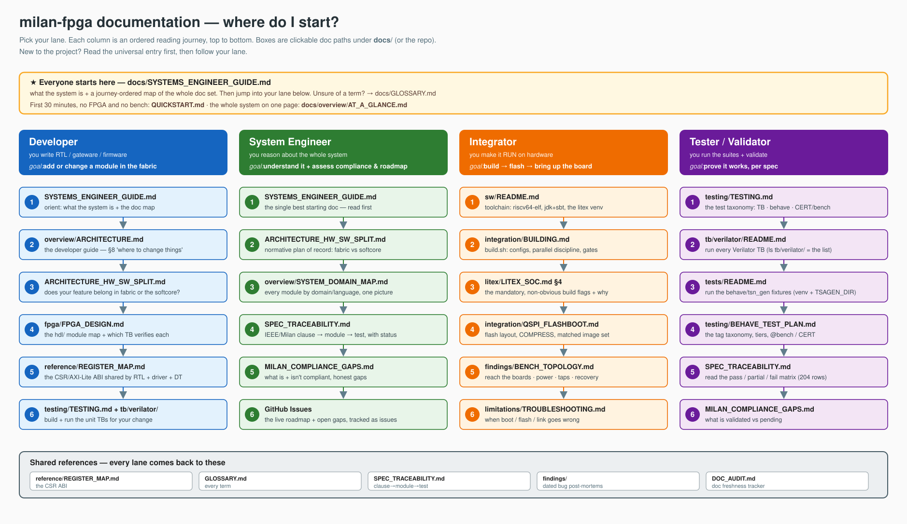
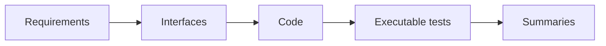

# Documentation index

Choose one role.

Follow its ordered guide.

## Contents

- **[Choose a role](#choose-a-role)** — Start with personal responsibilities.
- **[Trusted authorities](#trusted-authorities)** — Resolve conflicting information safely.
- **[Architecture and integration](#architecture-and-integration)** — Understand product boundaries.
- **[Verification](#verification)** — Find executable evidence.
- **[Operations](#operations)** — Build, deploy, and recover.
- **[Current status](#current-status)** — Judge present readiness.
- **[History](#history)** — Find obsolete documentation safely.

## Choose a role

| Role | Start here | Primary outcome |
|---|---|---|
| Implementation developer | [Implementation guide](guides/IMPLEMENTATION_DEVELOPER.md) | Safe product changes |
| Verification developer | [Verification guide](guides/VERIFICATION_DEVELOPER.md) | Defect-detecting evidence |
| System integrator | [Integration guide](guides/SYSTEM_INTEGRATOR.md) | Correct boundary wiring |
| Project manager | [Management guide](guides/PROJECT_MANAGER.md) | Evidence-based decisions |

These developer roles remain intentionally separate.

Code providers own implementation behavior.

Test providers own independent verification evidence.

## Trusted authorities

Use this authority order.

```mermaid
flowchart LR
    R[Requirements] --> I[Interfaces]
    I --> C[Code]
    C --> T[Executable tests]
    T --> S[Summaries]
```

- [`REQUIREMENTS.md`](../REQUIREMENTS.md) defines normative behavior.
- [`CONTRIBUTING.md`](../CONTRIBUTING.md) defines engineering gates.
- [Architecture](overview/ARCHITECTURE.md) defines current boundaries.
- [Feature status](reference/MILAN_FEATURE_STATUS.md) records canonical status.
- Executable tests provide reproducible evidence.
- Summaries never override normative requirements.

Publish conflicts before continuing.

## Architecture and integration

| Need | Current document |
|---|---|
| Understand the system | [Architecture](overview/ARCHITECTURE.md) |
| Locate every domain | [System domain map](overview/SYSTEM_DOMAIN_MAP.md) |
| Understand imported ownership | [Submodule boundaries](reference/SUBMODULES.md) |
| Locate RTL modules | [FPGA design](fpga/FPGA_DESIGN.md) |
| Follow datapath stages | [Dataplane walkthrough](fpga/DATAPLANE_WALKTHROUGH.md) |
| Integrate the datapath | [Integration contract](integration/INTEGRATION_GUIDE.md) |
| Port vendor dependencies | [Porting guide](integration/PORTING_GUIDE.md) |
| Implement software registers | [Register map](reference/REGISTER_MAP.md) |
| Integrate the reference SoC | [LiteX SoC](litex/LITEX_SOC.md) |
| Understand fabric time | [Fabric gPTP plane](design/GPTP_PLANE.md) |
| Handle grandmaster loss | [Grandmaster recovery](design/GM_LOSS_RECOVERY.md) |

## Verification

| Need | Current document |
|---|---|
| Choose verification layers | [Testing guide](testing/TESTING.md) |
| Run complete gates | [Running tests](testing/RUNNING_TESTS.md) |
| Understand CI scheduling | [CI workflow policy](testing/CI_WORKFLOWS.md) |
| Run RTL harnesses | [Verilator suites](../tb/verilator/README.md) |
| Run behavior tests | [Behavior tests](../tests/README.md) |
| Understand simulation boundaries | [Simulation guide](testing/SIMULATION.md) |
| Trace modules into tests | [Generated module matrix](traceability/MODULE_MATRIX.md) |
| Check the per-clause compliance position | [Compliance matrix](reference/MILAN_COMPLIANCE_MATRIX.md) |
| Review documentation health | [Documentation audit](DOCUMENTATION_AUDIT.md) |

Avoid copied test counts.

Suite inventories change frequently.

## Operations

| Need | Current document |
|---|---|
| Start without hardware | [Quickstart](../QUICKSTART.md) |
| Build artifacts | [Building guide](integration/BUILDING.md) |
| Flash matched images | [QSPI flash boot](integration/QSPI_FLASHBOOT.md) |
| Diagnose failures | [Troubleshooting](limitations/TROUBLESHOOTING.md) |
| Plan verification | [Testing guide](testing/TESTING.md) |
| Find measured changes | [Current changelog](../CHANGELOG.md) |

Board measurements remain dated evidence.

They never become universal guarantees.

## Current status

The implementation remains Milan-oriented.

It is not fully Milan-compliant.

- Read the [dated Milan audit](testing/MILAN_V12_AUDIT_2026-08-16.md).
- Read the [Milan roadmap](MILAN_V12_ROADMAP.md).
- Read the [compliance matrix](reference/MILAN_COMPLIANCE_MATRIX.md).
- Read the [requirements register](reference/FR_NFR.md).
- Review open Issues before planning delivery.

## History

Obsolete documentation lives under versioned history.

- Use the [historical v1 index](history/v1/README.md).
- Historical pages never define current behavior.
- Every historical page names its successor.
- Git preserves detailed evolution.

## Documentation rules

- Prefer diagrams for structural relationships.
- Prefer bullets for independent facts.
- Keep current paragraphs small.
- Keep current sentences under eleven words.
- Edit diagram masters first.
- Regenerate every committed render.
- Inspect diagrams before publishing.
- Use [generation commands](DOC_GENERATION.md).
