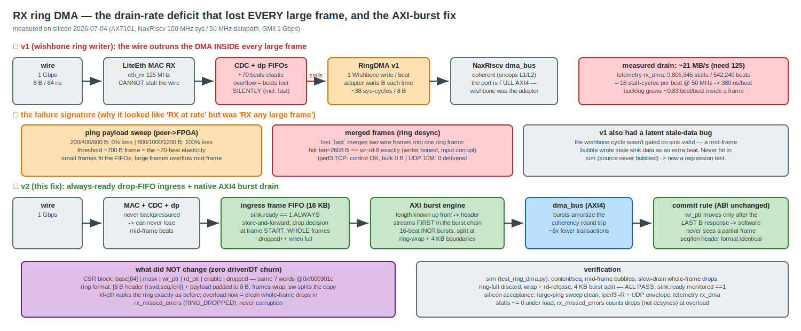
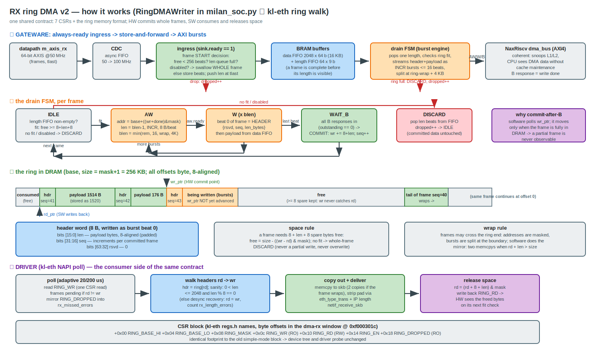

# RX ring DMA — root cause of the large-frame RX loss + the AXI-burst fix

*2026-07-04, all numbers measured on silicon (AX7101, NaxRiscv 100 MHz sys / 50 MHz
datapath, GMII 1 Gbps, peer = i210). Companion picture: `RX_RING_DMA.svg` (source:
`RX_RING_DMA.gen.py`).*

## TL;DR

RX never worked for **any frame larger than ~700 bytes**, at **any** rate — it was
mis-filed as an "RX at high rate" problem because everything that proved RX (pings,
loopback, byte-exactness checks) used small frames. Two independent causes, one
measurement chain:

1. **Drain-rate deficit (the big one).** The RX DMA writer issued one classic-Wishbone
   write per 8-byte beat. Each write pays the full coherent-bus round trip — the LiteX
   `Wishbone2AXI` adapter waits for the AXI `B` response every beat — measured at
   **~38 sys-cycles per beat** (telemetry `rx_dma`: 9,805,345 stalls / 542,240 beats =
   18 stall-cycles/beat @ 50 MHz). That is ~21 MB/s of sustained drain against a wire
   that delivers 8 B / 64 ns = 125 MB/s. Inside every frame the backlog grows by
   ~0.83 beats per beat received; the RX elasticity upstream (LiteEth RX CDC + datapath
   FIFOs) is only ~70 beats, so **every frame longer than ~700 B overflowed those FIFOs
   mid-frame**. The GMII side cannot stall the wire, so the overflow **silently loses
   beats — including `last`** — and two wire frames merge into one ring "frame"
   (observed: ring desync with header len=2608 B, exactly `wr-rd-8`, i.e. the ring
   writer honestly committed the merged garbage it was fed).
2. **A latent stale-data bug in the v1 writer.** The Wishbone cycle wasn't gated on
   `sink.valid`, so a mid-frame bubble wrote stale `sink.data` as an extra beat. The
   original sim never bubbled mid-frame, so it passed. (Now a permanent regression in
   `test_ring_dma.py`.)

### The measurement chain (how to pin this class of bug fast)

| step | result | conclusion |
|---|---|---|
| `iperf3` peer→FPGA TCP | control channel OK, bulk 0 bytes | small frames pass, large die |
| UDP 10 Mbit/s | 0 datagrams delivered | NOT a rate problem |
| ping payload sweep | 600 B: 0 % loss, 800 B: 100 % loss | hard size threshold ≈ elasticity |
| telemetry `rx_dma` stalls/beats | 18 stall-cycles/beat | drain 380 ns/beat = 21 MB/s |
| ring desync header | len == `wr-rd-8` | writer honest ⇒ input already merged |

## How it works (v2 mechanism, end to end)

*(source: `RX_RING_OPERATION.gen.py`, editable `RX_RING_OPERATION.drawio`)* — gateware
ingress/drain, the drain FSM, the ring memory format with both pointers, and the kl-eth
consumer walk, all on one page.

## The fix — `RingDMAWriter` v2 (`sw/litex/milan_soc.py`)

Two structural changes, driver ABI untouched:

* **Always-ready ingress.** A 16 KB store-and-forward frame FIFO whose `sink.ready`
  is constant 1. Upstream (LiteEth CDC, datapath) is *never* backpressured, so
  mid-frame beat loss is impossible **by construction**. When the FIFO can't hold a
  max frame (or the length queue is full), the drop decision is taken at frame START
  and the WHOLE frame is swallowed, `dropped`++ — overload degrades to counted,
  clean whole-frame drops.
* **Native AXI4 burst drain.** The NaxRiscv coherent `dma_bus` is full AXI4 (the
  Wishbone adapter was the bottleneck, not the CPU). The writer is now a native AXI
  master: because the frame is buffered first, its length is known up front, so the
  8-byte ring header `{rsvd, seq, len}` streams FIRST, followed by the payload, in
  16-beat INCR bursts split at the ring-wrap and 4 KB boundaries. `wr_ptr` (the
  commit signal software polls) advances only after the LAST `B` response of the
  frame — software still never observes a partial frame. Bursts amortize the
  coherency round trip ~6-16×, comfortably above wire rate.

**Unchanged:** the 7-word CSR block (`base[64] | mask | wr_ptr | rd_ptr | enable |
dropped`) at the same addresses (`0xf000301c..0x34`), the ring memory format, the DT,
and the kl-eth driver. Ring overload shows up as `rx_missed_errors`, never corruption.

## Verification

* **Sim** — `sw/litex/test_ring_dma.py` (Migen, behavioral AXI slave with stalls +
  protocol checks): content/seq/wr_ptr math, **mid-frame bubbles** (regression for the
  v1 stale-data bug), **slow-drain whole-frame drops** (survivors intact, seq
  contiguous), ring-full discard, wrap + rd-release, 4 KB burst split, and a monitor
  asserting `sink.ready == 1` on every cycle. ALL PASS.
* **Silicon acceptance — PASSED 2026-07-04 (build_ring2, timing met WNS +0.013):**
  * ping payload sweep 200→1472 B from the peer: **0 % loss at every size** (v1: 100 %
    loss from 800 B up).
  * `iperf3` peer→FPGA TCP: **58.4 Mbit/s delivered** (v1: 0 bytes). This is the
    100 MHz-RV64 CPU ceiling (soft checksums + copies), not the NIC.
  * UDP envelope 100M→940M offered: app-level delivery is CPU/socket-bound as
    expected, and the loss is **clean**: `dmesg` desyncs = 0, UDP `InCsumErrors` = 0,
    `rx_errors` = 0, `rx_length_errors` = 0; `rx_missed_errors` = 660,221 = the exact
    HW whole-frame drop count (ring full while the CPU lags), 228,269 frames delivered
    intact. (Datagram-vs-frame math: iperf3 sent ~2.8 KB datagrams = 2 IP fragments
    each, so ~888 k wire frames total — matching `rx_wire` exactly.)
  * telemetry after the blast: `rx_core = rx_dp = rx_dma = rx_wire = 888,490` frames,
    166,272,938 beats, **stalls = 0 at every RX stage** (v1: 18 stall-cycles/beat).
    The always-ready ingress never backpressured the fabric once. RX datapath latency
    551 → **8 cycles**.
  * Net: the wire→DRAM ingest path now runs at line rate with graceful, counted
    whole-frame overload behavior; the remaining delivered-throughput ceiling is the
    single 100 MHz CPU (see FULLY_FPGA_RISCV_MIGRATION.md for the RV64GC/SMP paths).

## Related

* `docs/kl-eth-tx-debug.md` — the TX-side saga (coherent-dma, cut-through starvation,
  skb alignment, IOB/gtx-invert). The RX drain deficit is the same *family* of bug as
  TX starvation (stream vs memory-bus rate mismatch), on the opposite direction.
* `docs/pipeline-telemetry.md` — the stage counters used for the smoking-gun
  measurement here (`rx_dma` stalls/beats).
* Remaining known ceiling: the **TX** DMA reader still does per-beat Wishbone reads
  (~21 MB/s sustained ≈ 170 Mbit/s wire ceiling, hidden behind the 4 KB PacketFIFO for
  now; CPU-bound TCP is far below it anyway). Same AXI-burst treatment applies if TX
  throughput ever becomes the limit (M-A6, descriptor rings).
