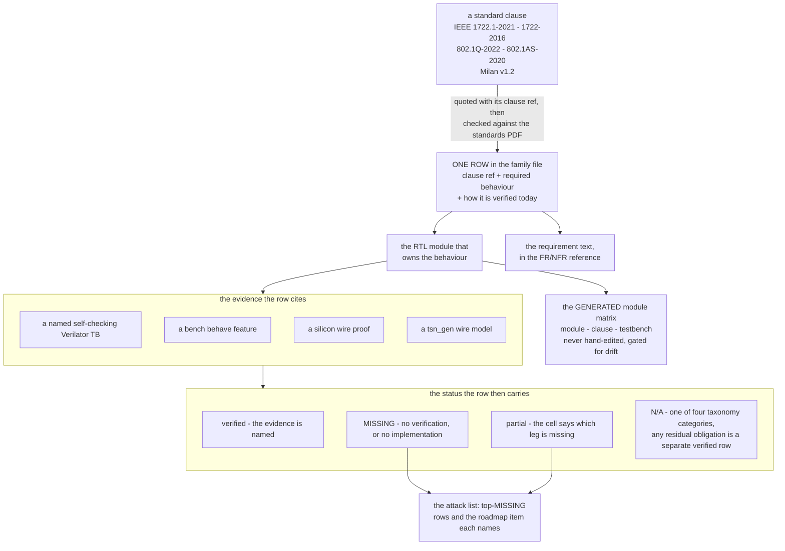

[OBSOLETE + 2026-08-16]

# Spec ↔ test traceability matrix

> ## STATUS 2026-08-13 — the control plane changed hands, and the tallies below predate it
>
> This repository's own **ADP advertiser, AECP/AEM engine, ACMP talker and
> listener, and lwSRP applicant are DELETED** — no parameter, no fallback, no
> shadow arm (USER, explicit and repeated: *"remove the old code AECP/ACMP/ADP
> the lwSRP shall be removed as well. Only use the uCPU code"*). The replacement
> is the **protocol processor**: `hdl/milan/KL_pp_shadow.sv`, instantiated
> unconditionally by `hdl/milan/milan_datapath.sv`, owning **ADP, ACMP (talker
> and listener) and SRP**, with MAAP staying in this fabric (`KL_maap`, bridged
> by `hdl/milan/KL_pp_maap_shim.sv`).
>
> **The processor's AECP uCPU HAS landed**, so this entity DISCOVERS over ADP,
> CONNECTS over ACMP, RESERVES over SRP, and is **reachable on AECP**: it
> answers `READ_DESCRIPTOR` (0x0004) with all three status paths — `SUCCESS`
> carrying `configuration_index` + reserved + descriptor, `NO_SUCH_DESCRIPTOR`
> on a locate miss, `BAD_ARGUMENTS` on a bad configuration index, both errors
> carrying the IEEE 1722.1 §7.4.5 4-byte `{descriptor_type, descriptor_index}`
> stub — answers `IDENTIFY_NOTIFICATION`-as-command with `BAD_ARGUMENTS`
> (§7.4.39.2 beats §9.3.5.3.3), silently refuses a foreign `target_entity_id`
> and any AECP *response* arriving as input, and answers **every other opcode and
> message type with a conformant `NOT_IMPLEMENTED` echo** (`message_type` + 1,
> correct length, correct `controller_data_length`, `controller_entity_id` and
> `sequence_id` verbatim). Three consequences for this page:
>
> 1. **An echo is not coverage.** Every AECP/AEM row whose subject is what a
>    command DOES — GET_COUNTERS, the Table 5.22 push, SET_CLOCK_SOURCE,
>    SET_MAX_TRANSIT_TIME, the audio-map setters, GET_DYNAMIC_INFO,
>    GET_MILAN_INFO and the whole MVU family, ACQUIRE/LOCK, SET/GET_NAME,
>    SET/GET_SAMPLING_RATE, SET/GET_STREAM_FORMAT, SET/GET_STREAM_INFO,
>    SET/GET_CONFIGURATION, GET_AVB_INFO, GET_AS_PATH, IDENTIFY, controller
>    liveness, REGISTER/DEREGISTER_UNSOLICITED_NOTIFICATION,
>    START/STOP_STREAMING — is **NOT IMPLEMENTED**, and reads that way because
>    the function is absent, not because the device is silent. The rows whose
>    subject is the *response contract* are a different matter and are graded on
>    their own terms. 🔴 **Milan Δ7 `ACQUIRE_ENTITY` (`NOT_SUPPORTED`,
>    `owner_id` = 0) is not distinguished from the generic echo**: the
>    microprogram exists in the processor's ucode (`E_ACQ`) and nothing
>    dispatches to it — a wiring gap.
> 2. **`READ_DESCRIPTOR` is implemented and unsupplied.** The store fetches the
>    entity model from main memory at a compile-time base, and **nothing in this
>    repository builds or loads that image** — the generator is the submodule's
>    (`protocol-processor/hdl/aecp/desc/gen_desc_image.py`) and no builder,
>    script or boot step drives it. On a stock build enumeration answers
>    `BAD_ARGUMENTS` — the microprogram range-checks `configuration_index`
>    against `configurations_count` before it locates, and an invalid image
>    reports a count of zero — so `NO_SUCH_DESCRIPTOR` is only reachable against
>    a loaded image. Never write "enumeration works": write "reachable
>    again, once the image is in DRAM, which nothing here does for you yet".
> 3. **The family-file tallies in the table below are pre-substitution figures
>    and are still wrong.** They are left in place rather than guessed at,
>    because the family files are re-graded by their own owners and a
>    hand-adjusted total would be a second, competing claim. Treat every ✅ in the
>    1722.1 AECP sections and the Milan §4 section as stale until its family file
>    says otherwise; the per-file glyph count in that file is the only figure
>    that cannot rot.
>
> The evidence side moved too: the `aecp`, `aempatch`, `acmp`, `acmp_lstn`,
> `persist`, `adp`, `adp_advertise`, `adp_parser`, `lwsrp`, `lwsrp_ctx`,
> `lwsrp_rx`, `lwsrp_tx` and `lwsrp_switchpdu` Verilator suites are deleted, as
> are the `tsn_fuzz` aecp/acmp/adp/legacy campaigns (**only the AAF campaign
> survives**) and ~33 BDD `.feature` files. The surviving control-plane lane is
> `tb/verilator/pp_shadow` plus the datapath suite. **A row citing a deleted
> suite is citing nothing** — `ls tb/verilator/` and `ls tests/features/` are
> authoritative.

**Purpose.** For every implemented module: what SHOULD be tested per the
governing standard clause, how that requirement IS verified today (Verilator
TB / bench behave feature / silicon finding / tsn_gen wire model), or an
explicit **MISSING** / **N/A** verdict. This is roadmap item 3's spec-test
subtask. Every row is meant to be human peer-reviewed and then turned into a
behave feature — clause references are the load-bearing content; they were
verified against the local standards PDFs (`$STANDARDS_DIR`) (pdftotext extraction,
2026-07-22).

Companion documents: [`testing/PROTOCOL_VALIDATION_MATRIX.md`](testing/PROTOCOL_VALIDATION_MATRIX.md)
(protocol → test inventory, status-focused), [`MILAN_COMPLIANCE_GAPS.md`](MILAN_COMPLIANCE_GAPS.md)
(what is still missing, narrative), [`reference/FR_NFR.md`](reference/FR_NFR.md)
(requirement text), [`ENDSTATION_BUILDER.md`](ENDSTATION_BUILDER.md)
(roadmap item 4: clause-anchored builder design decisions + config-schema →
descriptor mapping, same PDF-verification rule as this matrix). This matrix
is the clause-anchored join between them.

**Reference conventions (this matrix and every family file).** RTL, testbench and
document references are clickable relative links, and a reference that names a
line or a span carries the matching line anchor, so following one lands on the
code rather than at the top of the file. **Line anchors are accurate as of each
page's stated snapshot date and drift as the RTL moves** — the file half of a
reference is durable, the line half is perishable. Standards citations (clause
and table numbers) name no repo object and stay plain text.

## Contents

- **[The chain, and which file holds each link](#the-chain-and-which-file-holds-each-link)** -- A flowchart from a standard clause to the status a row carries, and the point it exists to make: no single file holds the whole chain, which is why a row can read closed in one place and be unbacked in another.
- **[Family files](#family-files)** -- The five per-standard tables, their legend, and the warning that matters most on this page: the tallies are **pre-2026-08-13 figures** taken against a tree that still had a fabric AECP/AEM engine, and they overstate coverage — the re-grade is command by command, not family by family. Each family file's own glyph count is the only figure that cannot rot. The HTML comment keeps the earlier re-count history.
- **[Why rows are N/A (taxonomy)](#why-rows-are-na-taxonomy)** -- The defence of every ➖: four categories (wrong role, superseded by Milan, optional-so-only-the-refusal-is-owed, profile exclusion), the rows in each, and where the residual obligation is carried. Category 3 is the one that moved: with the uCPU landed, the owed refusal codes are emitted again — met by construction, not re-verified here — and that is the only place in the corpus where a `NOT_IMPLEMENTED` echo counts as coverage. A reviewer disputing an N/A is told to attack the category, not the row.
- **[Module → family map](#module--family-map)** -- The lookup that goes the other way: given a directory under `hdl/`, which family file's sections govern it. Re-pointed 2026-08-13 — four families that used to name four directories now name one module, and the AECP/AEM row names the submodule's engine rather than nothing.
- **[tsn_gen (wire-test engine) — model inventory and gaps](#tsn_gen-wire-test-engine--model-inventory-and-gaps)** -- Which YAML protocol models exist today versus the eight to author, ranked by value, plus what the surviving AECP yamls now measure against the uCPU (one real descriptor test that needs an image, 22 echo-shape tests) and the note that the repo-side aecp/acmp/adp/legacy fuzz campaigns are deleted with only the AAF one surviving. ACMP is still first, and is now *more* valuable: it is the only wire-level way to keep asserting a control plane that lives in a pinned submodule.
- **[Top MISSING rows (attack-order preview)](#top-missing-rows-attack-order-preview)** -- The AECP surface serves the processor inventory, while the descriptor-image supply chain, Table 5.22 producer and Milan Delta 7 ACQUIRE_ENTITY semantics remain open. Solicited Stream Output counters are closed.
- **[Review workflow](#review-workflow)** -- The intended lifecycle of a row, ending in the rule that matters day to day: when a TB or module changes, the row citing it changes in the same commit.

## The chain, and which file holds each link

*One requirement, followed end to end: which file turns a clause into a row, a
row into a module, and a module into evidence that can flip a status?* No single
file holds the whole chain — that is why a row can look closed in one place and
be unbacked in another.

The generated leg is
[`traceability/MODULE_MATRIX.md`](traceability/MODULE_MATRIX.md) — produced by
[`gen_module_matrix.py`](traceability/gen_module_matrix.py), whose `--check`
mode is a CI no-drift gate. **Never hand-edit it**; it is not restated here.

## Family files

| Family | File | Rows | ✅ verified | 🟡 partial | ❌ MISSING | ➖ N/A |
|--------|------|------|------------|-----------|-----------|--------|
| IEEE 1722.1-2021 (ADP/ACMP/AECP+AEM) | [`traceability/ieee1722_1-2021.md`](traceability/ieee1722_1-2021.md) | 78 | 65 | 3 | 0 | 10 |
| IEEE 1722-2016 (AVTP/AAF/CRF/MAAP) | [`traceability/ieee1722-2016.md`](traceability/ieee1722-2016.md) | 40 | 35 | 2 | 1 | 2 |
| IEEE 802.1Q-2022 (VLAN/CBS/MRP/MSRP/MVRP) | [`traceability/ieee8021q.md`](traceability/ieee8021q.md) | 31 | 24 | 3 | 1 | 3 |
| IEEE 802.1AS-2020 (gPTP HW-assist scope) | [`traceability/ieee8021as.md`](traceability/ieee8021as.md) | 11 | 8 | 1 | 1 | 1 |
| Milan v1.2 profile deltas | [`traceability/milan-v12.md`](traceability/milan-v12.md) | 54 | 41 | 8 | 4 | 1 |
| **Total** | | **214** | **173** | **17** | **7** | **17** |

> **These are PRE-2026-08-13 tallies and they overstate coverage.** They are the
> figures as of the last re-count against a tree that still had an AECP/AEM
> engine, an ADP advertiser, ACMP state machines and an lwSRP applicant in it.
> Since those are deleted, the 1722.1 family's AECP sections (§3a–3c) and the
> Milan family's §4 are being re-graded **command by command**: the descriptor
> rows to *servable, not supplied*, the response-contract and
> optional-refusal rows to the uCPU's conformant answers, and every row about
> what a command DOES to **NOT IMPLEMENTED**. The ADP, ACMP and MRP/SRP sections
> go to **OWNED BY THE PROTOCOL PROCESSOR**. Read each
> family file's own rows, not this roll-up, until the roll-up is regenerated
> from them. Deliberately not restated as a corrected number here: a hand-summed
> total that disagrees with the family files would be worse than an admittedly
> stale one.

<!-- Tally reconciliation 2026-07-23: the Milan family previously read 38✅/9🟡;
     a 1:1 re-count of every row's leading status glyph in milan-v12.md gives
     39✅/8🟡 (§1 11✅/4🟡/1➖, §2 3✅, §3 9✅/1❌, §4 9✅/2🟡/1❌, §5 3✅/1🟡,
     §6 4✅/1🟡/2❌ = 52). No row status changed — it was a summing typo (one ✅
     counted as partial). Grand total ✅ 162→163, 🟡 18→17 accordingly. Downstream
     quotes of "162✅/18🟡" (e.g. HANDOVER roadmap table) are now stale → 163✅/17🟡.
     2026-07-27 clock-validity round: +2 Milan rows (M-DEV-13a 5.3.7.3 streaming
     state, M-DEV-13b Table 5.4 TIMESTAMP_UNCERTAIN) and +2 AVTP rows (AVTP-8t
     talker tu, AVTP-6t talker tv) — all ✅. M-DEV-13 keeps its 🟡 (the silicon
     leg against a real grandmaster change is still owed). 204→208, 163→167.
     2026-07-28 AECP response-contract round: +6 1722.1 rows, all ✅ — CMD-7a
     (7.4.16.2+7.4.5 GET_STREAM_INFO index coverage), CMD-7b (7.4.16.2 /
     Milan 7.3.10 non-success response size), CMD-8a (7.4.17.1/7.4.18.2
     SET/GET_NAME size + frame-vs-cdl), CMD-15a (7.4.40.2 GET_AVB_INFO 20 B
     floor), CMD-17a (7.4.42.2 GET_COUNTERS index coverage + empty valid
     mask), CMD-19a (7.4.44.2 GET_AUDIO_MAP 12 B floor). Every one carries an
     L3/L4 oracle and was calibrated against the Milan-validated reference
     device 3CC0C60102030000 (52 checks / 0 failures on the extended
     hive_compliance.py). The ✅ is the TB+model leg; the SILICON leg is
     explicitly still owed on all six — they need a Vivado rebuild and a
     reflash, which this round did not do. 208→214, 167→173. -->

Legend: **✅** requirement has a specific self-checking verification today
(named TB / BENCH feature / silicon wire proof). **🟡** partially verified —
the cell says exactly which leg is missing. **❌ MISSING** — no verification
(or no implementation where the clause is claimed). **➖ N/A** — clause
deliberately out of scope, with the reason in the row. A ✅ row may still
carry a `tsn_gen NO MODEL` note: the behavior is verified, but not yet
wire-generatable/fuzzable by tsn_gen.

## Why rows are N/A (taxonomy)

**N/A never means "skipped".** It means the clause imposes no positive
obligation on this device in this role/profile — and wherever a residual
obligation remains, that residual is a separate ✅ row. The 17 N/A rows fall
into exactly four categories; a reviewer disputing an N/A should attack the
category claim, not the row in isolation:

| # | Category | Rows | Why no positive obligation | Where the residual obligation lives |
|---|---|---|---|---|
| 1 | Wrong role — controller / bridge | ADP-15, ACMP-11, AECP-7, Q-13 (**4**) | the clause binds ATDECC controllers or 802.1Q bridges; this device is an end-station entity | the counterpart behavior is the bench (Hive, `avdecc_l2`, the reference AVB switch) — what the entity is tested *against* |
| 2 | Superseded by Milan | ACMP-12, ACMP-13 (**2**) | Milan 5.5.3/5.5.4 replaces the 1722.1 8.2.4/8.2.5 state machines wholesale — asserting the base SM would test for behavior that is *wrong* here | M-ACMP-1..8, where the replacement is fully verified |
| 3 | Optional feature — only the refusal is owed | AEM-9, CMD-4, CMD-18, CMD-21, CMD-23 (**5**) | 1722.1 makes these optional | **the residual is MET again, by construction.** The owed refusal is an exact NO_SUCH_DESCRIPTOR / NOT_IMPLEMENTED *status*, and the uCPU emits exactly those: a locate miss inside READ_DESCRIPTOR answers `NO_SUCH_DESCRIPTOR` with the §7.4.5 4-byte stub (AEM-9), and WRITE_DESCRIPTOR / REBOOT / the operation commands / every other AEM opcode draw the conformant `NOT_IMPLEMENTED` echo (CMD-4, -18, -21, -23). **This is the one category where an echo genuinely IS the coverage**, because the clause asks for nothing beyond the code. Two caveats: AEM-9 is only verifiable against a LOADED descriptor image, and against an unloaded or corrupt one its obligation is **contradicted** rather than merely untestable — every read answers `BAD_ARGUMENTS` (the configuration range check precedes the locate, and an invalid image reports `configurations_count` = 0), so the `NO_SUCH_DESCRIPTOR` AEM-9 owes for an absent descriptor type is exactly what does not come back; the two statuses do at least discriminate cleanly — `BAD_ARGUMENTS` everywhere = no image or a corrupt one, `NO_SUCH_DESCRIPTOR` = image loaded and that descriptor genuinely absent. And the old RTL `aecp` negative-read evidence is deleted with no in-repo suite re-asserting it — **met by construction, not re-verified here** |
| 4 | Profile / scope exclusion | AAF-11, CRF-9, MRP-8, Q-14, AS-11, M-DEV-16 (**6**) | the profile restricts the format set (AES3, non-audio CRF); the architecture fulfills the function another way (MMRP → MAAP + TCAM); the feature is outside Milan (Qbv TAS); the medium does not exist on this hardware; or the project recorded an explicit exclusion (redundancy) | ✅ rows AEM-4, M-FMT-1 and M-DEV-16's own note |

4 + 2 + 5 + 6 = the 17 N/A rows in the tally above. The prose behind each
category:

1. **Wrong role — controller/bridge obligations** (ADP-15, ACMP-11, AECP-7,
   Q-13): the clause binds ATDECC controllers or 802.1Q bridges. We are an
   end-station entity; the counterpart behavior is provided by the bench
   (Hive, `avdecc_l2`, the reference AVB switch) — which is what the entity is
   tested *against*, not what it implements.
2. **Superseded by Milan** (ACMP-12, ACMP-13): Milan v1.2 5.5.3/5.5.4
   replaces the 1722.1 8.2.4/8.2.5 state machines wholesale. Asserting the
   base SM literally would test for behavior that is *wrong* on a Milan
   device; these rows redirect to M-ACMP-1..8, where the replacement is
   fully verified.
3. **Optional feature — only the refusal code is owed** (AEM-9, CMD-4,
   CMD-18, CMD-21, CMD-23): 1722.1 makes these optional; the testable
   residual is the exact NO_SUCH_DESCRIPTOR / NOT_IMPLEMENTED status.
   **That residual is MET again**, now that the protocol processor's AECP uCPU
   has landed: the descriptor store's locate miss answers `NO_SUCH_DESCRIPTOR`
   carrying the §7.4.5 4-byte `{descriptor_type, descriptor_index}` stub, and
   every unimplemented AEM opcode draws a conformant `NOT_IMPLEMENTED` echo with
   the correct `message_type` + 1, length and `controller_data_length`. This is
   the **one** place in the corpus where a `NOT_IMPLEMENTED` echo IS the
   coverage — the clause asks for a code and gets the right code — and it must
   not be generalised: everywhere else the same echo refuses a command whose
   function the row is actually about. Grade it *met by construction, not
   re-verified here*: the RTL `aecp` negative-read and unknown-command legs were
   deleted with the engine and no suite in this repository re-asserts them
   against the uCPU, and AEM-9 in particular is only verifiable against a
   **loaded** descriptor image — full stop. Against an unloaded or corrupt one
   its obligation is not merely untestable, it is actively **contradicted**:
   every read answers `BAD_ARGUMENTS`, because the microprogram range-checks
   `configuration_index` against a `configurations_count` the invalid image
   reports as zero *before* it ever locates, so the code AEM-9 owes for an absent
   descriptor type — `NO_SUCH_DESCRIPTOR` — is precisely what does not come back.
   That also makes the two statuses a diagnostic discriminator: `BAD_ARGUMENTS`
   to every read means the image was never loaded or is corrupt, while
   `NO_SUCH_DESCRIPTOR` means the image is loaded and that descriptor is
   genuinely absent from the model. Row-level grading lives in
   [`traceability/ieee1722_1-2021.md`](traceability/ieee1722_1-2021.md).
4. **Profile/scope exclusion** (AAF-11, CRF-9, MRP-8, Q-14, AS-11,
   M-DEV-16): the Milan profile restricts the format/type set (AES3,
   non-audio CRF), the architecture fulfills the function another way
   (MMRP → MAAP + TCAM), the feature is outside Milan (Qbv TAS), the medium
   does not exist on this hardware (802.11/EPON/CSN), or the project
   recorded an explicit exclusion (redundancy — dependency-matrix decision).
   Residuals (e.g. "must not advertise AES3 / a secondary interface") are
   carried by ✅ rows (AEM-4, M-FMT-1, M-DEV-16's note).

## Module → family map

Re-pointed 2026-08-13. Four families used to name a directory that no longer
exists; they all now resolve to one module, and that is the point of the
substitution rather than an accident of it.

| `hdl/` module(s) | Family file section |
|------------------|---------------------|
| `hdl/milan/KL_pp_shadow.sv` — the protocol processor wrapper, this device's **entire** IEEE 1722.1 / SRP control plane | 1722.1 §1 (ADP), §2 (ACMP); 802.1Q §2–3 (MRP/SRP rows); Milan §1–§3 |
| `hdl/milan/KL_pp_maap_shim.sv` (bridges the processor's per-source ALLOC/RELEASE face to the block allocator) | 1722-2016 §4 (MAAP-1..6) |
| `hdl/ieee17221/adp/adp_tx_arbiter.sv` — SURVIVES the plane deletion; it is a generic 2-in-1-out AXIS arbiter used on the data lane too | 1722.1 §1 (the TX-merge rows only) |
| *(the AECP/AEM engine — this repository's is deleted; the replacement is the submodule's `protocol-processor/hdl/aecp/` — `KL_aecp_engine.sv`, `KL_aecp_ucpu.sv`, `KL_aecp_desc_store.sv` — reached through `hdl/milan/KL_pp_shadow.sv`)* | 1722.1 §3a–3c, Milan §4 — `READ_DESCRIPTOR` **served but unsupplied** (no image is built here), the response-contract and optional-refusal rows met by the conformant `NOT_IMPLEMENTED` echo, and **every command-function row NOT IMPLEMENTED** |
| `hdl/ieee1722/` (parsers, rx_monitor, crf_rx/tx, media_nco, mmcm servo) | 1722-2016 §1, §3; Milan §5–6 |
| `hdl/ieee1722/avtp/` (aaf talker, depacketizer, playback, lpf, tone, media_adv, rx-monitor counter contexts) | 1722-2016 §2; Milan §6 |
| `hdl/ieee8021q/ts/` (classifier, class_map, queues, shaping core, CBS, controller) | 802.1Q §1 (Q-1..14) |
| `hdl/ieee8021as/` + the PTP timestamp blocks (counter, ts core/top, csr_sync) | 802.1AS (AS-1..5) |
| `hdl/common/` (tcam, rx_mac_filter, link_guard, ifg gasket, cdc) and `hdl/milan/milan_datapath.sv` | supporting rows inside each family (filtering, link qualification, integration) |

## tsn_gen (wire-test engine) — model inventory and gaps

tsn_gen (the local tsn-gen checkout) generates, fuzzes and decodes wire frames from
YAML protocol models (`protocols/`); packet_gen is the engine the matrix's
"would be verified with tsn_gen" statements refer to.

**Models that exist today:** `application/1722_1/adp/1722_1_adp.yaml`,
23 AECP yamls (`application/1722_1/aecp/`: 20 AEM commands + address access
+ vendor unique + no-payload), `data_link/1722/1722_avtp_common_stream.yaml`,
`data_link/1722/1722_avtp_control.yaml`, `data_link/ethernet/mac_frame.yaml`.

**Repo-side campaigns, 2026-08-13.** The `tsn_fuzz` aecp, acmp, adp and legacy
campaigns are **deleted**; only the **AAF** campaign survives. The 23 AECP yamls
above still exist upstream in the tsn-gen checkout and now have a responder: the
`read_descriptor` model is a real byte-exact test **once a descriptor image is in
DRAM** (against a stock build it measures `BAD_ARGUMENTS`, which is the
image gap, not the engine), and the other 22 measure the `NOT_IMPLEMENTED`
echo's header discipline. Run them as the conformance floor; do not read a
well-formed refusal as command coverage.

**Models to author (highest value first).** The ACMP and MRPDU entries below are
*more* valuable after the substitution, not less: they are the only wire-level
way to exercise a control plane whose implementation now lives in a pinned
submodule rather than in this tree.

1. **ACMP** (`1722_1_acmp.yaml`) — unlocks fuzz for all 14 ACMP + 10 M-ACMP
   rows against the protocol processor; length fuzz reproduces the field
   68-byte-frame trap.
2. **MSRP/MVRP MRPDU** (`802_1q/mrpdu_*.yaml`) — systematic Milan 4.2.7.1.2
   malformed-MRPDU sweeps against the processor's SRP engine (the hand-hexed
   `lwsrp_rx` / `lwsrp_switchpdu` benches they were to replace are deleted);
   class-B vectors for SRP-8.
3. **MAAP** (Annex B PDU) — conflict/defend fuzz (MAAP-1..6).
4. **CRF** (Clause 10 PDU) — off-profile and mr/fs-toggle vectors (CRF-5,
   M-CLK-1).
5. **AAF-PCM payload** — sparse/format-mutation streams (AAF-2, AVTP-3).
6. **gPTP message set** — packet_gen as adjustable-priority BMCA claimant;
   the enabler for the blocked es-1.1 DUT-wins variant (AS-6).
7. **VLAN tag fields in `mac_frame.yaml`** — Q-1..Q-4 tag fuzz.
8. **GET_DYNAMIC_INFO (0x4B) batch model** — record-level fuzz of the one
   command whose silicon diverged from TB four times (CMD-22). **The command
   itself is still unimplemented** (0x4B draws the `NOT_IMPLEMENTED` echo), so
   the model has nothing to fuzz beyond the refusal until a microprogram for it
   is written and dispatched.

## Top MISSING rows (attack-order preview)

0. **THE AECP/AEM COMMAND SURFACE — ONE COMMAND IMPLEMENTED, NO IMAGE TO SERVE
   (re-graded 2026-08-13, and it still outranks everything below).** This
   repository's engine is deleted and its replacement — the protocol processor's
   AECP uCPU — **has landed**. What it implements is `READ_DESCRIPTOR` and its
   three status paths; what it does *not* implement is every other command, each
   of which gets a conformant `NOT_IMPLEMENTED` echo. So this row is no longer
   "1722.1 §3a–3c and Milan §4 in their entirety": the N/A category-3 refusal
   codes above are **discharged** by that echo, and everything about what a
   command DOES is still open. What remains missing, in one list:
   - **the descriptor image**. Nothing in this repository turns an
     `endstation_*.yaml` into the JSON the submodule's
     `protocol-processor/hdl/aecp/desc/gen_desc_image.py` consumes, and nothing
     writes the resulting image to `PP_DESC_BASE_P` before the entity is
     enabled, so the one implemented command answers `BAD_ARGUMENTS` on a
     stock build. `sw/builder/endstation_builder.py` still emits
     `aecp_aem_rom.svh` — the ROM of the deleted fabric store, an orphan;
   - **every setter and every getter but one**, including the Milan Table 5.22
     unsolicited push (the processor's unsolicited TX lane has no producer at
     all), controller liveness, and the whole MVU family — the engine
     recognises no vendor `protocol_id`, which satisfies IEEE 1722.1 §9.6.2 for
     an *unknown* protocol and leaves Milan's own MVU refused;
   - 🔴 **Milan Δ7 `ACQUIRE_ENTITY`** (`NOT_SUPPORTED`, `owner_id` = 0): the
     microprogram EXISTS in the processor's ucode (`E_ACQ`) and nothing
     dispatches to it, so 0x0000 falls into the generic echo. A wiring gap, not
     a design gap.

   Three losses inside this are functional rather than protocol-shaped and are
   the ones a bench notices first:
   - **the CRF media clock can never be SELECTED** — `SET_CLOCK_SOURCE` is
     unimplemented (answered `NOT_IMPLEMENTED`; a refusal writes nothing) and was
     the only writer of the live `clock_source_index`, pinned at 0 (INTERNAL) for
     the life of the build, so `KL_mmcm_drp_servo` and the `KL_media_nco`
     packet-grid servo are **structurally off** and `A_MCSRV_STAT` (`0x8F8`)
     reads its idle. `KL_crf_rx` still parses, counts and reports — it cannot
     steer. This subsumes rows CRF-8 / M-CLK-3 and M-CLK-5 below, which were
     about building the actuator; the actuator exists and cannot be engaged;
   - **the presentation-time offset is pinned at the Milan 2 ms DEFAULT** for
     every Stream Output (`SET_MAX_TRANSIT_TIME` and `SET_STREAM_INFO`'s
     `MSRP_ACC_LAT` are both unimplemented). A **DEFAULT, not a zero** — 0 ns would be a
     presentation time in the past and every listener would drop every frame as
     late;
   - **the Milan Table 5.4 per-STREAM_OUTPUT counters are live for solicited
     reads**: `KL_talker_diag_ctx` is instantiated per declared output and
     GET_COUNTERS serves the compact five-counter layout. The Table 5.22
     unsolicited change producer remains open. **The STREAM_INPUT
     counters at the `0x6B8` `A_STRMW_CNT` window are UNAFFECTED and still
     live.**

   Saved state goes with it: `KL_persist_journal` is deleted, the processor's
   NVM face is a BLANK-FLASH responder, and **nothing restores a binding across
   a power cycle** — which absorbs row 1 below rather than resolving it.

1. **M-ACMP-9** — Milan 5.5.1.4/5.5.2.6 saved-state fast-connect: binds do
   not survive reboot (caused the overnight-lapse incident). **Escalated
   2026-08-13**: it is no longer an unimplemented feature on top of a working
   persistence plane, it is unimplementable until an AECP/AEM settings path (the
   uCPU implements no setter) and a real NVM store both exist. Roadmap item 9.
2. **M-CLK-2** — Milan 7.3.3: the CRF stream is not a class A stream at all.
   **Scope corrected 2026-07-26 by reading the RTL** — the old wording ("no SRP
   reservation; needs the 2nd lwSRP listener attribute") named only the third
   of three gaps and badly undersold the work.

   CRF *is* **fully in fabric** — `KL_crf_tx`, `KL_crf_rx` and
   `KL_mmcm_drp_servo` are all instantiated in `milan_datapath`, with no
   software in the generate or consume path. But **being in fabric is not the
   same as being a reserved, shaped class A stream**, and three things are
   missing:

   1. **No VLAN tag.** [`hdl/ieee1722/crf/KL_crf_tx.sv`](../hdl/ieee1722/crf/KL_crf_tx.sv) contains no `0x8100`, no
      PCP and no TCI field — it emits a bare 60-byte L2 frame. Without PCP 3 on
      the SR VID a bridge cannot classify it as class A, and untagged / VID-0 SR
      traffic floods **unshaped**.
   2. **Not in the shaped lane.** `crft_tx_tdata` is merged by an
      `adp_tx_arbiter` into the **control** lane alongside ADP/ACMP/AECP/MAAP/
      lwSRP and then through the control-lane min-IFG gasket
      (`milan_datapath.sv` ~2634, whose own comment reads *"the CRF talker's
      PDUs (6th low-rate source, 500/s untagged)"*). The data/AAF lane bypasses
      that gasket, so CRF never touches the CBS class A shaped queue and is not
      credit-shaped.
   3. **No MSRP/lwSRP declaration** — the reservation itself. This is the only
      part the previous wording described. The `0x800` window addresses talker
      idx `< T`, so no row can even be selected for the CRF output today.

   Closing it therefore means tagging the CRF PDU with PCP 3 on the SR VID,
   routing it through the shaped lane, **and** giving it an attribute row —
   not just adding a context row.

   **DONE IN RTL 2026-07-28, all three together, default OFF** (`CRFT_CTRL[1]`
   resets 0; see [`MILAN_COMPLIANCE_GAPS.md`](MILAN_COMPLIANCE_GAPS.md) §2).
   The tag was DERIVED from the provisioned lwSRP talker row, so
   tagged-but-undeclared was structurally unreachable. Still needs a Vivado
   rebuild + reflash before any wire claim.

   **REOPENED IN PART, 2026-08-13.** The three sub-gaps above were closed
   against the lwSRP engine, which is now **deleted** together with the rest of
   the legacy control plane; SRP is the protocol processor's. The tag / lane /
   reservation triple therefore has to be re-established against the processor's
   class-D SRP face rather than against a `KL_lwsrp_ctx` attribute row, and the
   interlock that made "tagged but undeclared" unreachable has to be re-derived
   from `srp_active_o`. Sub-gap 2's control-lane list also changed shape: the TX
   arbiter cascade collapsed from eight muxes to four, and lane 0 of
   `A_TXARB_DIAG` (`0x784`) is now `ctl_tx` = protocol processor + MAAP.
   Nothing about the *clause* moved.

   **Two corrections this round.**
   (a) *The interim compromise's stated reason was wrong.* The text used to
   say an SR-tagged **unregistered** stream "would be pruned by the bridge".
   The bench measured the opposite and
   [`limitations/TROUBLESHOOTING.md`](limitations/TROUBLESHOOTING.md) records
   it: an unregistered VLAN-2 stream DMAC is **flooded**, while a
   **registered but listener-less** stream is pruned — 802.1Q 35.1.2 working
   exactly as specified, since pruning is what a registration BUYS. Tagging
   alone therefore does not make the stream vanish; it puts an unreserved
   stream inside the reserved SR VLAN. Both halves are still required, for
   the right reason now.
   (b) *`MaxFrameSize 18` below is wrong and is superseded by 42.* 18 makes
   `MaxFrameSize + 42` = 60, i.e. it reserves a 60-octet wire slot — but the
   very next line of this table measures the stream at **84 B** on the wire,
   because the frame is PADDED to the 802.3 minimum and the pad is real
   octets a bridge must budget for. MaxFrameSize is the MSDU: 60 L2 − 14 eth
   − 4 tag = **42**, and 42 + 42 = the 84 the traffic row already uses. The
   reservation is 5.376 Mb/s (`1 × (42+42) × 8 × 8000`), and the builder now
   counts it in the class-A ceiling check (arty_4x4 41.47 % → 46.85 %,
   ax7101_8x8 13.21 % → 13.75 %).
   (c) *`MaxFrameSize 42` below is wrong in turn, and is superseded by 29
   (2026-07-30).* Correction (b) reasoned from OUR wire — the padded MSDU —
   when Milan v1.2 4.3.3.2 **Table 4.4** states the value outright: the row
   "CRF, 1 timestamp per PDU" gives MaxFrameSize **28 + 1**, the CRF AVTPDU
   plus the headroom octet every row of that table carries. The two readings
   stop being in tension once the bandwidth recipe keeps its **step 2**: the
   clause is `F = MaxFrameSize + 22; if F < 68 then F = 68; W = F + 20;
   bits/s = W x MaxIntervalFrames x 8000 x 8`, so 29 clamps up to the 68-octet
   minimum tagged frame and reserves an **88**-octet wire slot, which covers
   the real 84 that (b) was worried about. Both the RTL gate (`0x0020`) and
   [`sw/builder`](../sw/builder) (`0x0021`) now run the four steps rather than a folded `+42`,
   which had silently dropped the clamp. The CRF reservation is therefore
   **5.632 Mb/s**, not 5.376 — the mandated figure, 4.8 % higher than what we
   had been declaring. Measured class-A utilisation on the current shapes:
   **arty_4x4 47.36 %**, **ax7101_8x8 13.82 %**, and the new 8-channel Arty
   shape ([`configs/endstation_arty_8ch.yaml`](../configs/endstation_arty_8ch.yaml)) **71.94 %** against the 75 %
   ceiling. Every number below that predates this correction is stale by the
   same 4.8 % on the CRF row and by Table 4.4's `+1` on each AAF row.

   **Budget this before building it (costed 2026-07-26).** The CRF Media Clock
   Output is **mandatory** whenever an AAF Media Listener has ≥2 AAF Media
   Inputs (Milan 7.2.3 — `endstation_builder` raises `ConfigError` without it),
   and it **must be SR class A**. `SRP_SR_CLASSES` therefore defines class A
   only; class B is not a permitted escape and the builder refuses it.
   The consequence is a **structural 16× over-provision** on frame count, not an
   arithmetic bug:

   | | |
   |---|---|
   | CRF on the wire | **one PDU every 2 ms** = 500 PDU/s × 84 B = **0.336 Mb/s**. The rate is `base_frequency / (timestamp_interval × timestamps_per_pdu)` = `48000 / (96 × 1)` = 500 Hz, from the Milan 7.3.2 format word `0x041060010000BB80`; the frame is 60 B L2 (`KL_crf_tx` `FRAME_BYTES` = 14 eth + 28 CRF PDU + 18 pad) |
   | Class-A reservation | MaxFrameSize **42** (the padded MSDU; the 18 originally written here under-declared the slot by 24 B — see correction (b)), MaxIntervalFrames **1** → **5.376 Mb/s** |
   | Cost | **7.17%** of the 75 Mb/s class-A budget, for 0.45% of it in traffic (was quoted as 5.12% off the wrong MaxFrameSize) |

   The whole discrepancy is one ratio: class A's classMeasurementInterval is
   **125 µs**, and CRF sends every **2 ms** — so **2 ms / 125 µs = 16
   intervals per PDU**. `MaxIntervalFrames` is an integer count *per interval*
   and a TSpec cannot express a fraction, so **1** is the floor and the
   reservation buys 8000 frames/s of slot for a 500 frame/s stream. On the 100 Mb Arty this
   moves class-A utilisation from 41.47% to **46.85%** on the 4x4 shape (the builder now counts it; the 55.30 -> 60.42 pair was computed off the wrong MaxFrameSize) — real headroom that must
   be planned for, and only visible since the `is_1g` fix (`REQ-MAC-03`) stopped
   the 100 Mb board admitting against a 750 Mb/s budget. On the gigabit AX it is
   0.51 points. Do not "optimise" this by weakening the class.
3. **CRF-8 / M-CLK-3** — 1722 10.6/10.8 + Milan 7.2.2: clock-recovery
   actuator. **Re-stated 2026-08-13**: the actuator is no longer *absent*, it
   is *unreachable*. `KL_mmcm_drp_servo` and `KL_media_nco` are both
   instantiated and both engage only at `clock_source == 2`, which
   `SET_CLOCK_SOURCE` was the only way to select. **Narrowed 2026-08-13**: the
   AECP engine exists now, so closing this row means writing and dispatching a
   `SET_CLOCK_SOURCE` microprogram in the uCPU — one command, not a plane, and
   still not a servo.
4. **M-AECP-9 / M-CLK-5** — Milan 5.4.4.4/5.4.4.5 + 7.6:
   SET/GET_MEDIA_CLOCK_REFERENCE_INFO and media clock management layer
   unimplemented. The command half rides MVU, which the uCPU refuses wholesale
   (row 0); the §7.6 management layer was never built at all.
5. **SRP-9** — 802.1Q 35.2.7: per-stream SRP declarations for NxN AAF streams
   (AX 8x8 / Arty 4x4). **Re-owned 2026-08-13**: the single-stream lwSRP engine
   this row was written against is deleted; the row now asks what the protocol
   processor's SRP face declares per source and sink, and must be re-graded
   against `KL_pp_shadow`'s class-D outputs rather than against an attribute
   table. Roadmap 4.
6. **SRP-8** — 802.1Q 35.1.4/34.5: SR class B never *declared/used* (bench
   is class A only). **The evidence this row carried is void**: the walker TB
   that proved the incoming half, and the walker whose stale-`dom_a_evt_r`
   defect it found, are both deleted with the lwSRP engine. The clause is
   unchanged and the row is fully re-openable against the processor's SRP
   engine, with no evidence behind it today.
7. **AS-4** — 802.1AS 8.4.3: ingress/egress latency constants are
   bench-calibrated with no per-board calibration procedure; the
   ingress/egress split was never measured separately.
8. **AVTP-5 + M-CNT-4** — 1722 4.4.4.3 mr (media clock restart) toggle has
   no listener response: the parser does not extract mr, so it can never
   tick MEDIA_RESET (gap TB-pinned, avtp_rxmon [30]; the counter's
   servo-rail semantics are now asserted). M-CNT-4's talker-side
   MEDIA_RESET is still unasserted.
9. **AS-6 (variant)** — Milan es-1.1 DUT-wins-BMCA: blocked on the bench
   switch's gPTP claim (USER-ordered to the bottom of the attack list); a
   tsn_gen gPTP model is the unblocking path.
10. **ACMP tsn_gen model** — verification-infrastructure gap, and **more urgent
    since 2026-08-13**: the ACMP rows' TB evidence (`acmp`, `acmp_lstn`) is
    deleted with the RTL it exercised, and the implementation now lives in a
    pinned submodule. A wire-level generator is the way this repository keeps
    asserting ACMP behaviour rather than inheriting a claim.

## Review workflow

Each family file is a table meant for row-by-row peer review; the intended
lifecycle per row is: review clause ref → confirm/adjust required-behavior
wording → promote to a behave feature (bench suite) and/or a tsn_gen sweep →
flip the row's status. When a TB or module changes, the row citing it must
change in the same commit (same rule as [`tb/verilator/README.md`](../tb/verilator/README.md)).
