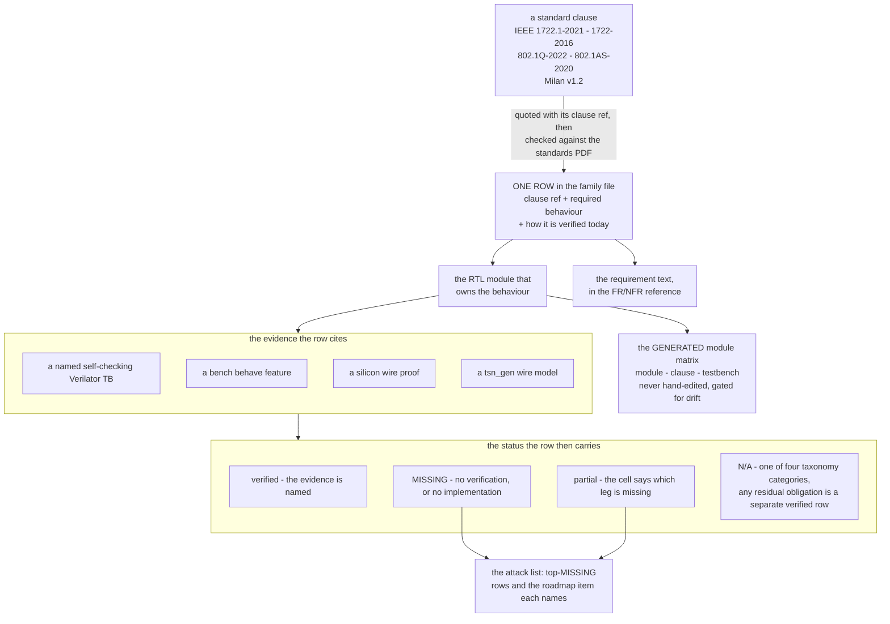

# Spec ↔ test traceability matrix

**Purpose.** For every implemented module: what SHOULD be tested per the
governing standard clause, how that requirement IS verified today (Verilator
TB / bench behave feature / silicon finding / tsn_gen wire model), or an
explicit **MISSING** / **N/A** verdict. This is roadmap item 3's spec-test
subtask. Every row is meant to be human peer-reviewed and then turned into a
behave feature — clause references are the load-bearing content; they were
verified against the local standards PDFs (`$STANDARDS_DIR`) (pdftotext extraction,
2026-07-22).

Companion documents: [`testing/PROTOCOL_VALIDATION_MATRIX.md`](testing/PROTOCOL_VALIDATION_MATRIX.md)
(protocol → test inventory, status-focused), [`MILAN_COMPLIANCE_GAPS.md`](MILAN_COMPLIANCE_GAPS.md)
(what is still missing, narrative), [`reference/FR_NFR.md`](reference/FR_NFR.md)
(requirement text), [`ENDSTATION_BUILDER.md`](ENDSTATION_BUILDER.md)
(roadmap item 4: clause-anchored builder design decisions + config-schema →
descriptor mapping, same PDF-verification rule as this matrix). This matrix
is the clause-anchored join between them.

## Contents

- **[The chain, and which file holds each link](#the-chain-and-which-file-holds-each-link)** — A flowchart from a standard clause to the status a row carries, and the point it exists to make: no single file holds the whole chain, which is why a row can read closed in one place and be unbacked in another.
- **[Family files](#family-files)** — The five per-standard tables with their tallies, summing to 208 rows / 167 ✅ / 17 🟡 / 7 ❌ / 17 ➖, plus the legend. The HTML comment records the 2026-07-23 re-count that moved the totals from 162/18 — a summing typo, not a status change.
- **[Why rows are N/A (taxonomy)](#why-rows-are-na-taxonomy)** — The defence of every ➖: four categories (wrong role, superseded by Milan, optional-so-only-the-refusal-is-owed, profile exclusion), the rows in each, and where the residual obligation is carried as a ✅ row. A reviewer disputing an N/A is told to attack the category, not the row.
- **[Module → family map](#module--family-map)** — The lookup that goes the other way: given a directory under `hdl/`, which family file's sections govern it.
- **[tsn_gen (wire-test engine) — model inventory and gaps](#tsn_gen-wire-test-engine--model-inventory-and-gaps)** — Which YAML protocol models exist today versus the eight to author, ranked by value. ACMP is first because it unlocks 24 rows and its length fuzz reproduces the 68-byte-frame field trap.
- **[Top MISSING rows (attack-order preview)](#top-missing-rows-attack-order-preview)** — The ten open rows in attack order. M-CLK-2 dominates: CRF is fully in fabric yet still not a class A stream (no VLAN tag, wrong lane, no reservation), and its reservation costs 7.17 % of the class-A budget to carry 0.45 % of it — a structural 16× over-provision because 2 ms / 125 µs = 16 intervals and `MaxIntervalFrames` cannot be fractional. (RTL landed 2026-07-28, default off, not yet silicon-verified.)
- **[Review workflow](#review-workflow)** — The intended lifecycle of a row, ending in the rule that matters day to day: when a TB or module changes, the row citing it changes in the same commit.

## The chain, and which file holds each link

*One requirement, followed end to end: which file turns a clause into a row, a
row into a module, and a module into evidence that can flip a status?* No single
file holds the whole chain — that is why a row can look closed in one place and
be unbacked in another.

The generated leg is
[`traceability/MODULE_MATRIX.md`](traceability/MODULE_MATRIX.md) — produced by
[`gen_module_matrix.py`](traceability/gen_module_matrix.py), whose `--check`
mode is a CI no-drift gate. **Never hand-edit it**; it is not restated here.

## Family files

| Family | File | Rows | ✅ verified | 🟡 partial | ❌ MISSING | ➖ N/A |
|--------|------|------|------------|-----------|-----------|--------|
| IEEE 1722.1-2021 (ADP/ACMP/AECP+AEM) | [`traceability/ieee1722_1-2021.md`](traceability/ieee1722_1-2021.md) | 78 | 65 | 3 | 0 | 10 |
| IEEE 1722-2016 (AVTP/AAF/CRF/MAAP) | [`traceability/ieee1722-2016.md`](traceability/ieee1722-2016.md) | 40 | 35 | 2 | 1 | 2 |
| IEEE 802.1Q-2022 (VLAN/CBS/MRP/MSRP/MVRP) | [`traceability/ieee8021q.md`](traceability/ieee8021q.md) | 31 | 24 | 3 | 1 | 3 |
| IEEE 802.1AS-2020 (gPTP HW-assist scope) | [`traceability/ieee8021as.md`](traceability/ieee8021as.md) | 11 | 8 | 1 | 1 | 1 |
| Milan v1.2 profile deltas | [`traceability/milan-v12.md`](traceability/milan-v12.md) | 54 | 41 | 8 | 4 | 1 |
| **Total** | | **214** | **173** | **17** | **7** | **17** |

<!-- Tally reconciliation 2026-07-23: the Milan family previously read 38✅/9🟡;
     a 1:1 re-count of every row's leading status glyph in milan-v12.md gives
     39✅/8🟡 (§1 11✅/4🟡/1➖, §2 3✅, §3 9✅/1❌, §4 9✅/2🟡/1❌, §5 3✅/1🟡,
     §6 4✅/1🟡/2❌ = 52). No row status changed — it was a summing typo (one ✅
     counted as partial). Grand total ✅ 162→163, 🟡 18→17 accordingly. Downstream
     quotes of "162✅/18🟡" (e.g. HANDOVER roadmap table) are now stale → 163✅/17🟡.
     2026-07-27 clock-validity round: +2 Milan rows (M-DEV-13a 5.3.7.3 streaming
     state, M-DEV-13b Table 5.4 TIMESTAMP_UNCERTAIN) and +2 AVTP rows (AVTP-8t
     talker tu, AVTP-6t talker tv) — all ✅. M-DEV-13 keeps its 🟡 (the silicon
     leg against a real grandmaster change is still owed). 204→208, 163→167.
     2026-07-28 AECP response-contract round: +6 1722.1 rows, all ✅ — CMD-7a
     (7.4.16.2+7.4.5 GET_STREAM_INFO index coverage), CMD-7b (7.4.16.2 /
     Milan 7.3.10 non-success response size), CMD-8a (7.4.17.1/7.4.18.2
     SET/GET_NAME size + frame-vs-cdl), CMD-15a (7.4.40.2 GET_AVB_INFO 20 B
     floor), CMD-17a (7.4.42.2 GET_COUNTERS index coverage + empty valid
     mask), CMD-19a (7.4.44.2 GET_AUDIO_MAP 12 B floor). Every one carries an
     L3/L4 oracle and was calibrated against the Milan-validated reference
     device 3CC0C60102030000 (52 checks / 0 failures on the extended
     hive_compliance.py). The ✅ is the TB+model leg; the SILICON leg is
     explicitly still owed on all six — they need a Vivado rebuild and a
     reflash, which this round did not do. 208→214, 167→173. -->

Legend: **✅** requirement has a specific self-checking verification today
(named TB / BENCH feature / silicon wire proof). **🟡** partially verified —
the cell says exactly which leg is missing. **❌ MISSING** — no verification
(or no implementation where the clause is claimed). **➖ N/A** — clause
deliberately out of scope, with the reason in the row. A ✅ row may still
carry a `tsn_gen NO MODEL` note: the behavior is verified, but not yet
wire-generatable/fuzzable by tsn_gen.

## Why rows are N/A (taxonomy)

**N/A never means "skipped".** It means the clause imposes no positive
obligation on this device in this role/profile — and wherever a residual
obligation remains, that residual is a separate ✅ row. The 17 N/A rows fall
into exactly four categories; a reviewer disputing an N/A should attack the
category claim, not the row in isolation:

| # | Category | Rows | Why no positive obligation | Where the residual obligation lives |
|---|---|---|---|---|
| 1 | Wrong role — controller / bridge | ADP-15, ACMP-11, AECP-7, Q-13 (**4**) | the clause binds ATDECC controllers or 802.1Q bridges; this device is an end-station entity | the counterpart behavior is the bench (Hive, `avdecc_l2`, the reference AVB switch) — what the entity is tested *against* |
| 2 | Superseded by Milan | ACMP-12, ACMP-13 (**2**) | Milan 5.5.3/5.5.4 replaces the 1722.1 8.2.4/8.2.5 state machines wholesale — asserting the base SM would test for behavior that is *wrong* here | M-ACMP-1..8, where the replacement is fully verified |
| 3 | Optional feature — only the refusal is owed | AEM-9, CMD-4, CMD-18, CMD-21, CMD-23 (**5**) | 1722.1 makes these optional | the exact NO_SUCH_DESCRIPTOR / NOT_IMPLEMENTED status, verified by RTL `aecp` negative reads + the unknown-command path |
| 4 | Profile / scope exclusion | AAF-11, CRF-9, MRP-8, Q-14, AS-11, M-DEV-16 (**6**) | the profile restricts the format set (AES3, non-audio CRF); the architecture fulfills the function another way (MMRP → MAAP + TCAM); the feature is outside Milan (Qbv TAS); the medium does not exist on this hardware; or the project recorded an explicit exclusion (redundancy) | ✅ rows AEM-4, M-FMT-1 and M-DEV-16's own note |

4 + 2 + 5 + 6 = the 17 N/A rows in the tally above. The prose behind each
category:

1. **Wrong role — controller/bridge obligations** (ADP-15, ACMP-11, AECP-7,
   Q-13): the clause binds ATDECC controllers or 802.1Q bridges. We are an
   end-station entity; the counterpart behavior is provided by the bench
   (Hive, `avdecc_l2`, the reference AVB switch) — which is what the entity is
   tested *against*, not what it implements.
2. **Superseded by Milan** (ACMP-12, ACMP-13): Milan v1.2 5.5.3/5.5.4
   replaces the 1722.1 8.2.4/8.2.5 state machines wholesale. Asserting the
   base SM literally would test for behavior that is *wrong* on a Milan
   device; these rows redirect to M-ACMP-1..8, where the replacement is
   fully verified.
3. **Optional feature — only the refusal code is owed** (AEM-9, CMD-4,
   CMD-18, CMD-21, CMD-23): 1722.1 makes these optional; the testable
   residual is the exact NO_SUCH_DESCRIPTOR / NOT_IMPLEMENTED status, which
   *is* verified (RTL aecp negative reads + unknown-cmd path) and slated for
   an exhaustive tsn_gen full-range sweep.
4. **Profile/scope exclusion** (AAF-11, CRF-9, MRP-8, Q-14, AS-11,
   M-DEV-16): the Milan profile restricts the format/type set (AES3,
   non-audio CRF), the architecture fulfills the function another way
   (MMRP → MAAP + TCAM), the feature is outside Milan (Qbv TAS), the medium
   does not exist on this hardware (802.11/EPON/CSN), or the project
   recorded an explicit exclusion (redundancy — dependency-matrix decision).
   Residuals (e.g. "must not advertise AES3 / a secondary interface") are
   carried by ✅ rows (AEM-4, M-FMT-1, M-DEV-16's note).

## Module → family map

| `hdl/` module(s) | Family file section |
|------------------|---------------------|
| `adp/` (advertiser, parser, tx_arbiter) | 1722.1 §1 (ADP-1..17), Milan §2 |
| `acmp/` (listener, responder) | 1722.1 §2 (ACMP-1..14), Milan §3 |
| `aecp/` (top + 9 submodules, AEM ROM) | 1722.1 §3a–3c, Milan §4 |
| `1722/` (parsers, rx_monitor, crf_rx/tx) | 1722-2016 §1, §3; Milan §5–6 |
| `avtp/` (aaf talker, depacketizer, playback, lpf, tone, media_adv) | 1722-2016 §2; Milan §6 |
| `maap/KL_maap` | 1722-2016 §4 (MAAP-1..6) |
| `802_1q_traffic_shaper/` (classifier, class_map, queues, shaping core, CBS, controller) | 802.1Q §1 (Q-1..14) |
| `hdl/ieee8021q/srp/` (11 modules + `lwsrp_pkg.sv`) | 802.1Q §2–3 (MRP/SRP rows), Milan §1 (M-DEV-5..10) |
| `ptp_timestamp/` (counter, ts core/top, csr_sync) | 802.1AS (AS-1..5) |
| `common/` (tcam, rx_mac_filter, link_guard, ifg gasket, cdc, datapath, csr) | supporting rows inside each family (filtering, link qualification, integration) |

## tsn_gen (wire-test engine) — model inventory and gaps

tsn_gen (the local tsn-gen checkout) generates, fuzzes and decodes wire frames from
YAML protocol models (`protocols/`); packet_gen is the engine the matrix's
"would be verified with tsn_gen" statements refer to.

**Models that exist today:** `application/1722_1/adp/1722_1_adp.yaml`,
23 AECP yamls (`application/1722_1/aecp/`: 20 AEM commands + address access
+ vendor unique + no-payload), `data_link/1722/1722_avtp_common_stream.yaml`,
`data_link/1722/1722_avtp_control.yaml`, `data_link/ethernet/mac_frame.yaml`.

**Models to author (highest value first):**

1. **ACMP** (`1722_1_acmp.yaml`) — unlocks fuzz for all 14 ACMP + 10 M-ACMP
   rows; length fuzz reproduces the field 68-byte-frame trap.
2. **MSRP/MVRP MRPDU** (`802_1q/mrpdu_*.yaml`) — systematic Milan 4.2.7.1.2
   malformed-MRPDU sweeps; replaces hand-hexed frames in `lwsrp_rx` /
   `lwsrp_switchpdu`; class-B vectors for SRP-8.
3. **MAAP** (Annex B PDU) — conflict/defend fuzz (MAAP-1..6).
4. **CRF** (Clause 10 PDU) — off-profile and mr/fs-toggle vectors (CRF-5,
   M-CLK-1).
5. **AAF-PCM payload** — sparse/format-mutation streams (AAF-2, AVTP-3).
6. **gPTP message set** — packet_gen as adjustable-priority BMCA claimant;
   the enabler for the blocked es-1.1 DUT-wins variant (AS-6).
7. **VLAN tag fields in `mac_frame.yaml`** — Q-1..Q-4 tag fuzz.
8. **GET_DYNAMIC_INFO (0x4B) batch model** — record-level fuzz of the one
   command whose silicon diverged from TB four times (CMD-22).

## Top MISSING rows (attack-order preview)

1. **M-ACMP-9** — Milan 5.5.1.4/5.5.2.6 saved-state fast-connect: binds do
   not survive reboot (caused the overnight-lapse incident). Roadmap item 9.
2. **M-CLK-2** — Milan 7.3.3: the CRF stream is not a class A stream at all.
   **Scope corrected 2026-07-26 by reading the RTL** — the old wording ("no SRP
   reservation; needs the 2nd lwSRP listener attribute") named only the third
   of three gaps and badly undersold the work.

   CRF *is* **fully in fabric** — `KL_crf_tx`, `KL_crf_rx` and
   `KL_mmcm_drp_servo` are all instantiated in `milan_datapath`, with no
   software in the generate or consume path. But **being in fabric is not the
   same as being a reserved, shaped class A stream**, and three things are
   missing:

   1. **No VLAN tag.** `hdl/ieee1722/crf/KL_crf_tx.sv` contains no `0x8100`, no
      PCP and no TCI field — it emits a bare 60-byte L2 frame. Without PCP 3 on
      the SR VID a bridge cannot classify it as class A, and untagged / VID-0 SR
      traffic floods **unshaped**.
   2. **Not in the shaped lane.** `crft_tx_tdata` is merged by an
      `adp_tx_arbiter` into the **control** lane alongside ADP/ACMP/AECP/MAAP/
      lwSRP and then through the control-lane min-IFG gasket
      (`milan_datapath.sv` ~2634, whose own comment reads *"the CRF talker's
      PDUs (6th low-rate source, 500/s untagged)"*). The data/AAF lane bypasses
      that gasket, so CRF never touches the CBS class A shaped queue and is not
      credit-shaped.
   3. **No MSRP/lwSRP declaration** — the reservation itself. This is the only
      part the previous wording described. The `0x800` window addresses talker
      idx `< T`, so no row can even be selected for the CRF output today.

   Closing it therefore means tagging the CRF PDU with PCP 3 on the SR VID,
   routing it through the shaped lane, **and** giving it an attribute row —
   not just adding a context row.

   **DONE IN RTL 2026-07-28, all three together, default OFF** (`CRFT_CTRL[1]`
   resets 0; see [`MILAN_COMPLIANCE_GAPS.md`](MILAN_COMPLIANCE_GAPS.md) §2).
   The tag is DERIVED from the provisioned lwSRP talker row, so
   tagged-but-undeclared is structurally unreachable. Still needs a Vivado
   rebuild + reflash before any wire claim.

   **Two corrections this round.**
   (a) *The interim compromise's stated reason was wrong.* The text used to
   say an SR-tagged **unregistered** stream "would be pruned by the bridge".
   The bench measured the opposite and
   [`limitations/TROUBLESHOOTING.md`](limitations/TROUBLESHOOTING.md) records
   it: an unregistered VLAN-2 stream DMAC is **flooded**, while a
   **registered but listener-less** stream is pruned — 802.1Q 35.1.2 working
   exactly as specified, since pruning is what a registration BUYS. Tagging
   alone therefore does not make the stream vanish; it puts an unreserved
   stream inside the reserved SR VLAN. Both halves are still required, for
   the right reason now.
   (b) *`MaxFrameSize 18` below is wrong and is superseded by 42.* 18 makes
   `MaxFrameSize + 42` = 60, i.e. it reserves a 60-octet wire slot — but the
   very next line of this table measures the stream at **84 B** on the wire,
   because the frame is PADDED to the 802.3 minimum and the pad is real
   octets a bridge must budget for. MaxFrameSize is the MSDU: 60 L2 − 14 eth
   − 4 tag = **42**, and 42 + 42 = the 84 the traffic row already uses. The
   reservation is 5.376 Mb/s (`1 × (42+42) × 8 × 8000`), and the builder now
   counts it in the class-A ceiling check (arty_4x4 41.47 % → 46.85 %,
   ax7101_8x8 13.21 % → 13.75 %).
   (c) *`MaxFrameSize 42` below is wrong in turn, and is superseded by 29
   (2026-07-30).* Correction (b) reasoned from OUR wire — the padded MSDU —
   when Milan v1.2 4.3.3.2 **Table 4.4** states the value outright: the row
   "CRF, 1 timestamp per PDU" gives MaxFrameSize **28 + 1**, the CRF AVTPDU
   plus the headroom octet every row of that table carries. The two readings
   stop being in tension once the bandwidth recipe keeps its **step 2**: the
   clause is `F = MaxFrameSize + 22; if F < 68 then F = 68; W = F + 20;
   bits/s = W x MaxIntervalFrames x 8000 x 8`, so 29 clamps up to the 68-octet
   minimum tagged frame and reserves an **88**-octet wire slot, which covers
   the real 84 that (b) was worried about. Both the RTL gate (`0x0020`) and
   `sw/builder` (`0x0021`) now run the four steps rather than a folded `+42`,
   which had silently dropped the clamp. The CRF reservation is therefore
   **5.632 Mb/s**, not 5.376 — the mandated figure, 4.8 % higher than what we
   had been declaring. Measured class-A utilisation on the current shapes:
   **arty_4x4 47.36 %**, **ax7101_8x8 13.82 %**, and the new 8-channel Arty
   shape (`configs/endstation_arty_8ch.yaml`) **71.94 %** against the 75 %
   ceiling. Every number below that predates this correction is stale by the
   same 4.8 % on the CRF row and by Table 4.4's `+1` on each AAF row.

   **Budget this before building it (costed 2026-07-26).** The CRF Media Clock
   Output is **mandatory** whenever an AAF Media Listener has ≥2 AAF Media
   Inputs (Milan 7.2.3 — `endstation_builder` raises `ConfigError` without it),
   and it **must be SR class A**. `SRP_SR_CLASSES` therefore defines class A
   only; class B is not a permitted escape and the builder refuses it.
   The consequence is a **structural 16× over-provision** on frame count, not an
   arithmetic bug:

   | | |
   |---|---|
   | CRF on the wire | **one PDU every 2 ms** = 500 PDU/s × 84 B = **0.336 Mb/s**. The rate is `base_frequency / (timestamp_interval × timestamps_per_pdu)` = `48000 / (96 × 1)` = 500 Hz, from the Milan 7.3.2 format word `0x041060010000BB80`; the frame is 60 B L2 (`KL_crf_tx` `FRAME_BYTES` = 14 eth + 28 CRF PDU + 18 pad) |
   | Class-A reservation | MaxFrameSize **42** (the padded MSDU; the 18 originally written here under-declared the slot by 24 B — see correction (b)), MaxIntervalFrames **1** → **5.376 Mb/s** |
   | Cost | **7.17%** of the 75 Mb/s class-A budget, for 0.45% of it in traffic (was quoted as 5.12% off the wrong MaxFrameSize) |

   The whole discrepancy is one ratio: class A's classMeasurementInterval is
   **125 µs**, and CRF sends every **2 ms** — so **2 ms / 125 µs = 16
   intervals per PDU**. `MaxIntervalFrames` is an integer count *per interval*
   and a TSpec cannot express a fraction, so **1** is the floor and the
   reservation buys 8000 frames/s of slot for a 500 frame/s stream. On the 100 Mb Arty this
   moves class-A utilisation from 41.47% to **46.85%** on the 4x4 shape (the builder now counts it; the 55.30 -> 60.42 pair was computed off the wrong MaxFrameSize) — real headroom that must
   be planned for, and only visible since the `is_1g` fix (`REQ-MAC-03`) stopped
   the 100 Mb board admitting against a 750 Mb/s budget. On the gigabit AX it is
   0.51 points. Do not "optimise" this by weakening the class.
3. **CRF-8 / M-CLK-3** — 1722 10.6/10.8 + Milan 7.2.2: clock-recovery
   actuator absent (MMCM-DRP servo); measurement half is done. Roadmap 5.
4. **M-AECP-9 / M-CLK-5** — Milan 5.4.4.4/5.4.4.5 + 7.6:
   SET/GET_MEDIA_CLOCK_REFERENCE_INFO and media clock management layer
   unimplemented.
5. **SRP-9** — 802.1Q 35.2.7: single-stream lwSRP engine; NxN AAF streams
   (AX 8x8 / Arty 4x4) need per-stream registrar/declaration instances.
   Roadmap 4.
6. **SRP-8** — 802.1Q 35.1.4/34.5: SR class B never *declared/used* (bench
   is class A only). The incoming half is now walker-TB-proven (lwsrp_rx
   8b, packed B-first Domain vectors) — which also FOUND the walker's
   stale-`dom_a_evt_r` defect (class-A event lags one Domain PDU; RTL fix
   pending, see the SRP-8 row).
7. **AS-4** — 802.1AS 8.4.3: ingress/egress latency constants are
   bench-calibrated with no per-board calibration procedure; the
   ingress/egress split was never measured separately.
8. **AVTP-5 + M-CNT-4** — 1722 4.4.4.3 mr (media clock restart) toggle has
   no listener response: the parser does not extract mr, so it can never
   tick MEDIA_RESET (gap TB-pinned, avtp_rxmon [30]; the counter's
   servo-rail semantics are now asserted). M-CNT-4's talker-side
   MEDIA_RESET is still unasserted.
9. **AS-6 (variant)** — Milan es-1.1 DUT-wins-BMCA: blocked on the bench
   switch's gPTP claim (USER-ordered to the bottom of the attack list); a
   tsn_gen gPTP model is the unblocking path.
10. **ACMP tsn_gen model** — verification-infrastructure gap: every ACMP row
    is TB-verified but nothing can generate/fuzz ACMP on the wire today.

## Review workflow

Each family file is a table meant for row-by-row peer review; the intended
lifecycle per row is: review clause ref → confirm/adjust required-behavior
wording → promote to a behave feature (bench suite) and/or a tsn_gen sweep →
flip the row's status. When a TB or module changes, the row citing it must
change in the same commit (same rule as [`tb/verilator/README.md`](../tb/verilator/README.md)).
