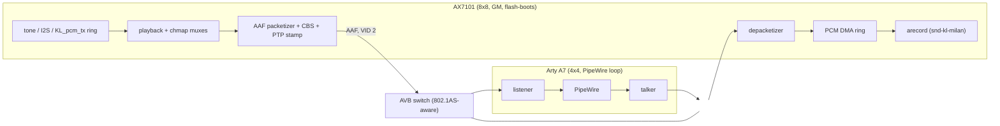
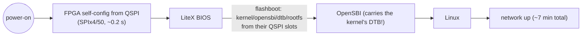

# Systems Engineer's Guide to milan-fpga

**If you read one doc first, read this one.** It tells you what the system is and hands you an
annotated, journey-ordered map of the whole doc set: Overview → Architecture / HW-SW split →
Subsystem specs → Register map / ABI → Build & deploy → Test & verify → Compliance status →
Historical findings.

Status: current as of **2026-08-13**. Where a linked doc is mid-refresh, the current fact is
stated here so this guide is accurate *today*; the doc audit ([`DOC_AUDIT.md` (archived)](../historical_now_obsolete/DOC_AUDIT.md)) tracks the fixes.

> **The single change that reshapes half this map (2026-08-13).** This device's
> entire IEEE 1722.1 / SRP control plane is now
> [`hdl/milan/KL_pp_shadow.sv`](../hdl/milan/KL_pp_shadow.sv), wrapping the
> pinned `protocol-processor` submodule and instantiated **unconditionally** by
> [`hdl/milan/milan_datapath.sv`](../hdl/milan/milan_datapath.sv) — no
> parameter, no fallback, no shadow arm. It owns ADP, ACMP (talker and
> listener) and SRP. MAAP stays in this fabric (`KL_maap` +
> [`hdl/milan/KL_pp_maap_shim.sv`](../hdl/milan/KL_pp_maap_shim.sv)). This
> repository's own ADP advertiser, AECP/AEM engine, ACMP engines and lwSRP
> applicant are **deleted**, along with their Verilator suites and their design
> docs.
>
> **And the AECP surface is now partial, not absent: this entity answers
> `READ_DESCRIPTOR`, and answers every other AECP command with a conformant
> `NOT_IMPLEMENTED` echo.** The responder is the processor's AECP uCPU, which
> landed. `READ_DESCRIPTOR` returns `SUCCESS` with `configuration_index`, the
> reserved field and the descriptor, `NO_SUCH_DESCRIPTOR` on a locate miss and
> `BAD_ARGUMENTS` on a bad configuration index; `IDENTIFY_NOTIFICATION` as a
> command is `BAD_ARGUMENTS`; a command for another entity, or a response
> arriving as input, is silently refused. **Known gap:** Milan Δ7
> `ACQUIRE_ENTITY` is not distinguished from the echo. An echo is not an
> implementation, so `SET_CLOCK_SOURCE`, `SET_MAX_TRANSIT_TIME`, `GET_COUNTERS`
> with the Milan Table 5.22 push, the audio-map setters, IDENTIFY and
> saved-state persistence are still genuinely absent. And the descriptors now
> live in DRAM, fetched at a compile-time base: **nothing in this repository
> builds or loads that image**, so a stock build still enumerates as empty
> (`BAD_ARGUMENTS` for every read — an unloaded image reports zero
> configurations, and that check precedes the locate) until someone supplies
> one. A stated
> capability boundary from an informed decision — not a regression, not a
> temporary blip. **Any page in the map below written before this date and
> describing the fabric AECP/AEM engine, the ACMP or ADP fabric engines, or
> lwSRP, is describing deleted RTL.** §4 lists the phrasings to substitute.

---

## Contents

- **[0. The system at a glance (start here)](#0-the-system-at-a-glance-start-here)** — Two diagrams — the board-to-board media path and the power-on-to-network boot chain — plus the measured headline: E2E capture→render equals the presentation offset exactly (pto 500 µs, `ts_delta` +384 µs, 0 LATE), talker wire output bit-exact 900/900, gPTP slave rms 44 ns.
- **[1. What this system is](#1-what-this-system-is)** — The one-paragraph definition, the normative dividing principle (per-frame work → fabric, negotiation → softcore), the two-board ship pair, and the framing fact everything else depends on: the ship CPU is **1-hart**, so the 2-hart perf-campaign numbers are lineage, not behaviour.
- **[2. The reading path (annotated doc map)](#2-the-reading-path-annotated-doc-map)** — The bulk of the guide: every page in the corpus in journey order across nine stages, each with *when to read it* and, where it matters, what in it is already known stale. The `→` markers give one starting doc per stage and per protocol.
- **[3. Fast lookups ("I need to…")](#3-fast-lookups-i-need-to)** — A thirteen-row task→page table for when you already know what you want to do. The shortcut past §2.
- **[4. Watch-outs when reading older docs (2026-07-23 reconciliation)](#4-watch-outs-when-reading-older-docs-2026-07-23-reconciliation)** — The phrasings that mark a stale page, each with the current fact to substitute: dual-hart→1-hart, −73.4→−83.9 dB, RGMII→GMII, `0x43C0_0000`→`0x9000_0000` — plus the 2026-08-13 control-plane set, which is the largest of them: fabric-ACMP/ADP, lwSRP and fabric-AECP phrasings all name deleted RTL, and "answers no AECP command" is itself now stale — `READ_DESCRIPTOR` is answered, from a DRAM image nothing here builds.

## 0. The system at a glance (start here)

Two Artix-7 boards are Milan/AVB end-stations: gPTP-synced fabric PHC, SRP
reservations, ADP discovery and ACMP connection (all three now the protocol
processor's), MAAP, 8×8 AAF streams, and an ALSA capture card fed straight from
the fabric DMA ring — with an AECP/AEM responder that serves `READ_DESCRIPTOR`
and echoes `NOT_IMPLEMENTED` at everything else, per the boundary above.
The measurements below were taken on silicon before the substitution; they are
dated for that reason, and the media-plane ones are unaffected by it.

**Measured truth (2026-07-24/25):** E2E capture→render = the presentation
offset exactly — pto 500 µs ⇒ `ts_delta` +384 µs, **0 LATE** (datapath
pipeline ≈ 116 µs); talker wire output **bit-exact** vs the tone table
(900/900); full board→board→PipeWire→board loop −72.7 dB THD+N; gPTP slave
rms 44 ns through the switch.

**One provisioning step that boot chain does not yet contain.** The entity model
is no longer a fabric ROM: the AECP uCPU fetches descriptors from DRAM at a
compile-time base (`PP_DESC_BASE_P`, derived by the SoC as the top 1 MiB of main
memory — no base register, so it cannot be moved at runtime), and the image must
be written there **before** the entity is enabled by either `PP_CTRL[0]` or
`ADP_CTRL.en`. No step in this repository produces or loads it — the generator
lives in the submodule (`protocol-processor/hdl/aecp/desc/gen_desc_image.py`) —
so until that gap is closed, expect a board that discovers and connects but
answers `BAD_ARGUMENTS` to every descriptor read. (`NO_SUCH_DESCRIPTOR` instead
would mean the image is loaded and that descriptor is genuinely absent — a
useful discriminator on the bench.) It never hangs on it: the
store's watchdog abandons a stalled burst, and a late load heals without a reset.

Fastest useful commands: [`docs/integration/QSPI_FLASHBOOT.md`](integration/QSPI_FLASHBOOT.md) (flash/boot),
[`docs/testing/TESTING.md`](testing/TESTING.md) (run any TB), [`CONTRIBUTING.md`](../CONTRIBUTING.md) (house rules),
[`docs/fpga/FPGA_DESIGN.md`](fpga/FPGA_DESIGN.md) (every module in `hdl/`), [`docs/traceability/MODULE_MATRIX.md`](traceability/MODULE_MATRIX.md) (module ↔ spec ↔ test coverage).

## 1. What this system is

**milan-fpga is a fully-FPGA AVB/TSN Milan end-station.** It is a RISC-V/LiteX softcore SoC with
a custom TSN network datapath in fabric, running Linux, that behaves as a **Milan v1.2**
audio end-station (talker + listener) on the wire.

- **The end-station**: a 1 Gb Ethernet NIC whose *data plane* (MAC, classifier, CBS shaper,
  PTP timestamp unit, AVTP/AAF/CRF streaming, MAAP) and whose *ADP/ACMP/SRP control plane*
  (the protocol processor, via `KL_pp_shadow`) are both implemented in fabric, and whose
  *policy plane* (linuxptp, provisioning, the kl-eth driver) runs on the softcore under Linux.
  AECP/AEM is in fabric too, but partial: `READ_DESCRIPTOR` and a conformant
  `NOT_IMPLEMENTED` echo for every other command.
- **The dividing principle** (normative, [`docs/ARCHITECTURE_HW_SW_SPLIT.md`](ARCHITECTURE_HW_SW_SPLIT.md) rev 3):
  per-frame / line-rate / liveness work → **fabric**; negotiation / policy / provisioning →
  **softcore**. This is the plan of record; where older overview docs say "AVDECC/SRP is future
  software", they are superseded — ADP/ACMP/SRP/MAAP are in fabric. The same principle explains
  why the AECP responder was never put on the softcore either: a controller's 250 ms retry is a
  deadline independent of CPU load, so the uCPU answers in fabric and only the descriptor *image*
  is software's job.
- **Standards implemented**: IEEE 1722-2016 (AVTP/AAF/CRF/MAAP), IEEE 1722.1-2021 (ATDECC:
  ADP, ACMP, and AECP as **`READ_DESCRIPTOR` plus the §9.3.5 duty to respond — no other
  command is implemented**), IEEE 802.1AS-2020 (gPTP), IEEE 802.1Q-2022
  (VLAN/PCP, CBS credit-based shaper, MSRP/MVRP), all under the **Milan v1.2** profile.
- **Direction**: a 1-NIC end-station today, evolving toward a 4-port AVB switch; the
  NaxRiscv→VexiiRiscv softcore migration that this direction drove is now as-built.

### The two boards (ship pair, bench conformance suite clean on both)

| Board | SoC | Role |
|---|---|---|
| **ALINX AX7101** (xc7a100t) | VexiiRiscv **1-hart** + `--l2-bytes 32768`, DDR3-800 512 MB, GMII MAC @100 MHz datapath | Full end-station. QSPI self-boot. |
| **ARTY** (`asl_milanfinal53e`, VERSION 0x000A) | small VexiiRiscv end-station, MII | Small end-station; flash-boot full images. |

> **The single most important framing fact**: the ship CPU is **1-hart**. Much of the
> 2026-07 perf campaign (RX ~223-381 Mbit, TX 582-646 Mbit) was measured on a **2-hart +
> L2-64K** config that is now a **superseded perf-lineage variant**. Any doc presenting
> "dual-hart / 2-core / L2-64K" as the ship or published shape is stale — read those numbers as
> perf-campaign peaks, not shipped-SoC behaviour.

### Current top-line state (2026-07-25)

- Both boards passed the **bench conformance suite clean** on the pre-substitution gateware.
  That result is dated: the suite's AECP/ACMP/ADP/lwSRP legs exercised RTL that no longer
  exists, so the pass does not carry forward to this tree unexamined.
- Compliance matrix: the row counts move with the substitution — a clause once owned by
  deleted RTL is now **owned by the protocol processor** where it really is (ADP / ACMP / SRP,
  plus AECP `READ_DESCRIPTOR` and the duty to respond) and **NOT IMPLEMENTED** where it really
  is (every other AECP command; a `NOT_IMPLEMENTED` echo is not coverage). Read
  [`docs/SPEC_TRACEABILITY.md`](SPEC_TRACEABILITY.md) for the live tally rather than a number
  quoted here.
- **Media-clock servo (MMCM-DRP)**: silicon-proven at **-83.9 dB** (the CS4344+CS5343 converter
  power-sum floor) on the pre-substitution build — and **structurally off in this one**, because
  `SET_CLOCK_SOURCE` was the only writer of the live `clock_source_index` and the media clock
  can therefore never be switched to the CRF source. `A_MCSRV_STAT` (`0x8F8`) reads its idle;
  `KL_crf_rx` still parses, counts and reports. (A "-73.4 dB" loop figure anywhere is the stale
  pre-servo NCO-era number.)
- **ALSA**: record works on silicon (arecord byte-exact); playback (`KL_pcm_tx` ring → render
  mux) is integrated in gateware — the end-to-end aplay proof is pending.
- **PCM ring** can now target on-chip BRAM (`--pcm-ring bram`); DRAM ring remains default.
- **AX42** (e2 MAC-TX link-bounce wedge): the guard `eth_rst` fix now covers the PHY-side
  `eth_tx`/gtx path, and the follow-up link-guard liveness-toggle deadlock fix is merged and
  flashed to the AX (2026-07-24).
- Toolchain: Vivado 2026.1 with **Artix-7 + Zynq installed** (the local Vivado install); both boards
  build and run. (Docs saying "only Spartan-7 / `--build` blocked here" are stale.)
- 12-item USER roadmap: **items 1-6, 8, 9, 11 DONE** (8×8 end-to-end measured 07-24; the
  per-stage latency taps landed 07-25 — see [`AAF_LATENCY_TAPS.md`](AAF_LATENCY_TAPS.md)); 7 = record proven on
  silicon, playback (`KL_pcm_tx` ring → render mux) integrated in gateware with the
  end-to-end proof pending; 10 in progress (the behave suite; the human 1:1 matrix review
  is USER-gated); 12 pending (switch-gated).

---

## 2. The reading path (annotated doc map)

Each entry: the doc and **when to read it**. `→` marks the doc to start each stage with.

### Stage 0 — Orientation
- **`docs/SYSTEMS_ENGINEER_GUIDE.md`** (this doc) — start here.
- **[`README.md`](README.md)** (repo root) — one-paragraph description + quick jumps. *(The front door;
  routes by persona.)*
- **[`docs/README.md`](README.md)** — the documentation nav hub: directory-purpose map + curated reading
  paths + per-doc one-liners. Read when you want a different slice than this guide's.
- **[`docs/GLOSSARY.md`](GLOSSARY.md)** — every term of art (AVB/TSN, PHY, LiteX/SoC, datapath/DMA, cache).
  The doc other docs defer to for definitions; keep it open in a tab.

### Stage 1 — Overview: WHAT the system is
- → **[`docs/overview/FULL_FPGA_SOLUTION.md`](overview/FULL_FPGA_SOLUTION.md)** — the master "read first" overview: high/mid-level
  architecture, the three datapath boundaries (CSR / DMA / MAC), the CSR/DMA/IRQ ABI, build/run,
  status, roadmap. *(Note: its "AVDECC/SRP is future SW" and RGMII framing are stale — see the
  HW/SW split doc and "GMII not RGMII" below.)*
- **[`docs/overview/ARCHITECTURE.md`](overview/ARCHITECTURE.md)** — the by-**flow** architecture map: datapath, control
  plane, clock domains, the HDL⇄driver/DT mapping table, and the "where to change things" matrix.
  Read when you need to locate a feature end-to-end. *(hdl/ tree in §1 predates the spec-aligned
  reorg; trust the live tree.)*
- **[`docs/overview/SYSTEM_DOMAIN_MAP.md`](overview/SYSTEM_DOMAIN_MAP.md)** — the by-**domain**/by-language partition
  (userspace → kernel → firmware → SoC → RTL → vendored IP → silicon → host tooling). Read to
  answer "what language/where does layer X live". Accurate and stable.
- **[`docs/overview/AVB_SWITCH_DIRECTION.md`](overview/AVB_SWITCH_DIRECTION.md)** — WHY the project is going 4-port-switch and WHY
  VexiiRiscv is the core (that CPU decision is now as-built). Read for design rationale; ignore
  its embedded scoreboard (dated snapshot).

### Stage 2 — Architecture & the HW/SW split
- → **[`docs/ARCHITECTURE_HW_SW_SPLIT.md`](ARCHITECTURE_HW_SW_SPLIT.md)** — **normative** (USER rev 2). The plan-of-record
  dividing principle + per-function fabric-vs-softcore placement table + boundary contracts.
  **This wins where overview docs conflict** on what is HW vs SW. Read before deciding where any
  new function belongs.
- **[`hdl/milan/KL_pp_shadow.sv`](../hdl/milan/KL_pp_shadow.sv) — the file banner** — the fabric
  AECP/AEM design record went with its RTL, and the new responder's record lives in the submodule's
  own architecture pages, so the wrapper's banner is this side's design record for the control
  plane: what was replaced and what was not, the classify-first
  RX tap and why a byte serializer cannot be fed from the raw stream, the blank-flash NVM path,
  the class-D fabric face, and the MAAP split. Paired with
  [`docs/traceability/ieee1722_1-2021.md`](traceability/ieee1722_1-2021.md) for the clause view.
- **[`docs/integration/AXIS_CORES_ON_NAXRISCV.md`](integration/AXIS_CORES_ON_NAXRISCV.md)** — the clearest "how the CPU talks to fabric"
  mental model (control AXI-Lite/CSR, data AXIS↔DMA, events IRQ→PLIC). Read before wiring any
  new core. (Mechanics hold for the shipped VexiiRiscv too.)

### Stage 3 — Subsystem specs (by protocol)

**Datapath / DMA / performance**
- → **[`docs/fpga/PIPELINE_STAGES.md`](fpga/PIPELINE_STAGES.md)** — the flagship living, stage-by-stage prose reference for
  the whole NIC datapath (RX R1-R8, TX T1-T3): what each stage does, where its code lives, which
  knob changes what, BD/CQ/full-gate/cut-through mechanics. **Read this first for the datapath.**
- **[`docs/fpga/FPGA_DESIGN.md`](fpga/FPGA_DESIGN.md)** — the hdl/ gateware module map: every SV module, its clock
  domain, its TB, its doc. Read to learn the RTL structure.
- **[`docs/fpga/HEADER_SPLIT_DESIGN.md`](fpga/HEADER_SPLIT_DESIGN.md)** — the header-split zero-copy RX design + full silicon
  bring-up history (hsq4-hsq12); BD v2/v3 encodings are the **live driver ABI**. Read for the
  detailed history behind PIPELINE_STAGES' RX prose.
- **[`docs/fpga/LSU_NONBLOCKING_DCACHE.md`](fpga/LSU_NONBLOCKING_DCACHE.md)** — the VexiiRiscv non-blocking L1 D-cache / 8 refill
  slots mechanism (why RX is cold-read bound; how MLP arises on an in-order core). Evergreen CPU
  reference; the mlp3 results table is perf-peak (2-hart), not ship.
- **[`docs/fpga/pipeline-telemetry.md`](fpga/pipeline-telemetry.md)** — the in-fabric observability block (`milan_tlm`):
  per-stage counters, Little's-law inflight, the kl-eth telemetry sysfs group. Read when you
  need "where did the frame go?".
- **[`docs/findings/PERFORMANCE_GOAL.md`](findings/PERFORMANCE_GOAL.md)** — the perf-campaign record (>500 Mbit RX+TX north-star
  + the forced-march evidence log). *(Consolidation home for the RX/TX/headroom campaign narrative;
  numbers are perf-lineage on 2-hart.)*
- **[`docs/findings/PERF_ON_MILAN.md`](findings/PERF_ON_MILAN.md)** — the durable **profiling method** (cross-built perf,
  timer sampling, offline System.map symbolization, cluster-reading). Clock/hart-agnostic; read
  before profiling this SoC.
- **[`docs/findings/LATENCY_INVESTIGATION.md`](findings/LATENCY_INVESTIGATION.md)** — the deep memory-latency root cause: 1424 ns/miss
  = 713 ns TLB-walk + 716 ns DRAM floor, the DDR3-800-vs-900 tradeoff, the reset false-path
  lesson. Timeless; read to understand the single-port ceiling.
- **[`docs/findings/RX_PERF_TUNING_MAP.md`](findings/RX_PERF_TUNING_MAP.md)** (+ the `.drawio`) — the maintainer's how-to for the
  three-lane gateware/driver/kernel knob map. **Read the LETHAL pairing hazards** (`hs_pgsz` ==
  `--hs-page-bytes`; BD-256 needs the hsq6+ drain gate — mismatch DMA-overruns kernel memory)
  before touching any perf knob.

**gPTP (time)**
- → **[`docs/design/TIME_SYNC.md`](design/TIME_SYNC.md)** — the time-sync design record: the three clocks (network
  PHC / system / media), the HW timestamp path, the CRF + MMCM-DRP servo loop, every time CSR
  in one table, honest status. **Read this first for time.**
- **[`docs/findings/GPTP_RXPAD_ROOTCAUSE.md`](findings/GPTP_RXPAD_ROOTCAUSE.md)** — the RX-pad root cause + the operative
  switch-behaviour matrix (the bench switch does per-port pdelay but never masters Sync/Announce
  into board ports → why es-1.1/1.2 BMCA variants are switch-gated). Read for why gPTP behaves
  as it does on this bench.
- **[`docs/findings/PTP_TS_METADATA_FIX.md`](findings/PTP_TS_METADATA_FIX.md)** — the HW-timestamp DMA "Record contract v2.1"
  (beat0 ns / beat1 {seq,msgType,marker,dir}); this is the driver-matched ABI. Read when
  touching timestamping.

**SRP (reservation)**
- → **[`hdl/milan/KL_pp_shadow.sv`](../hdl/milan/KL_pp_shadow.sv)** — SRP is the protocol
  processor's. The wrapper banner documents the class-D face the fabric consumes:
  `srp_active_o` + `srp_granted_slope_bps_o` + the domain word, read every clock by the CBS
  slope mux and the talker gate. The lwSRP engine spec that used to head this section
  documented deleted RTL and is retired with it; the `0x680` CSR group survives with its
  domain/slope/over-limit words repointed and its MRPDU counters reading structural zeros.
- **[`docs/NXN_ARCHITECTURE.md`](NXN_ARCHITECTURE.md)** — how the shared-engine-per-function + N per-stream BRAM
  contexts scale the dataplane (AAF/CRF) to NxN streams (roadmap item 5). Read for the scaling
  model; its §3 control-plane sections are marked where the owner changed.

**AVDECC (control)**
- → **[`docs/traceability/ieee1722_1-2021.md`](traceability/ieee1722_1-2021.md)** — per-clause ATDECC map (ADP/ACMP/AECP/AEM +
  commands); the authoritative "which clause is verified where" for the control plane. Expect
  exactly two AECP entries to read implemented — `READ_DESCRIPTOR` with its three status paths,
  and the §9.3.5 duty to answer an unimplemented command — with every other AECP clause NOT
  IMPLEMENTED, `ACQUIRE_ENTITY` flagged as the known Milan Δ7 gap, and the ADP/ACMP rows not
  covering any of it.
- **[`hdl/milan/KL_pp_shadow.sv`](../hdl/milan/KL_pp_shadow.sv) + [`hdl/milan/milan_datapath.sv`](../hdl/milan/milan_datapath.sv) banners** —
  the design record for what the control plane is now, what it replaced, and what it does not do.
  Read these before any older control-plane page.
- **[`docs/design/MILAN_TALKER_SM.md`](design/MILAN_TALKER_SM.md)** — the talker connection model (ACMP PROBE_TX,
  stream_id = {mac,uid}). *(Written against the deleted fabric responder; the connection model
  it describes is the processor's now, and its GET/SET_STREAM_INFO byte rules describe commands
  that today get a `NOT_IMPLEMENTED` echo — a well-formed answer carrying none of those bytes.)*
- **[`docs/findings/ADP_DORMANCY.md`](findings/ADP_DORMANCY.md)** — the ADP-dormancy incident post-mortem: the self-re-arm
  fix, A_ADP_DIAG 0x668, and the "always pass MILAN_CLK_FREQ_HZ to the Instance()" trap. A
  dated record of the deleted advertiser; the *lesson* (a dormancy bug is invisible without a
  re-arm counter) outlived the RTL, and the 0x600 diagnostic words it names now read structural
  zeros.

**AAF (audio streaming) + CRF / media-clock**
- → **[`docs/design/AUDIO_STREAMING.md`](design/AUDIO_STREAMING.md)** — the end-to-end media-plane deep-dive: talker and
  listener chains with CSR touchpoints, presentation-time vs pipeline latency (links
  AAF_LATENCY_TAPS + LATENCY_HISTORY_RING), honest status. **Read this first for audio.**
- **[`docs/traceability/ieee1722-2016.md`](traceability/ieee1722-2016.md)** — per-clause AVTP/AAF/CRF/MAAP map (the verification
  view). *(CRF-8 still says the servo is "not built" — stale: the MMCM-DRP servo IS built and
  silicon-proven.)*
- **[`docs/MVP_TALKER.md`](MVP_TALKER.md)** — the AAF-PCM talker: the 90-byte frame format, the CSR 0x654 group,
  silicon bring-up. *(Its headline "media clock not locked" caveat is superseded by the servo;
  the frame/CSR content is still live.)*
- **Media-clock servo** — the MMCM-DRP servo ([`hdl/ieee1722/crf/KL_mmcm_drp_servo.sv`](../hdl/ieee1722/crf/KL_mmcm_drp_servo.sv),
  MCSRV_STAT/CTRL at 0x8F8/0x8FC) was silicon-proven at -83.9 dB on a coherent chain, and is
  **structurally off in this build** — see §1. Documented in
  [`MILAN_COMPLIANCE_GAPS.md`](MILAN_COMPLIANCE_GAPS.md) item 6 and the register map.
- **[`docs/CHANNEL_MAP_64.md`](CHANNEL_MAP_64.md)** — the 64-in/64-out channel-map architecture: render crossbar + capture
  mux over one shared MAP-RAM. The `0x900`-`0x97F` CSR window is now its **only** programming
  path: the IEEE 1722.1 dynamic audio maps that used to drive it are not implemented, so
  `ADD_`/`REMOVE_AUDIO_MAPPINGS` gets the `NOT_IMPLEMENTED` echo and no controller can retarget
  a channel. Read for
  AAF stream-channel → physical-I/O routing and the pair-slot widening.

**MAAP (address allocation)**
- → **[`docs/design/MAAP_FABRIC.md`](design/MAAP_FABRIC.md)** — the fabric MAAP engine design + byte-exact PDU contract
  (from pipewire maap.c) + the 0x4B GET_DYNAMIC_INFO appendix. *(Reframe plan→as-built; the CSR
  sketch has drifted from REGISTER_MAP — trust REGISTER_MAP: 0x6D0 STAT0 / 0x6D4 STAT1.)*

**QoS / CBS shaper**
- → **[`docs/reference/EGRESS_QUEUE_MAP.md`](reference/EGRESS_QUEUE_MAP.md)** — **the map of record**: five queues in 802.1Q
  order (q4 SR class A … q0 best effort, higher index = higher priority), how each kind of traffic is
  classified (tagged by PCP, untagged control by reserved DMAC), the CBS reset slopes, why gPTP sits
  *below* the shaped classes, and the FQTSS measurements. Read this first.
- → **[`docs/traceability/ieee8021q.md`](traceability/ieee8021q.md)** — per-clause VLAN/PCP + MRP + MSRP/MVRP map (the QoS/CBS
  verification view).
- **[`docs/findings/CBS_DEFAULT_SHAPING_BUG.md`](findings/CBS_DEFAULT_SHAPING_BUG.md)** — the permanent finding that CBS shapes reserved
  SR classes only (`CBS_EN_RST = 5'b00000`, i.e. every queue unshaped at reset); read to understand
  why plain TCP is not credit-paced.
- **[`docs/findings/CBS_DATAPATH_BUG.md`](findings/CBS_DATAPATH_BUG.md)** — the classifier/arbiter tdest-timing fix (distinct bug
  from the reset-default one); read for the CBS/classifier datapath internals.

**End-station composition**
- **[`docs/ENDSTATION_BUILDER.md`](ENDSTATION_BUILDER.md)** — the software-defined end-station builder (roadmap item 4):
  D1-D8 decisions + the 27-row config-schema→AEM-descriptor mapping (config → SoC argv / AEM
  overlay / DT). Read to understand how a declared end-station drives gateware + AEM + lwSRP.

### Stage 4 — Register map / ABI
- → **[`docs/reference/REGISTER_MAP.md`](reference/REGISTER_MAP.md)** — **the CSR/ABI authority** shared by HDL (`milan_csr.sv`),
  the kl-eth driver, and the device tree: group-by-group offsets/access/reset/fields for the
  whole window (now through the `0x920`-`0x930` protocol-processor group) + the LiteX
  DMA/PCM-ring CSR space. **No register was removed by the substitution — the map is an ABI**;
  what changed is meaning, and the doc classifies each affected word as a structural zero, as
  write-only scratch, or as live-but-repointed. `A_TXARB_DIAG` (`0x784`) additionally
  renumbered its lanes. Any driver/gateware/DT author joins on this doc.
- **[`docs/integration/INTEGRATION_GUIDE.md`](integration/INTEGRATION_GUIDE.md)** — the port-by-port contract for wiring
  [`hdl/milan/milan_datapath.sv`](../hdl/milan/milan_datapath.sv) (AXI-Lite CSR, 3 DMA AXIS, MAC-facing AXIS, sideband, one IRQ)
  into any SoC. The single clean boundary of the whole project. Read to attach the datapath.
- **[`docs/reference/FR_NFR.md`](reference/FR_NFR.md)** — the functional/non-functional requirements bible (FR/NFR +
  RFC-2119 priorities + verification-method letters + the 12-step Milan procedure). The
  requirements contract; read to know WHAT is required.
- **[`REQUIREMENTS.md`](../REQUIREMENTS.md)** (root) — the normative REQ-* spec + the 60-gap audit. *(Add the
  platform migration preamble: Zynq/RGMII/0x43C0 → full-FPGA/GMII/0x9000; REQ-* IDs unchanged.)*
- **[`THIRD_PARTY.md`](../THIRD_PARTY.md)** (root) — vendored RTL provenance (submodule, license, pinned commit).
  Read before building or redistributing.

### Stage 5 — Build & deploy
- → **[`docs/integration/BUILDING.md`](integration/BUILDING.md)** — the canonical two-board build flow via [`sw/litex/build.sh`](../sw/litex/build.sh)
  (named `cfg_ax7101`/`cfg_arty`, the 32-thread/3-build parallel discipline, how to add a config).
  *(Refresh cfg paragraphs to 1-hart+L2-32K / flashboot-full / strip-probes.)*
- **[`docs/litex/LITEX_SOC.md`](litex/LITEX_SOC.md)** — the in-depth [`sw/litex/`](../sw/litex) + `milan_soc.py` anatomy (CRG,
  VexiiRiscv/NaxRiscv, DDR3, ring-DMA, LiteEth GMII MAC, QSPI flashboot, the mandatory flags).
  Read for the LiteX host internals. *(Refresh CPU/clock to 1-hart+L2-32K@100e6.)*
- **[`docs/integration/QSPI_FLASHBOOT.md`](integration/QSPI_FLASHBOOT.md)** — how QSPI flash-boot works (bitstream@0 +
  Image.xz via the xz_embedded BIOS decoder, the 16 MB constraint, deploy.sh flash-images).
  Canonical flashboot reference.
- **[`docs/integration/BOARD_PORTING_AX7101.md`](integration/BOARD_PORTING_AX7101.md)** — the worked "how a new board gets ported"
  story (pin provenance, the RGMII→**GMII** strap correction, 512 MB DDR3). Read before a new board.
- **[`docs/integration/PORTING_GUIDE.md`](integration/PORTING_GUIDE.md)** — vendor-neutral porting (Intel/Lattice/Gowin/open-PnR):
  the 3 replaceable layers, the vendor-touching-attribute inventory, the Yosys/ECP5 proof.
- **[`THIRD_PARTY.md`](../THIRD_PARTY.md)** — provenance (also Stage 4).

### Stage 6 — Test & verify
- → **[`docs/testing/TESTING.md`](testing/TESTING.md)** — the top-level verification map/index: every layer, what it
  proves, the exact command. *(Trust `ls tb/verilator/` for the harness list and
  [`syn/yosys/run.sh`](../syn/yosys/run.sh) for the tops — counts in prose rot; the listing is authoritative.)*
- **[`docs/testing/RUNNING_TESTS.md`](testing/RUNNING_TESTS.md)** — the layered how-to-run runbook (cheapest-first: smoke →
  migen sims → verilator → yosys → P&R → silicon) with time budgets and the traps that bit.
- **[`docs/testing/SIMULATION.md`](testing/SIMULATION.md)** — the conceptual explainer of the three sim layers + the M-A2
  "CPU reads MILN" evidence walk. Read to understand what each sim layer can/can't catch.
- **[`docs/testing/PROTOCOL_VALIDATION_MATRIX.md`](testing/PROTOCOL_VALIDATION_MATRIX.md)** — the protocol × module × test coverage view
  ("which harness proves protocol X"). *(Status glyphs are a pre-silicon snapshot — many rows are
  now bench/silicon-done.)*
- **[`docs/testing/BEHAVE_TEST_PLAN.md`](testing/BEHAVE_TEST_PLAN.md)** — the live plan (roadmap item 10) turning the 204-row
  traceability matrix into a tag-taxonomy'd behave suite. Dated today; the active compliance-test
  bridge. Read for the executable-compliance direction.
- **[`docs/templates/README-parameters.template.md`](templates/README-parameters.template.md)** / **[`README-tests.template.md`](templates/README-tests.template.md)** — the
  per-leaf-module doc templates; the tests template's row format rolls up 1:1 into
  SPEC_TRACEABILITY. Use when documenting a new module.
- **[`docs/limitations/KNOWN_ISSUES_AND_LIMITATIONS.md`](limitations/KNOWN_ISSUES_AND_LIMITATIONS.md)** — the honest page of open limitations,
  **lethal gateware⇄driver pairings, and refuted perf levers (measured, do-not-retry)**. Read to
  avoid known dead ends. *(cpu-count line + reconciled-date being refreshed.)*
- **[`docs/limitations/TROUBLESHOOTING.md`](limitations/TROUBLESHOOTING.md)** — the field log of every real problem hit
  (symptom→cause→fix) across toolchain / LiteX / Verilator / synth / P&R / on-hardware bring-up.
  Durable; the first place to look when something breaks.

### Stage 7 — Compliance status
- → **[`docs/SPEC_TRACEABILITY.md`](SPEC_TRACEABILITY.md)** — the traceability hub: the reconciled coverage table
  (204 rows = **163✅/17🟡/7❌/17➖**, reconciled today), the N/A taxonomy, the module→family map,
  the top-MISSING attack order. Start here to find which clause is verified where.
- **Per-standard family files** (under [`docs/traceability/`](traceability)):
  [`ieee1722_1-2021.md`](traceability/ieee1722_1-2021.md) (ATDECC), [`ieee1722-2016.md`](traceability/ieee1722-2016.md) (AVTP/AAF/CRF/MAAP),
  [`ieee8021as.md`](traceability/ieee8021as.md) (gPTP), [`ieee8021q.md`](traceability/ieee8021q.md) (802.1Q QoS+SRP), [`milan-v12.md`](traceability/milan-v12.md) (Milan overlay).
  Read the one for the protocol you're auditing.
- **[`docs/reference/MILAN_V12_DEPENDENCY_MATRIX.md`](reference/MILAN_V12_DEPENDENCY_MATRIX.md)** — the ⇄ companion of FR_NFR: WHY each Milan
  requirement forces each FR/NFR + the verification artifact per area. Read paired with FR_NFR.
- **[`docs/MILAN_COMPLIANCE_GAPS.md`](MILAN_COMPLIANCE_GAPS.md)** — the live narrative "what's still missing/approximate" +
  the USER-ordered 12-item attack order. The best "what's left and why" orientation; read next
  to SPEC_TRACEABILITY.

### Stage 8 — Current ops + historical findings
- → **GitHub Issues** — the current roadmap, open gaps, and live state are tracked as issues.
  Read the open issues to know what's left and what's in flight right now.
- **[`docs/findings/BENCH_TOPOLOGY.md`](findings/BENCH_TOPOLOGY.md)** — the "read this first" bench-ops reference: machines,
  consoles, repos, the build→flash→verify pipeline, peer-host wire tooling, the private-suite naming
  rules, the CSR quick-map, standing rules. High value for operating the bench.
- Historical campaign narrative lives in the git history and [`../CHANGELOG.md`](../CHANGELOG.md);
  the per-bug post-mortems below are the evergreen record.
- **[`docs/findings/README.md`](findings/README.md)** — the findings-directory index (symptom→measurement→root-cause→
  fix→verification framing).
- **Fixed-bug post-mortems** (all silicon-validated, evergreen teaching docs):
  [`kl-eth-tx-debug.md`](findings/kl-eth-tx-debug.md) (the definitive TX bring-up saga + "never trust dst-MAC-keyed counters as
  TX proof"), [`CBS_DATAPATH_BUG.md`](findings/CBS_DATAPATH_BUG.md), [`CBS_DEFAULT_SHAPING_BUG.md`](findings/CBS_DEFAULT_SHAPING_BUG.md), [`ADP_DORMANCY.md`](findings/ADP_DORMANCY.md),
  [`GPTP_RXPAD_ROOTCAUSE.md`](findings/GPTP_RXPAD_ROOTCAUSE.md), [`PTP_TS_METADATA_FIX.md`](findings/PTP_TS_METADATA_FIX.md).
- **[`CHANGELOG.md`](../CHANGELOG.md)** (root) — the per-lever measured ledger (lever → build → before→after Mbit/s)
  + the refuted-levers list. The single canonical lever→effect table for the perf campaign.
- **[`TODO.md`](../TODO.md)** (root) — the original Phase 0-9 NIC bring-up plan; largely done/superseded by the
  12-item roadmap, but still the open-REQ checkbox ledger.
- **[`historical_now_obsolete/`](../historical_now_obsolete/README.md)** (repo root) — the
  **superseded / completed-plan** docs (the byte-ring/CPPI/RSC DMA-origin docs, the completed
  migration & de-Xilinx plans, the early perf snapshots), physically moved out of the active
  tree; its README maps each to its living successor. The four merge-source docs
  (RX_TX_PERFORMANCE, GIGABIT_HEADROOM_ANALYSIS, SINGLE_PORT_PERF, HSPLIT14_DESIGN) were
  folded into their successors on 2026-07-25 and moved here too.
  Read only for deep history.

---

## 3. Fast lookups ("I need to…")

| I need to… | Go to |
|---|---|
| Understand the whole system in 20 min | this guide §1 → [`overview/FULL_FPGA_SOLUTION.md`](overview/FULL_FPGA_SOLUTION.md) |
| Decide if a function goes in HW or SW | [`docs/ARCHITECTURE_HW_SW_SPLIT.md`](ARCHITECTURE_HW_SW_SPLIT.md) (normative) |
| Find a CSR offset / add a register | [`docs/reference/REGISTER_MAP.md`](reference/REGISTER_MAP.md) |
| Attach the datapath to a SoC | [`docs/integration/INTEGRATION_GUIDE.md`](integration/INTEGRATION_GUIDE.md) |
| Understand the RX/TX datapath | [`docs/fpga/PIPELINE_STAGES.md`](fpga/PIPELINE_STAGES.md) |
| Build a bitstream for a board | [`docs/integration/BUILDING.md`](integration/BUILDING.md) |
| Port to a new board / non-Xilinx | [`BOARD_PORTING_AX7101.md`](integration/BOARD_PORTING_AX7101.md) / [`PORTING_GUIDE.md`](integration/PORTING_GUIDE.md) |
| Run the tests | [`docs/testing/RUNNING_TESTS.md`](testing/RUNNING_TESTS.md) |
| Check what's compliant | [`docs/SPEC_TRACEABILITY.md`](SPEC_TRACEABILITY.md) |
|  Know the roadmap / live state | the GitHub issues |
| Avoid a known dead end / lethal pairing | [`docs/limitations/KNOWN_ISSUES_AND_LIMITATIONS.md`](limitations/KNOWN_ISSUES_AND_LIMITATIONS.md) |
| Debug a bring-up failure | [`docs/limitations/TROUBLESHOOTING.md`](limitations/TROUBLESHOOTING.md) |
| Look up a term | [`docs/GLOSSARY.md`](GLOSSARY.md) |

---

## 4. Watch-outs when reading older docs (2026-07-23 reconciliation)

Several docs predate recent changes. When you hit these phrasings, substitute the current fact:

- "dual-hart / 2-core / L2-64K" as ship config → **ship is 1-hart + L2-32K**; 2-hart numbers are
  perf-campaign peaks.
- "-73.4 dB" as the analog loop record → **-83.9 dB** (servo silicon-proven).
- "162 verified / 18 partial" → **163 / 17** (204-row matrix, reconciled today).
- "17 Verilator harnesses" / "18 Yosys tops" or any other hardcoded count → **the directory
  listing is authoritative** (`ls tb/verilator/`; the [`syn/yosys/run.sh`](../syn/yosys/run.sh) tops array).
- "RGMII" for the board MAC → **GMII** (the AX7101 strap correction).
- CSR base "0x43C0_0000" (Zynq PS) → **0x9000_0000** (softcore IO region).
- "only Spartan-7 installed / `--build` blocked" → **Vivado 2026.1 has Artix-7 + Zynq**; both
  boards build and run.
- "AVDECC / SRP is future software" → **ADP/ACMP/SRP/MAAP are in fabric**
  (per [`ARCHITECTURE_HW_SW_SPLIT.md`](ARCHITECTURE_HW_SW_SPLIT.md) rev 3).
- The media-clock servo described as a "future MMCM-DRP servo" / "actuator not built" → **built
  and silicon-proven** — and, since 2026-08-13, **structurally off**; see below.

**And the 2026-08-13 substitution adds these** — the largest set of stale phrasings in the
corpus, because the RTL they name is deleted:

- "the fabric AECP/AEM entity", "the descriptor ROM" → **deleted RTL**. The responder is the
  protocol processor's AECP uCPU, and the descriptors come from a flat image in DRAM at
  `PP_DESC_BASE_P`, not from a ROM. The `aecp_aem_rom.svh` the builder still writes is an
  orphan of the deleted store, and **nothing in this repo generates or loads the DRAM image**,
  so "discovers and connects but enumerates nothing" is the stock-build state, not a fault.
- "GET_COUNTERS", "the Table 5.22 unsolicited push", "the persistence journal", "saved-state
  fast connect", "IDENTIFY", "SET_/GET_ anything" → **still not implemented.** They now draw a
  conformant `NOT_IMPLEMENTED` echo instead of silence; an echo is a protocol answer, not a
  function, so a page describing how one of them *behaves* is describing deleted RTL.
- "this entity answers no AECP/AEM command at all" (including in
  [`hdl/milan/milan_datapath.sv`](../hdl/milan/milan_datapath.sv)'s banner and the "P4 uCPU seam —
  unlanded" note in [`hdl/milan/KL_pp_shadow.sv`](../hdl/milan/KL_pp_shadow.sv)) → **stale**:
  `READ_DESCRIPTOR` is answered and every other command gets the echo. Milan Δ7
  `ACQUIRE_ENTITY` is the one gap to keep visible — it is not distinguished from the echo.
- "`adp_advertiser`", "`KL_adp_parser`", "`KL_acmp_listener`/`_responder`/`_lstn_ctx`/`_tlkr_ctx`",
  "the lwSRP engine / walker / registrar" → **the protocol processor**, via
  [`hdl/milan/KL_pp_shadow.sv`](../hdl/milan/KL_pp_shadow.sv). `adp_tx_arbiter.sv` is the one
  survivor of those directories, and it is a generic AXIS merge.
- "the ACMP listener state machine's PROBING/SETTLED state" → the processor publishes a **bind
  record**, not a ladder: `ACMPL_STATE` is a structural zero and **`bound` is the truth**.
- "the media clock can be switched to the CRF source" / "the servo locks" → **it cannot be
  selected**; `SET_CLOCK_SOURCE` was its only writer, so the MMCM-DRP and media-NCO servos are
  structurally off and `A_MCSRV_STAT` reads idle.
- "`SET_MAX_TRANSIT_TIME` sets the presentation offset" → **pinned at the Milan 2 ms default**
  for every Stream Output. A default, not a zero.
- "Milan Table 5.4 per-STREAM_OUTPUT counters" → **gone** (`KL_talker_diag_ctx` is not
  instantiated). The **STREAM_INPUT** counters at the `0x6B8` `A_STRMW_CNT` window are
  unaffected and still live — do not conflate the two.
- "`A_TXARB_DIAG` lane 0 is `aecp_acmp`" or any eight-lane reading of `0x784` → the cascade
  collapsed to **four** muxes: LSB first, 0 `ctl_tx`, 1 `aaf_final`, 2 `crf_dp`, 3 `adp_tx`,
  bits 7:4 a structural zero.
- "`ADP_CTRL.en` starts the advertiser" / "`PP_CTRL[0]` is required" → the two are **ORed**;
  either enables the entity, and `milan_csr`'s `PP_PLANE_P` parameter is gone so the `0x920`
  window is always decoded.
- "a zero in the `0x600`/`0x648`/`0x680`/`0x6A4` groups means idle" → many of those words are
  now documented **structural zeros** (source deleted) and a few are **write-only scratch**
  (they read back what software wrote and reach nothing on the wire).
  [`docs/reference/REGISTER_MAP.md`](reference/REGISTER_MAP.md) is the authority, word by word.

The full list of which doc says what and the planned fixes lives in
[`historical_now_obsolete/DOC_AUDIT.md`](../historical_now_obsolete/DOC_AUDIT.md).
