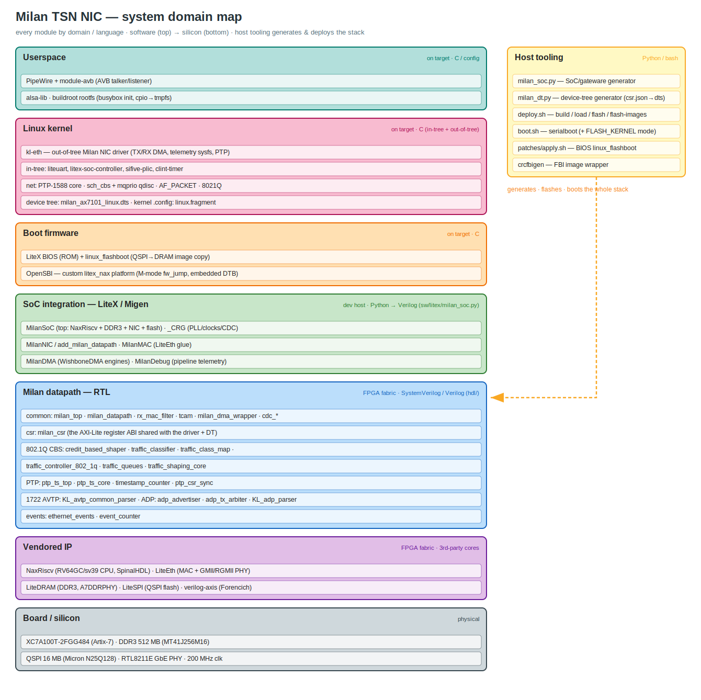

# System domain map

Which module lives in which domain / language — the whole Milan TSN NIC stack, from the
PipeWire AVB endpoint down to the Artix-7 silicon, plus the host tooling that generates and
deploys it. Software at the top, hardware at the bottom.

*(Editable source: [`SYSTEM_DOMAIN_MAP.drawio`](SYSTEM_DOMAIN_MAP.drawio) — open in
[diagrams.net](https://app.diagrams.net). Regenerate the `.drawio`/`.svg`/`.png` from one
layout model with [`SYSTEM_DOMAIN_MAP.gen.py`](SYSTEM_DOMAIN_MAP.gen.py)
(`python3 docs/SYSTEM_DOMAIN_MAP.gen.py docs/SYSTEM_DOMAIN_MAP` → `.svg`+`.drawio`, then
`rsvg-convert -o …png …svg`). If you add modules, edit the generator, not the outputs.)*

## The domains

| Domain | Language / form | Where | Contains |
|--------|-----------------|-------|----------|
| **Userspace** | C / config | target rootfs | PipeWire + `module-avb` (the AVB talker/listener), alsa-lib, the buildroot busybox rootfs (initramfs → tmpfs). Lives in **milan-tests-avb** `fpga/pipewire` + buildroot. |
| **Linux kernel** | C (in-tree + out-of-tree) | target | `kl-eth` (our out-of-tree NIC driver: TX/RX DMA, telemetry sysfs, PTP), the in-tree LiteX/PLIC/CLINT drivers, the net stack we use (PTP-1588, `sch_cbs`+`mqprio`, AF_PACKET, 802.1Q), the device tree, and the kernel `.config` fragment. In **milan-tests-avb** `fpga/{kl-eth,dts,buildroot}`. |
| **Boot firmware** | C | target (M-mode / ROM) | LiteX BIOS (ROM) + our `linux_flashboot`, and OpenSBI's custom `litex_nax` platform (fw_jump). BIOS patch in **milan-fpga** `sw/litex/patches`; OpenSBI in **milan-tests-avb** `fpga/opensbi`. |
| **SoC integration** | Python (Migen/LiteX) → Verilog | dev host | `MilanSoC`, `_CRG`, `MilanNIC`/`add_milan_datapath`, `MilanMAC`, `MilanDMA`, `MilanDebug` — the glue that wires our RTL to NaxRiscv/LiteEth/LiteDRAM/LiteSPI. All in **milan-fpga** `sw/litex/milan_soc.py`. |
| **Milan datapath — RTL** | SystemVerilog / Verilog | FPGA fabric | The actual TSN logic in **milan-fpga** `hdl/`: `milan_datapath`/`milan_top`, `milan_csr` (the register ABI), the 802.1Q CBS shaper, PTP timestamp unit, 1722 AVTP + AVDECC ADP parsers, event counters, `rx_mac_filter`/`tcam`, CDC. |
| **Vendored IP** | 3rd-party cores | FPGA fabric | NaxRiscv (RV64 CPU), LiteEth (MAC + GMII/RGMII PHY), LiteDRAM (DDR3), LiteSPI (QSPI), verilog-axis (Forencich). Not ours — pinned upstream. |
| **Board / silicon** | physical | — | XC7A100T-2FGG484, DDR3 512 MB, 16 MB QSPI (N25Q128), RTL8211E GbE PHY, 200 MHz clock. |
| **Host tooling** | Python / bash | dev host | `milan_soc.py` (SoC gen), `milan_dt.py` (device-tree gen), `deploy.sh` (build/load/flash/flash-images), `boot.sh`, `patches/apply.sh`, `crcfbigen` — they **generate, flash and boot** the whole stack. |

The register map (`milan_csr`) is the contract that stitches three domains together: the RTL
defines it, `milan_dt.py` publishes it into the device tree, and `kl-eth` consumes it — see
[REGISTER_MAP.md](REGISTER_MAP.md). For the runtime data/control flow (rather than this
by-domain view) see [ARCHITECTURE.md](ARCHITECTURE.md); for the boot path,
[QSPI_FLASHBOOT.md](QSPI_FLASHBOOT.md) and milan-tests-avb `fpga/memory/linux-boot-flow`.
