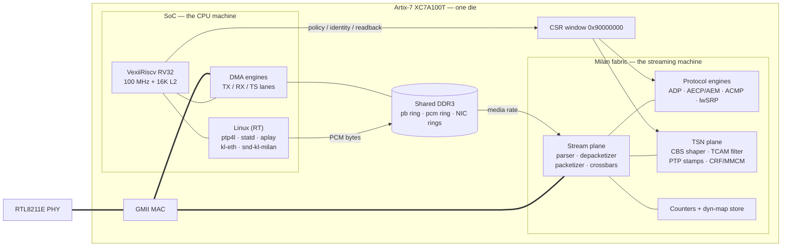

# The CPU and the FPGA — one die, two machines, one contract

Everything runs inside a single Artix-7 (XC7A100T). There is no external
processor: the "CPU" is a soft RISC-V system living in the same fabric as
the Milan hardware plane. What makes the architecture work is a strict
division of labor between the two, enforced by the physics of a single
100 MHz in-order hart: **anything that happens per-frame belongs to the
fabric; anything that happens per-boot or per-policy belongs to the CPU.**
An AAF stream is 8,000 frames per second per direction — the hart cannot
even take an interrupt per frame, let alone run a protocol state machine.
Measured, not assumed: a busy shell loop froze softirq for ~570 ms; a 1 Hz
fork-loop watcher stole ~80 ms of every second from audio. The fabric,
meanwhile, holds every deadline with the CPU fully loaded — or idle.

## Contents

- **[The two machines](#the-two-machines)** — the inventory of each side: the VexiiRiscv SoC and the Linux processes it runs, versus everything `milan_datapath` holds in fabric.
- **[The three contracts between them](#the-three-contracts-between-them)** — the only crossings: the CSR window, the shared DRAM rings (the CPU feeds memory, never frames), and the shared MAC.
- **[Responsibility table](#responsibility-table)** — domain by domain (discovery through persistence), which half owns the per-frame work and which the per-boot policy.
- **[Lessons that prove the split (all measured on this bench)](#lessons-that-prove-the-split-all-measured-on-this-bench)** — streams hold with the CPU at load 4, every per-second CPU loop degraded audio, and every recent defect lived at a boundary, not in a lane.
- **[Diagram](#diagram)** — the one-die picture: SoC, fabric, DRAM and MAC, with the CSR window and rings as the only paths between them.

## The two machines

**The SoC (the "CPU side")** — VexiiRiscv RV32 (single hart, 100 MHz,
16 KB L2), LiteDRAM DDR3 controller, LiteEth GMII MAC front-end, the DMA
engines, boot ROM/BIOS. It boots Linux (buildroot, PREEMPT_RT) from QSPI
and runs: `ptp4l` (the 802.1AS engine — BMCA, clock servo), `milan-statd`
(publishes GM identity/pdelay into fabric CSRs, renews the tu sync lease),
the `kl-eth` NIC driver, the `snd-kl-milan` ALSA driver, the boot identity
programmer (`S50milan`), and the persistence replay.

**The Milan fabric (the "FPGA side")** — `milan_datapath`: the RX
filter/TCAM, the AVTP stream plane (parser, depacketizer, AAF packetizer,
render/capture crossbars), the protocol engines (ADP advertiser, the full
AECP/AEM entity with its descriptor ROM and unsolicited-notification
pushes, the ACMP listener/talker state machines, the lwSRP reservation
engine with its per-row registrars), CBS traffic shaping, hardware PTP
timestamping, the CRF media-clock engine with its MMCM servo, all Milan
diagnostic counters, and the dynamic-mapping store that *is* the audio
crossbar configuration.

## The three contracts between them

1. **The CSR window (`0x90000000`)** — the CPU's only view into the
   fabric: identity registers written once at boot, policy knobs (shaper
   slopes, filter rules), live state read-only (licences, counters, GM).
   The fabric never blocks on it; the CPU polls, never services.
2. **Shared DRAM rings** — the only place the CPU participates in audio:
   playback is `aplay` writing PCM bytes into the pb ring that `KL_pcm_tx`
   consumes at media rate; capture is the fabric writing the pcm ring that
   PipeWire reads. The CPU feeds *memory*, never frames. The NIC's own
   DMA descriptor rings (kl-eth) share the same DRAM through the same
   port arbiter.
3. **The wire** — the fabric owns the MAC datapath end-to-end. The CPU's
   ordinary network traffic (ssh, ptp4l's PDUs) enters and leaves through
   DMA lanes multiplexed into the same MAC, below the stream plane's
   priority.

## Responsibility table

| Domain | FPGA fabric (runtime, per-frame) | CPU / Linux (boot-time, policy) |
|---|---|---|
| Discovery (ADP) | Advertiser, re-announce timers, dormancy/re-arm | Writes entity ID/caps CSRs once at boot (`milan-entity.conf`) |
| Enumeration (AECP/AEM) | Full descriptor ROM, every command engine, unsolicited pushes to registered controllers | Nothing at runtime; the model is generated at build |
| Connection (ACMP) | Listener & talker SMs: bind, probe, settle, licence | Nothing (controllers live off-box) |
| Reservation (lwSRP) | Declarations, per-row registrars, bandwidth gate, MRPDU serializer | Optional window provisioning during persistence replay |
| Stream data (AVTP/AAF) | Packetize/depacketize at wire rate, sequence, presentation time | Never touches a frame |
| Timestamping | Hardware RX/TX stamps, presentation-window compare | `ptp4l` disciplines the PHC *using* fabric stamps |
| gPTP (802.1AS) | Stamp capture, per-frame; publishes nothing itself | `ptp4l` = BMCA + servo; `milan-statd` mirrors GM/pdelay into CSRs |
| Media clock | CRF TX/RX + MMCM servo, tu policy on every PDU | Renews the tu sync lease (statd); never in the clock path |
| Traffic shaping | Per-queue CBS at line rate | Sets slopes once via CSR |
| Ingress filtering | TCAM + kernel shield, per-frame | Boot-time rule programming |
| Audio source/sink | `KL_pcm_tx` reads the pb ring; capture engine writes the pcm ring | `aplay`/PipeWire produce and consume ring bytes |
| Counters (Milan 5.3.8.10) | Counted, interval-coalesced, bind-edge reset — all in fabric | Read-only consumer |
| Channel mappings | Dynamic-map store == the crossbar; wakes on the **host identity** | Edits arrive as AECP commands from controllers, not from the CPU |
| Persistence | Serves the saved-state write master (`0x7C8` group) | Replays the journal at boot; owns the flash partition |
| The NIC itself | MAC, DMA lanes, RX steering | `kl-eth` driver, Linux networking stack |

## Lessons that prove the split (all measured on this bench)

- Streams keep their licence, counters, and deadlines with the CPU at
  load 4 — and with the CPU's software stack broken entirely.
- Every time a per-second CPU loop touched the audio path (the persist
  watcher, shell pollers), playback degraded within one second budget.
- Every defect of the past weeks lived at a *boundary*, not in a lane:
  a CSR window that moved (pb block), an identity the CPU wrote from a
  stale file, a CPU built with the wrong word width under an RV32 boot
  chain. The lanes themselves — fabric streaming, Linux policy — held.

## Diagram

*The CPU configures and observes through the CSR window and feeds memory
through the rings; the fabric alone touches frames. Remove the CPU after
boot and the streams keep flowing.*
