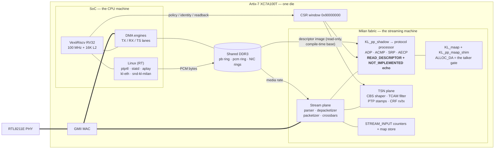

# The CPU and the FPGA — one die, two machines, one contract

Everything runs inside a single Artix-7 (XC7A100T). There is no external
processor: the "CPU" is a soft RISC-V system living in the same fabric as
the Milan hardware plane. What makes the architecture work is a strict
division of labor between the two, enforced by the physics of a single
100 MHz in-order hart: **anything that happens per-frame belongs to the
fabric; anything that happens per-boot or per-policy belongs to the CPU.**
An AAF stream is 8,000 frames per second per direction — the hart cannot
even take an interrupt per frame, let alone run a protocol state machine.
Measured, not assumed: a busy shell loop froze softirq for ~570 ms; a 1 Hz
fork-loop watcher stole ~80 ms of every second from audio. The fabric,
meanwhile, holds every deadline with the CPU fully loaded — or idle.

**The split changed shape on 2026-08-13 without changing that principle.** The
entire IEEE 1722.1 / SRP control plane is now one block —
[`hdl/milan/KL_pp_shadow.sv`](../../hdl/milan/KL_pp_shadow.sv), wrapping the
pinned `protocol-processor` submodule, instantiated **unconditionally** by
`milan_datapath` with no parameter, no fallback and no shadow arm. It owns ADP,
ACMP (talker and listener) and SRP. MAAP stays in this fabric (`KL_maap` +
`hdl/milan/KL_pp_maap_shim.sv`), because the processor implements none by
design. This repository's own ADP advertiser, AECP/AEM engine, ACMP engines and
lwSRP applicant are deleted.

**AECP is the fabric's, and it draws a line the split has not had before.** The
processor's AECP uCPU has landed: the device answers `READ_DESCRIPTOR` and
answers every other AECP command with a conformant `NOT_IMPLEMENTED` echo, all
of it in fabric, at the same per-frame determinism as ADP and ACMP. There is no
software AECP responder and there should not be one — a controller's 250 ms
retry is a deadline independent of CPU load. **An echo is not an
implementation**, so ACQUIRE/LOCK_ENTITY, every SET/GET, `GET_COUNTERS` and the
Milan Table 5.22 unsolicited push, IDENTIFY, and saved-state persistence are
genuinely absent: nothing on this die restores a binding across a power cycle.

**What is new is a third crossing, and it is the CPU's job.** The entity model
is no longer a ROM in fabric — the descriptor store fetches it from **DDR3**
over a read-only master at a **compile-time** base (no base register, so nothing
to program and nothing to get wrong), and **software must put the image there**.
Nothing in this repository does yet: no builder, script or boot step produces
the image or loads it, so a stock build advertises, connects and streams while
answering `BAD_ARGUMENTS` to every descriptor read (an image that fails its
header check reports zero configurations, and the argument check runs before the
locate). That is per-boot policy
work, which is exactly the CPU's side of the dividing principle — the fabric
serves the model at wire speed, the CPU supplies it once at boot.

## Contents

- **[The two machines](#the-two-machines)** — the inventory of each side: the VexiiRiscv SoC and the Linux processes it runs, versus everything `milan_datapath` holds in fabric.
- **[The three contracts between them](#the-three-contracts-between-them)** — the only crossings: the CSR window, the shared DRAM rings (the CPU feeds memory, never frames), and the shared MAC.
- **[Responsibility table](#responsibility-table)** — domain by domain (discovery through persistence), which half owns the per-frame work and which the per-boot policy — including the rows that belong to **neither**, and enumeration, which needs both halves and currently has only one.
- **[Lessons that prove the split (all measured on this bench)](#lessons-that-prove-the-split-all-measured-on-this-bench)** — streams hold with the CPU at load 4, every per-second CPU loop degraded audio, and every recent defect lived at a boundary, not in a lane.
- **[Diagram](#diagram)** — the one-die picture: SoC, fabric, DRAM and MAC, with the CSR window and rings as the only paths between them.

## The two machines

**The SoC (the "CPU side")** — VexiiRiscv RV32 (single hart, 100 MHz,
16 KB L2), LiteDRAM DDR3 controller, LiteEth GMII MAC front-end, the DMA
engines, boot ROM/BIOS. It boots Linux (buildroot, PREEMPT_RT) from QSPI
and runs: `ptp4l` (the 802.1AS engine — BMCA, clock servo), `milan-statd`
(publishes GM identity/pdelay into fabric CSRs, renews the tu sync lease),
the `kl-eth` NIC driver, the `snd-kl-milan` ALSA driver, and the boot identity
programmer (`S50milan`). The persistence replay it used to run has nothing left
to replay — the journal is deleted and nothing here persists a binding across a
power cycle. It has one **unfilled** job as of 2026-08-13: writing the AECP
descriptor image into DRAM at boot. Nothing does it today, and the natural home
is the same boot stage that already programs the identity CSRs.

**The Milan fabric (the "FPGA side")** — `milan_datapath`: the RX
filter/TCAM, the AVTP stream plane (parser, depacketizer, AAF packetizer,
render/capture crossbars), the control plane as **one** block
(`KL_pp_shadow` → the protocol processor: ADP, ACMP talker and listener, SRP,
publishing a class-D wire face the fabric consumes every clock — bind record,
talker declaration, reservation/slope/domain), `KL_maap` + `KL_pp_maap_shim`
for address allocation, CBS traffic shaping, hardware PTP timestamping, the
CRF media-clock engine, and the STREAM_INPUT diagnostic counters.

What the fabric no longer holds: the AEM descriptor ROM — the model moved to
DRAM, and the store fetches it (`o_desc_mem_*` / `i_desc_mem_*` on
`milan_datapath`, bridged to the DDR3 port by the SoC) — plus the
unsolicited-push machinery, the persistence journal, the Milan Table 5.4
per-STREAM_OUTPUT counters (`KL_talker_diag_ctx` is not instantiated), and the
AECP write ports into the dynamic-mapping store. The crossbar keeps its
elaborated configuration and its `0x900` `CHMAP_*` debug window, but no
controller can retarget a channel: ADD/REMOVE_AUDIO_MAPPINGS draw the
`NOT_IMPLEMENTED` echo.

## The three contracts between them

1. **The CSR window (`0x90000000`)** — the CPU's only view into the
   fabric: identity registers written once at boot, policy knobs (shaper
   slopes, filter rules), live state read-only (licences, counters, GM).
   The fabric never blocks on it; the CPU polls, never services.
   Note what is *not* here: the descriptor image's base. It is a compile-time
   parameter with no register, so the CSR window cannot tell you where the
   model should go, nor whether it arrived — derive the base from the SoC's
   memory map and read the image header instead.
2. **Shared DRAM rings** — the only place the CPU participates in audio:
   playback is `aplay` writing PCM bytes into the pb ring that `KL_pcm_tx`
   consumes at media rate; capture is the fabric writing the pcm ring that
   PipeWire reads. The CPU feeds *memory*, never frames. The NIC's own
   DMA descriptor rings (kl-eth) share the same DRAM through the same
   port arbiter.
3. **The wire** — the fabric owns the MAC datapath end-to-end. The CPU's
   ordinary network traffic (ssh, ptp4l's PDUs) enters and leaves through
   DMA lanes multiplexed into the same MAC, below the stream plane's
   priority.

## Responsibility table

| Domain | FPGA fabric (runtime, per-frame) | CPU / Linux (boot-time, policy) |
|---|---|---|
| Discovery (ADP) | The processor's ADP engine: advertise/depart cadence, `available_index` | Writes entity ID/model/counts CSRs once at boot; either `ADP_CTRL.en` (`0x600`[0]) or `PP_CTRL[0]` (`0x920`) enables the entity — they are ORed |
| **Enumeration (AECP/AEM)** | The processor's AECP uCPU: `READ_DESCRIPTOR` served from the DRAM image, a conformant `NOT_IMPLEMENTED` echo for every other command, `BAD_ARGUMENTS` for IDENTIFY_NOTIFICATION-as-command, silent refusal for a foreign `target_entity_id` or a response sent as input | **Owes the descriptor image**: write the model into DRAM at the compile-time base before enabling the entity. Nothing in this repository does it yet, so enumeration currently returns `BAD_ARGUMENTS` to every read (no image = zero configurations, checked before the locate). No software responder — and none wanted |
| Connection (ACMP) | The processor's talker + listener: CONNECT_TX/PROBE_TX/GET_TX_STATE, the BIND_RX ladder, published as a bind record on the class-D face | Nothing (controllers live off-box) |
| Address allocation (MAAP) | `KL_maap` claims one block; `KL_pp_maap_shim` answers the processor's per-source `ALLOC_DA`. **The ALLOC success is the talker gate** | Nothing |
| Reservation (SRP) | The processor's SRP: declarations, registrars, MRPDU emission; the granted slope and domain arrive as wires | Nothing required (the legacy provisioning words are write-only scratch now) |
| Stream data (AVTP/AAF) | Packetize/depacketize at wire rate, sequence, presentation time | Never touches a frame |
| Timestamping | Hardware RX/TX stamps, presentation-window compare | `ptp4l` disciplines the PHC *using* fabric stamps |
| gPTP (802.1AS) | Stamp capture, per-frame; publishes nothing itself | `ptp4l` = BMCA + servo; `milan-statd` mirrors GM/pdelay into CSRs |
| Media clock | CRF TX/RX parse, count and emit; tu policy on every PDU. **The source cannot be SELECTED** — `SET_CLOCK_SOURCE` was its only writer, so the servos are structurally off | Renews the tu sync lease (statd); never in the clock path |
| Presentation offset | Pinned at the Milan 2 ms **default** for every Stream Output (`SET_MAX_TRANSIT_TIME` is gone) — a default, not a zero | Cannot change it |
| Traffic shaping | Per-queue CBS at line rate, idleSlope from the processor's granted slope | Sets static slopes via CSR |
| Ingress filtering | TCAM + kernel shield, per-frame | Boot-time rule programming |
| Audio source/sink | `KL_pcm_tx` reads the pb ring; capture engine writes the pcm ring | `aplay`/PipeWire produce and consume ring bytes |
| Counters — STREAM_INPUT (Milan 5.3.8.10) | Counted, interval-coalesced, bind-edge reset — all in fabric | Read-only consumer through the `0x6B8` `A_STRMW_CNT` window (still live; `GET_COUNTERS` is not implemented, so the CSR is the only reader) |
| Counters — STREAM_OUTPUT (Milan Table 5.4) | **Gone.** `KL_talker_diag_ctx` is not instantiated: GET_COUNTERS and the Table 5.22 push were its only readers | Nothing to read |
| Channel mappings | The map store still drives the crossbar and still answers the `0x900` `CHMAP_*` debug window | No AECP path: ADD/REMOVE_AUDIO_MAPPINGS is answered `NOT_IMPLEMENTED`, so a controller cannot retarget a channel |
| Persistence | **Nothing persists.** The journal is deleted and the processor's NVM face is answered by a blank-flash responder — a restore walk always completes with zero records | Nothing to replay |
| The NIC itself | MAC, DMA lanes, RX steering | `kl-eth` driver, Linux networking stack |

## Lessons that prove the split (all measured on this bench)

- Streams keep their licence, counters, and deadlines with the CPU at
  load 4 — and with the CPU's software stack broken entirely.
- Every time a per-second CPU loop touched the audio path (the persist
  watcher, shell pollers), playback degraded within one second budget.
- Every defect of the past weeks lived at a *boundary*, not in a lane:
  a CSR window that moved (pb block), an identity the CPU wrote from a
  stale file, a CPU built with the wrong word width under an RV32 boot
  chain. The lanes themselves — fabric streaming, Linux policy — held.

## Diagram

*The CPU configures and observes through the CSR window and feeds memory
through the rings; the fabric alone touches frames. Remove the CPU after
boot and the streams keep flowing.*
