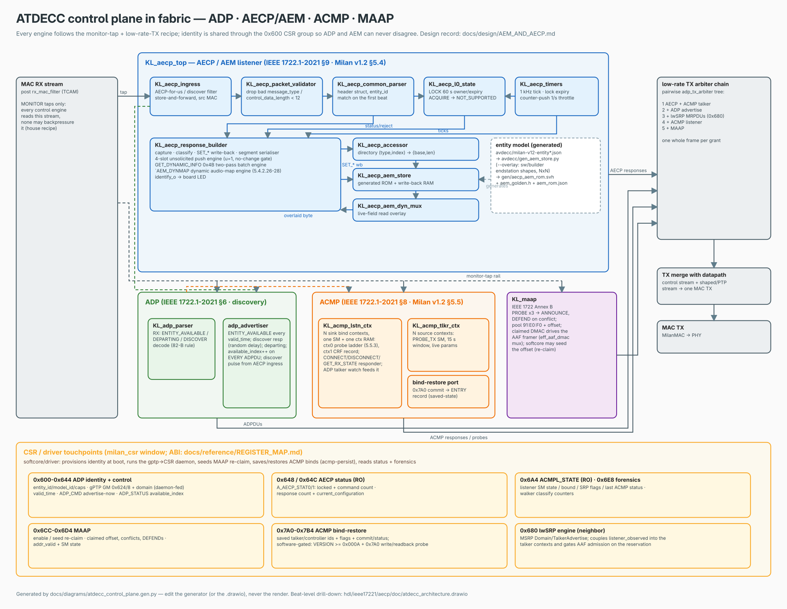

# AEM and AECP — entity-model + control-plane design record

> **What this is.** The original design rationale for the FPGA AEM memory and the
> AECP processing pipeline (June 2025 wiki notes, relocated here from the repo
> root), reconciled against the shipped implementation. The design ideas — the
> 4-level block-memory descriptor scheme, the generic getter/setter accessor,
> the parse → respond → unsolicited pipeline — all survived into
> [`hdl/ieee17221/aecp/`](../../hdl/ieee17221/aecp/); several sizing and
> support-level specifics did not. Every divergence is called out inline and
> summarized in [Status](#status-2026-07-25--design-vs-as-built) below.
> Developer-level reference for the shipped subsystem:
> [`hdl/ieee17221/aecp/doc/README.md`](../../hdl/ieee17221/aecp/doc/README.md).
> The historical export of the original page is `aem-and-aecp.pdf` (repo root).



> The picture above is generated (editable
> [`atdecc_control_plane.drawio`](../diagrams/atdecc_control_plane.drawio);
> regenerate with `python3 docs/diagrams/atdecc_control_plane.gen.py
> docs/diagrams/atdecc_control_plane` — emits `.drawio` + `.svg`; then
> `rsvg-convert -w 2000 atdecc_control_plane.svg -o atdecc_control_plane.png`.
> Never edit the render). Per-block drill-down (frame byte maps, FSM states,
> ROM/overlay address maps): the multi-page
> [`atdecc_architecture.drawio`](../../hdl/ieee17221/aecp/doc/atdecc_architecture.drawio)
> in the subsystem doc directory.

## Contents

- **[Status (2026-07-25) — design vs as-built](#status-2026-07-25--design-vs-as-built)** — The reconciliation table, and the most useful page here: seven places the shipped subsystem answered differently from the 2025 sketch (one configuration not three, 4 unsolicited slots not 16, malformed frames dropped rather than answered BAD_ARGUMENTS), each with the row ID that carries the evidence, plus four items kept explicitly open.
- **[1. Introduction](#1-introduction)** — Two paragraphs defining AEM (clause 7) and AECP (clause 9) and how they relate. Skip it if you already know the acronyms.
- **[2. Scope](#2-scope)** — Three lines: what a Milan end-station needs, in fabric, with softcore provisioning only, deferring to the normative HW/SW split doc.
- **[3. AECP protocol scope](#3-aecp-protocol-scope)** — Which clause-9.2.2 state machines exist, and the five Milan MVU commands under protocol_id `00-1B-C5-0A-C1-00` — all five answered from fabric, correcting an earlier note that MEDIA_CLOCK_REFERENCE_INFO was missing.
- **[4. Entity model — as-built](#4-entity-model--as-built)** — How the 34-descriptor ROM is generated: the small (stereo 48 k, Arty MII) versus full (8-ch 48/96/192 k, AX7101) entity JSONs, the builder overlay that produces NxN shapes, and the four artifacts they feed. §4.1 keeps the original three-configuration sketch as a historical record.
- **[5. The FPGA memory design](#5-the-fpga-memory-design)** — The four questions the memory design had to answer, the designed 4-level descriptor walk, and why L1/L2 collapse to a flat 34-entry directory in a single-configuration entity — a divergence recorded in `KL_aecp_accessor.sv`'s own banner. §5.3 shows the generic segment engine that replaced per-command response code.
- **[6. Processing pipeline — parse → respond → unsolicited](#6-processing-pipeline--parse--respond--unsolicited)** — The module-by-module RX-to-TX chain as a diagram, then a stage-by-stage reconciliation of designed against built. Answers a real question: a foreign `target_entity_id` gets no response at all, and neither does a malformed frame.
- **[7. Command support — as-built](#7-command-support--as-built)** — The per-command verdict table — what is implemented, what answers NOT_SUPPORTED by Milan's instruction, what answers NOT_IMPLEMENTED — with the documented gaps named (SET_STREAM_INFO takes only the MSRP latency sub-command; START/STOP_STREAMING is input-side only). §7.1 covers the static-default / dynamic-opt-in audio maps.
- **[8. Memory-mapped dynamic information](#8-memory-mapped-dynamic-information)** — How live data reaches a descriptor read without a memory-mapped module: a read overlay mux, live counter taps, and the CSR groups the softcore provisions through. Also records that no filtering-database coupling exists, because every response is already unicast.
- **[9. Non-volatile information — OPEN](#9-non-volatile-information--open)** — The honest gap: factory NVM, overlay NVM and factory reset are not built, so every SET_* write-back is lost on reload. The one persistence path Milan makes operationally important — ACMP saved-state fast-connect — is covered elsewhere via the `0x7A0` CSR group.

## Status (2026-07-25) — design vs as-built

**As-built and silicon-proven.** The AECP subsystem answers the full Milan v1.2
mandatory AEM + MVU command set on-wire with no CPU involvement
([`hdl/ieee17221/aecp/KL_aecp_top.sv`](../../hdl/ieee17221/aecp/KL_aecp_top.sv) and children; traceability rows
[`ieee1722_1-2021.md`](../traceability/ieee1722_1-2021.md) AEM-*/CMD-* and
[`milan-v12.md`](../traceability/milan-v12.md) M-AECP-1..10). Highlights, with
the row IDs that carry the evidence:

- Full 34-descriptor READ_DESCRIPTOR model with live-field overlay (AEM-1..3,
  M-AECP-1/2) — generated ROM + directory from the entity JSON.
- LOCK_ENTITY with 60 s auto-expiry, ACQUIRE_ENTITY → NOT_SUPPORTED per Milan
  (CMD-1; `KL_aecp_l0_state.sv`).
- GET_DYNAMIC_INFO 0x4B (IEEE 1722.1-2021 7.4.76, Milan 5.4.2.29): the two-pass
  batch engine is implemented and byte-exact on both boards (CMD-22, M-AECP-5;
  dispatch `CMD_GET_DYNAMIC_INFO` in `KL_aecp_response_builder.sv`, states
  `BSCAN_S`/`BREC_SETUP_S`/`RECHDR_EMIT_S`).
- Audio maps both ways (CMD-19/20, M-AECP-4): static AUDIO_MAP defaults on the
  deployed shape; a full dynamic ADD/REMOVE/GET engine for `map_mode: dynamic`
  ports (Milan 5.4.2.26–28), compile-gated by `` `AEM_DYNMAP `` — see
  [§7.1](#71-audio-maps-static-default-dynamic-engine).
- SET/GET_MAX_TRANSIT_TIME 0x4C/0x4D, MVU GET_MILAN_INFO /
  SET/GET_SYSTEM_UNIQUE_ID / SET/GET_MEDIA_CLOCK_REFERENCE_INFO (M-AECP-6..9).
- Unsolicited notifications only on real change (M-AECP-10, `wb_diff`
  no-change gate), GET_COUNTERS pushes rate-limited to 1/s (Milan 5.4.5).

**Diverged — the as-built answer replaced the sketch.**

| Design sketch (below) | As-built | Evidence |
|---|---|---|
| 3 stored configurations ("Raki" 48/96/192 kHz) | **One configuration** (`NUM_CONFIGURATIONS_C = 1`, `aecp_pkg.sv`); the three rates live inside it via AUDIO_UNIT `sampling_rates` + SET_SAMPLING_RATE | M-AECP-1; [`avdecc/gen_aem_store.py`](../../avdecc/gen_aem_store.py) |
| One illustrative descriptor set | **Small ↔ full entity split**: [`avdecc/milan-v12-entity-small-48k.json`](../../avdecc/milan-v12-entity-small-48k.json) (stereo 48 k baseline — the Arty 100 M MII endstation) and [`avdecc/milan-v12-entity.json`](../../avdecc/milan-v12-entity.json) (full/scaled 8-ch 48/96/192 k — the AX7101 GbE shape); NxN shapes come from the endstation builder overlay | [§4](#4-entity-model--as-built); [`sw/builder/endstation_builder.py`](../../sw/builder/endstation_builder.py) |
| AUDIO_MAP "none, everything can be dynamic" | **Static maps are the default** (AUDIO_MAP×2 in ROM; ADD/REMOVE → NOT_SUPPORTED there — the Milan-5.4.2.27/28-specified answer); dynamic is a per-port opt-in on STREAM_PORT_INPUT[0] only | CMD-19/20, M-AECP-4 |
| Table of **16** controllers for unsolicited | **4-slot** push engine (`UNSOL_SLOTS_C = 4` in `KL_aecp_response_builder.sv`; the pkg constant `MAX_UNSOLICITED_CTLR_C = 16` is the unused design remnant) | CMD-13 |
| Validation failure → BAD_ARGUMENTS response | Malformed frames (bad `message_type`, `control_data_length` < 12) are **dropped without a response**; error statuses answer well-formed commands only | `KL_aecp_packet_validator.sv` |
| WRITE_DESCRIPTOR, GET/SET_ASSOCIATION_ID in the accessor tables | **NOT_IMPLEMENTED** (default echo arm; neither is dispatched) | CMD-4/23; [§7](#7-command-support--as-built) |
| Controller-staleness eviction ("remove from DB after no CONTROLLER_AVAILABLE") | **Not implemented** — registration is explicit REGISTER/DEREGISTER; the per-controller staleness tracker is an open TODO in `KL_aecp_timers.sv` | M-AECP-11 (🟡) |
| L0..L3 walked at run time | L1/L2 **collapse to a flat directory** for the single-configuration entity (`KL_aecp_accessor.sv`, documented divergence in its banner) | [§5.2](#52-as-built-the-flat-directory) |

**Kept open** (tracked, not silently dropped):

- Non-volatile persistence + factory reset of SET_* write-backs — all writes go
  to the volatile store mirror today ([§9](#9-non-volatile-information--open)).
- Per-controller staleness / departure-triggered cleanup of the unsolicited
  slots (M-AECP-11 is 🟡 for exactly this).
- IDENTIFY_NOTIFICATION re-send cadence unasserted by any TB (CMD-14 🟡).
- Render-path consumption of the dynamic input map beyond the 2-channel taps
  ([`MILAN_COMPLIANCE_GAPS.md`](../MILAN_COMPLIANCE_GAPS.md) §1; the chmap64
  crossbar mirror exists).

## 1. Introduction

The ATDECC Entity Model (AEM, IEEE 1722.1-2021 clause 7) is the modelled
representation of a network system's abilities. It is static for every system
as an initial state, yet provides a way to configure the system and lets
systems understand each other. AECP — the ATDECC Enumeration and Control
Protocol (clause 9) — is how compliant devices communicate their entity model:
it transfers AEM descriptors and gives a controller the handle to act on the
system through those descriptors.

## 2. Scope

List what is necessary for a Milan v1.2 end station, implemented in the FPGA
fabric with softcore provisioning only (the normative split lives in
[`ARCHITECTURE_HW_SW_SPLIT.md`](../ARCHITECTURE_HW_SW_SPLIT.md)).

## 3. AECP protocol scope

State machines implemented (IEEE 1722.1-2021 clause 9.2.2):

- The AECP entity state machine for AEM commands — as-built as the
  ingress/validator/parser/responder pipeline of
  [§6](#6-processing-pipeline--parse--respond--unsolicited).
- The AECP Vendor Unique command set for Milan (protocol_id
  `00-1B-C5-0A-C1-00`):
  - GET_MILAN_INFO (protocol version, feature flags, `certification_version`),
  - GET/SET_SYSTEM_UNIQUE_ID,
  - GET/SET_MEDIA_CLOCK_REFERENCE_INFO.

All five MVU commands are implemented and answered from fabric (command codes
`VU_*` in [`hdl/ieee17221/aecp/aecp_pkg.sv`](../../hdl/ieee17221/aecp/aecp_pkg.sv); rows M-AECP-6..9 — the old
"MEDIA_CLOCK_REFERENCE_INFO missing" note was stale and was corrected by the
2026-07-25 fuzz census).

## 4. Entity model — as-built

The original sketch ([§4.1](#41-the-original-sketch-historical)) modelled one
entity with three stored configurations. The shipped model is simpler and
generated:

```
avdecc/milan-v12-entity-small-48k.json     avdecc/milan-v12-entity.json
  (small baseline: stereo 48 k,              (full/scaled: 8-ch, 48/96/192 k,
   the Arty MII endstation shape)             the AX7101 shape; source of truth)
                    \                          /
                     \    reference values    /
                      v                      v
              avdecc/gen_aem_store.py  ◄──--overlay──  sw/builder/endstation_builder.py
              (builtin_spec() = the flashed shape;     (SW-defined endstation YAML →
               --overlay consumes builder output)       kebag-logic/aem-overlay 2.x)
                          │
        ┌─────────────────┼──────────────────────────┐
        ▼                 ▼                          ▼
hdl/ieee17221/aecp/gen/   tb/verilator/aecp/         avdecc/aem_rom.json
aecp_aem_rom.svh          aem_golden.h               (python controller oracle)
(ROM + directory +        (golden images for
 overlay/WB tables)        the TB)
```

- **One entity per device, one configuration.** ENTITY → CONFIGURATION → the
  full Milan mandatory set, 34 descriptors: AUDIO_UNIT, STREAM_INPUT×2
  (AAF + CRF), STREAM_OUTPUT, AVB_INTERFACE, CLOCK_SOURCE×3 (Internal / AAF
  stream / CRF stream), CLOCK_DOMAIN, CONTROL (IDENTIFY), LOCALE, STRINGS,
  STREAM_PORT_IN/OUT, AUDIO_CLUSTER×16 (8 in + 8 out), AUDIO_MAP×2
  (`aecp_aem_rom.svh` header: `AEM_DESC_N_C = 34`, `AEM_ROM_BYTES_C = 3653`).
- **Small ↔ full split.** The small JSON is the scale-from baseline
  (2-channel, 48 kHz-only, the 100 Mbit MII board class); the full JSON is the
  8-channel 48/96/192 k reference the ROM layouts are verified against. The
  tracked `builtin_spec()` shape is the full 34-descriptor tree carrying the
  honest wire-truth formats: 2-ch-first plus the "up to 8" ut-bit family entry
  on the AAF input, stereo talker output, 48 k-only CRF (talker-truth rule —
  declare exactly what the wire carries).
- **NxN / declarative shapes.** `--overlay` consumes the endstation builder's
  `kebag-logic/aem-overlay` 2.x document: N streams/ports are fully consumed
  (including a CRF media-clock output, Milan 7.2.3), and multi-stream shapes
  emit per-descriptor format tables (`` `AEM_PER_STREAM_FMT ``) plus, for
  `map_mode: dynamic` input ports, the dynamic-map block (`` `AEM_DYNMAP ``).
  Static/single shapes keep the tracked svh byte-identical
  (builder-gate-asserted).
- **Entity dynamic state** (the sketch's "dynamic information" table):
  current configuration and lock state live in `KL_aecp_l0_state`; the
  registered-controller table is the 4-slot unsolicited engine; identity
  (entity_id, capabilities, gPTP GM, available_index) comes from the ADP CSR
  `0x600` group so ADP and AEM can never disagree
  ([`REGISTER_MAP.md`](../reference/REGISTER_MAP.md) §0x600; AECP status
  read-back at `0x648`/`0x64C`).

### 4.1 The original sketch (historical)

Kept for the record — these counts are the June 2025 illustration, not the
as-built model (the divergence table in
[Status](#status-2026-07-25--design-vs-as-built) is the reconciliation):

- Because of AVB, only one entity; the entity ID unique, derived from the MAC
  address. As-built: provisioned by the softcore into ADP CSR `0x604/0x608`
  (the driver derives it from the station MAC).
- 3 stored configurations, one active at a time: Raki 48 kHz / 96 kHz /
  192 kHz. As-built: one configuration; the three rates live inside it.
- Per-configuration static counts: STREAM_INPUT×2 (1 AAF + 1 CRF),
  STREAM_OUTPUT×2 (1 AAF + 1 CRF), AVB_INTERFACE×1, CLOCK_DOMAIN×1,
  CLOCK_SOURCE×3 (internal / AAF-derived / CRF-derived), AUDIO_UNIT×1,
  STREAM_PORT per direction, AUDIO_CLUSTER×16 (8 in + 8 out), CONTROL×1
  (identity). As-built matches except STREAM_OUTPUT: the builtin shape has
  one AAF output (a CRF media-clock output is expressible through the builder
  overlay).
- Entity dynamic variables: the SET/GET_CONFIGURATION pointer (sketched
  NONVOLATILE + RESETTABLE; as-built volatile, single config), the
  unsolicited-controller table (sketched 16 × 64-bit IDs; as-built 4 slots),
  and the LOCK_ENTITY boolean with timeout (as-built 60 s, owner-tracked).

## 5. The FPGA memory design

The FPGA implementation needs flexibility for development and for the
end-user, which raised four questions:

1. How to make the FPGA's entity descriptors flexible → yes, up to a certain
   size. As-built: regenerate the ROM from JSON/overlay; more descriptors
   need no RTL edit (requirement NFR-SCUP-04 in
   [`FR_NFR.md`](../reference/FR_NFR.md)).
2. How to make the getter/setter generic to avoid code duplication →
   [§5.3](#53-a-generic-gettersetter-design--as-built).
3. How to manage static, semi-static and dynamic info within one descriptor →
   the overlay/write-back split of [§5.2](#52-as-built-the-flat-directory).
4. Ensure a factory reset and non-volatile updates → still open,
   [§9](#9-non-volatile-information--open).

Solution elements from the design: a 4-level block description; a generic
getter/setter select; an alias memory map for dynamic parameters; a read-only
factory image; a modifiable overlay; a volatile read/write mirror.

### 5.1 The 4-level block description (design)

A file-system-like walk, one 4-level memory block per entity:

| Level | Description |
|---|---|
| Level 0 | The **ENTITY**: the information needed to parse anything else (current configuration, current entity id, lock state). |
| Level 1 | Per-configuration table of descriptor-type addresses, ordered from the CONFIGURATION descriptor. Lives in block RAM. |
| Level 2 | Per-descriptor-type tables: `[count, addr(index 0), addr(index 1), …]` — the descriptor-INDEX level. Lives in block RAM. |
| Level 3 | Per-descriptor payload: `[static size, dynamic size, payload…]`; the dynamic address points at multiplexed live registers. Lives in block RAM except where the dynamic data points. |

Addresses are 16-bit; anything larger works modulo a 16-bit-aligned offset.

### 5.2 As-built: the flat directory

With a single configuration the L1/L2 walk carries no information, so it
collapses. The generated image ([`hdl/ieee17221/aecp/gen/aecp_aem_rom.svh`](../../hdl/ieee17221/aecp/gen/aecp_aem_rom.svh),
emitted by [`avdecc/gen_aem_store.py`](../../avdecc/gen_aem_store.py) — never hand-edit) is:

- **ROM** (`AEM_ROM_BYTES_C` bytes): every descriptor payload back to back,
  plus a 64-byte scratch tail for the MVU media-clock domain name.
- **Directory** `AEM_DIR_C[34]` of `{type, index, base, len}` — the L2/L3
  lookup as one flat table. `KL_aecp_accessor.sv` resolves
  `(configuration_index, descriptor_type, descriptor_index) → {base, len}`
  combinationally; its banner records this as the documented divergence from
  the 4-level walk, to revisit when multi-configuration returns.
- **Overlay map** — the L3 "dynamic data points elsewhere" idea as built:
  `aem_ovl_lookup()` marks ROM byte ranges that `KL_aecp_aem_dyn_mux.sv`
  serves from live wires at read time (entity_id, model_id, capability words,
  available_index, association_id, first-8 name chars = board name,
  current_configuration, MAC, clock_identity — the `overlays` list in
  `gen_aem_store.py`).
- **Write-back tables** — SET_* targets inside the store RAM (sampling rate,
  stream formats incl. per-stream tables on NxN shapes, clock_source_index,
  IDENTIFY value, the SET/GET_NAME directory, audio maps).
- **L0** — `KL_aecp_l0_state.sv` (lock owner/timer, current configuration)
  plus the CSR identity group: exactly the design's Level-0 role.

The static / semi-static / dynamic field classes of the design survive as the
JSON field classes ([`avdecc/README.md`](../../avdecc/README.md) "Field
classes"), mapping to ROM / provisioned-CSR / overlay-mux respectively.

### 5.3 A generic getter/setter (design → as-built)

The design table below classifies which packet fields gate which access level.
It survives as the response builder's command classifier (`w_gs_type` /
`w_gs_index` extraction + per-command validation) feeding one generic
**segment engine** instead of per-command response code: every response frame
is assembled from up to 16 segments, each sourced from the echo buffer, the
AEM store (through the overlay mux), or a constants scratch — empty segments
cost nothing (`KL_aecp_response_builder.sv` banner).

| Information accessor from | Part of | Level accessed | Command/response access |
|---|---|---|---|
| `command_type` | AECP common data | Level 0 only | ACQUIRE_ENTITY, LOCK_ENTITY, ENTITY_AVAILABLE (only this parameter); every other command uses it too |
| `configuration_index` | Message-specific data | Level 1 | READ_DESCRIPTOR, WRITE_DESCRIPTOR, GET/SET_CONFIGURATION, GET/SET_NAME, GET/SET_ASSOCIATION_ID (as-built: WRITE_DESCRIPTOR and GET/SET_ASSOCIATION_ID answer NOT_IMPLEMENTED) |
| `descriptor_type` | Message-specific data | Level 2 | All except GET/SET_CONFIGURATION, GET/SET_ASSOCIATION_ID, REGISTER/DEREGISTER_UNSOLICITED, GET_AS_PATH, AUTH_*, ENABLE_TRANSPORT_SECURITY, GET_DYNAMIC_INFO |
| `descriptor_index` | Message-specific data | Level 3 | Same exception list as Level 2 (minus GET_AS_PATH) |

## 6. Processing pipeline — parse → respond → unsolicited

The design decomposed the AECP processing unit into stages; all of them exist,
two are folded together. The as-built pipeline (see the diagram at the top;
beat-level pages in `atdecc_architecture.drawio`):

```
MAC RX (post-TCAM-filter, monitor tap — reads only, never backpressures)
        │
        ▼
KL_aecp_ingress          — AECP-for-us / ADP-discover filter; store-and-forward;
        │                  strips the Ethernet header; captures the source MAC
        ▼
KL_aecp_packet_validator — drop bad message_type / control_data_length < 12
        ▼
KL_aecp_common_parser    — header struct + entity_id match on the first beat
        ├──────────────► KL_aecp_l0_state   (LOCK / ACQUIRE-unsupported / config)
        ▼                       ▲ KL_aecp_timers (1 kHz tick, lock expiry,
KL_aecp_response_builder        │                 counter-push throttle)
  capture · classify · SET_* write-back · segment serialiser ·
        │  ▲              4-slot unsolicited push engine
        ▼  │ overlaid store byte
KL_aecp_aem_store ──► KL_aecp_aem_dyn_mux    (ROM image + live-field overlay;
        (KL_aecp_accessor: descriptor → {base,len})
        │
        ▼
response AXIS ──► low-rate arbiter chain (AECP+ACMP-talker → +ADP → +lwSRP →
                  +ACMP-listener → +MAAP) ──► datapath TX merge ──► MAC
```

Stage-by-stage reconciliation of the designed behaviour:

- **AECP packet validation.** Designed: check `control_data_length`,
  `message_type` = AEM_COMMAND, status = SUCCESS; on failure answer
  BAD_ARGUMENTS. As-built: accepts AEM_COMMAND **and**
  VENDOR_UNIQUE_COMMAND; a malformed frame is dropped with no response
  (`drop_o`) — error statuses answer well-formed commands only.
- **Common data parser.** Designed: extract target_entity_id + command_type,
  check validity. As-built: `KL_aecp_common_parser.sv`, entity-id match on
  the first accepted beat; a mismatch discards the frame silently
  (`discard_q` in the response builder). This resolves the page's old
  "BAD_ARGUMENTS? verify with the spec" TODO: no response is sent for a
  foreign target_entity_id.
- **Command-specific extract.** Designed as its own stage; as-built folded
  into the response builder: one generic payload-capture buffer plus
  per-command combinational field views, including the getter/setter and
  unsolicited classification.
- **L0 current selected configuration.** As-built `KL_aecp_l0_state.sv`
  (combinational status so the builder latches it with the header). The
  designed ENTITY_MISBEHAVING arm has no trigger in a single-image device.
- **Specific data parser.** The designed enable/dont-care discipline became
  the classifier's validity flags; SET/GET_CONFIGURATION use the packet's
  `configuration_index`, everything else validates against L0 — as designed.
- **Packet response.** Designed: buffer the packet, add the payload (SETTER
  echoes; GETTER echoes + memory state), add the upstream status, set
  message_type to AEM_RESPONSE / VENDOR_UNIQUE_RESPONSE. As-built exactly
  this, via the segment engine; responses go unicast to the captured
  requester MAC.
- **Unsolicited / change requests.** Designed: up to 16 controller IDs in L0
  dynamic memory. As-built: **4 slots** with four pending lanes per slot
  (stream-info, GET_COUNTERS, AVB_INTERFACE, SET-response replay with `u=1`),
  per-controller sequence counters, and a no-change suppression gate
  (`wb_diff`) so only real state changes push (M-AECP-10).
- **Timers.** Designed: 1-minute LOCK timeout, 1-second GET_COUNTERS
  throttle, staleness eviction. As-built: `KL_aecp_timers.sv` provides the
  1 kHz base; the lock auto-expires after 60 s (`LOCK_TIMER_TICKS_C`);
  counter pushes are throttled to 1/s (`COUNTER_THROTTLE_TICKS_C`); the
  per-controller staleness eviction is an explicit TODO in that module
  (open — M-AECP-11).

## 7. Command support — as-built

The design's taxonomy tables were the 1722.1 spec model; this is the shipped
answer per command. Source of truth: the dispatch in
`KL_aecp_response_builder.sv`; per-command details in
[`hdl/ieee17221/aecp/doc/README.md`](../../hdl/ieee17221/aecp/doc/README.md);
per-clause evidence in the traceability rows quoted:

| Command group | As-built behaviour | Rows |
|---|---|---|
| READ_DESCRIPTOR | all 34 descriptors, live fields overlaid | CMD-3, AEM-1..8 |
| LOCK_ENTITY / ACQUIRE_ENTITY | lock grant / owner-unlock / 60 s expiry, owner id in denials; ACQUIRE → NOT_SUPPORTED (Milan), never mutates state | CMD-1 |
| ENTITY_AVAILABLE / CONTROLLER_AVAILABLE | acknowledged | CMD-2 |
| GET/SET_CONFIGURATION, _NAME, _SAMPLING_RATE, _STREAM_FORMAT, _CLOCK_SOURCE, _CONTROL (IDENTIFY → `identify_o` LED), _STREAM_INFO | implemented, validated, store write-back, unsolicited on real change. One documented gap: SET_STREAM_INFO accepts only the MSRP accumulated-latency sub-command, other flag writes → NOT_SUPPORTED | CMD-5..11 (CMD-7 🟡), M-AECP-2/10 |
| START/STOP_STREAMING | implemented **input-side only** (Milan 5.4.2.19/20): the STREAM_INPUT "started" level feeds the GET_STREAM_INFO view; STREAM_OUTPUT answers NOT_SUPPORTED like the reference | CMD-12 |
| REGISTER/DEREGISTER_UNSOLICITED_NOTIFICATION | 4-slot push engine | CMD-13 |
| IDENTIFY_NOTIFICATION | path exists; re-send cadence has no TB assertion | CMD-14 🟡 |
| GET_AVB_INFO, GET_AS_PATH, GET_COUNTERS | implemented with live counter taps; GET_COUNTERS always the full 136-byte payload (success and error), pushes throttled 1/s | CMD-15..17 |
| GET_AUDIO_MAP / ADD/REMOVE_AUDIO_MAPPINGS | [§7.1](#71-audio-maps-static-default-dynamic-engine) | CMD-19/20, M-AECP-4 |
| GET_DYNAMIC_INFO (0x4B) | **implemented** — 7.4.76 batch engine: per-record dispatch, NOT_SUPPORTED echo for legal-unimplemented records, whole-command BAD_ARGUMENTS for illegal/truncated batches; byte-exact on both boards | CMD-22, M-AECP-5 |
| SET/GET_MAX_TRANSIT_TIME (0x4C/0x4D) | implemented; u64 ns onto the addressed STREAM_OUTPUT's own entry of the per-index presentation-offset file (any directory-served index, the CRF output included) — the same entry SET_STREAM_INFO(ACC_LAT) drives, and the offset that stream's framer stamps | (subsystem README) |
| MVU GET_MILAN_INFO / SET/GET_SYSTEM_UNIQUE_ID / SET/GET_MEDIA_CLOCK_REFERENCE_INFO | implemented; unknown VU protocol_id or command → NOT_IMPLEMENTED | M-AECP-6..9 |
| WRITE_DESCRIPTOR, GET/SET_ASSOCIATION_ID, REBOOT, video/sensor, matrix/mixer, auth/security, PTP-instance suite, all others | NOT_IMPLEMENTED with the command payload echoed | CMD-4/18/21/23 |

### 7.1 Audio maps: static default, dynamic engine

Two halves, both specified behaviour (Milan 5.4.2.26–28):

- **Static — the deployed default.** AUDIO_MAP[0]/[1] ship in ROM as identity
  maps; GET_AUDIO_MAP serves them through STREAM_PORT_IN/OUT;
  ADD/REMOVE_AUDIO_MAPPINGS answer NOT_SUPPORTED — Milan 5.4.2.27/28 makes
  that the specified answer for ports carrying static maps (AEM-3 note).
- **Dynamic — per-port opt-in.** A port declared `map_mode: dynamic` in the
  builder overlay carries **no** AUDIO_MAP descriptor and advertises
  `number_of_maps = 0` (the 1722.1-2021 7.2.13 capability signal). The RTL
  engine (compile-gated `` `AEM_DYNMAP ``) then serves GET_AUDIO_MAP by paging
  a live mappings RAM (fixed partition; out-of-range `map_index` →
  BAD_ARGUMENTS) and implements ADD/REMOVE with all-or-nothing validation,
  duplicate-ignore on REMOVE, unsolicited `u=1` on change, and the lock rule.
  Scope today: **STREAM_PORT_INPUT[0] only** (the render/NxN direction — the
  generator rejects any other placement); **output ports stay static-only**.
  Accepted commits are mirrored into the render crossbar's map RAM
  (`dmap_wr_*` strobes; [`CHMAP64_AEM_BINDING.md`](../CHMAP64_AEM_BINDING.md)).

## 8. Memory-mapped dynamic information

The design's "AECP memory-mapped module" TODO — descriptor-dependent live
data — is resolved by three mechanisms instead of one module:

- **Read overlay:** `KL_aecp_aem_dyn_mux` splices live wires into descriptor
  reads (identity, available_index, current configuration, MAC,
  clock_identity — [§5.2](#52-as-built-the-flat-directory)).
- **Live counter taps:** GET_COUNTERS pulls the talker SM, the AAF framer,
  link/gPTP events and the AVTP RX monitor (`KL_avtp_rx_monitor`) directly;
  STREAM_INPUT counter changes push unsolicited GET_COUNTERS at ≤ 1/s.
- **CSR groups** as the softcore/driver touchpoints
  ([`REGISTER_MAP.md`](../reference/REGISTER_MAP.md)): ADP identity `0x600`
  (incl. gPTP GM `0x624/0x628` fed by the gptp daemon), AECP status
  `0x648/0x64C` (locked, command/response counts, current configuration —
  `A_AECP_STAT0/1` in [`hdl/common/csr/milan_csr.sv`](../../hdl/common/csr/milan_csr.sv)), MAAP `0x6CC–0x6D4`,
  ACMP listener state `0x6A4` + forensics `0x6E8`, ACMP bind-restore `0x7A0`
  group, lwSRP `0x680`.

The design also listed a filtering-database interaction ("switch to unicast
after CONTROLLER_AVAILABLE"). As-built, every response is already unicast to
the requester's captured source MAC, and unsolicited pushes go to each
registered controller's stored MAC — no filtering-database coupling exists or
is needed.

## 9. Non-volatile information — OPEN

The designed read-only factory NVM + modifiable NVM overlay + factory reset is
**not built**: all SET_* write-backs land in the volatile store mirror and are
lost on reload (deferred deliberately —
[`hdl/ieee17221/aecp/doc/README.md`](../../hdl/ieee17221/aecp/doc/README.md)
"Deferred"). The one persistence path Milan makes operationally important is
covered elsewhere: the ACMP **saved-state fast-connect** (bind persisted by
software, re-injected at boot through the `0x7A0` CSR group per Milan
5.5.3.5.2). AEM-side NV (names, sampling rate, maps) remains future work,
resettable on factory reset as designed.
