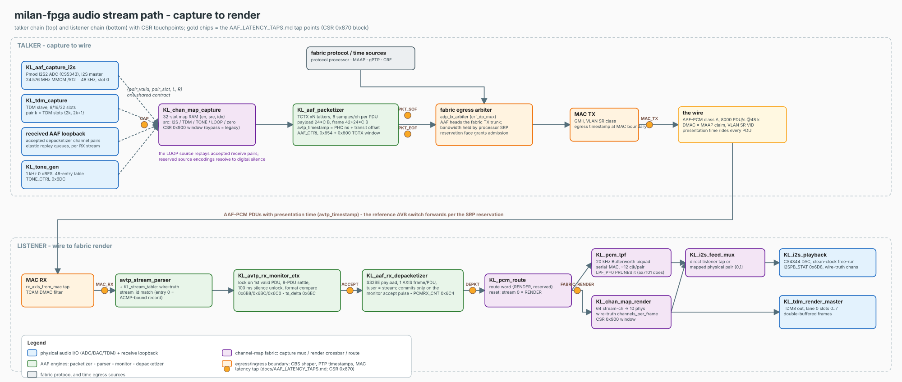
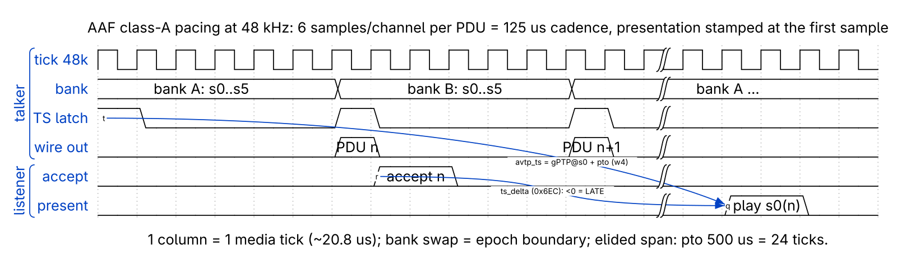
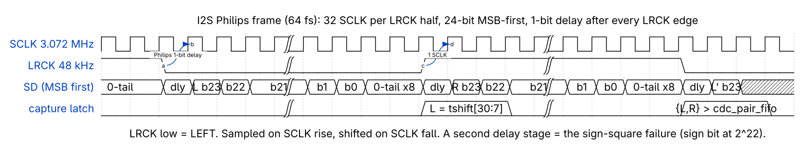
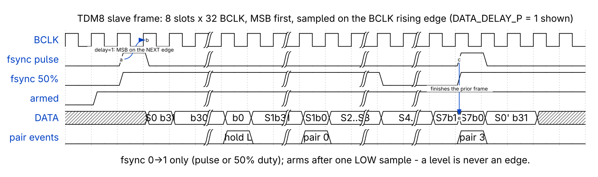

<!--
SPDX-FileCopyrightText: 2026 Kebag Logic
SPDX-License-Identifier: CERN-OHL-W-2.0
-->

# Audio streaming — the end-to-end AAF path

How an audio sample travels through this end-station: capture (or a host
PCM ring) → the shared AAF packetizer → the wire as IEEE 1722 AAF-PCM PDUs
carrying presentation time → the listener's monitor/depacketizer → the PCM
DMA ring (ALSA) and the physical render outputs. This is the subsystem
deep-dive for the media plane; the scaling model behind it is
[`NXN_ARCHITECTURE.md`](../NXN_ARCHITECTURE.md), the CSR authority is
[`reference/REGISTER_MAP.md`](../reference/REGISTER_MAP.md).

> The picture above is generated (editable
> [`audio_stream_path.drawio`](../diagrams/audio_stream_path.drawio); regenerate with
> `python3 docs/diagrams/audio_stream_path.gen.py docs/diagrams/audio_stream_path &&
> rsvg-convert -w 2000 docs/diagrams/audio_stream_path.svg -o docs/diagrams/audio_stream_path.png`).

## 1. A stream's life

A Milan audio stream on this hardware is a class-A AAF-PCM stream: the
talker groups **6 samples per channel into one PDU**, 8000 PDUs/s at
48 kHz (`hdl/ieee1722/aaf/KL_aaf_packetizer.sv` header; traceability row
[AAF-9](../traceability/ieee1722-2016.md)).

Each PDU's `avtp_timestamp` is the **presentation time**: the gPTP
nanosecond clock latched when the PDU's first sample was captured, plus
the configurable transit offset (packetizer TCTX word `w4 TS`, "latched
presentation time (ptp_ns + transit at first-sample capture)"; row
[AVTP-10](../traceability/ieee1722-2016.md)).

The listener does the inverse: for every accepted PDU it computes
`ts_delta = avtp_timestamp − ptp_now` (signed; negative = LATE, i.e. the
presentation instant already passed; larger than the presentation offset
plus margin = EARLY — `hdl/ieee1722/avtp/KL_avtp_rx_monitor_ctx.sv`,
`tsd_w`/`late_w`/`early_w`).

The last value is readable at CSR `0x6EC` (`A_AVTPRX_TSD`,
`hdl/common/csr/milan_csr.sv`). The presentation offset is therefore the
*rendering budget* the talker grants the network plus the listener
pipeline.

> The chronogram above is generated (editable WaveDrom master
> [`wd_aaf_pacing.json`](../diagrams/wd_aaf_pacing.json); regenerate with
> `~/litex-milan/venv/bin/python3 scripts/gen_wavedrom.py docs/diagrams/wd_aaf_pacing.json`
> — it emits the `.svg` and the `.png`).

**NxN** means the whole media plane is one shared engine per function
plus N per-stream BRAM contexts, selected at build time with
`--num-streams` (`sw/litex/milan_soc.py` argparse: "AAF stream contexts
per shared engine").

The deployed shapes are the AX7101 at 8×8 streams and the Arty A7 at 4×4
([`SYSTEMS_ENGINEER_GUIDE.md`](../SYSTEMS_ENGINEER_GUIDE.md) §0 topology
figure). Every stream carries up to 8 channels, so both directions
expose 64 stream-channels ([`CHANNEL_MAP_64.md`](../CHANNEL_MAP_64.md) §1).

## 2. Talker path — capture to wire

### 2.1 Capture frontends and the pair-stream contract

Every audio source speaks one contract into the packetizer: a
`{pair_valid, pair_slot, pair_l, pair_r}` pulse stream — one pulse per
stereo pair of 24-bit left-justified samples, in the datapath clock.

Serial capture runs in the interface's own bit-clock domain and crosses
through a gray-pointer `cdc_pair_fifo`
(`hdl/ieee1722/aaf/KL_tdm_capture.sv` "INTERFACE CONTRACT (the whole
capture family)"; grounding rows G2/G4 in
[`CHANNEL_MAP_64.md`](../CHANNEL_MAP_64.md) §0). The sources:

| Source | Module (`hdl/ieee1722/aaf/`) | What it is |
|---|---|---|
| I2S in | `KL_aaf_capture_i2s.sv` | I2S master for the Pmod I2S2 ADC (CS5343): clean registered dividers off the 24.576 MHz audio MMCM (MCLK /2, SCLK /8 = 64 fs, LRCK /512 = 48.000 kHz), 24-bit Philips capture, emits pair slot 0 |
| TDM in | `KL_tdm_capture.sv` | TDM bus slave, 8/16/32 slots × 16/24/32 bit clocks, MSB first; pair k carries TDM slots {2k, 2k+1}; accepts both pulse and 50 %-duty frame syncs, data delay 0/1 |
| ALSA playback | `KL_pcm_tx.sv` | Reads a host-written PCM ring (per-stream sub-rings, S32BE wire byte order) and emits the same pair stream — the playback counterpart of the RX ring, see §2.2 |
| Pilot tone | `KL_tone_gen.sv` | 1 kHz 0 dBFS exact-period 48-entry 24-bit sine (digital THD+N −148.1 dB per the module header); enabled by `TONE_CTRL 0x6DC`, it replaces the ADC samples on both channels |

The two serial-bus frontends have exact frame timing worth a picture.
First the I2S frame (capture and render share the same Philips shape —
the render serializer in `KL_i2s_playback.sv` obeys the same 1-bit-delay
rule, where a doubled delay was the historical sign-square failure):

> The chronogram above is generated (editable WaveDrom master
> [`wd_i2s_philips.json`](../diagrams/wd_i2s_philips.json); regenerate with
> `~/litex-milan/venv/bin/python3 scripts/gen_wavedrom.py docs/diagrams/wd_i2s_philips.json`
> — it emits the `.svg` and the `.png`).

And the TDM8 slave frame — the armed-fsync rule, the `DATA_DELAY_P`
offset, and the even-holds/odd-pushes pair cadence:

> The chronogram above is generated (editable WaveDrom master
> [`wd_tdm8_frame.json`](../diagrams/wd_tdm8_frame.json); regenerate with
> `~/litex-milan/venv/bin/python3 scripts/gen_wavedrom.py docs/diagrams/wd_tdm8_frame.json`
> — it emits the `.svg` and the `.png`).

`KL_pcm_tx` deserves its own paragraph because it is the ALSA *playback*
path (roadmap item 7). Its header states the design intent verbatim: "a
drop-in replacement for the physical capture front-end … it emits the
SAME {pair_valid, pair_slot, pair_l, pair_r} contract that
KL_aaf_packetizer consumes, but the samples come from a host-written
DRAM/BRAM ring rather than an ADC" (`KL_pcm_tx.sv` header).

All of the following is from the same header:

- **Ring ABI** — mirrors the RX PCM ring in the read direction (base /
  per-stream length / stride, absolute monotonic `wr_ptr` doorbell per
  stream, published `rd_ptr`).
- **Pacing** — one media tick = one sample for every stream and every
  channel pair, so 6 ticks fill one PDU per stream.
- **Underrun / overrun** — an underrun still emits the pair (repeat-last
  or digital silence, CSR-selected) so the media cadence never skews; a
  host overrun fast-forwards the read pointer one ring lap.
- **De-interleave** — byte-identical to the packetizer payload, so
  ring → packet → wire → depacketizer → ring is byte-exact.

In the SoC it is compiled in with `--aaf-playback`
(`sw/litex/milan_soc.py`, `AAF_PLAYBACK_P` generate) and wired two ways
in `hdl/milan/milan_datapath.sv` (`g_aaf_playback` block): `pb_enable`
swaps it wholesale for the ADC frontend at the packetizer's pair port,
and its raw pair bus is also exposed as the capture mux's RING source
bucket.

### 2.2 The capture mux (channel map, TX side)

`hdl/ieee1722/aaf/KL_chan_map_capture.sv` sits between the sources and
the packetizer: a 32-entry map RAM (one 8-bit entry
`{en[7], src[6:4], idx[3:0]}` per TX pair slot) selects, per slot, one
of the buckets ZERO / I2S_IN / TDM_IN / RING / TONE.

Source pairs are latched free-running into hold registers; on each
media tick the engine walks the enabled slots low-to-high and injects
one pair per slot with a settle gap — six ticks fill one PDU per talker
(module header).

The map is programmed through the CSR `0x900` channel-map window
([`REGISTER_MAP.md`](../reference/REGISTER_MAP.md) "0x900 — channel-map fabric"); with
`CHMAP_CTRL[0] = 0` (reset) the frontend pair stream drives the
packetizer **bit-identically** to the pre-chmap wiring — the bypass mux
in `milan_datapath.sv` zero-extends today's 4-bit slot into the widened
5-bit space.

### 2.3 The shared packetizer and the channel math

`hdl/ieee1722/aaf/KL_aaf_packetizer.sv` is one framer/serializer with N
talker contexts in a BRAM context RAM (TCTX: enable, channels, VLAN,
DMAC, stream UID, sequence number, latched presentation time, frame
counter) plus a double-banked sample staging RAM; the bank swap is the
6-sample epoch boundary and scheduling is round-robin over pending banks
(header §2.2/§2.3 references into [`NXN_ARCHITECTURE.md`](../NXN_ARCHITECTURE.md)). The channel
math, quoting the header's IEEE 1722-2016 citations:

- `channels_per_frame` is TCTX `w0.chans`, **even 2..8** (the pair
  stream is 2-channel-granular); 0/1 clamp to 2, odd values to the next
  even, > 8 to 8; changing it mid-stream is not supported.
- The pair-slot space is partitioned by a **prefix sum of chans/2**:
  talker *t* owns pair slots `[sum(chans/2 below t), +chans/2)` — with
  all-stereo talkers this degenerates to slot *k* = talker *k*.
- On the wire, `channels_per_frame` is the 10-bit field of Figure 26 at
  frame bytes 35/36 (clause 7.3.3); the payload is 6 samples × C
  channels × 4 octets, format INT_32BIT, clause 7.3.5 chronological
  interleave, network byte order; `stream_data_length` (4.4.4.10)
  = 24·C; the frame is **42 + 24·C bytes ≡ 2 (mod 8)** so the last AXIS
  beat always keeps exactly 2 bytes and the beat count is 3·C + 6.
- C = 2 reproduces the historical 90-byte frame byte-identically, and
  talker 0 aliases the legacy flat CSR config (`AAF_CTRL 0x654` group,
  `milan_csr.sv`) — both gated by golden byte-compare TBs (header
  "no-regression axiom").

Pacing is disciplined by `KL_media_adv.sv`: the binary divider chain
alone would run at 48,828.125 Hz (+1.725 %, outside the listener servo's
±1.56 % capture range — the audible-pumping root cause, measured on the
wire 2026-07-18 as 122,880 ns per 6-sample frame); the fractional-N
advance strobe deletes ~1.7 % of counter advances so the chain averages
true 48 kHz (module header; row
[AVTP-12](../traceability/ieee1722-2016.md)).

### 2.4 Egress: CBS, the post-shaper inject, PTP stamping

The host TX path (Linux frames via kl-eth DMA) runs through
`traffic_controller_802_1q` — 802.1Q classification plus the 802.1Qav
credit-based shaper — and then `ptp_ts_top`, which hardware-timestamps
egress frames (`milan_datapath.sv` "shaper→PTP→ADP arbiter" TX
ordering).

The fabric AAF stream does **not** queue through CBS: it is injected
after the shaper through the `aaf_final_mux` arbiter — the in-tree
comment is explicit: "AAF injected AFTER the shaper (MVP: bypasses CBS
for continuous emission, like ADP; class-A shaping = the is_1g
follow-up)" (`milan_datapath.sv`).

Bandwidth protection instead comes from admission: an lwSRP reservation
is a precondition for AAF transmit (`FR-SRP-03`), the reservation also
resolves into the class-A CBS idleSlope for the host-side queue, and
`AAF_CTRL[1]` remains the bypass escape hatch
([`REGISTER_MAP.md`](../reference/REGISTER_MAP.md) 0x680 lwSRP section).

Per-stream admission for talker t > 0 composes TCTX enable, the
per-stream lwSRP gate and the engine-wide MAAP claim
(`milan_datapath.sv`, `aaf_stream_en_w`).

Presentation time is **not** stamped at egress — it was latched at
first-sample capture inside the packetizer (§1). The independent
`ptp_ts_top` wire-egress timestamp and the fabric's capture-epoch
register (`TX_EPOCH 0x874`) exist precisely so the two can be
reconciled ([`AAF_LATENCY_TAPS.md`](../AAF_LATENCY_TAPS.md), TX
pipeline notes).

## 3. Listener path — wire to render

### 3.1 Classification and stream match

RX frames pass the MAC, the `ptp_ts_top` RX timestamp point and the
TCAM DMAC filter; `avtp_stream_parser` observes the RX AXI-Stream
non-intrusively and matches the **wire-truth stream_id** against
`KL_stream_table` — never the DMAC. Table entry 0 aliases the ACMP
listener SM's bound record combinationally (the N = 1 no-regression
shape); entries 1..N−1 are written through the CSR 0x800 window
(`hdl/ieee1722/avtp/KL_stream_table.sv` header).

### 3.2 The RX monitor: lock and counter contract

`hdl/ieee1722/avtp/KL_avtp_rx_monitor.sv` (flat, single-stream) and
`KL_avtp_rx_monitor_ctx.sv` (the shared NxN engine the datapath
instantiates) implement the Milan STREAM_INPUT diagnostic counters
(IEEE 1722.1-2021 Table 7-156 / Milan §5.4.5.3), with the contract
byte-extracted from the PipeWire module-avb reference (module header):

- **UNSUPPORTED_FORMAT**: per-PDU compare of the AAF header fields
  against the current STREAM_INPUT format; such a PDU counts *nothing
  else* — no FRAMES_RX, no lock effect.
- **FRAMES_RX**: every format-valid PDU.
- **MEDIA_LOCKED**: ticks on the first valid PDU while unlocked, then an
  **8-PDU settle window** re-seeds the expected sequence number instead
  of counting the one-time bind/SRP-path-open step.
- **SEQ_NUM_MISMATCH**: any discontinuity after settle;
  **STREAM_INTERRUPTED** additionally when ≥ 2 PDUs were lost.
- **MEDIA_UNLOCKED**: silence > **100 ms** while locked, watched every
  cycle.
- Counters (and lock/settle state) reset on the **not-bound → bound**
  transition only (Milan Table 5.6), never on unbind.
- The ctx engine also computes LATE/EARLY timestamps from `ts_delta`
  against the presentation offset (§1), and for an external clock
  source the media-lock condition additionally requires playback-servo
  convergence (`servo_conv_i` port note — house rule).

The monitor's `pdu_accept_p` pulse (bound + stream_id + format valid,
fired at parse-complete) is the **commit verdict** for the
depacketizer. CSR view: `0x6B8 AVTPRX_STAT` (low counter bytes +
media-locked level), `0x6BC AVTPRX_FRX`, `0x6C0 AVTPRX_ERR`
([`REGISTER_MAP.md`](../reference/REGISTER_MAP.md)), and per-stream full Table 7-157 counter windows at
`0x830–0x854` in the 0x800 indexed window.

### 3.3 The depacketizer

`hdl/ieee1722/aaf/KL_aaf_rx_depacketizer.sv` taps the RX AXI-Stream
(never backpressuring the datapath), buffers each frame through a
drop-capable FIFO, and emits **only the AAF sample payload** — wire byte
order = S32BE interleaved PCM, one AXIS frame per PDU, always full
8-byte beats, `tuser` = stream index.

Frames without the monitor's accept pulse are dropped at FIFO commit,
"so the ring receives exactly the PDUs FRAMES_RX counts"; payload
realignment strips 38 (untagged) or 42 (C-VLAN) header bytes; Milan
base-format payloads are 8-byte multiples (48 k: 192 B) (module header).

Whole-frame drops and emitted payload counts sit in `PCMRX_CNT 0x6C4`;
the last accepted PDU's `avtp_timestamp` in `PCMRX_TS 0x6C8`
([`REGISTER_MAP.md`](../reference/REGISTER_MAP.md)).

### 3.4 Routing and the PCM DMA ring

`hdl/ieee1722/aaf/KL_pcm_route.sv` gives every stream two independent
flags — `{RENDER, DMA}` — so a stream can render, land in its DMA ring,
both, or neither; exactly one stream renders (lowest index wins); reset
default is stream 0 = RENDER|DMA, bit-identical to the pre-NxN shape
(module header; the flags are LCTX `w4`, CSR `A_STRMW_CTRL 0x810`).

The DMA ring is where ALSA capture reads from:

- **DRAM (default)**: `_PCMRingNxN` in `sw/litex/milan_soc.py` — a
  `WishboneDMAWriter` loop ring; per-stream sub-rings at
  `base + s·stride`; the LiteX CSR bank at `0xf0003120`
  (`base/length/enable/loop`, `offset` = the write pointer the consumer
  chases); payload stays full 64-bit words in wire byte order
  ([`REGISTER_MAP.md`](../reference/REGISTER_MAP.md) "PCM ring" section).
- **BRAM (option)**: `--pcm-ring bram` swaps in
  `hdl/ieee1722/aaf/KL_pcm_ring_bram.sv`, a dual-port on-chip ring at
  the MMIO window `0x9010_0000` (32 KB) with the **same** CSR ABI, so
  the driver is unchanged. Because a BRAM write completes in one cycle,
  `sink.ready` is constant 1 — no beat can ever be shed and the DRAM
  read artifact cannot exist (`milan_soc.py` `--pcm-ring` help +
  `MILAN_PCM_BRAM_BASE` comment; module header). See §6 for why this
  option exists.

### 3.5 ALSA capture (`snd-kl-milan`)

The ALSA card driver `snd-kl-milan` and the PipeWire
`pw-milan-ring-source` consumer live in the **private test repo**, not
here — see that repo's
`fpga/docs/ALSA_DRIVER_DESIGN.md` (referenced from
[`CHANNEL_MAP_64.md`](../CHANNEL_MAP_64.md) companions).

The contract it consumes is entirely on this side: the ring ABI of §3.4
(`offset` CSR = the hardware pointer) and the S32BE interleaved word
format. The BRAM option was designed to keep that driver unchanged
([`MILAN_COMPLIANCE_GAPS.md`](../MILAN_COMPLIANCE_GAPS.md) §2).

### 3.6 Physical render and the wire-truth rule

The RENDER-flagged stream feeds `KL_pcm_lpf` (20 kHz Butterworth biquad,
serial-MAC so it closes timing at 100 MHz, ~12 clk/pair — absorbed by
the playback FIFO) and `KL_i2s_playback` (CS4344 DAC, clean-clock:
plain dividers in the dedicated audio MMCM domain, gray-pointer CDC).

The audio domain free-runs; underrun repeats the last pair, overrun
drops, both rails counted in `I2SPB_STAT 0x6D8`. The DAC serializer's
frame timing is the same Philips shape as the §2.1 chronogram — the
1-bit delay comes from its output-register pipeline.

In parallel, `KL_chan_map_render` clones the depacketizer payload
stream and keeps a latest-sample latch of all 64 (stream, wire-channel)
values, rendering any of them onto 10 physical output channels (I2S L/R
+ TDM8 lane 0) through its map RAM; `KL_tdm_render` serializes the TDM8
output frame (module headers).

The rendering rule throughout is **wire truth**: de-interleave stride
and channel count follow `channels_per_frame` *from the wire* (the
monitors export `wire_chans` per stream; 0-before-first-accept is
treated as 2), never the AEM store.

The declared-8ch/wire-2ch mismatch produced total silence in the field
and the store-driven stride bug played quarter-rate garbage (rows
[AAF-4](../traceability/ieee1722-2016.md) and
[M-FMT-2](../traceability/milan-v12.md);
`KL_chan_map_render.sv` header).

## 4. Latency: presentation offset vs pipeline

Two different numbers, often conflated:

- The **presentation offset** (transit time) is policy: how far in the
  future the talker stamps each PDU.
- The **pipeline latency** is physics: how long capture → wire → ring
  actually takes.

The measured relationship on this bench (2026-07-24/25,
[`SYSTEMS_ENGINEER_GUIDE.md`](../SYSTEMS_ENGINEER_GUIDE.md) §0
"Measured truth"): **end-to-end capture→render equals the presentation
offset exactly** — with pto = 500 µs the listener sees
`ts_delta` +384 µs and **0 LATE**, and the datapath pipeline is
**≈ 116 µs** (AX7101, 100 MHz datapath build).

In other words the pipeline fits comfortably inside the 500 µs budget
and the presentation mechanism, not queueing, sets the delivered
latency. The §1 pacing chronogram draws exactly this: the accept lands
well before the presentation instant, and `ts_delta` is the remaining
margin.

Where those numbers come from:

- [`AAF_LATENCY_TAPS.md`](../AAF_LATENCY_TAPS.md) — the authoritative
  tap map (roadmap item 11): TX chain CAP → PKT_SOF → PKT_EOF → MAC_TX,
  RX chain MAC_RX → ACCEPT → DEPKT → PCM_RING, each inter-stage delta
  exposed as last/min/max in the CSR `0x870` block
  (`KL_aaf_latency_taps.sv`), deltas in datapath-clock cycles, one
  in-flight reference frame per chain with a 0.5 ms per-stage timeout.
  The diagram at the top of this page marks the same tap names.
- [`LATENCY_HISTORY_RING.md`](../LATENCY_HISTORY_RING.md) — the
  per-sample time series (`KL_lat_history_ring`): every completed delta
  becomes a 16-byte record (gPTP ns, latency, stage_id, stream, seq/gap
  flags) streamed into a DRAM ring with the PCM ring's CSR ABI, for
  jitter histograms and tail latency offline (TB: 84 checks, 0
  failures, per that doc).
- `ts_delta` at CSR `0x6EC` (§1) is the live end-of-chain check: signed
  margin between presentation time and now at PDU accept.

## 5. Channel mapping — 64 in / 64 out

Both directions expose 64 stream-channels (8 streams × up to 8
channels). The fabric **selects, never composes**: the TX side is the
32-pair-slot capture mux of §2.2 (each slot picks a source pair), the RX
side is the render crossbar of §3.6 (any stream-channel to any of 10
physical outputs) plus the per-stream DMA rings that PipeWire composes
in software.

The map RAM is canonically programmed by the IEEE 1722.1 dynamic
audio-map commands — `GET_AUDIO_MAP` / `ADD_AUDIO_MAPPINGS` /
`REMOVE_AUDIO_MAPPINGS` (command_type 43/44/45, verified against
`aecp_pkg.sv`) — with the CSR `0x900` window as the bench override.

Deep docs: [`CHANNEL_MAP_64.md`](../CHANNEL_MAP_64.md) (the normative
64×64 architecture, map-word format, pair-slot widening) and
[`CHMAP64_AEM_BINDING.md`](../CHMAP64_AEM_BINDING.md) (the AEM binding
contract and its executable model).

## 6. Status (2026-07-25)

Honest state of this subsystem, with evidence:

- **Record path (listener → ALSA): proven on silicon.** E2E
  capture→render = the presentation offset (pto 500 µs, 0 LATE), talker
  wire output bit-exact against the tone table (900/900), full
  board→board→PipeWire→board loop at −72.7 dB THD+N
  ([`SYSTEMS_ENGINEER_GUIDE.md`](../SYSTEMS_ENGINEER_GUIDE.md) §0,
  measured 2026-07-24/25).
- **Playback path (`KL_pcm_tx`): integrated in gateware, end-to-end
  proof pending.** The module is TB-proven (27/27,
  `tb/verilator/pcm_tx`, per
  [`testing/BEHAVE_TEST_PLAN.md`](../testing/BEHAVE_TEST_PLAN.md)) and
  the SoC integration is in-tree behind `--aaf-playback`
  (`milan_datapath.sv` `g_aaf_playback` + the `pb_*` CSR block and
  word-fetch bridge in `milan_soc.py`); the roadmap line in the guide
  records item 7 as "record proven on silicon, playback … integrated in
  gateware with the end-to-end proof pending".
- **The DRAM-ring artifact and the BRAM option.**
  [`MILAN_COMPLIANCE_GAPS.md`](../MILAN_COMPLIANCE_GAPS.md) §2 records
  two silicon failure classes on the DRAM ring path: the real-time
  writer **sheds a beat under CPU DRAM contention** (mitigated by the
  CDC-depth 16 → 128 fix, not killed at root) and **I6**, a 1-in-24
  read artifact that survives CDC-128 (write-posting vs OFFSET-CSR
  ambiguity, still open). The `--pcm-ring bram` option (§3.4) kills
  both at the root — always-ready write port, no DRAM
  controller/posting between writer and reader — at ~8 RAMB36 for
  32 KB; DRAM remains the default.
- **Formats family.** Milan §6 base formats:
  [M-FMT-1](../traceability/milan-v12.md) (base audio format set
  declared and accepted) and [M-FMT-2](../traceability/milan-v12.md)
  (listener format adaptation, the wire-truth rule) are both verified.
  The AAF clause-7 rows [AAF-1 … AAF-10](../traceability/ieee1722-2016.md)
  are verified (format, sp, nsr, channels_per_frame, bit_depth,
  packing, channel order, presentation time, cadence, TSpec
  derivation); AAF-11 (AES3) is out of declared scope. Known open item
  in the family's neighborhood:
  [AVTP-3](../traceability/ieee1722-2016.md) (version-field gate) is a
  pinned RTL gap — a version-1 PDU with valid AAF fields is still
  parsed as v0 media.
