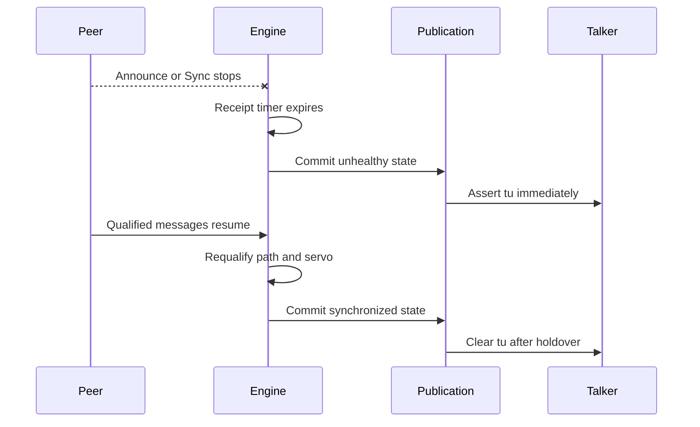

<!-- SPDX-FileCopyrightText: 2026 Kebag Logic -->
<!-- SPDX-License-Identifier: CERN-OHL-W-2.0 -->

# Grandmaster loss and recovery

One fabric owner handles every product transition.

No parallel state mirror participates.

<!-- milan-feature-status:start -->
| Feature ID | Status | Canonical value |
|---|---|---|
| `crf.media-clock-consumption` | `implemented` | - |
| `gptp.fabric-product-owner` | `implemented` | - |
| `notifications.change-events` | `implemented` | - |
<!-- milan-feature-status:end -->

## Contents

- **[Detection](#detection)** -- Identify each independent health transition.
- **[Ordering](#ordering)** -- Publish state without one-frame health leaks.
- **[Recovery timeline](#recovery-timeline)** -- Follow loss through renewed synchronization.
- **[Recovery bound](#recovery-bound)** -- State the 5 s bound and derive it.
- **[Media behavior](#media-behavior)** -- Continue transport while reporting uncertainty.
- **[Option-off behavior](#option-off-behavior)** -- Preserve honest ownerless failure values.
- **[Verification](#verification)** -- Exercise timeouts, ordering, and recovery.

## Detection

No grandmaster-loss message exists.

Receipt state machines infer each transition.

| Observation | Engine result | Public result |
|---|---|---|
| Announce timeout | Re-run best-master selection | GM and path may change |
| Sync timeout | Clear synchronized state | `tu` asserts |
| Pdelay failure | Clear `asCapable` | Capability becomes false |
| Better Announce | Select new priority vector | GM and parent change |
| Valid Sync pair | Update servo | Synchronization may recover |

A known GM may remain unsynchronized.

Consumers must examine both identity and health.

## Ordering

Microcode stages every publication field first.

`pub_commit_o` exposes one complete tuple.

The wrapper copies that tuple atomically.

`pub_disc_o` identifies discontinuity before copying.

Clock validity consumes that live pulse.

Therefore `tu` asserts on the commit edge.

No frame sees new identity with old health.

PHC settime and adjtime also trigger holdover.

Holdover lasts at least 0.25 seconds.

## Recovery timeline

Recovery requires protocol qualification.

Software writes cannot manufacture it.

## Recovery bound

The owner fixed this bound on 2026-09-23.

The decision is on [#117](https://github.com/kebag-logic/milan-fpga/issues/117#issuecomment-5795898094).

| Quantity | Value |
|---|---|
| Starts | The grandmaster's return: its first Announce or Sync on the link |
| Ends | The port reports `asCapable` and synchronized state |
| Bound | 5 s |
| Media | Recovers within one further stream restart |

The derivation sums three terms.

| Term | Value | Derivation |
|---|---|---|
| Announce receipt timeout | 3 s | 3 announce intervals of 1 s |
| Sync receipt timeout | 0.375 s | 3 sync intervals of 125 ms |
| Margin | 1.625 s | the remainder to the stated bound |
| **Total** | **5 s** | 3 + 0.375 + 1.625 |

Both timeouts use the Milan intervals.

The margin is not assigned to one mechanism.

Silicon evidence waits for `tu` to clear as well.

That includes the holdover of at least 0.25 s.

The [#117 findings](../findings/117_GPTP_SILICON_EVIDENCE.md#step-3-gm-loss-and-return) record six measured cycles.

## Media behavior

Licensed streams continue during transitions.

Every talker reports uncertainty through `tu`.

INTERNAL keeps its free-running media clock.

CRF selection activates the MMCM servo.

CRF unlock moves that servo into HOLDOVER.

The held trim keeps audio samples moving.

Grid alignment continues while TDM markers continue.

Deselecting CRF disengages both steering loops.

Publication changes feed notification scheduling.

Consumers receive one coherent state generation.

## Option-off behavior

Option-off hardware exists only for verification.

It has no protocol or PHC owner.

| Output | Defined value |
|---|---|
| GM, parent, path | Zero |
| Peer delay | Zero |
| Synchronization | False |
| `asCapable` | False |
| `tu` | True |

Legacy writes remain acknowledged and ineffective.

## Verification

| Test | Covered transition |
|---|---|
| Donor engine suite | Timeouts, selection, servo recovery |
| `gptp_shadow` | Atomic state and immediate discontinuity |
| `clkvalid` | Holdover, steps, and option-off values |
| `milan_dp` | Public CSR and protocol consumers |
| `media_grid_align` | Alignment, watchdog, and recovery |
| `tsn_fuzz` | Storms, malformed pairs, drought recovery |

Physical acceptance against the reference peer remains issue #117.

Its switch-cycle measurements are in the [findings](../findings/117_GPTP_SILICON_EVIDENCE.md).

Silicon grid comparison remains issue #74.

Historical timelines remain [archived](../history/v1/design/GM_LOSS_RECOVERY.md).
