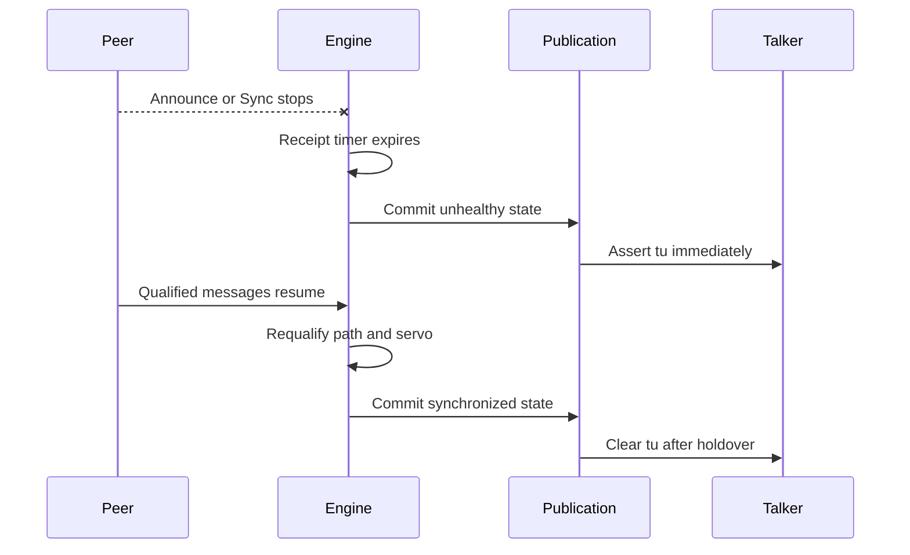

<!-- SPDX-FileCopyrightText: 2026 Kebag Logic -->
<!-- SPDX-License-Identifier: CERN-OHL-W-2.0 -->

# Grandmaster loss and recovery

One fabric owner handles every product transition.

No parallel state mirror participates.

<!-- milan-feature-status:start -->
| Feature ID | Status | Canonical value |
|---|---|---|
| `crf.media-clock-consumption` | `implemented` | - |
| `gptp.fabric-product-owner` | `implemented` | - |
| `notifications.change-events` | `implemented` | - |
<!-- milan-feature-status:end -->

## Contents

- **[Detection](#detection)** -- Identify each independent health transition.
- **[Ordering](#ordering)** -- Publish state without one-frame health leaks.
- **[Recovery timeline](#recovery-timeline)** -- Follow loss through renewed synchronization.
- **[Recovery bound](#recovery-bound)** -- State the 5 s bound and derive it.
- **[Media behavior](#media-behavior)** -- Continue transport while reporting uncertainty.
- **[Option-off behavior](#option-off-behavior)** -- Preserve honest ownerless failure values.
- **[Verification](#verification)** -- Exercise timeouts, ordering, and recovery.

## Detection

No grandmaster-loss message exists.

Receipt state machines infer each transition.

| Observation | Engine result | Public result |
|---|---|---|
| Announce timeout | Re-run best-master selection | GM and path may change |
| Sync timeout | Clear synchronized state | `tu` asserts |
| Pdelay failure | Clear `asCapable` | Capability becomes false |
| Better Announce | Select new priority vector | GM and parent change |
| Valid Sync pair | Update servo | Synchronization may recover |

A known GM may remain unsynchronized.

Consumers must examine both identity and health.

## Ordering

Microcode stages every publication field first.

`pub_commit_o` exposes one complete tuple.

The wrapper copies that tuple atomically.

`pub_disc_o` identifies discontinuity before copying.

Clock validity consumes that live pulse.

Therefore `tu` asserts on the commit edge.

No frame sees new identity with old health.

PHC settime and adjtime also trigger holdover.

Holdover lasts at least 0.25 seconds.

## Recovery timeline

Recovery requires protocol qualification.

Software writes cannot manufacture it.

## Recovery bound

The owner fixed this bound on 2026-09-23.

The decision is on [#117](https://github.com/kebag-logic/milan-fpga/issues/117#issuecomment-5795898094).

| Quantity | Value |
|---|---|
| Starts | The grandmaster's return: its first Announce or Sync on the link |
| Ends | The port reports `asCapable` and synchronized state |
| Bound | 5 s |
| Media | Recovers within one further stream restart |

The derivation sums three terms.

| Term | Value | Derivation |
|---|---|---|
| Announce receipt timeout | 3 s | 3 announce intervals of 1 s |
| Sync receipt timeout | 0.375 s | 3 sync intervals of 125 ms |
| Margin | 1.625 s | the remainder to the stated bound |
| **Total** | **5 s** | 3 + 0.375 + 1.625 |

Both timeouts use the Milan intervals.

The margin is not assigned to one mechanism.

Silicon evidence waits for `tu` to clear as well.

That includes the holdover of at least 0.25 s.

The [#117 findings](../findings/117_GPTP_SILICON_EVIDENCE.md#step-3-gm-loss-and-return) record six measured cycles.

## Media behavior

Licensed streams continue during transitions.

Every talker reports uncertainty through `tu`.

INTERNAL keeps its free-running media clock.

CRF selection activates the MMCM servo.

CRF unlock moves that servo into HOLDOVER.

The held trim keeps audio samples moving.

Grid alignment continues while TDM markers continue.

Deselecting CRF disengages both steering loops.

Publication changes feed notification scheduling.

Consumers receive one coherent state generation.

### Media re-base on a PHC step

Each step of the [step policy](TIME_SYNC.md#step-policy) is one counted event.

Issue #387 decided its media reaction.

| Element | Decided reaction to one step | This tree |
|---|---|---|
| `tu` | Rises on the step; clears after at least 0.25 s of holdover | Yes: `KL_ptp_clock_validity` takes the plane's step pulse |
| Render setpoint stage (#386) | Re-centres in "one bounded, counted event" (decision part b) | Yes: `render_recentre_p_w` takes the step (`media_rebase_p_w`), and the stage re-centres at the next PDU end, counted in its recentre tally. A grandmaster identity change is no longer a trigger of its own. The gmstep leg counts one re-base, 132 cycles after the plane's step pulse at each of its 42 feed delays |
| Media grid aligner's phase reference | "the render elastic stage (#386) and the media grid aligner's phase reference re-centre in one bounded, counted event" (decision part b) | No re-centre: `KL_media_grid_align.sv` has no PHC or step input. Under CRF selection a step reaches it only through the CRF-steered grid. The CRF servo discards the window a local PHC step lands in (#539); what still reaches that grid is a policy-legal slew (#545) and the talker's own step (#546). By [owner decision on #387](https://github.com/kebag-logic/milan-fpga/issues/387#issuecomment-5810378282) the aligner gets no re-centre of its own: part b is met by keeping the step out of its reference, #539 isolating it at the servo and #545 and #546 closing the remaining paths. Option B, an explicit counted re-lock, is revisited only if #545 or #546 cannot close its path |
| Packet NCO | Not named by the decision | No PHC or step input |
| CRF servo | Keeps its window guard | Yes: `KL_mmcm_drp_servo` discards the window a local PHC step lands in, trim and integrator held, and counts it in `MCSRV_STAT[15:10]` (#539). It still discards a window above 1024 ppm. A policy-legal 100 us slew still moves its integrator (#545), and so does the talker's own step (#546) |
| Outgoing `mr` (IEEE 1722-2016 4.4.4.3) | Toggles once | Yes: `mcr_restart_p_w` takes the step whatever the media clock source. The gmstep leg sees one toggle, first sent 75 to 116 cycles after the step pulse over its 42 feed delays |
| Talker MEDIA_RESET (Milan Table 5.4) | Counts that one toggle | Yes: `KL_talker_diag_ctx` counts the `mr` bit each PDU carried. The gmstep leg reads one, and none between the commit and the step |
| A step while an `mr` restart is pending | Merges with it: exactly one restart, never a cancellation, and the step's MEDIA_RESET is still counted (ruling 5802264260 item 2) | Yes: `KL_media_clock_restart` sets each stream's target to the complement of the level that stream stamps, so a second request while one is pending changes nothing. A request after the stream stamped the first is a new restart, sent once the first has held eight PDUs. `tkdiag` T17 grades both: one toggle and one MEDIA_RESET on the stream where the step merged, two on the stream that had already stamped the first request |
| Licensed streams | Keep streaming (REQ-PTP-08) | Yes: `tu` gates no emission |

The render stage is timed from accept, not presentation time.

So a step leaves its fill where it was.

A grandmaster change that steps counts one re-base.

It is the step's; the identity change adds none.

Whether a restart is pending depends on one stream's hold.

So the restart target is per stream since #387.

The `milan_dp` gmstep leg drives one 1.5 s grandmaster step.

It grades these rows:

- `tu`: set at the commit, held past the step's holdover.
- Render stage: one re-base, counted right after the step.
- Render law: every push leaves the #386 target fill.
- `mr` and MEDIA_RESET: one each, and both belong to the step.
- Streams: the talker keeps streaming and the listener stays locked.

It does not grade these:

- The grid aligner: the leg holds the TDM clocks.
- The CRF servo: its DRP answers zero. `Vphc_step` grades its step discard (#539).
- An lwSRP licence: the escape bit opens the talker.
- A step during a pending restart: `tkdiag` T17 grades it.
- The physical re-base: the #117 bench measures it.

Three negative controls join it in the default sweep:

- no `mr` toggle on the step;
- a second re-base on the identity change;
- no re-base on the step.

Each fails a named check of the leg.

`make gmstep-mutants` plants the whole inventory.

## Option-off behavior

Option-off hardware exists only for verification.

It has no protocol or PHC owner.

| Output | Defined value |
|---|---|
| GM, parent, path | Zero |
| Peer delay | Zero |
| Synchronization | False |
| `asCapable` | False |
| `tu` | True |

Legacy writes remain acknowledged and ineffective.

## Verification

| Test | Covered transition |
|---|---|
| Donor engine suite | Timeouts, selection, servo recovery |
| `gptp_shadow` | Atomic state and immediate discontinuity |
| `clkvalid` | Holdover, steps, and option-off values |
| `milan_dp` | Public CSR and protocol consumers |
| `milan_dp` gmstep | One 1.5 s grandmaster step under CRF selection: `tu`, the render re-base and law, `mr`, MEDIA_RESET, stream continuity; three negative controls in the sweep |
| `tkdiag` | A restart request on a pending one merges: one toggle, never a cancellation (T17) |
| `media_grid_align` | Alignment, watchdog, and recovery |
| `tsn_fuzz` | Storms, malformed pairs, drought recovery |

Physical acceptance against the reference peer remains issue #117.

Its switch-cycle measurements are in the [findings](../findings/117_GPTP_SILICON_EVIDENCE.md).

Silicon grid comparison remains issue #74.

Historical timelines remain [archived](../history/v1/design/GM_LOSS_RECOVERY.md).
