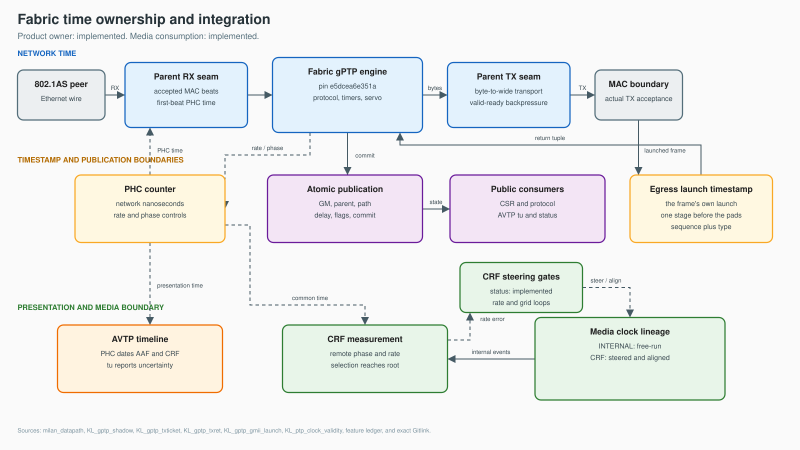

<!-- SPDX-FileCopyrightText: 2026 Kebag Logic -->
<!-- SPDX-License-Identifier: CERN-OHL-W-2.0 -->

# Fabric gPTP plane

Fabric gPTP owns product time synchronization.

This page defines parent integration.

<!-- milan-feature-status:start -->
| Feature ID | Status | Canonical value |
|---|---|---|
| `gptp.fabric-product-owner` | `implemented` | - |
<!-- milan-feature-status:end -->

## Contents

- **[Choose a reader](#choose-a-reader)** — Follow responsibility-specific guidance.
- **[Ownership](#ownership)** — Identify the only product time owner.
- **[Integration seams](#integration-seams)** — Connect receive, transmit, PHC, and publication.
- **[Timestamp boundaries](#timestamp-boundaries)** — Preserve frame and timestamp pairing.
- **[Configuration](#configuration)** — Generate one matching engine image.
- **[Diagnostics](#diagnostics)** — Distinguish silence from internal refusal.
- **[Verification](#verification)** — Reproduce donor and parent evidence.

## Choose a reader

| Reader | Parent guide | Engine guide |
|---|---|---|
| Project manager | [Manager](../guides/gptp/MANAGER.md) | [`MANAGER.md`](https://github.com/Mister-M-alt/FPGA-gPTP/blob/f5ba2db636112d1292671b49a047c9fd9daacf7e/docs/MANAGER.md) |
| System integrator | [Integrator](../guides/gptp/SYSTEM_INTEGRATOR.md) | [`INTEGRATION.md`](https://github.com/Mister-M-alt/FPGA-gPTP/blob/f5ba2db636112d1292671b49a047c9fd9daacf7e/docs/INTEGRATION.md) |
| HDL developer | [HDL developer](../guides/gptp/HDL_DEVELOPER.md) | [`HDL_DEVELOPER.md`](https://github.com/Mister-M-alt/FPGA-gPTP/blob/f5ba2db636112d1292671b49a047c9fd9daacf7e/docs/HDL_DEVELOPER.md) |
| Test developer | [Test developer](../guides/gptp/TEST_DEVELOPER.md) | [`TEST_DEVELOPER.md`](https://github.com/Mister-M-alt/FPGA-gPTP/blob/f5ba2db636112d1292671b49a047c9fd9daacf7e/docs/TEST_DEVELOPER.md) |

Parent guides own integration behavior.

Engine guides own imported behavior.

## Ownership

- Product configurations enable `GPTP_PLANE_EN_P`.
- The builder rejects product configurations without it.
- `KL_gptp_shadow` wraps the imported engine.
- The engine owns protocol decisions and servo arithmetic.
- The parent owns transport, PHC, and public consumers.
- One atomic bank supplies every public consumer.
- Option-off elaboration exists only for verification.
- That elaboration publishes safe failure values.

Normative behavior remains in [`REQUIREMENTS.md`](../../REQUIREMENTS.md).

## Integration seams

| Seam | Parent boundary | Contract |
|---|---|---|
| RX | Accepted MAC receive beats | Observe only; classify `0x88F7`; never backpressure |
| TX | Dedicated control-lane input | Hold complete frames through downstream stalls |
| PHC | `timestamp_counter` controls | Apply engine rate and phase changes |
| Publication | CSR and protocol consumers | Sample one committed generation |

Every functional engine block uses `axis_clk`.

Reset is synchronous and active-low.

### Receive

- A beat transfers when valid and ready coincide.
- The tap never changes receive readiness.
- Accepted gPTP frames enter one frame FIFO.
- First-beat PHC timestamps use a side FIFO.
- Frame commits push exactly one timestamp.
- Full timestamp storage sheds complete frames.

### Transmit

- Engine bytes become one wide control stream.
- Downstream readiness controls every accepted beat.
- A boundary stamper observes the actual MAC transfer.
- Returned tags include sequence and message type.
- Both tags select the outstanding transmission.

### PHC and publication

- Engine rate writes become the PHC adjustment level.
- Engine phase writes remain single-cycle pulses.
- `pub_commit_o` exposes one complete state generation.
- `pub_disc_o` exposes pre-commit health discontinuities.
- Consumers never combine different publication generations.

## Timestamp boundaries

| Direction | Capture point | Pairing key | Root evidence |
|---|---|---|---|
| Ingress | First accepted tap beat | Delivered-frame position | `gptp_shadow` suite |
| Egress | First accepted MAC-boundary beat | Sequence plus message type | `gptp_shadow` suite |

Ingress correction belongs to the tap boundary.

Physical calibration remains tracked by issue #64.

The engine receives event-specific timestamps only.

## Configuration

The builder requires one `gptp` configuration section.

It generates one ROM per hardware configuration.

Inputs include these values:

- Station MAC address.
- Announced priority one.
- Actual datapath clock frequency.

`GPTP_UCODE_HEX_P` names the generated ROM.

`CLK_HZ_P` must match `axis_clk`.

## Diagnostics

| Counter | Owner | Public register |
|---|---|---|
| Tap drops | `KL_gptp_shadow` | `0x7E8[31:16]` |
| Parser drops | `KL_gptp_engine` | `0x7E8[15:0]` |
| Event drops | `KL_gptp_engine` | `0x7EC[15:0]` |

Counters wrap naturally.

Read deltas between observations.

Option-off elaboration reports zeros.

## Verification

| Boundary | Command | Main evidence |
|---|---|---|
| Imported engine | `make -C gptp-processor` | Protocol, servo, parser, serialization |
| Parent transport | `make -C tb/verilator/gptp_shadow` | RX, TX, pairing, publication |
| Closed-loop PHC | `make -C tb/verilator/gptp_plane` | Servo controls real counter |
| Product integration | `make -C tb/verilator/milan_dp` | MAC, CSR, protocol consumers |
| Wire models | `make -C tb/verilator/tsn_fuzz ptp` | Message fields and state campaigns |

Read the [traceability table](../traceability/ieee8021as.md).

Historical integration detail remains [archived](../history/v1/design/GPTP_PLANE.md).
