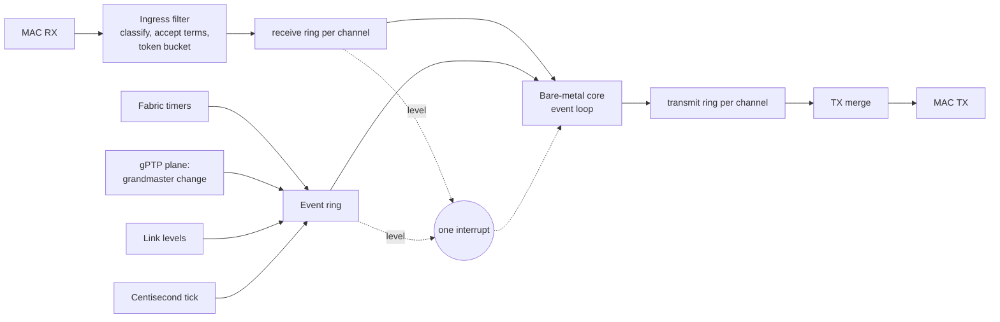
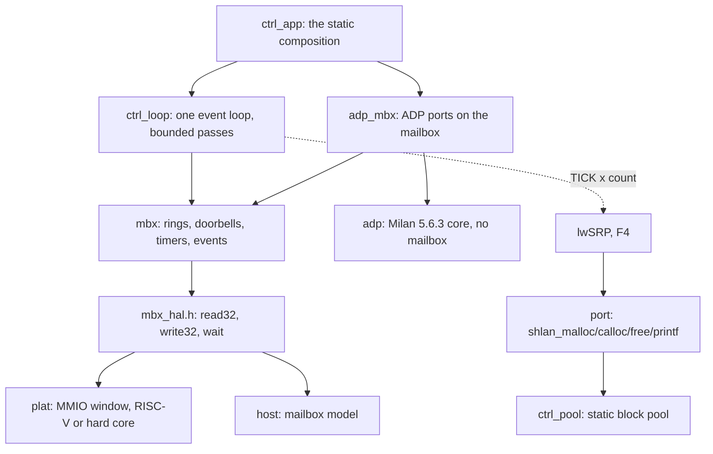

<!-- SPDX-License-Identifier: CERN-OHL-W-2.0 -->
# Packet mailbox split: the contract, the HAL and the ADP slice (#665 lane F0)

Status: **F0 implemented behind a default-off build switch.** The all-fabric
build is unchanged and remains the shipping image. This page is the design
of the contract between the fabric and the bare-metal control-plane firmware
of milestone 13 (Mark II: out-of-fabric slow path), as the owner decisions of
2026-10-05 on [#640](https://github.com/kebag-logic/milan-fpga/issues/640)
and the directive on [#665](https://github.com/kebag-logic/milan-fpga/issues/665)
describe it. The numbers live in one place, the generated
[reference page](../reference/MAILBOX_CONTRACT.md); this page explains them.

## Contents

- **[What moves, and what the fabric keeps](#what-moves-and-what-the-fabric-keeps)** -- The protocols the bare-metal core runs, what stays in the fabric, and the picture of rings, events and the one interrupt between them.
- **[One contract, four outputs](#one-contract-four-outputs)** -- The YAML that is the only place a number is written, the four files generated from it, and the drift, cross-output and planted-defect checks.
- **[Byte order](#byte-order)** -- Fixed bit positions for every 32-bit word, little-endian lanes for frame bytes, network order inside a frame.
- **[Rings, records and events](#rings-records-and-events)** -- The record shapes, the doorbells, the coalescing rule that keeps the event ring from ever dropping the last state of a source, and the interrupt levels.
- **[The ingress filter](#the-ingress-filter)** -- Classification, the accept terms per channel with their clauses, the token bucket, and the MRPDU form the SRP channel hands lwSRP.
- **[Bus adapters and the hard core](#bus-adapters-and-the-hard-core)** -- Wishbone for the on-chip RISC-V and AXI4-Lite for a hard core, neither adding anything to the contract.
- **[The firmware: bare metal first](#the-firmware-bare-metal-first)** -- No OS, no heap: the three-function bus port, lwSRP's port layer on a static pool, the bounded event loop and its tick fan-out, and protocols as ports-and-adapters modules.
- **[The ADP slice](#the-adp-slice)** -- Milan v1.2 5.6.3 over the mailbox, fields from the entity model, the tag rule for raced expiries, and the service-latency bound of every response path.
- **[Verification](#verification)** -- The suite through both adapters, the same checks on the host model, the co-simulation, the host tests, the reused processor walk and the planted defects.
- **[Default build](#default-build)** -- What the switch adds when on, and the gateware-export comparison that shows every shipped config unchanged when off.
- **[Measured area](#measured-area)** -- The switch-on skeleton placed and routed out of context, per block, against the #640 estimate, with the levers and the recipe.
- **[Open items](#open-items)** -- The datapath tap, the listener's ADP terms, lwSRP's transmit hook, the CPU-cycle measurement and MMRP.

## What moves, and what the fabric keeps

The bare-metal core runs ADP, ACMP, MAAP, SRP (through lwSRP) and AECP. The
fabric keeps framing and timestamps, the gPTP plane, the timers that carry
hard deadlines, and an ingress filter in front of the core. The two exchange
frames through packet mailboxes: block-RAM rings, a doorbell per ring, one
interrupt, 32-bit accesses only and no DMA.



F0 builds the contract, its generator, the fabric skeleton, the HAL with
lwSRP's port layer, the host model and harness, and ADP as the first slice
through all of them. The datapath tap that feeds the skeleton comes with the
protocol lanes that need it (F2 to F5).

## One contract, four outputs

[`sw/mailbox/mailbox.yaml`](../../sw/mailbox/mailbox.yaml) is the only place
a register offset, a field position, a ring size or a filter rule is written.
[`sw/mailbox/gen_mailbox.py`](../../sw/mailbox/gen_mailbox.py) emits:

| Output | What it carries |
|---|---|
| [`hdl/milan/mailbox/KL_mbx_pkg.sv`](../../hdl/milan/mailbox/KL_mbx_pkg.sv) | every constant as `MBX_<name>_C`, and the per-channel tables the RTL indexes at run time |
| [`hdl/milan/mailbox/KL_mbx.sv`](../../hdl/milan/mailbox/KL_mbx.sv) | the fabric skeleton: ports, register decode, one ring per direction per channel |
| [`sw/firmware/ctrl/mbx/mbx_contract.h`](../../sw/firmware/ctrl/mbx/mbx_contract.h) | the same constants as `MBX_<name>` for C |
| [`docs/reference/MAILBOX_CONTRACT.md`](../reference/MAILBOX_CONTRACT.md) | the reference tables, and a constant table the self-test reads back |

The generator refuses a contract that cannot be built: overlapping fields, a
ring that is not a power of two or overlaps another, two channels that claim
one EtherType, a register outside its block, a filter field past the frame,
a read-only field the skeleton has no fabric source for.

`--check` regenerates every output in memory and fails on any byte of drift.
`--crosscheck` reads the three constant carriers back by name and fails on a
field mismatch between them, whatever produced it. `--selftest` plants a
mismatch into each output (8 arms) and a defect into the YAML (7 arms), and
requires each to be caught, after a clean positive control. The leaves (`KL_mbx_ring`, `KL_mbx_rx`, `KL_mbx_tx`,
`KL_mbx_evt`) and the two bus adapters are written by hand against the
package, so a contract change reaches them through the constants.

Versioning: a change that moves or resizes anything raises `major`; one that
only adds raises `minor`. The fabric publishes both in `ID`, and the
firmware's `mbx_open()` refuses a major it was not built against.

## Byte order

Every register, record header word and event word is one 32-bit value whose
fields sit at fixed bit positions, so its meaning never depends on the host's
byte order. Frame bytes travel four to a ring word in little-endian lanes:
frame byte k is ring word k/4, bits 8*(k%4)+7 down to 8*(k%4). Wire fields
inside a frame keep network order, and the firmware's wire layer
([`wire.h`](../../sw/firmware/ctrl/wire/wire.h)) reads them byte by byte. A
big-endian hard core reads the same values as the RISC-V.

## Rings, records and events

Each ring has one producer and one consumer, a 16-bit head and tail counted
in words, and storage the producer writes only past the consumer's tail.

- **RX record:** two header words (length, interface, kind; arrival time in
  NOW_MS) then the frame, FCS stripped. The fabric writes the payload words,
  then the header, then moves RX_HEAD past the whole record, so the core never
  reads a partial one.
- **TX record:** the same shape, written by the core, committed by TX_HEAD.
  The TX merge checks a record before a byte leaves and flushes a ring to
  TX_HEAD on a malformed one, because a length that cannot be trusted leaves
  no next record to find. TX_TAIL moves only after the last byte has left.
- **Event record:** four words. The sources are a link level change, a
  grandmaster change published by the gPTP plane, a fabric timer expiry with
  the tag of the arm it belongs to, and the centisecond tick.

Every event source is **coalesced**: a source holds at most one unposted
record and posts its state at posting time, only into four free words. The
ring therefore cannot overflow and drop the last state of anything. A link
that flaps while the ring is full posts its level once; ticks counted while
their record waits are posted as one record with the count.

The doorbells are the counter writes themselves: RX_TAIL releases RX space,
TX_HEAD commits TX records, EVT_TAIL releases events. The one interrupt is
the OR of the enabled levels (an receive ring or the event ring not empty) and a
sticky error, so a service pass that drains the rings leaves the line low.

## The ingress filter

A frame is classified by EtherType, and by AVTP subtype where the channel
names one, into at most one channel. It is stored only when its channel is
open, one of the channel's accept terms holds, it fits the channel's largest
frame and the free ring space, and the channel's token bucket holds a token.
A frame for no channel, or one no term accepts, is not addressed to this
entity and is dropped uncounted; a size or space drop counts in RX_DROP and a
rate drop in RATE_DROP. Untagged frames only.

| Channel | Passes | Clause |
|---|---|---|
| `adp` | ENTITY_DISCOVER for entity_id 0 or this entity | IEEE 1722.1-2021 6.2; Milan v1.2 5.6.3.1 |
| `acmp` | a command or response naming this entity as talker or listener | IEEE 1722.1-2021 8.2 |
| `aecp` | a command whose target_entity_id is this entity | IEEE 1722.1-2021 9.2 |
| `maap` | a PROBE, DEFEND or ANNOUNCE overlapping this entity's range | IEEE 1722-2016 Annex B |
| `srp` | every MSRP and MVRP PDU | IEEE 802.1Q-2018 35.2.2, 11.2 |

The SRP record carries the whole frame, so the MRPDU (ProtocolVersion first)
is frame bytes 14 onward: the contiguous buffer lwSRP's `mrp_rx()` and
`mrpdu_parse()` take, with the record's interface as `port_id`.

## Bus adapters and the hard core

`KL_mbx` answers every host request one cycle later on a minimal port.
[`KL_mbx_wb`](../../hdl/milan/mailbox/KL_mbx_wb.sv) presents it to the
on-chip RISC-V over Wishbone; [`KL_mbx_axil`](../../hdl/milan/mailbox/KL_mbx_axil.sv)
presents the same window to a hard core over AXI4-Lite. Neither adds to the
contract: 32-bit accesses, the refusal of a partial byte strobe (counted in
BUS_ERR) and every register's meaning are `KL_mbx`'s. The mailbox suite runs
every check through both.

## The firmware: bare metal first

The firmware ([`sw/firmware/ctrl`](../../sw/firmware/ctrl/README.md)) has no
OS, no heap and no threads (the directive of 2026-10-05, #665 comment
5992455815). It is portable C11 in layers, each reaching the next only
through a small interface:



- **The bus port** is three functions (`mbx_hal.h`): a 32-bit read, a 32-bit
  write, and a wait that may return early. The MMIO implementation takes the
  window base from the SoC's generated memory map (`CTRL_MBX_BASE`); the host
  implementation drives the mailbox model and counts every access.
- **lwSRP's port layer** is provided here, with lwSRP's own prototypes:
  `shlan_malloc`, `shlan_calloc` and `shlan_free` on a static block pool, and
  `shlan_printf` on a debug sink with one bounded line buffer. The pool is
  carved at boot from an arena the platform declares statically; an
  allocation takes the smallest class with a free block, a refusal is counted,
  and a double free or a foreign pointer is refused rather than corrupting a
  free list.
- **The event loop** takes at most a fixed number of events and of RX records
  per channel per pass, gives every module one poll, and sleeps when a pass
  finds nothing. A TICK event's count is fanned out to every registered
  centisecond consumer, lwSRP's `shlan_timer_tick()` among them, so its
  leave, LeaveAll and periodic timers run on fabric time and lose no tick
  when the core is late. Register `shlan_timer_tick` once, not lwSRP's
  `mrp_tick()` per application: `mrp_tick()` calls the same global tick, so
  one registration per MRP application would advance every timer that many
  times per centisecond.
- **A protocol is a ports-and-adapters module**, as lwSRP is. The ADP core
  ([`adp.h`](../../sw/firmware/ctrl/adp/adp.h)) knows no mailbox: it calls a
  send port, one timer per interface, the gPTP pair, the link level and a
  seed. The mailbox adapter maps those onto the driver; a test maps them onto
  fakes.

`ctrl_loop_open()` brings the mailbox up in the contract's order: check the
contract, write the filter's entity_id, enable the interrupt causes, start
the tick when a centisecond consumer is bound, and only then open the bound
channels.

## The ADP slice

One instance per AVB interface implements Milan v1.2 5.6.3 over the IEEE
1722.1-2021 6.2 ADPDU:

- ENTITY_AVAILABLE on its schedule: a random TMR_DELAY (0 to 2 s at startup
  with the link up, 5.6.3.5.2; 0 to 4 s otherwise), the frame, then
  TMR_ADVERTISE (5 s, 5.6.3.5.9), with available_index incremented after each
  frame sent and reset to 0 by ENTITY_DEPARTING (6.2.2.15);
- the ENTITY_DISCOVER answer for entity_id 0 or this entity, in WAITING
  (5.6.3.1, 5.6.3.5.4);
- the re-advertise on a grandmaster change (5.6.3.5.7);
- ENTITY_DEPARTING on SHUTDOWN (5.6.3.5.8, 5.6.3.5.11), never on a link
  change (5.6.3.5.6, 5.6.3.5.10).

The ADPDU fields come from the entity model through the same derivations the
fabric's engine is fed from:
[`adp_entity.py`](../../sw/firmware/ctrl/adp/adp_entity.py) reads the
builder's ADP identity and shape and the processor's `ADP_ENTITY_CAPS_C`, and
the host test compares every field, for every shipped config, with what the
fabric is programmed and compiled with.

The fabric timer slot of an interface carries every arm with a fresh tag. An
expiry already in the event ring when the firmware stopped or re-armed the
slot carries the old tag and is discarded by it: the mailbox form of Table
5.51's "x" cells.

The listener's discovery machine (5.6.4) feeds ACMP and belongs to F3. Its
ENTITY_AVAILABLE and ENTITY_DEPARTING from bound talkers need an accept term
the ADP channel does not carry yet; adding one is a minor contract change.

### Service latency, per response path

The D3 ruling on #640 asks each lane to state and test a deterministic upper
bound per response path. Every ADP input is handled inside the service pass
that takes it, with a fixed number of mailbox accesses and no wait on the
fabric. An input that arrives while a pass runs waits for that pass to end,
so its response is committed within two passes.

| Path | Mailbox accesses in the pass | Response |
|---|---:|---|
| RCV_ADP_DISCOVER | 31 | TMR_DELAY armed |
| TMR_DELAY expiry | 39 | ENTITY_AVAILABLE committed, TMR_ADVERTISE armed |
| TMR_ADVERTISE expiry | 11 | TMR_DELAY armed |
| GM_CHANGE | 11 | TMR_DELAY armed |
| LINK_UP / LINK_DOWN | 11 / 9 | TMR_DELAY armed / timer stopped |
| SHUTDOWN | 29 | ENTITY_DEPARTING committed |

The bounds are `ADP_MBX_LAT_*` in [`adp_mbx.h`](../../sw/firmware/ctrl/adp/adp_mbx.h),
with their derivation. The host test counts every access of each path on the
model and fails one that exceeds its bound. The tightest ADP timing Milan
sets is the 0 to 4 s TMR_DELAY against a 20 s valid_time; two passes of at
most 40 accesses add microseconds on any bus. A measurement in CPU cycles on
the shipping core needs the switch-on SoC in the CPU simulation and is left
open (see [Open items](#open-items)).

## Verification

| Evidence | What it shows |
|---|---|
| [`tb/verilator/mbx`](../../tb/verilator/mbx/README.md), `make` | 120 checks through the Wishbone adapter and the same 120 through the AXI4-Lite adapter: register masks, partial-strobe refusal, every filter rule, drops that never touch an unread record, the rate limiter, the TX merge and its refusals, timers, every event source and its coalescing, the GM snapshot, the interrupt levels |
| the same suite on the host model | the 120 checks the RTL passes, run on the model the firmware tests rely on, so the model answers to the RTL's expectations |
| the co-simulation (`make run-cosim`) | the firmware on the RTL through Wishbone and on the model, one scenario: identical frames at identical NOW_MS |
| [`sw/firmware/ctrl/test`](../../sw/firmware/ctrl/README.md) | the port layer, the driver, the loop, the ADP core and adapter, the latency bounds, the entity fields per shipped config, a freestanding RV32I build with no heap symbol, and (given a checkout) lwSRP's own MRP core on the port layer |
| the processor's ADP walk, reused | 36 cells of the processor suite's own Table 5.51 transcription and its own frame builder, cut from the pinned submodule at build time, drive the firmware through the model |
| planted defects | 27 RTL arms (`tb/verilator/mbx/mutants.py`, four of them in the default `make`) and 25 firmware arms (`--self-test`), each caught by the check it names |

## Default build

`--ctrl-mailbox` in [`milan_soc.py`](../../sw/litex/milan_soc.py) is off by
default. Off, the SoC adds no source, no instance, no bus region, no CSR bank
and no interrupt. On, it adds the seven mailbox sources, `KL_mbx` behind
`KL_mbx_wb` in the IO region, a CSR bank pinned below the existing observer's
page so no existing bank moves, and one interrupt. The datapath side is held
idle in F0.

The proof is a gateware export (no Vivado) of every shipped config, with the
base and the head `milan_soc.py`, compared after removing the run's
timestamps, output paths and LiteX's comment-only hierarchy tree, whose order
varies between runs. All 22 generated files compare equal for both AX7101
configs at their shipping arguments. This LiteX checkout refuses the three
Arty configs at their 83.333 MHz system clock, at the base exactly as at the
head, so they are compared at 100 MHz instead, where all 22 files compare
equal too.

## Measured area

The switch-on skeleton, `KL_mbx` behind `KL_mbx_wb` wired as the SoC wires
them (`tb_mbx_top` with `HOST_P=0`), out of context on `xc7a100tfgg484-2` at
the 100 MHz system clock, Vivado 2026.1 default directives, synthesized,
placed and routed (2026-10-05, the lane's head):

| Block | LUT | FF | RAMB36 | RAMB18 |
|---|---:|---:|---:|---:|
| `KL_mbx_rx` (filter, buckets, RX writer) | 1,006 | 994 | 0 | 0 |
| `KL_mbx_evt` (16 timer slots, poster, tick) | 711 | 978 | 0 | 0 |
| `KL_mbx_tx` (TX merge) | 678 | 256 | 0 | 0 |
| `KL_mbx` registers, decode, read mux | 276 | 484 | 0 | 0 |
| the eleven rings (flattened into `KL_mbx`) | | | 1 | 10 |
| `KL_mbx_wb` | 66 | 1 | 0 | 0 |
| **Total** | **2,756** | **2,713** | **1** | **10** |

All nets routed, WNS +0.311 ns at 10 ns, no DSP. The rows sum to 2,737 LUT:
the remainder is logic of the flattened rings and LUTs Vivado combined across
the hierarchy. The eleven rings (ten channel rings and the event ring) are one
block RAM each: the SRP receive ring the RAMB36, every other a RAMB18. There is no
bar yet (#665). It is above the
#640 estimate of 1,500 to 2,000 LUT for the added fabric; the obvious levers
are the timer bank (sixteen 48-bit slots in flip-flops, scanned one per clock,
which fits distributed RAM) and the filter's per-term 64-bit field registers,
which one shared field register per frame would replace.

```tcl
read_verilog -sv [list hdl/milan/mailbox/KL_mbx_pkg.sv hdl/milan/mailbox/KL_mbx_ring.sv \
  hdl/milan/mailbox/KL_mbx_rx.sv hdl/milan/mailbox/KL_mbx_tx.sv hdl/milan/mailbox/KL_mbx_evt.sv \
  hdl/milan/mailbox/KL_mbx.sv hdl/milan/mailbox/KL_mbx_wb.sv hdl/milan/mailbox/KL_mbx_axil.sv \
  tb/verilator/mbx/tb_mbx_top.sv]
synth_design -mode out_of_context -top tb_mbx_top -part xc7a100tfgg484-2 -generic HOST_P=0
create_clock -period 10.000 -name clk [get_ports clk_i]
opt_design
place_design
route_design
report_utilization -hierarchical
report_timing_summary -delay_type max
```

## Open items

- **The datapath tap.** The skeleton's ingress and egress byte streams, link
  levels and grandmaster inputs are held idle; the lanes that move a protocol
  connect them, with the clock crossing the datapath needs.
- **The listener's ADP terms** (above), for F3.
- **lwSRP's transmit path.** lwSRP schedules a transmission per attribute but
  has no PDU transmit hook yet; F4 adds one as a lwSRP pull request, and its
  frames then enter the SRP channel's transmit ring as header plus MRPDU.
- **CPU cycles.** The latency bounds are counted in mailbox accesses; the
  cycle figure on the shipping core waits for the switch-on SoC in the CPU
  simulation.
- **MMRP** is not carried: Milan end stations need MSRP and MVRP only.
