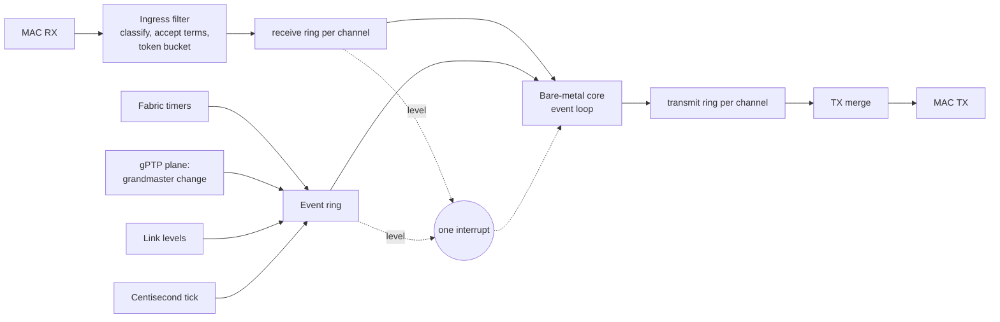
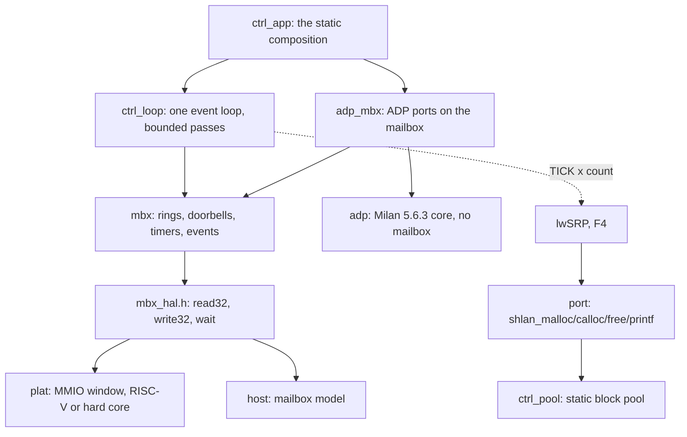

<!-- SPDX-License-Identifier: CERN-OHL-W-2.0 -->
# Packet mailbox split: the contract, the HAL and the ADP slice (#665 lane F0)

Status: **F0 implemented behind a default-off build switch.** The all-fabric
build is unchanged and remains the shipping image. This page is the design
of the contract between the fabric and the bare-metal control-plane firmware.
The split integrates before P3; milestone 13 retains the hard-core port.
Lane F3 adds the [ACMP module](#the-acmp-module) to the firmware the host
tests and the co-simulation build; no image links that firmware yet.
Lane F-INT adds the [publication block](#the-publication-block) (contract
2.2), where the firmware owner writes the class-D state the split placement's
datapath reads; nothing reads it until the placement switch lands.
The [placement contract](../ARCHITECTURE_HW_SW_SPLIT.md) defines the Mark II default.
All-fabric stays the shipping default until F2 to F5 acceptance.
That acceptance covers all streams, counters and the audio soak.
The owner decisions of
2026-10-05 on [#640](https://github.com/kebag-logic/milan-fpga/issues/640)
and the directive on [#665](https://github.com/kebag-logic/milan-fpga/issues/665)
define the interface. The numbers live in one place, the generated
[reference page](../reference/MAILBOX_CONTRACT.md); this page explains them.

## Contents

- **[What moves, and what the fabric keeps](#what-moves-and-what-the-fabric-keeps)** -- The protocols the bare-metal core runs, what stays in the fabric, and the picture of rings, events and the one interrupt between them.
- **[One contract, four outputs](#one-contract-four-outputs)** -- The YAML that is the only place a number is written, the four files generated from it, and the drift, cross-output and planted-defect checks.
- **[Byte order](#byte-order)** -- Fixed bit positions for every 32-bit word, little-endian lanes for frame bytes, network order inside a frame.
- **[Rings, records and events](#rings-records-and-events)** -- The record shapes, commit order across channels, the doorbells and their range rule, the coalescing rule that keeps the event ring from ever dropping the last state of a source, and the interrupt levels.
- **[The ingress filter](#the-ingress-filter)** -- The full tuple per channel and its identity term with their clauses, tagged frames refused by construction, the own MAC per interface, two-sided AECP, FILTER_MISMATCH, the token bucket, and the MRPDU form the SRP channel hands lwSRP.
- **[Bus adapters and the hard core](#bus-adapters-and-the-hard-core)** -- Wishbone for the on-chip RISC-V and AXI4-Lite for a hard core with every output registered, neither adding anything to the contract.
- **[The firmware: bare metal first](#the-firmware-bare-metal-first)** -- No OS, no heap: the three-function bus port, lwSRP's port layer on a static pool at a pinned revision, the event loop's per-pass order and when it may sleep, and protocols as ports-and-adapters modules.
- **[The ADP slice](#the-adp-slice)** -- Milan v1.2 5.6.3 over the mailbox, the available_index a DEPARTING carries, owed frames and their order, fields from the entity model, the tag rule for raced expiries, and the service-latency bound with its assumptions.
- **[The ACMP module](#the-acmp-module)** -- Milan v1.2 5.5 and 5.6.4 on the core: the core, its adapter and the ADP channel's tap, the binding owner on the saved-state store, the adp filter's bound-talker term, every path's service cost and the backlog bounds against T_svc, and the four differences from the processor.
- **[The publication block](#the-publication-block)** -- The class-D state the firmware owner publishes for the split placement's datapath: the layout, the stream_id behind SID_VALID, each writer and the response it precedes, the two semantic choices, and the service cost.
- **[Verification](#verification)** -- The suite through both adapters, the same checks on the host model, the co-simulation, the host tests, the reused processor walks, the binding owner on the store and the planted defects.
- **[Default build](#default-build)** -- What the switch adds when on, the CPU netlist it regenerates, and the gateware-export comparison that shows every shipped config unchanged when off.
- **[Measured area](#measured-area)** -- The switch-on skeleton placed and routed out of context, per block, against the #640 estimate, with the levers, what the full-tuple filter and the bound-talker term added, the term in distributed RAM against its target, and the recipe.
- **[Open items](#open-items)** -- The datapath tap, lwSRP's transmit hook, the CPU-cycle measurement with what ACMP's bounds need of it, ACMP's wire round trip, the bound-talker term's area and MMRP.

## What moves, and what the fabric keeps

The bare-metal core runs ADP, ACMP, MAAP, SRP (through lwSRP) and AECP. The
fabric keeps framing and timestamps, the gPTP plane, the media path,
the timers that carry hard deadlines, and an ingress filter. The two exchange
frames through packet mailboxes: block-RAM rings, a doorbell per ring, one
interrupt, 32-bit accesses only and no DMA.



F0 builds the contract, its generator, the fabric skeleton, the HAL with
lwSRP's port layer, the host model and harness, and ADP as the first slice
through all of them. The datapath tap that feeds the skeleton comes with the
protocol lanes that need it (F2 to F5).

## One contract, four outputs

[`sw/mailbox/mailbox.yaml`](../../sw/mailbox/mailbox.yaml) is the only place
a register offset, a field position, a ring size or a filter rule is written.
[`sw/mailbox/gen_mailbox.py`](../../sw/mailbox/gen_mailbox.py) emits:

| Output | What it carries |
|---|---|
| [`hdl/milan/mailbox/KL_mbx_pkg.sv`](../../hdl/milan/mailbox/KL_mbx_pkg.sv) | every constant as `MBX_<name>_C`, and the per-channel tables the RTL indexes at run time |
| [`hdl/milan/mailbox/KL_mbx.sv`](../../hdl/milan/mailbox/KL_mbx.sv) | the fabric skeleton: ports, register decode, one ring per direction per channel |
| [`sw/firmware/ctrl/mbx/mbx_contract.h`](../../sw/firmware/ctrl/mbx/mbx_contract.h) | the same constants as `MBX_<name>` for C |
| [`docs/reference/MAILBOX_CONTRACT.md`](../reference/MAILBOX_CONTRACT.md) | the reference tables, and a constant table the self-test reads back |

The generator refuses a contract that cannot be built: overlapping fields, a
ring that is not a power of two or overlaps another, two channels that claim
one EtherType, a register outside its block, a filter field past the frame,
a read-only field the skeleton has no fabric source for, a match tuple that
names a VLAN tag's TPID or no destination, message types named with no
subtype or wider than four bits, a message_type byte not the one after the
subtype.

`--check` regenerates every output in memory and fails on any byte of drift.
`--crosscheck` reads the three constant carriers back by name and fails on a
field mismatch between them, whatever produced it. `--selftest` plants a
mismatch into each output (16 arms) and a defect into the YAML (15 arms), and
requires each to be caught, after a clean positive control. It also builds
the two-interface variant the suite uses, which must cross-check clean, and
requires a four-interface one, whose blocks would overlap the global
registers, to be refused. `--variant-interfaces N --out DIR` writes such a
variant into a build directory, never into the tree. The leaves (`KL_mbx_ring`, `KL_mbx_rx`, `KL_mbx_tx`,
`KL_mbx_evt`) and the two bus adapters are written by hand against the
package, so a contract change reaches them through the constants.

Versioning: a change that moves or resizes anything raises `major`, and so
does one that narrows what the filter passes; one that only adds raises
`minor`. The fabric publishes both in `ID`, and the firmware's `mbx_open()`
refuses a major it was not built against.

## Byte order

Every register, record header word and event word is one 32-bit value whose
fields sit at fixed bit positions, so its meaning never depends on the host's
byte order. Frame bytes travel four to a ring word in little-endian lanes:
frame byte k is ring word k/4, bits 8*(k%4)+7 down to 8*(k%4). Wire fields
inside a frame keep network order, and the firmware's wire layer
([`wire.h`](../../sw/firmware/ctrl/wire/wire.h)) reads them byte by byte. A
big-endian hard core reads the same values as the RISC-V.

## Rings, records and events

Each ring has one producer and one consumer, a 16-bit head and tail counted
in words, and storage the producer writes only past the consumer's tail.

- **RX record:** two header words (length, interface, kind; arrival time in
  NOW_MS) then the frame, FCS stripped. The fabric writes the payload words,
  then the header, then moves RX_HEAD past the whole record, so the core never
  reads a partial one.
- **TX record:** the same shape, written by the core, committed by TX_HEAD;
  its second word carries SEQ, the core's count of TX records committed on
  every channel. The TX merge checks a record before a byte leaves and
  flushes a ring to TX_HEAD on a malformed one, because a length that cannot
  be trusted leaves no next record to find. TX_TAIL moves only after the last
  byte has left.
- **Event record:** four words. The sources are a link level change, a
  grandmaster change published by the gPTP plane, a fabric timer expiry with
  the tag of the arm it belongs to, and the centisecond tick.

Records leave in **commit order across channels** (the ruling on PR #668,
comment 5994730420). Before each record the merge reads SEQ from the oldest
record of every channel that holds one and sends the one whose SEQ comes
first modulo 2^16, so an ACMP response leaves before the AECP notification
committed after it (#653), whichever channel the merge served last and
however long the sink stalled. The scan starts after the channel served
last, so equal SEQs leave round-robin. The driver stamps SEQ; the count
belongs to one run of the firmware, since the transmit rings are not
readable and a restart cannot resume it.

Every event source is **coalesced**: a source holds at most one unposted
record and posts its state at posting time, only into four free words. The
ring therefore cannot overflow and drop the last state of anything. A link
that flaps while the ring is full posts its level once; ticks counted while
their record waits are posted as one record with the count.

The doorbells are the counter writes themselves: RX_TAIL releases RX space,
TX_HEAD commits TX records, EVT_TAIL releases events. A counter the host
writes out of range (a partial reset, a driver fault) never lets the fabric
write over a ring: an RX_TAIL or EVT_TAIL more than the ring behind its head,
or ahead of it, leaves no free word until it is back in range, and a TX_HEAD
more than the ring ahead of TX_TAIL is refused like a malformed record. The
one interrupt is the OR of the enabled levels (a receive ring or the event
ring not empty) and a sticky error, so a service pass that drains the rings
leaves the line low.

## The ingress filter

The filter implements the owner's full-tuple acceptance rules
([#664, comment 6014311316](https://github.com/kebag-logic/milan-fpga/issues/664#issuecomment-6014311316)),
which [product ownership](../../REQUIREMENTS.md#1-product-ownership) and
[NFR-SCOUT-08](../reference/FR_NFR.md#34-fabric-scale-out-and-future-ports)
state (#665 lane FC; F0 classified on EtherType and subtype alone).

A frame is classified when its byte 15 arrives, or at its last byte when it
ends at byte 14, by its full tuple. A channel's match tuple holds when the
destination MAC is the tuple's address, or, for an `own` tuple, the `OWN_MAC`
of the interface the frame arrived on; the EtherType is the tuple's; the AVTP
subtype is the tuple's where it names one; and the message_type (the low
nibble of byte 15) is one of the tuple's where it names some. A frame that
ends at byte 14 has message_type 0, as the accept terms read it. The four-word
queue holds bytes 0 to 15, so the decision at byte 15 never waits for a drain.
The frame is then stored only when its channel is open, one of the
channel's accept terms (its identity term) holds, it fits the channel's
largest frame and the free ring space, and the channel's token bucket holds a
token.

| Channel | Destination MAC | EtherType | Subtype | Passes | Clause |
|---|---|---|---|---|---|
| `adp` | `91:E0:F0:01:00:00` | `0x22F0` | `0xFA` | ENTITY_DISCOVER for entity_id 0 or this entity; ENTITY_AVAILABLE and ENTITY_DEPARTING of a talker bound on the receiving interface | IEEE 1722.1-2021 6.2, Table B.1; Milan v1.2 5.6.3.1, 5.6.4.1 |
| `acmp` | `91:E0:F0:01:00:00`, or own unicast (the owner's receive tolerance) | `0x22F0` | `0xFC` | a command or response naming this entity as talker or listener | IEEE 1722.1-2021 8.2.1, Table B.1 |
| `aecp` | own unicast | `0x22F0` | `0xFB` | a command for this target, or a response for this controller | IEEE 1722.1-2021 9.2.2.4 (Table 9-1), 9.2.2.7, 9.2.2.8; Milan v1.2 5.4.5.3 |
| `maap` | `91:E0:F0:00:FF:00`; or own unicast for a DEFEND (message_type 2) only | `0x22F0` | `0xFE` | a PROBE, DEFEND or ANNOUNCE overlapping this entity's range | IEEE 1722-2016 B.2.1, Table B.1, Table B.10 |
| `srp` | `01:80:C2:00:00:0E` with `0x22EA` (MSRP); `01:80:C2:00:00:21` with `0x88F5` (MVRP) | as paired | none | every MSRP and MVRP PDU | IEEE 802.1Q-2018 35.2.2, 11.2.3.1.3, Tables 10-1 and 10-2 |

- **Tagged frames reach no mailbox, by construction.** An 802.1Q tag puts
  its TPID where the EtherType is read (wire bytes 12 and 13), and no tuple
  may name a TPID: the generator refuses `0x8100`, `0x88A8` and `0x88E7`
  (IEEE 802.1Q-2018 Table 9-1). A tagged frame therefore matches no tuple
  and is of no control EtherType, so it reaches no channel and no counter.
  AAF and CRF have no channel, so a stray untagged one is refused too.
- **Own unicast is the arrival interface's MAC, never any unicast.** Each
  interface has `OWN_MAC_LO` and `OWN_MAC_HI` in its own filter block
  (`0x080 + 8 * i`). The filter compares a frame's destination with the
  `OWN_MAC` of the interface the RX record will carry. An index with no
  interface behind it has no own MAC. The firmware writes every interface's
  own MAC before it opens a channel (`ctrl_loop_open`). The app gives each
  interface the entity's MAC, which ADP sends on every interface.
- **A MAAP DEFEND arrives unicast.** IEEE 1722-2016 B.2.1 sends PROBE and
  ANNOUNCE to the MAAP multicast address, and a DEFEND to the source MAC of
  the PROBE it answers. So the `maap` channel's second tuple is this
  interface's own MAC with message_type DEFEND only (#665, comment
  6026839422). A PROBE, an ANNOUNCE or a reserved message type sent there
  matches no tuple, so it is counted, as a DEFEND to a foreign unicast is.
  The range term then applies to the DEFEND as to the multicast frames: its
  requested range is the one this entity probed.
- **AECP is two-sided.** A command (an even message_type) passes when
  target_entity_id is this entity. A response (an odd one) passes when
  controller_entity_id is this entity, such as the CONTROLLER_AVAILABLE reply
  of Milan v1.2 5.4.5.3. The reserved values 10 to 13 keep that parity, which
  is how the fabric's AECP engine reads them.
- **Counted drops.** An untagged frame whose EtherType some tuple names
  (`0x22F0`, `0x22EA` or `0x88F5`), and which matches no tuple, counts once
  in `FILTER_MISMATCH` at its end. Like `RX_DROP` and `RATE_DROP`, it sets
  `IRQ_STATUS.ERR`. The counter judges the tuple whatever `FILTER_EN` holds.
  A frame refused by its identity term, or for a closed channel, is not
  addressed to this entity and is dropped uncounted. So is a frame that ends
  before byte 14. A size or space drop counts in `RX_DROP`, a rate drop in
  `RATE_DROP`.
- **The adp channel takes its bound talkers' announcements.** Its third
  accept term (`eq_bound`, message types 0 and 1) compares entity_id with the
  enabled entries of the arrival interface's bound-talker table
  (`0x200 + 0x100 * i`, entry e at `0x10 * e`), which the ACMP firmware keeps
  equal to its bindings (lane F3 round 2,
  [below](#discovery-and-the-adp-channels-filter)). This only adds, so the
  contract went to 2.1.
- **The token buckets stay.** Only a committed frame takes a token, so a
  frame the filter refuses spends none.

This narrows what the filter passes, so the contract went to major 2. A
firmware built against major 1 would not write the own MAC the AECP channel
now matches, and `mbx_open()` refuses the other major.

The SRP record carries the whole frame, so the MRPDU (ProtocolVersion first)
is frame bytes 14 onward: the contiguous buffer lwSRP's `mrp_rx()` and
`mrpdu_parse()` take, with the record's interface as `port_id`.

## Bus adapters and the hard core

`KL_mbx` answers every host request one cycle later on a minimal port.
[`KL_mbx_wb`](../../hdl/milan/mailbox/KL_mbx_wb.sv) presents it to the
on-chip RISC-V over Wishbone; [`KL_mbx_axil`](../../hdl/milan/mailbox/KL_mbx_axil.sv)
presents the same window to a hard core over AXI4-Lite. Neither adds to the
contract: 32-bit accesses, the refusal of a partial byte strobe (counted in
BUS_ERR) and every register's meaning are `KL_mbx`'s. The mailbox suite runs
every check through both.

Every AXI4-Lite output is a register or a function of registers only: no
path runs from an input to an output (AMBA AXI, IHI0022H, A3.1.1 and
A3.2.1). AW, W and AR are each taken into a one-entry slot by their own
handshake, in either order and in any cycle; READY is the emptiness of the
slot. A write goes to `KL_mbx` once both of its slots are full, a read once
its slot is, one request at a time, and B and R hold, with their payload,
until BREADY or RREADY. A write goes first when both wait; its B slot then
blocks the next write for a cycle, so a waiting read goes next. The AXI4-Lite
build adds its own checks to the suite: AW before W and W before AW, a read
beside a write, B and R held under backpressure, a reset with a transfer half
taken, back-to-back writes to distinct registers read back (each W paired with
its own AW, beside it and running ahead of it), and a probe that, on every
clock of the run, moves each AXI input with the clock held and requires every
AXI output to stay put.

A hard core with a weakly ordered memory model must map the window as device
(strongly ordered) memory, or put a barrier before each doorbell write, so a
record's words reach the window before its counter.

## The firmware: bare metal first

The firmware ([`sw/firmware/ctrl`](../../sw/firmware/ctrl/README.md)) has no
OS, no heap and no threads (the directive of 2026-10-05, #665 comment
5992455815). It is portable C11 in layers, each reaching the next only
through a small interface:



- **The bus port** is three functions (`mbx_hal.h`): a 32-bit read, a 32-bit
  write, and a wait that may return early. The MMIO implementation takes the
  window base from the SoC's generated memory map (`CTRL_MBX_BASE`); the host
  implementation drives the mailbox model and counts every access.
- **lwSRP's port layer** is provided here, with lwSRP's own prototypes, as
  of lwSRP `9197193e47a6bb1c45a56d90a18c1784123aba44` (fetched from
  `https://github.com/kebag-logic/lwSRP` and checked out at that revision;
  the host test's lwSRP arm refuses another revision or an edited `src/`):
  `shlan_malloc`, `shlan_calloc` and `shlan_free` on a static block pool, and
  `shlan_printf` on a debug sink with one bounded line buffer. The pool is
  carved at boot from an arena the platform declares statically; an
  allocation takes the smallest class with a free block, a refusal is counted,
  and a double free or a foreign pointer is refused rather than corrupting a
  free list.
- **The event loop** runs passes in a fixed order (the events-first ruling
  on PR #668, comment 5994730420): first at most 8 event records, in ring
  order, each to every sink; then each bound channel's receive ring, at most
  2 records each; then one poll per module. A TICK record's count is fanned
  out to every registered centisecond consumer, lwSRP's `shlan_timer_tick()`
  among them, at most 16 centiseconds per pass with the rest carried (a
  later record's count adds to what is carried), so lwSRP's leave, LeaveAll
  and periodic timers run on fabric time, lose no tick when the core is
  late, and catch up a bounded slice at a time.
  Register `shlan_timer_tick` once, not lwSRP's `mrp_tick()` per
  application: `mrp_tick()` calls the same global tick, so one registration
  per MRP application would advance every timer that many times per
  centisecond.
- **The loop sleeps only when nothing is owed.** A poll returns whether its
  module still owes output, such as a frame its transmit ring had no room
  for. A pass that handled anything, or after which output or centiseconds
  are still owed, is followed by the next at once; only a pass that handled
  nothing and owes nothing sleeps in `mbx_hal_wait()`. Everything the core
  can then be waiting for raises the interrupt, so a platform that sleeps
  there (`CTRL_MBX_WFI`, which also needs the SoC's `ctrl_mbx` interrupt
  source and the CPU's interrupt mask enabled) never strands an owed frame.
- **A protocol is a ports-and-adapters module**, as lwSRP is. The ADP core
  ([`adp.h`](../../sw/firmware/ctrl/adp/adp.h)) knows no mailbox: it calls a
  send port, one timer per interface, the gPTP pair, the link level and a
  seed. The mailbox adapter maps those onto the driver; a test maps them onto
  fakes.

`ctrl_loop_open()` brings the mailbox up in the contract's order: check the
contract, write the filter's entity_id, enable the interrupt causes, start
the tick when a centisecond consumer is bound, and only then open the bound
channels.

## The ADP slice

One instance per AVB interface implements Milan v1.2 5.6.3 over the IEEE
1722.1-2021 6.2 ADPDU:

- ENTITY_AVAILABLE on its schedule: a random TMR_DELAY (0 to 2 s at startup
  with the link up, 5.6.3.5.2; 0 to 4 s otherwise), the frame, then
  TMR_ADVERTISE (5 s, 5.6.3.5.9), with available_index incremented after each
  frame sent (IEEE 1722.1-2021 6.2.2.15; Figure 6-2, WAITING);
- the ENTITY_DISCOVER answer for entity_id 0 or this entity, in WAITING
  (5.6.3.1, 5.6.3.5.4);
- the re-advertise on a grandmaster change (5.6.3.5.7);
- ENTITY_DEPARTING on SHUTDOWN (5.6.3.5.8, 5.6.3.5.11), never on a link
  change (5.6.3.5.6, 5.6.3.5.10).

ENTITY_DEPARTING carries the **current** available_index (the ruling on PR
#668, comment 5994972330). In the Advertise Interface state machine (IEEE
1722.1-2021 Figure 6-3), `doTerminate` leads to DEPARTING and
`txEntityDeparting()`, which sets every field but the per-interface ones from
the entityInfo variable (6.2.5.2.2); in the Advertise Entity state machine
(Figure 6-2) only INITIALIZE sets `entityInfo.available_index = 0`. The reset
"when transmitting an ENTITY_DEPARTING" of 6.2.2.15 therefore shows on the
next start: its first ENTITY_AVAILABLE carries 0. The processor's
`KL_adp_engine` sends the same values. The host test reads the field off the
wire for SHUTDOWN in WAITING and in DELAY, sent at once and deferred, the
restart, and the 32-bit wrap.

A frame the transmit ring has no room for is owed, and nothing that follows
drops an owed ENTITY_DEPARTING. A SHUTDOWN's DEPARTING keeps the index
current at that SHUTDOWN until the ring takes it, across a restart, a timer
expiry, a link change or another SHUTDOWN, and the oldest leaves first. A
restart's ENTITY_AVAILABLE never passes an owed DEPARTING: if its TMR_DELAY
expires first, the AVAILABLE is owed too, the machine stays in DELAY with no
timer running, and the AVAILABLE leaves, TMR_ADVERTISE is armed and WAITING
entered, only after the last owed DEPARTING. A DEPARTING queued behind another
therefore carries 0, because its run could send no AVAILABLE. An owed AVAILABLE
is dropped only by a link loss or a SHUTDOWN, which end the run it would have
announced; a GM change, an ENTITY_DISCOVER or a stray expiry in DELAY leaves
it owed (Table 5.51 ignores the first two there). A poll sends at most one
frame, so the per-pass bound below is unchanged. The host test runs the case
through the core's ports and through the driver, the model's timer and the
loop: advertise, fill the ring, disable, enable, let the new TMR_DELAY expire,
then drain. The wire carries DEPARTING with index 1, then AVAILABLE with index
0, then the machine is in WAITING with TMR_ADVERTISE armed and owes nothing.
It also checks a link loss and its return during the restart, before and after
the expiry (the DEPARTING stays owed), the three inputs that leave an owed
AVAILABLE owed, and a link loss that drops one with no poll in between.

At most two DEPARTINGs are owed, by construction (the round-4 assignment on
#665, comment 5999248955): the oldest, with its index, and one queued behind
it, which carries 0. A SHUTDOWN that finds both owed adds no third. It is
coalesced into the queued one and counted (`departing_coalesced`): its
DEPARTING would also carry 0, and nothing the interface sends can leave
between the two, so it could only repeat the queued frame back to back. The
wire keeps every distinct frame in order and drops only that repeat, which no
receiver acts on. A Milan listener that took the DEPARTING before it is in
TK_NOT_DISCOVERED, where RCV_ADP_DEPARTING is ignored (Milan v1.2 Table
5.54), and IEEE 1722.1-2021's `removeEntity` (6.2.6.3.5) finds no record left
to remove. The host test fills both places and then shuts down 100,001 more
times. Each of those SHUTDOWNs is counted, and the two owed DEPARTINGs and the
oldest one's index are unchanged. Once room returns, the wire carries
DEPARTING 1, DEPARTING 0, then the restart's AVAILABLE 0.

The ADPDU fields come from the entity model through the same derivations the
fabric's engine is fed from:
[`adp_entity.py`](../../sw/firmware/ctrl/adp/adp_entity.py) reads the
builder's ADP identity and shape and the processor's `ADP_ENTITY_CAPS_C`, and
the host test compares every field, for every shipped config, with what the
fabric is programmed and compiled with.

The fabric timer slot of an interface carries every arm with a fresh tag. An
expiry already in the event ring when the firmware stopped or re-armed the
slot carries the old tag and is discarded by it: the mailbox form of Table
5.51's "x" cells.

The listener's discovery machine (5.6.4) feeds ACMP and belongs to F3
([The ACMP module](#the-acmp-module)). Its ENTITY_AVAILABLE and
ENTITY_DEPARTING from bound talkers reach it through the ADP channel's
bound-talker term ([its filter](#discovery-and-the-adp-channels-filter)).

F3 must also meet the listener-discovery timing requirement.
[H-DISC](../reference/FR_NFR.md#342-control-service-test-hooks) starts at received AVAILABLE/DEPARTING publication or original TMR_NO_ADP expiry.
It ends after discovery and resulting connection-state commitments.
Any resulting TX commit shares that same service allowance.
Normative waits are recorded separately; service remains <= 10 ms.
Milan v1.2 5.6.4.1 requires processing every matching bound sink.
Sections 5.6.4.5.1/.2 arm/reset aging from the received `valid_time`.
IEEE 1722.1-2021 6.2.2.5 defines its two-second units.
Table 5.54 and 5.6.4.5.1-.4 supply the transition checks.
They cover available_index restart, interface/GM/domain mismatch, departing and expiry.
Delayed receive handling or aging must fail H-DISC independently.
F0's advertiser checks do not establish this listener timing.

### Service latency

F2 adds an opt-in [bare-metal MAAP owner](../../sw/firmware/ctrl/maap/README.md).
Its H-MAAP tests use the FC channel and the existing AAF/CRF CSR allocation output.
The page records Annex B coverage, per-event work and host timing assumptions.
The shipping all-fabric placement remains unchanged.
F3 composes it with ADP and ACMP in one app
([the composition](../../sw/firmware/ctrl/README.md#the-composition)).

The figures below are F0's conditional mailbox-access evidence.
[NFR-SCOUT-03](../reference/FR_NFR.md#341-control-service-budget-and-normative-timing)
adds the proposed 10 ms project budget for integrated firmware.
Its [hooks](../reference/FR_NFR.md#342-control-service-test-hooks) count backlog and egress separately.
F0 does not prove that target-time budget.

The D3 ruling on #640 asks each lane to state and test a deterministic upper
bound per response path. The bound is stated in mailbox accesses and holds
under four assumptions ([`ctrl_loop.h`](../../sw/firmware/ctrl/loop/ctrl_loop.h)):

- **A1, backlog.** At most a full event ring (16 records; the ring holds no
  more) and at most a full receive ring per channel, counted in the smallest
  record the filter passes (a frame that reaches the subtype byte: 6 words, so
  42 in the ADP ring).
- **A2, callbacks.** A sink, a handler, a centisecond consumer and a poll
  each cost at most the accesses its module states, and none waits on the
  fabric.
- **A3, transmit room.** A response finds room in its transmit ring, and its
  module owes no frame ahead of it. When it does not, its module owes it and
  the loop keeps passing. A poll sends one owed frame per pass and interface,
  oldest first. So a response with k frames owed ahead of it is committed in
  pass k + 1, counted from the first pass that starts after the merge frees
  the room, and not before the pass that takes its input. A module bounds k;
  for ADP, k is at most 2.
- **A4, bus.** The figures count accesses. Time is that count times the
  platform's cost per access, which F0 has not measured.

Every input is handled inside the pass that takes it. An event is taken by
the second pass that starts after the fabric posts it (16 records, 8 per
pass, events first); a record of a channel by pass ceil(backlog / 2), 21 for
ADP. A pass of F0's composition costs at most 407 accesses (8 events at 6 +
31, 2 ADP records at 36 + 4, one poll at 31). With the pass already running
when the input arrived, and under A3, an event's response is committed
within 3 x 407 = 1,221 accesses and an ADP record's within 22 x 407 = 8,954.
At an assumed 1 us per access, which is not a measurement, that is under 9 ms
against Milan's 0 to 4 s TMR_DELAY and 5 s TMR_ADVERTISE (Table 5.50).

An owed response (A3) can leave after the pass that takes its input. An
ENTITY_AVAILABLE behind k owed DEPARTINGs (k at most 2) is committed in pass
k + 1, counted from the first pass that starts after the room returns. If the
pass that takes its TMR_DELAY expiry comes later (by pass 2, as for any
event), it is committed in that pass. Either way it is committed by pass 3,
counted from the first pass that starts after both the room's return and the
expiry. With a pass already running then, that is within 4 x 407 = 1,628
accesses (`ADP_MBX_OWED_PASSES`, `ADP_MBX_OWED_ACCESSES`). The host test
leaves 1, 2 and 64 SHUTDOWNs behind a full ring, takes the expiry before and
after the room returns, and requires the AVAILABLE in pass k + 1 (measured: 63
to 99 accesses, the same for 64 SHUTDOWNs as for 2).

Each response path's own cost, in the pass that takes the input, with
nothing else pending:

| Path | Mailbox accesses in the pass | Response |
|---|---:|---|
| RCV_ADP_DISCOVER | 31 | TMR_DELAY armed |
| TMR_DELAY expiry | 39 | ENTITY_AVAILABLE committed, TMR_ADVERTISE armed |
| TMR_ADVERTISE expiry | 11 | TMR_DELAY armed |
| GM_CHANGE | 11 | TMR_DELAY armed |
| LINK_UP / LINK_DOWN | 11 / 9 | TMR_DELAY armed / timer stopped |
| SHUTDOWN | 29 | ENTITY_DEPARTING committed |

The figures are `ADP_MBX_LAT_*`, `ADP_MBX_PASS_MAX`, `ADP_MBX_EVT_ACCESSES`
and `ADP_MBX_RX_ACCESSES` in [`adp_mbx.h`](../../sw/firmware/ctrl/adp/adp_mbx.h),
with their derivation. The host test counts every access of each path on the
model and fails one that exceeds its bound. It then fills both rings with
legal records (15 timer expiries and ADP's own TMR_DELAY expiry last, 28
minimal ENTITY_DISCOVERs) with 30 centiseconds coalesced behind them, and
requires events first in every pass, the expiry's ENTITY_AVAILABLE in pass 2
(measured: 175 accesses), the receive ring cleared by pass 14 (457
accesses), no pass above 407 (measured: 105), every centisecond delivered at
most 16 per pass, and no sleep before the backlog is gone. A measurement in
CPU cycles on the shipping core needs the switch-on SoC in the CPU
simulation and is left open (see [Open items](#open-items)).

## The ACMP module

Lane F3 runs Milan v1.2 5.5 (connection management) and 5.6.4 (the listener's
discovery machine) on the core, over IEEE 1722.1-2021's ACMPDU (8.2.1) at
Milan's 56 bytes (5.5.2.2). It is three units in
[`sw/firmware/ctrl/acmp`](../../sw/firmware/ctrl/acmp), each citing its
clauses in its header ([module page](../../sw/firmware/ctrl/README.md#the-acmp-module)):

- **The core** ([`acmp.h`](../../sw/firmware/ctrl/acmp/acmp.h)) knows no
  mailbox. It implements every listener transition of Table 5.30 (5.5.3.5.1
  to 5.5.3.5.48) per sink, the talker's answers of 5.5.4, the discovery
  machine of Table 5.54 (5.6.4.5.1 to 5.6.4.5.4), the timers of Tables 5.26
  and 5.29, the lock (5.5.2.4) and the saved binding record. Its transport
  is a port set like ADP's (frames, the clock, one timer per AVB interface,
  the gPTP pair, a seed). The entity's other owners (the lock, the talker's
  sources, the listener's SRP, the saved-state store, the notifier) form an
  env the integrator provides.
- **The adapter** ([`acmp_mbx.h`](../../sw/firmware/ctrl/acmp/acmp_mbx.h))
  binds the acmp channel and one fabric timer slot per AVB interface. The
  slot is armed at the earliest deadline among the interface's sinks, with
  a fresh tag, so a raced expiry is discarded as ADP's is. It reaches F0's
  ADP module through the loop's public binding only: it stands in front of
  the adp channel's handler, hands each ENTITY_AVAILABLE and ENTITY_DEPARTING
  record to discovery, and passes every other record to ADP's handler
  unchanged. It keeps the adp channel's bound-talker table equal to the
  sinks' bindings ([below](#discovery-and-the-adp-channels-filter)).
- **The binding owner** ([`acmp_nvm.h`](../../sw/firmware/ctrl/acmp/acmp_nvm.h))
  serves lane F1's state port for the binding group and forwards every other
  group to the integrator's owners. At boot the store's walk restores each
  saved binding into PRB_W_AVAIL with discovery running (5.5.3.5.2, fast
  connect); a roll-back drops every one. While a slot the store could not
  read holds its writer, nothing is persisted, as F1 rules.

The protocol state is keyed per AVB interface: a sink's probes leave on its
interface, a source answers only probes that arrived on its own, and a sink
takes ADPDUs only from its own interface. Responses key on the consumer's
unique ID: a PROBE_TX_RESPONSE belongs to the sink its listener_unique_id
names, and only when its controller, talker, talker_unique_id and
sequence_id are those of the probe that sink sent (5.5.3.5.18 step 1). Each
new PROBE_TX_COMMAND takes the next sequence_id (IEEE 1722.1-2021 8.2.1.15);
the duplicate sent on the first TMR_NO_RESP repeats it (5.5.3.5.16).
TMR_NO_RESP runs 200 ms from the send the transmit ring accepts, for the
probe and for its duplicate: a probe owed behind other frames holds its
timer until it leaves (5.5.3.5.3 steps 5 to 7, 5.5.3.5.16 steps 1 and 2).
Its deadline is taken from a clock read after that send returns, so neither
the time the send takes nor a clock the entry read before it (a timer
expiry's) shortens the 200 ms.
Only AVTP version 0 is read: an ACMPDU or ADPDU of another version is
discarded before it is decoded (IEEE 1722-2016 4.4.3.4; IEEE 1722.1-2021
8.2.1.3, 6.2.2.3). The fabric's filter does not read the version, so the core
does.

A change of a sink's Table 5.22 items is reported through the env's
`changed` port only after the response of the command that caused it has
been taken by the transmit ring (#653). A response that finds no room is
owed, in order (at most eight frames), and its change waits with it. The
AECP notification that will key on that port lands in F5. Every port call is
bracketed by a flag, and an entry while it is set does nothing but count
(#678); the host tests' build also reports it to the test.

### Discovery and the adp channel's filter

Milan v1.2 5.6.4.1 needs every ENTITY_AVAILABLE and ENTITY_DEPARTING of a
bound talker at the listener. The term is decided on
[#665 (6029368753)](https://github.com/kebag-logic/milan-fpga/issues/665#issuecomment-6029368753):
ENTITY_AVAILABLE and ENTITY_DEPARTING of a talker bound on the receiving
interface; F3 round 2 adds the term. Admitting every AVAILABLE instead would
share the channel's token bucket with every entity on the network, so
foreign announcements could crowd out the bound talker's and cause a false
TMR_NO_ADP (5.6.4). The core still filters exactly.

The term is the adp channel's third accept term in the contract (`eq_bound`,
message types 0 and 1, entity_id at wire byte 18; contract 2.1). It reads a
bound-talker table in the mailbox block: per AVB interface, one entry per
listener stream (16, the firmware's `ACMP_MAX_SINKS` and the saved-state
binding block's), each `BOUND_EID_LO`, `BOUND_EID_HI` and `BOUND_EN`
([reference](../reference/MAILBOX_CONTRACT.md#interface-bound-talker-registers)).
`KL_mbx_rx` compares the entity_id with the table of the interface the frame
arrived on, never another's. The change only adds, so the contract's minor
moves: a firmware built against 2.0 leaves the table empty and sees the 2.0
filter.

The table is held in distributed RAM and compared byte by byte as wire bytes
18 to 25 arrive (lane F3 round 3, the area ruling on
[#665 (6032450078)](https://github.com/kebag-logic/milan-fpga/issues/665#issuecomment-6032450078)).
Each entry's eight identity bytes sit in a shift register of its own, byte b
at tap b, so identity byte b of a frame is compared with byte b of every
entry of its interface at once, and each entry's match flag keeps the AND;
the verdict at the frame's end reads the flags, where it always did. The
host's `BOUND_EID` words live in a read-back memory, two words an entry. A
copier shifts an entry's bytes in from it when `BOUND_EN` is set, or a word is
written while it is set, one byte in each cycle the host leaves that memory.
An entry takes part only while `BOUND_EN` is set and no copy of it is owed,
from the frame's first identity byte to its verdict, so:

- a frame whose identity passes while its entry is cleared and set again, or
  copied again, never matches that entry, even when the rewrite is over by
  the verdict, and a half-written identity never matches;
- an entry takes part once its copy is made: from the RTL, at most 176
  clocks (1.76 us at the 100 MHz system clock) after the last write that owes
  one, for all sixteen entries of one interface owed at once, plus a clock for
  each host access to the tables meanwhile. That is nothing to discovery,
  whose announcements are seconds apart, and the suite waits for it.

Distributed RAM keeps its contents through a reset, so a word not written
since the reset reads 0 and is copied as 0, by one flag a word, and a reset
still clears the table as the contract says.

The firmware keeps the table. The core's `admit` port is called whenever a
sink is bound, unbound or bound to another talker; the adapter writes sink
k's talker into entry k of its interface's table, clearing `BOUND_EN` before
it writes an identity, so a half-written entry never matches. The bindings
the store restores at boot are written by `acmp_open`, which
`ctrl_app_open` calls after the contract check. The co-simulation shows the
bound talker's ENTITY_AVAILABLE crossing the RTL's filter into discovery, and
another talker's refused by both filters.

### ACMP service latency

Each response path's own cost, in the pass that takes the input, with
nothing else pending, in the composition of ADP and ACMP. The bounds are
`ACMP_MBX_LAT_*` in [`acmp_mbx.h`](../../sw/firmware/ctrl/acmp/acmp_mbx.h),
with their derivation. The host test counts every access of each path on the
model and fails one that exceeds its bound. Each bound also has a planted
defect that adds accesses to its path.

| Path | Bound | Measured | Response |
|---|---:|---:|---|
| BIND_RX | 77 | 77 | binding published, response, PROBE_TX, TMR_NO_RESP armed, the talker admitted |
| UNBIND_RX | 50 | 50 | binding published, response, timer stopped, the talker withdrawn |
| GET_RX_STATE | 47 | 47 | response |
| PROBE_TX_RESPONSE | 32 | 28 to 32 | TMR_NO_TK armed and the stream published, or TMR_RETRY armed |
| PROBE_TX, GET_TX_STATE, DISCONNECT_TX, GET_TX_CONNECTION | 47 | 47 | response |
| TMR_DELAY, or the first TMR_NO_RESP | 35 | 35 | PROBE_TX, the clock read after it, TMR_NO_RESP armed |
| the second TMR_NO_RESP, TMR_RETRY, TMR_NO_TK | 14 | 12 to 14 | the next timer armed; a TMR_NO_TK publishes the binding without its stream |
| ENTITY_AVAILABLE from its RX_HEAD (H-DISC) | 35 | 35 | TMR_DELAY armed |
| ENTITY_DEPARTING from its RX_HEAD (H-DISC) | 30 | 29 | timer stopped or re-armed |
| TMR_NO_ADP (H-DISC) | 12 | 12 | TK_NOT_DISCOVERED, timer re-armed |

The H-DISC rows are measured from the record the model's filter commits (its
RX_HEAD), through the bound-talker term, at one interface and, in the
`acmpif2` arm, at each of two.

A pass of the composition costs at most 1,030 accesses (`ACMP_MBX_PASS_MAX`;
1,012 before the publication block). That covers 8 events at 6 + 31 + 4,
sixteen sinks' due timers at one probe each, the clock read after it and one
`BINDING` write (24), 2 adp records at 36 + 7, 2 acmp records at 36 + 52 (a
BIND's `BINDING` write included), ADP's poll at 31 and one owed ACMP frame at
25 (a probe's: the clock and its TMR_NO_RESP). ADP's records and events are
served by the same passes, so the ADP figures above (407 a pass) hold for ADP
alone. With ACMP composed, ADP's figures take the same pass count at 1,030.

The bound with a backlog counts from a pass already running when the input
arrived, under A1 to A4. T_svc is 10 ms. The ceiling is 20 ms: 10 % of the
200 ms transaction timeout (Table 5.26), which also bounds a discovery
input's resulting ACMP action
([3.4.1](../reference/FR_NFR.md#341-control-service-budget-and-normative-timing)).
The access times are the bound's time over its accesses, rounded down.

| Input | Taken by pass | Bound, accesses | Access time for T_svc | for the ceiling | Measured on the model |
|---|---:|---:|---:|---:|---|
| an event behind 15 others | 2 | 3,090 | 3.23 us | 6.47 us | every event by pass 2; worst pass 193 accesses |
| an ACMP command behind a full acmp ring (19 records of the smallest frame) | 10 | 11,330 | 0.88 us | 1.76 us | 19 smallest records cleared in pass 10; 12 full commands behind 16 events, worst pass 193 |
| an ENTITY_AVAILABLE behind a full adp ring, from its RX_HEAD (H-DISC) | 21 | 22,660 | 0.44 us | 0.88 us | 26 records through the filter, the ENTITY_AVAILABLE served in pass 13, 333 accesses |
| a response with 7 frames owed ahead of it | 8, after the room returns | 9,270 | 1.07 us | 2.15 us | pass k + 1 for k = 0, 3 and 7: 25, 100 and 200 accesses |

The access time is not measured (A4). At F0's assumed 1 us per access every
path's own figure is under 0.1 ms, and an event's backlog bound fits T_svc.
The bounds behind a full acmp ring or a full adp ring do not fit T_svc at
that figure, and the adp one also exceeds the ceiling. The owed-frame bound,
9,270 accesses (8,865 before round 2 added the probe's timer to a poll,
8,964 before round 4 added the clock read after each probe sent at once, and
9,108 before the publication block), fits T_svc at that figure: 9.27 ms, the
time waiting for room excluded. The
bounds charge every pass with every term at its maximum at once (sixteen
sinks each probing, eight events each at ADP's costliest action), which the
measured backlogs stay far below. Whether these paths meet T_svc on the
shipping core is open until the access time is measured (see
[Open items](#open-items)). Meeting it may need a tighter per-pass
composition rather than a faster bus. H-ACMP's wire round trip (under 200 ms
with margin) needs the datapath tap and is not measured here.

With lane F2's MAAP composed as well, a pass costs at most 1,606 accesses
(`CTRL_APP_THREE_PASS_MAX`; 1,685 at two interfaces). MAAP adds its costliest
action on each of the 8 events (49, `DA_GATE` included), its 2 records of the
maap channel (20 + 48) and its poll (48). Each input is taken by the same
pass as above, so each bound is that pass count, plus one, times 1,606:

| Input | Taken by pass | Bound with MAAP, accesses | Access time for T_svc | for the ceiling |
|---|---:|---:|---:|---:|
| an event behind 15 others | 2 | 4,818 | 2.07 us | 4.15 us |
| an ACMP command behind a full acmp ring | 10 | 17,666 | 0.56 us | 1.13 us |
| an ENTITY_AVAILABLE behind a full adp ring, from its RX_HEAD (H-DISC) | 21 | 35,332 | 0.28 us | 0.56 us |
| a response with 7 frames owed ahead of it | 8, after the room returns | 14,454 | 0.69 us | 1.38 us |

On the model, 15 events, 12 acmp records and 7 maap records behind them
take a worst pass of 231 accesses (233 at two interfaces), every record and
event within 10 passes (`test_acmp_mbx.cpp` F6).

At F0's assumed 1 us per access, only the event bound still fits T_svc
(4.82 ms). The owed-frame bound, which fits it without MAAP, no longer does
(14.45 ms, under the ceiling); the bound behind a full acmp ring stays
under the ceiling (17.67 ms), and the one behind a full adp ring exceeds it
(35.33 ms).

With F4's SRP attached before the loop starts, `CTRL_APP_PASS_MAX` is 3,346
accesses at one interface and 4,235 at two (3,224 and 4,073 before the
publication block). `ACMP_MBX_PASS_MAX` already
includes ADP. Add the MAAP and SRP pass bounds and remove two duplicate
sets of event-record reads: the eight shared records are each read once.
Add `CTRL_APP_SRP_FEEDBACK_MAX`: seven accesses per sink, at most 16 sinks.
Registration followed by withdrawal can stop or re-arm two timers.
Withdrawal can also read the clock and initial random seed, and publishes
the sink's binding without its stream.
Kind updates preserve state and require no additional mailbox access.
`srp_bounds.h` derives SRP's 1,676 / 2,486 accesses from the maximum frame,
two transmit calls per interface, bounded reception, link reconciliation,
retry clocks and the publication term (a reset's five writes, an adoption's
three, two licence changes for each of 16 sources: 40 per interface). lwSRP sends at most one frame per call. Its centisecond callbacks
make no mailbox access. The composition now queues ACMP's binding requests
per sink and delivers them in a fifth poll after SRP service returns.
It preserves the configured interface, retries transient refusals, and supersedes
pending requests on unbind or replacement. Invalid VIDs are parked visibly
until another request, allowing the loop to sleep. The poll also delivers
retained SRP registration, kind changes and withdrawal after SRP returns.
A subsequent registration cannot erase an earlier withdrawal.
Accepted ACMP replacement retires obsolete feedback. Binding delivery
itself makes no mailbox access; the feedback allowance covers ACMP timer work.
CPU work and external port costs require separate measurement.
Filter observation scans sinks once per received AttributeEvent.
Registrar visits occur before/after receive, after ticks and during polling.
Target calibration must include both costs; this table bounds mailbox accesses only.

| Input | Taken by pass | Four-module bound, IF=1 / IF=2 | Access time for T_svc, IF=1 / IF=2 |
|---|---:|---:|---:|
| an event behind 15 others | 2 | 9,981 / 12,639 | 1.00 / 0.79 us |
| an ACMP command behind a full acmp ring | 10 | 36,597 / 46,343 | 0.27 / 0.21 us |
| an ENTITY_AVAILABLE behind a full adp ring | 21 | 73,194 / 92,686 | 0.13 / 0.10 us |
| a response with 7 frames owed ahead of it | 8, after room returns | 29,943 / 37,917 | 0.33 / 0.26 us |

At 1 us per access, only the one-interface event envelope fits T_svc = 10 ms;
the two-interface event envelope and the other rows do not. The 20 ms ACMP
ceiling still covers both event envelopes, but none of the other rows.
No target timing acceptance is claimed. Backpressure and retained SRP input
consume their original service interval; a retry or a normative wait never
starts a new allowance. SRP can defer its own reception behind events or owed
output, so these inherited ACMP/ADP pass counts are not SRP delivery bounds.
The H-SRP tests separately measure that adapter's conditional service envelope.
The U6/F6 SRP variants in `test_acmp_mbx.cpp` exercise all four modules at one
and two interfaces, with an exact IRQ mask and an SRP-only wake from idle.
SRP takes the shared tick, leaving ADP, ACMP and MAAP's timer slots disjoint.

### Differences from the processor

The `acmpwalk` arm runs the processor's own expectations against the
firmware: its F05.3 model of Table 5.30 in lock step (88 cells), its Table
5.54 transcription (33 cells) and its talker suite's F05.11 constants. The
first three differences below (LD1 to LD3) are asserted field for field
against that model and transcription, each with the clause the firmware
follows. The fourth (TD1) is asserted on the firmware's half only: the talker
arm reuses constants, not a model, and the processor's suite has no
unknown-source DISCONNECT_TX check, so its half is read from source, not
walked.

- UNBIND_RX_RESPONSE's talker fields: the processor echoes them; Milan v1.2
  Table 5.36 gives 0.
- The ACMP status after a TMR_RETRY with the talker discovered: the
  processor zeroes it; 5.5.3.5.30 step 2 sets none.
- The lock's refusal: the processor sends 13, TALKER_MISBEHAVING in IEEE
  1722.1-2021 Table 8-3; the firmware sends 16, CONTROLLER_NOT_AUTHORIZED
  (`pp_acmp_pkg.sv:123` in the submodule).
- DISCONNECT_TX for a source that does not exist: the processor answers
  SUCCESS (`KL_acmp_talker.sv:1301-1306`, read from source: the DISCONNECT_TX
  arm answers SUCCESS without reading `uid_valid_w`); the firmware answers
  TALKER_UNKNOWN_ID (5.5.4.2 step 1, Table 5.44). Milan v1.2 5.5.2.7 says
  that DISCONNECT_TX "always returns SUCCESS without modifying the state of
  the Talker", which is the processor's answer. 5.5.4.2 governs: 5.5.2.7 is
  an overview that ends "The complete specification of the talker's behavior
  is defined in Section 5.5.4", and 5.5.4.2 is the "shall" procedure, which
  validates the source first. SUCCESS without a state change applies to a
  valid source (the ruling on #665, comment 6030067436).

Each is the processor's to fix; F3 changes nothing in the submodule. They are
filed as processor issue
[#168](https://github.com/Mister-M-alt/protocol-processor-control-plane-avb-milan/issues/168).

## The publication block

In the split placement the fabric datapath can no longer read the protocol
processor's class-D outputs: the firmware owns ADP, ACMP, MAAP and SRP. The
ruling on [#665 (6088423771)](https://github.com/kebag-logic/milan-fpga/issues/665#issuecomment-6088423771),
decision 2 (a), puts every class-D value the datapath reads on the wire in a
block of the mailbox window, contract 2.2
([reference](../reference/MAILBOX_CONTRACT.md#interface-publication-registers)).
Firmware writes each value before the response that promises it
([placement contract](../ARCHITECTURE_HW_SW_SPLIT.md#1-ownership-rule)). The
datapath of the split placement reads the block through `KL_mbx`'s `pub_*_o`
ports by a static, build-time selection, which the placement switch adds
after F5. The all-fabric build carries no mailbox, so it is unchanged; the
`--ctrl-mailbox` SoC names the ports and leaves them unread.

| Value | Register, interface i | Writer | Written before | Processor output it stands for |
|---|---|---|---|---|
| talker DA gate, bit s | `DA_GATE.OPEN` | MAAP adapter, its range port | the allocation is reported, which a PROBE_TX_RESPONSE then promises (Milan v1.2 5.5.4.1) | `acmp_declaring_o`, as address validity only (choices below) |
| listener bound, sink k | `BINDING.BOUND` | ACMP core's publish port, through its adapter | any frame of the entry: the BIND_RX and UNBIND_RX responses | `acmp_bound_o` |
| listener started, sink k | `BINDING.STARTED` | the same | the BIND_RX response that echoes STREAMING_WAIT; a START_STREAMING or STOP_STREAMING is published before the notifier and before `acmp_set_started` returns to the AECP side that answers it | the wrapper's `aecp_strm_started_o`, which the ACMP binding record owns |
| bound stream_id, sink k | `SID_LO`, `SID_HI`, `BINDING.SID_VALID` | the same | the end of the settling entry, before the notifier; any later GET_RX_STATE response | `acmp_bound_sid_o` |
| SRP stream gate, bit s | `LICENCE.ACTIVE` | SRP adapter | each licence report, revocations by a reset or by destroy included | `srp_active_o` AND `srp_sr_admitted_o` |
| Talker declared, bit s | `TALKER_DECL.DECLARED` | SRP adapter | the declarations it describes, at participant creation and Domain adoption; cleared before a reset or destroy removes them | `srp_tk_decl_state_o` other than NONE |
| idle slope | `IDLE_SLOPE.BPS` | SRP adapter | the declarations it admits, at participant creation and Domain adoption | `srp_sum_slope_bps_o` |
| SR class A Domain | `SR_DOMAIN` VID, PRIORITY, ADOPTED | SRP adapter | the Domain and Talker declarations that carry it | `srp_domain_adopted_o`, `class_a_prio_o`, `class_a_vid_o` |

ADP owns no value the split datapath consumes: its `available_index` reaches
only CSR status and the AEM face, which the core serves after F5, as it serves
GET_STREAM_INFO (the ruling).

The list is not kept by hand. The first version copied one from a review
comment, and it missed the started level and the Talker declarations (the
round-3 ruling on [#665 (6092086337)](https://github.com/kebag-logic/milan-fpga/issues/665#issuecomment-6092086337)).
[`publication_census.py`](../../sw/mailbox/publication_census.py) reads
`milan_datapath.sv` on every run of the mailbox suite's `make`. It finds
every read of a `pp_cd_*_w` wire and of the started level: a right-hand side,
an index, a declaration's initialiser, an `if`, `case` or `for` condition, or
a port connection. It follows each read to where it ends. Each read must then
be one of three kinds:

- read on the wire (another module's port, or a module output), and carried
  by the block field the census names, which the contract must define;
- read back as CSR status only, through `milan_csr` ports the census names;
- the wrapper's own GET_STREAM_INFO and GET_AVB_INFO answers, which need no
  publication (the ruling, decision 2).

A read the census does not name fails the suite, and so does a status read
that reaches the wire. Of the 39 reads at this head, 10 are on the wire and
map to the block, 14 are CSR status, and 15 are the answer face. The idle
slope's one read is status, for LWSRP_SLOPE: no shaper consumes it, and the
block carries it as ruled. The census covers the class-D face and the started
level. The wrapper's other faces the datapath reads (its AECP settings, and
its counter and audio-map requests) belong to AECP, which F5 moves to the
core; the placement switch must give each of them a split-build source too.

Interface i's block starts at `0x800 + 0x200 * i`: the five interface
registers, then sink k's entry at `+0x100 + 0x10 * k`. Every register resets
to 0. A hole, the fourth word of an entry and the block of an interface the
build does not have read 0 and take no write; a partial strobe is refused and
counted in `BUS_ERR` like any other. The stream_id is two words, so the
driver (`mbx_pub_sink`) writes `BINDING` with `SID_VALID` clear, then
`SID_LO` and `SID_HI`, then `BINDING` with it set, and the datapath takes
`pub_sid_o` only while `pub_sid_valid_o` is set: a half-written stream_id
never reaches it. A move of the bound or started level alone, with the
stream_id unchanged, is one write of `BINDING` that keeps `SID_VALID`
(`mbx_pub_sink_binding`): a START_STREAMING or STOP_STREAMING never takes a
settled stream off the datapath. Gating each bit in the block instead would cost 1,024 AND
gates once a consumer reads the port; the valid bit costs one wire a sink.

Four choices are the firmware's, and the placement switch's comparison sees
them:

- The stream_id is the stream the sink listens to: from the PROBE_TX_RESPONSE
  that settles it until SRP stops (5.5.3.5.18 step 4 to 5.5.3.5.36 step 1,
  and an unbind, a re-bind or a withdrawal), as the core's GET_RX_STATE
  reports it. The processor holds the last settled stream_id until the unbind.
- `LICENCE` is the firmware's licence, which already requires the admission
  ([SRP](../../sw/firmware/ctrl/srp/README.md)); `SR_DOMAIN.ADOPTED` follows
  the processor's F10.2 rule: set by the first received Domain that differs
  from the declared one, cleared by a link restart.
- `DA_GATE` is destination-address validity only. The processor's
  `acmp_declaring_o` also needs a probe within T-SRP-DAFRESH (15 s) or a
  registered Listener (Milan v1.2 4.3.3.1; the processor's
  `05_acmp_engine.md`), which the firmware ACMP talker does not implement
  yet. The egress consequence: with SRP policing off (`cfg_lwsrp_enable`
  clear), the split build's AAF talkers stream as soon as MAAP holds their
  address, where the processor's also wait for that probe or Listener. With
  policing on, the licence already needs a registered Listener Ready, so the
  two gates agree. Lane F3b adds the predicate to the firmware talker and
  makes `DA_GATE` publish it, and lands before the placement switch, whose
  comparison then never meets this difference (the ruling of comment
  6092086337, item 4).
- `TALKER_DECL` is the firmware's declarations. The SRP adapter declares
  every source from participant creation, as a Talker Failed until MAAP
  allocates its address (`declare_sources`). The processor declares a source
  only once its DA gate opens (`KL_srp_talker_fsm.sv`, the record
  capture). The CRF talker's C-TAG reads this level. Its frames leave under
  the licence, which needs a declaration in both placements, unless policing
  is off (the AAF bypass or lwSRP disabled): then the split build tags CRF
  frames that the processor build sends untagged until its DA gate opens.

Every publication is counted in its path's bound. ACMP: a BIND_RX or an
UNBIND_RX writes `BINDING` once, its started level included (77 and 50), a
settling PROBE_TX_RESPONSE writes the stream's four words (32), and a
TMR_NO_TK writes `BINDING` once (14 when it also makes the run's first
TMR_DELAY draw); a START_STREAMING or STOP_STREAMING writes `BINDING` once,
on the AECP side's path, which F5 bounds. MAAP: an allocation reported writes
`DA_GATE` once (49). SRP: a reset writes `LICENCE` and `TALKER_DECL` before
it destroys the participants, then `SR_DOMAIN`, `IDLE_SLOPE` and
`TALKER_DECL` as it declares again (five; an event is 6), an adoption writes
`SR_DOMAIN`, `IDLE_SLOPE` and `TALKER_DECL`, and each licence change
`LICENCE` (`SRP_MBX_PUB_POLL_MAX`, 40 per interface). Each figure is measured
on the host model.

## Verification

| Evidence | What it shows |
|---|---|
| [`tb/verilator/mbx`](../../tb/verilator/mbx/README.md), `make` | the publication census first (above), then 402 checks through the Wishbone adapter and the same 402 through the AXI4-Lite adapter (404 each at two interfaces): register masks, partial-strobe refusal, every filter rule, drops that never touch an unread record, the rate limiter, the TX merge, its commit order and its refusals, out-of-range host counters, timers, every event source and its coalescing, the GM snapshot, the interrupt levels; then the AXI4-Lite build's own 45 handshake checks |
| the full-tuple filter, in the same suite | a positive control per table row; the tag, destination, EtherType, subtype and identity changed one at a time per row, with `FILTER_MISMATCH` counting each tuple failure once and nothing else; untagged AAF and CRF never delivered; the CONTROLLER_AVAILABLE response delivered, one for another controller dropped, every message_type both ways; the own MAC per interface index; the bucket apart from the filter; the MAAP DEFEND to the own MAC delivered, a PROBE, an ANNOUNCE or a reserved type there and a DEFEND to a foreign unicast refused and counted, and a DEFEND cut before its message_type |
| `make run-if2` | the same suite on the contract elaborated for two interfaces, written into the build directory by the generator: through both adapters and on the host model, so another interface's own MAC is refused on two real interfaces |
| the adp channel's bound talkers, in the same suite | each table entry's registers at its own address, an enabled entry's talker passing as ENTITY_AVAILABLE and ENTITY_DEPARTING only, every entry, an entry with `BOUND_EN` clear, a rewritten entry, a field cut short, and the arrival interface's table only (two interfaces in `run-if2`); since round 3, each identity byte at its own position, frames in a row whose match never carries into the next, a word rewritten with `BOUND_EN` still set, and a reset that clears the table again |
| the bound-talker table's timing, RTL builds only | a frame stalled inside its identity while `BOUND_EN` is cleared and set again, or set again alone, refused, and the next one passing; the host's reads beside a running copy; a word rewritten at each of 32 clocks after `BOUND_EN` is set again (lane F3 round 3; the model's frames arrive whole); since round 4, the arrival interface's table held to the verdict with the next frame, on another index, right behind it, and the owed copy gating each interface's entries (two interfaces in `run-if2`) |
| the publication block, in the same suite (lane F-INT) | every register 0 after reset and every output with it; each register's fields and only those, at its own interface and sink; each field on its own `pub_*_o` output, a source's DA gate, licence and declaration bits and a sink's bound and started bits each moving its own; the stream_id taken only while `SID_VALID` is set, never half written in the firmware's order, and kept through a write that moves `STARTED` alone; a hole, an entry's fourth word and an interface the build lacks reading 0 and taking no write; a partial strobe refused; a reset clearing the block (two interfaces in `run-if2`, and on the model) |
| the same suite on the host model | the 389 of the RTL's 402 checks that need no stalled stream or back-to-back frames, run on the model the firmware tests rely on, so the model answers to the RTL's expectations |
| the co-simulation (`make run-cosim`) | the firmware on the RTL through Wishbone and on the model, one scenario: identical frames at identical NOW_MS, ADP's and, since F3, ACMP's (a BIND_RX through its probe, duplicate and retry, the bound talker's ENTITY_AVAILABLE through both filters and the re-probe it allows, the other commands, and the two frames both filters refuse); the binary relinks whenever the firmware changes |
| [`sw/firmware/ctrl/test`](../../sw/firmware/ctrl/README.md) | the port layer, the driver, the loop, the ADP core and adapter, the ACMP core, adapter and binding owner, the latency bounds, the ACMP adapter again on the contract's two-interface variant, the entity fields per shipped config, a freestanding RV32I build with no heap symbol, and (given a checkout) lwSRP's own MRP core on the port layer |
| [`sw/firmware/gtest`](../../sw/firmware/gtest/README.md) | the firmware's host suites on GoogleTest and GoogleMock under a tally listener, and the firmware's line and branch coverage held by a ratchet, run in `rtl-fast`'s `firmware-unit` job |
| the processor's ADP walk, reused | 36 cells of the processor suite's own Table 5.51 transcription and its own frame builder, cut from the pinned submodule at build time, drive the firmware through the model |
| the processor's ACMP expectations, reused | its F05.3 model of Table 5.30 in lock step with the firmware (88 cells), its Table 5.54 transcription (33 cells) and its talker suite's F05.11 constants, cut from the pinned submodule at build time; four differences asserted ([above](#differences-from-the-processor)) |
| the binding owner on lane F1's store | on the host flash model at the shipping 1x1 shape: a bind saved and fast-connected after a power cycle, an unbind saved, an unread slot refusing persistence, a refused record and the roll-back |
| the publication block's writers, in the host tests (lane F-INT) | the driver's encoding of each register (`D14`); ACMP's binding published before the BIND_RX and UNBIND_RX responses and before the notifier, the settled stream, the stream taken off on leaving settlement, restored bindings at open, a call back from the port refused, and the started level before the BIND_RX response that echoes STREAMING_WAIT and before a START_STREAMING or STOP_STREAMING is reported (`A31`), and the adapter's writes ahead of each response's TX_HEAD on the model, a started move as one `BINDING` write that keeps the stream (`B10` to `B12`); MAAP's DA gate before each allocation report, on the allocating interface alone at two interfaces (`DaGate*`); SRP's licence before each report, its Domain, slope and Talker declarations before every MRPDU that carries them, read at each record's commit, the declarations withdrawn before a reset or destroy removes them (`Pub*`), and the publication term of SRP's bound measured (`PollPublicationTermIsMeasuredThroughRealCallbacks`) |
| planted defects | every arm of [`mutants.py`](../../tb/verilator/mbx/mutants.py) (`make mutants`; six of them in the default `make`) and of [`ctrl_mutants.py`](../../sw/firmware/ctrl/test/ctrl_mutants.py) with [`acmp_mutants.py`](../../sw/firmware/ctrl/test/acmp_mutants.py) (`--self-test`), each caught by the check it names; each campaign prints its own total. Every filter rule has a defect in the RTL and one in the host model |

## Default build

`--ctrl-mailbox` in [`milan_soc.py`](../../sw/litex/milan_soc.py) is off by
default. Off, the SoC adds no source, no instance, no bus region, no CSR bank
and no interrupt. On, it adds the seven mailbox sources, `KL_mbx` behind
`KL_mbx_wb` in the IO region, a CSR bank pinned below the existing observer's
page so no existing bank moves, and one interrupt. It also regenerates the
CPU netlist: the VexiiRiscv wrapper hashes the SoC's memory-region list into
the netlist's name and hands each region to the CPU generator
(`--memory-region`), and the new uncached `ctrl_mbx` region changes that
list, so a switch-on build carries a different `VexiiRiscvLitex_<hash>` from
the shipping one. The datapath side is held
idle in F0.

The proof is a gateware export (no Vivado) of every shipped config, with the
base and the head `milan_soc.py`, compared after removing the run's
timestamps, output paths and LiteX's comment-only hierarchy tree, whose order
varies between runs. All 22 generated files compare equal for both AX7101
configs at their shipping arguments. This LiteX checkout refuses the three
Arty configs at their 83.333 MHz system clock, at the base exactly as at the
head, so they are compared at 100 MHz instead, where all 22 files compare
equal too.

## Measured area

The switch-on skeleton, `KL_mbx` behind `KL_mbx_wb` wired as the SoC wires
them (`tb_mbx_top` with `HOST_P=0`), out of context on `xc7a100tfgg484-2` at
the 100 MHz system clock, Vivado 2026.1 default directives, synthesized,
placed and routed (2026-10-05, the lane's round-2 RTL):

| Block | LUT | FF | RAMB36 | RAMB18 |
|---|---:|---:|---:|---:|
| `KL_mbx_rx` (filter, buckets, RX writer) | 1,003 | 994 | 0 | 0 |
| `KL_mbx_evt` (16 timer slots, poster, tick) | 731 | 978 | 0 | 0 |
| `KL_mbx_tx` (TX merge in commit order) | 546 | 280 | 0 | 0 |
| `KL_mbx` registers, decode, read mux | 275 | 484 | 0 | 0 |
| the eleven rings (flattened into `KL_mbx`) | | | 1 | 10 |
| `KL_mbx_wb` | 66 | 1 | 0 | 0 |
| **Total** | **2,641** | **2,737** | **1** | **10** |

All 5,524 routable nets routed, WNS +0.240 ns at 10 ns, no DSP. The
commit-order scan replaced the round-robin arbiter's modulo logic, so the
merge is 132 LUT smaller than the round-1 merge (678), and the whole skeleton
115 smaller (2,756 at the round-1 RTL). The rows sum to 2,621 LUT:
the remainder is logic of the flattened rings and LUTs Vivado combined across
the hierarchy. The eleven rings (ten channel rings and the event ring) are one
block RAM each: the SRP receive ring the RAMB36, every other a RAMB18. There is no
bar yet (#665). It is above the
#640 estimate of 1,500 to 2,000 LUT for the added fabric; the obvious levers
are the timer bank (sixteen 48-bit slots in flip-flops, scanned one per clock,
which fits distributed RAM) and the filter's per-term 64-bit field registers,
which one shared field register per frame would replace.

The full-tuple filter (#665 lane FC) was measured with the same recipe on
2026-10-06, the dev tree it started from beside it:

| Block | LUT before | LUT after | FF before | FF after |
|---|---:|---:|---:|---:|
| `KL_mbx_rx` | 1,003 | 1,136 | 994 | 1,061 |
| `KL_mbx` registers, decode, read mux | 275 | 296 | 484 | 532 |
| `KL_mbx_evt` | 731 | 681 | 978 | 978 |
| `KL_mbx_tx` | 546 | 530 | 280 | 280 |
| `KL_mbx_wb` | 66 | 67 | 1 | 1 |
| **Total** | **2,641** | **2,730** | **2,737** | **2,852** |

The block RAM is unchanged (1 RAMB36, 10 RAMB18), with no DSP. WNS is
+0.240 ns before and +0.271 ns after, at 10 ns, with all 5,524 and 5,600
nets routed. The filter costs 89 LUT and 115 FF. They go to the destination
register and the tuple compares in `KL_mbx_rx`, and to the 48-bit own MAC of
each interface in `KL_mbx`. The "before" column equals the measurement
above. The event and TX blocks' RTL did not change; their figures moved only
with Vivado's optimisation across the hierarchy.

The MAAP DEFEND to own unicast (lane FC, round 2) was measured with the same
recipe on 2026-10-07, beside the round-1 head `021b9c1f`, whose figures
repeated the "after" column above exactly:

| Block | LUT before | LUT after | FF before | FF after |
|---|---:|---:|---:|---:|
| `KL_mbx_rx` | 1,136 | 1,151 | 1,061 | 1,069 |
| `KL_mbx` registers, decode, read mux | 296 | 295 | 532 | 532 |
| `KL_mbx_evt` | 681 | 682 | 978 | 978 |
| `KL_mbx_tx` | 530 | 529 | 280 | 280 |
| `KL_mbx_wb` | 67 | 67 | 1 | 1 |
| **Total** | **2,730** | **2,745** | **2,852** | **2,860** |

It costs 15 LUT and 8 FF: the subtype byte held for the decision at byte 15,
and the second MAAP tuple's compares. The block RAM is unchanged, with no
DSP. WNS is +0.186 ns at 10 ns (+0.271 ns before), with all 5,630 nets
routed.

The adp channel's bound-talker term (lane F3 round 2, contract 2.1) was
measured with the same recipe on 2026-10-07, beside FC round 2's head
`db9aa8c9`, whose figures repeated the "after" column above exactly:

| Block | LUT before | LUT after | FF before | FF after |
|---|---:|---:|---:|---:|
| `KL_mbx_rx` | 1,151 | 1,951 | 1,069 | 1,076 |
| `KL_mbx` registers, decode, read mux | 295 | 752 | 532 | 1,572 |
| `KL_mbx_evt` | 682 | 727 | 978 | 978 |
| `KL_mbx_tx` | 529 | 481 | 280 | 280 |
| `KL_mbx_wb` | 67 | 93 | 1 | 1 |
| **Total** | **2,745** | **4,025** | **2,860** | **3,907** |

It costs 1,280 LUT and 1,047 FF. The table is 1,040 of those FF: sixteen
65-bit entries (`BOUND_EID`, `BOUND_EN`) for the one interface, in `KL_mbx`,
with their write decode and read-back (457 LUT). `KL_mbx_rx` carries the
sixteen 64-bit entity_id comparators of the one `eq_bound` term and the
third term slot every channel's verdict now reads (800 LUT). The block RAM
is unchanged, with no DSP. WNS is +0.283 ns at 10 ns, with all 7,907 nets
routed. A first version compared every term position with the table, since
the verdict reads the term by the frame's channel; it cost 2,142 LUT, and
building the comparators only for the term whose test is `eq_bound` (a
constant of the term) saved 862 of them. The obvious further lever is the
table itself: in distributed RAM, scanned one entry per cycle once the
entity_id has arrived, it would hold most of those flip-flops and comparators.

The table moved to distributed RAM, compared byte by byte as the identity
arrives (lane F3 round 3, the area ruling on
[#665 (6032450078)](https://github.com/kebag-logic/milan-fpga/issues/665#issuecomment-6032450078),
[above](#discovery-and-the-adp-channels-filter)), and was measured with the
same recipe on 2026-10-07, beside the same `db9aa8c9`. The "after" column is
round 2's, then round 3's:

| Block | LUT before | LUT round 2 | LUT round 3 | FF before | FF round 2 | FF round 3 |
|---|---:|---:|---:|---:|---:|---:|
| `KL_mbx_rx` | 1,151 | 1,951 | 1,481 | 1,069 | 1,076 | 1,155 |
| `KL_mbx` registers, decode, read mux | 295 | 752 | 294 | 532 | 1,572 | 532 |
| `KL_mbx_evt` | 682 | 727 | 702 | 978 | 978 | 978 |
| `KL_mbx_tx` | 529 | 481 | 488 | 280 | 280 | 280 |
| `KL_mbx_wb` | 67 | 93 | 122 | 1 | 1 | 1 |
| **Total** | **2,745** | **4,025** | **3,102** | **2,860** | **3,907** | **2,946** |

The term now costs 357 LUT and 86 FF, against the ruling's target of at most
300 LUT and 120 FF: the flip-flops meet it and the LUTs do not, by 57 (the
round's STOP on #665). The block RAM is unchanged, with no DSP. WNS is +0.402
ns at 10 ns, with all 6,041 nets routed. Of the LUTs, 64 hold the sixteen
entries' 128 shift registers (SRL16E, two to a LUT) and 22 the read-back
memory (six RAM32M); the other 271 are logic: per entry the byte compare and
its match flag, `BOUND_EN`, the owed copy and the two written-since-reset
flags with their write decode, then the copier and the read-back's select.
Synthesis alone, with the byte compare tied off in an earlier version of
the same structure, put the compare and its flags at about 108 of them. The
flip-flops are those five per-entry flags (80) and the copier's pointer, step
and busy flag (8), less two Vivado merged. The `KL_mbx_wb` and `KL_mbx_evt`
rows moved though their RTL did not: Vivado combines LUTs across the
hierarchy, and the register read is spread over it. Two variants of the head, measured with the
same recipe and kept out of the tree, show what the remaining LUTs buy:

| Variant | LUT | FF | Contract change |
|---|---:|---:|---|
| the head | +357 | +86 | none |
| `BOUND_EID` not cleared by a reset (no written-since-reset flags) | +337 | +56 | `BOUND_EID` keeps its value through a reset; 0 after configuration only |
| that, and `BOUND_EID` write-only | +300 | +56 | and `BOUND_EID` reads 0 |

The read-back memory stays in either variant, since it is what the copier
copies from. An earlier version copied an entry at every `BOUND_EID` write: a
burst of sixteen rewrites left a frame 40 clocks later behind the copies, so
the copy waits for `BOUND_EN`. In the first version, single-port
distributed RAM mapped one bit to a LUT (RAM16X1S): 160 LUTs for the two
memories, hence the shift registers. Routing the read-back through the
answer multiplexer the rings use, from a register, saved 15 LUTs for 34
flip-flops in an earlier version and was not kept.

The publication block (lane F-INT, contract 2.2,
[above](#the-publication-block)) was measured with the same recipe beside its
base `7c1b52be`, whose figures repeated round 3's column above exactly: first
on 2026-10-09, then again on 2026-10-10 once it carried the started levels
and the Talker declarations:

| Block | LUT before | LUT first | LUT now | FF before | FF first | FF now |
|---|---:|---:|---:|---:|---:|---:|
| `KL_mbx_rx` | 1,481 | 1,520 | 1,516 | 1,155 | 1,155 | 1,155 |
| `KL_mbx` registers, decode, read mux | 294 | 647 | 665 | 532 | 1,668 | 1,700 |
| `KL_mbx_evt` | 702 | 669 | 666 | 978 | 978 | 978 |
| `KL_mbx_tx` | 488 | 493 | 507 | 280 | 280 | 280 |
| `KL_mbx_wb` | 122 | 203 | 211 | 1 | 1 | 1 |
| **Total** | **3,102** | **3,548** | **3,585** | **2,946** | **4,082** | **4,114** |

It now costs 483 LUT and 1,168 FF. The flip-flops are the block's storage at
one interface, exactly: `DA_GATE`, `LICENCE` and `TALKER_DECL` (16 each),
`IDLE_SLOPE` (32), `SR_DOMAIN`'s VID, PRIORITY and ADOPTED (16), and sixteen
sink entries of `SID_LO`, `SID_HI`, `BOUND`, `SID_VALID` and `STARTED` (67
each, 1,072). The LUTs are the decode and the read-back of eight registers
over sixteen entries; Vivado combines them across the hierarchy, so the
`KL_mbx_wb` row grows and the rows of unchanged blocks move. The block RAM is
unchanged, with no DSP. WNS is +0.151 ns at 10 ns (+0.329 ns at the first
measurement, +0.402 ns before), with all 7,568 nets routed. The bench
top exports every `pub_*_o` port; the switch-on SoC leaves them unread, but
the registers stay for their read-back. This is the block's own recipe: the
whole-image M0s measurement of #640 needs the split image, which the
placement switch builds.

```tcl
read_verilog -sv [list hdl/milan/mailbox/KL_mbx_pkg.sv hdl/milan/mailbox/KL_mbx_ring.sv \
  hdl/milan/mailbox/KL_mbx_rx.sv hdl/milan/mailbox/KL_mbx_tx.sv hdl/milan/mailbox/KL_mbx_evt.sv \
  hdl/milan/mailbox/KL_mbx.sv hdl/milan/mailbox/KL_mbx_wb.sv hdl/milan/mailbox/KL_mbx_axil.sv \
  tb/verilator/mbx/tb_mbx_top.sv]
synth_design -mode out_of_context -top tb_mbx_top -part xc7a100tfgg484-2 -generic HOST_P=0
create_clock -period 10.000 -name clk [get_ports clk_i]
opt_design
place_design
route_design
report_utilization -hierarchical
report_timing_summary -delay_type max
```

## Open items

- **The datapath tap.** The skeleton's ingress and egress byte streams, link
  levels and grandmaster inputs are held idle; the lanes that move a protocol
  connect them, with the clock crossing the datapath needs. The publication
  block's `pub_*_o` ports are unread until the placement switch (#665 F-INT,
  after F5) selects them for the split datapath.
- **lwSRP's transmit path.** lwSRP schedules a transmission per attribute but
  has a PDU transmit hook in the public pin used by F4; its frames enter
  the SRP channel's transmit ring as header plus MRPDU. Target integration
  of the stream owners remains separate from the host composition.
- **CPU cycles.** The latency bounds are counted in mailbox accesses; the
  cycle figure on the shipping core waits for the switch-on SoC in the CPU
  simulation. ACMP's backlog bounds fit T_svc only at 0.88 us per access or
  less, and H-DISC's behind a full adp ring at 0.44 us: the table's access
  times for T_svc ([ACMP service latency](#acmp-service-latency)). With MAAP
  composed as well they are 0.56 us and 0.28 us. With SRP they are 0.27 us
  and 0.13 us at one interface, or 0.21 us and 0.10 us at two interfaces.
- **ACMP's wire round trip** (H-ACMP, under 200 ms with margin) waits for the
  datapath tap.
- **The bound-talker term's area** is 57 LUTs over its target of 300
  ([Measured area](#measured-area)), accepted as measured on #665 (6033962557);
  the two measured contract changes were not taken.
- **MMRP** is not carried: Milan end stations need MSRP and MVRP only.
