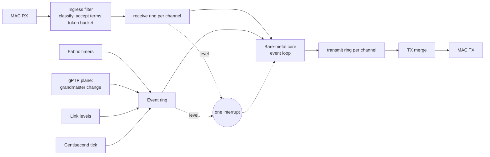
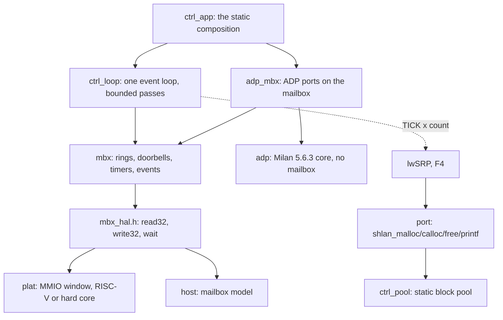

<!-- SPDX-License-Identifier: CERN-OHL-W-2.0 -->
# Packet mailbox split: the contract, the HAL and the ADP slice (#665 lane F0)

Status: **F0 implemented behind a default-off build switch.** The all-fabric
build is unchanged and remains the shipping image. This page is the design
of the contract between the fabric and the bare-metal control-plane firmware.
The split integrates before P3; milestone 13 retains the hard-core port.
The [placement contract](../ARCHITECTURE_HW_SW_SPLIT.md) defines the Mark II default.
All-fabric stays the shipping default until F2 to F5 acceptance.
That acceptance covers all streams, counters and the audio soak.
The owner decisions of
2026-10-05 on [#640](https://github.com/kebag-logic/milan-fpga/issues/640)
and the directive on [#665](https://github.com/kebag-logic/milan-fpga/issues/665)
define the interface. The numbers live in one place, the generated
[reference page](../reference/MAILBOX_CONTRACT.md); this page explains them.

## Contents

- **[What moves, and what the fabric keeps](#what-moves-and-what-the-fabric-keeps)** -- The protocols the bare-metal core runs, what stays in the fabric, and the picture of rings, events and the one interrupt between them.
- **[One contract, four outputs](#one-contract-four-outputs)** -- The YAML that is the only place a number is written, the four files generated from it, and the drift, cross-output and planted-defect checks.
- **[Byte order](#byte-order)** -- Fixed bit positions for every 32-bit word, little-endian lanes for frame bytes, network order inside a frame.
- **[Rings, records and events](#rings-records-and-events)** -- The record shapes, commit order across channels, the doorbells and their range rule, the coalescing rule that keeps the event ring from ever dropping the last state of a source, and the interrupt levels.
- **[The ingress filter](#the-ingress-filter)** -- The full tuple per channel and its identity term with their clauses, tagged frames refused by construction, the own MAC per interface, two-sided AECP, FILTER_MISMATCH, the token bucket, and the MRPDU form the SRP channel hands lwSRP.
- **[Bus adapters and the hard core](#bus-adapters-and-the-hard-core)** -- Wishbone for the on-chip RISC-V and AXI4-Lite for a hard core with every output registered, neither adding anything to the contract.
- **[The firmware: bare metal first](#the-firmware-bare-metal-first)** -- No OS, no heap: the three-function bus port, lwSRP's port layer on a static pool at a pinned revision, the event loop's per-pass order and when it may sleep, and protocols as ports-and-adapters modules.
- **[The ADP slice](#the-adp-slice)** -- Milan v1.2 5.6.3 over the mailbox, the available_index a DEPARTING carries, owed frames and their order, fields from the entity model, the tag rule for raced expiries, and the service-latency bound with its assumptions.
- **[Verification](#verification)** -- The suite through both adapters, the same checks on the host model, the co-simulation, the host tests, the reused processor walk and the planted defects.
- **[Default build](#default-build)** -- What the switch adds when on, the CPU netlist it regenerates, and the gateware-export comparison that shows every shipped config unchanged when off.
- **[Measured area](#measured-area)** -- The switch-on skeleton placed and routed out of context, per block, against the #640 estimate, with the levers and the recipe.
- **[Open items](#open-items)** -- The datapath tap, the listener's ADP terms, lwSRP's transmit hook, the CPU-cycle measurement and MMRP.

## What moves, and what the fabric keeps

The bare-metal core runs ADP, ACMP, MAAP, SRP (through lwSRP) and AECP. The
fabric keeps framing and timestamps, the gPTP plane, the media path,
the timers that carry hard deadlines, and an ingress filter. The two exchange
frames through packet mailboxes: block-RAM rings, a doorbell per ring, one
interrupt, 32-bit accesses only and no DMA.



F0 builds the contract, its generator, the fabric skeleton, the HAL with
lwSRP's port layer, the host model and harness, and ADP as the first slice
through all of them. The datapath tap that feeds the skeleton comes with the
protocol lanes that need it (F2 to F5).

## One contract, four outputs

[`sw/mailbox/mailbox.yaml`](../../sw/mailbox/mailbox.yaml) is the only place
a register offset, a field position, a ring size or a filter rule is written.
[`sw/mailbox/gen_mailbox.py`](../../sw/mailbox/gen_mailbox.py) emits:

| Output | What it carries |
|---|---|
| [`hdl/milan/mailbox/KL_mbx_pkg.sv`](../../hdl/milan/mailbox/KL_mbx_pkg.sv) | every constant as `MBX_<name>_C`, and the per-channel tables the RTL indexes at run time |
| [`hdl/milan/mailbox/KL_mbx.sv`](../../hdl/milan/mailbox/KL_mbx.sv) | the fabric skeleton: ports, register decode, one ring per direction per channel |
| [`sw/firmware/ctrl/mbx/mbx_contract.h`](../../sw/firmware/ctrl/mbx/mbx_contract.h) | the same constants as `MBX_<name>` for C |
| [`docs/reference/MAILBOX_CONTRACT.md`](../reference/MAILBOX_CONTRACT.md) | the reference tables, and a constant table the self-test reads back |

The generator refuses a contract that cannot be built: overlapping fields, a
ring that is not a power of two or overlaps another, two channels that claim
one EtherType, a register outside its block, a filter field past the frame,
a read-only field the skeleton has no fabric source for, a match tuple that
names a VLAN tag's TPID or no destination.

`--check` regenerates every output in memory and fails on any byte of drift.
`--crosscheck` reads the three constant carriers back by name and fails on a
field mismatch between them, whatever produced it. `--selftest` plants a
mismatch into each output (14 arms) and a defect into the YAML (12 arms), and
requires each to be caught, after a clean positive control. It also builds
the two-interface variant the suite uses, which must cross-check clean, and
requires a four-interface one, whose blocks would overlap the global
registers, to be refused. `--variant-interfaces N --out DIR` writes such a
variant into a build directory, never into the tree. The leaves (`KL_mbx_ring`, `KL_mbx_rx`, `KL_mbx_tx`,
`KL_mbx_evt`) and the two bus adapters are written by hand against the
package, so a contract change reaches them through the constants.

Versioning: a change that moves or resizes anything raises `major`, and so
does one that narrows what the filter passes; one that only adds raises
`minor`. The fabric publishes both in `ID`, and the firmware's `mbx_open()`
refuses a major it was not built against.

## Byte order

Every register, record header word and event word is one 32-bit value whose
fields sit at fixed bit positions, so its meaning never depends on the host's
byte order. Frame bytes travel four to a ring word in little-endian lanes:
frame byte k is ring word k/4, bits 8*(k%4)+7 down to 8*(k%4). Wire fields
inside a frame keep network order, and the firmware's wire layer
([`wire.h`](../../sw/firmware/ctrl/wire/wire.h)) reads them byte by byte. A
big-endian hard core reads the same values as the RISC-V.

## Rings, records and events

Each ring has one producer and one consumer, a 16-bit head and tail counted
in words, and storage the producer writes only past the consumer's tail.

- **RX record:** two header words (length, interface, kind; arrival time in
  NOW_MS) then the frame, FCS stripped. The fabric writes the payload words,
  then the header, then moves RX_HEAD past the whole record, so the core never
  reads a partial one.
- **TX record:** the same shape, written by the core, committed by TX_HEAD;
  its second word carries SEQ, the core's count of TX records committed on
  every channel. The TX merge checks a record before a byte leaves and
  flushes a ring to TX_HEAD on a malformed one, because a length that cannot
  be trusted leaves no next record to find. TX_TAIL moves only after the last
  byte has left.
- **Event record:** four words. The sources are a link level change, a
  grandmaster change published by the gPTP plane, a fabric timer expiry with
  the tag of the arm it belongs to, and the centisecond tick.

Records leave in **commit order across channels** (the ruling on PR #668,
comment 5994730420). Before each record the merge reads SEQ from the oldest
record of every channel that holds one and sends the one whose SEQ comes
first modulo 2^16, so an ACMP response leaves before the AECP notification
committed after it (#653), whichever channel the merge served last and
however long the sink stalled. The scan starts after the channel served
last, so equal SEQs leave round-robin. The driver stamps SEQ; the count
belongs to one run of the firmware, since the transmit rings are not
readable and a restart cannot resume it.

Every event source is **coalesced**: a source holds at most one unposted
record and posts its state at posting time, only into four free words. The
ring therefore cannot overflow and drop the last state of anything. A link
that flaps while the ring is full posts its level once; ticks counted while
their record waits are posted as one record with the count.

The doorbells are the counter writes themselves: RX_TAIL releases RX space,
TX_HEAD commits TX records, EVT_TAIL releases events. A counter the host
writes out of range (a partial reset, a driver fault) never lets the fabric
write over a ring: an RX_TAIL or EVT_TAIL more than the ring behind its head,
or ahead of it, leaves no free word until it is back in range, and a TX_HEAD
more than the ring ahead of TX_TAIL is refused like a malformed record. The
one interrupt is the OR of the enabled levels (a receive ring or the event
ring not empty) and a sticky error, so a service pass that drains the rings
leaves the line low.

## The ingress filter

The filter implements the owner's full-tuple acceptance rules
([#664, comment 6014311316](https://github.com/kebag-logic/milan-fpga/issues/664#issuecomment-6014311316)),
which [product ownership](../../REQUIREMENTS.md#1-product-ownership) and
[NFR-SCOUT-08](../reference/FR_NFR.md#34-fabric-scale-out-and-future-ports)
state (#665 lane FC; F0 classified on EtherType and subtype alone).

A frame is classified when its byte 14 arrives, by its full tuple. A channel's
match tuple holds when the destination MAC is the tuple's address, or, for an
`own` tuple, the `OWN_MAC` of the interface the frame arrived on; the
EtherType is the tuple's; and the AVTP subtype is the tuple's where it names
one. The frame is then stored only when its channel is open, one of the
channel's accept terms (its identity term) holds, it fits the channel's
largest frame and the free ring space, and the channel's token bucket holds a
token.

| Channel | Destination MAC | EtherType | Subtype | Passes | Clause |
|---|---|---|---|---|---|
| `adp` | `91:E0:F0:01:00:00` | `0x22F0` | `0xFA` | ENTITY_DISCOVER for entity_id 0 or this entity | IEEE 1722.1-2021 6.2, Table B.1; Milan v1.2 5.6.3.1 |
| `acmp` | `91:E0:F0:01:00:00`, or own unicast (the owner's receive tolerance) | `0x22F0` | `0xFC` | a command or response naming this entity as talker or listener | IEEE 1722.1-2021 8.2.1, Table B.1 |
| `aecp` | own unicast | `0x22F0` | `0xFB` | a command for this target, or a response for this controller | IEEE 1722.1-2021 9.2.2.4 (Table 9-1), 9.2.2.7, 9.2.2.8; Milan v1.2 5.4.5.3 |
| `maap` | `91:E0:F0:00:FF:00` | `0x22F0` | `0xFE` | a PROBE, DEFEND or ANNOUNCE overlapping this entity's range | IEEE 1722-2016 Annex B, Table B.10 |
| `srp` | `01:80:C2:00:00:0E` with `0x22EA` (MSRP); `01:80:C2:00:00:21` with `0x88F5` (MVRP) | as paired | none | every MSRP and MVRP PDU | IEEE 802.1Q-2018 35.2.2, 11.2.3.1.3, Tables 10-1 and 10-2 |

- **Tagged frames reach no mailbox, by construction.** An 802.1Q tag puts
  its TPID where the EtherType is read (wire bytes 12 and 13), and no tuple
  may name a TPID: the generator refuses `0x8100`, `0x88A8` and `0x88E7`
  (IEEE 802.1Q-2018 Table 9-1). A tagged frame therefore matches no tuple
  and is of no control EtherType, so it reaches no channel and no counter.
  AAF and CRF have no channel, so a stray untagged one is refused too.
- **Own unicast is the arrival interface's MAC, never any unicast.** Each
  interface has `OWN_MAC_LO` and `OWN_MAC_HI` in its own filter block
  (`0x080 + 8 * i`). The filter compares a frame's destination with the
  `OWN_MAC` of the interface the RX record will carry. An index with no
  interface behind it has no own MAC. The firmware writes every interface's
  own MAC before it opens a channel (`ctrl_loop_open`). The app gives each
  interface the entity's MAC, which ADP sends on every interface.
- **AECP is two-sided.** A command (an even message_type) passes when
  target_entity_id is this entity. A response (an odd one) passes when
  controller_entity_id is this entity, such as the CONTROLLER_AVAILABLE reply
  of Milan v1.2 5.4.5.3. The reserved values 10 to 13 keep that parity, which
  is how the fabric's AECP engine reads them.
- **Counted drops.** An untagged frame whose EtherType some tuple names
  (`0x22F0`, `0x22EA` or `0x88F5`), and which matches no tuple, counts once
  in `FILTER_MISMATCH` at its end. Like `RX_DROP` and `RATE_DROP`, it sets
  `IRQ_STATUS.ERR`. The counter judges the tuple whatever `FILTER_EN` holds.
  A frame refused by its identity term, or for a closed channel, is not
  addressed to this entity and is dropped uncounted. So is a frame that ends
  before byte 14. A size or space drop counts in `RX_DROP`, a rate drop in
  `RATE_DROP`.
- **The token buckets stay.** Only a committed frame takes a token, so a
  frame the filter refuses spends none.

This narrows what the filter passes, so the contract went to major 2. A
firmware built against major 1 would not write the own MAC the AECP channel
now matches, and `mbx_open()` refuses the other major.

The SRP record carries the whole frame, so the MRPDU (ProtocolVersion first)
is frame bytes 14 onward: the contiguous buffer lwSRP's `mrp_rx()` and
`mrpdu_parse()` take, with the record's interface as `port_id`.

## Bus adapters and the hard core

`KL_mbx` answers every host request one cycle later on a minimal port.
[`KL_mbx_wb`](../../hdl/milan/mailbox/KL_mbx_wb.sv) presents it to the
on-chip RISC-V over Wishbone; [`KL_mbx_axil`](../../hdl/milan/mailbox/KL_mbx_axil.sv)
presents the same window to a hard core over AXI4-Lite. Neither adds to the
contract: 32-bit accesses, the refusal of a partial byte strobe (counted in
BUS_ERR) and every register's meaning are `KL_mbx`'s. The mailbox suite runs
every check through both.

Every AXI4-Lite output is a register or a function of registers only: no
path runs from an input to an output (AMBA AXI, IHI0022H, A3.1.1 and
A3.2.1). AW, W and AR are each taken into a one-entry slot by their own
handshake, in either order and in any cycle; READY is the emptiness of the
slot. A write goes to `KL_mbx` once both of its slots are full, a read once
its slot is, one request at a time, and B and R hold, with their payload,
until BREADY or RREADY. A write goes first when both wait; its B slot then
blocks the next write for a cycle, so a waiting read goes next. The AXI4-Lite
build adds its own checks to the suite: AW before W and W before AW, a read
beside a write, B and R held under backpressure, a reset with a transfer half
taken, back-to-back writes to distinct registers read back (each W paired with
its own AW, beside it and running ahead of it), and a probe that, on every
clock of the run, moves each AXI input with the clock held and requires every
AXI output to stay put.

A hard core with a weakly ordered memory model must map the window as device
(strongly ordered) memory, or put a barrier before each doorbell write, so a
record's words reach the window before its counter.

## The firmware: bare metal first

The firmware ([`sw/firmware/ctrl`](../../sw/firmware/ctrl/README.md)) has no
OS, no heap and no threads (the directive of 2026-10-05, #665 comment
5992455815). It is portable C11 in layers, each reaching the next only
through a small interface:



- **The bus port** is three functions (`mbx_hal.h`): a 32-bit read, a 32-bit
  write, and a wait that may return early. The MMIO implementation takes the
  window base from the SoC's generated memory map (`CTRL_MBX_BASE`); the host
  implementation drives the mailbox model and counts every access.
- **lwSRP's port layer** is provided here, with lwSRP's own prototypes, as
  of lwSRP `19f5796b63652eb1151906de73cb827d4980a53f` (fetched from
  `https://github.com/kebag-logic/lwSRP` and checked out at that revision;
  the host test's lwSRP arm refuses another revision or an edited `src/`):
  `shlan_malloc`, `shlan_calloc` and `shlan_free` on a static block pool, and
  `shlan_printf` on a debug sink with one bounded line buffer. The pool is
  carved at boot from an arena the platform declares statically; an
  allocation takes the smallest class with a free block, a refusal is counted,
  and a double free or a foreign pointer is refused rather than corrupting a
  free list.
- **The event loop** runs passes in a fixed order (the events-first ruling
  on PR #668, comment 5994730420): first at most 8 event records, in ring
  order, each to every sink; then each bound channel's receive ring, at most
  2 records each; then one poll per module. A TICK record's count is fanned
  out to every registered centisecond consumer, lwSRP's `shlan_timer_tick()`
  among them, at most 16 centiseconds per pass with the rest carried (a
  later record's count adds to what is carried), so lwSRP's leave, LeaveAll
  and periodic timers run on fabric time, lose no tick when the core is
  late, and catch up a bounded slice at a time.
  Register `shlan_timer_tick` once, not lwSRP's `mrp_tick()` per
  application: `mrp_tick()` calls the same global tick, so one registration
  per MRP application would advance every timer that many times per
  centisecond.
- **The loop sleeps only when nothing is owed.** A poll returns whether its
  module still owes output, such as a frame its transmit ring had no room
  for. A pass that handled anything, or after which output or centiseconds
  are still owed, is followed by the next at once; only a pass that handled
  nothing and owes nothing sleeps in `mbx_hal_wait()`. Everything the core
  can then be waiting for raises the interrupt, so a platform that sleeps
  there (`CTRL_MBX_WFI`, which also needs the SoC's `ctrl_mbx` interrupt
  source and the CPU's interrupt mask enabled) never strands an owed frame.
- **A protocol is a ports-and-adapters module**, as lwSRP is. The ADP core
  ([`adp.h`](../../sw/firmware/ctrl/adp/adp.h)) knows no mailbox: it calls a
  send port, one timer per interface, the gPTP pair, the link level and a
  seed. The mailbox adapter maps those onto the driver; a test maps them onto
  fakes.

`ctrl_loop_open()` brings the mailbox up in the contract's order: check the
contract, write the filter's entity_id, enable the interrupt causes, start
the tick when a centisecond consumer is bound, and only then open the bound
channels.

## The ADP slice

One instance per AVB interface implements Milan v1.2 5.6.3 over the IEEE
1722.1-2021 6.2 ADPDU:

- ENTITY_AVAILABLE on its schedule: a random TMR_DELAY (0 to 2 s at startup
  with the link up, 5.6.3.5.2; 0 to 4 s otherwise), the frame, then
  TMR_ADVERTISE (5 s, 5.6.3.5.9), with available_index incremented after each
  frame sent (IEEE 1722.1-2021 6.2.2.15; Figure 6-2, WAITING);
- the ENTITY_DISCOVER answer for entity_id 0 or this entity, in WAITING
  (5.6.3.1, 5.6.3.5.4);
- the re-advertise on a grandmaster change (5.6.3.5.7);
- ENTITY_DEPARTING on SHUTDOWN (5.6.3.5.8, 5.6.3.5.11), never on a link
  change (5.6.3.5.6, 5.6.3.5.10).

ENTITY_DEPARTING carries the **current** available_index (the ruling on PR
#668, comment 5994972330). In the Advertise Interface state machine (IEEE
1722.1-2021 Figure 6-3), `doTerminate` leads to DEPARTING and
`txEntityDeparting()`, which sets every field but the per-interface ones from
the entityInfo variable (6.2.5.2.2); in the Advertise Entity state machine
(Figure 6-2) only INITIALIZE sets `entityInfo.available_index = 0`. The reset
"when transmitting an ENTITY_DEPARTING" of 6.2.2.15 therefore shows on the
next start: its first ENTITY_AVAILABLE carries 0. The processor's
`KL_adp_engine` sends the same values. The host test reads the field off the
wire for SHUTDOWN in WAITING and in DELAY, sent at once and deferred, the
restart, and the 32-bit wrap.

A frame the transmit ring has no room for is owed, and nothing that follows
drops an owed ENTITY_DEPARTING. A SHUTDOWN's DEPARTING keeps the index
current at that SHUTDOWN until the ring takes it, across a restart, a timer
expiry, a link change or another SHUTDOWN, and the oldest leaves first. A
restart's ENTITY_AVAILABLE never passes an owed DEPARTING: if its TMR_DELAY
expires first, the AVAILABLE is owed too, the machine stays in DELAY with no
timer running, and the AVAILABLE leaves, TMR_ADVERTISE is armed and WAITING
entered, only after the last owed DEPARTING. A DEPARTING queued behind another
therefore carries 0, because its run could send no AVAILABLE. An owed AVAILABLE
is dropped only by a link loss or a SHUTDOWN, which end the run it would have
announced; a GM change, an ENTITY_DISCOVER or a stray expiry in DELAY leaves
it owed (Table 5.51 ignores the first two there). A poll sends at most one
frame, so the per-pass bound below is unchanged. The host test runs the case
through the core's ports and through the driver, the model's timer and the
loop: advertise, fill the ring, disable, enable, let the new TMR_DELAY expire,
then drain. The wire carries DEPARTING with index 1, then AVAILABLE with index
0, then the machine is in WAITING with TMR_ADVERTISE armed and owes nothing.
It also checks a link loss and its return during the restart, before and after
the expiry (the DEPARTING stays owed), the three inputs that leave an owed
AVAILABLE owed, and a link loss that drops one with no poll in between.

At most two DEPARTINGs are owed, by construction (the round-4 assignment on
#665, comment 5999248955): the oldest, with its index, and one queued behind
it, which carries 0. A SHUTDOWN that finds both owed adds no third. It is
coalesced into the queued one and counted (`departing_coalesced`): its
DEPARTING would also carry 0, and nothing the interface sends can leave
between the two, so it could only repeat the queued frame back to back. The
wire keeps every distinct frame in order and drops only that repeat, which no
receiver acts on. A Milan listener that took the DEPARTING before it is in
TK_NOT_DISCOVERED, where RCV_ADP_DEPARTING is ignored (Milan v1.2 Table
5.54), and IEEE 1722.1-2021's `removeEntity` (6.2.6.3.5) finds no record left
to remove. The host test fills both places and then shuts down 100,001 more
times. Each of those SHUTDOWNs is counted, and the two owed DEPARTINGs and the
oldest one's index are unchanged. Once room returns, the wire carries
DEPARTING 1, DEPARTING 0, then the restart's AVAILABLE 0.

The ADPDU fields come from the entity model through the same derivations the
fabric's engine is fed from:
[`adp_entity.py`](../../sw/firmware/ctrl/adp/adp_entity.py) reads the
builder's ADP identity and shape and the processor's `ADP_ENTITY_CAPS_C`, and
the host test compares every field, for every shipped config, with what the
fabric is programmed and compiled with.

The fabric timer slot of an interface carries every arm with a fresh tag. An
expiry already in the event ring when the firmware stopped or re-armed the
slot carries the old tag and is discarded by it: the mailbox form of Table
5.51's "x" cells.

The listener's discovery machine (5.6.4) feeds ACMP and belongs to F3. Its
ENTITY_AVAILABLE and ENTITY_DEPARTING from bound talkers need an accept term
the ADP channel does not carry yet; adding one is a minor contract change.

F3 must also meet the listener-discovery timing requirement.
[H-DISC](../reference/FR_NFR.md#342-control-service-test-hooks) starts at received AVAILABLE/DEPARTING publication or original TMR_NO_ADP expiry.
It ends after discovery and resulting connection-state commitments.
Any resulting TX commit shares that same service allowance.
Normative waits are recorded separately; service remains <= 10 ms.
Milan v1.2 5.6.4.1 requires processing every matching bound sink.
Sections 5.6.4.5.1/.2 arm/reset aging from the received `valid_time`.
IEEE 1722.1-2021 6.2.2.5 defines its two-second units.
Table 5.54 and 5.6.4.5.1-.4 supply the transition checks.
They cover available_index restart, interface/GM/domain mismatch, departing and expiry.
Delayed receive handling or aging must fail H-DISC independently.
F0's advertiser checks do not establish this listener timing.

### Service latency

The figures below are F0's conditional mailbox-access evidence.
[NFR-SCOUT-03](../reference/FR_NFR.md#341-control-service-budget-and-normative-timing)
adds the proposed 10 ms project budget for integrated firmware.
Its [hooks](../reference/FR_NFR.md#342-control-service-test-hooks) count backlog and egress separately.
F0 does not prove that target-time budget.

The D3 ruling on #640 asks each lane to state and test a deterministic upper
bound per response path. The bound is stated in mailbox accesses and holds
under four assumptions ([`ctrl_loop.h`](../../sw/firmware/ctrl/loop/ctrl_loop.h)):

- **A1, backlog.** At most a full event ring (16 records; the ring holds no
  more) and at most a full receive ring per channel, counted in the smallest
  record the filter passes (a frame that reaches the subtype byte: 6 words, so
  42 in the ADP ring).
- **A2, callbacks.** A sink, a handler, a centisecond consumer and a poll
  each cost at most the accesses its module states, and none waits on the
  fabric.
- **A3, transmit room.** A response finds room in its transmit ring, and its
  module owes no frame ahead of it. When it does not, its module owes it and
  the loop keeps passing. A poll sends one owed frame per pass and interface,
  oldest first. So a response with k frames owed ahead of it is committed in
  pass k + 1, counted from the first pass that starts after the merge frees
  the room, and not before the pass that takes its input. A module bounds k;
  for ADP, k is at most 2.
- **A4, bus.** The figures count accesses. Time is that count times the
  platform's cost per access, which F0 has not measured.

Every input is handled inside the pass that takes it. An event is taken by
the second pass that starts after the fabric posts it (16 records, 8 per
pass, events first); a record of a channel by pass ceil(backlog / 2), 21 for
ADP. A pass of F0's composition costs at most 407 accesses (8 events at 6 +
31, 2 ADP records at 36 + 4, one poll at 31). With the pass already running
when the input arrived, and under A3, an event's response is committed
within 3 x 407 = 1,221 accesses and an ADP record's within 22 x 407 = 8,954.
At an assumed 1 us per access, which is not a measurement, that is under 9 ms
against Milan's 0 to 4 s TMR_DELAY and 5 s TMR_ADVERTISE (Table 5.50).

An owed response (A3) can leave after the pass that takes its input. An
ENTITY_AVAILABLE behind k owed DEPARTINGs (k at most 2) is committed in pass
k + 1, counted from the first pass that starts after the room returns. If the
pass that takes its TMR_DELAY expiry comes later (by pass 2, as for any
event), it is committed in that pass. Either way it is committed by pass 3,
counted from the first pass that starts after both the room's return and the
expiry. With a pass already running then, that is within 4 x 407 = 1,628
accesses (`ADP_MBX_OWED_PASSES`, `ADP_MBX_OWED_ACCESSES`). The host test
leaves 1, 2 and 64 SHUTDOWNs behind a full ring, takes the expiry before and
after the room returns, and requires the AVAILABLE in pass k + 1 (measured: 63
to 99 accesses, the same for 64 SHUTDOWNs as for 2).

Each response path's own cost, in the pass that takes the input, with
nothing else pending:

| Path | Mailbox accesses in the pass | Response |
|---|---:|---|
| RCV_ADP_DISCOVER | 31 | TMR_DELAY armed |
| TMR_DELAY expiry | 39 | ENTITY_AVAILABLE committed, TMR_ADVERTISE armed |
| TMR_ADVERTISE expiry | 11 | TMR_DELAY armed |
| GM_CHANGE | 11 | TMR_DELAY armed |
| LINK_UP / LINK_DOWN | 11 / 9 | TMR_DELAY armed / timer stopped |
| SHUTDOWN | 29 | ENTITY_DEPARTING committed |

The figures are `ADP_MBX_LAT_*`, `ADP_MBX_PASS_MAX`, `ADP_MBX_EVT_ACCESSES`
and `ADP_MBX_RX_ACCESSES` in [`adp_mbx.h`](../../sw/firmware/ctrl/adp/adp_mbx.h),
with their derivation. The host test counts every access of each path on the
model and fails one that exceeds its bound. It then fills both rings with
legal records (15 timer expiries and ADP's own TMR_DELAY expiry last, 28
minimal ENTITY_DISCOVERs) with 30 centiseconds coalesced behind them, and
requires events first in every pass, the expiry's ENTITY_AVAILABLE in pass 2
(measured: 175 accesses), the receive ring cleared by pass 14 (457
accesses), no pass above 407 (measured: 105), every centisecond delivered at
most 16 per pass, and no sleep before the backlog is gone. A measurement in
CPU cycles on the shipping core needs the switch-on SoC in the CPU
simulation and is left open (see [Open items](#open-items)).

## Verification

| Evidence | What it shows |
|---|---|
| [`tb/verilator/mbx`](../../tb/verilator/mbx/README.md), `make` | 285 checks through the Wishbone adapter and the same 285 through the AXI4-Lite adapter: register masks, partial-strobe refusal, every filter rule, drops that never touch an unread record, the rate limiter, the TX merge, its commit order and its refusals, out-of-range host counters, timers, every event source and its coalescing, the GM snapshot, the interrupt levels; then the AXI4-Lite build's own 45 handshake checks |
| the full-tuple filter, in the same suite | a positive control per table row; the tag, destination, EtherType, subtype and identity changed one at a time per row, with `FILTER_MISMATCH` counting each tuple failure once and nothing else; untagged AAF and CRF never delivered; the CONTROLLER_AVAILABLE response delivered, one for another controller dropped, every message_type both ways; the own MAC per interface index; the bucket apart from the filter |
| `make run-if2` | the same suite on the contract elaborated for two interfaces, written into the build directory by the generator: through both adapters and on the host model, so another interface's own MAC is refused on two real interfaces |
| the same suite on the host model | the 285 checks the RTL passes, run on the model the firmware tests rely on, so the model answers to the RTL's expectations |
| the co-simulation (`make run-cosim`) | the firmware on the RTL through Wishbone and on the model, one scenario: identical frames at identical NOW_MS |
| [`sw/firmware/ctrl/test`](../../sw/firmware/ctrl/README.md) | the port layer, the driver, the loop, the ADP core and adapter, the latency bounds, the entity fields per shipped config, a freestanding RV32I build with no heap symbol, and (given a checkout) lwSRP's own MRP core on the port layer |
| [`sw/firmware/gtest`](../../sw/firmware/gtest/README.md) | the firmware's host suites on GoogleTest and GoogleMock under a tally listener, and the firmware's line and branch coverage held by a ratchet, run in `rtl-fast`'s `firmware-unit` job |
| the processor's ADP walk, reused | 36 cells of the processor suite's own Table 5.51 transcription and its own frame builder, cut from the pinned submodule at build time, drive the firmware through the model |
| planted defects | every arm of [`mutants.py`](../../tb/verilator/mbx/mutants.py) (`make mutants`; five of them in the default `make`) and of [`ctrl_mutants.py`](../../sw/firmware/ctrl/test/ctrl_mutants.py) (`--self-test`), each caught by the check it names; each campaign prints its own total. Every filter rule has a defect in the RTL and one in the host model |

## Default build

`--ctrl-mailbox` in [`milan_soc.py`](../../sw/litex/milan_soc.py) is off by
default. Off, the SoC adds no source, no instance, no bus region, no CSR bank
and no interrupt. On, it adds the seven mailbox sources, `KL_mbx` behind
`KL_mbx_wb` in the IO region, a CSR bank pinned below the existing observer's
page so no existing bank moves, and one interrupt. It also regenerates the
CPU netlist: the VexiiRiscv wrapper hashes the SoC's memory-region list into
the netlist's name and hands each region to the CPU generator
(`--memory-region`), and the new uncached `ctrl_mbx` region changes that
list, so a switch-on build carries a different `VexiiRiscvLitex_<hash>` from
the shipping one. The datapath side is held
idle in F0.

The proof is a gateware export (no Vivado) of every shipped config, with the
base and the head `milan_soc.py`, compared after removing the run's
timestamps, output paths and LiteX's comment-only hierarchy tree, whose order
varies between runs. All 22 generated files compare equal for both AX7101
configs at their shipping arguments. This LiteX checkout refuses the three
Arty configs at their 83.333 MHz system clock, at the base exactly as at the
head, so they are compared at 100 MHz instead, where all 22 files compare
equal too.

## Measured area

The switch-on skeleton, `KL_mbx` behind `KL_mbx_wb` wired as the SoC wires
them (`tb_mbx_top` with `HOST_P=0`), out of context on `xc7a100tfgg484-2` at
the 100 MHz system clock, Vivado 2026.1 default directives, synthesized,
placed and routed (2026-10-05, the lane's round-2 RTL):

| Block | LUT | FF | RAMB36 | RAMB18 |
|---|---:|---:|---:|---:|
| `KL_mbx_rx` (filter, buckets, RX writer) | 1,003 | 994 | 0 | 0 |
| `KL_mbx_evt` (16 timer slots, poster, tick) | 731 | 978 | 0 | 0 |
| `KL_mbx_tx` (TX merge in commit order) | 546 | 280 | 0 | 0 |
| `KL_mbx` registers, decode, read mux | 275 | 484 | 0 | 0 |
| the eleven rings (flattened into `KL_mbx`) | | | 1 | 10 |
| `KL_mbx_wb` | 66 | 1 | 0 | 0 |
| **Total** | **2,641** | **2,737** | **1** | **10** |

All 5,524 routable nets routed, WNS +0.240 ns at 10 ns, no DSP. The
commit-order scan replaced the round-robin arbiter's modulo logic, so the
merge is 132 LUT smaller than the round-1 merge (678), and the whole skeleton
115 smaller (2,756 at the round-1 RTL). The rows sum to 2,621 LUT:
the remainder is logic of the flattened rings and LUTs Vivado combined across
the hierarchy. The eleven rings (ten channel rings and the event ring) are one
block RAM each: the SRP receive ring the RAMB36, every other a RAMB18. There is no
bar yet (#665). It is above the
#640 estimate of 1,500 to 2,000 LUT for the added fabric; the obvious levers
are the timer bank (sixteen 48-bit slots in flip-flops, scanned one per clock,
which fits distributed RAM) and the filter's per-term 64-bit field registers,
which one shared field register per frame would replace.

```tcl
read_verilog -sv [list hdl/milan/mailbox/KL_mbx_pkg.sv hdl/milan/mailbox/KL_mbx_ring.sv \
  hdl/milan/mailbox/KL_mbx_rx.sv hdl/milan/mailbox/KL_mbx_tx.sv hdl/milan/mailbox/KL_mbx_evt.sv \
  hdl/milan/mailbox/KL_mbx.sv hdl/milan/mailbox/KL_mbx_wb.sv hdl/milan/mailbox/KL_mbx_axil.sv \
  tb/verilator/mbx/tb_mbx_top.sv]
synth_design -mode out_of_context -top tb_mbx_top -part xc7a100tfgg484-2 -generic HOST_P=0
create_clock -period 10.000 -name clk [get_ports clk_i]
opt_design
place_design
route_design
report_utilization -hierarchical
report_timing_summary -delay_type max
```

## Open items

- **The datapath tap.** The skeleton's ingress and egress byte streams, link
  levels and grandmaster inputs are held idle; the lanes that move a protocol
  connect them, with the clock crossing the datapath needs.
- **The listener's ADP terms** (above), for F3.
- **lwSRP's transmit path.** lwSRP schedules a transmission per attribute but
  has no PDU transmit hook yet; F4 adds one as a lwSRP pull request, and its
  frames then enter the SRP channel's transmit ring as header plus MRPDU.
- **CPU cycles.** The latency bounds are counted in mailbox accesses; the
  cycle figure on the shipping core waits for the switch-on SoC in the CPU
  simulation.
- **MMRP** is not carried: Milan end stations need MSRP and MVRP only.
