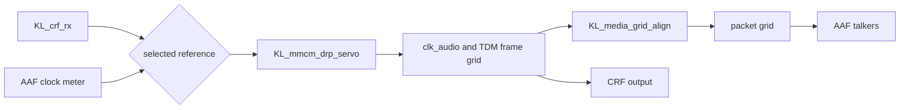

<!-- SPDX-FileCopyrightText: 2026 Kebag Logic -->
<!-- SPDX-License-Identifier: CERN-OHL-W-2.0 -->

# Media-clock following: one selected AAF or CRF source

Relates to #629. **A design proposal, not implemented.** It was written against
dev `d4dd7426`. Every code citation is `path:line` at that commit, and every
`protocol-processor/` path is at the pinned submodule commit `b2db3a97`.

The end station is to follow either an AAF talker's media clock or a CRF
talker's media clock, with exactly one source selected at a time through its
CLOCK_DOMAIN. The decision is recorded in #629's body (2026-10-01). It reverses
#389 option (a) for AAF Stream Inputs, and the CRF path stays.

This page records the clause reading behind the change, the current state, the
design options with a recommendation, the change lists for this repository and
for the protocol processor, and the test plan. No RTL, builder, model,
configuration or processor change comes with it. The choices it needs are
listed under [Decisions requested](#decisions-requested).

## Contents

- **[Baseline](#baseline)** -- What bench lane B6 measured on the shipping image: CRF following works, AAF following is absent, and the two outputs disagree at INTERNAL.
- **[Clause findings](#clause-findings)** -- The clause reading by question: a source per AAF input, a stopped stream, the `mr` rules, and what the current reading gets wrong.
- **[Current state](#current-state)** -- The builder, entity model, processor and fabric as they are at dev `d4dd7426`, each fact with its `path:line`.
- **[Design](#design)** -- The chain, the source order, the AAF clock meter, selection, switching, holdover, `mr`, A2, the domain counters, the phase gap and the area, with options.
- **[Parent-visible changes](#parent-visible-changes)** -- Every requirement, configuration, builder, model, RTL, register and document change in this repository.
- **[Protocol-processor changes](#protocol-processor-changes)** -- The cross-repository plan: no processor RTL change, its documentation and tests, under its own issue.
- **[Test plan](#test-plan)** -- Simulation cases each with a failing mutant, and the bench cases by the B6 method.
- **[Decisions requested](#decisions-requested)** -- The seven choices a decision on #629 settles, each with a recommendation.
- **[Limits](#limits)** -- What this design does not establish.

## Baseline

Bench lane B6 measured the image of dev `ec0cc0c1`
([PR #630](https://github.com/kebag-logic/milan-fpga/pull/630), its findings
page at head `26dfc82f`, not merged when this page was written):

- **The DUT follows a CRF talker.** With CLOCK_SOURCE 1 selected the servo
  read LOCKED 6.5 s after the set, and the DUT's TDM clock and the reference
  peer's output advanced with 0 net steps in 30,237,600 frames (case B CRF,
  PASS).
- **AAF following is not in the image.** No CLOCK_SOURCE exists on an AAF
  Stream Input since #389.
- **At INTERNAL the DUT's two outputs disagree.** Its CRF output runs on the
  physical audio clock and its AAF stream on the free-running packet grid,
  10.64 ppm apart. A listener following the DUT's CRF drops one AAF frame per
  1.96 s beat (case A2, FAIL). It is tracked on #74
  ([comment](https://github.com/kebag-logic/milan-fpga/issues/74#issuecomment-5932380322)).

## Clause findings

### (a) A source per AAF Stream Input beside the CRF source

| Clause | What it says | Consequence |
|---|---|---|
| Milan v1.2 5.3.3.6 | Each Clock Domain has at least one CLOCK_SOURCE. For each Stream Input that supports the CRF Media Clock Stream Format, or for the single AAF Stream Input when the Configuration has no CRF input, there is exactly one INPUT_STREAM CLOCK_SOURCE located on that STREAM_INPUT. At least one INTERNAL source exists when the Configuration has a Stream Output. | A minimum set. It neither requires nor forbids an INPUT_STREAM source on an AAF input when a CRF input exists. "Exactly one" rules out two sources on one input. |
| IEEE 1722.1-2021 7.2.9, 7.2.9.2 (Table 7-17) | INPUT_STREAM: "the clock is sourced from the media clock of an Input Stream". The location type and index name the descriptor that holds it. | An AAF STREAM_INPUT is a valid location. |
| IEEE 1722.1-2021 7.2.32 (Table 7-61) | `clock_sources` lists the CLOCK_SOURCE indices the domain's `clock_source_index` may be set to. `clock_sources_count` is at most 216. | No ordering or grouping rule. The bound is far above the 10 sources of the 8x8 shape. |
| Milan v1.2 7.2.2 | An AAF Media Talker, and a listener with two or more AAF inputs, implements a CRF Media Clock Input per clock domain. | The CRF input must exist. The clause restricts no source. |
| Milan v1.2 7.6.2 | One Media Clock Domain per Clock Domain. | This entity has one domain, so every source sits in CLOCK_DOMAIN 0. |

**Answer.** An INPUT_STREAM CLOCK_SOURCE per AAF Stream Input may sit beside
the CRF input's source. The clauses allow at most one per Stream Input, require
the CRF input's, and cap the list at 216. They set no order. The protocol
processor adds one rule of its own: the list is the identity permutation
0..count-1, because its SET_CLOCK_SOURCE membership test is
`index < clock_sources_count` ([`07_memory_maps.md:135`](https://github.com/Mister-M-alt/protocol-processor-control-plane-avb-milan/blob/b2db3a970cedbbff2f8ba813acb96122c442bc58/docs/architecture/07_memory_maps.md?plain=1#L135),
`protocol-processor/hdl/aecp/ucode/gen_ucode.py:1410-1419`).

### (b) When the selected stream stops

What the listener must do:

- **Keep the selection.** Milan v1.2 5.3.11.1: at any time the domain uses one
  of its listed sources, and the current source is saved state. Milan v1.2
  5.4.2.15: while locked by a controller, the entity does not change a clock
  source by non-ATDECC means. So the index is not rewritten on a loss, and
  GET_CLOCK_SOURCE keeps reading the stream source. There is no silent
  fallback to INTERNAL.
- **Count the loss.** Milan v1.2 5.3.11.2 (Tables 5.7 and 5.15): LOCKED and
  UNLOCKED move on each lock and unlock of the media clock the domain uses, with
  LOCKED equal to UNLOCKED or one more. The meaning of "locked" is left to the
  manufacturer. The Stream Input's own MEDIA_UNLOCKED (Milan v1.2 Table 5.6)
  counts the stream's loss.
- **Signal it on its own streams,** if it is also a talker: the `mr` rules
  in (c).

What it may do:

- **Hold the recovered clock.** IEEE 1722-2016 4.4.4.7, NOTE: a listener that
  sees `tu` usually stops adjusting its media clock and lets it free-wheel,
  which corrupts the media least.
- **Recover any way it sees fit.** IEEE 1722-2016 4.4.4.3 and 10.4.3: the
  restart "need not be seamless", and the listener takes "any appropriate action
  to minimize the disruption".
- **Re-acquire** when the stream returns.

Milan sets no holdover duration and no fallback rule.

### (c) `mr` for a talker whose media clock follows a received stream

- **Source change.** IEEE 1722-2016 4.4.4.3: the talker toggles `mr` on a change
  in the source of its media clock, and holds the new value for at least eight
  AVTPDUs of a continuous stream. PICS Table F.7 items AAF-5 and AAF-6 make both
  mandatory for AAF.
- **CRF disruption and echo.** 4.4.4.3, third paragraph: when a talker receives
  a CRF stream, every stream deriving timestamps from it shall toggle `mr` if
  the CRF stream is disrupted or its `mr` toggles. 10.4.3: a CRF listener shall
  use `mr` to adjust its recovered clock quickly, and shall toggle `mr` in the
  outgoing streams that derive timestamps from the CRF stream. Both shalls name
  CRF only.
- **Which `mr` counts.** 4.4.4.3 last paragraph and 10.4.3 last paragraph: a
  listener uses only the `mr` of the stream it recovers its media clock from.
- **A followed AAF stream.** No clause makes a disruption or a received toggle
  a shall here. The source-change rule applies, and a talker toggles "each time
  a media clock restart is needed", so treating either as a restart is
  permitted. This design recommends it, for symmetry with CRF.
- **Phase, for the same talker.** IEEE 1722-2016 10.8, Equation (15): a talker
  that recovers its clock from CRF keeps its timestamps within +/-5.0 % of a
  sample period of the CRF timing points, modulo whole periods (+/-1,041.7 ns at
  48 kHz). 4.3.5: streams generated from a recovered stream differ from it in
  presentation time by a whole number of nominal periods. See
  [Phase alignment is a separate gap](#phase-alignment-is-a-separate-gap).

### (d) Where the current reading is wrong

1. **An exclusive set where the clause gives a minimum.** The 5.3.3.6 paraphrase
   is right as a minimum. FR-CLK-03 ([`FR_NFR.md:237`](../reference/FR_NFR.md), "No
   CLOCK_SOURCE is advertised on an AAF listener"), its status row (`:155`),
   descriptor rule L6 ([`PP_DESCRIPTOR_OWNERSHIP.md:89`](../reference/PP_DESCRIPTOR_OWNERSHIP.md),
   "AAF-derived sources are unsupported") and [`TIME_SYNC.md:141-145`](TIME_SYNC.md#media-boundary)
   and `:198` state #389's product decision, not the clause. With #389 (a)
   reversed, each changes.
2. **BAD_ARGUMENTS is attached to the wrong clauses.** #629's body and the
   compliance matrix's 5.4.2.15/.16 row
   ([`MILAN_COMPLIANCE_MATRIX.md:120`](../reference/MILAN_COMPLIANCE_MATRIX.md)) attach the refusal of an
   unlisted index to Milan v1.2 5.4.2.15 and 5.4.2.16, and FR-CLK-03 states it
   with no clause. Those clauses defer to IEEE 1722.1-2021 7.4.23 and 7.4.24,
   and 7.4.23.1 names no status for an unlisted index. The refusal
   follows from 7.2.32 (the list is the set the index may take) and Table 7-141
   (BAD_ARGUMENTS: a value "deemed to be bad"). 7.4.23.1 adds the rule the
   processor already keeps: a failed response carries the current value.
3. **Milan 7.2.2 is cited for a restriction it does not make.** The builder
   (`sw/builder/endstation_builder.py:3893-3899` and the docstring at
   `:5019-5028`) and the model consumer (`avdecc/aem_specs.py:234-241`) cite it
   for "only INTERNAL and the CRF sink drive the media clock". 7.2.2 requires a
   CRF input and restricts no source.
4. **A2's clause.** #74's comment cites Milan v1.2 7.2.3 for "a talker's CRF
   output must represent the same media clock as its AAF streams". 7.2.3 only
   requires that output to exist. The requirement holds on another basis: IEEE
   1722.1-2021 7.2.32 makes a CLOCK_DOMAIN "a source of a common clock signal",
   and Table 7-8 (7.2.6) has every STREAM_OUTPUT name in `clock_domain_index`
   "the Clock Domain providing the media clock for the Stream". Both outputs
   name CLOCK_DOMAIN 0. Milan v1.2 7.1's informative note says the same. A2 is
   a real defect on that basis.
5. **`mr` on an AAF disruption is a choice, not a shall.** #629's body says the
   4.4.4.3 disruption rule "applies to AAF and CRF following alike". The literal
   shall names CRF only (see (c)). Applying it to AAF is what this page
   recommends.
6. **Two RTL comments are stale since #74.** `hdl/milan/milan_datapath.sv:607`
   says the root cannot select CRF, and `:5576-5578` says it "hardwires INTERNAL
   against NONE".
7. **The compliance matrix.** The 7.2.3 row
   ([`MILAN_COMPLIANCE_MATRIX.md:187`](../reference/MILAN_COMPLIANCE_MATRIX.md)) reads implemented with no
   A2 caveat. The 5.4.2.15/.16 row (`:120`), the 5.3.11.1 row (`:175`) and the
   7.2.2 row (`:186`) restate the #389 set. No row records IEEE 1722-2016 10.8 or
   4.3.5.

## Current state

### Builder and entity model

| Fact | Where |
|---|---|
| Every shipping configuration declares `media_clock_sources: [internal, crf]` | `configs/endstation_ax7101_1x1_tdm8.yaml:128`, `configs/endstation_ax7101_8x8.yaml:146`, `configs/endstation_arty_8ch.yaml:132`, `configs/endstation_arty_4x4.yaml:96`, `configs/endstation_arty_current.yaml:166` |
| `_load_clocking` refuses `input_stream` by name and admits only `internal` and `crf` | `sw/builder/endstation_builder.py:3887-3902` |
| `crf` needs the CRF sink, and the sink needs `crf` | `sw/builder/endstation_builder.py:3956-3971` |
| The CLOCK_SOURCE overlay: INTERNAL at 0, then the CRF source located on STREAM_INPUT `len(L)`, the sink after the AAF listeners | `sw/builder/endstation_builder.py:5018-5045` |
| Before #389 the order was INTERNAL, one source per AAF listener, then CRF | `sw/builder/endstation_builder.py:4180-4203` at `aea44c071^` |
| The source set is model shape, so a change moves `entity_model_id` (IEEE 1722.1-2021 6.2.2.8) | `sw/builder/endstation_builder.py:3414-3419` |
| A config that prunes the servo may offer only `internal` | `sw/builder/endstation_builder.py:3292-3301` |
| Every Stream Output requires INTERNAL | `sw/builder/endstation_builder.py:4262-4267` |
| The model consumer knows `internal` and `crf`, and refuses `input_stream` as retired | `avdecc/aem_specs.py:22`, `:35`, `:234-241` |
| One rule gives the RTL its two facts, the count and the CRF index | `avdecc/aem_descriptors.py:428-442` |
| CLOCK_SOURCE descriptor, and a CLOCK_DOMAIN listing the identity permutation | `avdecc/aem_descriptors.py:445-462`, `:464-482`; emitted at `avdecc/aem_assemble.py:231-236` |
| The shape header carries `AEM_N_CLKSRC_C` and `AEM_CRF_CLKSRC_C` (`16'hFFFF` when no CRF source) | `sw/builder/endstation_builder.py:2836-2853`; generated `configs/generated/endstation_ax7101_1x1_tdm8/gen/adp_shape_defaults.svh:54-55` |

### Protocol processor

| Fact | Where |
|---|---|
| SET_CLOCK_SOURCE accepts an index below the located domain's `clock_sources_count`, stores it, marks it for persistence and notifies; otherwise BAD_ARGUMENTS with the current index | `protocol-processor/hdl/aecp/ucode/gen_ucode.py:1410-1419`, `:1433-1440` |
| The list shape the check relies on (L6, identity permutation) | [`07_memory_maps.md:135`](https://github.com/Mister-M-alt/protocol-processor-control-plane-avb-milan/blob/b2db3a970cedbbff2f8ba813acb96122c442bc58/docs/architecture/07_memory_maps.md?plain=1#L135) |
| The selection is saved state, D3 record `0x0A` + domain, u16 | [`07_memory_maps.md:343`](https://github.com/Mister-M-alt/protocol-processor-control-plane-avb-milan/blob/b2db3a970cedbbff2f8ba813acb96122c442bc58/docs/architecture/07_memory_maps.md?plain=1#L343), [`07_memory_maps.md:479`](https://github.com/Mister-M-alt/protocol-processor-control-plane-avb-milan/blob/b2db3a970cedbbff2f8ba813acb96122c442bc58/docs/architecture/07_memory_maps.md?plain=1#L479); REQ-AEM-013 at [`00_MILAN_COMPLIANCE_REVIEW.md:377`](https://github.com/Mister-M-alt/protocol-processor-control-plane-avb-milan/blob/b2db3a970cedbbff2f8ba813acb96122c442bc58/docs/00_MILAN_COMPLIANCE_REVIEW.md?plain=1#L377) |
| A restored index is accepted only below the domain's count | `protocol-processor/hdl/aecp/KL_aecp_nvm_writer.sv:86-90` |
| Only CLOCK_DOMAIN 0's index is exported to the parent | `protocol-processor/hdl/aecp/KL_aecp_dyn_state.sv:114`, `:352` |
| The 5.3.3.6 paraphrase as a model rule | REQ-MDL-005 at [`00_MILAN_COMPLIANCE_REVIEW.md:420`](https://github.com/Mister-M-alt/protocol-processor-control-plane-avb-milan/blob/b2db3a970cedbbff2f8ba813acb96122c442bc58/docs/00_MILAN_COMPLIANCE_REVIEW.md?plain=1#L420) |

### Fabric

The chain has one master per link (the time-synchronization design's
[Media boundary](TIME_SYNC.md#media-boundary)): CRF, then the MMCM servo, then
the physical audio clock and its TDM frame grid, then the grid aligner, then the
packet grid.

| Fact | Where |
|---|---|
| The stored index arrives as `pp_aecp_clk_src_index_w` | `hdl/milan/milan_datapath.sv:704`, `:7529-7535` |
| One registered compare makes `crf_clk_selected_r` (index equals `AEM_CRF_CLKSRC_C`) | `hdl/milan/milan_datapath.sv:1554-1570` |
| CRF receiver: bound by the ACMP sink-1 bind or the CSR lever | `hdl/milan/milan_datapath.sv:5508-5572` (`:5537-5538`) |
| Its rate is a 256-PDU, 512 ms window of CRF timestamps, in ns per window | `hdl/ieee1722/crf/KL_crf_rx.sv:21-33`, `:275-277` |
| Its lock: 8 clean PDUs in, 100 ms of silence out | `hdl/ieee1722/crf/KL_crf_rx.sv:34-36`, `:296-298` |
| Its rate history restarts on a `tu` edge, a timestamp jump, a sequence gap, the bind edge or silence | `hdl/ieee1722/crf/KL_crf_rx.sv:390-403` |
| Servo: frequency only; the error is local rate minus remote rate per 512 ms; CRF_DELTA is not a loop input | `hdl/ieee1722/crf/KL_mmcm_drp_servo.sv:20-30` |
| Servo select is `clk_src_i == crf_src_idx_i` | `hdl/ieee1722/crf/KL_mmcm_drp_servo.sv:263-273`, `:411`; bound at `hdl/milan/milan_datapath.sv:5608-5612` |
| Servo IDLE clears the trim and integrator; HOLDOVER freezes the trim and re-enters ACQUIRE with a two-window skip | `hdl/ieee1722/crf/KL_mmcm_drp_servo.sv:538-551`, `:571-579` |
| Grid aligner and NCO steering engage only on `crf_clk_selected_r` | `hdl/milan/milan_datapath.sv:5733-5748` |
| INTERNAL is a free-running packet grid by a recorded rule, slips accepted | `hdl/milan/milan_datapath.sv:5713-5718`, `hdl/ieee1722/crf/KL_media_grid_align.sv:38-41` |
| The aligner disengages on a dead TDM feed | `hdl/ieee1722/crf/KL_media_grid_align.sv:95-100`, `:257-272` |
| `mr` CRF triggers (disruption, received toggle) are gated on `crf_clk_selected_r` | `hdl/milan/milan_datapath.sv:3108-3156` |
| `mr` source-change trigger: any change of the stored index, every output including the CRF output | `hdl/milan/milan_datapath.sv:3180-3203`, `hdl/ieee1722/avtp/KL_media_clock_restart.sv:211-213`, `:230` |
| #386 render recentre after a settled source change | `hdl/milan/milan_datapath.sv:6079-6126` |
| CLOCK_DOMAIN LOCKED and UNLOCKED count edges of the gPTP clock-validity verdict, not of the followed source | `hdl/milan/milan_datapath.sv:3469-3475`, `:3492` |
| The RX parser hands every matched AVTPDU's listener index, timestamp, `tv`, `tu`, `mr`, sequence number and format header to the fabric | `hdl/milan/milan_datapath.sv:5418-5446` |
| The RX monitor's media-lock ports for an external clock are wired but unused | `hdl/milan/milan_datapath.sv:5858-5865` (#74 ledger item 3) |
| `PCMRX_TS` (`0x6C8`) is stream 0's last accepted timestamp, a CSR snapshot | `hdl/milan/milan_datapath.sv:2576`, `hdl/ieee1722/avtp/KL_avtp_rx_monitor_ctx.sv:218`, `hdl/common/csr/milan_csr.sv:396` |
| The AAF talker latches its presentation time on the packet grid | `hdl/ieee1722/aaf/KL_aaf_packetizer.sv:720-726` |

### The CRF output's clock (A2)

`KL_crf_tx` divides `clk_audio_i` by 512 and stamps every 96th event
(`hdl/ieee1722/crf/KL_crf_tx.sv:20-28`, bound at
`hdl/milan/milan_datapath.sv:5756-5758`). So the CRF output carries the
physical audio clock: 47,999.4893 Hz on the fixed MMCM plan. The AAF talker
stamps on the packet grid, an exact 48,000.0000 Hz at INTERNAL
([Talker capture handoff](TIME_SYNC.md#talker-capture-handoff)). Under CRF
selection the aligner holds the packet grid on the physical grid, so the two
agree. At INTERNAL they are 10.64 ppm apart. That is A2.

## Design

### The chain

The design adds one measurement and widens one decode. Everything after the
servo's input is reused unchanged.

One master per link still holds: exactly one measurement drives the servo, the
one the selection names.

### Source list and order

| Option | Order | For | Against |
|---|---|---|---|
| **L1, recommended** | INTERNAL 0, CRF 1, then the AAF Stream Input k at 2 + k, located on STREAM_INPUT k | Index 1 keeps meaning CRF on every shape. A unit whose saved selection (Milan v1.2 5.3.11.1) is CRF restores onto CRF after the update, and a controller script that sets 1 still selects CRF. | Descriptor order is not STREAM_INPUT order. No clause asks for that. |
| L2 | The pre-#389 order: INTERNAL, AAF 0..N-1, then CRF at N + 1 | Follows STREAM_INPUT order | CRF moves to 2 on the 1x1 shape and to 9 on the 8x8 shape. A saved CRF selection, index 1, would restore onto AAF input 0 and silently follow a different clock. |

Under either option the CLOCK_DOMAIN keeps the identity list, so the
processor's range check stays the membership test. The 8x8 shape grows from 2
to 10 sources: 8 more 86-octet CLOCK_SOURCE descriptors and 16 more octets of
CLOCK_DOMAIN. Its shape had 10 sources before #389.

### Measuring an AAF stream's media clock

An AAF talker's media clock is in its presentation times (IEEE 1722-2016 4.3.2:
the presentation time "is also used to recover the stream's media clock").
Milan v1.2 6.2 fixes 6 samples and one timestamp per PDU at 48 kHz, in normal
timestamp mode. So 16 PDUs span 96 samples, exactly the CRF
`timestamp_interval` (Milan v1.2 7.3.2). One AAF timestamp in 16 is therefore
the same measurement a CRF PDU carries.

| Option | What | For | Against |
|---|---|---|---|
| M0 | Compare AAF timestamps with the local packet grid and steer the NCO (the #389 option (b) wording) | No new ring | Makes the packet grid a second master beside the aligner, and the audio MMCM does not follow, so the TDM I/O keeps slipping |
| **M1, recommended** | One AAF clock meter, measuring only the selected AAF Stream Input | `KL_crf_rx` stays bit for bit; one ring; the servo sees the units it already takes | A switch between AAF inputs restarts the measurement, 512 ms before the rate is valid |
| M2 | One meter per AAF Stream Input | A switch finds a warm rate | 8 rings on the 8x8 shape, for a switch that holds over anyway |
| M3 | Share `KL_crf_rx`'s ring through a source mux | Saves one RAMB18 | Changes the proven CRF receiver and the meaning of `CRF_RATE`, which the bench reads |

**The M1 meter.** It is a new module beside `KL_crf_rx`, on `axis_clk`, with
no new clock crossing.

- **Input:** the parser bundle (`hdl/milan/milan_datapath.sv:5418-5446`), the
  same tap `KL_crf_rx` uses. `PCMRX_TS` is not usable: it is a stream-0 CSR
  snapshot without a per-PDU strobe.
- **Accept:** a matched PDU of the selected listener; subtype AAF; `tv` set;
  the Stream Input bound and started (the Milan v1.2 5.3.8.7 discard, as
  `KL_crf_rx`'s `stop_i`); `nsr` 48 kHz; `spf` dividing 96. Anything else
  never locks, so the servo holds over rather than following a guess.
- **Decimate:** one PDU in 96/`spf`, picked by `sequence_num` modulo 96/`spf`,
  so picked timestamps sit 96 samples, 2 ms nominal, apart.
- **Rate:** `KL_crf_rx`'s ring and arithmetic: 256 picked timestamps, a 512 ms
  window, ns per window (`hdl/ieee1722/crf/KL_crf_rx.sv:275-277`, `:320-331`).
  The 32-bit AVTP timestamp is enough, because the ring is already 32-bit and
  subtraction is exact modulo 2^32.
- **History restarts:** `KL_crf_rx`'s rules (`:390-403`): a `tu` edge, a
  picked-timestamp spacing outside 2 ms plus or minus the jump bound, a missing
  picked PDU, the bind edge, 100 ms of silence, and a change of the selected
  listener. The rate is valid after 256 fresh intervals.
- **Lock:** 8 clean consecutive accepted PDUs in, 100 ms without one out, the
  AAF media-lock contract `KL_crf_rx` mirrors.
- **Outputs:** `locked`, `rate`, `rate_valid`, a one-cycle `mr`-toggle pulse
  seeded per era as `KL_crf_rx` seeds its own, and the measured listener index
  for status.

### Selection decode and gating

`media_clk_resolve` (`hdl/milan/milan_datapath.sv:1560-1570`) keeps one
registered decode, now against a generated table rather than one constant. The
builder emits, per CLOCK_SOURCE index, its kind (internal, CRF or AAF) and its
STREAM_INPUT index, from the same rule that emits `AEM_N_CLKSRC_C`. The decode
registers:

- `crf_clk_selected_r`, unchanged in meaning;
- `aaf_clk_selected_r` and the followed listener `aaf_follow_idx_r`;
- `follow_sel_r`, either of the two.

An index without a table entry decodes as no source to follow, as the
`16'hFFFF` fold does today. The processor cannot store such an index anyway.

| Consumer | Today | Proposed |
|---|---|---|
| Servo select (`:5608-5609`) | `clk_src_i == crf_src_idx_i` inside the servo | a one-bit `sel_i` = `follow_sel_r`; the compare leaves the servo |
| Servo reference (`:5610-5612`) | `KL_crf_rx` | `KL_crf_rx` under CRF, the meter under AAF, through one registered mux |
| Aligner `sel_i` and NCO enable (`:5740`, `:5748`) | `crf_clk_selected_r` | `follow_sel_r` |
| #386 settle (`:6091-6092`, `:6115`) | `crf_clk_selected_r` | `follow_sel_r` |
| I2S playback `servo_en_i` (`:6153`) | `crf_clk_selected_r` | `follow_sel_r` |
| `mr` CRF triggers (`:3155-3156`) | `crf_clk_selected_r` | unchanged |
| `mr` AAF triggers | none | the meter's lock fall and received toggle, gated by `aaf_clk_selected_r` |
| `KL_media_clock_restart` source change (`:3189`) | the stored index | unchanged |

The servo's reference ports are renamed from `crf_*` to `ref_*`, because they
no longer carry only CRF. Its state machine and arithmetic are unchanged.

### Switching sources

| Option | Behaviour | For | Against |
|---|---|---|---|
| W1 | Every switch passes through servo IDLE | No servo change beyond the select | IDLE clears the trim (`KL_mmcm_drp_servo.sv:538-551`): each switch between two streams steps the audio clock back to the bare MMCM plan, then re-runs VERIFY and acquisition from zero |
| **W2, recommended** | A switch between two followed sources keeps `follow_sel_r` high. On every change of the followed source the root presents the reference as unlocked for at least one cycle, so the servo always passes HOLDOVER, trim frozen, into ACQUIRE with its two-window skip and its lock count cleared (`:571-579`) | The existing HOLDOVER path; no trim step; the aligner stays engaged, so the packet grid never re-engages | A switch onto a CRF input that is already locked would otherwise keep LOCKED across the change; the one-cycle presentation is what prevents it, so a test grades it |

Under W2 a switch between two streams is declared by one `mr` toggle, one #386
recentre once the grid settles, and a few seconds of HOLDOVER and ACQUIRE. A
switch onto an AAF input also waits for the meter, which restarts on the new
selection. The switch leaves no frame slip, because the fine phase shift steps
the audio clock glitch-free and the aligner holds the packet grid on it. A
switch to or from INTERNAL behaves as the CRF switch does today: servo IDLE and
an aligner disengage, or the reverse. Under A2-a the aligner stays engaged
there too.

### Lock loss, holdover and restart

The same rules apply to either kind of followed source.

1. **Loss.** The selected measurement's `locked` falls after 100 ms with no
   accepted PDU: the stream stopped, was unbound or STOPPED, or was rejected.
2. **Holdover.** The servo enters HOLDOVER: the trim is frozen and the audio
   clock keeps the last followed rate (`KL_mmcm_drp_servo.sv:166-170`). The
   aligner keeps the packet grid on the physical grid, because the TDM feed is
   unaffected. Holdover lasts until the stream returns or the selection
   changes. There is no timeout and no fallback: the selected index and
   GET_CLOCK_SOURCE are unchanged, as (b) requires.
3. **Declared.** One `mr` toggle on every output; the Stream Input's
   MEDIA_UNLOCKED; and, under decision D5 below, the CLOCK_DOMAIN's UNLOCKED.
4. **Restart.** The stream returns. The measurement locks after 8 PDUs and its
   rate is valid 512 ms later. The servo re-enters ACQUIRE with its two-window
   skip, and reads LOCKED after four windows within 2 ppm
   (`KL_mmcm_drp_servo.sv:232-233`). The return itself raises no second toggle.
   Each disruption toggles once, as 4.4.4.3 asks.

### `mr`

- **A source change** toggles every output's `mr` once, through the existing
  edge on the stored index. That includes the CRF output, which is a CRF talker
  for 10.4.3.
- **A followed CRF stream** keeps today's two triggers.
- **A followed AAF stream** gains the same two, from the meter: its lock fall
  and a toggle of its received `mr`. A source that is not followed is ignored
  (4.4.4.3 and 10.4.3, last paragraphs).
- **Merging.** A switch raises a source-change request and, under W2, a lock
  fall in the same moment. `KL_media_clock_restart` merges a request landing on
  a pending one (#387), so each stream carries exactly one toggle. A test
  grades it.

### The CRF output and A2

**Under following, this design fixes A2.** With either kind of stream source
selected, the servo carries the followed rate into the physical clock and the
aligner holds the packet grid on it. The CRF output and the AAF streams are
then one clock. B6's case B CRF shows it for CRF: `SLIP_TDM` stayed static.
AAF following inherits the same chain.

**At INTERNAL it does not.** That needs its own decision:

| Option | Change | For | Against |
|---|---|---|---|
| **A2-a, recommended** | Engage the aligner at INTERNAL too, whenever the TDM feed is live | One clock in every mode: the CRF output, the AAF streams and the TDM I/O agree, and the INTERNAL beat goes away | Reverses the recorded INTERNAL free-run rule (`hdl/milan/milan_datapath.sv:5713-5718`). INTERNAL then runs at the MMCM plan, 10.64 ppm under nominal, which still has to meet Milan v1.2 7.4's +/-50 ppm with the board oscillator's own error. Tests that pin the INTERNAL free run change. |
| A2-b | Stamp the CRF output from the packet grid, every 96 ticks | Keeps the free-run rule | The TDM I/O still beats against both outputs. `KL_crf_tx` loses its physical event source. |
| A2-c | A2-a, plus a fixed open-loop trim of the MMCM by the plan's 10.64 ppm at INTERNAL | Puts INTERNAL on nominal against the board oscillator | Adds a servo mode, and the aligner is still needed |
| A2-0 | Leave INTERNAL as it is | No change | A2 stays at INTERNAL, tracked on #74 |

A2-a costs a gate. It can ride the fabric lane of this design or stay on #74.

### CLOCK_DOMAIN LOCKED and UNLOCKED

Today the domain's LOCKED and UNLOCKED count edges of the gPTP clock-validity
verdict (`hdl/milan/milan_datapath.sv:3469-3475`). Milan v1.2 5.3.11.2 leaves
"locked" to the manufacturer, so that is not wrong. But a followed source in
holdover still reads as locked.

| Option | Locked level |
|---|---|
| C0 | Unchanged: clock validity only |
| **C1, recommended** | Clock validity, and either INTERNAL selected or the servo in LOCKED |

C1 keeps the counters edges of one level, so the clause's invariant stays
structural.

### Phase alignment is a separate gap

The servo locks frequency only (`hdl/ieee1722/crf/KL_mmcm_drp_servo.sv:27-30`).
Nothing aligns the DUT's talker presentation times with the followed stream's
timing points, so IEEE 1722-2016 10.8 (+/-5 % of a sample period, for a talker
following CRF) and 4.3.5 (whole periods, for streams generated from a recovered
stream) hold only by chance. That is true of the CRF path today, and AAF
following would inherit it. It is outside #629's acceptance, so it should be a
new issue. Closing it needs a phase term in the chain, for example the CRF
delta or the AAF timestamp against the local grid, feeding the aligner's lock
target rather than a second master.

### Area estimate

`syn/yosys/ooc.sh KL_crf_rx`, run for this page at the AX7101 1x1 TDM8 shape,
reports 433 LUT, 544 FF, 1 RAMB18 and 147 CARRY4. That is a Yosys estimate,
not a placement.

| Block | LUT | FF | RAMB18 | Basis |
|---|---:|---:|---:|---|
| M1 meter | 250 to 350 | 200 to 300 | 1 | `KL_crf_rx` without its ten Milan v1.2 Table 5.6 counters, interval tick and late/early checks; plus selection and decimation |
| Decode table and reference mux | 50 to 80 | 20 to 40 | 0 | a table of at most 10 entries and a 34-bit two-way mux |
| Servo select | about -10 | 0 | 0 | the 16-bit compare leaves the servo |
| A2-a | under 5 | 0 | 0 | one gate |
| **Total** | **about 300 to 430** | **about 220 to 340** | **1** | |

For scale, the servo itself is 814 LUT and 789 FF in
[Area budget](AREA_BUDGET.md#isolated-synthesis-estimates). M2 would cost one
meter per AAF input: 8 RAMB18 and about 2,400 LUT on the 8x8 shape. M3 would
save the RAMB18 and add about 40 LUT of muxing. The figures are re-measured by
`syn/yosys/ooc.sh` once the RTL exists, and the release fit is decided by the
placed report.

## Parent-visible changes

| Area | Change | Where |
|---|---|---|
| Requirements | FR-CLK-03: the selectable set is INTERNAL, the CRF source and one INPUT_STREAM source per AAF Stream Input; an unlisted index is refused per IEEE 1722.1-2021 7.2.32 and Table 7-141. FR-CLK-04: as a follower the entity recovers the media clock from the selected CRF or AAF stream. The status row restates the #389 record as reversed for AAF. | [`FR_NFR.md:155`](../reference/FR_NFR.md), `:237`, `:238` |
| Configuration | `clocking.media_clock_sources` admits `input_stream` again, meaning one source per AAF listener. The five shipping configurations add it (decision D6). | `configs/endstation_*.yaml`, the lines listed under [Builder and entity model](#builder-and-entity-model) |
| Builder | `_load_clocking` accepts `input_stream`. `_overlay_clock_sources` appends one source per AAF listener after CRF (L1), named from `CLOCK_SOURCE_NAMES` with a restored stream entry. The servo prune gate is unchanged: `input_stream` needs the servo. The shape header gains the per-index kind and STREAM_INPUT tables beside `AEM_N_CLKSRC_C`. | `sw/builder/endstation_builder.py:3887-3902`, `:5018-5045`, `:2836-2853`, `:134-140` |
| Entity model | `CS_TYPE` gains `input_stream` (INPUT_STREAM, `0x0002`), and `CS_RETIRED` loses it. `clock_source_shape` returns the tables. `aem_emit.py` emits them into the ROM header. The CLOCK_DOMAIN keeps the identity list. Every regenerated image gets a new `entity_model_id` (IEEE 1722.1-2021 6.2.2.8). | `avdecc/aem_specs.py:22`, `:35`, `:234-241`; `avdecc/aem_descriptors.py:428-442`; `avdecc/aem_emit.py:220-224` |
| Generated | Every shape header and AEM image, by `sw/builder/endstation_builder.py` per configuration, and the tracked `hdl/common/gen` copy by its `--write-rtl` | `configs/generated/*/gen/adp_shape_defaults.svh` |
| RTL, new | The M1 meter, on `axis_clk`, generated only when the shape declares an AAF source | beside `hdl/ieee1722/crf/KL_crf_rx.sv` |
| RTL, root | The decode and its consumers, as in [Selection decode and gating](#selection-decode-and-gating); the meter on the parser bundle; the AAF `mr` triggers; A2-a and C1 if taken; the two stale comments corrected | `hdl/milan/milan_datapath.sv:607`, `:1560-1570`, `:3155-3156`, `:3469-3475`, `:5576-5578`, `:5594-5627`, `:5740`, `:5748`, `:6091-6115`, `:6153` |
| RTL, servo | `clk_src_i` and `crf_src_idx_i` become a one-bit `sel_i`; `crf_locked_i`, `crf_rate_i` and `crf_rate_valid_i` become `ref_*`. Behaviour is unchanged. | `hdl/ieee1722/crf/KL_mmcm_drp_servo.sv:263-273`, `:411` |
| RTL, unchanged | `KL_crf_rx`, `KL_crf_tx`, `KL_media_grid_align`, `KL_media_nco`, `KL_media_clock_restart` | |
| Ports, pins, parameters | No new top-level port, pin, SoC change or root parameter. The meter's presence derives from the shape header, not a new knob. | |
| Registers | Two read-only words in the unmapped `0x8E0` to `0x8F4` window beside `MCSRV_STAT`: the meter's status (locked, rate valid, the measured listener, a history-restart count) and its rate in `CRF_RATE`'s units. VERSION moves. | [`REGISTER_MAP.md:1833`](../reference/REGISTER_MAP.md), `hdl/common/csr/milan_csr.sv` |
| Documentation | the time-synchronization design's [Media boundary](TIME_SYNC.md#media-boundary); the compliance matrix rows of (d); [`PP_DESCRIPTOR_OWNERSHIP.md:89`](../reference/PP_DESCRIPTOR_OWNERSHIP.md); [`ENDSTATION_BUILDER.md:990`](../ENDSTATION_BUILDER.md); [`README-parameters.md:118-119`](../../sw/builder/README-parameters.md); the feature-status ledger; this page's status | |

## Protocol-processor changes

These are a cross-repository plan, under their own protocol-processor issue,
"SET/GET_CLOCK_SOURCE over INTERNAL, CRF and one source per AAF input
(milan-fpga #629)". It is to be filed with the decision.

- **RTL and microcode: none required.** The SET_CLOCK_SOURCE range check
  (`protocol-processor/hdl/aecp/ucode/gen_ucode.py:1410-1440`) and the restore
  check (`protocol-processor/hdl/aecp/KL_aecp_nvm_writer.sv:86-90`) accept any
  index below `clock_sources_count` over an identity list, of any length. GET
  reads the stored index. The export is CLOCK_DOMAIN 0 only
  (`protocol-processor/hdl/aecp/KL_aecp_dyn_state.sv:114`, `:352`), which is
  the one domain.
- **Documentation:** L6 ([`07_memory_maps.md:135`](https://github.com/Mister-M-alt/protocol-processor-control-plane-avb-milan/blob/b2db3a970cedbbff2f8ba813acb96122c442bc58/docs/architecture/07_memory_maps.md?plain=1#L135))
  and REQ-MDL-005 ([`00_MILAN_COMPLIANCE_REVIEW.md:420`](https://github.com/Mister-M-alt/protocol-processor-control-plane-avb-milan/blob/b2db3a970cedbbff2f8ba813acb96122c442bc58/docs/00_MILAN_COMPLIANCE_REVIEW.md?plain=1#L420))
  state the 5.3.3.6 set as a minimum, and allow one INPUT_STREAM source per AAF
  input beside the CRF input's.
- **Tests,** at the processor's top-level bench:
  - SET_CLOCK_SOURCE over a 10-source domain accepts index 9, notifies once,
    and reads back;
  - index 10 answers BAD_ARGUMENTS carrying the current index, stores and
    notifies nothing;
  - a saved AAF index survives the D3 save and restore (the D3S1/D3R1 pair for
    REQ-AEM-013);
  - a saved index at or above a smaller image's count is refused on restore.
- **Order:** the processor issue lands first, or with the parent change. The
  parent then bumps the submodule pin, which carries the tests even though no
  processor RTL moves.

## Test plan

### Simulation

Each new check is shown failing at the base or under a named mutant before it
is trusted, as in `tb/verilator/media_grid_align`.

| Suite | Case | Pass | Failing mutant |
|---|---|---|---|
| A new meter suite under `tb/verilator` | A synthetic AAF stream at 0, +/-10.64, +/-50 and +/-100 ppm | The meter's rate equals `KL_crf_rx`'s on the equivalent CRF stimulus within 1 LSB | Decimation by 1 instead of 96/`spf`: the rate is off by the decimation ratio |
| Same | Lock and unlock | Lock after 8 PDUs; unlock 100 ms after the last | Timeout disabled: no unlock |
| Same | History restarts: `tu` edge, timestamp jump, lost picked PDU, selection change, bind edge, 32-bit timestamp wrap | `rate_valid` falls and returns after 256 intervals; the wrap does not restart | No restart on the `tu` edge |
| Same | Selection | Another listener's PDUs, wrong subtype, `tv` clear, STOPPED input, non-48 kHz format: none is measured | The listener compare ignored: the meter follows the wrong stream |
| `tb/verilator/mmcm_servo` | One-bit select; a reference switch with the select held | HOLDOVER, then ACQUIRE with the integrator kept, then LOCKED | Switch through IDLE (W1): the integrator-kept check fails |
| `tb/verilator/milan_dp`, true-ratio leg | INTERNAL, an AAF source and the CRF source selected in turn, against talkers at planted rate offsets | The media clock follows the selected talker within 0.5 ppm with zero junction slips; INTERNAL as decided under D4 | The decode kept as the CRF-only compare: AAF selection leaves the grid free-running |
| Same | Switches AAF to CRF to AAF, and AAF input 0 to input 1 | One `mr` toggle per output per switch, held 8 PDUs; one #386 recentre; aligner engaged throughout; `SLIP_TDM` static | AAF triggers ungated by the selection: phantom toggles at INTERNAL |
| Same | Lock loss of the selected AAF and of the selected CRF stream, then return | HOLDOVER; one toggle per disruption, none on return; the index unchanged; LOCKED again after the return | AAF lock-fall trigger removed: no toggle |
| Same | The followed AAF stream toggles its own `mr`; an unfollowed one does | Echoed once when followed, ignored otherwise | Echo ungated |
| Same, AECP model walk | The regenerated source set | `[AECP-MODEL]` walks every descriptor; SET_CLOCK_SOURCE accepts each listed index and reads back; count answers BAD_ARGUMENTS with the current index | A model whose list is not the identity permutation is refused by the builder |
| `sw/builder` tests | `input_stream` accepted; L1 order; the servo prune refusal; the shape tables; `entity_model_id` moves | All pass on every shipping configuration | A planted overlay in L2 order fails the order check |

### Bench

The B6 method (PR #630) unchanged: the identity gate, the analysis tool proven
on synthetic captures first, the format rule before every bind (the listener
takes the talker's format, never the reverse), clock sources set only on the
listener and read back, and a full restore with read-back.

| Case | Set-up | Pass |
|---|---|---|
| B AAF | The reference peer's AAF talker bound to the DUT's STREAM_INPUT 0; the DUT's CLOCK_DOMAIN set to the source located there (index 2 under L1) and read back; the tone runs from the DUT's TDM input through its AAF talker to the peer's listener on the peer's own clock | Servo LOCKED; 0 net steps between the DUT's TDM clock and the peer's output; tone blocks at the 24-bit floor outside capture-path losses; `SLIP_TDM` static |
| B CRF | B6's case B CRF repeated on the new image | As B6 |
| B INTERNAL, control | The DUT on INTERNAL with the peer's streams bound | The metric shows the mismatch, as in B6 |
| A1 on the new image | The DUT on INTERNAL; the peer follows the DUT's AAF stream, as B6 ran it | Passes, as in B6 |
| A2 at INTERNAL | As B6 | Passes only under A2-a; otherwise fails as in B6 |
| A2 under following | Not run as a bench case: a peer that follows the DUT while the DUT follows the peer has no reference (see [Limits](#limits)). B AAF and B CRF grade the same chain: a static `SLIP_TDM` means the DUT's packet grid and physical grid agree, and so do its AAF and CRF outputs | Graded through B AAF and B CRF |
| Lock loss | Unbind the followed stream for 10 s, then rebind | Servo HOLDOVER, then LOCKED; the DUT talker's MEDIA_RESET counter (Milan v1.2 Table 5.4) moves once; GET_CLOCK_SOURCE unchanged throughout |
| Synthetic controls | Slips and drift planted in a synthetic capture | Each found at its planted size |

## Decisions requested

| ID | Question | Options | Recommendation |
|---|---|---|---|
| D1 | Source order | L1, L2 | **L1**: CRF stays at index 1, so saved selections and controller scripts keep their meaning |
| D2 | AAF measurement | M0, M1, M2, M3 | **M1**: one meter on the selected input; `KL_crf_rx` untouched |
| D3 | Switching between two followed sources | W1, W2 | **W2**: hold over and re-acquire, no trim reset |
| D4 | A2 at INTERNAL | A2-a, A2-b, A2-c, A2-0 | **A2-a**: one clock in every mode. It reverses the recorded INTERNAL free-run rule, so it needs an explicit decision; otherwise A2-0 and #74 keeps it |
| D5 | CLOCK_DOMAIN LOCKED and UNLOCKED | C0, C1 | **C1**: unlocked while the followed source is not LOCKED |
| D6 | Shipping configurations | all five, or the AX7101 1x1 TDM8 first | **All five**, in one regeneration, because each moves `entity_model_id` once |
| D7 | Phase alignment (IEEE 1722-2016 10.8, 4.3.5) | in #629, or a new issue | **A new issue**: it is a pre-existing gap of the CRF path, outside #629's acceptance |

The recommended `mr` treatment of a followed AAF stream (a toggle on its loss
and an echo of its toggles) and the indefinite holdover without fallback follow
from (b) and (c), so they are stated in the design rather than asked.

## Limits

- **Desk work only.** No simulation was run for this page. The area estimate
  rests on one out-of-context measurement of `KL_crf_rx`.
- **The baseline is unmerged.** B6's findings page is cited through PR #630,
  not through a tracked path.
- **No loop detection.** Two entities that each follow the other's stream have
  no reference. Milan v1.2 5.3.11.1 leaves correct clock sources to the user,
  and 7.6 leaves election to a controller.
- **48 kHz only.** The audio MMCM plan is fixed at 24.576 MHz
  (`sw/builder/endstation_builder.py:3936-3955`) and the CRF base frequency is
  48 kHz, so the meter refuses other rates rather than scaling them.
- **Rx media lock is unchanged.** The RX monitor's unused external-clock
  media-lock rule stays #74's ledger item 3.
