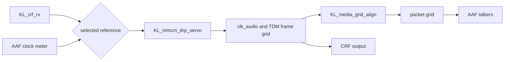

<!-- SPDX-FileCopyrightText: 2026 Kebag Logic -->
<!-- SPDX-License-Identifier: CERN-OHL-W-2.0 -->

# Media-clock following: one selected AAF or CRF source

Relates to #629. **A design proposal, not implemented.** It was written against
dev `d4dd7426`. Every code citation is `path:line` at that commit, and every
`protocol-processor/` path is at the pinned submodule commit `b2db3a97`.

The end station is to follow either an AAF talker's media clock or a CRF
talker's media clock, with exactly one source selected at a time through its
CLOCK_DOMAIN. The decision is recorded in #629's body (2026-10-01). It reverses
#389 option (a) for AAF Stream Inputs, and the CRF path stays.

This page records the clause reading behind the change, the current state, the
design with its options, the change lists for this repository and for the
protocol processor, and the test plan. No RTL, builder, model, configuration
or processor change comes with it.

**Where the decisions stand: every one is ruled.**

- The [rulings on round 1](https://github.com/kebag-logic/milan-fpga/issues/629#issuecomment-5935520588)
  accepted D2, D3 and D6, filed D7 as
  [#632](https://github.com/kebag-logic/milan-fpga/issues/632) and the
  processor part as
  [protocol-processor #141](https://github.com/Mister-M-alt/protocol-processor-control-plane-avb-milan/issues/141),
  and sent D4 to the owner.
- The [round 2 assignment](https://github.com/kebag-logic/milan-fpga/issues/629#issuecomment-5935864862)
  re-opened D1 and D5, and the
  [round 3 assignment](https://github.com/kebag-logic/milan-fpga/issues/629#issuecomment-5936791368)
  added D8, the AAF meter's rate estimator.
- The [rulings on round 3](https://github.com/kebag-logic/milan-fpga/issues/629#issuecomment-5937449258)
  took D8 = E8 and D5 = C1 together with E8, kept D1 = L1, confirmed D2's
  wording "keeps the mean of each 16", and filed the CRF receiver's own rate
  weakness as [#633](https://github.com/kebag-logic/milan-fpga/issues/633).
- The owner decided D4 = A2-a
  ([decision](https://github.com/kebag-logic/milan-fpga/issues/629#issuecomment-5937643550)),
  and recorded the oscillator grade as a known risk
  ([decision](https://github.com/kebag-logic/milan-fpga/issues/629#issuecomment-5937848189);
  see [Limits](#limits)).
- The [round 4 assignment](https://github.com/kebag-logic/milan-fpga/issues/629#issuecomment-5938156583)
  chose the manager's option (b) for a lost AAF PDU: it voids its own group
  and does not restart E8's history ([Lost PDUs](#lost-pdus)).

[Decisions](#decisions) lists each one with its ruling.

## Contents

- **[Baseline](#baseline)** -- What bench lane B6 measured on the shipping image: CRF following works, AAF following is absent, and the two outputs disagree at INTERNAL.
- **[Clause findings](#clause-findings)** -- The clause reading by question: a source per AAF input, a stopped stream, the `mr` rules, and what the current reading gets wrong.
- **[Current state](#current-state)** -- The builder, entity model, processor and fabric as they are at dev `d4dd7426`, each fact with its `path:line`.
- **[Design](#design)** -- The chain, the source order, the AAF clock meter with its rate estimator and loss rule, selection, switching, holdover, `mr`, A2, the domain counters, the phase gap and the area, with options.
- **[Parent-visible changes](#parent-visible-changes)** -- Every requirement, configuration, builder, model, RTL, register, gate and document change in this repository.
- **[Protocol-processor changes](#protocol-processor-changes)** -- The cross-repository plan under protocol-processor #141: no processor RTL change, its documentation and tests.
- **[Test plan](#test-plan)** -- Simulation cases each with a failing mutant, and the bench cases by the B6 method.
- **[Decisions](#decisions)** -- Each of the eight choices with its options and its ruling, each linked to the comment that made it.
- **[Limits](#limits)** -- What this design does not establish.

## Baseline

Bench lane B6 measured the image of dev `ec0cc0c1`
([PR #630](https://github.com/kebag-logic/milan-fpga/pull/630), its findings
page at head `26dfc82f`, not merged when this page was written):

- **The DUT follows a CRF talker.** With CLOCK_SOURCE 1 selected the servo
  read LOCKED 6.5 s after the set, and the DUT's TDM clock and the reference
  peer's output advanced with 0 net steps in 30,237,600 frames (case B CRF,
  PASS).
- **AAF following is not in the image.** No CLOCK_SOURCE exists on an AAF
  Stream Input since #389.
- **At INTERNAL the DUT's two outputs disagree.** Its CRF output runs on the
  physical audio clock and its AAF stream on the free-running packet grid,
  10.64 ppm apart. A listener following the DUT's CRF drops one AAF frame per
  1.96 s beat (case A2, FAIL). It is tracked on #74
  ([comment](https://github.com/kebag-logic/milan-fpga/issues/74#issuecomment-5932380322)).

## Clause findings

### (a) A source per AAF Stream Input beside the CRF source

| Clause | What it says | Consequence |
|---|---|---|
| Milan v1.2 5.3.3.6 | Each Clock Domain has at least one CLOCK_SOURCE. For each Stream Input that supports the CRF Media Clock Stream Format, or for the single AAF Stream Input when the Configuration has no CRF input, there is exactly one INPUT_STREAM CLOCK_SOURCE located on that STREAM_INPUT. At least one INTERNAL source exists when the Configuration has a Stream Output. | A minimum set. "Exactly one" binds each CRF-capable input, and the single AAF input of a Configuration without a CRF input. No clause sets a count for an AAF input beside a CRF input. |
| IEEE 1722.1-2021 7.2.9, 7.2.9.2 (Table 7-17) | INPUT_STREAM: "the clock is sourced from the media clock of an Input Stream". The location type and index name the descriptor that holds it. | An AAF STREAM_INPUT is a valid location. |
| IEEE 1722.1-2021 7.2.32 (Table 7-61) | `clock_sources` lists the CLOCK_SOURCE indices the domain's `clock_source_index` may be set to. `clock_sources_count` is at most 216. | No ordering or grouping rule. The bound is far above the 10 sources of the 8x8 shape. |
| Milan v1.2 7.2.2 | An AAF Media Talker, and a listener with two or more AAF inputs, implements a CRF Media Clock Input per clock domain. | The CRF input must exist. The clause restricts no source. |
| Milan v1.2 7.6, 7.6.2 | 7.6 is a recommendation. Its model "only deals with" followers that receive their media clock "through separate CRF Streams". 7.6.2 associates each Clock Domain with one Media Clock Domain. | AAF sources sit outside 7.6's media-clock-management model, so a controller working by 7.6 does not select them. That this entity has one Clock Domain is a fact of its model, not of 7.6.2. |

**Answer.** An INPUT_STREAM CLOCK_SOURCE per AAF Stream Input may sit beside
the CRF input's source. The clauses require the CRF input's source, set no
count for an AAF input beside it, cap the list at 216, and set no order. One
source per AAF Stream Input is this design's choice. The protocol processor
adds one rule of its own: the list is the identity permutation 0..count-1,
because its SET_CLOCK_SOURCE membership test is `index < clock_sources_count`
([`07_memory_maps.md:135`](https://github.com/Mister-M-alt/protocol-processor-control-plane-avb-milan/blob/b2db3a970cedbbff2f8ba813acb96122c442bc58/docs/architecture/07_memory_maps.md?plain=1#L135),
`protocol-processor/hdl/aecp/ucode/gen_ucode.py:1410-1419`).

### (b) When the selected stream stops

What the clauses require:

- **A listed source in use, and the selection saved.** Milan v1.2 5.3.11.1: at
  any time the domain uses one of its listed sources, and the current source
  is saved in non-volatile memory and restored after a power cycle.
- **No non-ATDECC change while locked.** Milan v1.2 5.4.2.15: "If the PAAD-AE
  is locked by a controller", it changes no clock source by non-ATDECC means.
  The clause sets nothing for an entity that no controller has locked.
- **The counters.** Milan v1.2 5.3.11.2 (Table 5.7): LOCKED and UNLOCKED count
  each lock and unlock of "the media clock used in the Clock Domain", with
  LOCKED equal to UNLOCKED or one more. The meaning of "locked" is left to the
  manufacturer. The Stream Input keeps its own MEDIA_LOCKED and MEDIA_UNLOCKED
  (Milan v1.2 Table 5.6).
- **`mr` on its own streams,** if it is also a talker: see (c).

What the clauses permit:

- **An entity-initiated change of source, while no controller holds the
  lock.** No clause forbids one outside 5.4.2.15's locked scope, so a fallback
  to another listed source is permitted then. Milan v1.2 5.3.11.1 says the
  PAAD-AE "is able to dynamically change the clock source to any of the
  CLOCK_SOURCE descriptors associated with the Clock Domain", but the same
  clause expects the user to set each domain's source correctly, so it reads
  as a capability rather than as a licence for the entity to choose.
- **Free-wheel.** IEEE 1722-2016 10.6: when CRF timestamps are lost due to
  network packet loss, "the media clock free-wheels until the CRF stream
  resumes". 4.4.4.7, NOTE: a listener
  that sees `tu` usually stops adjusting its media clock and lets it
  free-wheel. No clause says what a listener does when a followed AAF stream
  stops; these are the nearest cases.
- **Re-acquire** when the stream returns. Milan sets no holdover duration.

What this design chooses:

- **No fallback, at any time.** The selection stays until a controller changes
  it, whether or not a controller holds the lock, and the media clock holds
  over (see [Lock loss, holdover and restart](#lock-loss-holdover-and-restart)).
  The reasons:
  - 5.4.2.15 requires it while locked, so one rule covers both cases;
  - 5.3.11.1 expects the user to set each domain's source correctly, and a
    silent change would leave GET_CLOCK_SOURCE reading a source the user did
    not set;
  - the stored index belongs to the protocol processor, which publishes
    CLOCK_DOMAIN 0's index to the fabric as an output only
    (`protocol-processor/hdl/aecp/KL_aecp_dyn_state.sv:114`, `:352`). A fabric
    fallback would need a write path, a saved-state write and the
    unsolicited notification of IEEE 1722.1-2021 7.4.23, none of which exist.

  A ruling can change this choice. Milan permits a fallback while unlocked.

The phrases "need not be seamless" and "any appropriate action to minimize the
disruption" (IEEE 1722-2016 4.4.4.3, first paragraph, and 10.4.3) describe a
listener's reaction to a talker-signalled media clock restart, the `mr` toggle.
They do not describe a stopped stream, so this page uses them under (c) only.

### (c) `mr` for a talker whose media clock follows a received stream

- **Source change.** IEEE 1722-2016 4.4.4.3: the talker toggles `mr` on a change
  in the source of its media clock, and holds the new value for at least eight
  AVTPDUs of a continuous stream. PICS Table F.7 items AAF-5 and AAF-6 make both
  mandatory for AAF.
- **Reacting to a received toggle.** 4.4.4.3, first paragraph: a listener "may"
  use the bit to adjust quickly to the new media clock; the change "need not be
  seamless", and the listener may take "any appropriate action to minimize the
  disruption". 10.4.3 makes the quick adjustment a shall for a CRF listener.
- **CRF disruption and echo.** 4.4.4.3, third paragraph: when a talker receives
  a CRF stream, every stream deriving timestamps from it shall toggle `mr` if
  the CRF stream is disrupted or its `mr` toggles. 10.4.3: a CRF listener shall
  toggle `mr` in the outgoing streams that derive timestamps from the CRF
  stream. Both shalls name CRF only.
- **Which `mr` counts.** 4.4.4.3 last paragraph and 10.4.3 last paragraph: a
  listener uses only the `mr` of the stream it recovers its media clock from.
- **A followed AAF stream.** No clause makes its disruption or its received
  toggle a shall. Two readings permit acting on them. The talker toggles "each
  time a media clock restart is needed" (4.4.4.3). PICS AAF-5 asks whether
  `mr` is toggled "when the device's media clock source has changed", which
  can be read to cover the entity falling into holdover when its followed
  stream stops. This design acts on both, for symmetry with CRF.
- **Phase, for the same talker.** IEEE 1722-2016 10.8, Equation (15): a talker
  that recovers its clock from CRF keeps its timestamps within +/-5.0 % of a
  sample period of the CRF timing points, modulo whole periods (+/-1,041.7 ns at
  48 kHz). 4.3.5: streams generated from a recovered stream differ from it in
  presentation time by a whole number of nominal periods. See
  [Phase alignment is a separate gap](#phase-alignment-is-a-separate-gap).

### (d) Where the current reading is wrong

1. **An exclusive set where the clause gives a minimum.** The 5.3.3.6 paraphrase
   is right as a minimum. FR-CLK-03 ([`FR_NFR.md:237`](../reference/FR_NFR.md), "No
   CLOCK_SOURCE is advertised on an AAF listener"), its status row (`:155`),
   descriptor rule L6 ([`PP_DESCRIPTOR_OWNERSHIP.md:89`](../reference/PP_DESCRIPTOR_OWNERSHIP.md),
   "AAF-derived sources are unsupported") and [`TIME_SYNC.md:141-145`](TIME_SYNC.md#media-boundary)
   and `:198` state #389's product decision, not the clause. With #389 (a)
   reversed, each changes.
2. **BAD_ARGUMENTS is attached to the wrong clauses.** #629's body and the
   compliance matrix's 5.4.2.15/.16 row
   ([`MILAN_COMPLIANCE_MATRIX.md:120`](../reference/MILAN_COMPLIANCE_MATRIX.md)) attach the refusal of an
   unlisted index to Milan v1.2 5.4.2.15 and 5.4.2.16, and FR-CLK-03 states it
   with no clause. Those clauses defer to IEEE 1722.1-2021 7.4.23 and 7.4.24,
   and 7.4.23.1 names no status for an unlisted index. The refusal
   follows from 7.2.32 (the list is the set the index may take) and Table 7-141
   (BAD_ARGUMENTS: a value "deemed to be bad"). 7.4.23.1 adds the rule the
   processor already keeps: a failed response carries the current value. Three
   places credit 7.4.23.1 with the membership test itself: L6 in this
   repository ([`PP_DESCRIPTOR_OWNERSHIP.md:89`](../reference/PP_DESCRIPTOR_OWNERSHIP.md)),
   the processor's L6
   ([`07_memory_maps.md:135`](https://github.com/Mister-M-alt/protocol-processor-control-plane-avb-milan/blob/b2db3a970cedbbff2f8ba813acb96122c442bc58/docs/architecture/07_memory_maps.md?plain=1#L135))
   and its range-check comment (`protocol-processor/hdl/aecp/ucode/gen_ucode.py:1414`).
3. **Milan 7.2.2 is cited for a restriction it does not make.** The builder
   (`sw/builder/endstation_builder.py:3893-3899` and the docstring at
   `:5019-5028`) and the model consumer (`avdecc/aem_specs.py:234-241`) cite it
   for "only INTERNAL and the CRF sink drive the media clock". 7.2.2 requires a
   CRF input and restricts no source.
4. **A2's clause.** #74's comment cites Milan v1.2 7.2.3 for "a talker's CRF
   output must represent the same media clock as its AAF streams". 7.2.3 only
   requires that output to exist. The requirement holds on another basis: IEEE
   1722.1-2021 7.2.32 makes a CLOCK_DOMAIN "a source of a common clock signal",
   and Table 7-8 (7.2.6) has every STREAM_OUTPUT name in `clock_domain_index`
   "the Clock Domain providing the media clock for the Stream". Both outputs
   name CLOCK_DOMAIN 0. Milan v1.2 7.1's informative note says the same. A2 is
   a real defect on that basis.
5. **`mr` on an AAF disruption is a reading, not the literal shall.** #629's
   body says the 4.4.4.3 disruption rule "applies to AAF and CRF following
   alike". The literal shall names CRF only. Under the PICS AAF-5 reading in
   (c) the statement is defensible, and this design applies it either way.
6. **Three RTL comments are stale.** `hdl/milan/milan_datapath.sv:607` says the
   root cannot select CRF, and `:5576-5578` says it "hardwires INTERNAL against
   NONE", both untrue since #74. `:3112` says the CRF media clock is source
   "(2)", an index from before #389.
7. **The compliance matrix.** The 7.2.3 row
   ([`MILAN_COMPLIANCE_MATRIX.md:187`](../reference/MILAN_COMPLIANCE_MATRIX.md)) reads implemented with no
   A2 caveat. The 5.4.2.15/.16 row (`:120`), the 5.3.11.1 row (`:175`) and the
   7.2.2 row (`:186`) restate the #389 set. No row records IEEE 1722-2016 10.8 or
   4.3.5.
8. **A flag label.** `avdecc/aem_descriptors.py:456` emits `clock_source_flags`
   `0x0002` and labels it STREAM_ID. IEEE 1722.1-2021 Table 7-16 puts STREAM_ID
   at bit 15 and LOCAL_ID at bit 14, and the standard numbers bit 0 as the most
   significant, so `0x0002` is LOCAL_ID. Milan v1.2 5.3.3.6 leaves the value
   unimposed, so this is not a conformance defect. The per-AAF sources would
   inherit the value, so the model lane decides it.

## Current state

### Builder and entity model

| Fact | Where |
|---|---|
| Every shipping configuration declares `media_clock_sources: [internal, crf]` | `configs/endstation_ax7101_1x1_tdm8.yaml:128`, `configs/endstation_ax7101_8x8.yaml:146`, `configs/endstation_arty_8ch.yaml:132`, `configs/endstation_arty_4x4.yaml:96`, `configs/endstation_arty_current.yaml:166` |
| `_load_clocking` refuses `input_stream` by name and admits only `internal` and `crf` | `sw/builder/endstation_builder.py:3887-3902` |
| `crf` needs the CRF sink, and the sink needs `crf` | `sw/builder/endstation_builder.py:3956-3971` |
| The CLOCK_SOURCE overlay: INTERNAL at 0 when declared, then the CRF source located on STREAM_INPUT `len(L)`, the sink after the AAF listeners | `sw/builder/endstation_builder.py:5018-5045` (INTERNAL only when declared, `:5034`) |
| `CLOCK_SOURCE_NAMES` has no stream entry, and `_load_names` refuses `names.clock_sources.stream` | `sw/builder/endstation_builder.py:141`, `:3784-3790` |
| Before #389 the order was INTERNAL, one source per AAF listener, then CRF | `sw/builder/endstation_builder.py:4180-4203` at `aea44c071^` |
| The source set is model shape, so a change moves `entity_model_id` (IEEE 1722.1-2021 6.2.2.8) | `sw/builder/endstation_builder.py:3414-3419` |
| A config that prunes the servo may offer only `internal` | `sw/builder/endstation_builder.py:3292-3301` |
| Every Stream Output requires INTERNAL; a configuration without outputs may omit it | `sw/builder/endstation_builder.py:4262-4267` |
| The model consumer knows `internal` and `crf`, and refuses `input_stream` as retired | `avdecc/aem_specs.py:22`, `:35`, `:234-241` |
| One rule gives the RTL its two facts, the count and the CRF index | `avdecc/aem_descriptors.py:428-442` |
| CLOCK_SOURCE descriptor, and a CLOCK_DOMAIN listing the identity permutation, reset selection index 0 | `avdecc/aem_descriptors.py:445-462`, `:464-482` (`:476`); emitted at `avdecc/aem_assemble.py:231-236` |
| Every advertised input format has 6 samples per PDU | `avdecc/aem_descriptors.py:133` |
| The shape header carries `AEM_N_CLKSRC_C` and `AEM_CRF_CLKSRC_C` (`16'hFFFF` when no CRF source) | `sw/builder/endstation_builder.py:2836-2853`; generated `configs/generated/endstation_ax7101_1x1_tdm8/gen/adp_shape_defaults.svh:54-55` |
| The builder's own test asserts two sources and CRF at index 1 on every shipping shape | `sw/builder/test_builder.py:19580-19590` |
| Two gates pin the CRF compare's source text | `scripts/check_gptp_docs.py:114`, `docs/diagrams/timesync_chain.gen.py:49` |
| A saved-state image is refused whole when its `entity_model_id` differs from the running image's | `sw/firmware/milan_baremetal/milan_baremetal.c:634-636`; [`SAVED_STATE_FASTCONNECT.md:638-640`](SAVED_STATE_FASTCONNECT.md), [`SAVED_STATE_MATERIALIZATION.md:1153-1158`](SAVED_STATE_MATERIALIZATION.md) |

### Protocol processor

| Fact | Where |
|---|---|
| SET_CLOCK_SOURCE accepts an index below the located domain's `clock_sources_count`, stores it, marks it for persistence and notifies; otherwise BAD_ARGUMENTS with the current index | `protocol-processor/hdl/aecp/ucode/gen_ucode.py:1410-1419`, `:1433-1440` |
| The list shape the check relies on (L6, identity permutation) | [`07_memory_maps.md:135`](https://github.com/Mister-M-alt/protocol-processor-control-plane-avb-milan/blob/b2db3a970cedbbff2f8ba813acb96122c442bc58/docs/architecture/07_memory_maps.md?plain=1#L135) |
| The selection is saved state, D3 record `0x0A` + domain, u16 | [`07_memory_maps.md:343`](https://github.com/Mister-M-alt/protocol-processor-control-plane-avb-milan/blob/b2db3a970cedbbff2f8ba813acb96122c442bc58/docs/architecture/07_memory_maps.md?plain=1#L343), [`07_memory_maps.md:479`](https://github.com/Mister-M-alt/protocol-processor-control-plane-avb-milan/blob/b2db3a970cedbbff2f8ba813acb96122c442bc58/docs/architecture/07_memory_maps.md?plain=1#L479); REQ-AEM-013 at [`00_MILAN_COMPLIANCE_REVIEW.md:377`](https://github.com/Mister-M-alt/protocol-processor-control-plane-avb-milan/blob/b2db3a970cedbbff2f8ba813acb96122c442bc58/docs/00_MILAN_COMPLIANCE_REVIEW.md?plain=1#L377) |
| A restored index is accepted only below the domain's count | the compare at `protocol-processor/hdl/aecp/KL_aecp_nvm_writer.sv:501-503`; the rule stated at `:84-90` |
| Only CLOCK_DOMAIN 0's index is exported to the parent | `protocol-processor/hdl/aecp/KL_aecp_dyn_state.sv:114`, `:352` |
| The 5.3.3.6 paraphrase as a model rule | REQ-MDL-005 at [`00_MILAN_COMPLIANCE_REVIEW.md:420`](https://github.com/Mister-M-alt/protocol-processor-control-plane-avb-milan/blob/b2db3a970cedbbff2f8ba813acb96122c442bc58/docs/00_MILAN_COMPLIANCE_REVIEW.md?plain=1#L420) |

### Fabric

The chain has one master per link (the time-synchronization design's
[Media boundary](TIME_SYNC.md#media-boundary)): CRF, then the MMCM servo, then
the physical audio clock and its TDM frame grid, then the grid aligner, then the
packet grid.

| Fact | Where |
|---|---|
| The stored index arrives as `pp_aecp_clk_src_index_w` | `hdl/milan/milan_datapath.sv:704`, `:7529-7535` |
| One registered compare makes `crf_clk_selected_r` (index equals `AEM_CRF_CLKSRC_C`) | `hdl/milan/milan_datapath.sv:1554-1570` |
| CRF receiver: bound by the ACMP sink-1 bind or the CSR lever | `hdl/milan/milan_datapath.sv:5508-5572` (`:5537-5538`) |
| Its `tu_i` takes the parser's `tv` net, because the CRF header carries `tu` where the common header carries `tv` | `hdl/milan/milan_datapath.sv:5530-5534` |
| Its rate is a 256-PDU, 512 ms window of CRF timestamps, in ns per window | `hdl/ieee1722/crf/KL_crf_rx.sv:21-33`, `:275-277` |
| Its jump bound is 2,048 ns, derived for a CRF talker inside the local PHC envelope with no arrival jitter | `hdl/ieee1722/crf/KL_crf_rx.sv:279-294` |
| Its lock: 8 clean PDUs in, 100 ms of silence out | `hdl/ieee1722/crf/KL_crf_rx.sv:34-36`, `:296-298` |
| Its rate history restarts on a `tu` edge, a timestamp jump, a sequence gap, the bind edge or silence | `hdl/ieee1722/crf/KL_crf_rx.sv:390-403` |
| Its received-`mr` reference is seeded silently by an era's first accepted PDU; the bind edge and the silence re-seed | `hdl/ieee1722/crf/KL_crf_rx.sv:380`, `:586-587`, `:548-555`, `:619-624` |
| Servo: frequency only; the error is local rate minus remote rate per 512 ms; CRF_DELTA is not a loop input | `hdl/ieee1722/crf/KL_mmcm_drp_servo.sv:20-30` |
| Servo select is `clk_src_i == crf_src_idx_i` | `hdl/ieee1722/crf/KL_mmcm_drp_servo.sv:263-273`, `:411`; bound at `hdl/milan/milan_datapath.sv:5608-5612` |
| The servo samples the reference rate once per 512 ms window, and runs PI only on a valid rate | `hdl/ieee1722/crf/KL_mmcm_drp_servo.sv:609`, `:613-615` |
| Lock qualification is an error under 1,024 ns per window (2 ppm) for four windows; one window outside drops LOCKED to ACQUIRE | `hdl/ieee1722/crf/KL_mmcm_drp_servo.sv:232-233`, `:648`, `:567-568`, `:689-694` |
| Servo IDLE clears the trim and integrator; HOLDOVER freezes the trim and re-enters ACQUIRE with a two-window skip | `hdl/ieee1722/crf/KL_mmcm_drp_servo.sv:538-551`, `:571-579` |
| Grid aligner and NCO steering engage only on `crf_clk_selected_r` | `hdl/milan/milan_datapath.sv:5733-5748` |
| INTERNAL is a free-running packet grid by a recorded rule, slips accepted | `hdl/milan/milan_datapath.sv:5713-5718`, `hdl/ieee1722/crf/KL_media_grid_align.sv:38-41` |
| The aligner disengages on a dead TDM feed | `hdl/ieee1722/crf/KL_media_grid_align.sv:95-100`, `:257-272` |
| `mr` CRF triggers (disruption, received toggle) are gated on `crf_clk_selected_r` | `hdl/milan/milan_datapath.sv:3108-3156` |
| `mr` source-change trigger: any change of the stored index, every output including the CRF output | `hdl/milan/milan_datapath.sv:3180-3203`, `hdl/ieee1722/avtp/KL_media_clock_restart.sv:211-213`, `:230` |
| A second restart request merges only until the output's first PDU at the adopted level | `hdl/ieee1722/avtp/KL_media_clock_restart.sv:236-246`, `:252`, `:261` |
| #386 render recentre after a settled source change | `hdl/milan/milan_datapath.sv:6079-6126` |
| CLOCK_DOMAIN LOCKED and UNLOCKED count edges of the gPTP clock-validity verdict that `tu` also carries, by a recorded rule | `hdl/milan/milan_datapath.sv:3469-3475`, `:3492` |
| The RX parser hands every matched AVTPDU's listener index, timestamp, `tv`, `tu`, `mr`, sequence number and format header to the fabric | `hdl/milan/milan_datapath.sv:5418-5446` |
| The format header holds AAF's format, `nsr`, `channels_per_frame`, `bit_depth`, `stream_data_length` and `sp`; the common-header `tu` is byte o+3 bit 0 | `hdl/ieee1722/avtp/avtp_stream_parser.sv:165-177` |
| The AAF listener's format check is a family compare (subtype, format, `nsr`, depth, a nonzero channel count, `sp` clear), with no samples-per-PDU check | `hdl/ieee1722/avtp/KL_avtp_rx_monitor_ctx.sv:465-491` |
| The RX monitor's media-lock ports for an external clock are wired but unused | `hdl/milan/milan_datapath.sv:5858-5865` (#74 ledger item 3) |
| `PCMRX_TS` (`0x6C8`) is stream 0's last accepted timestamp, a CSR snapshot | `hdl/milan/milan_datapath.sv:2576`, `hdl/ieee1722/avtp/KL_avtp_rx_monitor_ctx.sv:218`, `hdl/common/csr/milan_csr.sv:396` |
| CSR words at or above `0x800` read zero unless the read window claims them | `hdl/common/csr/milan_csr.sv:2562-2581` |
| The AAF talker latches its presentation time on the packet grid | `hdl/ieee1722/aaf/KL_aaf_packetizer.sv:720-726` |

### The CRF output's clock (A2)

`KL_crf_tx` divides `clk_audio_i` by 512 and stamps every 96th event
(`hdl/ieee1722/crf/KL_crf_tx.sv:20-28`, bound at
`hdl/milan/milan_datapath.sv:5756-5758`). So the CRF output carries the
physical audio clock: 47,999.4893 Hz on the fixed MMCM plan. The AAF talker
stamps on the packet grid, an exact 48,000.0000 Hz at INTERNAL
([Talker capture handoff](TIME_SYNC.md#talker-capture-handoff)). Under CRF
selection the aligner holds the packet grid on the physical grid, so the two
agree. At INTERNAL they are 10.64 ppm apart. That is A2.

## Design

### The chain

The design adds one measurement and widens one decode. Everything after the
servo's input is reused unchanged.



One master per link still holds: exactly one measurement drives the servo, the
one the selection names.

### Source list and order

Decision D1 is ruled L1, on index stability
([rulings](https://github.com/kebag-logic/milan-fpga/issues/629#issuecomment-5937449258)).
The order is a builder rule. The RTL decodes
the stored index through a generated table
([Selection decode and gating](#selection-decode-and-gating)), so the order
reaches only people and scripts that select a source by its index.

| Option | Order | For | Against |
|---|---|---|---|
| **L1, ruled** | By class: INTERNAL, then CRF, then one source per AAF Stream Input in STREAM_INPUT order. On the five shipping shapes: INTERNAL 0, CRF 1, AAF input k at 2 + k | The CRF index does not depend on the listener count: it is 1 wherever INTERNAL and CRF are both declared, as today. B6's procedure (SET_CLOCK_SOURCE 1), the builder's own check (`sw/builder/test_builder.py:19588`) and the notes that state the index (`sw/litex/milan_soc.py:872-874`, `tb/verilator/mmcm_servo/sim_main.cpp:197`) keep their meaning. Adding or removing AAF listeners moves only the AAF indices. | CLOCK_SOURCE order is not STREAM_INPUT order: the CRF source sits on STREAM_INPUT N but is index 1. No clause asks for either order. |
| L2 | The pre-#389 order: INTERNAL, AAF 0..N-1, then CRF at N + 1 | CLOCK_SOURCE k + 1 sits on STREAM_INPUT k for every stream source, CRF included | CRF's index becomes N + 1: 2 on the 1x1 shape, 9 on the 8x8 shape. Every procedure, script and check that selects CRF by its index becomes shape-dependent. |

**Saved state does not decide it.** Round 1 argued that a saved CRF selection
restores onto CRF under L1 and onto AAF input 0 under L2. That is withdrawn.
The source set is model shape, so this change moves `entity_model_id`
(`sw/builder/endstation_builder.py:3414-3419`), and a saved-state image whose
model id differs is refused whole
(`sw/firmware/milan_baremetal/milan_baremetal.c:634-636`;
[`SAVED_STATE_FASTCONNECT.md:638-640`](SAVED_STATE_FASTCONNECT.md)). The
clock-source restore rule is defence in depth "for a configuration that pins
its id; no shipped configuration does"
([`SAVED_STATE_MATERIALIZATION.md:1153-1158`](SAVED_STATE_MATERIALIZATION.md)).
So no saved selection crosses this update under either order. Within one
image both orders persist the selection the same way (Milan v1.2 5.3.11.1).

**What the update does to saved state.** Each regenerated image moves its
model id once (D6). On first boot each unit refuses its saved image, so none
of its saved records is restored, its clock source included. The domain comes
up on the CLOCK_DOMAIN descriptor's initial index, 0
(`avdecc/aem_descriptors.py:476`), which is INTERNAL on every shipping shape.
The release note says so.

**Shapes without INTERNAL or CRF.** The class order holds on every shape, and
an absent class takes no index. A configuration without outputs may omit
INTERNAL (`sw/builder/endstation_builder.py:4262-4267`), and the overlay emits
INTERNAL only when it is declared (`:5034`). On such a shape CRF is index 0 and
AAF input k is 1 + k. "CRF is index 1" therefore holds where both INTERNAL and
CRF are declared, which all five shipping shapes do.

Under either option the CLOCK_DOMAIN keeps the identity list, so the
processor's range check stays the membership test. The 8x8 shape grows from 2
to 10 sources: 8 more 86-octet CLOCK_SOURCE descriptors and 16 more octets of
CLOCK_DOMAIN. Its shape had 10 sources before #389.

### Measuring an AAF stream's media clock

An AAF talker's media clock is in its presentation times (IEEE 1722-2016 4.3.2:
the presentation time "is also used to recover the stream's media clock").
Milan v1.2 6.2 fixes 6 samples and one timestamp per PDU at 48 kHz, in normal
timestamp mode. So 16 PDUs span 96 samples, exactly the CRF
`timestamp_interval` (Milan v1.2 7.3.2).

Decision D2 is ruled M1, in the
[rulings](https://github.com/kebag-logic/milan-fpga/issues/629#issuecomment-5935520588)'
words "one meter on the selected input keeps one AAF timestamp in 16 and
feeds the existing servo unchanged". Round 2 fixed the meter's input contract
inside it: the supported format, the jump bound and the pick, which keeps the
mean of each 16 rather than one timestamp in 16. Round 3 changed the rate
estimator the pick feeds (D8, [The rate estimator](#the-rate-estimator)). The
[rulings on round 3](https://github.com/kebag-logic/milan-fpga/issues/629#issuecomment-5937449258)
confirm the wording "keeps the mean of each 16", with its rate from D8. Round 4
adds what a lost PDU does ([Lost PDUs](#lost-pdus)). The servo stays
unchanged throughout.

| Option | What | For | Against |
|---|---|---|---|
| M0 | Compare AAF timestamps with the local packet grid and steer the NCO (the #389 option (b) wording) | No new ring | Makes the packet grid a second master beside the aligner, and the audio MMCM does not follow, so the TDM I/O keeps slipping |
| **M1, ruled** | One AAF clock meter, measuring only the selected AAF Stream Input | `KL_crf_rx` stays bit for bit; one ring; the servo sees the units it already takes | A switch between AAF inputs restarts the measurement: 512 ms before the rate is valid under E1, 4.096 s under E8 |
| M2 | One meter per AAF Stream Input | A switch finds a warm rate | 8 rings on the 8x8 shape, for a switch that holds over anyway |
| M3 | Share `KL_crf_rx`'s ring through a source mux | Saves one RAMB18 under E1; nothing under E8, which needs none | Changes the proven CRF receiver and the meaning of `CRF_RATE`, which the bench reads |

#### Where the meter sits and what it reads

It is a new module beside `KL_crf_rx`, on `axis_clk`, with no new clock
crossing. Its input is the parser bundle (`hdl/milan/milan_datapath.sv:5418-5446`),
the tap `KL_crf_rx` uses. `PCMRX_TS` is not usable: it is a stream-0 CSR
snapshot without a per-PDU strobe.

| Field | Net or source | Use |
|---|---|---|
| match and listener index | `avtprx_match`, `avtprx_idx` | the PDU belongs to the followed Stream Input |
| `subtype` | `avtprx_subtype` | AAF (`0x02`) |
| `tv` | `avtprx_tv_bit` | set; a clear `tv` means the timestamp is ignored (IEEE 1722-2016 4.4.4.5) |
| `tu` | `avtprx_tu_bit`, byte o+3 bit 0 | history restart on either edge. Not the `tv` net that `KL_crf_rx` takes for the CRF header (`hdl/milan/milan_datapath.sv:5530-5534`): copying that wiring would never see an AAF `tu` edge |
| `mr` | `avtprx_mr_bit` | the received restart |
| `sequence_num` | `avtprx_seq` | the pick, and gap detection |
| `avtp_timestamp` | `avtprx_ts`, 32 bits | the measurement |
| `format`, `nsr`, `channels_per_frame`, `stream_data_length`, `sp` | `avtprx_fsh` (`hdl/ieee1722/avtp/avtp_stream_parser.sv:176-177`; IEEE 1722-2016 7.3, Figure 26) | the supported-format check |

The meter keeps no Milan v1.2 Table 5.6 counter. The Stream Input's counters
stay in the RX monitor.

#### The supported format

The meter consumes only Milan v1.2 6.2's 48 kHz Base format: `format`
INT_32BIT, `nsr` 48 kHz, `sp` clear (normal timestamp mode, a timestamp in
every PDU: IEEE 1722-2016 7.2.4, 7.5), and 6 samples per PDU.

AAF carries no samples-per-PDU field. The meter derives it from the PDU's own
fields: `stream_data_length` must equal 6 x 4 x `channels_per_frame` octets,
with `channels_per_frame` nonzero (IEEE 1722-2016 7.3.3, 7.3.5). Every PDU of a
stream carries the same number of samples (7.3.5), so the check is stable for
a stream. The RX monitor's family compare does not check the sample count
(`hdl/ieee1722/avtp/KL_avtp_rx_monitor_ctx.sv:486-491`), so the meter must.
The bound input's current format agrees on every shipping shape, because every
advertised input format has 6 samples per PDU
(`avdecc/aem_descriptors.py:133`). The meter therefore keeps no second check.

A PDU outside this format is not consumed. A stream of it never locks the
meter, so the servo holds over rather than following a guess. Refused, and
why:

- other rates: the audio MMCM plan is fixed at 24.576 MHz (see
  [Limits](#limits));
- sparse mode: a timestamp in every eighth PDU only (7.2.4);
- any other sample count at 48 kHz. Under the fixed 16-PDU pick below every
  count stays aligned across the wrap, but the pick spacing is no longer 2 ms.
  A per-format pick of 96 samples, 96 / count PDUs, would keep 2 ms and would
  survive the wrap for 3, 12, 24, 48 and 96 samples per PDU, because 96 / count
  divides 256. For 1, 2, 4, 8, 16 and 32 it would break at every wrap (round-1
  external review's probe). None of them is a Milan base format at 48 kHz, so
  the meter refuses them all rather than carry a per-format divisor.

#### The pick

The meter keeps one value per group of 16 PDUs, the PDUs whose `sequence_num`
modulo 16 runs from 0 to 15. 16 PDUs of 6 samples are 96 samples, 2 ms
nominal. `sequence_num` is 8 bits and wraps from 255 to 0 (IEEE 1722-2016
4.4.4.6). 16 divides 256, so the groups stay aligned across every wrap.

The kept value is the group mean, with `ts_i` the timestamp of the group's
PDU i:

```text
pick = ts_0 + (sum over i = 0..15 of (ts_i - ts_0 - i * 125,000 ns)) / 16
```

125,000 ns is one PDU's 6 samples at 48 kHz, exactly. The arithmetic is exact
modulo 2^32, like the ring's (`hdl/ieee1722/crf/KL_crf_rx.sv:320-329`). The
division floors, so each pick is low by less than 1 ns, by an amount that
varies with its group's remainder. A rate difference therefore carries at most
1 ns of it, inside the 1-LSB tolerance of the meter suite's first row. Every
PDU of the group is required. A sequence gap voids the group, and so does any
`|ts_i - ts_0 - i * 125,000|` above the jump bound below. The two voids differ
in what they restart: see [Lost PDUs](#lost-pdus).

| Option | Kept value | For | Against |
|---|---|---|---|
| P1 | The group's first PDU, as round 1 proposed | `KL_crf_rx`'s rule exactly; no adder | Independent per-PDU error reaches the rate whole: under round 2's estimator it fails the servo's lock test; under E8 it passes, with four times the rate noise of P2 |
| **P2, chosen** | The group mean | Independent error falls by a factor of 4 (the square root of 16) in the rate the servo follows; error alternating per PDU cancels | About 80 to 130 LUT more; a lost PDU anywhere in the group voids it, not only a lost first PDU. Under the loss rule an isolated voided group costs nothing ([Lost PDUs](#lost-pdus)) |

#### The timestamp-quality assumption

The meter is designed for AAF presentation times within +/-1,426 ns of an
ideal grid at the talker's own rate. The basis:

- **A talker that follows CRF.** IEEE 1722-2016 10.8, Equation (15): its
  timestamps stay within +/-5.0 % of a sample period of the received CRF timing
  points, +/-1,041.7 ns at 48 kHz. Those timing points carry the CRF talker's
  own error. `KL_crf_rx` assumes under 384 ns for it
  (`hdl/ieee1722/crf/KL_crf_rx.sv:283-284`). The sum is about 1,426 ns.
- **What a CRF listener must accept.** Equation (16): a listener slaving to CRF
  accepts streams within +/-25 % of a sample period (+/-5,208 ns), and "may
  interpret the stream as invalid" beyond. That bounds tolerance in the CRF
  case only.
- **A talker on its own clock.** No clause bounds the regularity of its
  presentation times. 4.3.2 sets no tolerance, and Milan v1.2 7.4 bounds only
  the oscillator's frequency, +/-50 ppm.
- **Measurement.** This repository holds no measurement of a real talker's AAF
  timestamps. The bench lane measures the reference peer's through the meter's
  status word (see [Bench](#bench)).

#### The jump bound

The spacing of two adjacent picks may stray from 2 ms by at most 4,096 ns. The
bound is derived the way `KL_crf_rx` derives its own (`hdl/ieee1722/crf/KL_crf_rx.sv:279-294`), with
the 10.8 term in place of the local-PHC assumption:

- two picks, each up to 1,426 ns off the grid: 2,852 ns;
- the rate term over 2 ms at 300 ppm (200 ppm PHC trim and a 100 ppm
  oscillator margin, `:280-292`): 601 ns;
- 3,453 ns in all, rounded up to a power of two: 4,096 ns.

It stays far below one sample period, 20,833 ns. A one-sample step in the
talker's timestamps splits across at most two consecutive group means, one of
which moves by at least half a sample, 10,417 ns, so it is caught. A step below
the bound that the void does not catch enters the rate as a transient. Under
E8 ([The rate estimator](#the-rate-estimator)) that is an eighth of the step
for eight windows.

**The tolerance the two rules give.** The in-group void and the pick spacing
compare with the same 4,096 ns. Two adjacent group means are 2 ms apart within
2J plus the 600 ns rate term, and an in-group deviation is within 2J plus
562.5 ns (15 PDUs at 300 ppm), for error of peak J per timestamp. So the meter
accepts every error shape up to +/-1,748 ns per timestamp at 300 ppm, and up to
+/-2,048 ns at 0 ppm. Correlated error meets the spacing limit first.
Independent error meets the in-group limit, +/-1,766 ns at 300 ppm, first,
because the mean of 16 rarely moves far. The design point, +/-1,426 ns, is
322 ns inside. The round-3 desk model finds the first restarts between
+/-1,740 and +/-1,760 ns for correlated error and between +/-1,760 and
+/-1,800 ns for independent error at 300 ppm, and between +/-2,040 and
+/-2,060 ns at 0 ppm.

| Option | Bound | For | Against |
|---|---|---|---|
| B1 | 2,048 ns, `KL_crf_rx`'s | none beyond reuse | Never validates a talker at the 10.8 limit: round 1's external review drove `KL_crf_rx` at +/-1,041 ns and `rate_valid` never rose |
| **B2, chosen** | 4,096 ns, from 10.8 Equation (15) | Validates the 10.8 talker; still catches a one-sample step | A sub-bound phase step is followed as a transient |
| B3 | 16,384 ns, from Equation (16) | Tolerates any stream a CRF listener must accept | Equation (16) is the CRF domain's acceptance, not a talker bound; a one-sample step against error in the opposite direction comes within reach |

#### The rate estimator

Decision D8 is ruled E8
([rulings](https://github.com/kebag-logic/milan-fpga/issues/629#issuecomment-5937449258)).

**The test the rate must pass.** The servo samples the reference rate once per
512 ms window and subtracts it from its own measurement of the audio clock
over a window: `e = locerr - rate`
(`hdl/ieee1722/crf/KL_mmcm_drp_servo.sv:609`, `:643`). One window with `|e|`
at or above 1,024 ns, 2 ppm, drops LOCKED to ACQUIRE, and LOCKED needs four
clean windows in a row (`:232-233`, `:648`, `:564-568`). Whatever error the
meter's rate carries reaches `e`.

**No estimator over 512 ms can pass it for every error shape.** IEEE 1722-2016
10.8 Equation (15) bounds the size of a talker's timestamp error, not its
shape. Over a span T, a phase ramp of 2J across the span cannot be told from a
rate offset of 2J / T.

- **Any estimator, linear or not: at least J / T.** Given only the data, no
  estimator can tell those two cases apart, so the best it can do is split
  the difference. At J = 1,042 ns and T = 512 ms that is 1,042 ns per
  window, 2.04 ppm, which is already 18 ns above the 2 ppm test.
- **The tight figure is 2J / T.** Error-free data of slope s is consistent
  with every rate from s - 2J / T to s + 2J / T: each pairs with a ramp that
  stays inside +/-J, rising for the lower rate and falling for the upper,
  with the phase offset free. An estimator that splits the difference
  between those two ends is still 2J / T from one of them, 4.07 ppm at
  1,042 ns. The pairwise argument above sees only one end, which is why it
  gives half.
- **Linear estimators.** Every unbiased linear estimator over a span T has a
  worst case of at least 2J / T, because its weights must sum to zero and
  weigh the sample times to one. The two-point difference attains the bound.
  A least-squares slope reaches 3J / T, the worst case being a 2J step at
  mid-span, and helps only error that is independent from sample to sample.

Either figure exceeds the test, so the conclusion does not depend on which
is used. Round 2's two-point difference over 512 ms (E1) therefore fails
correlated error in the 10.8 range. Round 2's "group" shape, alternating per
group, was its best case: the servo's window spans 256 picks, which is even,
so the pattern cancels exactly.

**The servo amplifies what the estimator lets through.** The servo's PI
(`:228-229`: the error shifted right by 1 into the integrator, by 2 for the
proportional term) drives a plant of gain 1 by design, one window late. From
estimator error to `e` the worst-case (l1) gain of that loop is 2.125. For a
two-point difference over N windows of 512 ms, the worst-case `|e|` per
nanosecond of J is:

| N | Span | Open loop (2 / N) | Closed loop | At J = 1,042 ns | At J = 1,426 ns |
|---|---|---|---|---|---|
| 1 (E1) | 512 ms | 2.00 | 4.01 | 4,182 ns | 5,723 ns |
| 4 (E4) | 2,048 ms | 0.50 | 1.02 | 1,058 ns | 1,448 ns |
| 6 | 3,072 ms | 0.33 | 0.70 | 726 ns | 993 ns |
| **8 (E8)** | 4,096 ms | 0.25 | 0.53 | 550 ns | 753 ns |

At a plant gain of 0.8 or 1.2, E8's figure at 1,426 ns is 700 or 890 ns.

**E8, ruled.** The meter's rate becomes a two-point difference over
8 x 256 picks, 4.096 s, in the servo's units:

```text
rate = (P_now - P_8_snapshots_ago - 8 * 512,000,000) >>> 3
```

Every 256 group intervals the meter writes the current pick into an 8-entry
ring and reads, at the same address, the snapshot it overwrites, which is 8
snapshots old: `KL_crf_rx`'s read-old, write-new ring
(`hdl/ieee1722/crf/KL_crf_rx.sv:320-325`) at 8 entries instead of 256. The
difference is exact modulo 2^32 as the ring's is, because the deviation stays
far inside +/-2^31 ns. The rate is valid once 2,048 group intervals have passed
since the history last restarted, and it updates every 512 ms; between updates
the servo samples the held value. The intervals and the snapshot points are
counted on the group grid, so a lost PDU moves neither
([Lost PDUs](#lost-pdus)).

- **Bound.** For every error shape within +/-J, the rate is within 2J / 8 of the
  talker's, 357 ns at +/-1,426 ns, and the servo's window error after it locks
  stays under 753 ns. The desk model, which adds +/-20 ns of quantisation to
  the local window, finds at most 773 ns.
- **Area.** The 256-entry block-RAM ring goes, and with it the meter's RAMB18.
  The 8 x 32-bit ring is 256 FF, or about 24 LUT of distributed RAM behind one
  address. A 3-bit index, a 4-bit fill count and a 12-bit group counter, in
  place of a 9-bit fresh count, add a few FF. Against round 2's meter: one
  RAMB18 fewer, about 10 to 30 LUT and under 10 FF more.
- **Latency.** The rate is valid 4.096 s after a history restart, against
  512 ms under E1. It is the mean rate over the last 4.096 s, so it lags a real
  frequency change by about 2 s. In the desk model the servo reads LOCKED
  7.3 s after an ideal talker's first PDU, from the MMCM plan's 10.64 ppm
  offset, against 3.7 s under E1. A history restart holds the servo's trim
  and state for 4.096 s, because the servo runs no PI on an invalid rate
  (`:613-615`). A lost PDU does not cause one ([Lost PDUs](#lost-pdus)).
- **Against the clauses.** No clause sets a media-clock lock time, as both
  round-3 reviews found. The 4.096 s hold after a `tu` edge is consistent with
  Milan v1.2 4.4.2.3, which asks a listener to keep its media clock
  free-wheeling "for an appropriate amount of time" after `tu` resets. It also
  fits Milan v1.2 Annex B.1, which is informative and recommends a holdover
  of at least 5 s across a grandmaster change. The servo holds its trim for as
  long as the rate is invalid, with no time limit, and the hold ends when the
  rate is valid again.
- **What it also buys.** A real talker frequency step reaches `e` at about a
  quarter of its size under E8. The round-4 desk model sweeps the step across
  16 phases of the servo's window. E8 keeps LOCKED at every phase up to 7 ppm,
  leaves it at one phase in 16 at 8 ppm, and at every phase from 8.5 ppm. Under
  E1 the threshold depends on the phase. A 2 ppm step drops LOCKED at one
  phase in 16, when it is aligned with the window boundary (round 3's linear
  figure). It drops at half of them at 2.5 ppm and at all of them from
  3.5 ppm. A sub-bound phase step reaches the rate at an eighth of its size.
- **Residual.** Correlated error beyond the meter's own tolerance, +/-1,748 ns
  at 300 ppm, restarts the history continuously. The rate then never validates,
  and the servo holds its trim and its state; the meter's restart count shows
  it. Loss beyond the loss rule's bound does the same
  ([Lost PDUs](#lost-pdus)). The bound also assumes a plant gain near 1; at
  1.2 it is 890 ns.

| Option | Estimator | Lock test under every shape of 10.8 size | Area against round 2's meter | Latency to a valid rate |
|---|---|---|---|---|
| E1 | Two-point over 512 ms: round 2, `KL_crf_rx`'s rule | No: worst case 5,723 ns at +/-1,426 ns | none | 512 ms |
| LS1 | Least-squares slope over 512 ms | No: worst case 3J open loop; 1 s and 2 s periodic error fail | one DSP48 and about 100 to 150 LUT of running sums | 512 ms |
| E4 | Two-point over 2,048 ms | Open loop yes (713 ns); closed loop no (1,448 ns) | as E8, with 4 entries | 2,048 ms |
| **E8, ruled** | Two-point over 4,096 ms | Yes: 357 ns open loop, 753 ns closed loop | one RAMB18 fewer, about 10 to 30 LUT more | 4,096 ms |
| L | E1, with the servo's lock rule changed: qualify on the mean of eight windows, or widen the threshold | Yes, if wide enough | small | 512 ms |

L is not recommended. It changes the servo, which D2 keeps unchanged, and
unless it is made per source it also weakens what LOCKED means on the CRF
path.

**The desk model.** The round-3 model applies every rule this page states,
including the within-group void that the round-2 model omitted, and grades
each estimator open loop and in closed loop against the servo's PI (the
round 3 evidence on PR #631). The round-4 model adds PDU loss and the loss
rule; without loss it gives the same figures in every case both models run
(the round 4 evidence on PR #631). It models the rules, not any talker. Each
case runs 120 s. "Windows" is the fraction of 512 ms windows, after the servo first
locks, whose `|e|` is under 1,024 ns; "worst" is the largest `|e|`; "drops"
counts LOCKED-to-ACQUIRE transitions. The worst-case shape holds +/-J over each
512 ms block, with the sign pattern of the loop's impulse response.

| Error, peak per timestamp; 0 ppm unless stated | E1 + P2, round 2 | E8 + P2 |
|---|---|---|
| independent per PDU, +/-1,426 ns, 300 ppm | windows 0.960, worst 1,618 ns, 5 drops | 1.000, worst 197 ns |
| alternating sign per group, +/-1,426 ns | 1.000, worst 137 ns | 1.000, worst 137 ns |
| random sign per group, +/-1,042 ns | 0.286, worst 4,195 ns, 4 drops | 1.000, worst 539 ns |
| random sign per group, +/-1,426 ns, 300 ppm | 0.316, worst 5,694 ns, 6 drops | 1.000, worst 696 ns |
| uniform per group, +/-1,426 ns | 0.380, worst 4,381 ns, 7 drops | 1.000, worst 458 ns |
| 10 ms periodic, +/-1,042 ns | 0.799, 45 drops | 1.000, worst 272 ns |
| 10 ms periodic, +/-1,426 ns | never locks | 1.000, worst 345 ns |
| 1 s periodic, +/-1,426 ns | 0.099, worst 5,703 ns, 5 drops | 1.000, worst 316 ns |
| 2 s periodic, +/-1,426 ns | never locks | 1.000, worst 127 ns |
| worst case for the estimator, +/-1,426 ns | worst 5,736 ns, 3 drops | 1.000, worst 773 ns |
| independent per PDU, +/-2,500 ns | never valid: about 120 groups voided per second | never valid |

E8 has no drop in any row. No row restarts the history except the last. In the
same model E4 drops LOCKED 12 times in 120 s under a random sign per group at
+/-1,426 ns, and LS1 never locks under 2 s periodic error. A one-sample step
(+/-20,833 ns) and a half-sample step restart the history at all 16 group
positions under both estimators, so a real step is still rejected. Sub-bound
steps of 2,000 and 3,000 ns that neither rule catches leave E8 LOCKED, with at
most 432 ns of window error; under E1 they drop LOCKED. Round 2's +/-2,500 ns
row (valid 0.996, windows 0.987) came from a model without the void rule. With
the rule applied the history never validates, as the tolerance above
predicts.

P2 is kept under E8, although the bound does not need it: E8 with P1 passes
every row too. The mean keeps four times less independent error in the rate
the servo turns into recovered-clock wander. Under independent error of
+/-1,426 ns at 0 ppm, the largest open-loop rate error is 104 against 351 ns,
and the largest closed-loop window error `|e|` is 184 against 465 ns.

#### Lost PDUs

The manager chose option (b) of the round-3 external review's second finding
([round 4 assignment](https://github.com/kebag-logic/milan-fpga/issues/629#issuecomment-5938156583),
item 2). An isolated lost PDU voids its own group but does not restart E8's
history.

**What round 3 cost.** Under round 3's rules any lost PDU restarted the
history. The rate needs 2,048 intervals, 32,784 consecutive PDUs, so a lost
PDU every 4.1 s or more often kept it invalid for good. From a cold start the
servo then never left ACQUIRE, and a locked servo held its trim.

**The clause basis.** IEEE 1722-2016 4.4.4.6: a listener can use
`sequence_num` to detect AVTPDUs lost in transit. 10.1 lists tolerance of lost
packets among CRF's properties, because clocks free-wheel between defined
clock points, and 10.6 lets the media clock free-wheel while CRF timestamps
are lost. No clause sets a loss tolerance for an AAF listener that recovers a
media clock. The rule gives the meter the same property for isolated losses.

**The rule.**

1. **A loss void restarts nothing.** A sequence gap voids the group it falls
   in, whether the PDU was lost or not consumed (a clear `tv`, or another
   format). `KL_crf_rx` restarts its rate on any gap
   (`hdl/ieee1722/crf/KL_crf_rx.sv:398-400`); the meter keeps its history.
2. **Every other restart stays.** A deviation void (an in-group
   `|ts_i - ts_0 - i * 125,000|` above 4,096 ns), a pick spacing outside
   2 ms +/- 4,096 ns, a `tu` edge, the bind edge, 100 ms of silence, a change
   of the followed listener and entry into AAF following each restart the
   history, as in round 3.
3. **Continuity across the gap is checked.** The next valid pick is compared
   with the last one across k group intervals, k taken from the two groups'
   `sequence_num[7:4]`, modulo 16. With one voided group between them
   (k = 2) the spacing must be 4 ms +/- 5,120 ns. With two or more (k >= 3)
   the history restarts. A gap of 256 PDUs or more aliases in
   `sequence_num`, but its timestamps then miss k x 2 ms by at least 32 ms,
   so the check fails and the history restarts.
4. **Snapshots stay on the group grid.** The meter counts group intervals
   since the restart, k at a time, and writes a snapshot when the count
   reaches a multiple of 256. When the snapshot group itself is loss-voided,
   the snapshot is the midpoint of its two neighbours,
   `last + ((new - last) >>> 1)` modulo 2^32. The midpoint is exact for any
   talker rate, and its error is the mean of two picks' errors, so it is at
   most J, like a pick's. The rate is valid once the count reaches 2,048, as
   before.

A real step is still caught. Inside a fully received group it voids the group
by its deviation, and at a group boundary it fails the pick spacing (rule 2).
In or beside a loss-voided group, the check across the gap sees the whole step
(rule 3).

**The bound.** A single bound B_k across k group intervals must admit the
design point and still catch a half-sample step:

- 2J + 601k <= B_k, for two picks at J = 1,426 ns plus the 300 ppm rate term
  of 601 ns per 2 ms ([The jump bound](#the-jump-bound));
- B_k < 10,417 - 2J - 601k.

| k | Voided groups between the picks | B_k must lie in | This design |
|---|---|---|---|
| 1 | none | 3,453 to 6,963 ns | 4,096 ns, unchanged |
| 2 | one | 4,054 to 6,362 ns | 5,120 ns |
| 3 | two | 4,655 to 5,761 ns | restart |
| 4 or more | three or more | none | restart |

So no single bound spans three voided groups. One would serve two, but filling
a snapshot inside a two-group gap needs a division by 3, so the design
restarts there: the bound is one voided group at a time. Across one voided
group the meter tolerates +/-1,960 ns per timestamp at 300 ppm and
+/-2,560 ns at 0 ppm. Both exceed the adjacent check's +/-1,748 and
+/-2,048 ns ([The jump bound](#the-jump-bound)), so loss leaves the meter's
tolerance unchanged. The round-4 desk model finds the same edges with one PDU
lost in every 0.3 s.

**What it holds under.** The rate stays valid, within E8's bound, and the servo
stays LOCKED, under every loss pattern in which each loss-voided group has two
fully received neighbours. Lost PDUs always meet that, at any phase, when any
two of them share a group or lie at least 32 PDUs (4 ms) apart: up to 250
loss events a second. One lost PDU in 1 s, or in 0.3 s, is far inside. A
filled snapshot errs by at most J, and the fill delays that rate update by one
group, 2 ms. For any sequence of E8 rates whose snapshots each err by at most
J, the servo's window error stays under 2.125 x 2J / 8: 758 ns at
+/-1,426 ns, against 753 ns without fills.

**Beyond the bound.** Two adjacent voided groups restart the history. They
come from a run of 17 or more lost PDUs, a shorter run that crosses a group
boundary, or two losses in adjacent groups. A locked servo then holds its trim
and stays LOCKED through the 4.096 s refill. The invalid rate holds the PI and
the lock count (`hdl/ieee1722/crf/KL_mmcm_drp_servo.sv:613-615`), and LOCKED
falls only on a lock count of zero (`:567-568`). From a cold start the rate
validates once 4.096 s pass without such a gap. The rate never validates only if these gaps
recur within every 4.1 s. For independent loss at a rate p per PDU, two
adjacent groups are voided about 500 q^2 times a second, with
q = 1 - (1 - p)^16:

- p = 1e-4, 0.8 lost PDUs a second: one restart in about 13 minutes;
- p = 1.4e-3, 11 lost PDUs a second: one restart in 4.1 s, the cliff.

Round 3's rule reached its cliff at p = 3e-5, one lost PDU in 4.1 s.

**The desk model with losses.** The round-4 model runs each case from the
talker's first PDU, for 120 s unless stated, with independent error. The
periodic rows ran at +/-1,042 ns (0 ppm) and at +/-1,426 ns (300 ppm), and the
two agree except where a range is given; the rows that name one amplitude ran
at that one. "Valid" is the fraction of all 512 ms windows with a valid rate.
0.966 is the no-loss figure: the first 4.1 s are the fill.

| Loss pattern | Loss rule (b) | Restart on any loss (round 3) |
|---|---|---|
| none | valid 0.966; LOCKED at 7.3 s | the same |
| 1 PDU in 1 s | valid 0.966; 0 restarts; 0 drops; LOCKED at 7.3 s | never valid; never locks |
| 1 PDU in 0.3 s | the same | never valid; never locks |
| 1 PDU in 5 s | the same | valid 0.18; LOCKED at 15.5 s |
| 1 PDU in every snapshot group (every 512 ms) | 234 fills; 0 restarts; worst `\|e\|` 123 to 175 ns | never valid |
| 1 PDU in 32 (every 4 ms) | 29,999 voided groups; 0 restarts; 0 drops | never valid |
| a 2-PDU run inside a group, 1 in 1 s | 0 restarts | never valid |
| a 2-PDU run across a group boundary, 1 in 1 s | beyond the bound: never valid; never locks | the same |
| the same from 20 s on, after the first LOCKED, 60 s at +/-1,426 ns | the rate invalid from 20 s; LOCKED kept, 0 drops; the trim held | not run |
| independent loss, p = 1e-4, 300 s at +/-1,042 ns | valid 0.98; 1 restart; 0 drops | valid 0.02 |
| independent loss, p = 1e-3, 300 s at +/-1,042 ns | valid 0.55; 41 restarts; 0 drops | never valid |

**The error-shape results still hold.** The model re-ran every round-3 shape
(ten shapes, two amplitudes, 0 and 300 ppm) five times: without loss, and with
1 PDU lost in 1 s, in 0.3 s, in every snapshot group and in 32. It added the
worst-case shape at plant gains 0.8 and 1.2, with and without fills: 204 cases
in all. None restarts the history or drops LOCKED, and every window after the
first LOCKED stays under 1,024 ns. Without fills the worst case is unchanged:
773 ns at a plant gain of 1, and 868 ns at 1.2. With every snapshot filled it
falls to 425 ns, because a fill averages two picks. A one-sample and a
half-sample step of either sign inside a loss-voided group, at each of the 16
positions, restarts the history exactly once: 64 cases. With the check across
the gap removed none restarts, and LOCKED drops twice.

**Area.** About 40 to 70 LUT and under 10 FF: k from `sequence_num[7:4]`; a
second spacing and bound (4 ms, 5,120 ns); a group counter that steps by 1 or
2 in place of the fresh count; and the midpoint adder on the ring's write
data.

The meter counts no loss itself. The Stream Input's SEQ_NUM_MISMATCH and
STREAM_INTERRUPTED (Milan v1.2 Table 5.6) already count it in the RX monitor
(`hdl/ieee1722/avtp/KL_avtp_rx_monitor_ctx.sv:24-28`, `:173-174`).

#### History, lock, era and outputs

- **History restarts:** `KL_crf_rx`'s rules (`:390-403`) except its
  restart on a sequence gap. They are a `tu` edge, a pick spacing outside
  2 ms +/- 4,096 ns, a group voided by its deviation, the bind edge, 100 ms of
  silence, a change of the followed listener, and entry into AAF following.
  The loss rule adds a gap of two or more voided groups, and a failed check
  across a gap ([Lost PDUs](#lost-pdus)). Under E8 the rate is valid after
  2,048 group intervals.
- **Lock:** 8 clean consecutive accepted PDUs in, 100 ms without one out
  (`hdl/ieee1722/crf/KL_crf_rx.sv:296-298`), the AAF media-lock contract
  `KL_crf_rx` mirrors. As there, a sequence gap breaks the settle run before
  lock and does not drop a lock already held (`:569-570`).
- **Enable.** The meter runs only while `aaf_clk_selected_r` is high. That is
  the one selection gate on its outputs, `mr` pulses included. While it is low
  the meter holds its era reset: no lock, no rate, no pulse.
- **Era and the `mr` seed.** The received-`mr` reference is seeded silently by
  the first accepted PDU of an era, as `KL_crf_rx` seeds its own (`:380`,
  `:586-587`). An era starts at the followed Stream Input's bind edge, after
  100 ms of silence, at every change of the followed listener, and at entry
  into AAF following from INTERNAL or CRF. Each start clears the settle run,
  the history and the seed in one cycle.
- **Lock falls, and which one is a disruption.** Only the meter's own 100 ms
  timeout is a disruption: it drops the lock and pulses `disrupt_p` once,
  as the CRF receiver's timeout drops its lock
  (`hdl/ieee1722/crf/KL_crf_rx.sv:529-537`). A change of the followed listener,
  entry into AAF following and exit from it also clear the lock in one cycle,
  because the measurement no longer describes the stream now followed, but
  they pulse nothing. The bind edge clears no lock, as in `KL_crf_rx`
  (`:619-624`): an unbind is declared by the timeout that follows it.
- **Outputs:** `locked`; the rate in ns per 512 ms; `rate_valid`; the one-cycle
  pulses `disrupt_p` and `mr_toggle_p`; and a status word with the lock, the
  rate validity, the followed listener, a history-restart count and the
  largest `|ts_i - ts_0 - i * 125,000|` seen this era. The last two are the
  bench's measurement of a talker's timestamp regularity. The largest
  deviation also holds the talker's rate offset across a group: about 190 ns
  at 100 ppm.

### Selection decode and gating

`media_clk_resolve` (`hdl/milan/milan_datapath.sv:1560-1570`) keeps one
registered decode, now against a generated table rather than one constant. The
builder emits, per CLOCK_SOURCE index, its kind (internal, CRF or AAF) and its
STREAM_INPUT index, from the same rule that emits `AEM_N_CLKSRC_C`. The decode
registers:

- `crf_clk_selected_r`, unchanged in meaning;
- `aaf_clk_selected_r` and the followed listener `aaf_follow_idx_r`;
- `follow_sel_r`, either of the two.

An index without a table entry decodes as no source to follow, as the
`16'hFFFF` fold does today. The processor cannot store such an index anyway.

| Consumer | Today | Proposed |
|---|---|---|
| Servo select (`:5608-5609`) | `clk_src_i == crf_src_idx_i` inside the servo | a one-bit `sel_i` = `follow_sel_r`; the compare leaves the servo |
| Servo reference (`:5610-5612`) | `KL_crf_rx` | `KL_crf_rx` under CRF, the meter under AAF, through one registered mux |
| Servo reference lock | `crf_locked_w` | the selected measurement's lock, held low for one cycle on every change of the followed source (W2) |
| Aligner `sel_i` and NCO enable (`:5740`, `:5748`) | `crf_clk_selected_r` | `follow_sel_r` |
| #386 settle (`:6091-6092`, `:6115`) | `crf_clk_selected_r` | `follow_sel_r` |
| I2S playback `servo_en_i` (`:6153`) | `crf_clk_selected_r` | `follow_sel_r` |
| `mr` CRF triggers (`:3155-3156`) | `crf_clk_selected_r` | unchanged |
| `mr` AAF triggers | none | the meter's `disrupt_p` and `mr_toggle_p`, ORed into the restart request beside the CRF terms; the meter's enable, `aaf_clk_selected_r`, is their one gate (see [`mr`](#mr)) |
| `KL_media_clock_restart` source change (`:3189`) | the stored index | unchanged |

The servo's reference ports are renamed from `crf_*` to `ref_*`, because they
no longer carry only CRF. Its state machine and arithmetic are unchanged.

### Switching sources

Decision D3 is ruled W2.

| Option | Behaviour | For | Against |
|---|---|---|---|
| W1 | Every switch passes through servo IDLE | No servo change beyond the select | IDLE clears the trim (`KL_mmcm_drp_servo.sv:538-551`): each switch between two streams steps the audio clock back to the bare MMCM plan, then re-runs VERIFY and acquisition from zero |
| **W2, ruled** | A switch between two followed sources keeps `follow_sel_r` high. On every change of the followed source the root presents the reference as unlocked for at least one cycle, so the servo always passes HOLDOVER, trim frozen, into ACQUIRE with its two-window skip and its lock count cleared (`:571-579`) | The existing HOLDOVER path; no trim step; the aligner stays engaged, so the packet grid never re-engages | A switch onto a CRF input that is already locked would otherwise keep LOCKED across the change; the one-cycle presentation is what prevents it, so a test grades it |

Under W2 a switch between two streams is declared by one `mr` toggle, one #386
recentre once the grid settles, and a few seconds of HOLDOVER and ACQUIRE:
about 3 s onto a CRF input, and about 6 s onto an AAF input under E8. A
switch onto an AAF input also starts a new meter era: the meter re-locks after
8 PDUs, and under E8 its rate is valid 4.096 s later. The switch leaves no frame slip,
because the fine phase shift steps the audio clock glitch-free and the aligner
holds the packet grid on it. A switch to or from INTERNAL behaves as the CRF
switch does today: servo IDLE and an aligner disengage, or the reverse. Under
A2-a the aligner stays engaged there too.

### Lock loss, holdover and restart

The same rules apply to either kind of followed source.

1. **Loss.** The selected measurement's `locked` falls after 100 ms with no
   accepted PDU: the stream stopped, was unbound or STOPPED, or was rejected.
2. **Holdover.** The servo enters HOLDOVER: the trim is frozen and the audio
   clock keeps the last followed rate (`KL_mmcm_drp_servo.sv:166-170`). While
   the TDM feed is live, the aligner keeps the packet grid on the physical
   grid. On a dead feed its watchdog disengages it and the packet grid
   free-runs (`KL_media_grid_align.sv:95-100`). Holdover lasts until the
   stream returns or the selection changes. There is no timeout and no
   fallback: the selected index and GET_CLOCK_SOURCE are unchanged. That is
   this design's choice under (b); Milan requires it only while a controller
   holds the lock (5.4.2.15).
3. **Declared.** One `mr` toggle on every output; the Stream Input's
   MEDIA_UNLOCKED; and the CLOCK_DOMAIN's UNLOCKED, under D5's ruled C1, as
   the servo leaves LOCKED.
4. **Restart.** The stream returns. The measurement locks after 8 PDUs, and its
   rate is valid 512 ms later for CRF and 4.096 s later for AAF under E8. The
   servo re-enters ACQUIRE with its two-window
   skip, and reads LOCKED after four windows within 2 ppm
   (`KL_mmcm_drp_servo.sv:232-233`). The return itself raises no second toggle.
   Each disruption toggles once.

### `mr`

- **A source change** toggles every output's `mr` once, through the existing
  edge on the stored index (`KL_media_clock_restart.sv:236`). That includes the
  CRF output, which is a CRF talker for 10.4.3.
- **A followed CRF stream** keeps today's two triggers.
- **A followed AAF stream** gains the same two, from the meter: `disrupt_p`,
  when its own 100 ms timeout drops its lock, and `mr_toggle_p`, a toggle of
  its received `mr`. A source that is not followed is ignored (4.4.4.3 and
  10.4.3, last paragraphs): the meter runs only while an AAF source is
  selected, and measures only that one.
- **One request per switch, by construction.** A switch is declared by the
  source-change edge alone. The meter's era start at the switch, and its exit
  when AAF following ends, clear its lock with no `disrupt_p`, because only
  its timeout pulses it. Its new `mr` seed is taken silently from the new
  input's first PDU. So nothing but the source change requests a restart on a
  switch.

  How much this matters depends on when the second request would land. A
  request merges while an output's adopted level has not yet been carried by
  a reported PDU (`KL_media_clock_restart.sv:236-246`). Per output, that
  window ends with the first PDU launched after the switch: within one AAF
  period, 125 us, plus its launch-to-report time on an AAF output, and within
  one CRF period, 2 ms, on the CRF output.
  - Were the lock clear at the switch to pulse `disrupt_p`, its request would
    land a few cycles after the source-change edge. That is inside every
    output's window, because a PDU launched after the switch cannot be
    reported within a few cycles, so it merges and the wire cannot show it.
    The rule is still kept, because the request is wrong, and the test plan
    grades it where it is visible.
  - A stale seed's echo lands at the new input's first accepted PDU. With the
    new talker already streaming that is within 125 us, inside some outputs'
    windows and after others'. With a talker that starts later it lands after
    every window, and each output puts a second toggle on the wire after its
    8-PDU hold.
  - A 100 ms lock fall lands after every window. It is a real disruption, and
    its toggle is the declared one.
- **Merging.** A loss of the followed stream and a SET_CLOCK_SOURCE in the
  same moment still merge into one toggle per output (#387).

### The CRF output and A2

**Under following, this design fixes A2, while the TDM feed is live.** With
either kind of stream source selected, the servo carries the followed rate into
the physical clock and the aligner holds the packet grid on it. The CRF output
and the AAF streams are then one clock. B6's case B CRF shows it for CRF:
`SLIP_TDM` stayed static. AAF following inherits the same chain. On a dead TDM
feed the aligner disengages (`KL_media_grid_align.sv:95-100`) and the packet
grid free-runs, as at INTERNAL today.

**At INTERNAL, the owner decided A2-a** (D4,
[decision](https://github.com/kebag-logic/milan-fpga/issues/629#issuecomment-5937643550)).
The grid aligner is engaged at INTERNAL too whenever the TDM feed is live, so
the CRF output, the AAF streams and the TDM I/O are one clock in every mode.
This reverses the recorded INTERNAL free-run rule and #74's "preserve clean
INTERNAL free-running" item for the grid. It is implemented in this issue's
fabric lane. Its INTERNAL accuracy is a known risk (see [Limits](#limits)).

| Option | Change | For | Against |
|---|---|---|---|
| **A2-a, decided by the owner** | Engage the aligner at INTERNAL too, whenever the TDM feed is live | One clock in every mode: the CRF output, the AAF streams and the TDM I/O agree, and the INTERNAL beat goes away | Reverses the recorded INTERNAL free-run rule (`hdl/milan/milan_datapath.sv:5713-5718`). INTERNAL then runs at the MMCM plan, 10.64 ppm under nominal (plan A), plus the board oscillator's own error: inside Milan v1.2 7.4's +/-50 ppm only for an oscillator grade of +/-39 ppm or better. Tests that pin the INTERNAL free run change. |
| A2-b | Stamp the CRF output from the packet grid, every 96 ticks | Keeps the free-run rule | The TDM I/O still beats against both outputs. `KL_crf_tx` loses its physical event source. |
| A2-c | A2-a, plus a fixed open-loop trim of the MMCM by the plan's 10.64 ppm at INTERNAL | Puts INTERNAL on nominal against the board oscillator | Adds a servo mode, and the aligner is still needed |
| A2-0 | Leave INTERNAL as it is | No change | A2 stays at INTERNAL, tracked on #74 |

A2-a costs a gate, in this issue's fabric lane.

### CLOCK_DOMAIN LOCKED and UNLOCKED

Decision D5 is ruled C1, together with E8
([rulings](https://github.com/kebag-logic/milan-fpga/issues/629#issuecomment-5937449258)).
UNLOCKED counts while the followed source's servo is not LOCKED. The ruling
reverses the 2026-08-14 rule that the counters follow `tu`, which was written
before CRF selection existed.

**The recorded rule.** The domain's LOCKED and UNLOCKED count edges of
`~clkv_tu_w`, the gPTP clock-validity verdict that the `tu` bit also stamps into
every AVTPDU (`hdl/milan/milan_datapath.sv:3469-3475`, `:3492`). The banner's
reason is "One clock-validity authority, two views; a LOCKED count that
disagreed with the tu bit on the wire would be two answers to one question".
Milan v1.2 5.3.11.2 leaves "locked" to the manufacturer, so the rule is
conformant. The rule was written on 2026-08-14 (commit `c947acd8d`, VERSION
0x0047). The stored clock source first reached the media plane on 2026-09-02
(commit `c92159ac9`, #74); until then the root held the CRF selection at zero.
So when the rule was written the media clock was always INTERNAL, and its
validity and gPTP validity were one question. Under the rule, a followed
source in holdover reads LOCKED.

| Option | Locked level | For | Against |
|---|---|---|---|
| C0 | `~tu`, unchanged | One authority; the rule stands; no counter moves on a servo excursion | Holdover, and a following that never converges, both read LOCKED. The loss shows only in the Stream Input's MEDIA_UNLOCKED (Milan v1.2 Table 5.6) and in the servo status word `MCSRV_STAT` (`0x8F8`). |
| **C1, ruled (with E8)** | `~tu`, and either INTERNAL selected or the servo in LOCKED | Counts what Table 5.7 names, "the media clock used in the Clock Domain", while following: LOCKED means frequency lock to the source. Equal to C0 at INTERNAL. | **Reverses the recorded rule while following:** during holdover the wire's `tu` reads 0 while the domain counts UNLOCKED. The counters also move when the servo drops from LOCKED to ACQUIRE on one window outside 2 ppm (`KL_mmcm_drp_servo.sv:567-568`, `:689-694`). Under E8 a talker inside the design assumption never causes that; it takes error beyond the assumption or a talker frequency step above about 8 ppm. Under E1, correlated error inside 10.8 causes it: 45 drops in 120 s in the desk model's 10 ms periodic row. LOCKED returns late, about 7 s after a return under E8. |
| C2, not taken (the choice had D8 kept E1) | `~tu`, and either INTERNAL selected or the reference lock the servo sees: the followed measurement's lock (8 PDUs in, 100 ms out), held low one cycle at a switch | Counts the followed stream's loss and return exactly, and one pair per switch; never moves on a servo excursion; LOCKED returns 8 PDUs after a return | Reverses the rule the same way. Reads LOCKED while the servo is still acquiring, and when a following never converges. |
| C3, not recommended | Keep one authority by also raising `tu` while a followed source is not locked | One level for both views | Widens `tu` beyond IEEE 1722-2016 4.4.4.7, which is about gPTP discontinuities, and tells every listener of this entity's streams to stop recovering its media clock (4.4.4.7 NOTE) |

**Why C1's reversal is acceptable.** Once the domain can follow a stream, "is
gPTP time valid" and "is the media clock locked to its source" are two
questions. The `tu` bit keeps answering the first, which is its 4.4.4.7
meaning. Table 5.7 asks the second. C1 still counts edges of one registered
level, so the 5.3.11.2 invariant stays structural. Under C1 the banner at
`:3469-3475` is rewritten to say this, and the test plan grades the counters.

**Why C1 with E8, on the round-3 evidence the ruling took.** Under E8 the
servo stays LOCKED for every error shape inside the design assumption, so C1's
counters move at a loss, at a return and at a switch, the same events C2
counts. C1 counts the return when the frequency lock is real, about 7 s later;
C2 counts it when the reference arrives. The round-2 cost, "at most one pair
per about 2.5 s" on a servo excursion, is withdrawn: under E1 such excursions
are routine for correlated error inside 10.8, and under E8 they do not occur
inside the assumption. Had D8 kept E1, C2 would have been the choice, because
C1 would then count each excursion as an unlock of the media clock. The loss
rule keeps this true under PDU loss. A lost PDU restarts nothing, and a
restart beyond the bound holds the servo in LOCKED, so neither moves C1's
counters ([Lost PDUs](#lost-pdus)). The Stream Input's MEDIA_UNLOCKED counts
the loss of the stream under every option.

### Phase alignment is a separate gap

The servo locks frequency only (`hdl/ieee1722/crf/KL_mmcm_drp_servo.sv:27-30`).
Nothing aligns the DUT's talker presentation times with the followed stream's
timing points, so IEEE 1722-2016 10.8 (+/-5 % of a sample period, for a talker
following CRF) and 4.3.5 (whole periods, for streams generated from a recovered
stream) hold only by chance. That is true of the CRF path today, and AAF
following would inherit it. It is outside #629's acceptance and is filed as
[#632](https://github.com/kebag-logic/milan-fpga/issues/632) (D7). Closing it
needs a phase term in the chain, for example the CRF delta or the AAF
timestamp against the local grid, feeding the aligner's lock target rather than
a second master.

### Area estimate

`syn/yosys/ooc.sh KL_crf_rx`, run for this page at the AX7101 1x1 TDM8 shape,
reports 433 LUT, 544 FF, 1 RAMB18 and 147 CARRY4. Both round-1 reviews
reproduced it. That is a Yosys estimate, not a placement.

| Block | LUT | FF | RAMB18 | Basis |
|---|---:|---:|---:|---|
| M1 meter, E8 | 380 to 580 | 270 to 420 | 0 | `KL_crf_rx` without its ten Milan v1.2 Table 5.6 counters, interval tick and late/early checks; plus the format check, the group mean (a 32-bit subtract, a 21-bit offset accumulator, a 17-bit sum and a 32-bit add: about 80 to 130 LUT and 70 to 100 FF), the era logic, the two pulses and the status word; E8's 8-entry ring in place of the 256-entry block-RAM ring (about 10 to 30 LUT and under 10 FF more, one RAMB18 fewer); and the loss rule (about 40 to 70 LUT and under 10 FF, [Lost PDUs](#lost-pdus)) |
| Decode table and reference mux | 50 to 80 | 20 to 40 | 0 | a table of at most 10 entries and a 34-bit two-way mux |
| Servo select | about -10 | 0 | 0 | the 16-bit compare leaves the servo |
| A2-a | under 5 | 0 | 0 | one gate |
| D5, C1 | under 5 | 0 | 0 | one gate and a state compare |
| **Total** | **about 420 to 660** | **about 290 to 460** | **0** | Under E1 the meter would keep its RAMB18 and about 20 LUT less |

For scale, the servo itself is 871 LUT and 792 FF at this commit, as the round-1
internal review re-measured it with `syn/yosys/ooc.sh KL_mmcm_drp_servo` at the
same shape. [Area budget](AREA_BUDGET.md#isolated-synthesis-estimates) lists 814
LUT and 789 FF from an earlier record. M2 would cost one meter per AAF input:
about 2,700 to 4,100 LUT on the 8x8 shape, and 8 RAMB18 under E1. M3 would
have saved the RAMB18 that E8 removes anyway, for about 40 LUT of muxing. The
figures are re-measured by
`syn/yosys/ooc.sh` once the RTL exists, and the release fit is decided by the
placed report.

## Parent-visible changes

| Area | Change | Where |
|---|---|---|
| Requirements | FR-CLK-03: the selectable set is INTERNAL, the CRF source and one INPUT_STREAM source per AAF Stream Input; an unlisted index is refused per IEEE 1722.1-2021 7.2.32 and Table 7-141. FR-CLK-04: as a follower the entity recovers the media clock from the selected CRF or AAF stream, for the 48 kHz base format; on loss it holds over with no fallback, as this design's choice. The status row restates the #389 record as reversed for AAF. | [`FR_NFR.md:155`](../reference/FR_NFR.md), `:237`, `:238` |
| Configuration | `clocking.media_clock_sources` admits `input_stream` again, meaning one source per AAF listener. The five shipping configurations add it (D6). At the update every unit refuses its saved state once and comes up on INTERNAL (see [Source list and order](#source-list-and-order)); the release note says so. | `configs/endstation_*.yaml`, the lines listed under [Builder and entity model](#builder-and-entity-model) |
| Builder | `_load_clocking` accepts `input_stream`. `_overlay_clock_sources` emits the class order of D1 on every shape. `CLOCK_SOURCE_NAMES` gains a stream entry, and `_load_names` stops refusing `names.clock_sources.stream`. The servo prune gate is unchanged: `input_stream` needs the servo. The shape header gains the per-index kind and STREAM_INPUT tables beside `AEM_N_CLKSRC_C`. The two-source assertions of the builder's own test change. | `sw/builder/endstation_builder.py:3887-3902`, `:5018-5045`, `:2836-2853`, `:141`, `:3784-3790`; `sw/builder/test_builder.py:19580-19590` |
| Entity model | `CS_TYPE` gains `input_stream` (INPUT_STREAM, `0x0002`), and `CS_RETIRED` loses it. `clock_source_shape` returns the tables. `aem_emit.py` emits them into the ROM header. The CLOCK_DOMAIN keeps the identity list. The `clock_source_flags` value is decided ((d) item 8). Every regenerated image gets a new `entity_model_id` (IEEE 1722.1-2021 6.2.2.8). | `avdecc/aem_specs.py:22`, `:35`, `:234-241`; `avdecc/aem_descriptors.py:428-442`, `:456`; `avdecc/aem_emit.py:220-224` |
| Generated | Every shape header and AEM image, by `sw/builder/endstation_builder.py` per configuration, and the tracked `hdl/common/gen` copy by its `--write-rtl` | `hdl/common/gen/adp_shape_defaults.svh`, `configs/generated/endstation_arty_4x4/gen/adp_shape_defaults.svh`, `configs/generated/endstation_arty_8ch/gen/adp_shape_defaults.svh`, `configs/generated/endstation_arty_current/gen/adp_shape_defaults.svh`, `configs/generated/endstation_ax7101_1x1_tdm8/gen/adp_shape_defaults.svh`, `configs/generated/endstation_ax7101_8x8/gen/adp_shape_defaults.svh` |
| RTL, new | The M1 meter on `axis_clk`, as designed above: the format check, the group-mean pick, the 4,096 ns bound, the estimator D8 rules (E8: the 8-entry snapshot ring), the loss rule (a lost PDU voids its group only; the check across one voided group; the midpoint fill of a voided snapshot group), the enable, the era rules, `disrupt_p` and `mr_toggle_p`, and the status word. Generated only when the shape declares an AAF source. | beside `hdl/ieee1722/crf/KL_crf_rx.sv` |
| RTL, root | The decode and its consumers, as in [Selection decode and gating](#selection-decode-and-gating), with the one-cycle unlocked presentation; the meter on the parser bundle, its `tu` from the common-header bit, its enable from `aaf_clk_selected_r`; the meter's two pulses ORed into the restart request, which gains a `public_flat_rd` tap like the nets at `:704-706`; A2-a (D4) and C1 (D5) as ruled; the banner at `:3469-3475` rewritten for C1; the three stale comments corrected | `hdl/milan/milan_datapath.sv:607`, `:1560-1570`, `:3112`, `:3155-3156`, `:3469-3475`, `:3492`, `:5576-5578`, `:5594-5627`, `:5740`, `:5748`, `:6091-6115`, `:6153` |
| RTL, servo | `clk_src_i` and `crf_src_idx_i` become a one-bit `sel_i`; `crf_locked_i`, `crf_rate_i` and `crf_rate_valid_i` become `ref_*`. Behaviour is unchanged. The harnesses that bind these ports change with them. | `hdl/ieee1722/crf/KL_mmcm_drp_servo.sv:263-273`, `:411`; `tb/verilator/mmcm_servo/`, `tb/verilator/mmcm_servo_autorepair/sim_autorepair.cpp`, `tb/verilator/crf_rx/crf_talker_wrap.sv`, `tb/verilator/milan_dp/sim_main.cpp` |
| RTL, unchanged | `KL_crf_rx`, `KL_crf_tx`, `KL_media_grid_align`, `KL_media_nco`, `KL_media_clock_restart` | |
| Ports, pins, parameters | No new top-level port, pin, SoC change or root parameter. The meter's presence derives from the shape header, not a new knob. | |
| Registers | Two read-only words in the unmapped `0x8E0` to `0x8F4` window beside `MCSRV_STAT`: the meter's status (locked, rate valid, the followed listener, the history-restart count, the largest timestamp deviation) and its rate in `CRF_RATE`'s units. Each needs its term in the CSR read window, or it reads zero: the trap that once hid `MCSRV_STAT`. VERSION moves. | [`REGISTER_MAP.md:1833`](../reference/REGISTER_MAP.md), `hdl/common/csr/milan_csr.sv:2562-2581` |
| Gates and diagrams | Under L1 the CRF row of the decode can keep the text `pp_aecp_clk_src_index_w == AEM_CRF_CLKSRC_C`, which two gates pin; if the decode replaces it, both change with it | `scripts/check_gptp_docs.py:114`, `docs/diagrams/timesync_chain.gen.py:49` |
| Documentation | the time-synchronization design's [Media boundary](TIME_SYNC.md#media-boundary); the compliance matrix rows of (d); L6 at [`PP_DESCRIPTOR_OWNERSHIP.md:89`](../reference/PP_DESCRIPTOR_OWNERSHIP.md), with its 7.4.23.1 credit; [`ENDSTATION_BUILDER.md:990`](../ENDSTATION_BUILDER.md); [`README-parameters.md:118-119`](../../sw/builder/README-parameters.md); the feature-status ledger; this page's status | |

## Protocol-processor changes

These are a cross-repository plan, filed as
[protocol-processor #141](https://github.com/Mister-M-alt/protocol-processor-control-plane-avb-milan/issues/141),
"SET/GET_CLOCK_SOURCE over INTERNAL, CRF and one source per AAF input
(milan-fpga #629)".

- **RTL and microcode: none required.** The SET_CLOCK_SOURCE range check
  (`protocol-processor/hdl/aecp/ucode/gen_ucode.py:1410-1440`) and the restore
  compare (`protocol-processor/hdl/aecp/KL_aecp_nvm_writer.sv:501-503`) accept
  any index below `clock_sources_count` over an identity list, of any length.
  GET reads the stored index. The export is CLOCK_DOMAIN 0 only
  (`protocol-processor/hdl/aecp/KL_aecp_dyn_state.sv:114`, `:352`), which is
  the one domain.
- **Documentation:** L6 ([`07_memory_maps.md:135`](https://github.com/Mister-M-alt/protocol-processor-control-plane-avb-milan/blob/b2db3a970cedbbff2f8ba813acb96122c442bc58/docs/architecture/07_memory_maps.md?plain=1#L135))
  and REQ-MDL-005 ([`00_MILAN_COMPLIANCE_REVIEW.md:420`](https://github.com/Mister-M-alt/protocol-processor-control-plane-avb-milan/blob/b2db3a970cedbbff2f8ba813acb96122c442bc58/docs/00_MILAN_COMPLIANCE_REVIEW.md?plain=1#L420))
  state the 5.3.3.6 set as a minimum, and allow one INPUT_STREAM source per AAF
  input beside the CRF input's. They and the range-check comment
  (`protocol-processor/hdl/aecp/ucode/gen_ucode.py:1414`) credit BAD_ARGUMENTS
  to IEEE 1722.1-2021 7.2.32 and Table 7-141, not to 7.4.23.1.
- **Tests,** at the processor's top-level bench, each with a failing mutant:
  - SET_CLOCK_SOURCE over a 10-source domain accepts index 9, notifies once,
    and reads back;
  - index 10 answers BAD_ARGUMENTS carrying the current index, stores and
    notifies nothing;
  - a saved AAF index survives the D3 save and restore (the D3S1/D3R1 pair for
    REQ-AEM-013);
  - a saved index at or above a smaller image's count is refused on restore.
- **Order:** the processor issue lands first, or with the parent change. The
  parent then bumps the submodule pin, which carries the tests even though no
  processor RTL moves.

## Test plan

### Simulation

Each new check is shown failing at the base or under a named mutant before it
is trusted, as in `tb/verilator/media_grid_align`. Every row that compares a
rate also asserts `rate_valid`, so a rate frozen at its reset value cannot
pass.

| Suite | Case | Pass | Failing mutant |
|---|---|---|---|
| A new meter suite under `tb/verilator` | A synthetic AAF stream at 0, +/-10.64, +/-50 and +/-100 ppm, ideal timestamps | `rate_valid` high; the rate equals `KL_crf_rx`'s on the equivalent CRF stimulus within 1 LSB | Decimation by 1 (every PDU kept): every 125 us spacing is outside 2 ms +/- 4,096 ns, so `rate_valid` never rises |
| Same | Timestamp error at the design point, +/-1,426 ns at +300 ppm, in four shapes: independent per PDU; a random sign per group; 10 ms periodic; and the worst case for the estimator, +/-1,426 ns held per 512 ms block with the signs of the loop's impulse response. Each runs 120 s with a pinned stimulus seed | No restart; `rate_valid` high; every rate within 360 ns of the planted rate (2J / 8, plus rounding); in the independent case within 256 ns | Rate over 512 ms (E1): the random-sign, periodic and worst-case rates leave 360 ns. Separately, bound 2,048 ns (B1): the independent case voids groups and restarts. Separately, first-PDU pick (P1): the independent case leaves 256 ns. A window does so by chance, about 8 % of windows each, so the seed and the 120 s (about 230 windows) make the failure certain: 13 of 227 windows in the desk model |
| Same | Beyond the tolerance: a random sign per group at +/-1,800 ns and +300 ppm, and independent +/-2,100 ns at 0 ppm; a one-sample step (+/-20,833 ns) and a half-sample step at each of the 16 group positions | Each error case restarts the history, and `rate_valid` stays low until the error stops and returns 2,048 picks later; each step restarts the history once | Bound 16,384 ns (B3): the +/-1,800 ns case raises no restart. Separately, the within-group void removed: the +/-2,100 ns case raises no restart |
| Same | Format: 6 samples per PDU accepted; 12 and 8 samples per PDU at 48 kHz, sparse mode, `nsr` 96 kHz and INT_24BIT refused | Only the 6-sample stream locks the meter; for the others the servo stays in HOLDOVER or IDLE | The `stream_data_length` check removed: the 12-sample stream locks the meter |
| Same | Sequence wrap: 10 s continuous, 312 wraps | Zero restarts; `rate_valid` high from 4.1 s on | Pick continuity compared without the 8-bit wrap: a restart at every wrap |
| Same | Lock and unlock | Lock after 8 PDUs; unlock 100 ms after the last | Timeout disabled: no unlock |
| Same | History restarts: `tu` edge on the common-header bit, a selection change, entry into AAF following, the bind edge, a 32-bit timestamp wrap. A lost PDU restarts nothing (the loss rows below) | `rate_valid` falls and returns after 2,048 intervals; the timestamp wrap does not restart | No restart on the `tu` edge. Separately, `tu` taken from the `tv` net (the CRF wiring): the `tu` case fails |
| Same | Periodic single-PDU loss: one PDU lost in every 1 s, and separately in every 0.3 s, each for 120 s at the design point (+/-1,426 ns, +300 ppm), independent per PDU and with a random sign per group | No history restart; `rate_valid` high from 4.1 s on and never falls; every rate within 360 ns of the planted rate | Restart on any loss (round 3's rule): `rate_valid` never rises in any of the four cases, because every restart lands inside the 4.096 s fill |
| Same | A loss in a snapshot group: ideal timestamps at +100 ppm, PDU 5 of the snapshot group at 3 x 512 ms lost, against the same stream without the loss | No restart; every rate equals the no-loss run's within 1 LSB | The snapshot taken from the next pick less 2 ms: one rate 25 ns off. Separately, a voided snapshot group restarting the history: one restart |
| Same | The bound, at +100 ppm, ideal timestamps: two lost PDUs in adjacent groups; a run of 17; a run of 2 across a group boundary; a run of 2 inside a group; single losses 32 PDUs apart for 10 s | Exactly one restart for each of the first three; none for the last two | A gap of more than one voided group accepted: no restart in the first three |
| Same | A step inside a loss-voided group: a one-sample and a half-sample step of each sign, at each of the 16 positions of a group that also loses its PDU 15 (PDU 0 when the step is at 15), at the design point | Each restarts the history exactly once | No check across a gap: no restart, and the rate carries the step |
| Same | Selection | Another listener's PDUs, wrong subtype, `tv` clear, a STOPPED input: none is measured | The listener compare ignored: the meter follows the wrong stream |
| Same | The meter's pulses, counted at its ports. While locked: a change of the followed listener onto a talker at the opposite `mr` level; entry from INTERNAL onto a talker at `mr` 1; exit to CRF; 100 ms of silence; an unbind and a rebind; a toggle of the followed talker's `mr`. With the enable low: talker 0 toggling its `mr` | Exact counts: no `disrupt_p` and no `mr_toggle_p` at the change, the entry or the exit; one `disrupt_p` at the silence and one at the unbind's timeout, none at the rebind; one `mr_toggle_p` at the toggle; nothing while the enable is low | No re-seed at an era start: one `mr_toggle_p` at the new talker's first PDU. Separately, an era-start lock clear reported on `disrupt_p`: one pulse at the change. Separately, `disrupt_p` tied low: none at the silence. Separately, the enable tied high: pulses while it is low |
| `tb/verilator/mmcm_servo` | One-bit select; a reference switch with the select held | HOLDOVER, then ACQUIRE with the integrator kept, then LOCKED | Switch through IDLE (W1): the integrator-kept check fails |
| Same, with the meter driving the servo's reference ports | A synthetic AAF talker at +20 ppm with +/-1,426 ns of timestamp error, 60 s in the worst-case shape, then 60 s with a random sign per group, then 60 s with independent error, one PDU lost in every 0.3 s and the talker stepped to +24 ppm at the leg's start | LOCKED within 10 s of the first PDU and never left; every window's `\|e\|` under 1,024 ns after the first LOCKED; by the end of the loss leg the servo's trim has followed the 4 ppm step within 0.5 ppm | Rate over 512 ms (E1): LOCKED is left, or never reached. Separately, restart on any loss: the rate never validates in the loss leg, so the trim stays 4 ppm off. LOCKED is held, so only the trim check fails |
| `tb/verilator/milan_dp`, true-ratio leg | INTERNAL, an AAF source and the CRF source selected in turn, with an AAF talker and a CRF talker both present at different planted offsets (for example +20 and -15 ppm) | The media clock follows the selected talker's offset within 0.5 ppm with zero junction slips; at INTERNAL the aligner stays engaged and `SLIP_TDM` stays static (D4 = A2-a) | The decode kept as the CRF-only compare: AAF selection leaves the grid free-running. Separately, the reference mux stuck on `KL_crf_rx`: AAF selected, the clock lands on the CRF talker's offset. Separately, the aligner left disengaged at INTERNAL (no A2-a): `SLIP_TDM` moves at INTERNAL |
| Same | W2 at the root: following AAF input 0 with the servo LOCKED, a switch to a CRF stream already locked | `MCSRV_STAT` shows HOLDOVER, then ACQUIRE with the lock count cleared and the integrator kept, then LOCKED | The one-cycle unlocked presentation removed: the servo stays LOCKED across the switch |
| Same | Switches AAF to CRF to AAF, and AAF input 0 to input 1, with the two AAF talkers at opposite `mr` levels: (i) both talkers streaming, each switch repeated at 16 phases across one CRF output period; (ii) AAF input 0 to input 1 with input 1's talker silent at the switch and starting 5 ms after it; (iii) an INTERNAL dwell with AAF talker 0 toggling its `mr` | At a `public_flat_rd` tap on the restart request: no pulse at any switch, one per disruption. On the wire: exactly one toggle per output per switch, held 8 PDUs, at every phase of (i) and in (ii); none in (iii). Each output's MEDIA_RESET moves once per switch; one #386 recentre; aligner engaged throughout; `SLIP_TDM` static | No re-seed on a change of the followed listener: a request pulse at every switch onto the other talker, and in (ii) a second toggle on every output. Separately, the meter's raw lock-fall edge wired as the disruption, as the CRF term is: a request pulse at every switch. Separately, the meter's enable tied high: requests and toggles in (iii) |
| Same | Lock loss of the selected AAF and of the selected CRF stream, then return | HOLDOVER; one toggle per disruption, none on return; the index unchanged; LOCKED again after the return | `disrupt_p` not ORed into the request: no toggle at the AAF loss |
| Same | The followed AAF stream toggles its own `mr`; an unfollowed one does | Echoed once when followed, ignored otherwise | Echo ungated |
| Same | CLOCK_DOMAIN counters across a holdover, a return, a switch, and 60 s with one PDU lost in every 0.3 s | C1, as ruled: UNLOCKED moves at the loss and at the switch, LOCKED when the servo reads LOCKED again; neither moves during the PDU-loss leg. LOCKED equals UNLOCKED or UNLOCKED + 1 at every sample | C0's level (`~tu` only): no UNLOCKED at the loss. Separately, C2's level (the reference lock): LOCKED counted 8 PDUs after the return, before the servo reads LOCKED |
| Same | The two meter words read over the CSR bus | Each field equals the meter's: lock, rate validity, followed listener, restart count, largest deviation, rate | The read-window term missing: both words read zero |
| Same, AECP model walk | The regenerated source set | `[AECP-MODEL]` walks every descriptor; SET_CLOCK_SOURCE accepts each listed index, reads back, and the decode follows it (the servo leaves IDLE for every stream source); `count` answers BAD_ARGUMENTS with the current index | The decode table generated from the previous shape: the last AAF index is accepted and reads back, but decodes as no source, so the follow check fails |
| `sw/builder` tests | `input_stream` accepted; the class order on every shipping shape and on a listener-only shape without INTERNAL (CRF at 0); the servo prune refusal; the shape tables; `entity_model_id` moves | All pass | A planted overlay in L2 order fails the order check |

**Why the switch row has three checks.** The round 3 evidence on PR #631
drives the unmodified `KL_media_clock_restart.sv` in the pinned HDL simulator
with an AAF output and a CRF output, each PDU reported some cycles after its
launch:

- the switch alone gives exactly one toggle per output at every switch phase:
  1,600 of 1,600 at cycle resolution on a scaled clock, and 32 of 32 at
  100 MHz with 125 us and 2 ms PDU periods;
- a missing re-seed with the new talker starting 5 ms after the switch gives
  a second toggle on both outputs at every phase, 1,600 of 1,600 and 32 of 32,
  so check (ii) kills it whatever the phase;
- the same mutant with the new talker already streaming shows on the wire at
  only some phases, 17 % scaled and 27 % at 100 MHz, so check (i) alone could
  pass with it;
- a second request 1 to 4 cycles after the switch, which is what an era-start
  lock clear on `disrupt_p` would raise, never reached the wire: 0 of 13,056
  trials over two report latencies on each clock.

So the era-start rule has no wire-level mutant. It is graded at the meter's
ports and at the request tap, where every one of its mutants fails at every
switch. The request tap is a harness probe on a net, as `crf_clk_selected_r`
already is (`hdl/milan/milan_datapath.sv:705`); it adds no port or register.

### Bench

The B6 method (PR #630) unchanged: the identity gate, the analysis tool proven
on synthetic captures first, the format rule before every bind (the listener
takes the talker's format, never the reverse), clock sources set only on the
listener and read back, and a full restore with read-back.

| Case | Set-up | Pass |
|---|---|---|
| B AAF | The reference peer's AAF talker bound to the DUT's STREAM_INPUT 0; the DUT's CLOCK_DOMAIN set to the source located there (index 2, D1 = L1) and read back; the tone runs from the DUT's TDM input through its AAF talker to the peer's listener on the peer's own clock | Servo LOCKED within 15 s of the set and never left during the capture; 0 net steps between the DUT's TDM clock and the peer's output; tone blocks at the 24-bit floor outside capture-path losses; `SLIP_TDM` static; the meter's history-restart count unchanged after lock. Its largest timestamp deviation is recorded: the measurement of the reference peer's AAF timestamp regularity that the design's assumption lacks |
| B CRF | B6's case B CRF repeated on the new image | As B6 |
| B INTERNAL, control | The DUT on INTERNAL with the peer's streams bound | The metric shows the mismatch, as in B6 |
| A1 on the new image | The DUT on INTERNAL; the peer follows the DUT's AAF stream, as B6 ran it | Passes, as in B6 |
| A2 at INTERNAL | As B6 | Passes (D4 = A2-a) |
| INTERNAL accuracy | The DUT on INTERNAL; its media clock against the reference peer's, by B6's frame-rate ratio of two hardware-clocked captures | Recorded as an observation, not graded ([owner decision](https://github.com/kebag-logic/milan-fpga/issues/629#issuecomment-5937848189)). Milan v1.2 7.4's +/-50 ppm and the known risk in [Limits](#limits) are its context |
| A2 under following | Not run as a bench case: a peer that follows the DUT while the DUT follows the peer has no reference (see [Limits](#limits)). B AAF and B CRF grade the same chain: a static `SLIP_TDM` means the DUT's packet grid and physical grid agree, and so do its AAF and CRF outputs | Graded through B AAF and B CRF |
| Switch | The DUT switches between the peer's AAF and CRF streams while its talker streams to the peer's listener | One MEDIA_RESET per switch on the DUT's talker (Milan v1.2 Table 5.4); the servo LOCKED again after each; tone at the floor outside the switch |
| Lock loss | Unbind the followed stream for 10 s, then rebind | Servo HOLDOVER, then LOCKED; the DUT talker's MEDIA_RESET moves once; GET_CLOCK_SOURCE unchanged throughout; the CLOCK_DOMAIN's LOCKED and UNLOCKED move as D5 rules and keep the 5.3.11.2 invariant |
| Synthetic controls | Slips and drift planted in a synthetic capture | Each found at its planted size |

## Decisions

| ID | Question | Options | Ruling | Ruled by |
|---|---|---|---|---|
| D1 | Source order | L1, L2 | **L1**: the CRF index stays 1 on every shape that declares INTERNAL and CRF, independent of the listener count, so procedures, scripts and checks that select CRF by index keep their meaning. The saved-state reason given in round 1 is withdrawn: no saved selection crosses the update under either order | [Rulings on round 3](https://github.com/kebag-logic/milan-fpga/issues/629#issuecomment-5937449258): L1 stands, on index stability |
| D2 | AAF measurement | M0, M1, M2, M3 | **M1**, with round 2's input contract: the 48 kHz base format only, the group-mean pick (P2) and the 4,096 ns bound (B2). It "keeps the mean of each 16", with its rate from D8 | [Rulings on round 1](https://github.com/kebag-logic/milan-fpga/issues/629#issuecomment-5935520588): M1. [Rulings on round 3](https://github.com/kebag-logic/milan-fpga/issues/629#issuecomment-5937449258): the wording confirmed |
| D3 | Switching between two followed sources | W1, W2 | **W2** | [Rulings on round 1](https://github.com/kebag-logic/milan-fpga/issues/629#issuecomment-5935520588) |
| D4 | A2 at INTERNAL | A2-a, A2-b, A2-c, A2-0 | **A2-a**: the aligner engaged at INTERNAL too, in this issue's fabric lane. It reverses the recorded INTERNAL free-run rule. Its INTERNAL accuracy is a known risk ([Limits](#limits)) | The owner: [D4 = A2-a](https://github.com/kebag-logic/milan-fpga/issues/629#issuecomment-5937643550); [the known risk](https://github.com/kebag-logic/milan-fpga/issues/629#issuecomment-5937848189) |
| D5 | CLOCK_DOMAIN LOCKED and UNLOCKED | C0, C1, C2, C3 | **C1, with E8**: unlocked while a followed source's servo is not LOCKED. It reverses the recorded LOCKED-equals-`~tu` rule while following, for the reason given above. Under E8 and the loss rule the counters move only at a loss of the stream, a return and a switch | [Rulings on round 3](https://github.com/kebag-logic/milan-fpga/issues/629#issuecomment-5937449258) |
| D6 | Shipping configurations | all five, or the AX7101 1x1 TDM8 first | **All five**, in one regeneration, because each moves `entity_model_id` once. Every unit loses its saved state at that update | [Rulings on round 1](https://github.com/kebag-logic/milan-fpga/issues/629#issuecomment-5935520588) |
| D7 | Phase alignment (IEEE 1722-2016 10.8, 4.3.5) | in #629, or a new issue | **A new issue**: [#632](https://github.com/kebag-logic/milan-fpga/issues/632) | [Rulings on round 1](https://github.com/kebag-logic/milan-fpga/issues/629#issuecomment-5935520588) |
| D8 | The AAF meter's rate estimator | E1, LS1, E4, E8, L | **E8**: a two-point difference over 4.096 s from an 8-entry snapshot ring. It is the only option that meets the servo's lock test under every error shape of 10.8 size without changing the servo: 753 ns worst case in closed loop at +/-1,426 ns. One RAMB18 fewer than round 2's meter; the rate is valid 4.096 s after a history restart instead of 512 ms. Round 4 adds the loss rule, so a lost PDU no longer restarts it ([Lost PDUs](#lost-pdus)) | [Rulings on round 3](https://github.com/kebag-logic/milan-fpga/issues/629#issuecomment-5937449258): E8. [Round 4 assignment](https://github.com/kebag-logic/milan-fpga/issues/629#issuecomment-5938156583): the loss rule, option (b) |

The `mr` treatment of a followed AAF stream (a toggle on its loss and an echo
of its toggles) and the holdover without fallback are this design's choices
under (b) and (c). They are stated in the design rather than asked, and a
ruling can change either.

## Limits

- **Desk work only.** No RTL of this design exists, so none was simulated.
  Round 3 ran the unmodified `KL_media_clock_restart.sv` in the pinned HDL
  simulator to grade the switch test. The area estimate rests on one
  out-of-context measurement of `KL_crf_rx`. The meter's numbers come from a
  desk model of its rules, not of any talker or network, and round 4's loss
  rule is shown there only.
- **The closed-loop figures are a model of the servo's PI, not of its RTL.**
  The model takes the PI's shifts, clamps and slew limit and the lock rule
  from `KL_mmcm_drp_servo.sv`, on a plant of gain 1 one window late, with
  +/-20 ns of local window quantisation. The fine phase-shift actuator, the
  PHC step and policy-slew guards and the gPTP plane's own wander are not
  modelled. The E8 bound has 271 ns of margin at a plant gain of 1, and 134 ns
  at 1.2. The servo row with the meter in front of it is what proves it.
- **The CRF path has the same property.** `KL_crf_rx`'s 512 ms two-point rate
  meets the lock test under every error shape only for error under about
  255 ns per timestamp in closed loop (1,024 / 4.01); it assumes 384 ns
  (`hdl/ieee1722/crf/KL_crf_rx.sv:283-284`). B6 found the CRF path locked on
  the bench. The ruling keeps `KL_crf_rx` unchanged, so this is outside #629
  and is filed as [#633](https://github.com/kebag-logic/milan-fpga/issues/633).
  Its rate also restarts on any sequence gap (`:398-400`), which the loss rule
  here would address if #633 takes it.
- **INTERNAL accuracy under A2-a is a known risk.** A2-a puts INTERNAL on the
  audio MMCM plan plus the error of the board oscillator the audio clock is
  derived from. The plan is 10.64 ppm under nominal (plan A); a TDM-master
  shape takes plan B, 0.66 ppm under (`sw/litex/milan_soc.py:347-356`). On
  the AX7101 shapes the source is the board's 200 MHz oscillator
  (`:232`, `:341`). So, on plan A, A2-a meets Milan v1.2 7.4's +/-50 ppm at
  INTERNAL only for an oscillator grade of +/-39 ppm or better (+/-49 ppm on
  plan B). The part does not mark its grade. By the
  [owner's decision](https://github.com/kebag-logic/milan-fpga/issues/629#issuecomment-5937848189)
  the grade is assumed adequate, and it is unconfirmed. No PLL-plan search or
  per-grade analysis is required, and a closer plan may be taken only if it
  costs nothing. The bench records this unit's INTERNAL clock against the
  reference peer as an observation ([Bench](#bench)). The Arty shapes take
  their 100 MHz input instead (`:228-230`), to which the same arithmetic
  applies.
- **PDU loss beyond the loss rule's bound.** Two adjacent voided groups
  restart E8's history, and if that recurs within every 4.1 s the rate never
  validates: about 11 lost PDUs a second under independent loss
  ([Lost PDUs](#lost-pdus)). A locked servo then holds its trim and stays
  LOCKED; a cold start does not lock. The meter's restart count shows it.
- **The baseline is unmerged.** B6's findings page is cited through PR #630,
  not through a tracked path.
- **No measured AAF timestamp quality.** The meter is designed for the 10.8
  talker bound plus the CRF timing points' error. An AAF talker on its own
  clock has no clause bound; the bench lane measures the reference peer's.
- **No loop detection.** Two entities that each follow the other's stream have
  no reference. Milan v1.2 5.3.11.1 leaves correct clock sources to the user,
  and 7.6 leaves election to a controller.
- **48 kHz, 6 samples per PDU, normal timestamp mode only.** The audio MMCM
  plan is fixed at 24.576 MHz (`sw/builder/endstation_builder.py:3937-3955`)
  and the CRF base frequency is 48 kHz, so the meter refuses other rates and
  formats rather than scaling them.
- **Saved state at the update.** Every unit loses its saved state once when the
  regenerated image first boots.
- **Rx media lock is unchanged.** The RX monitor's unused external-clock
  media-lock rule stays #74's ledger item 3.
