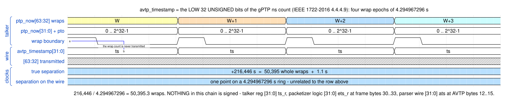
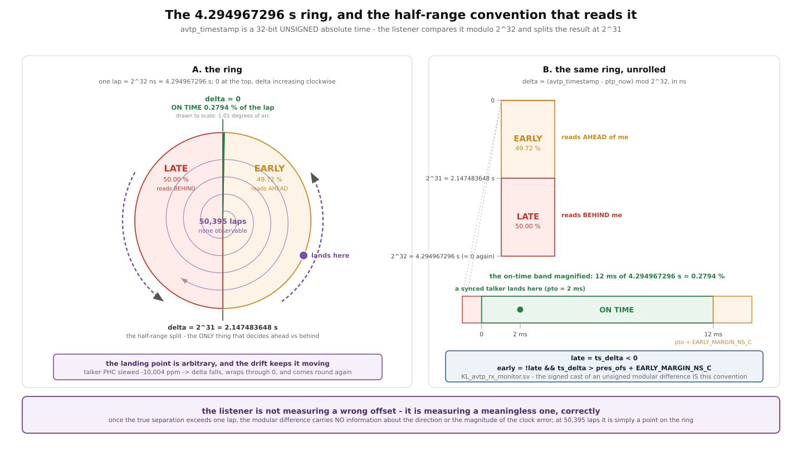
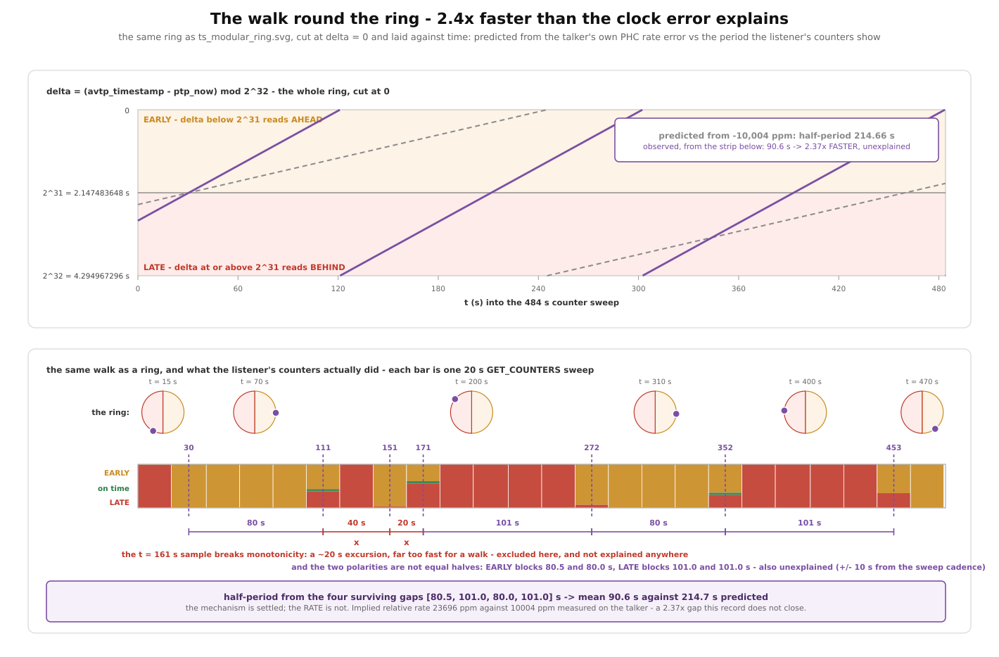
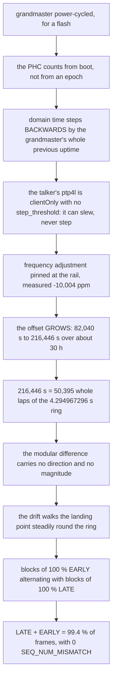

<!--
SPDX-FileCopyrightText: 2026 Kebag Logic
SPDX-License-Identifier: CERN-OHL-W-2.0
-->

# Presentation time, the 4.295 s wrap, and why a far-off clock alternates

A talker whose clock is 60 hours away from the domain does **not** make a
listener report "everything is late". It makes it report blocks of *100 %
EARLY* alternating with blocks of *100 % LATE*, with a square-wave period of
about 90 seconds — while sequence numbers, media lock and frame delivery stay
perfect.

That was measured on 2026-07-27 and written up in
[`../findings/REF_LISTENER_TIMESTAMP_SWEEP_0727.md`](../findings/REF_LISTENER_TIMESTAMP_SWEEP_0727.md).
**That page is the measurement record; this page is the mechanism.** Numbers
are quoted here only where the arithmetic needs them, and the arithmetic is
written out so you can check it.

This is a design record rather than a finding because the mechanism is a
property of the wire format, not of an incident — the presentation timestamp is
32 bits wide in IEEE 1722-2016, which is a fact about the standard rather than
about our implementation — and because it decides two design questions: where
`TIMESTAMP_UNCERTAIN` must be driven from, and how far a listener may trust
`AVTPRX_TSD`. The 07-27 measurement is the occasion, not the subject.

## Contents

- **[The field: 32 unsigned bits of absolute time](#the-field-32-unsigned-bits-of-absolute-time)** — What `avtp_timestamp` actually is, checked module by module rather than assumed: an unsigned absolute time, no sign bit anywhere in the chain. Includes the chronogram of the 4.295 s lap and the arithmetic putting our talker 50,395 whole laps out — plus why even the *remainder* is not pinned down by the measurement that found it.
- **[The comparison: modular, with a half-range convention](#the-comparison-modular-with-a-half-range-convention)** — The listener never sees an offset; it sees `(ts - now) mod 2^32` split at 2³¹. The ring diagram, the three proportions that fall out of the constants (50.000 % / 0.2794 % / 49.721 %), and the one sentence to take away: the listener is measuring a meaningless quantity, correctly.
- **[Why that alternates instead of biasing](#why-that-alternates-instead-of-biasing)** — The step from "meaningless" to "alternating": a meaningless *constant* would still give a constant verdict. The drift sweeps the landing point past both boundaries, twice per lap, and that is the square wave. Also why a cumulative counter read tells you nothing.
- **[The number that does not close](#the-number-that-does-not-close)** — The honest part. 214.66 s predicted against 90.62 s measured, worked out step by step, with the two candidate explanations stated as candidates, an arithmetic bound on each, a third estimate that agrees with neither, and a block asymmetry nobody has explained. Deliberately not reconciled.
- **[The causal chain](#the-causal-chain)** — Grandmaster power-cycle to alternating verdicts in eleven steps. The link worth staring at is the second one: the PHC counts from boot, so a grandmaster restart moves domain time *backwards*, and a slew-only client can never follow.
- **[What this means for the design](#what-this-means-for-the-design)** — Why no listener-side heuristic can recover the truth, and therefore why `TIMESTAMP_UNCERTAIN` must be driven from servo convergence state rather than from anything observed on the wire. Also the bound this puts on `AVTPRX_TSD` (`0x6EC`), which we already ship as a PHC-discipline error signal, and the one line of RTL that hardcodes `tu = 0` today.
- **[Reproducing the arithmetic](#reproducing-the-arithmetic)** — The three generator commands. Each figure recomputes its own proportions from the constants, and the walk generator prints the derived transitions and the 2.369x ratio, so the pictures cannot drift away from the prose.

## The field: 32 unsigned bits of absolute time

`avtp_timestamp` is a **32-bit unsigned absolute time**: the low 32 bits of the
gPTP nanosecond count, plus the presentation offset. It is not a difference, it
is not relative to anything, and there is no sign bit anywhere in the path.
Checked end to end rather than assumed:

| Where | What it says | Type |
|---|---|---|
| IEEE 1722-2016 **4.4.4.9** | `avtp_timestamp` = presentation time, gPTP ns, mod 2³² | — |
| [`../traceability/ieee1722-2016.md`](../traceability/ieee1722-2016.md) row AVTP-10 | our traceability entry for that clause | — |
| [`hdl/milan/milan_datapath.sv`](../../hdl/milan/milan_datapath.sv) | `wire [63:0] ptp_now_w` — the PHC as the fabric sees it | unsigned 64 |
| [`hdl/ieee1722/aaf/aaf_talker_i2s.sv`](../../hdl/ieee1722/aaf/aaf_talker_i2s.sv) | `ts_r <= ptp_ns_i[31:0] + transit_ns_i`, `reg [31:0] ts_r` | unsigned 32 |
| [`hdl/ieee1722/aaf/KL_aaf_packetizer.sv`](../../hdl/ieee1722/aaf/KL_aaf_packetizer.sv) | `logic [31:0] ets_r` placed at frame bytes 30..33 | unsigned 32 |
| [`hdl/ieee1722/avtp/avtp_stream_parser.sv`](../../hdl/ieee1722/avtp/avtp_stream_parser.sv) | `wire [31:0] ats` lifted from AVTP bytes 12..15 | unsigned 32 |
| [`hdl/milan/milan_datapath.sv`](../../hdl/milan/milan_datapath.sv) | the RX monitor is handed `ptp_now_w[31:0]` | unsigned 32 |

Thirty-two bits of nanoseconds is one **lap** of

```
2^32 ns = 4,294,967,296 ns = 4.294967296 s
```

and the talker transmits the low 32 bits only. The wrap count — everything
above bit 31 — never leaves the board:



On 2026-07-27 the talker's PHC sat **216,446 s** from the domain. In laps:

```
216,446 / 4.294967296          = 50,395.26 laps
50,395 x 4.294967296           = 216,444.877 s
216,446 - 216,444.877          =      1.12 s   remainder
```

Fifty thousand three hundred and ninety-five whole laps are simply absent from
the wire. Worth noting how little even that remainder is pinned down: the three
PHC reads in the record were taken back to back, not simultaneously, and give
216,451.07 s against the grandmaster and 216,441.23 s against the bench host —
a 9.84 s spread, which is **2.3 laps**. The fractional part is not determined
by that measurement at all. It does not need to be; see below.

## The comparison: modular, with a half-range convention

The listener never sees an offset. It computes a **modular difference** and
reads it with a **half-range convention**:

```
delta = (presentation_time - local_time) mod 2^32
        delta <  2^31   ->  reads as AHEAD of me   (on time, then EARLY)
        delta >= 2^31   ->  reads as BEHIND me     (LATE)
```

Our own RTL spells that convention as a signed cast, which is the same thing —
[`hdl/ieee1722/avtp/KL_avtp_rx_monitor.sv`](../../hdl/ieee1722/avtp/KL_avtp_rx_monitor.sv):

```systemverilog
wire signed [31:0] ts_delta_w = avtp_ts_i - ptp_now_i;
wire late_w  = ts_delta_w < 0;
wire early_w = !late_w &&
               (unsigned'(ts_delta_w) > (pres_ofs_i + EARLY_MARGIN_NS_C));
```

A signed read of an unsigned modular difference *is* the half-range split at
2³¹. The reference device's own rule is not published, so everything drawn
below uses ours as the model and says so where it matters.



Three proportions fall straight out of the constants, and the figure computes
them rather than quoting them:

* **LATE** is `2^31 / 2^32` = **50.000 %** of the lap;
* **on time** is `pres_ofs + EARLY_MARGIN_NS_C` = 2 ms + 10 ms = 12 ms, i.e.
  `0.012 / 4.294967296` = **0.2794 %** of the lap — 1.01 degrees of arc;
* **EARLY** is the remaining **49.721 %**.

The convention only carries meaning while the true difference is small
relative to one lap. Ours is 50,395 laps out. So:

> Once the true offset exceeds the wrap period, the modular difference carries
> no information about the actual direction or magnitude of the clock error.
> The listener is not measuring a wrong offset — it is measuring a meaningless
> one, correctly.

Every counter it reports is right. `SEQ_NUM_MISMATCH` 0, `STREAM_INTERRUPTED`
0, `MEDIA_RESET` 0 over 31 M frames say the transport is perfect. The
`LATE_TIMESTAMP` and `EARLY_TIMESTAMP` counters say the timestamp landed on one
side of 2³¹ or the other, which is exactly what happened, and which means
nothing.

## Why that alternates instead of biasing

A *constant* meaningless offset would still give a constant verdict. Ours is
not constant: the talker's PHC is being dragged at its maximum frequency
adjustment, measured at **−10,004 ppm** against the board's own
`CLOCK_MONOTONIC` with no network in the loop. So the modular difference falls
steadily, and the landing point walks round the ring:

* while it is in the near half → **EARLY**, every frame;
* it reaches 0 and wraps to 2³² → the verdict flips to **LATE**, every frame;
* it falls to 2³¹, the half-range split → back to **EARLY**.

One lap of the ring is one full square-wave period. Nothing is jittering
across a boundary; the boundary is being swept past, twice per lap.



That is also why the *cumulative* counters look like a harmless 50/50 split:
they are the time-average of a square wave. Reading absolute counters tells
you nothing here — the cadence is the measurement.

## The number that does not close

The mechanism above is settled. **The rate is not, and this page does not
pretend otherwise.**

At the measured rate error, half a lap takes

```
2^31 ns / 1.0004 %  =  2.147483648 s / 0.010004  =  214.66 s
```

so the predicted half-period is **214.66 s**, and a full lap 429.32 s.

The measurement disagrees. Classifying each 20 s sweep as EARLY / LATE / mixed
and putting each transition at the midpoint of the interval it happened in
(so every instant below carries ±10 s from the sweep cadence) gives transitions
at **30.5, 111.0, [151.0, 171.0], 272.0, 352.0 and 453.0 s**. The gaps between
them are

```
80.5 s   |  40.0 s  20.0 s  |  101.0 s   80.0 s   101.0 s
             ^^^^^^^^^^^^^^ the t = 161 s anomaly
```

Dropping the two that straddle the t = 161 s sample — a ~20 s excursion into
EARLY inside a LATE block, an order of magnitude too fast to be a walk — leaves
four half-periods of 80.5, 101.0, 80.0 and 101.0 s, **mean 90.62 s**. Against
214.66 s predicted that is

```
214.66 / 90.62 = 2.369x   too fast
```

and the relative rate it implies is

```
2.147483648 s / 90.62 s = 0.023696 = 23,696 ppm
```

against the 10,004 ppm measured on the talker — **13,692 ppm unaccounted for.**

Three things about this gap are worth having on the record, and none of them
closes it.

**Candidate 1 — the grandmaster is being slewed too, so the rates add.** The
figure quoted is the talker's rate against its own monotonic clock; what drives
the walk is the *relative* rate between the two devices. If the far end is also
off frequency the two add. Stated as arithmetic: reaching a 90.62 s half-period
needs 23,696 ppm of relative error. If both devices sat at a ±1 % rail in
opposite directions that is 20,000 ppm, giving `2.147483648 / 0.02` = **107.4 s**
— closer, but still 18 % longer than observed, and the far end's rail was never
measured. Recorded as a candidate; not excluded, not established.

**Candidate 2 — the acceptance window is narrower than assumed.** Under the
rule modelled here the flip points are set by the half-range split at 2³¹ and
by the wrap at 0, not by the window bounds; the window width only sizes the
0.28 % on-time sliver. So this candidate only bites if the reference device's
comparison basis differs from ours — a different effective modulus, or a
different split. Its rule is not published, so this cannot be checked from the
record. Recorded as a candidate.

**A third handle, which agrees with neither.** Three of the transition sweeps
report ~5.3 % of frames as neither LATE nor EARLY — the residual of the two
percentages — which is the walk dwelling inside the on-time band. *If* the
reference's band were our 12 ms, 5.3 % of a 20 s interval is 1.06 s of dwell,
implying `0.012 / 1.06` = **11,321 ppm** — close to the measured 10,004 ppm and
nowhere near the 23,696 ppm the block period demands. That rests on an
unverified assumption about a third-party device, and the residual is 5.3 % in
three of the seven transition sweeps and 0.0 % in the other four, so it is
offered as a *third disagreeing estimate*, not as a tiebreaker.

One more asymmetry falls out of the same numbers and is also unexplained: the
two clean EARLY blocks measure 80.5 and 80.0 s while the two clean LATE blocks
measure 101.0 and 101.0 s. Under the convention modelled here EARLY is 49.721 %
of the lap and LATE 50.000 % — near enough equal — so 80.25 vs 101.0 s (a
1.26 : 1 ratio) should not happen. Each transition instant carries ±10 s, so a
block length carries up to ±20 s worst case and the 20.75 s difference sits
right at that limit — suggestive, not conclusive. What makes it hard to dismiss
as quantisation is that the two EARLY blocks agree to 0.5 s and the two LATE
blocks agree exactly.

**Do not reconcile these by choosing one.** The mechanism explains the
alternation; the record does not explain its rate.

## The causal chain



The trigger deserves emphasis because it is a *design* property, not a fault:
the PHC counts from boot. Restart the grandmaster and the domain's time jumps
backwards by its entire previous uptime. A client configured to slew and never
step cannot follow that jump, and each further restart adds more than the rail
can remove — which is why the offset in the record is measured *growing*.
`GPTP_GM_CHANGED` reads **112** on that talker against **2** on the other board
and **2** on the reference device.

## What this means for the design

The consequence is short and it is the reason this page exists.

**No listener-side heuristic can recover the truth.** The wire carries 32
unsigned bits of absolute time. Above one lap of separation the modular
difference is unrelated to the real error in both direction and magnitude, so
there is nothing for a listener to infer from — not from the sign of a computed
delta, not from its magnitude, not from a long average of either. A listener
that tried to auto-correct would be steering on noise.

That has a second, immediate consequence for a register we already ship.
`AVTPRX_TSD` (`0x6EC`) latches `avtp_timestamp - ptp_now` at every accepted PDU
and is documented in
[`../reference/REGISTER_MAP.md`](../reference/REGISTER_MAP.md) as the
stream-sync error signal; the RTL comment offers it as a "zero-noise error
signal for userspace PHC discipline". **That reading is valid only while the
two clocks are within one lap of each other.** Past that it is a walking,
meaningless number that looks exactly like a well-behaved error signal, and
disciplining anything from it would lock onto a fiction. Anything consuming
`0x6EC` as a control input needs an independent validity condition; the
counters alone cannot supply one, because `LATE`/`EARLY` look identical in both
regimes.

Only the talker knows, and only by asking its own servo. Which makes the
`TIMESTAMP_UNCERTAIN` bit the right mechanism and the *servo convergence state*
the only defensible thing to drive it from — never an observed offset sign or
size.

Until VERSION `0x0016` our talker hardcoded the bit clear:
[`hdl/ieee1722/aaf/KL_aaf_packetizer.sv`](../../hdl/ieee1722/aaf/KL_aaf_packetizer.sv)
wrote `fb[21] = 8'h00`, i.e. `tu = 0`, on every frame — including the 31 M
frames it sent from a clock 60 hours out. The listener half of the contract
already existed: the RX monitor takes a `ts_uncertain_i` input and counts
`TIMESTAMP_UNCERTAIN` from it, and the parser lifts the `tu` bit at AVTP byte 3.
It was the talker end that was missing.

**That drive now exists** —
[`hdl/ieee8021as/ptp_timestamp/KL_ptp_clock_validity.sv`](../../hdl/ieee8021as/ptp_timestamp/KL_ptp_clock_validity.sv)
feeds `tu` to every talker, and this page's argument is exactly why its
`SYNC_OK` term is a **software lease** (`CLKV_CTRL` `0x778`) rather than
anything derived on the wire: past one lap there is nothing on the wire to
derive it from. See [`../reference/REGISTER_MAP.md`](../reference/REGISTER_MAP.md),
the `0x778` group. This page deliberately does not duplicate that design; what
belongs here is only the reason — the wrap, not a policy preference, is what
makes talker-side declaration the only option.

## Reproducing the arithmetic

Every figure on this page is generated, and each generator recomputes its own
proportions from the constants rather than being told them, so a picture cannot
drift away from the prose:

```sh
# the chronogram (needs the wavedrom package + rsvg-convert)
python3 scripts/gen_wavedrom.py docs/diagrams/wd_ts_wrap_alias.json

# the ring and the half-range convention
python3 docs/diagrams/diag_ts_modular_ring.py docs/diagrams/ts_modular_ring.svg

# the walk: prints the derived transitions, gaps, block lengths and the ratio
python3 docs/diagrams/diag_ts_wrap_walk.py docs/diagrams/ts_wrap_walk.svg
```

The last one prints exactly the numbers quoted above, which is the point of
computing them in the generator:

```
transitions  : [30.5, 111.0, 151.0, 171.0, 272.0, 352.0, 453.0]
EARLY blocks : [80.5, 80.0] s     LATE blocks : [101.0, 101.0] s
gaps         : [80.5, 40.0, 20.0, 101.0, 80.0, 101.0]
clean gaps   : [80.5, 101.0, 80.0, 101.0]  mean 90.62 s
predicted    : HALF_S/0.010004 = 214.66 s
ratio        : 2.369 x     implied rate 23696 ppm
```

The measurement side — how the counters were read without `la_avdecc`, how the
PHC rate error was measured with no network round-trip in the loop, and the
traps that cost time on the way — is in
[`../findings/REF_LISTENER_TIMESTAMP_SWEEP_0727.md`](../findings/REF_LISTENER_TIMESTAMP_SWEEP_0727.md).
The clock chain the presentation timestamp comes from is in
[`TIME_SYNC.md`](TIME_SYNC.md), and the talker/listener chains that carry it in
[`AUDIO_STREAMING.md`](AUDIO_STREAMING.md).
