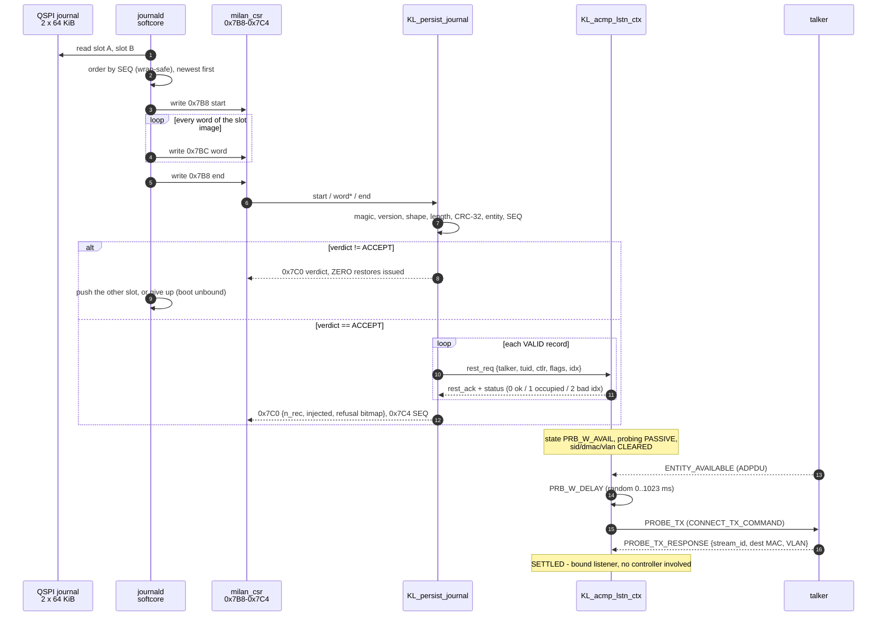

# Saved-state fast-connect — the persistence journal

Milan v1.2 §5.5.3.5 wants a listener binding to survive a power cycle: after a
reboot the sink re-establishes its stream **with no controller in the loop**.
The fabric half of that (§3) has been in gateware since `VERSION 0x0001_000A`.
What was missing — and what this document specifies — is the **journal**: a
durable place to keep the binding, and the boot-time sequence that replays it.

> **Roadmap:** item 9 / [`TODO.md`](../../TODO.md) Phase 10.

---

## Contents

- **[1. Status ledger — proven vs designed-only](#1-status-ledger--proven-vs-designed-only)** — Read first: a row per piece saying what is in gateware, what is Verilator-proven, and what is designed-only because it cannot be executed without a board. The page never claims "persistence works".
- **[2. What is saved, and what is deliberately not](#2-what-is-saved-and-what-is-deliberately-not)** — Milan saves a *binding*, not a *connection* — so `stream_id`, dest MAC and VLAN are deliberately cleared and re-probed. Restoring a stale multicast DMAC would point the listener at a reservation that no longer exists.
- **[2b. The clause inventory — every Milan persistence SHALL, and what holds it](#2b-the-clause-inventory--every-milan-persistence-shall-and-what-holds-it)** — Generated from `sw/persist/milan_persist_state.py`: all ELEVEN Milan persistence SHALLs (5.3.8.1 is one row of eleven), the two SHALL-NOTs that require the opposite, and per clause whether this build can put the value back. Seven could not until the E4 port landed at gateware `0x0022`; **four still cannot**, and they share a shape — they live in response-builder register files, not in the AEM store, so another CSR group cannot reach them. Re-verified line by line against the PDF on 2026-08-03: no misattribution, no misquote, nothing missing.
- **[3. The as-built fabric enablers](#3-the-as-built-fabric-enablers)** — The two register groups this design builds on, recapped so the page stands alone: E1 `0x7A0-0x7B4` injects the 5.5.3.5.2 entry record (and refuses rather than merges when the context is already bound), E2 `0x860/0x864/0x868` is the read side the writer daemon learns from.
- **[4. The journal record format — KLJ1 v1](#4-the-journal-record-format--klj1-v1)** — The whole on-flash container: 6-word header, records, CRC last. The trick worth internalising is that a record *is* the six E1 register writes in register order, so encoder, decoder and register map cannot drift. §4.4 gives a 52-byte worked image whose CRC is pinned in the testbench.
- **[5. Where it lives in the 16 MB QSPI](#5-where-it-lives-in-the-16-mb-qspi)** — The flash map before and after the carve, and why there are two partitions: `journal` is raw so "a torn write cannot damage the other slot" is flash geometry rather than a filesystem promise, `/user` is jffs2 for things that want files. The Arty gets neither slot — it has ~15 KB of rootfs headroom — and degrades to booting unbound.
- **[6. Durability — the A/B contract and the torn-write taxonomy](#6-durability--the-ab-contract-and-the-torn-write-taxonomy)** — The write rule, the wrap-safe `SEQ` compare, and a nine-row table of every way a slot can be damaged with its verdict code. The rule that matters: in every row the number of restore transactions issued is zero, because the CRC is the last word read. §6.4 states the residual risks, including the intentional rollback-to-previous-binding.
- **[7. Boot-time replay sequence](#7-boot-time-replay-sequence)** — A sequence diagram from two mtd reads to a SETTLED listener with no controller in the loop, then four ordering constraints for whoever writes the daemon — notably that on gateware without the ingest group `0x7C0` reads 0, which is indistinguishable from "idle", so the VERSION gate is not optional.
- **[8. CSR ingest group 0x7B8-0x7C4 — the integration contract](#8-csr-ingest-group-0x7b8-0x7c4--the-integration-contract)** — The four-register ABI and its verdict codes, still living in a testbench wrapper rather than `milan_csr`. Names the one piece of integration not built: the `rest_*` arbiter between the journal master and the manual `0x7B4` commit path.
- **[9. The write path — when the journal is saved](#9-the-write-path--when-the-journal-is-saved)** — The daemon's read-compose-write loop through the `0x800` window, and two traps carried from the running system: a snapshot that is not fresh reads literal `0` (so `stream_id` 0 means "not fresh", not "no bind"), and whoever polls `0x800` owns it.
- **[10. Kernel / boot-side work](#10-kernel--boot-side-work)** — Four items, one landed. The open edge is item 4: `deploy.sh` computes each slot ceiling from the next *image* offset and never reads the new `reserved` key, so an oversized rootfs would be accepted and would overwrite `journal` and `user` — a one-line fix in `do_flash_images()`. Also: reads alone unblock the restore half, so the write path is not on the critical path.
- **[10b. Feasibility verdict — can Linux write this flash? (answered 2026-08-03)](#10b-feasibility-verdict--can-linux-write-this-flash-answered-2026-08-03)** — Answered with kernel config, DTS, csr.csv and the shipping board tool: yes, through the LiteSPI master, and it already does. `/proc/mtd` is empty *permanently* (no `litex,spiflash` driver exists here or upstream), which is why it was the wrong store probe. Names the two defects the verdict exposed: a journal sector inside the wrong partition, and a DT bank base 0x800 off.
- **[10c. E4 — the AEM dynamic-state ingest port (the actual blocker)](#10c-e4--the-aem-dynamic-state-ingest-port-the-actual-blocker)** — **LANDED at gateware `0x0022`.** The write master the AEM store never had: a descriptor-addressed patch port at `0x7C8-0x7D4` that resolves byte ranges from the SAME generated `WB_*_ADDR_C` tables `SET_STREAM_FORMAT` uses, revalidates through the same acceptance test, and is accepted ONLY while ADP is disabled — so "replay before advertise" is structural rather than procedural. Closes 5.3.8.1, 5.3.7.1 and 5.3.5.1 and narrows 5.3.11.1; the plan's claim that it would close all seven was wrong, and the section says why.
- **[11. Bench recipe for the flash half](#11-bench-recipe-for-the-flash-half)** — Seven gates G0-G6 with the actual `devmem` sequences, each falsifiable alone so a failure localises. G2 proves replay end to end without any writable mtd; G3 budgets under ~10 s to SETTLED; G6 is the power-cut-during-write drill that earns the whole design.
- **[12. Why KL_aecp_nv_overlay was not reused](#12-why-kl_aecp_nv_overlay-was-not-reused)** — The prior art turned out to be a stub, but its framing shaped one real decision: it aimed at descriptor-field persistence, which is how a persistence feature becomes unbounded. Scope here is bindings only, and the `FMT_VER` major is what lets the container grow later without old gateware misreading it.
- **[13. What tb/verilator/persist proves](#13-what-tbverilatorpersist-proves)** — 96 checks against the unmodified shipping `KL_acmp_lstn_ctx`, group by group. `[J2]` is the load-bearing one — damage in the *last* record leaves the first two sinks untouched, which is exactly what a streaming applier would get wrong.
- **[14. Remaining work, in order](#14-remaining-work-in-order)** — Four steps, ordered so the read path (which needs no writable mtd) comes before the write path. Note item 2 restates the flash-map work that §5 and §10 record as already landed and gated.

## 1. Status ledger — proven vs designed-only

Read this first. The flash half of this feature **cannot be executed without a
board**, and nothing below claims otherwise.

| Piece | State | Evidence |
|---|---|---|
| E1 bind-restore group `0x7A0-0x7B4` | **in gateware** (`0x000A`) | `tb/verilator/acmp_lstn` `[N9]` |
| E2 window words `0x860/0x864/0x868` | **in gateware** (`0x000A`) | `tb/verilator/csr` |
| Journal record format (§4) | **specified + encoded + decoded** | golden CRC pinned in `tb/verilator/persist` `[J0]` |
| `KL_persist_journal` decode + replay | **RTL, Verilator-proven** | `tb/verilator/persist` — 96 checks, 0 failures |
| Torn-record rejection (never half-applied) | **RTL, Verilator-proven** | `tb/verilator/persist` `[J1]`/`[J2]`/`[J7]` |
| Restored sink reaches a bound listener | **RTL, Verilator-proven** | `tb/verilator/persist` `[J4]` |
| CSR ingest group `0x7B8-0x7C4` | **in gateware** (`0x0019`) | `milan_csr.sv` `A_JNL_CTRL/DATA/STAT/SEQ`; `milan_datapath.sv` instantiates `KL_persist_journal` |
| QSPI repartition (§5) | **in `FLASHBOOT_LAYOUT`, host-gated** | `sw/trace/test_trace_roundtrip.py` gate 1 (alignment, no overlap, fits) — still needs a build + a flash |
| mtd partition node (§10 item 1) | **generated + `dtc`-checked** | `sw/dts/gen_mtd_partitions.py --check --dtc`, same gate 1 |
| mtd driver actually binding, `/user` mounted (§10 items 2-3) | **impossible in this kernel** | no `litex,spiflash` driver exists here or upstream; §10b |
| Flash reachable from Linux WITHOUT mtd | **shipping, silicon-proven** | `acmp-persist` over the LiteSPI master CSRs; §10b |
| Bindings restored BEFORE the first ADPDU | **desk-proven** | `tools/test_milan_persist.py::test_a_failed_replay_leaves_ADP_DISABLED` (milan-tests-avb) |
| The other seven persistence clauses (§2b) | **cannot be restored** | no AEM-store ingest; §10c specifies the port |
| Journal writer (§9) | **shipping** | `acmp-persist watch`, started by `S51acmp-persist` |
| Reboot drill (§11) | **designed only** | needs a board |

A design + a proven replay path + an executable bench recipe is the deliverable.
"Persistence works" is **not** claimed anywhere in this document.

---

## 2. What is saved, and what is deliberately not

Milan 5.5.3.5.3 makes the saved state a *binding*, not a *connection*. Saved:

* `talker_entity_id` + `talker_unique_id` — who we were bound to;
* `controller_entity_id` — who authorised the binding (5.5.3.5.3 step 2);
* the binding **flags**, notably `STREAMING_WAIT` (bit 3, 5.5.2.4);
* the target `listener_unique_id` (which local sink).

Explicitly **not** saved, because 5.5.2.6 step 1 re-probes them:

* `stream_id`, `stream_dest_mac`, `stream_vlan_id` — the SRP/stream parameters.
  The restored context has them **cleared**; the probe response re-learns them.
  Restoring a stale multicast DMAC or VLAN would point the listener at a
  reservation that no longer exists.

The VLAN *is* carried in the record (§4) but only as an operator-facing hint;
the E1 register `0x7A8[27:16]` documents it as informational and the fabric
ignores it on load. Keeping it costs nothing and makes a hexdump of the journal
readable.

---

## 2b. The clause inventory — every Milan persistence SHALL, and what holds it

> **Generated.** The table below is `python3 sw/persist/milan_persist_state.py
> --emit-md`. `PERSIST_ITEMS` in that file is the ONE place either repo says
> "clause X requires state Y"; the board reads the same list through the
> generated `/etc/milan-persist-state.sh`, and `sw/trace/test_trace_roundtrip.py`
> gate 1 fails if the two drift. Do not retype a row here.

Milan v1.2 puts **eleven** unconditional persistence SHALLs on a PAAD-AE, not
one. §5.3.8.1 (the clause task #62 was opened on) is the most visible because a
controller sets a stream format and watches it revert, but it is one row.

> **Re-verified against the PDF 2026-08-03.** All thirteen rows — the eleven
> SHALLs and the two SHALL-NOTs — were checked clause number, heading and
> sentence against
> `Milan_Specification_Consolidated_v1.2_Final_Approved 20231130.pdf`. **No
> misattribution, no misquote, no wrong line number**, and an exhaustive sweep
> of clause 5.3 for `non.?volatile` / `power.?cycle` / `shall be saved` finds
> exactly eleven and exactly two: the inventory is a bijection onto the spec.
> Two things the pass added rather than corrected: Milan spells it **"non
> volatile" (unhyphenated) outside 5.3**, so re-deriving these quotes with a
> hyphen-only grep under-reports (5.5.2.4 and every 5.5.3.5.x step); and
> §5.3.8.3 closes with *"The binding parameters are cleared when the Stream
> Input gets unbound"*, so keeping a record after `UNBIND_RX` breaks the clause
> as surely as never writing one — which is what the journal's `VALID[30] = 0`
> hole represents. Both are now recorded in `PERSIST_ITEMS`.

| Clause | State | Scope | Restore path | Status |
|---|---|---|---|---|
| 5.3.8.1 | STREAM_INPUT current format | per-descriptor | csr | **restorable today** |
| 5.3.7.1 | STREAM_OUTPUT current format | per-descriptor | csr | **restorable today** |
| 5.3.8.2 | STREAM_INPUT bound state | per-descriptor | fabric-journal | **restorable today** |
| 5.3.8.3 | STREAM_INPUT binding parameters | per-descriptor | fabric-journal | **restorable today** |
| 5.3.8.7 | STREAM_INPUT started/stopped state | per-descriptor | fabric-journal | **restorable today** |
| 5.3.7.6 | STREAM_OUTPUT presentation time offset | per-descriptor | none | **OPEN** - the presentation-offset file is a response-builder register array with no slave port; the E4 patch port reserves FIELD 3 for it and answers VD_FIELD until that port exists |
| 5.3.5.1 | AUDIO_UNIT current sampling rate | per-descriptor | csr | **restorable today** |
| 5.3.11.1 | CLOCK_DOMAIN current clock source | per-descriptor | none | **OPEN** - descriptor bytes restorable via the E4 port (CSR 0x7C8 FIELD 2, gateware >= 0x0022), but the LIVE selector clk_src_r in KL_aecp_response_builder still has no write port - a restore would report a source the fabric is not actually using |
| 5.3.9.1 | STREAM_PORT_OUTPUT channel mappings | per-descriptor | none | **OPEN** - the output dynamic-map store is written only by ADD/REMOVE_AUDIO_MAPPINGS inside KL_aecp_response_builder; the E4 patch port reaches the AEM store, not that register file |
| 5.3.10.1 | STREAM_PORT_INPUT channel mappings | per-descriptor | none | **OPEN** - the input dynamic-map store is written only by ADD/REMOVE_AUDIO_MAPPINGS inside KL_aecp_response_builder; the E4 patch port reaches the AEM store, not that register file |
| 5.3.13 | User names (entity, configuration, cluster, clock domain, ...) | per-descriptor | csr | **restorable today** |
| 5.3.4.1 | Locked state - MUST NOT persist | global | n/a | **must NOT persist** (satisfied: nothing saves it) |
| 5.3.4.2 | Registered controller list - MUST NOT persist | global | n/a | **must NOT persist** (satisfied: nothing saves it) |

Two clauses require the **opposite**, and they are in the same inventory on
purpose — a broader store must not quietly start keeping them:

* **5.3.4.1** — *"The locked state is cleared by a power cycle."*
* **5.3.4.2** — *"The list of registered controllers is cleared by a power
  cycle."*

**The shape of the gap was never "no flash".** It was that seven of the eleven
lived in `KL_aecp_aem_store`'s BRAM (or in a response-builder register file),
whose write port was driven *solely* by `KL_aecp_response_builder`'s SET_*
write-back. No CSR reached it. Nor could a self-addressed AECP command: the
AECP parser taps the **RX** path, and a unicast frame the board sends to its own
MAC is never forwarded back to the sending port. Saving those seven always
worked; putting them back had no path at all.

**§10c closed the store half on 2026-08-03** (gateware `0x0022`). The E4 patch
port at `0x7C8-0x7D4` is that missing write master, and it takes three clauses
from OPEN to restorable — 5.3.8.1, 5.3.7.1, 5.3.5.1 — while narrowing 5.3.11.1
to its live-shadow residue. **Four remain**, and they share one shape: they do
not live in the AEM store at all, but in *register files inside the response
builder* — the presentation-offset array (5.3.7.6), the live clock selector
(5.3.11.1), and the two dynamic channel maps (5.3.9.1 / 5.3.10.1) — plus the
non-ENTITY names (5.3.13), whose store address is resolved by
`KL_aecp_accessor`'s descriptor-name pointer cone that the patch port has no
requester on. Each needs a slave port on that module, not another CSR group.
The patch port reserves field codes `3` and `4` for exactly those cases and
refuses them **by name** (`VD_FIELD`), so the gap is legible from software
instead of presenting as a silent no-op.

---

## 3. The as-built fabric enablers

Both are in [`REGISTER_MAP.md`](../reference/REGISTER_MAP.md); recapped here so
this document stands alone.

**E1 — bind-restore, `0x7A0-0x7B4`.** Stage `{talker eid, tuid, controller eid,
flags}`, then write `0x7B4` with `[31]` commit, `[23:8]` flags, `[3:0]` sink
index. The fabric injects the Milan 5.5.3.5.2 **entry record** into the ACMP
listener context table:

```
state   = LSM_PRB_W_AVAIL   (bound, awaiting the talker's ADPDU — 5.5.1.4)
probing = PASSIVE           (5.5.3.5.2 step 2)
status  = 0
sid / dmac / vlan = CLEARED (5.5.2.6 step 1)
```

No new connection logic: the existing ladder (ADP talker watch → `TMR_DELAY` →
`PROBE_TX`) takes over and the sink completes exactly like a power-on
fast-connect. A commit is **refused, never merged**, when the target context is
already bound (status 1) or the index is not a probe-SM sink (status 2).

**E2 — window read-back, `0x860/0x864/0x868`.** The saved-state fields as they
currently sit in the ACMP bind context (`controller_entity_id`, `{flags, tuid}`)
under the `0x800` per-stream window SELECT. This is the **read side**: it is how
the writer daemon (§9) learns what to save.

---

## 4. The journal record format — `KLJ1` v1

One journal **slot image** is a stream of 32-bit **little-endian** words, stored
byte-for-byte as they appear in flash. A slot is self-describing and
self-checking; nothing outside it is needed to decide whether it is usable.

### 4.1 Header — 6 words

| w | Name | Content |
|---|---|---|
| 0 | `MAGIC` | `0x314A4C4B` — hexdumps as the ASCII `KLJ1` |
| 1 | `FMT_VER` | `{major[31:16], minor[15:0]}`; v1 = `0x0001_0000` |
| 2 | `SEQ` | free-running u32 generation counter |
| 3 | `SHAPE` | `{rsvd[31:16], rec_words[15:8], n_rec[7:0]}` |
| 4 | `ENT_LO` | owning `entity_id[31:0]` |
| 5 | `ENT_HI` | owning `entity_id[63:32]` |

### 4.2 Records — `n_rec` × `rec_words` (= 6) words

**A record is the six E1 register writes, in register order.** That is the
whole trick: the journal does not describe a binding in some private encoding
that then has to be translated — a record *is* the CSR transaction that
replays it, so encoder, decoder and register map cannot drift apart.

| r | Goes to | Content |
|---|---|---|
| 0 | `0x7A0` | `talker_entity_id[31:0]` |
| 1 | `0x7A4` | `talker_entity_id[63:32]` |
| 2 | `0x7A8` | `{rsvd[31:28], vlan[27:16], talker_unique_id[15:0]}` |
| 3 | `0x7AC` | `controller_entity_id[31:0]` |
| 4 | `0x7B0` | `controller_entity_id[63:32]` |
| 5 | `0x7B4` | `{rsvd[31], VALID[30], rsvd[29:24], flags[23:8], rsvd[7:4], listener_unique_id[3:0]}` |

`VALID[30]` is the **journal-side** bit and is never written to `0x7B4`: it is
how a slot expresses "sink 2 has no saved binding" without changing `n_rec`, so
the file's shape is stable across saves. The replay engine adds the commit bit
`[31]` itself.

### 4.3 Trailer — 1 word

`CRC-32/ISO-HDLC` (reflected poly `0xEDB88320`, init `0xFFFFFFFF`, final XOR
`0xFFFFFFFF`) over **every preceding byte of the image** — i.e. bit-for-bit
Python's `zlib.crc32(blob[:-4])`. Placing it **last** is what makes the replay
atomic: the decoder physically cannot have acted on anything before it has seen
and checked the digest.

### 4.4 Worked example (the format golden)

One record, sink 0, talker `02:00:00:FF:FE:00:00:01`, tuid 3, controller
`68:05:00:FF:FE:00:00:AA`, flags `STREAMING_WAIT`, VLAN 2, `SEQ` 5, entity
`02:00:00:FF:FE:00:00:03` — 13 words / 52 bytes:

```
314a4c4b 00010000 00000005 00000601 fe000003 020000ff
fe000001 020000ff 00020003 fe0000aa 680500ff 40000800
c1ebd52a
```

That CRC is pinned as a check in
[`tb/verilator/persist/sim_main.cpp`](../../tb/verilator/persist/sim_main.cpp)
`[J0]`, so neither the writer, the fabric digest nor this document can drift
without a suite failure. A journal writer can self-test against it in two lines
of Python.

### 4.5 Size

`6 + n_rec·6 + 1` words. At the AX 8×8 shape (`n_rec` = 8) that is 55 words =
**220 bytes**. Padded to a 512-byte record area inside each slot, with the pad
left erased and outside the CRC.

---

## 5. Where it lives in the 16 MB QSPI

The flash map is generated from `FLASHBOOT_LAYOUT` in
[`sw/litex/milan_soc.py`](../../sw/litex/milan_soc.py) — **the single source of
truth; the slots below are added there, never by hand**. Today the 16 MB is
fully allocated:

| Offset | Size | Slot |
|---|---|---|
| `0x00_0000` | 4 MiB | bitstream (QSPI self-config) |
| `0x40_0000` | 3 MiB | kernel `Image.xz` |
| `0x70_0000` | 384 KiB | opensbi `fw_jump` |
| `0x76_0000` | 128 KiB | dtb |
| `0x78_0000` | 8.5 MiB | rootfs — **measured 5.6 MiB, ~2.9 MiB slack** (pre-v4) |

The persistence slots come out of that rootfs slack. **This is now what
`FLASHBOOT_LAYOUT` + `FLASHBOOT_RESERVED` in
[`sw/litex/milan_soc.py`](../../sw/litex/milan_soc.py) actually say** (landed
2026-07-26 with the fault-logging work, which needs the same `/user`):

| Offset | Size | Slot |
|---|---|---|
| `0x78_0000` | **6.375 MiB** | rootfs (was 8.5; ~0.775 MiB slack left) |
| `0xEE_0000` | **128 KiB** | **`journal`** — 2 × 64 KiB erase blocks: slot A, slot B |
| `0xF0_0000` | **1 MiB** | **`user`** — general writable state, mounted at `/user` |

Two separate partitions, deliberately:

* **`journal` is raw, filesystem-free.** Each slot is exactly one 64 KiB erase
  block, so "a torn write cannot damage the other slot" is a property of the
  flash geometry rather than a promise from a log-structured filesystem. It is
  also readable the moment the mtd driver probes — before any mount, before
  udev, before the audio stack — which is where a fast-connect wants to happen.
* **`/user` is a filesystem** (`jffs2` first) for everything that genuinely
  wants files: entity/group names, channel maps, mixer state, and `/user/log` —
  the rotating compressed CTF fault log ([`TRACE_LOGGING.md`](TRACE_LOGGING.md)),
  which takes 1.5 MiB of the 2 and carries its own flash-wear budget. Its
  durability story is the filesystem's, and nothing safety-relevant depends on
  it.

**Board applicability.** The AX7101 rootfs has the slack. The Arty rootfs slot
does **not** (~15 KB headroom per [`TODO.md`](../../TODO.md) Phase 10), so the
Arty gets neither slot until its rootfs is slimmed or the layout is redone. The
degradation is graceful and is part of the design: **no journal partition → no
replay → the entity boots unbound and waits for a controller**, exactly as it
does today.

---

## 6. Durability — the A/B contract and the torn-write taxonomy

### 6.1 The write rule

```
new_seq = accepted_seq + 1
target  = the slot that is NOT currently authoritative
erase(target) ; write(target, image(new_seq)) ; read back and verify the CRC
```

The authoritative slot is never erased. At every instant in that sequence at
least one slot holds a complete, CRC-closing image. Power can be removed at any
point.

### 6.2 The read rule (boot)

```
read slot A and slot B (128 KiB total, two mtd reads)
order them by SEQ, newest first, using a WRAP-SAFE compare:
    A is newer than B  iff  (int32_t)(A.seq - B.seq) > 0
push the newest into the fabric; if the verdict is a rejection, push the other
if both are rejected, do nothing — boot unbound
```

Slot arbitration is software's on purpose: comparing two integers is trivial in
a daemon that has already read both slots into RAM, and keeping it out of the
fabric keeps the fabric's job to the one thing that must not be delegated —
**the verdict**.

### 6.3 Failure taxonomy

| What happened | What the reader sees | Verdict | Outcome |
|---|---|---|---|
| Power lost mid-**program** of the target slot | some pages old, some new | `VD_CRC` | fall back to the other slot |
| Power lost mid-**erase** of the target slot | all-ones (`0xFF…`) | `VD_MAGIC` | fall back to the other slot |
| Power lost mid-**read** / short mtd read | fewer words than declared | `VD_LEN` | fall back to the other slot |
| NOR bit rot in a resting slot | one flipped bit | `VD_CRC` | fall back to the other slot |
| Rootfs image cloned onto a second board | valid image, wrong `entity_id` | `VD_ENT` | boot unbound (never claim another board's bind) |
| Journal written by a newer build | `FMT_VER` major ≠ 1 | `VD_VER` | boot unbound; **never reinterpreted** |
| Record grew in a newer format | `rec_words` ≠ 6 | `VD_SHAPE` | boot unbound; **never partially parsed** |
| Older slot pushed after a newer one was accepted | `SEQ` does not advance | `VD_STALE` | ignored — a stale slot cannot roll a fresh bind back |
| **Both** slots damaged | — | — | boot unbound, wait for a controller |

**The rule that matters:** in *every* row above, the number of restore
transactions issued into the ACMP context table is **zero**. There is no
half-applied state. The engine buffers the whole image and the CRC word is the
last thing it reads, so a partial apply is not merely avoided, it is not
representable. `tb/verilator/persist` `[J1]`/`[J2]` assert exactly this — a
three-record image with the damage in the *last* record leaves the first two
target sinks untouched, which is precisely what a streaming applier would get
wrong.

### 6.4 Residual risks, stated

* **A bit flip that still closes the CRC-32** is accepted: probability ~2⁻³² per
  corrupted slot. A stronger digest was not worth the fabric area; the blast
  radius is one wrong `talker_entity_id`, which then simply fails to probe.
* **A rollback to the previous binding** after a torn newest slot is
  *intentional*, not a defect: the older slot was also controller-authorised, so
  restoring it is within 5.5.1.2. It is visible — `0x7C4` reports the `SEQ` that
  was actually accepted.
* **`SEQ` wrap** after 2³² saves is handled by the signed-difference compare; at
  one save per binding change it is unreachable in practice.
* **The `/user` jffs2 partition has no such guarantees.** Nothing in the
  fast-connect path depends on it. Keep it that way.

---

## 7. Boot-time replay sequence



Ordering constraints for whoever writes the daemon:

1. **Replay before the media stack.** The restore must land while the sinks are
   still `LSM_UNBOUND`; a context the local software has already bound will
   refuse the restore with status 1 (correctly — 5.5.1.2 says only a controller
   changes a bound state). In practice: an early init script, before the
   PipeWire/ALSA units.
2. **The ADP advertiser may already be running.** It does not matter: the
   restored sink is `PRB_W_AVAIL` and simply waits for the talker's ADPDU.
3. **Gate on the feature, do not assume it.** `VERSION >= 0x000A` **and** a
   write/read-back probe of `0x7A0` (pattern `0xA5C35A3C`) for E1; `VERSION >=`
   the version that lands `0x7B8` **and** a busy/idle read of `0x7C0` for the
   journal group. On gateware without the ingest group, `0x7BC` writes go
   nowhere and `0x7C0` reads 0 — indistinguishable from "idle, no verdict", so
   the version gate is not optional.
4. **A commit with no engine attached stays busy forever** (the documented E1
   behaviour). The daemon must treat a `0x7C0` busy that never clears as a
   configuration error, `0x7B8 <- abort`, and boot unbound.

---

## 8. CSR ingest group `0x7B8-0x7C4` — the integration contract

**Landed in `milan_csr` (gateware `0x0019`).** The behaviour below is also gated in
[`tb/verilator/persist/persist_wrap.sv`](../../tb/verilator/persist/persist_wrap.sv),
which stands in for `milan_csr` exactly the way `tb/verilator/tcam_csr` does for
the `0x700` TCAM group. Reproducing it in `milan_csr` is a wiring job:

| Offset | Name | Acc | Description |
|---|---|---|---|
| `0x7B8` | `JNL_CTRL` | W1S / RO | Write: `[0]` start a slot image, `[1]` image complete → verify (+ replay), `[2]` abort. Read: `[31]` busy, `[30]` done |
| `0x7BC` | `JNL_DATA` | WO | next 32-bit journal word, little-endian exactly as read from flash |
| `0x7C0` | `JNL_STAT` | RO | `[2:0]` state, `[7:4]` verdict, `[11:8]` records in the accepted image, `[15:12]` records injected, `[23:16]` per-record refusal bitmap, `[30]` done, `[31]` busy |
| `0x7C4` | `JNL_SEQ` | RO | `SEQ` of the last **accepted** image (0 = none accepted this boot) |

Verdict codes in `0x7C0[7:4]`: `0` none · `1` ACCEPT · `2` MAGIC · `3` VERSION ·
`4` SHAPE · `5` LENGTH · `6` CRC · `7` ENTITY · `8` STALE.

The address is `0x7B8`, immediately above the E1 group it feeds and below the
`0x800` window, so it needs none of the `>= 0x800` read carve-outs.

Module: [`hdl/ieee17221/aecp/KL_persist_journal.sv`](../../hdl/ieee17221/aecp/KL_persist_journal.sv).
It needs `entity_id_i` (already in `milan_datapath`), the four ingest signals as
one-cycle strobes, and its `rest_*` master port wired to `KL_acmp_lstn_ctx`'s
`rest_*` slave — **which is currently driven by the `0x7B4` commit path**. The
two masters must be arbitrated: the natural rule is *journal wins while
`0x7C0[31]` busy, `0x7B4` is refused* (or simply: `0x7B4` remains the manual
path and the daemon does not use both). That arbiter is the one piece of
integration this lane did not build, because it lives in `milan_csr`.

---

## 9. The write path — when the journal is saved

The writer is a userspace daemon (working name `journald`, in the private test
repo alongside `acmp-persist`). It never writes the journal speculatively; it
writes on a **binding change**, which it observes through the E2 window:

```
for idx in 0 .. N_LISTENERS-1:
    0x800 <- {idx, dir=0}          # SELECT this listener context
    0x804 <- 1 ; poll busy         # SNAP a coherent block
    read 0x82C  -> lsm state, probing
    read 0x860/0x864 -> controller_entity_id
    read 0x868  -> {flags, talker_unique_id}
    read 0x814/0x818 -> stream_id  (recorded for operators, NOT replayed)
```

Compose the record set, bump `SEQ`, write the non-authoritative slot, read it
back, verify the CRC. Save when — and only when — the composed record set
differs from the one currently in the authoritative slot. A controller UNBIND
(5.5.1.3) clears the saved state for that sink: it becomes a `VALID[30] = 0`
hole, not a deleted record.

Two traps carried over from the running system, both already documented in
[`TROUBLESHOOTING.md`](../limitations/TROUBLESHOOTING.md) §21 and the `0x800`
row of [`REGISTER_MAP.md`](../reference/REGISTER_MAP.md):

* **Snapshot-not-fresh reads 0.** Right after a `0x800` SELECT write, the
  snapshot-served words read literal `0` until a re-poll lands. A `stream_id` of
  0 means "not fresh yet", *not* "no bind". Read until a value repeats.
* **A persistence daemon moving `0x800` in its own loop will fight any other
  reader.** If `journald` polls the window, it owns `0x800`; anything else
  reading the window (a bench `devmem`, another daemon) must expect torn
  selections.

---

## 10. Kernel / boot-side work

> **Partly landed 2026-07-26.** Items 1 and the flash map itself now exist in
> the tree and are gated; items 2-4 remain designed-only. The slot carving was
> done by the fault-logging work, which needs the same `/user` partition —
> [`TRACE_LOGGING.md`](TRACE_LOGGING.md) is the design record for what lives in
> it. There is still **no `spi-nor`/`jffs2` binding proven on a board**.

1. **mtd partitions in the DT** — **DONE, generated, gated.** The slots are
   declared in `FLASHBOOT_LAYOUT` + `FLASHBOOT_RESERVED` in
   [`sw/litex/milan_soc.py`](../../sw/litex/milan_soc.py) (with
   `check_flash_map()` refusing an unaligned or overlapping map at build time),
   and `sw/dts/gen_mtd_partitions.py` emits `sw/dts/mtd-partitions.dtsi` from
   that single source. `--check` byte-compares the checked-in fragment against a
   regeneration and `--dtc` runs `dtc` over it, both wired into
   `sw/trace/test_trace_roundtrip.py` gate 1 — so the partition table can never
   drift from the flash map the BIOS was built with. The fragment attaches to
   the `&flash` label LiteX's `json2dts` already emits for LiteSPI
   (`compatible = "jedec,spi-nor"`), which was read out of the LiteX source
   rather than assumed. `rootfs` is now 6.375 MiB (was 8.5), which is §5's
   repartition and gate G0 step 1.

2. **A writable mtd path.** The shipping SoC gives LiteSPI a memory-mapped read
   window plus a master (`with_master=True`), but Linux has no mtd driver bound
   to it in this tree. Two options, in preference order:
   * bind the LiteSPI controller to `spi-nor`/`mtd` in the kernel config + DT so
     `/dev/mtdN` and `MEMERASE` work normally;
   * failing that, a small userspace writer driving the LiteSPI master CSRs
     directly. Workable — the BIOS already programs flash that way — but it must
     hold a lock against anything else touching the master.

   **Reads alone are enough for the replay half**: the journal partition is
   memory-mapped, so a boot-time *restore* can work before the write path does.
   That is the natural first milestone (§11 gate G2).

3. **`/user` mount** before the Milan init scripts (`S50milan`/`S51`), `jffs2`
   first. Two tenants share it: this journal's operator-facing state, and
   `/user/log` (1.5 MiB of the 2 MiB) for the rotating fault log —
   [`TRACE_LOGGING.md`](TRACE_LOGGING.md) §5 owns that budget and the flash-wear
   arithmetic behind it. Nothing in the fast-connect path depends on either.

4. **`build.sh flash` / `deploy.sh flash-images` must never erase the journal or
   user slots on a reflash.** A gateware or kernel update that silently wipes
   saved bindings is worse than no persistence at all — the entity would come
   back unbound *sometimes*, which is the hardest class of bug to chase.

   **Still open, and now with a sharper edge:** `deploy.sh` derives each image's
   ceiling from the *next image* offset in `flashboot_layout.json`, and the two
   writable slots are exported under a separate `reserved` key it does not read.
   So its printed `rootfs` budget is still `16 MiB − 0x78_0000` even though the
   slot is now 6.375 MiB, and an oversized rootfs would be **accepted** and
   would overwrite `journal` and `user`. Each image entry now carries its own
   `budget` field; the fix is one line in `do_flash_images()` preferring it over
   the next-offset computation. Until then, the size-vs-budget line `deploy.sh`
   prints before writing is a manual check, not an automatic one.

---

## 10b. Feasibility verdict — can Linux write this flash? (answered 2026-08-03)

**Yes, and it already does.** §10 item 2 framed this as an open choice between
an mtd driver and a userspace writer. The userspace writer shipped: `acmp-persist`
in the rootfs overlay drives the LiteSPI master directly and is silicon-proven.
The mtd route is *not* what unblocks persistence, and believing it was is what
made task #57 look like the blocker under this one.

| Question | Answer | Evidence |
|---|---|---|
| Is MTD compiled in? | **Yes** — `CONFIG_MTD=y`, `CONFIG_MTD_BLOCK=y`, `CONFIG_MTD_SPI_NOR=y`, `CONFIG_MTD_OF_PARTS=y`, `CONFIG_SPI=y` | `br2-external/board/milan_naxriscv/linux.fragment:41-44,59` |
| Is there a driver for `litex,spiflash`? | **No, and there is none upstream either.** Linux 7.0.11 `drivers/spi/` has no litex entry; the only LiteX drivers present are liteeth, liteuart, mmc, soc-controller. LiteSPI has never been upstreamed. | `drivers/spi/`, `grep -r 'litex,' drivers/` |
| So why does `/proc/mtd` print a header and nothing else? | MTD **core** registers `/proc/mtd`; **zero devices** ever probe because the `jedec,spi-nor` child needs a registered SPI controller for its parent node and nothing claims `litex,spiflash`. This is the permanent state of this kernel, not a property of the DTB. | `drivers/mtd/spi-nor/core.c` binds `"jedec,spi-nor"` as a *device* driver |
| Are the DTS partitions actually there? | **Yes** — `journal@ee0000` and `user@f00000` are in `milan_ax7101_vexii_rv32.dts` and in the built `.dtb` (2026-08-02). The RV64 `.dtb` has the `spiflash` node but no partitions. They are simply never parsed. | `dtc -I dtb` on both |
| Is the flash reachable at runtime at all? | **Yes, two ways.** Read: the XIP window at CPU `0x0100_0000` (16 MiB, `memory_region,spiflash`). Write: the LiteSPI **master** port at bank `+0x10`..`+0x20` (`add_spi_flash(..., with_master=True)`). | `csr.csv`; `sw/litex/milan_soc.py:4989-4990` |
| Does anything use it today? | **Yes** — `acmp-persist` implements RDID / WREN / SE-D8 / PP / RDSR over `devmem` against those CSRs, with a JEDEC guard and an address clamp. | `rootfs_overlay/usr/bin/acmp-persist` |

**Two defects this verdict exposed, both now fixed:**

1. `acmp-persist` journalled at the literal `0xFF0000` — *the last sector of the
   device*, which the flash map assigns to **`user`**, not `journal`. Two tenants
   in one erase block. The sector (and the sector-erase address bytes, which were
   also literals) now derive from `FLASHBOOT_RESERVED` through the generated
   `/etc/milan-persist-state.sh`.
2. The DTS declares `spiflash@f0005000`, but every real build's `csr.csv` says
   the bank is at **`0xf0004800`**. A device tree naming the wrong bank would
   point any future mtd driver — and does point anything trusting the DT — at the
   `sdram` CSRs, and it is the same window `acmp-persist` writes the flash
   through. `sw/litex/check_dtb_csr.py` now refuses a DTB whose `litex,spiflash`
   `reg[0]` disagrees with the build's `spiflash_master_cs - 0x10`. **This must
   be resolved against the shipping RV32 build's own `csr.csv` before the next
   flash** — no RV32 `csr.csv` is on this host, so which of the two is right for
   that bitstream is not decidable at the desk.

**Is an mtd driver still worth writing?** It buys `/dev/mtdN`, `flash_erase`,
`flashcp`, jffs2 on `/user`, and it makes the already-written `S51milan-persist`
work unchanged. It is a `spi_controller` driver over the master CSRs — the ABI is
four registers (`cs`, `phyconfig{mask,width,len}`, `rxtx`, `status{tx_ready,
rx_ready}`, `clk_divisor`), and `spi-mem` supplies the generic implementation
that `spi-nor` needs, so `transfer_one` + `set_cs` is the whole driver.
**Estimate: ~300 lines, 1-2 days including a buildroot `kernel-module` package
(mirror `fpga/kl-eth/`), plus a DTS reshape** — the LiteX node is emitted with
`#size-cells = <1>` and `flash@0 { reg = <0 0x1000000> }`, which is not a SPI-bus
shape; a bus needs `#size-cells = <0>` and `reg = <0>`. It is a genuine
improvement and it is **not on the critical path for any Milan clause**.

---

## 10c. E4 — the AEM dynamic-state ingest port (the actual blocker)

> **LANDED 2026-08-03, gateware `0x0022`.** Engine
> [`KL_aem_patch.sv`](../../hdl/ieee17221/aecp/KL_aem_patch.sv), instantiated
> inside `KL_aecp_top` beside the store it writes; CSR decode in
> [`milan_csr.sv`](../../hdl/common/csr/milan_csr.sv); executable spec and
> gate in [`tb/verilator/aempatch`](../../tb/verilator/aempatch) — 92 checks,
> **10 of 10 injected defects caught**. Register detail:
> [`REGISTER_MAP.md`](../reference/REGISTER_MAP.md) §`0x7C8`.
>
> **Area: +523 LUT, +143 FF, +10 CARRY4, 0 BRAM, 0 DSP** on `KL_aecp_top`
> (yosys OOC, 8x8 shape: 12 642 → 13 165). The engine alone measures 355 LUT
> / 143 FF standalone. Three spellings were measured rather than argued, and
> two of them mattered: selecting the format REFERENCE before comparing,
> instead of computing an input and an output verdict side by side, saved
> **148 LUT**; writing the store's second master as a priority `if/else-if`
> instead of muxing the address into one write statement saved **229 LUT**,
> because a muxed address on a 22 625-entry memory makes the tools build
> address decode. The estimate above them: these figures reproduce exactly
> for a given source, but removing three *dead* wires once moved the total by
> 145 LUT, so treat ~1 % as structural jitter and distrust any claim smaller
> than that. Also priced and declined: narrowing all three memory indices to
> silence two pre-existing width findings costs **285 LUT**; only the new
> port's index is narrowed (70 LUT), which is what the lint ratchet needs.
>
> **What it closes, and what it does not.** Three clauses moved OPEN →
> restorable (5.3.8.1, 5.3.7.1, 5.3.5.1) and 5.3.11.1 narrowed to its live
> shadow. It did **not** close all seven, and the reason is worth keeping: the
> other four are not in the AEM store. They are register files *inside*
> `KL_aecp_response_builder` — the presentation-offset array, the live clock
> selector, the two dynamic channel maps — plus the non-ENTITY names, whose
> address comes from `KL_aecp_accessor`'s pointer cone. A CSR group cannot
> reach any of them; each needs a slave port on that module. The plan below
> said "closes all seven" and that was the one thing in it that was wrong.
>
> Deviations from the plan as written, both deliberate: field `3`
> (presentation offset) and field `4` (name) are **registered and refused**
> with verdict `VD_FIELD` rather than implemented, so an unserved field is
> legible from software instead of silent; and the 5.3.10.1 dynamic-map prune
> is not run, because this port cannot change a Stream Input's channel count
> without also being able to write the map file it would prune.

Seven of the eleven clauses in §2b could not be restored because the AEM store's
write port had no software master. This was the minimal fabric change to fix
that, and it deliberately reuses everything the journal already has.

**Shape.** A new CSR group `0x7C8-0x7D4` (free space: the map runs `0x7A0-0x7C4`
then jumps to `0x7C8`… `0x800`, so no `>= 0x800` read carve-out is involved):

| Offset | Name | Acc | Description |
|---|---|---|---|
| `0x7C8` | `AEMP_SEL` | W | `{desc_type[31:16], index[15:0]}` — WHAT to patch |
| `0x7CC` | `AEMP_FIELD` | W | which field of that descriptor (`0` format, `1` sampling rate, `2` clock source, `3` presentation offset, `4` name) |
| `0x7D0` | `AEMP_DATA` | W | payload words, pushed in order |
| `0x7D4` | `AEMP_CTRL/STAT` | W1S / RO | `[0]` commit, `[1]` abort; R: `[31]` busy, `[7:4]` verdict |

**Descriptor-addressed, never byte-addressed.** Software writes
`{desc_type, index, field}`; the *fabric* resolves the byte range from
`WB_STRIN_FMT_ADDR_C[]` / `WB_STROUT_FMT_ADDR_C[]` / `WB_SAMPLING_RATE_C` /
`WB_CLOCK_SRC_IDX_C` in `gen/aecp_aem_rom.svh` — **the same generated table
`SET_STREAM_FORMAT` itself uses**. That is the whole design rule: a byte address
in a shell script would be a second copy of a generated constant, and the AEM
ROM is regenerated on every config change.

**Validation is not optional and not new.** The port must run the payload through
the *same* acceptance the AECP path applies (`w_fmt_ok` / `w_out_fmt_ok` — the
5.3.8.1 "shall always be using a format that is one of the supported formats"
test) and must run the 5.3.10.1 dynamic-map prune on a shrink. Otherwise a
restore can install a format the entity does not declare as supported, which is a
*worse* conformance break than the revert it fixes.

**Ordering is structural, not conventional.** The port is accepted only while
`cfg_adp_enable` (`0x600[0]`) is **clear**. Then "replay before the entity
advertises" is enforced by the hardware rather than by an init-script convention,
and the S50milan ordering this round added becomes a belt over a brace.

**Arbitration.** `st_waddr_o/st_wr_o/st_wdata_o` in `KL_aecp_top` has exactly one
driver today (`KL_aecp_response_builder`), so this is a 3-signal mux with the
builder winning — trivially non-conflicting at boot, where the AECP engine is
quiescent by the ADP gate above.

**Effort.** ~200 lines of RTL (a small ingest FSM + the WB-table address mux),
~150 lines of `milan_csr` decode, a `tb/verilator/aempatch` suite in the shape of
`tb/verilator/persist`, and a `VERSION` bump. **2-3 days at the desk.** The build
risk is the real cost: the AX7101 RV32 fit is packing-bound (61,039 / 63,400 LUTs,
1,541 control sets), so this lands with the next area round, not beside it.

**Until it exists**, `milan-persist` names each of the seven at boot with its
clause and its gap, `A_STATE_RESTORED` grades the revert honestly, and the
saved-state story is exactly four clauses wide: 5.3.8.2, 5.3.8.3, 5.3.8.7 and the
ENTITY half of 5.3.13.

---

## 11. Bench recipe for the flash half

Everything here needs a board and a flash. Run it in order; each gate is
falsifiable on its own, so a failure localises.

### G0 — build with the new layout (host only, no board)

> **The layout itself is already landed** (2026-07-26, §5 and §10 item 1):
> `FLASHBOOT_RESERVED` in [`sw/litex/milan_soc.py`](../../sw/litex/milan_soc.py)
> carries `journal` at `0xEE_0000` (128 KiB) and `user` at `0xF0_0000` (1 MiB),
> and `rootfs` is already `0x76_0000`. G0 is therefore a **verification** gate,
> not an editing one — step 1 is a check, and it should pass unchanged.

1. Confirm the slots are present and the map is consistent —
   `python3 sw/dts/gen_mtd_partitions.py --map` (it reads `milan_soc.py` with
   `ast`, so it needs no LiteX/migen). Expect:

   ```
   rootfs     0x00780000 0x00760000 0x00EE0000  image
   journal    0x00EE0000 0x00020000 0x00F00000  reserved
   user       0x00F00000 0x00100000 0x01000000  reserved
   (free)                0x00000000
   ```

   `check_flash_map()` refuses an unaligned or overlapping map at build time,
   so a regression here fails the build rather than the bench.
2. Rebuild; confirm the rootfs image still fits the shrunk slot **before**
   flashing anything (`ls -l` on the produced `rootfs.cpio.xz` vs `0x76_0000`).
   This is still a **manual** check — §10 item 4 records why `deploy.sh`'s own
   printed budget is not yet trustworthy.
3. Regenerate the DTB from the build's `csr.csv` (CSR-rot rule) with the
   `fixed-partitions` node from §10. `sw/dts/gen_mtd_partitions.py --check`
   byte-compares the checked-in fragment, and
   `sw/trace/test_trace_roundtrip.py` gate 1 runs it in CI.

### G1 — the partition appears

Flash, boot, then on the board console:

```sh
cat /proc/mtd                 # expect the journal and user partitions
hexdump -C /dev/mtd<journal> | head    # all-ones on a virgin flash
```

**Pass:** two partitions at the right sizes. **Fail here** = DT/kernel, not
journal.

### G2 — restore from a host-written journal (read path only)

This gate does **not** need the on-board write path, which is why it comes
first. Build a slot image on the host with the §4.4 encoder, and program it into
the `journal` partition with the same tool `build.sh flash` uses, at
`0xEE_0000`. Then boot and replay by hand:

```sh
# CSR base 0x9000_0000; verify the gateware first
devmem 0x90000004                     # VERSION - must carry the journal group
devmem 0x900007A0 32 0xA5C35A3C ; devmem 0x900007A0    # E1 probe read-back

devmem 0x900007B8 32 1                # start
for w in <the words of the image, in order>; do
    devmem 0x900007BC 32 $w
done
devmem 0x900007B8 32 2                # end -> verify + replay
devmem 0x900007C0                     # STAT: expect verdict nibble [7:4] = 1
devmem 0x900007C4                     # SEQ of the accepted image
```

Then confirm the binding landed, through the `0x800` window:

```sh
devmem 0x90000800 32 0                # SELECT listener 0
devmem 0x90000804 32 1                # SNAP
devmem 0x9000082C                     # STATE: lsm 1 (PRB_W_AVAIL), probing 1
devmem 0x90000860 ; devmem 0x90000864 # the restored controller_entity_id
devmem 0x90000868                     # {flags, talker_unique_id}
```

**Pass:** verdict 1, `0x82C` shows `PRB_W_AVAIL`/`PASSIVE`, `0x860-0x868` echo
what was in the journal. This is the first thing on a board that proves the
replay path end to end.

**Negative, same session — run it, it is the cheap half of the value.** Flip one
bit anywhere in the image and push again: verdict must read `6` (CRC) and
`0x800`-window state must be **unchanged**. Then push an all-ones image: verdict
`2` (MAGIC).

### G3 — the sink fast-connects with no controller

With the talker board powered and advertising, after G2:

```sh
devmem 0x90000800 32 0 ; devmem 0x90000804 32 1 ; devmem 0x9000082C
```

Watch the lsm nibble walk `1` (PRB_W_AVAIL) → `2` (PRB_W_DELAY) → `3`
(PRB_W_RESP) → `6`/`7` (SETTLED). Budget: the random pre-probe delay is
0..1023 ms, probe timeout 200 ms ×2, retry 4 s — so **under ~10 s** from the
talker becoming visible, or something is wrong. No controller is started at any
point in this gate; that is the whole claim.

### G4 — the write path

Once §10's writable mtd exists: bind a sink with a controller, confirm
`journald` wrote the *non*-authoritative slot, and confirm the authoritative
slot is byte-identical to what it was (`cmp` two `dd` reads). **Pass:** exactly
one slot changed, and its `SEQ` is one higher.

### G5 — the reboot drill (the actual roadmap gate)

1. Bind a listener with a controller; confirm the stream is up.
2. `touch /user/marker` (proves the fs half too).
3. Confirm the journal slot on flash carries the binding (`hexdump` the slot;
   the magic reads `KLJ1`).
4. **Power-cycle at the wall** — not `reboot`. A clean shutdown does not test
   anything.
5. On boot, with **no controller running anywhere on the network**: `/user/marker`
   survives, `0x7C0` verdict = 1, and the sink reaches SETTLED within the G3
   budget.

### G6 — the torn-write drill

The one that earns the design. With the writer running, cut power **during** a
journal write (repeat ~10 times, varying the delay after the write starts). On
every boot afterwards: `0x7C0` verdict is either `1` (the new binding) or `1`
after a fall-back push (the previous binding), **never** a half-applied context
table — check `0x860-0x868` for every sink against the two known-good record
sets. A verdict of `6` on the first push followed by `1` on the second is the
expected, healthy outcome.

### G7 — the E4 AEM patch port (bench, not yet run)

The port is desk-green (`tb/verilator/aempatch`, 92 checks, 10/10 mutations
caught) and has never been on silicon. Run this on the next flash. It needs no
flash writes at all — every gate below is a `devmem` sequence plus one AECP
read, so it is safe to run before trusting the port with a real restore.

**Gate on `VERSION` first.** `devmem 0x90000004` must read `0x00010022` or
higher. On older gateware the writes below go nowhere and `0x7D4` reads `0`,
which is indistinguishable from "idle, nothing attempted" — the version probe
is the only way to tell, exactly as for the `0x7B8` group.

CSR base is `0x9000_0000` (the AXI-Lite window in `milan_soc.py`), so the group
is `0x900007C8` … `0x900007D4`.

```sh
V=0x90000000
SEL=$((V+0x7C8)); FLD=$((V+0x7CC)); DAT=$((V+0x7D0)); CTL=$((V+0x7D4))
ADP=$((V+0x600))

devmem $((V+0x004))          # MUST read 0x00010022 or higher
devmem $ADP                  # note the current value; bit 0 is the gate
```

**G7a — the refusal, done FIRST.** With ADP still enabled (the normal running
state, `ADP_CTRL[0] = 1`), attempt a patch and require it to be refused. Doing
this before anything else means a port that is silently accepting writes on a
live entity is caught before it can move a byte:

```sh
devmem $SEL w 0x00050003     # STREAM_INPUT, index 3
devmem $FLD w 0x0           # field 0 = stream format
devmem $DAT w 0x02050220
devmem $DAT w 0x00806000     # the 2-channel member of the declared family
devmem $CTL w 0x1           # commit
devmem $CTL                  # -> verdict [7:4] MUST be 2 (ADP), [19] MUST be 1
```

**Movement that proves it:** `0x7D4[7:4] == 2` and `0x7D4[31] == 0` (never went
busy). Then confirm nothing changed — a `GET_STREAM_FORMAT(STREAM_INPUT, 3)`
from the controller host still returns the descriptor's declared format. If the
verdict is `1` here, **stop**: the gate is not working and the port must not be
used.

**G7b — the round trip.** Drop the advertiser, restore, bring it back:

```sh
devmem $ADP w 0x00000A00     # ADP_CTRL enable=0, valid_time=10 (the reset value)
devmem $SEL w 0x00050003
devmem $FLD w 0x0
devmem $DAT w 0x02050220
devmem $DAT w 0x00806000
devmem $CTL w 0x1
devmem $CTL                  # -> [7:4] == 1 ACCEPT, [11:8] == 8 bytes, [31] == 0
devmem $ADP w 0x00000A01     # advertise again
```

**Movement that proves it:** `0x7D4` reads verdict `1` with `[11:8] = 8`, and
then — the actual clause — a controller `GET_STREAM_FORMAT(STREAM_INPUT, 3)`
returns `0x0205022000806000` instead of the ROM default `0x0205022002006000`.
Hive or `la_avdecc` both show it; so does the raw-socket tool. A byte moving in
a register is not the test — the entity *answering* with the restored value is.

**G7c — validation on real silicon.** Still with ADP down, push a format the
entity does not declare and require a refusal:

```sh
devmem $ADP w 0x00000A00
devmem $SEL w 0x00050003; devmem $FLD w 0x0
devmem $DAT w 0x02050220; devmem $DAT w 0x02406000   # 9 channels
devmem $CTL w 0x1
devmem $CTL                  # -> [7:4] MUST be 6 (VALUE)
```

**Movement:** verdict `6`, and the GET still returns whatever G7b left. Repeat
with `$SEL w 0x00050009` (index past the shape) and expect verdict `3` (DESC),
and with `$FLD w 0x4` and expect verdict `4` (FIELD) — that last one is the
honest "names are not served here" answer, not a failure.

**G7d — sampling rate and clock source.** One `AEMP_DATA` word each; note the
payload is **left-aligned**, so the 16-bit clock-source index sits in the top
half of its word:

```sh
devmem $SEL w 0x00020000; devmem $FLD w 0x1; devmem $DAT w 0x0000BB80
devmem $CTL w 0x1; devmem $CTL     # -> verdict 1, [11:8] == 4
devmem $SEL w 0x00240000; devmem $FLD w 0x2; devmem $DAT w 0x00020000
devmem $CTL w 0x1; devmem $CTL     # -> verdict 1, [11:8] == 2
```

**Movement:** `GET_SAMPLING_RATE(AUDIO_UNIT, 0)` reads 48000 and
`GET_CLOCK_SOURCE(CLOCK_DOMAIN, 0)` reads 2. **Known limitation, expected:** the
fabric's live clock selector does **not** follow — 5.3.11.1 is still recorded as
open for exactly this reason, and seeing the descriptor change while the media
clock stays put is the *correct* observation, not a defect to chase.

**G7e — the whole point, end to end.** Reboot the board. Have the init script
run G7b's sequence from the saved value before it enables ADP. A controller
that connects afterwards must see the restored format on the first read, with
no `SET_STREAM_FORMAT` from anyone. That is Milan 5.3.8.1 satisfied on silicon,
and it is the first time this repo can claim it.

---

## 12. Why `KL_aecp_nv_overlay` was not reused

The pre-scrub archive holds `KL_aecp_nv_overlay.sv`, flagged as the closest
prior art to this item. It is a **stub**: a banner, a port list, an
`always_ff` that assigns zeros, and a `$display("[TODO] ... not yet
implemented")`. There is no state machine, no NV transaction, no format.

What was taken from it is the *framing*, and it is worth stating because it
shaped one real decision: the overlay sat between the AEM store and the NV
device and was to restore **descriptor fields** on power-up. That is a
different, larger problem than this item — and attempting it first is how a
persistence feature becomes unbounded. The scope here is deliberately narrower:
**bindings only**, replayed through an existing, already-proven register group.
The file's home (`hdl/ieee17221/aecp/`) and its Milan §5.4 "persistent settings"
citation are inherited; nothing else is.

If AEM dynamic-descriptor persistence is wanted later, the same `KLJ1` container
extends to it cleanly: bump `FMT_VER` major, define record type 2, and old
gateware rejects the new journal with `VD_VER` instead of misreading it. That is
what the version field is for.

---

## 13. What `tb/verilator/persist` proves

`cd tb/verilator/persist && make` — **96 checks, 0 failures**. The suite builds
`KL_persist_journal` + the unmodified shipping `KL_acmp_lstn_ctx` behind the
`0x7B8-0x7C4` CSR decode, at `N_SINKS_P = 4` with a mixed probe-SM mask so both
"real sink" and "record-only sink" refusals are exercised.

| Group | Claim |
|---|---|
| `[J0]` | the format golden — the encoder's CRC is `zlib.crc32`, the word layout is pinned |
| `[J1]` | erased slot, wrong version, wrong `rec_words`, `n_rec` out of range, truncated, overlong, foreign entity → all rejected, **zero** restore transactions, every context still `UNBOUND` |
| `[J2]` | **torn journal**: one flipped bit in the last record / in the header / in the CRC trailer → `VD_CRC`, zero restores, nothing half-applied |
| `[J3]` | a good slot produces the exact 5.5.3.5.2 entry record — `PRB_W_AVAIL`, `PASSIVE`, status 0, talker/tuid/controller/flags from flash, `sid`/`dmac`/`vlan` **cleared** |
| `[J4]` | the restored sink completes a real fast-connect: ADPDU → `PRB_W_DELAY` → `PROBE_TX` carrying the saved talker/tuid/controller → probe response → **SETTLED, `stream_active`** — no controller anywhere |
| `[J5]` | an older or equal `SEQ` is refused (`VD_STALE`), target context untouched |
| `[J6]` | multi-record replay: one injected, one refused for a record-only sink, one refused for an occupied sink, one `VALID = 0` hole skipped — refusal bitmap correct, refused contexts bit-unchanged |
| `[J7]` | **A/B fall-back**: a rejected image never advances the accepted-`SEQ` watermark, so the older intact slot is still admissible and restores |
| `[J8]` | `abort` recovers a load left half-pushed, and the watermark survives it |

Open-toolchain synthesis: `syn/yosys/run.sh` maps `KL_persist_journal` to
generic cells with no vendor primitives (`hierarchy -check` clean).

---

## 14. Remaining work, in order

1. ~~Wire `KL_persist_journal` into `milan_datapath` and add the `0x7B8-0x7C4`
   group to `milan_csr`~~ — **DONE**, gateware `0x0019` (`milan_csr.sv`
   `A_JNL_CTRL/DATA/STAT/SEQ`, `milan_datapath.sv` `persist_journal`, and the
   owner-routed `rest_ack_i` arbiter §8 asked for).
2. ~~Add the `journal` + `user` slots to `FLASHBOOT_LAYOUT` and the mtd node to
   the DT~~ — **DONE 2026-07-26** (§5, §10 item 1). `FLASHBOOT_RESERVED` carries
   `journal` `0xEE_0000` + `user` `0xF0_0000`, `rootfs` is `0x76_0000`, and
   `sw/dts/gen_mtd_partitions.py` generates the `fixed-partitions` node from
   that single source under `test_trace_roundtrip.py` gate 1. What is **still
   open** from this line is one thing only: `deploy.sh` computes each image's
   ceiling from the next *image* offset and ignores the `reserved` key, so an
   oversized rootfs would silently overwrite both slots (§10 item 4 — one line
   in `do_flash_images()`).
3. ~~Establish whether Linux can write this flash~~ — **ANSWERED 2026-08-03,
   §10b.** It can, and does, through the LiteSPI master; the mtd route is
   impossible in this kernel and is not on any clause's critical path.
4. **Resolve the `litex,spiflash` DT base before the next flash.** The DTS says
   `0xf0005000`; every build's `csr.csv` on this host says `0xf0004800`.
   `check_dtb_csr.py` now refuses the mismatch — run it against the SHIPPING
   RV32 build's own `csr.csv`, which is the only artefact that can decide it.
5. ~~E4, the AEM dynamic-state ingest port (§10c)~~ — **DONE 2026-08-03**,
   gateware `0x0022` (`KL_aem_patch.sv`, `milan_csr` `A_AEMP_SEL/FIELD/DATA/
   CTRL`, `tb/verilator/aempatch`). It closed **three** of the seven, not
   seven: 5.3.8.1, 5.3.7.1, 5.3.5.1, plus the descriptor half of 5.3.11.1.
6. **A response-builder saved-state slave port** — the successor to E4 and the
   only thing left between this build and the full eleven. The remaining four
   clauses are not in the AEM store at all: 5.3.7.6 is the `pres_offset` array,
   5.3.11.1's residue is the `clk_src_r` selector, 5.3.9.1 / 5.3.10.1 are the
   dynamic-map files, and 5.3.13's non-ENTITY names need a requester on
   `KL_aecp_accessor`'s name-pointer cone. All five live inside
   `KL_aecp_response_builder`, so one small slave port on that module serves
   them all, and `KL_aem_patch` already reserves field codes `3` and `4` to
   route to it. **Coordinate before starting**: that file is the hottest in the
   repo and has had two lanes in it this week.
7. G7 on a board (§11) — the E4 port has never been on silicon. It needs no
   flash writes, so it can run on the next flash regardless of what else is
   being tested.
8. G1-G3 on a board — noting G1 (`cat /proc/mtd`) is now known to be
   *permanently* empty and has been replaced as the store probe by
   `milan-persist probe`.
9. G4-G6 (the write path, the reboot drill, the torn-write drill). The writer
   itself already ships as `acmp-persist watch`.
