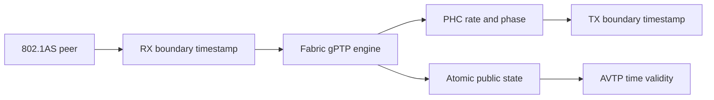

<!-- SPDX-FileCopyrightText: 2026 Kebag Logic -->
<!-- SPDX-License-Identifier: CERN-OHL-W-2.0 -->

# Time synchronization

Three clocks serve different responsibilities.

Only the PHC represents gPTP time.

<!-- milan-feature-status:start -->
| Feature ID | Status | Canonical value |
|---|---|---|
| `crf.media-clock-consumption` | `implemented` | - |
| `gptp.fabric-product-owner` | `implemented` | - |
<!-- milan-feature-status:end -->

## Contents

- **[Clock ownership](#clock-ownership)** — Separate network, processor, and media clocks.
- **[Network-time path](#network-time-path)** — Follow timestamps into PHC discipline.
- **[Media boundary](#media-boundary)** — Distinguish measurement from clock selection.
- **[Presentation validity](#presentation-validity)** — Protect consumers during uncertain time.
- **[Evidence](#evidence)** — Locate executable verification and status.

## Clock ownership

| Clock | Purpose | Current owner |
|---|---|---|
| PHC | Network time in nanoseconds | Fabric gPTP plane |
| Processor timebase | Firmware scheduling | Bare-metal system |
| Media clock | Audio sample timing | INTERNAL or selected CRF lineage |

The clocks never substitute for each other.

The PHC drives AVTP presentation timestamps.

The processor timebase never claims gPTP health.

The media clock controls sample production and consumption.

## Network-time path

- RX timestamps capture accepted tap traffic.
- TX timestamps capture accepted MAC-boundary traffic.
- The engine runs peer delay and synchronization.
- Rate updates steer PHC frequency.
- Phase updates step PHC time.
- Publication commits expose synchronized state atomically.

Read the [fabric-plane contract](GPTP_PLANE.md).

## Media boundary

CRF transport measures remote media timing.

The root consumes stored clock selection since issue #74.

INTERNAL remains the power-on selection.

CRF selection activates the MMCM servo.

The grid aligner follows the physical sample grid.

| Function | Implemented | Product effect |
|---|---|---|
| CRF transmit | Yes | Publishes internal media events |
| CRF receive | Yes | Measures remote phase and rate |
| Clock-source command | Yes | Stores selected descriptor |
| Root clock selection | Yes | Compares against the generated CRF descriptor |
| MMCM servo activation | Conditional | Steers audio clocks under CRF selection |
| Packet-grid alignment | Conditional | Follows the physical sample grid |

A dead TDM feed disengages grid alignment.

The packet grid then free-runs nominally.

Never infer clock recovery from CRF lock alone.

Silicon grid comparison remains open on issue #74.

## Presentation validity

The PHC dates AAF and CRF packets.

AVTP timestamps expose only low nanosecond bits.

That representation wraps every 4.295 seconds.

`tu` therefore carries indispensable health information.

- Streams continue during uncertain time.
- Loss of synchronization raises `tu`.
- Grandmaster changes raise `tu` immediately.
- PHC steps raise `tu` immediately.
- Holdover preserves uncertainty for Milan's minimum interval.

Read [grandmaster recovery](GM_LOSS_RECOVERY.md).

## Evidence

| Concern | Authority | Executable evidence |
|---|---|---|
| PHC arithmetic | `timestamp_counter.sv` | `make -C tb/verilator/ptp` |
| Engine discipline | `gptp-processor/` | `make -C gptp-processor` |
| Parent transport | `KL_gptp_shadow.sv` | `make -C tb/verilator/gptp_shadow` |
| Clock validity | `KL_ptp_clock_validity.sv` | `make -C tb/verilator/clkvalid` |
| Product wiring | `milan_datapath.sv` | `make -C tb/verilator/milan_dp` |
| Grid alignment | `KL_media_grid_align.sv` | `make -C tb/verilator/media_grid_align` |
| Media status | Feature ledger | `python3 scripts/check_feature_status.py` |

Register meanings remain in the [register map](../reference/REGISTER_MAP.md).

Detailed historical measurements remain [archived](../history/v1/design/TIME_SYNC.md).
