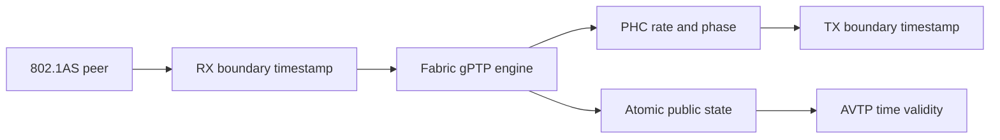
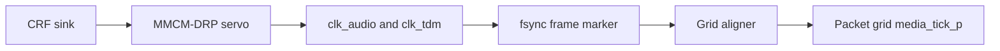

<!-- SPDX-FileCopyrightText: 2026 Kebag Logic -->
<!-- SPDX-License-Identifier: CERN-OHL-W-2.0 -->

# Time synchronization

Three clocks serve different responsibilities.

Only the PHC represents gPTP time.

<!-- milan-feature-status:start -->
| Feature ID | Status | Canonical value |
|---|---|---|
| `crf.media-clock-consumption` | `implemented` | - |
| `gptp.fabric-product-owner` | `implemented` | - |
<!-- milan-feature-status:end -->

## Contents

- **[Clock ownership](#clock-ownership)** -- Separate network, processor, and media clocks.
- **[Network-time path](#network-time-path)** -- Follow corrected timestamps into PHC discipline.
- **[Media boundary](#media-boundary)** -- Distinguish measurement from clock selection.
- **[Presentation validity](#presentation-validity)** -- Protect consumers during uncertain time.
- **[External measurement](#external-measurement)** -- Replace self-reported accuracy with a scope-readable second boundary.
- **[Evidence](#evidence)** -- Locate executable verification and status.

## Clock ownership

| Clock | Purpose | Current owner |
|---|---|---|
| PHC | Network time in nanoseconds | Fabric gPTP plane |
| Processor timebase | Firmware scheduling | Bare-metal system |
| Media clock | Audio sample timing | INTERNAL or selected CRF lineage |

The clocks never substitute for each other.

The PHC drives AVTP presentation timestamps.

The processor timebase never claims gPTP health.

The media clock controls sample production and consumption.

## Network-time path

- RX timestamps capture accepted tap traffic.
- TX timestamps capture the frame's observed launch.
- Each board's own latency correction is applied there (#358).
- Ingress is subtracted; egress is added.
- The fabric plane is their only consumer.
- `PTP_INGRESS_LAT` and `PTP_EGRESS_LAT` stay inert scratch.
- `GPTP_LAT` (`0x7F0`) publishes what is applied.
- Link delay asymmetry is not modelled; it is zero (#511).
- The engine runs peer delay and synchronization.
- Rate updates steer PHC frequency.
- Phase updates step PHC time.
- The [step policy](#step-policy) chooses between them.
- Publication commits expose synchronized state atomically.

A correction's SUM is measured per board. Its split is assigned.

The split moves the synchronized offset, never the peer delay.

Read the [fabric-plane contract](GPTP_PLANE.md).

### Step policy

The fabric plane either steps or slews the PHC.

This page is the parent's one record of that rule.

The offset is local time minus grandmaster time.

| Servo state | Which Sync pair | Slews up to | Steps above |
|---|---|---|---|
| Link-up | The first pair after asCapable rises | 20 us | 20 us |
| Locked | Every later pair | 100 us | 100 us |

- Every reset clears asCapable, so it re-arms link-up.
- Nothing else re-arms link-up.
- A grandmaster change keeps the servo locked.
- So does a 375 ms Sync receipt timeout.
- So does a return from grandmaster duty.
- The written rate trim never exceeds 200 ppm.
- That trim is proportional plus integral; both share the bound.
- The plane's microcode clamps the trim to that bound.
- `KL_gptp_txret` computes the same bound as `PHC_ADJ_MAX_C`.
- It refuses egress timestamps while the trim exceeds it.
- A 100 us slew takes 0.5 s or more.
- One step is one `phc_step_we_o` pulse.
- That pulse carries the measured offset, negated.
- Each step is one counted [media event](GM_LOSS_RECOVERY.md#media-re-base-on-a-phc-step).

| Source | Record |
|---|---|
| Owner decision, 2026-09-23 | [#387](https://github.com/kebag-logic/milan-fpga/issues/387#issuecomment-5794731090) |
| Link-up ruling | [FPGA-gPTP #68](https://github.com/Mister-M-alt/FPGA-gPTP/issues/68#issuecomment-5798089412) |
| Engine contract | [`INTEGRATION.md`](https://github.com/Mister-M-alt/FPGA-gPTP/blob/e5dcea6e351abff18a27a00f8e345f3251bdbd8f/docs/INTEGRATION.md#step-versus-slew-policy) |

## Media boundary

CRF transport measures remote media timing.

The root consumes stored clock selection since issue #74.

Only two sources are advertised since issue #389.

They are INTERNAL and the CRF sink.

An AAF listener carries no CLOCK_SOURCE, because nothing follows one.

INTERNAL remains the power-on selection.

CRF selection activates the MMCM servo.

The grid aligner follows the physical sample grid.

Each link has exactly one master.

| Loop fact | Value | RTL |
|---|---|---|
| Physical sample grid | `100 MHz * 391/1591 / 512` = 47,999.4893 Hz | `KL_tdm_capture_master` frame divider after the `milan_soc.py` PLAN A MMCM |
| Packet grid | 48,000.0000 Hz free-running | `KL_media_nco` |
| Free-running offset | -10.64 ppm; one sample slips every 1.9582 s | `KL_chan_map_capture` dup/skip counters, readable at `SLIP_LB`/`SLIP_TDM` (`0x8D4`/`0x8D8`) |
| MMCM servo error | Differential rate, ns per 512 ms window | `KL_mmcm_drp_servo` |
| MMCM servo command | PI; 1/16 ppm per LSB; positive speeds up | `KL_mmcm_drp_servo`, `MCSRV_STAT[31:16]` |
| MMCM servo bounds | +/-100 ppm per window slew; +/-200 ppm authority | `KL_mmcm_drp_servo` |
| CRF unlock | Trim held in HOLDOVER | `KL_mmcm_drp_servo` |
| MMCM servo on a PHC step | The window the step lands in is discarded; trim and integrator held (#539). A [step-policy](#step-policy) slew is not a step and still reaches the integrator (#545) | `KL_mmcm_drp_servo`, `MCSRV_STAT[15:10]` |
| MMCM servo on an implausible window | Error above 1024 ppm discarded; four in a row re-base the window | `KL_mmcm_drp_servo`, `MCSRV_STAT[15:10]` |
| Grid-aligner error | Frame-marker phase at one-clock resolution | `KL_media_grid_align` |
| Grid-aligner command | PI in servo units; +/-200 ppm authority | `KL_media_grid_align` |
| Grid-aligner lock target | Engagement phase, kept 1/128 sample off the tick | `KL_media_grid_align` |

| Function | Implemented | Product effect |
|---|---|---|
| CRF transmit | Yes | Publishes internal media events |
| CRF receive | Yes | Measures remote phase and rate |
| Clock-source command | Yes | Stores a listed descriptor; refuses an unlisted index with `BAD_ARGUMENTS` |
| Root clock selection | Yes | Compares against the generated CRF descriptor |
| INTERNAL selection | Yes | Free-running media clock, the power-on state |
| CRF selection | Yes | Drives the media clock through the servo and the aligner |
| Stream-derived recovery | No | Not advertised: no INPUT_STREAM source on an AAF listener (#389) |
| MMCM servo activation | Conditional | Steers audio clocks under CRF selection |
| Packet-grid alignment | Conditional | Follows the physical sample grid |

A dead TDM feed disengages grid alignment.

The packet grid then free-runs nominally.

Never infer clock recovery from CRF lock alone.

Silicon grid comparison remains open on issue #74.

### Listener render latency

The render path holds one constant latency (#386).

`KL_render_setpoint` queues whole media events per stream.

It pops one event per stream per media tick.

The crossbar's input grid is the reference point.

The constant is independent of the audio interface.

| Law term | Value | Derivation |
|---|---|---|
| Events per PDU | 6 | class A at 48 kHz: `AAF_SPF_C`, read, never copied |
| Allowance | 2 events | one tick of accept phase, one of verdict plus drain |
| Setpoint | 8 events = 166.67 us | fill just before every PDU push |
| Shipping samples | 64 | 8 events of 8 channels; 16 on a stereo lane |
| First-event delay | (8, 9] media ticks after accept | the accept phase is the only jitter |
| Event k of a PDU | k ticks after event 0 | the talker's packetization |
| Convergence band | +/-3 events at PDU ends, 100 ms | half a PDU |
| Reset rail | +/-6 events at PDU ends | one PDU: a PDU one interval late never trips it; later than that trips the low rail |
| Prefill | snap to setpoint + 6 at a PDU end | one bounded gap, no repeat storm |
| Recentre | a PHC step (the plane's step, or CLKV adjtime with the plane off), a PHC settime, a settled clock-source change; a GM identity change alone is no trigger since #387 | once, at the next PDU end; a step is also one `mr` toggle ([media re-base](GM_LOSS_RECOVERY.md#media-re-base-on-a-phc-step)) |
| Clock-source settle | under CRF: the aligner engaged with its error inside 1/64 sample for 2048 ticks (43 ms), or engaged for 32768 ticks; at INTERNAL: 2048 ticks after the change | `milan_datapath` arms one recentre per change; repeated selections re-arm, never queue |
| Pop | one event per stream per tick, decided at the stream's first beat | a rail, a recentre or a flush inside the pop window lands between events, never inside one |
| Crossbar channel view | 2 x ceil(N_CH_P / 2) lanes per stream (8 on every in-tree shape) | the pad lane of an odd count is a virtual channel, never a wrap onto channel 0 |
| Wire channel count change | the stream is flushed and re-prefilled | its queued rows carry the old lane layout |

Under INTERNAL the grids free-run.

The rail then re-centres every 11.75 s.
That is six events at the -10.64 ppm offset.

It assumes a talker on the board's physical grid.
Another talker's rate error sets its own period.

Under CRF the grids align and no rail fires.

| Interface after the grid | Fixed delay | Shipped |
|---|---|---|
| Crossbar `phys_smp_o` | streams x 4 + 2 axis cycles: 6 at one stream, 18 at four, 34 at eight. Convert at the shape's own axis clock: 6 cycles are 60 ns at 100 MHz and 120 ns on the AX7101, whose `milan` domain is 50 MHz | every shape; the reference the rows below add to |
| I2S DAC (the Arty shapes: `I2SPB_P = 1`, the DAC crossbar-fed) | + `KL_i2s_playback`: 16 pairs = 16 frames (333 us; `SETPOINT_P` counts pairs, its comment says samples) + 1 serializer frame; accept to DAC = 8 ticks + the accept phase + 17 frames = 25 to 26 frames (521 to 542 us) | the one clocked listener interface in tree; two setpoint stages in series, each constant |
| TDM8 frame pin, slot k | + the bank walk and frame commit, MEASURED at 9 axis cycles, which is 180 ns on the shipping AX7101 (its `milan` axis clock is 50 MHz) and 90 ns on the leg's 100 MHz model axis clock, + the adopt wait `phi`, + (32k + 1) bit periods at 12.288 MHz (81.4 ns each, so slot k adds 2.6042 us and 8 slots make one 20.834 us frame). `phi` covers the frame CDC and the wait for the next serial frame start: one axis cycle plus serial-domain time, MEASURED at 0.219 to 21.049 us on the model axis clock and therefore 0.229 to 21.059 us as shipped. It is held constant per slot under CRF by #74's aligner, walks at `+10.6844` ppm at INTERNAL and steps by exactly one frame once per 1.958 s beat. That sign is the MEASURED one, the same the walk table below and the [channel map](../CHANNEL_MAP_64.md) carry: the instrument divides `(phi_last - phi_first)` by the elapsed time, so a positive walk is a LENGTHENING wait. It is not the audio clock's own free-running offset, which the loop table above states separately as -10.64 ppm; the two are different quantities | SHIPPED on the AX7101 1x1 TDM8 shape (#447): `KL_tdm_render_master` on `tdm.dout`, scheduled from the capture master's exported bit-clock enables. Every term above is measured by `make -C tb/verilator/milan_dp_render tdm8render`, not modelled. Silicon measurement of this path stays with #386 acceptance 4 and #117 |

That row once charged a frame AND a tick-to-fsync phase. No separate
deterministic frame exists.

The adopt wait IS that phase. It is one measured term.

Which clock a term belongs to decides its nanoseconds. Serial terms are
absolute: the audio clock ships unchanged.

Axis-cycle terms are not. The leg models 100 MHz; `milan` ships at 50.

Every term above is measured, not modelled.

- The frame commit strobe is timestamped in `axis_clk`.
- The crossbar's valid pulse is timestamped beside it.
- An independent pin decoder timestamps each slot's MSB edge.
- Drop-oldest accounting names the commit behind each frame.
- The bank walk measured 9 axis cycles over 840 pairs.
- Slot 0 measured 0.300 to 21.130 us.
- Both of those are on the model axis clock.
- That window covered 838 decoded frames.
- Its spread stayed inside one serial frame.

Recipe: the shipping shape, `AUDIO_IF_RENDER_SLOTS_P = 8`. Clocks: the true
391/1591 plan, gPTP plane off.

The `phi` walk is measured on both sources. One run, one instrument, one live
selection.

The command is a real `SET_CLOCK_SOURCE` on `CLOCK_DOMAIN` 0.

| Selected source | `phi` walk, measured | Closed form |
|---|---|---|
| INTERNAL | `+10.6844` ppm over 3.74 M axis cycles | `+10.6394` ppm, the divider plan |
| CRF, aligner engaged | `-0.8009` ppm over 3.75 M axis cycles | zero, the aligner holding both grids |

A walk divides two intervals of one clock. The rate is rate-free; the window
is model-clock time.

The sign is `phi`'s own. Commits arrive one media tick apart.

Frames start one serial frame apart. The wait lengthens by their difference.

The settled-grid trigger fires once across the transition. The stage
re-centres once.

The fill at accept stays the setpoint. Every first event stays inside the law
band.

The deselect back to INTERNAL is the same.

Software reads no delay register: the constants are this table.

`I2SPB_TRIM[15:0]` (0x6E0) shows the I2S element's live fill.

`RENDER_STAT` (`0x8DC`, #443) exposes the selected listener's fill.

It also carries prefill, convergence and the global rail count.

The [register map](../reference/REGISTER_MAP.md#0x8dc-----render-setpoint-state) defines selection and field widths.

An absent stage reads **STRUCTURAL ZERO**, never measured health.

Rail and underrun events do not raise `STREAM_INTERRUPTED`.

On the Arty shapes the DAC is crossbar-fed.
The I2S path therefore renders behind this stage.

Its delay grew by the setpoint, 8 media ticks.
It stays constant: two setpoint stages in series.

Its silicon figure predates the stage (matrix rows).
A re-measurement rides the #117 bench.

The I2S element's own recentre re-bases its producer FIFO.
Its CDC FIFO stays full: up to 16 frames more.

A clock-source change arms one recentre.
It fires once the grid has settled (table above).

The `milan_dp` leg selects CRF under a running stream.
One recentre fires; every PDU returns to the setpoint.

Digital proof: `tb/verilator/render_setpoint` and the `milan_dp` true-ratio leg.

Silicon proof at the TDM frame pin rides #117.

## Presentation validity

The PHC dates AAF and CRF packets.

AVTP timestamps expose only low nanosecond bits.

That representation wraps every 4.295 seconds.

`tu` therefore carries indispensable health information.

| Counter | Condition | RTL |
|---|---|---|
| `ts_delta` | `avtp_timestamp - ptp_now` at each accepted PDU | `KL_avtp_rx_monitor` |
| LATE | `ts_delta < 0` | `KL_avtp_rx_monitor` |
| EARLY | `ts_delta > offset + 10 ms` | `KL_avtp_rx_monitor`, `EARLY_MARGIN_NS_C` |

`AVTPRX_TSD` (`0x6EC`) exposes the last `ts_delta`.

- Streams continue during uncertain time.
- Loss of synchronization raises `tu`.
- Grandmaster changes raise `tu` immediately.
- PHC steps raise `tu` immediately.
- Holdover preserves uncertainty for Milan's minimum interval.

Read [grandmaster recovery](GM_LOSS_RECOVERY.md).

## External measurement

Every accuracy statement above is internal.

The device reads its own offset and grades itself.

A systematic error stays invisible while every gate stays green.

The PPS output closes that gap (issue #260).

It is one comparator: `hit = (phc_ns >= target)`.

It lives in the PHC's own clock domain.

One rising edge per PHC second reaches a pin.

A scope then reads this board against an external reference.

It is deliberately not an engine product.

The gPTP engine is microcoded and event-queued.

Anything it emitted would carry dispatch latency.

That is microseconds of jitter, which is not a PPS.

At the counter the edge is deterministic to one tick.

The target advances by exactly 1 000 000 000 nanoseconds.

It never re-arms from the current time.

The error therefore does not accumulate.

Each edge lands within one counter increment of its boundary.

That bound is measured at the compare's own sample.

The pin is one register stage after it.

The pad adds one more clock period.

That offset is fixed and calibrates out.

One edge's residue is never carried into the next.

`PTP_PPS_RD_{LO,HI}` publishes the live target.

Software watches the grid advance rather than assuming it.

Two gates stay deliberately separate.

`PPS_P` decides whether the logic exists at all.

It is off by default.

Building it costs +118 LUT and +83 FF, measured OOC.

`PTP_PPS_CTRL[0]` decides whether a built comparator fires.

`PTP_PPS_CTRL[16]` says which of the two a silent pin is.

The pin and the build flag are in [BUILDING.md](../integration/BUILDING.md).

The registers are in the [register map](../reference/REGISTER_MAP.md).

The bench proof against a reference is not yet taken.

## Evidence

| Concern | Authority | Executable evidence |
|---|---|---|
| PHC arithmetic | `timestamp_counter.sv` | `make -C tb/verilator/ptp` |
| PPS grid and alignment | `timestamp_counter.sv` (`PPS_P`) | `make -C tb/verilator/ptp` |
| Engine discipline | `gptp-processor/` | `make -C gptp-processor` |
| Parent transport | `KL_gptp_shadow.sv` | `make -C tb/verilator/gptp_shadow` |
| Clock validity | `KL_ptp_clock_validity.sv` | `make -C tb/verilator/clkvalid` |
| Product wiring | `milan_datapath.sv` | `make -C tb/verilator/milan_dp` |
| Grid alignment | `KL_media_grid_align.sv` | `make -C tb/verilator/media_grid_align` |
| Media status | Feature ledger | `python3 scripts/check_feature_status.py` |

Register meanings remain in the [register map](../reference/REGISTER_MAP.md).

Detailed historical measurements remain [archived](../history/v1/design/TIME_SYNC.md).
