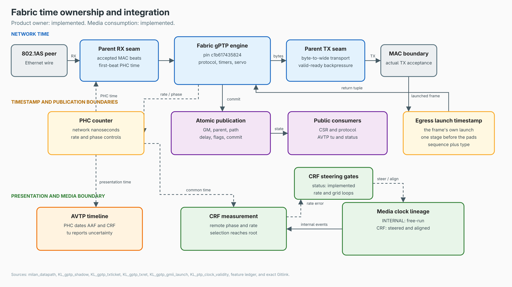
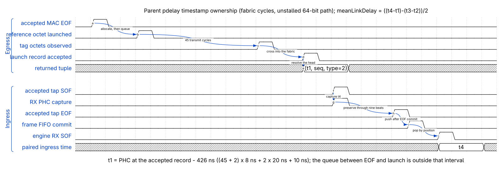

<!--
SPDX-FileCopyrightText: 2026 Kebag Logic
SPDX-License-Identifier: CERN-OHL-W-2.0
-->

# Time synchronization — gPTP, the PHC, and the media clock

How time works in this system, top to bottom: what 802.1AS (gPTP) gives us,
where hardware timestamps are made and how the default fabric engine consumes
them, and how media clock recovery is designed. The current root does not consume the exported
clock-source selection, so its audio clock remains INTERNAL. Register offsets follow
[`../reference/REGISTER_MAP.md`](../reference/REGISTER_MAP.md) (the CSR ABI
authority); status claims carry their in-repo evidence. Written 2026-07-25.

Update at VERSION `0x0002_0055` (2026-08-20): `KL_gptp_shadow` now owns BMCA,
pdelay, servo and publication by default. The linuxptp path described in the
historical measurements below is retained only by explicit
`--no-fabric-gptp`; see [GPTP_PLANE.md](GPTP_PLANE.md) for the current seams.

Current command, clock-consumption, and notification claims are checked against
the [Milan feature status ledger](../reference/MILAN_FEATURE_STATUS.md):

<!-- milan-feature-status:start -->
| Feature ID | Status | Canonical value |
|---|---|---|
| `aem.served-command-set` | `implemented` | - |
| `crf.media-clock-consumption` | `missing` | - |
| `notifications.change-events` | `partial` | - |
<!-- milan-feature-status:end -->

> The picture above is generated (editable
> [timesync_chain.drawio](../diagrams/timesync_chain.drawio); regenerate with
> `python3 docs/diagrams/timesync_chain.gen.py docs/diagrams/timesync_chain &&
> rsvg-convert -w 2000 docs/diagrams/timesync_chain.svg -o
> docs/diagrams/timesync_chain.png`).

## Contents

- **[1. Concept -- the three clocks](#1-concept----the-three-clocks)** -- Distinguishes the gPTP-disciplined PHC, Linux `CLOCK_REALTIME`, and the physical audio clock, then records that the shipping audio source remains INTERNAL.
- **[2. Mechanism -- the hardware timestamp path](#2-mechanism----the-hardware-timestamp-path)** -- Follows the fractional-nanosecond counter, RX and TX timestamp points, CDC transport, DMA records, and latency corrections from the MAC boundary to software.
- **[3. The media clock](#3-the-media-clock)** -- How a shared nanosecond timeline is intended to become a 48 kHz sample edge, the inactive PI servo design, and the missing root selection that keeps the shipping clock INTERNAL. The section also records the master-role error budget and measured historical loop behavior.
- **[4. Time-related CSRs -- quick table](#4-time-related-csrs----quick-table)** -- Lists every time and media-clock register from the PHC controls through CRF measurements, latency taps, and the inactive servo status.
- **[4a. Centered-FIFO regulation goal (USER 2026-08-07): +/- 125 us](#4a-centered-fifo-regulation-goal-user-2026-08-07---125-us)** -- The standing regulation target: the DAC elasticity FIFO stays centered and its wander holds within one class-A frame period (+/-6 pairs), earned by clock quality rather than buffer depth
- **[4b. Grandmaster loss and recovery](#4b-grandmaster-loss-and-recovery)** -- Pointer to [GM_LOSS_RECOVERY.md](GM_LOSS_RECOVERY.md), the transient story: what a GM hand-off costs at each layer and why it is now one MEDIA_RESET click + ~100 ms with the lock held
- **[5. Status (2026-07-25)](#5-status-2026-07-25)** -- Claim-by-claim, each with its evidence: peer delay 600 µs on software stamps → 1.3 µs on hardware, CRF board-to-board locked at +6.7 ppm, -83.9 dB loop THD+N at the converter floor. Then the honest half by row id -- no per-unit latency calibration exists, the BMCA recreation is blocked by a switch that outranks every Milan-legal value, and `PTP_INGRESS_LAT`/`PTP_EGRESS_LAT` are mapped but their fabric wires unconsumed. The doc-drift bullet this section used to carry is closed.

## 1. Concept -- the three clocks

gPTP gives every device on the AVB segment one shared nanosecond timeline.
One node is elected grandmaster (GM); everyone else measures its link delay to
its neighbor (pdelay) and steers a local hardware clock until the shared
timeline agrees to nanoseconds. Milan requires this (it is what makes
presentation times meaningful), and everything below the protocol runs in our
fabric.

Three clocks exist on each board, chained in one direction:

1. **The network clock — the PHC** (PTP Hardware Clock). A 64-bit
   nanosecond counter in the fabric
   ([`hdl/ieee8021as/ptp_timestamp/timestamp_counter.sv`](../../hdl/ieee8021as/ptp_timestamp/timestamp_counter.sv)). This is the clock
   gPTP disciplines and the clock every hardware timestamp is drawn from.
   When the board is GM, the PHC free-runs and everyone else follows it.
2. **The system clock** — Linux `CLOCK_REALTIME` in retained Linux profiles.
   Option-off builds may mirror the PHC into it with `phc2sys`; the shipping
   bare-metal product has no system-clock consumer. Nothing in the media path
   depends on it.
3. **The media clock:** the 24.576 MHz audio MMCM output, divided to the
   48 kHz sample grid that the I2S/TDM front-ends run on. It is a *physical*
   clock (a DAC cannot consume "nanoseconds"), so it cannot be written like
   the PHC. The recovery hardware can steer it from CRF timestamps, but the
   shipping root pins the source to INTERNAL and leaves both servo actuators
   disabled (section 3).

The current chain, in one sentence: gPTP disciplines the PHC and timestamps
frames, while the audio MMCM remains an independent internal clock. Consuming
the exported clock-source selection is required before CRF can steer it.

## 2. Mechanism -- the hardware timestamp path

### 2.1 The PHC counter and its CSR group (0x500)

`timestamp_counter.sv` is a fractional-nanosecond phase accumulator
`{ns[63:0], frac[23:0]}`. Each tick adds `PTP_INCR + PTP_ADJ`, both Q8.24
nanoseconds, which gives software the full linuxptp clock-ops set
(REQ-PTP-01..04):

* **rate** (`adjfine`): `PTP_ADJ` (0x508) is a signed per-tick addend;
* **settime**: `PTP_TOD_WR_*` + `PTP_CMD[0]` loads an absolute time;
* **adjtime**: `PTP_OFFSET_*` + `PTP_CMD[1]` adds a signed delta once;
* **gettime**: `PTP_CMD[2]` latches a snapshot into `PTP_TOD_RD_*`
  (64-bit reads on the 32-bit bus are not atomic — the snapshot latch is the
  coherent-read mechanism, [`../reference/REGISTER_MAP.md`](../reference/REGISTER_MAP.md)
  "Notes").

The CSR plane and the PHC live in different clock domains;
`ptp_csr_sync.sv` carries values plus toggle-synchronized apply strobes
across (REQ-CSR-03).

On the fully-FPGA LiteX SoCs the PHC clock (`gtx_clk`) is tied to the
datapath clock ([`sw/litex/milan_soc.py`](../../sw/litex/milan_soc.py), the
`i_gtx_clk = ClockSignal(milan_cd)` instantiation) — 50 MHz on the Arty and
shipping bare-metal AX7101, 100 MHz on the AX7101 Linux bring-up shape — and
`PTP_INCR` carries the matching ns-per-tick. Since the t532
wire-scale audit its RESET value is DERIVED from the instantiator's
`MILAN_CLK_FREQ_HZ` (Q8.24 of the true clock period: 10.0 ns at 100 MHz,
20.0 ns at 50 MHz; the standalone milan_csr default keeps the historic
125 MHz / 8.0 ns contract, REQ-PTP-07) — a free-run PHC ticks true
nanoseconds on every shape without waiting for software.

The tie also satisfies the timestamping core's one hard requirement:
`ts_in` synchronous to the AXIS domain (`ptp_ts_core.sv` header,
2026-07-13 redesign note).

### 2.2 Where frames get stamped

`ptp_ts_top.sv` sits in-line in `milan_datapath.sv`: the TX tap between the
CBS shaper and the TX arbiter to the MAC, the RX tap directly after MAC
ingress, before the destination-MAC filter (instance `ptp_timestamp`,
streams `tx_axis_shaper_to_ts -> tx_axis_dp_to_arb` and
`rx_axis_to_ts -> rx_axis_ptp_to_filt`). Both taps are pure pass-throughs —
they never stall a frame. Per direction, `ptp_ts_core.sv`:

* latches the live PHC value at the frame's **first beat** (SOP);
* parses ethertype (`0x88F7`), PTP `messageType` and `sequenceId` at their
  fixed untagged-gPTP offsets;
* **qualifies at TLAST**: ethertype match AND an **event** message
  (`msgType[3] == 0` — Sync, Delay_Req, Pdelay_Req, Pdelay_Resp). General
  messages (Announce, Follow_Up, Signaling) are never recorded — stamping
  them would only burn record slots and invite seq collisions
  ([`../traceability/ieee8021as.md`](../traceability/ieee8021as.md) row AS-5).

Qualify-at-TLAST is the load-bearing part. The original core decided the
record when a timestamp CDC handshake returned, which raced the ingress beat
rate both ways — first record never emitted on slow MII beats, stale
one-frame-late pairing after, records lost on fast back-to-back frames.

The full root cause, the synchronous redesign, and the netlist-forensics
fallout (LUTRAM-inferred record queues mis-wired by the cross-hierarchy
optimizer, rebuilt as explicit flops) are recorded in
[`../findings/PTP_TS_METADATA_FIX.md`](../findings/PTP_TS_METADATA_FIX.md).

Both exchanges, as this design stamps them:

> Generated chronogram (master
> [wd_gptp_pdelay.json](../diagrams/wd_gptp_pdelay.json); regenerate with
> `~/litex-milan/venv/bin/python3 scripts/gen_wavedrom.py
> docs/diagrams/wd_gptp_pdelay.json`). Each tap's `ptp_ts_core` latches the
> PHC at SOP and qualifies the record at TLAST (event messages only), so
> `t1`/`t4` come from hardware records while the peer's `t2`/`t3` arrive
> inside `Pdelay_Resp`/`Pdelay_Resp_Follow_Up`; `ptp4l` computes
> `meanLinkDelay = ((t4 - t1) - (t3 - t2)) / 2` (802.1AS 11.2.19) and the
> result is published at CSR 0x6E4 (section 4). Cadences per
> [`../traceability/ieee8021as.md`](../traceability/ieee8021as.md) rows
> AS-7/AS-8: pdelay 1/s, Sync+Follow_Up 8/s.

### 2.3 How stamps reach the driver — the record contract

Each qualified frame emits a two-beat, 16-byte metadata record
(`ptp_ts_core.sv` output FSM; contract v2.1 in
[`../findings/PTP_TS_METADATA_FIX.md`](../findings/PTP_TS_METADATA_FIX.md)):

| beat | content |
|------|---------|
| 0 | `ns[63:0]` — the disciplined PHC value at SOP (same epoch as `/dev/ptp0`) |
| 1 | `{40'0, seq[15:0], msgType[3:0], 2'0, marker=1, dir}` — `seq` is the frame's big-endian sequenceId verbatim (no byte swap anywhere), `dir` 0=RX 1=TX |

The always-1 **marker** (bit 1) is the driver's race-free slot sentinel: DMA
lands word 0 before word 1, so "marker set" proves the timestamp word is
complete.

TX and RX records pass per-direction 16-deep `axis_fifo`s, a
round-robin mux, and a final FIFO (`ptp_ts_top.sv`), then the **dma-ts**
engine (a LiteX simple-mode DMA writer in loop mode, register block in
[`../reference/REGISTER_MAP.md`](../reference/REGISTER_MAP.md) "DMA
registers"; its absolute address is build-generated — `build/csr.csv` is the
authority, stale device trees have burned three generations of addresses)
writes them into a coherent DRAM ring.

`tlast` is deliberately **not** forwarded to the DMA writer — forwarded,
LiteX treated every record as end-of-transfer and each record overwrote
slot 0 (the "lossy mailbox", found on silicon).

The kl-eth driver (the-private-test-repo) drains the ring: TX records
complete the one pending timestamp-requested skb via `skb_tstamp_tx`
(`SO_TIMESTAMPING`), RX records ride a small wire-order FIFO matched by
order with `seq` as the consistency check.

`o_tx_ts_ready` pulses `IRQ_STATUS[0]` (0x010) at core emission — which
precedes the DMA landing by microseconds, so the driver pairs the IRQ drain
with a NAPI-poll fallback and `ptp4l` runs `tx_timestamp_timeout` raised
well above default (500 on the current images,
[`../findings/BENCH_TOPOLOGY.md`](../findings/BENCH_TOPOLOGY.md)
section 8).

One RX-path prerequisite is easy to forget: gPTP frames must arrive
*unpadded*. The RX DMA originally reported 8-byte-rounded lengths and `ptp4l`
rejected every pdelay_req as a bad message (trailing zeros parse as a bogus
TLV). Root cause and the true-length gateware fix:
[`../findings/GPTP_RXPAD_ROOTCAUSE.md`](../findings/GPTP_RXPAD_ROOTCAUSE.md).

### 2.4 The ingress/egress latency constants

The taps stamp at the MAC-side AXIS boundary, not at the wire (802.1AS
8.4.3's "reference plane"), so each board carries a constant correction in
its `ptp4l` config.

The values are **tap-measured** (ProfiShark, inline):
**ingressLatency 3511 ns on the Arty, 1490 ns on the AX7101, egressLatency
0**, provisioned by `S50milan` at boot
([`../findings/BENCH_TOPOLOGY.md`](../findings/BENCH_TOPOLOGY.md) section 8;
[current Milan audit](../testing/MILAN_V12_AUDIT_2026-08-16.md)).

Uncompensated, the late RX stamps kept `asCapable` permanently false — the
single biggest gPTP field bug of this project
([`../traceability/ieee8021as.md`](../traceability/ieee8021as.md) row AS-3).

Two honest caveats, tracked as traceability rows: the constants are
bench-calibrated per board *type*, with no per-unit calibration procedure,
and the ingress/egress split was never measured separately — only the sum
(row AS-4, MISSING). The fabric does expose `PTP_INGRESS_LAT`/`PTP_EGRESS_LAT`
CSRs (0x540/0x544) for a future in-fabric correction, but today the exported
wires terminate unused in `milan_datapath.sv` — the compensation lives
entirely in the `ptp4l` config.

### 2.5 Who runs where

The default split since VERSION `0x0002_0055` follows the current architecture
([`../overview/ARCHITECTURE.md`](../overview/ARCHITECTURE.md);
[`../traceability/ieee8021as.md`](../traceability/ieee8021as.md) header):
**protocol and time actuation in fabric; software observes or provides the
explicit comparison plane.**

| Agent | Where | Job |
|-------|-------|-----|
| `timestamp_counter` + `ptp_csr_sync` | fabric | the PHC: rate/offset/absolute set, snapshot reads |
| `ptp_ts_top` / `ptp_ts_core` | fabric | per-frame event-message timestamps, both directions |
| `KL_gptp_shadow` + `gptp-processor` | fabric (default) | BMCA, Announce/Sync/Pdelay, PHC servo and the committed GM/parent/pdelay/sync/asCapable publication bank |
| dma-ts ring + kl-eth | fabric + driver | records to DRAM; `/dev/ptp0` clock ops; `SO_TIMESTAMPING` |
| `ptp4l` + `phc2sys` | softcore, explicit option-off | comparison BMCA/servo and PHC -> `CLOCK_REALTIME` mirror |
| `gptp2csr.sh` | softcore daemon, explicit option-off | publishes gPTP state into fabric CSRs: GM id 0x624/0x628 (the LOCAL clock id when we are GM), measured pdelay 0x6E4, AS_PATH parent bridge 0x730/0x734 from `PARENT_DATA_SET` — so ADP answers with wire truth (the AEM half of that
sentence is retired: the entity model is now a static descriptor image in DRAM
and no daemon writes into it) ([`../findings/BENCH_TOPOLOGY.md`](../findings/BENCH_TOPOLOGY.md) section 8) — **and since 2026-07-28 leases the AVTP `tu` sync claim into `CLKV_CTRL` 0x778**, because whether the PHC is disciplined is a servo fact no fabric signal can observe. It is a *lease*, renewed every loop and expiring by itself, so a claim cannot outlive the daemon that made it. Until this existed both boards emitted `tu = 1` on every AAF and CRF frame from boot while genuinely synchronised — see [`../reference/REGISTER_MAP.md`](../reference/REGISTER_MAP.md) `0x778` |
| `stream_phc_sync.sh` | softcore daemon | media/PHC watchdog; dormant while `ptp4l` holds SLAVE or MASTER |

In the default arm the fabric builds and consumes the PTP messages itself. In
the comparison arm `ptp4l` still never sees a raw timestamp race — the DMA
metadata path guarantees exact pairing by construction.

## 3. The media clock

### 3.1 The audio MMCM — a clean, integer-derived 24.576 MHz

Sample clocks are made from a dedicated MMCM, not from logic dividers of the
datapath clock: fractional-N edge jitter on MCLK measurably wrecked the
converters (analog THD+N collapsed to -4.5 dB; history in
[`hdl/ieee1722/aaf/KL_i2s_playback.sv`](../../hdl/ieee1722/aaf/KL_i2s_playback.sv)'s header).

The chain is two-stage and **integer-only** ([`sw/litex/milan_soc.py`](../../sw/litex/milan_soc.py),
`_CRG`). Two plans exist, selected by `audio_tdm_hz`:

* **Plan A (default, I2S shapes):** 100 MHz -> PLL /2 x23 /37 ->
  31.081081 MHz -> MMCM x34 /43 -> **24.575739 MHz = 24.576 MHz
  -10.64 ppm**.
* **Plan B (TDM-master shapes — the shipping Arty 4x4):** 100 MHz ->
  PLL /2 x23 /67 -> 17.164179 MHz -> MMCM x63 (VCO 1081.343 MHz) ->
  CLKOUT0 /44 -> **24.575984 MHz = -0.66 ppm**, with CLKOUT1 /44 /22 /11
  serving the TDM bit-clock family off the same VCO. The re-derivation
  *improved* the base error (44 divides the new VCO where odd 43 could
  never yield an integer 2x/4x sibling).

Integer dividers are a servo prerequisite: UG472 forbids fractional divide
in fine-phase-shift mode, and the best single-stage integer alternative
lands -186 ppm, beyond the servo's trim budget
([current Milan audit](../testing/MILAN_V12_AUDIT_2026-08-16.md)).

`/512` of this clock is the 48 kHz sample grid; I2S (`MCLK/SCLK/LRCK`) and
TDM front-ends are plain registered dividers of it.

### 3.1.1 How exact is 24.576 MHz? — the master-role error budget

"Exactly 24.576 MHz" is only a meaningful demand in the **slave** role,
where the MMCM-DRP servo must converge on someone else's recovered media
clock. When this end-station is the media-clock **master**, its oscillator
*defines* the timebase — every listener (an input-stream clock domain at
the far end, or our own servo when roles are reversed) tracks whatever
cadence we actually produce. The requirement then relaxes to three weaker
ones: stay inside the nominal-rate tolerance a conformant listener must
capture (±100 ppm class), timestamp honestly (AVTP timestamps and the CRF
grid describe the *real* cadence in gPTP time -- Section 3.2's "the wire carries
the actual audio-MMCM rate"), and stay internally consistent (bclk,
packetizer pacing and timestamping all derive from the one physical
clock).

The actual static error, master role, worst case:

| Contribution | Plan A (I2S) | Plan B (TDM-master) |
|---|---|---|
| Divider-plan synthesis (deterministic) | -10.64 ppm | -0.66 ppm |
| 100 MHz board oscillator (physical, dominant) | +-50 ppm class | +-50 ppm class |
| **Total vs a perfect lab reference** | **~ +-60 ppm** | **~ +-51 ppm** |

At 48 kHz, +-51 ppm is +-2.4 Hz — about 2.4 samples/second of drift
against a perfect reference, invisible to every listener because they
servo on our honest timestamps rather than on nominal 48 kHz. The
synthesis share alone is -0.032 Hz (Plan B). Margins: the total sits well
inside the +-100 ppm capture range a receive servo must handle, and our
own servo's sustained-slew ceiling is provisioned at 254 ppm (Plan B;
260 ppm Plan A) precisely to cover the synthesis base plus a remote
talker's +-100 ppm with >2x margin. MMCM jitter is zero-mean and does not
move the average rate — it is a THD+N concern (the `BANDWIDTH=LOW`
cascade-filter note in `_CRG`), not a rate error.

The boundary between benign and broken is written in this repo's own
history: the audio-pumping defect was a talker at 48,828.125 Hz — a bad
fractional-N derivation ~1.7 % (17,000 ppm) off, far outside any servo's
capture range. Small-ppm inexactness as master is fine *by design*;
wrong-divider inexactness is a defect in any role.

### 3.2 CRF out — `KL_crf_tx`, the media-clock talker

[`hdl/ieee1722/crf/KL_crf_tx.sv`](../../hdl/ieee1722/crf/KL_crf_tx.sv) emits the Milan CRF Media Clock Stream
(Milan v1.2 7.3.1 / IEEE 1722-2016 Clause 10): subtype 4, type
CRF_AUDIO_SAMPLE, pull 0, base_frequency 48000, one 64-bit timestamp per
PDU, timestamp_interval 96 — one PDU per 96 sample events = 500 PDU/s.

The timestamp grid is the **real media clock**: an own `/512` divider of
`clk_audio` counts sample ticks, and every 96th event crosses into the
datapath domain where the live PHC value is latched as that event's gPTP
time. The wire therefore carries the actual audio-MMCM rate as the PHC sees
it — not a synthetic 2 ms accumulator.

Milan applies the stream **presentation time offset to CRF exactly as to
media streams**: every emitted timestamp is `event gPTP time + transit_ns`,
from the same offset source as the AAF framer (SET_STREAM_INFO
accumulated-latency field; reset 2 ms) — see the `transit_ns_i` wiring in
[`hdl/milan/milan_datapath.sv`](../../hdl/milan/milan_datapath.sv).

A PDU that would collide with a busy serializer is skipped whole, so emitted
timestamps stay truthful and only the cadence stretches. The stream leaves
untagged on the low-rate control lane until a second lwSRP talker
declaration exists (section 5).

### 3.3 CRF in — `KL_crf_rx`, the measurement half

[`hdl/ieee1722/crf/KL_crf_rx.sv`](../../hdl/ieee1722/crf/KL_crf_rx.sv) validates every CRF PDU of the selected
stream against the Milan 7.3.2 profile constants (wrong pull/base/dlen/
interval/type increments `fmt_err`) and produces the two servo inputs:

* **phase**: `delta = crf_ts - ptp_now` at each accepted PDU (CSR 0x744,
  same signed-delta contract as the AAF `ts_delta` at 0x6EC);
* **frequency**: `rate` (CSR 0x748) = accumulated timestamp advance across a
  256-PDU ring (512 ms) minus the nominal 512 ms — signed ns per window,
  i.e. the talker's media clock measured against gPTP. Implementation
  (2026-07-25): the ring is a 256×32 **single-port READ_FIRST BRAM** —
  storing the truncated 32-bit timestamp is bit-exact because the window
  subtraction is congruent mod 2^32, and one same-port access reads the
  oldest entry and overwrites it in place. `rate` updates one clock after
  the accepted PDU (invisible at any CSR poll rate; pinned by the
  [`tb/verilator/crf_rx`](../../tb/verilator/crf_rx) regression). The previous 256×64 flop file was
  the exact placer-overflow victim of the first 8×8+chmap build;
* **lock**: 8 clean consecutive PDUs to lock, 100 ms of silence (or a
  validation error) to unlock, mirroring the AAF media-lock contract.
  Solicited `GET_COUNTERS` serves the supported CLOCK_DOMAIN bank through the
  processor counter face. The selected source remains structurally INTERNAL in
  this integration, so the served lock pair cannot follow a CRF selection.
  The Milan Table 5.22 unsolicited counter-change scheduler also remains open.

The followed stream comes from the CRF sink bind (ACMP listener sink 1 —
the bind wins) with the CSR pair 0x738/0x73C/0x740 as the manual bench
lever (`milan_datapath.sv`, `crf_rx` instance).

### 3.4 The MMCM-DRP servo — `KL_mmcm_drp_servo` (MCSRV 0x8F8/0x8FC)

> 🔴 **THIS SERVO IS STRUCTURALLY OFF SINCE 2026-08-13, AND SO IS THE
> PACKET-GRID NCO SERVO.** Both engage only when the live CLOCK_DOMAIN
> `clock_source_index` selects the CRF descriptor. The current protocol
> processor accepts `SET_CLOCK_SOURCE` and stores the selected index, but
> `KL_pp_shadow.sv` exports `aecp_clk_src_index_o` to the root and no
> media-plane consumer reads it. The active selection is pinned at index 0, the
> INTERNAL media clock, for the life of the build
> (`milan_datapath`'s `CRF_CLK_SELECTED_C`), and **the CRF media clock can
> never be selected**.
>
> Everything upstream of the actuator still works: `KL_crf_rx` parses, locks,
> counts and reports, and the CSR group at `0x738` measures a real recovered
> clock. What no longer exists is any path from that measurement to the audio
> MMCM or the packet grid. `A_MCSRV_STAT` `0x8F8` reads state IDLE with trim 0
> forever, and the loop described below cannot close on this build. It is
> documented in full because the RTL is still in the tree and the loop is the
> specification the selection mechanism must be restored against.

[`hdl/ieee1722/crf/KL_mmcm_drp_servo.sv`](../../hdl/ieee1722/crf/KL_mmcm_drp_servo.sv) closes the loop when
`clock_source == 2` (the CRF CLOCK_SOURCE descriptor); in every other mode
it is IDLE with zero DRP/PS activity.

The loop error is **differential rate**, not phase: `e = local_rate -
crf_rate`, both in gPTP-ns per 512 ms of media events (the module measures
our own audio clock against the PHC over a matching 512 ms window; 1 ppm =
512 units). `CRF_DELTA` (0x744) is deliberately NOT a loop input — it
contains the arbitrary talker+transit phase constant.

A PI controller (integrator halves the error per window, bounded slew
+-100 ppm/window, bounded authority +-200 ppm) drives two actuators:

* **fine (the real one)**: MMCME2 dynamic fine phase shift — UG472-linear
  steps of `1/(56*F_VCO)` = 16.9 ps, glitch-free, wrap-around — so a
  sustained step *rate* is a permanent frequency trim of the live audio
  clock. The 200 MHz PS clock gives a 260 ppm slew ceiling, > 2x the
  10.6 ppm base + 100 ppm talker budget (`milan_soc.py` `_CRG` comment).
* **coarse (DRP, XAPP888)**: on every activation the engine read-verifies
  the CLKOUT0 divider registers; only with `auto_repair` set (MCSRV_CTRL
  0x8FC bit 1, reset 0, bench-gated) and a mismatch does it reprogram them
  through the full reset-sequenced read-modify-write. DRP fractional fields
  have 1/8 resolution (>= 1953 ppm/LSB) — three orders too coarse for a ppm
  servo, which is exactly why the fine-PS actuator exists.

Hardening from the silicon rounds:

* a **step guard** discards any window whose error exceeds ~1024 ppm (a
  local PHC step — GM reboot — used to wind the integrator to the clamp and
  stick there);
* **HOLDOVER** on CRF unlock freezes the trim but keeps stepping at the
  held rate;
* `ps_invert` (0x8FC bit 0) is the bench polarity knob from the mf51
  bring-up where silicon stepped opposite the TB's UG472 reading.

`MCSRV_STAT` (0x8F8) exposes state
(IDLE/VERIFY/REPAIR/ACQUIRE/LOCKED/HOLDOVER/FAULT), the DRP
verify/mismatch and fault flags, and the **signed applied trim in 1/16 ppm
units** in bits [31:16].

### 3.5 The coherent chain and the media-lock rule

**Coherent chain** means: one audio-MMCM lineage carries every media-rate
element — the ADC capture front-end, the CRF talker's timestamp grid, and
(through the servo) the listener's playback clock.

There is no software resampler and no NCO anywhere in the path; the old
playback NCO was removed by the exact-recovery rule and its trim output
reads 0 (`KL_i2s_playback.sv` header). When the servo locks, talker and
listener run at the *same* frequency, so the playback FIFO neither drains
nor fills and the drift-glitch class (underrun repeats / overrun drops) ends.

The chain was measured end to end 2026-07-23 at **-83.9 dB loop THD+N — the
CS4344+CS5343 converter datasheet floor**
([current Milan audit](../testing/MILAN_V12_AUDIT_2026-08-16.md);
[`../findings/BENCH_TOPOLOGY.md`](../findings/BENCH_TOPOLOGY.md) section 2).

The **media-lock rule** ([`hdl/ieee1722/avtp/KL_avtp_rx_monitor.sv`](../../hdl/ieee1722/avtp/KL_avtp_rx_monitor.sv), the
MEDIA_LOCKED engine): with an **internal** clock source
(`clock_source_index == 0`) the stream locks on the first valid PDU — lock
means "buffer position established", and slips are accepted as
underrun/overrun rail events.

With an **external** source (CRF) the stream locks **only once the
recovered clock has converged near nominal** (`servo_conv` — the
playback-FIFO convergence flag: fill inside the mid-window sustained for
100 ms, `KL_i2s_playback.sv`), and losing convergence while locked is an
immediate MEDIA_UNLOCKED event. Internal locks immediately; external must
earn it.

### 3.6 AAF presentation time against the PHC

The same PHC dates the audio itself: the AAF packetizer latches
`avtp_timestamp = ptp_now + transit_ns` at each PDU's first sample pair
([`hdl/ieee1722/aaf/KL_aaf_packetizer.sv`](../../hdl/ieee1722/aaf/KL_aaf_packetizer.sv), `tsw_val_r` assignment), and the
listener-side monitor computes `ts_delta = avtp_timestamp - ptp_now` on
every accepted PDU (CSR 0x6EC), counting LATE (delta < 0) and EARLY (delta
beyond offset + margin) per Milan Table 5.6.

This is the number the latency-equals-pto work steers by, and the per-stage
breakdown of where the time goes lives in
[`../AAF_LATENCY_TAPS.md`](../AAF_LATENCY_TAPS.md) (the 0x870 tap block
latches `ptp_now` epochs per measured frame).

**Its validity has a hard bound.** `avtp_timestamp` is 32 unsigned bits, so
`ts_delta` is a *modular* difference read with a half-range convention, and it
means what it appears to mean only while the two clocks are within one
4.294967296 s lap of each other. Beyond that it walks, and LATE/EARLY alternate
in blocks instead of biasing — measured on silicon, and drawn out in
[`PRESENTATION_TIME_WRAP.md`](PRESENTATION_TIME_WRAP.md), which is also where
the case for driving `TIMESTAMP_UNCERTAIN` from servo convergence state is
made.

## 4. Time-related CSRs -- quick table

Every row here now has a row in
[`../reference/REGISTER_MAP.md`](../reference/REGISTER_MAP.md) — the map is the
ABI authority and meanings below are quoted from it. The `(*)` marker this
table used to carry (2026-07-26 and earlier: "live in `milan_csr.sv`, no map
row yet") is **retired**: `GPTP_PDELAY` `0x6E4`, `AVTPRX_TSD` `0x6EC`,
`AS2_LO/HI` `0x730`/`0x734`, the CRF sink group `0x738`-`0x74C`, the CRF talker
group `0x750`-`0x764` and `MCSRV_CTRL[1]` `auto_repair` are all documented
there. [`../findings/BENCH_TOPOLOGY.md`](../findings/BENCH_TOPOLOGY.md)
section 8 remains the bench-side reading of the daemon-written ones.

| Offset | Name | One line |
|--------|------|----------|
| `0x008` | `CAP[9]` | PTP capability present |
| `0x010` | `IRQ_STATUS[0]` | `tx_ts_ready` — TX egress timestamp record emitted |
| `0x500` | `PTP_CTRL` | `[0]` PHC counter enable |
| `0x504` | `PTP_INCR` | nominal Q8.24-ns increment per tick |
| `0x508` | `PTP_ADJ` | signed Q8.24-ns adjfine addend added each tick |
| `0x510/0x514` | `PTP_TOD_WR_LO/HI` | settime target (ns) |
| `0x518/0x51C` | `PTP_OFFSET_LO/HI` | adjtime signed delta (ns) |
| `0x520` | `PTP_CMD` | W1S strobes: `[0]` load, `[1]` adjust, `[2]` snapshot |
| `0x530/0x534` | `PTP_TOD_RD_LO/HI` | latched TOD from the snapshot round trip |
| `0x540` | `PTP_INGRESS_LAT` | ingress latency correction, ns (fabric hook — unused today, section 2.4) |
| `0x544` | `PTP_EGRESS_LAT` | egress latency correction, ns (same status) |
| `0x624/0x628` | `ADP_GPTP_GM_LO/HI` | gptp_grandmaster_id published into ADP (`gptp2csr.sh`); the AEM path is gone — the entity model is a DRAM descriptor image, not a CSR-fed store |
| `0x62C` | `ADP_GPTP_DOMAIN` | `[7:0]` gptp_domain_number |
| `0x6C8` | `PCMRX_TS` | avtp_timestamp of the last ring-accepted PDU |
| `0x6E4` | `A_GPTP_PDELAY` | measured neighbor propagation delay, ns (daemon-written) |
| `0x6EC` | `A_AVTPRX_TSD` | signed ts_delta at the last accepted AVTP PDU |
| `0x730/0x734` | `A_AS2_LO/HI` | AS_PATH parent bridge clock id (0 = none/unknown) |
| `0x738` | `A_CRF_CTRL` | `[0]` CRF sink enable; RO `[31]` locked |
| `0x73C/0x740` | `A_CRF_SIDLO/HI` | CRF sink stream_id |
| `0x744` | `A_CRF_DELTA` | RO signed `crf_ts - ptp_now` (phase) |
| `0x748` | `A_CRF_RATE` | RO signed ns error per 512 ms window (frequency) |
| `0x74C` | `A_CRF_STATUS` | RO `{pdu16, fmt_err8, seq_err8}` |
| `0x750` | `A_CRFT_CTRL` | `[0]` CRF talker enable |
| `0x754/0x758` | `A_CRFT_SIDLO/HI` | CRF talker stream_id |
| `0x75C/0x760` | `A_CRFT_DMLO/HI` | CRF talker destination MAC |
| `0x764` | `A_CRFT_COUNT` | RO CRF PDUs emitted |
| `0x874` / `0x894` | `LTAP_TX_EPOCH` / `LTAP_RX_EPOCH` | gPTP ns latched at the latency-tap reference frames |
| `0x8F8` | `MCSRV_STAT` | servo state/flags + signed trim in 1/16 ppm (`[31:16]`) |
| `0x8FC` | `MCSRV_CTRL` | `[0]` ps_invert (bench sign knob); `[1]` auto_repair — 1 allows the DRP divider repair path, **reset 0** = verify-only. Both bits are in the map row |
| LiteX `dma-ts` | `base/length/enable/loop/offset` | the timestamp record ring engine (address from `build/csr.csv`) |

## 4a. Centered-FIFO regulation goal (USER 2026-08-07): +/- 125 us

The standing regulation target for the DAC elasticity FIFO: **the fill
stays CENTERED, and its excursion around MID stays within one class-A
frame period - +/- 125 us = +/- 6 sample pairs at 48 kHz.** This is a
clock-regulation-quality goal, not a latency collapse: the FIFO keeps
its centered operating point (MID = 256 pairs), the 0x002A recenter
keeps snapping to MID, and the goal tightens the steady-state wander
band roughly tenfold versus today's convergence windows (enter
MID+/-64, exit +/-128 - i.e. +/-1.3 / 2.7 ms). Holding +/-6 pairs is
earned by clock QUALITY, not buffer depth: the media clocks on both
ends must be unified (the CRF followership chain, or the peer
following our clock), and once the wander genuinely sits inside the
band, the convergence observer's thresholds can be retightened to
match. The per-stage latency taps are the instrument that verifies the
excursion rather than assuming it. Tracked as task #28. (The PTO /
presentation-wait budget is a separate knob - see Section 3.6.)

## 4b. Grandmaster loss and recovery

The transient story - what happens when the GM disappears, changes or
returns, layer by layer with the 08-06/08-07 bench measurements - lives
in its own document: [`GM_LOSS_RECOVERY.md`](GM_LOSS_RECOVERY.md).
Headline: as of 0x002A/0x002B a GM hand-off costs one MEDIA_RESET click
and ~100 ms with the lock HELD; the remaining minutes-scale trap is
ptp4l's slew-after-first-step, cured operationally by one restart and
structurally by the task-#22 DLL.

## 5. Status (2026-07-25)

Proven, with the evidence next to each claim:

* **PHC + clock ops**: RTL-proven against a 128-bit accumulator model
  (201 k checks) — [`../traceability/ieee8021as.md`](../traceability/ieee8021as.md)
  rows AS-1/AS-2.
* **Per-frame HW timestamps under interference**: RTL interference suite
  green ([`tb/verilator/ptp_ts`](../../tb/verilator/ptp_ts), event frames inside line-rate floods) and
  silicon green 2026-07-13 (hwts5): 0 tx-timestamp timeouts steady-state,
  offset rms 2-5 ns *through* RX/TX/bidirectional floods, **peer delay
  600 us (SW stamps) -> 1.3 us (HW)** —
  [`../findings/PTP_TS_METADATA_FIX.md`](../findings/PTP_TS_METADATA_FIX.md)
  "Validation status".
* **asCapable + full sync through the reference AVB switch**: pdelay
  handshake both ways, board-as-GM relayed to a hardware-timestamped slave
  at rms 2-4 ns (2026-07-13) —
  [`../findings/GPTP_RXPAD_ROOTCAUSE.md`](../findings/GPTP_RXPAD_ROOTCAUSE.md).
  Both boards have since run hardware timestamps with zero config overrides
  (row AS-7).
* **CRF end to end**: sink lock on a bound stream proven on silicon (mf40);
  board-to-board CRF locked at **rate +6.7 ppm** (2026-07-21) —
  [`../findings/BENCH_TOPOLOGY.md`](../findings/BENCH_TOPOLOGY.md) section 9.
* **Media-clock servo silicon-proven**: coherent chain measured **-83.9 dB
  loop THD+N = the converter floor** (2026-07-23) —
  [current Milan audit](../testing/MILAN_V12_AUDIT_2026-08-16.md);
  [historical Milan traceability](../traceability/milan-v12.md) row M-DEV-15.

Partial or missing, each with its row id:

* **AS-4 — MISSING**: latency constants are bench-calibrated (3511/1490 ns);
  no per-unit calibration procedure exists and the ingress/egress split was
  never measured separately —
  [`../traceability/ieee8021as.md`](../traceability/ieee8021as.md) row AS-4,
  [current Milan audit](../testing/MILAN_V12_AUDIT_2026-08-16.md). Any
  new PHY/board is wrong by an unknown amount — silently degrading, not
  failing.
* **AS-6 — partial**: the DUT-wins-BMCA recreation is blocked on the bench:
  the reference AVB switch claims priority1 246 / clockClass 248 /
  clockAccuracy 0x20 and outranks every Milan-legal end-station value. The
  shipping priority1 must be 246; the bench 100 override is bench-only —
  row AS-6; [current Milan audit](../testing/MILAN_V12_AUDIT_2026-08-16.md);
  [historical Milan traceability](../traceability/milan-v12.md)
  row M-DEV-1.
* **M-DEV-2/3/4 — partial**: the Milan pdelay edge-case deltas (multiple
  responses to one request, turnaround bound, negative pdelay handling) ride
  on `ptp4l` and were never explicitly recreated; only the normal path is
  wire-proven - [historical Milan traceability](../traceability/milan-v12.md)
  section 1.
* **M-CLK-2 — MISSING**: the CRF stream rides untagged best-effort (an
  SR-tagged unregistered stream would be pruned to zero ports); it needs the
  second lwSRP listener/talker attribute — row M-CLK-2;
  [current Milan audit](../testing/MILAN_V12_AUDIT_2026-08-16.md).
* **M-CLK-3 — CLOSED**: the clock-recovery actuator is built and
  silicon-proven (servo LOCKED, coherent chain −83.9 dB), and the matrix row
  now reads ✅ rather than carrying both "actuator MISSING" and "now BUILT" at
  once - [historical Milan traceability](../traceability/milan-v12.md)
  row M-CLK-3. What survives is the two bench-gated knobs in the "Servo
  residuals" bullet below, not a missing function.
* **M-CLK-5 — MISSING**: Milan 7.6 media-clock reference election /
  domain propagation logic on top of the (implemented) command layer —
  row M-CLK-5.
* **AS-10 — tooling gap**: no tsn_gen gPTP frame model; building one is the
  enabler for replaying the blocked AS-6 BMCA variant without the bench
  switch — [`../traceability/ieee8021as.md`](../traceability/ieee8021as.md).
* **Servo residuals**: `auto_repair` stays 0 until the one-shot ClkReg
  readback is blessed on the bench, and the winning `ps_invert` polarity is
  still a CSR knob rather than the RTL default —
  [current Milan audit](../testing/MILAN_V12_AUDIT_2026-08-16.md).
* **Unconsumed map rows**: `PTP_INGRESS_LAT`/`PTP_EGRESS_LAT` exist in
  [`../reference/REGISTER_MAP.md`](../reference/REGISTER_MAP.md) but their
  fabric wires are unconsumed (section 2.4) — writing them changes nothing on
  the wire today.
  *(The doc-drift bullet that used to sit here — 0x6E4/0x6EC/0x730-0x764 and
  `MCSRV_CTRL[1]` live in `milan_csr.sv` but absent from the map — is CLOSED:
  all of those rows are in the map now, and section 4's `(*)` marker is
  retired with it.)*
