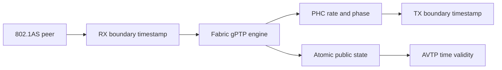
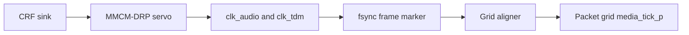

<!-- SPDX-FileCopyrightText: 2026 Kebag Logic -->
<!-- SPDX-License-Identifier: CERN-OHL-W-2.0 -->

# Time synchronization

Three clocks serve different responsibilities.

Only the PHC represents gPTP time.

<!-- milan-feature-status:start -->
| Feature ID | Status | Canonical value |
|---|---|---|
| `crf.media-clock-consumption` | `implemented` | - |
| `gptp.fabric-product-owner` | `implemented` | - |
<!-- milan-feature-status:end -->

## Contents

- **[Clock ownership](#clock-ownership)** — Separate network, processor, and media clocks.
- **[Network-time path](#network-time-path)** — Follow timestamps into PHC discipline.
- **[Media boundary](#media-boundary)** — Distinguish measurement from clock selection.
- **[Presentation validity](#presentation-validity)** — Protect consumers during uncertain time.
- **[Evidence](#evidence)** — Locate executable verification and status.

## Clock ownership

| Clock | Purpose | Current owner |
|---|---|---|
| PHC | Network time in nanoseconds | Fabric gPTP plane |
| Processor timebase | Firmware scheduling | Bare-metal system |
| Media clock | Audio sample timing | INTERNAL or selected CRF lineage |

The clocks never substitute for each other.

The PHC drives AVTP presentation timestamps.

The processor timebase never claims gPTP health.

The media clock controls sample production and consumption.

## Network-time path

- RX timestamps capture accepted tap traffic.
- TX timestamps capture accepted MAC-boundary traffic.
- The engine runs peer delay and synchronization.
- Rate updates steer PHC frequency.
- Phase updates step PHC time.
- Publication commits expose synchronized state atomically.

Read the [fabric-plane contract](GPTP_PLANE.md).

## Media boundary

CRF transport measures remote media timing.

The root consumes stored clock selection since issue #74.

INTERNAL remains the power-on selection.

CRF selection activates the MMCM servo.

The grid aligner follows the physical sample grid.

Each link has exactly one master.

| Loop fact | Value | RTL |
|---|---|---|
| Physical sample grid | `100 MHz * 391/1591 / 512` = 47,999.4893 Hz | `KL_tdm_capture_master` frame divider after the `milan_soc.py` PLAN A MMCM |
| Packet grid | 48,000.0000 Hz free-running | `KL_media_nco` |
| Free-running offset | -10.64 ppm; one sample slips every 1.9582 s | `KL_chan_map_capture` dup/skip counters |
| MMCM servo error | Differential rate, ns per 512 ms window | `KL_mmcm_drp_servo` |
| MMCM servo command | PI; 1/16 ppm per LSB; positive speeds up | `KL_mmcm_drp_servo`, `MCSRV_STAT[31:16]` |
| MMCM servo bounds | +/-100 ppm per window slew; +/-200 ppm authority | `KL_mmcm_drp_servo` |
| CRF unlock | Trim held in HOLDOVER | `KL_mmcm_drp_servo` |
| Grid-aligner error | Frame-marker phase at one-clock resolution | `KL_media_grid_align` |
| Grid-aligner command | PI in servo units; +/-200 ppm authority | `KL_media_grid_align` |

| Function | Implemented | Product effect |
|---|---|---|
| CRF transmit | Yes | Publishes internal media events |
| CRF receive | Yes | Measures remote phase and rate |
| Clock-source command | Yes | Stores selected descriptor |
| Root clock selection | Yes | Compares against the generated CRF descriptor |
| MMCM servo activation | Conditional | Steers audio clocks under CRF selection |
| Packet-grid alignment | Conditional | Follows the physical sample grid |

A dead TDM feed disengages grid alignment.

The packet grid then free-runs nominally.

Never infer clock recovery from CRF lock alone.

Silicon grid comparison remains open on issue #74.

### Listener render latency

The render path holds one constant latency (#386).

`KL_render_setpoint` queues whole media events per stream.

It pops one event per stream per media tick.

The crossbar's input grid is the reference point.

The constant is independent of the audio interface.

| Law term | Value | Derivation |
|---|---|---|
| Events per PDU | 6 | class A at 48 kHz: `AAF_SPF_C`, read, never copied |
| Allowance | 2 events | one tick of accept phase, one of verdict plus drain |
| Setpoint | 8 events = 166.67 us | fill just before every PDU push |
| Shipping samples | 64 | 8 events of 8 channels; 16 on a stereo lane |
| First-event delay | (8, 9] media ticks after accept | the accept phase is the only jitter |
| Event k of a PDU | k ticks after event 0 | the talker's packetization |
| Convergence band | +/-3 events at PDU ends, 100 ms | half a PDU |
| Reset rail | +/-6 events at PDU ends | one PDU: a PDU one interval late never trips it; later than that trips the low rail |
| Prefill | snap to setpoint + 6 at a PDU end | one bounded gap, no repeat storm |
| Recentre | GM identity change, PHC adjtime or settime, a settled clock-source change | once, at the next PDU end |
| Clock-source settle | under CRF: the aligner engaged with its error inside 1/64 sample for 2048 ticks (43 ms), or engaged for 32768 ticks; at INTERNAL: 2048 ticks after the change | `milan_datapath` arms one recentre per change; repeated selections re-arm, never queue |
| Pop | one event per stream per tick, decided at the stream's first beat | a rail, a recentre or a flush inside the pop window lands between events, never inside one |
| Crossbar channel view | 2 x ceil(N_CH_P / 2) lanes per stream (8 on every in-tree shape) | the pad lane of an odd count is a virtual channel, never a wrap onto channel 0 |
| Wire channel count change | the stream is flushed and re-prefilled | its queued rows carry the old lane layout |

Under INTERNAL the grids free-run.

The rail then re-centres every 11.75 s.
That is six events at the -10.64 ppm offset.

It assumes a talker on the board's physical grid.
Another talker's rate error sets its own period.

Under CRF the grids align and no rail fires.

| Interface after the grid | Fixed delay | Shipped |
|---|---|---|
| Crossbar `phys_smp_o` | streams x 4 + 2 axis cycles: 6 at one stream (60 ns at 100 MHz), 18 at four, 34 at eight | every shape; the reference the rows below add to |
| I2S DAC (the Arty shapes: `I2SPB_P = 1`, the DAC crossbar-fed) | + `KL_i2s_playback`: 16 pairs = 16 frames (333 us; `SETPOINT_P` counts pairs, its comment says samples) + 1 serializer frame; accept to DAC = 8 ticks + the accept phase + 17 frames = 25 to 26 frames (521 to 542 us) | the one clocked listener interface in tree; two setpoint stages in series, each constant |
| TDM8 frame pin, slot k | one frame + (k x 32 + 1) bclk (20.83 us + k x 1.30 us + 41 ns) + the tick-to-fsync phase: under one frame, held constant under CRF by #74's aligner, walking at -10.64 ppm at INTERNAL | NOT SHIPPED: no build clocks `KL_tdm_render` (`tdm_bclk_i` tied to 0 on a master build, `render: 0` in the AX7101 configs); the row waits for a render master |

Software reads no delay register: the constants are this table.

`I2SPB_TRIM[15:0]` (0x6E0) shows the I2S element's live fill.
The render stage's fill waits for the #390 CSR word.

On the Arty shapes the DAC is crossbar-fed.
The I2S path therefore renders behind this stage.

Its delay grew by the setpoint, 8 media ticks.
It stays constant: two setpoint stages in series.

Its silicon figure predates the stage (matrix rows).
A re-measurement rides the #117 bench.

The I2S element's own recentre re-bases its producer FIFO.
Its CDC FIFO stays full: up to 16 frames more.

A clock-source change arms one recentre.
It fires once the grid has settled (table above).

The `milan_dp` leg selects CRF under a running stream.
One recentre fires; every PDU returns to the setpoint.

Digital proof: `tb/verilator/render_setpoint` and the `milan_dp` true-ratio leg.

Silicon proof at the TDM frame pin rides #117.

## Presentation validity

The PHC dates AAF and CRF packets.

AVTP timestamps expose only low nanosecond bits.

That representation wraps every 4.295 seconds.

`tu` therefore carries indispensable health information.

| Counter | Condition | RTL |
|---|---|---|
| `ts_delta` | `avtp_timestamp - ptp_now` at each accepted PDU | `KL_avtp_rx_monitor` |
| LATE | `ts_delta < 0` | `KL_avtp_rx_monitor` |
| EARLY | `ts_delta > offset + 10 ms` | `KL_avtp_rx_monitor`, `EARLY_MARGIN_NS_C` |

`AVTPRX_TSD` (`0x6EC`) exposes the last `ts_delta`.

- Streams continue during uncertain time.
- Loss of synchronization raises `tu`.
- Grandmaster changes raise `tu` immediately.
- PHC steps raise `tu` immediately.
- Holdover preserves uncertainty for Milan's minimum interval.

Read [grandmaster recovery](GM_LOSS_RECOVERY.md).

## Evidence

| Concern | Authority | Executable evidence |
|---|---|---|
| PHC arithmetic | `timestamp_counter.sv` | `make -C tb/verilator/ptp` |
| Engine discipline | `gptp-processor/` | `make -C gptp-processor` |
| Parent transport | `KL_gptp_shadow.sv` | `make -C tb/verilator/gptp_shadow` |
| Clock validity | `KL_ptp_clock_validity.sv` | `make -C tb/verilator/clkvalid` |
| Product wiring | `milan_datapath.sv` | `make -C tb/verilator/milan_dp` |
| Grid alignment | `KL_media_grid_align.sv` | `make -C tb/verilator/media_grid_align` |
| Media status | Feature ledger | `python3 scripts/check_feature_status.py` |

Register meanings remain in the [register map](../reference/REGISTER_MAP.md).

Detailed historical measurements remain [archived](../history/v1/design/TIME_SYNC.md).
