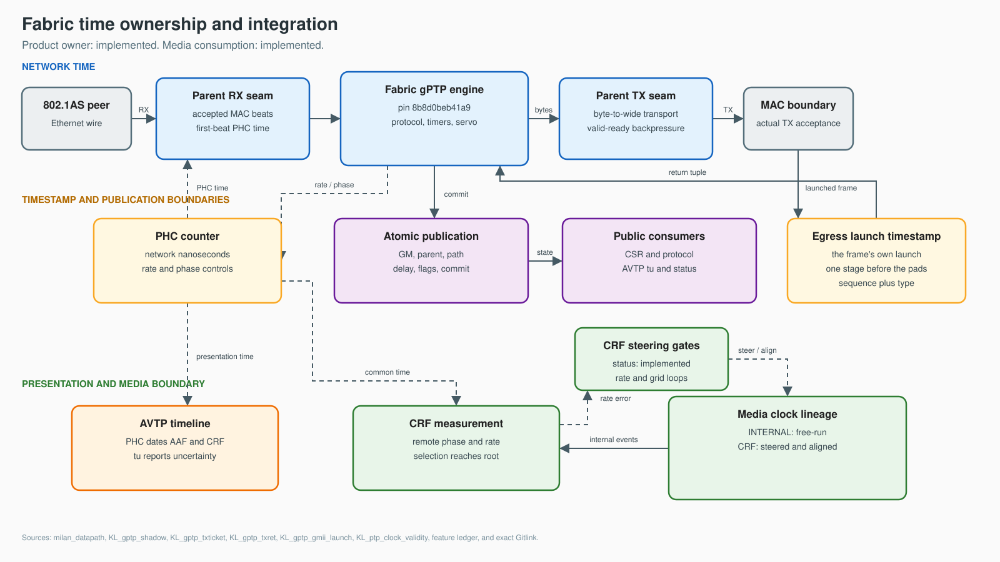
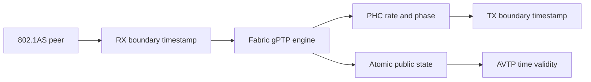
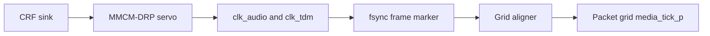

<!-- SPDX-FileCopyrightText: 2026 Kebag Logic -->
<!-- SPDX-License-Identifier: CERN-OHL-W-2.0 -->

# Time synchronization

Three clocks serve different responsibilities.

Only the PHC represents gPTP time.

<!-- milan-feature-status:start -->
| Feature ID | Status | Canonical value |
|---|---|---|
| `crf.media-clock-consumption` | `implemented` | - |
| `gptp.fabric-product-owner` | `implemented` | - |
<!-- milan-feature-status:end -->

## Contents

- **[Clock ownership](#clock-ownership)** -- Separate network, processor, and media clocks.
- **[Network-time path](#network-time-path)** -- Follow corrected timestamps into PHC discipline.
- **[Media boundary](#media-boundary)** -- Distinguish measurement from clock selection.
- **[Presentation validity](#presentation-validity)** -- Protect consumers during uncertain time.
- **[External measurement](#external-measurement)** -- Replace self-reported accuracy with a scope-readable second boundary.
- **[Evidence](#evidence)** -- Locate executable verification and status.

## Clock ownership

| Clock | Purpose | Current owner |
|---|---|---|
| PHC | Network time in nanoseconds | Fabric gPTP plane |
| Processor timebase | Firmware scheduling | Bare-metal system |
| Media clock | Audio sample timing | INTERNAL or selected CRF lineage |

The clocks never substitute for each other.

The PHC drives AVTP presentation timestamps.

The processor timebase never claims gPTP health.

The media clock controls sample production and consumption.

## Network-time path

```mermaid
flowchart LR
    PEER[802.1AS peer] --> RX[RX boundary timestamp]
    RX --> ENGINE[Fabric gPTP engine]
    ENGINE --> PHC[PHC rate and phase]
    PHC --> TX[TX boundary timestamp]
    ENGINE --> PUB[Atomic public state]
    PUB --> TU[AVTP time validity]
```

- RX timestamps capture accepted tap traffic.
- TX timestamps capture the frame's observed launch.
- Each board's own latency correction is applied there (#358).
- Ingress is subtracted; egress is added.
- The fabric plane is their only consumer.
- `PTP_INGRESS_LAT` and `PTP_EGRESS_LAT` stay inert scratch.
- `GPTP_LAT` (`0x7F0`) publishes what is applied.
- Link delay asymmetry is not modelled; it is zero (#511).
- The engine runs peer delay and synchronization.
- Rate updates steer PHC frequency.
- Phase updates step PHC time.
- The [step policy](#step-policy) chooses between them.
- Publication commits expose synchronized state atomically.

A correction's SUM is measured per board. Its split is assigned.

The split moves the synchronized offset, never the peer delay.

Read the [fabric-plane contract](GPTP_PLANE.md).

### Step policy

The fabric plane either steps or slews the PHC.

This page is the parent's one record of that rule.

The offset is local time minus grandmaster time.

| Servo state | Which Sync pair | Slews up to | Steps above |
|---|---|---|---|
| Link-up | The first pair after asCapable rises | 20 us | 20 us |
| Locked | Every later pair | 100 us | 100 us |

- Every reset clears asCapable, so it re-arms link-up.
- Nothing else re-arms link-up.
- A grandmaster change keeps the servo locked.
- So does a 375 ms Sync receipt timeout.
- So does a return from grandmaster duty.
- The written rate trim never exceeds 200 ppm.
- That trim is proportional plus integral; both share the bound.
- The plane's microcode clamps the trim to that bound.
- `KL_gptp_txret` computes the same bound as `PHC_ADJ_MAX_C`.
- It refuses egress timestamps while the trim exceeds it.
- A 100 us slew takes 0.5 s or more.
- `phc_slew_active_o` identifies transient offset correction.
- Outside +/-100 ns, a non-stepping pair starts correction.
- Two consecutive in-band pairs complete it.
- Missing measurements retain the level and applied correction.
- Completion has no elapsed-time limit.
- The CRF servo holds through the entire indicated correction.
- One step is one `phc_step_we_o` pulse.
- That pulse carries the measured offset, negated.
- Each step is one counted [media event](GM_LOSS_RECOVERY.md#media-re-base-on-a-phc-step).

| Source | Record |
|---|---|
| Owner decision, 2026-09-23 | [#387](https://github.com/kebag-logic/milan-fpga/issues/387#issuecomment-5794731090) |
| Link-up ruling | [FPGA-gPTP #68](https://github.com/Mister-M-alt/FPGA-gPTP/issues/68#issuecomment-5798089412) |
| Engine contract | [`INTEGRATION.md`](https://github.com/Mister-M-alt/FPGA-gPTP/blob/5dce647ab5a01a6ecff9a982b22e3a4a1d946d3d/docs/INTEGRATION.md#step-versus-slew-policy) |

The [coupling decision](https://github.com/kebag-logic/milan-fpga/issues/387#issuecomment-5816509317) requires discarding slew-overlapped windows.

The historical decision calls 0.5 s a maximum.

The explicitly adopted engine contract instead permits longer corrections.

No timeout overrides its measured completion verdict.

The [resumed assignment](https://github.com/kebag-logic/milan-fpga/issues/545#issuecomment-5827358783) corrects the frequency citations.

IEEE 802.1AS Annex B.1.1 specifies LocalClock accuracy.

Its bound is +/-100 ppm.

Milan v1.2 section 7.4 constrains media-source accuracy.

It requires better than +/-50 ppm.

## Media boundary

CRF transport measures remote media timing.

The root consumes stored clock selection since issue #74.

Only two sources are advertised since issue #389.

They are INTERNAL and the CRF sink.

An AAF listener carries no CLOCK_SOURCE, because nothing follows one.

INTERNAL remains the power-on selection.

CRF selection activates the MMCM servo.

The grid aligner follows the physical sample grid.

```mermaid
flowchart LR
    CRF[CRF sink] --> SERVO[MMCM-DRP servo]
    SERVO --> AUDIO[clk_audio and clk_tdm]
    AUDIO --> FSYNC[fsync frame marker]
    FSYNC --> ALIGN[Grid aligner]
    ALIGN --> TICK[Packet grid media_tick_p]
```

Each link has exactly one master.

| Loop fact | Value | RTL |
|---|---|---|
| Physical sample grid | `100 MHz * 391/1591 / 512` = 47,999.4893 Hz | `KL_tdm_capture_master` frame divider after the `milan_soc.py` PLAN A MMCM |
| Packet grid | 48,000.0000 Hz free-running | `KL_media_nco` |
| Packet-grid trim update | any cycle: one tick per period, never lost or doubled, no counter wrap; an update landing past a lowered end is a one-cycle phase step (#617) | `KL_media_nco` monotone terminal compare |
| Free-running offset | -10.64 ppm; one sample slips every 1.9582 s | `KL_chan_map_capture` dup/skip counters, readable at `SLIP_LB`/`SLIP_TDM` (`0x8D4`/`0x8D8`) |
| MMCM servo error | Differential rate, ns per 512 ms window | `KL_mmcm_drp_servo` |
| MMCM servo command | PI; 1/16 ppm per LSB; positive speeds up | `KL_mmcm_drp_servo`, `MCSRV_STAT[31:16]` |
| MMCM servo bounds | +/-100 ppm per window slew; +/-200 ppm authority | `KL_mmcm_drp_servo` |
| CRF talker discontinuity | Discard crossing rate history; preserve servo lock and integrator (#546) | `KL_crf_rx.rate_valid_o`, `KL_mmcm_drp_servo.crf_rate_valid_i` |
| CRF unlock | Trim held in HOLDOVER | `KL_mmcm_drp_servo` |
| MMCM servo on a PHC step | The window the step lands in is discarded; trim and integrator held (#539). A policy slew uses its separate overlap guard (#545) | `KL_mmcm_drp_servo`, `MCSRV_STAT[15:10]` |
| MMCM servo on a policy slew | Every overlapping window discarded and counted; integrator, trim and LOCKED held. Clean windows resume directly (#545) | `KL_mmcm_drp_servo.phc_slew_active_i`, `MCSRV_STAT[15:10]` |
| MMCM servo on an implausible window | Error above 1024 ppm discarded; four in a row re-base the window | `KL_mmcm_drp_servo`, `MCSRV_STAT[15:10]` |
| Grid-aligner error | Frame-marker phase at one-clock resolution; the marker is the TDM frame close since #617 | `KL_media_grid_align`, bound in `milan_datapath` |
| Grid-aligner command | PI in servo units; +/-200 ppm authority | `KL_media_grid_align` |
| Grid-aligner lock target | Engagement phase, the frame close kept 256 cycles off the capture walk's crossing ([Talker capture handoff](#talker-capture-handoff)); the module default is 1/128 sample | `KL_media_grid_align`, `milan_datapath` `MGA_KEEPOFF_CYC_C` |

A slew discard restarts the four-trip guard streak.

A slew window is not a valid offset sample.

Re-basing therefore requires four fresh guard trips after the slew.

The #539 step discard also restarts this streak.

| Function | Implemented | Product effect |
|---|---|---|
| CRF transmit | Yes | Publishes internal media events |
| CRF receive | Yes | Measures remote phase and rate |
| Clock-source command | Yes | Stores a listed descriptor; refuses an unlisted index with `BAD_ARGUMENTS` |
| Root clock selection | Yes | Compares against the generated CRF descriptor |
| INTERNAL selection | Yes | Free-running media clock, the power-on state |
| CRF selection | Yes | Drives the media clock through the servo and the aligner |
| Stream-derived recovery | No | Not advertised: no INPUT_STREAM source on an AAF listener (#389) |
| MMCM servo activation | Conditional | Steers audio clocks under CRF selection |
| Packet-grid alignment | Conditional | Follows the physical sample grid |

The policy level follows the effective PHC rate.

Engine, shadow and servo use `axis_clk`.

The existing PHC contract requires `gtx_clk == axis_clk`.

There is no new asynchronous crossing.

The datapath asserts immediately and delays release four cycles.

Those cover the shadow latch, two synchronizers and counter update.

The servo stages the level beside its PHC sample.

An overlap flag persists until the affected window closes.

A shared boundary sample taints both adjacent windows.

A pre-slew window already closed may finish its PI sequence.

A coincident step counts that same window only once.

No port count or redundant-network selection is assumed.

`mmcm_servo` grades +/-100 us slews at 200 ppm.

Each lasts 0.5 s and overlaps two measurement windows.

Their integrator and trim remain exactly held.

The first clean window changes the integrator within 1 ppm.

It completes within 1.536 s of the disturbance's start.

LOCKED holds on every observed edge.

Additional cases cover short pulses, shared boundaries and prolonged levels.

The connected `milan_dp` gmstep phase drives real Sync pairs.

It measures fractional PHC advances to grade release-tail coverage.

An extra addend stage must fail this check.

Its compressed clocks do not grade media-loop settling.

CRF rate history restarts on either received `tu` edge.

IEEE 1722-2016 `4.4.4.7` defines uncertainty.

Clause `10.4.5` maps CRF's bit.

The separate `mr` restart follows `4.4.4.3` and `10.4.3`.

Held `tu` permits recovery after 256 clean timestamp intervals.

Sequence gaps also restart that history.

Invalid or foreign PDUs never seed its reference.

Silence, reset and binding changes invalidate old history.

STOP suppresses sample validity while counters continue observing.

An adjacent-timestamp jump provides the unmarked-step backstop.

Its threshold derives from the 2 ms CRF interval.

Combined media and PHC drift permits 601 ns deviation.

LocalClock frequency must stay within +/-100 ppm.

See IEEE 802.1AS Annex B.1.1.

We assume that bound also applies to the media oscillator.

Milan v1.2 section 7.4 constrains media clock sources.

Their frequency tolerance must be better than +/-50 ppm.

Using 100 ppm therefore adds conservative margin.

The remote PHC is assumed to share our envelope.

That includes +/-200 ppm trim and timestamp quantization.

Our `timestamp_counter` increment plus adjustment stays below 384 ns.

Two such timestamp quantization bounds add less than 768 ns.

The drift calculation is `ceil(2,000,000 * 300 / 999,900)`.

Adding quantization gives `601 + 768 = 1369 ns`.

Rounding upward gives 2,048 ns.

Both signed jumps are detected using full-width timestamps.

This excludes network arrival jitter from the decision.

The event's PDU seeds the new timestamp history.

After 256 further intervals, the rate becomes valid again.

Until then, `CRF_RATE` holds its last clean value.

The servo skips invalid samples without changing its lock state.

Local PHC guards remain independent of this validity signal.

No additional CSR bit or discard tally is introduced.

The [receiver suite](../../tb/verilator/crf_rx) exercises this connected path.

A dead TDM feed disengages grid alignment.

The packet grid then free-runs nominally.

Never infer clock recovery from CRF lock alone.

Silicon grid comparison remains open on issue #74.

### Listener render latency

The render path holds one constant latency (#386).

`KL_render_setpoint` queues whole media events per stream.

It pops one event per stream per media tick.

The crossbar's input grid is the reference point.

The constant is independent of the audio interface.

| Law term | Value | Derivation |
|---|---|---|
| Events per PDU | 6 | class A at 48 kHz: `AAF_SPF_C`, read, never copied |
| Allowance | 2 events | one tick of accept phase, one of verdict plus drain |
| Setpoint | 8 events = 166.67 us | fill just before every PDU push |
| Shipping samples | 64 | 8 events of 8 channels; 16 on a stereo lane |
| First-event delay | (8, 9] media ticks after accept | the accept phase is the only jitter |
| Event k of a PDU | k ticks after event 0 | the talker's packetization |
| Convergence band | +/-3 events at PDU ends, 100 ms | half a PDU |
| Reset rail | +/-6 events at PDU ends | one PDU: a PDU one interval late never trips it; later than that trips the low rail |
| Prefill | snap to setpoint + 6 at a PDU end | one bounded gap, no repeat storm |
| Recentre | a PHC step (the plane's step, or CLKV adjtime with the plane off), a PHC settime, a settled clock-source change; a GM identity change alone is no trigger since #387 | once, at the next PDU end; a step is also one `mr` toggle ([media re-base](GM_LOSS_RECOVERY.md#media-re-base-on-a-phc-step)) |
| Clock-source settle | under CRF: the aligner engaged with its error inside 1/64 sample for 2048 ticks (43 ms), or engaged for 32768 ticks; at INTERNAL: 2048 ticks after the change | `milan_datapath` arms one recentre per change; repeated selections re-arm, never queue |
| Pop | one event per stream per tick, decided at the stream's first beat | a rail, a recentre or a flush inside the pop window lands between events, never inside one |
| Crossbar channel view | 2 x ceil(N_CH_P / 2) lanes per stream (8 on every in-tree shape) | the pad lane of an odd count is a virtual channel, never a wrap onto channel 0 |
| Wire channel count change | the stream is flushed and re-prefilled | its queued rows carry the old lane layout |

Under INTERNAL the grids free-run.

The rail then re-centres every 11.75 s.
That is six events at the -10.64 ppm offset.

It assumes a talker on the board's physical grid.
Another talker's rate error sets its own period.

Under CRF the grids align and no rail fires.

| Interface after the grid | Fixed delay | Shipped |
|---|---|---|
| Crossbar `phys_smp_o` | streams x 4 + 2 axis cycles: 6 at one stream, 18 at four, 34 at eight. Convert at the shape's own axis clock: 6 cycles are 60 ns at 100 MHz and 120 ns on the AX7101, whose `milan` domain is 50 MHz | every shape; the reference the rows below add to |
| I2S DAC (the Arty shapes: `I2SPB_P = 1`, the DAC crossbar-fed) | + `KL_i2s_playback`: 16 pairs = 16 frames (333 us; `SETPOINT_P` counts pairs, its comment says samples) + 1 serializer frame; accept to DAC = 8 ticks + the accept phase + 17 frames = 25 to 26 frames (521 to 542 us) | the one clocked listener interface in tree; two setpoint stages in series, each constant |
| TDM8 frame pin, slot k | + the bank walk and frame commit, MEASURED at 9 axis cycles, which is 180 ns on the shipping AX7101 (its `milan` axis clock is 50 MHz) and 90 ns on the leg's 100 MHz model axis clock, + the adopt wait `phi`, + (32k + 1) bit periods at 12.288 MHz (81.4 ns each, so slot k adds 2.6042 us and 8 slots make one 20.834 us frame). `phi` covers the frame CDC and the wait for the next serial frame start: one axis cycle plus serial-domain time, MEASURED at 0.219 to 21.049 us on the model axis clock and therefore 0.229 to 21.059 us as shipped. It is held constant per slot under CRF by #74's aligner, walks at `+10.6844` ppm at INTERNAL and steps by exactly one frame once per 1.958 s beat. That sign is the MEASURED one, the same the walk table below and the [channel map](../CHANNEL_MAP_64.md) carry: the instrument divides `(phi_last - phi_first)` by the elapsed time, so a positive walk is a LENGTHENING wait. It is not the audio clock's own free-running offset, which the loop table above states separately as -10.64 ppm; the two are different quantities | SHIPPED on the AX7101 1x1 TDM8 shape (#447): `KL_tdm_render_master` on `tdm.dout`, scheduled from the capture master's exported bit-clock enables. Every term above is measured by `make -C tb/verilator/milan_dp_render tdm8render`, not modelled. Silicon measurement of this path stays with #386 acceptance 4 and #117 |

That row once charged a frame AND a tick-to-fsync phase. No separate
deterministic frame exists.

The adopt wait IS that phase. It is one measured term.

Which clock a term belongs to decides its nanoseconds. Serial terms are
absolute: the audio clock ships unchanged.

Axis-cycle terms are not. The leg models 100 MHz; `milan` ships at 50.

Every term above is measured, not modelled.

- The frame commit strobe is timestamped in `axis_clk`.
- The crossbar's valid pulse is timestamped beside it.
- An independent pin decoder timestamps each slot's MSB edge.
- Drop-oldest accounting names the commit behind each frame.
- The bank walk measured 9 axis cycles over 840 pairs.
- Slot 0 measured 0.300 to 21.130 us.
- Both of those are on the model axis clock.
- That window covered 838 decoded frames.
- Its spread stayed inside one serial frame.

Recipe: the shipping shape, `AUDIO_IF_RENDER_SLOTS_P = 8`. Clocks: the true
391/1591 plan, gPTP plane off.

The `phi` walk is measured on both sources. One run, one instrument, one live
selection.

The command is a real `SET_CLOCK_SOURCE` on `CLOCK_DOMAIN` 0.

| Selected source | `phi` walk, measured | Closed form |
|---|---|---|
| INTERNAL | `+10.6844` ppm over 3.74 M axis cycles | `+10.6394` ppm, the divider plan |
| CRF, aligner engaged | `-0.5339` ppm over 3.75 M axis cycles (`-0.8009` with the pre-#617 slot-0 marker) | zero, the aligner holding both grids |

A walk divides two intervals of one clock. The rate is rate-free; the window
is model-clock time.

The sign is `phi`'s own. Commits arrive one media tick apart.

Frames start one serial frame apart. The wait lengthens by their difference.

The settled-grid trigger fires once across the transition. The stage
re-centres once.

The fill at accept stays the setpoint. Every first event stays inside the law
band.

The deselect back to INTERNAL is the same.

Software reads no delay register: the constants are this table.

`I2SPB_TRIM[15:0]` (0x6E0) shows the I2S element's live fill.

`RENDER_STAT` (`0x8DC`, #443) exposes the selected listener's fill.

It also carries prefill, convergence and the global rail count.

The [register map](../reference/REGISTER_MAP.md#0x8dc-----render-setpoint-state) defines selection and field widths.

An absent stage reads **STRUCTURAL ZERO**, never measured health.

Rail and underrun events do not raise `STREAM_INTERRUPTED`.

On the Arty shapes the DAC is crossbar-fed.
The I2S path therefore renders behind this stage.

Its delay grew by the setpoint, 8 media ticks.
It stays constant: two setpoint stages in series.

Its silicon figure predates the stage (matrix rows).
A re-measurement rides the #117 bench.

The I2S element's own recentre re-bases its producer FIFO.
Its CDC FIFO stays full: up to 16 frames more.

A clock-source change arms one recentre.
It fires once the grid has settled (table above).

The `milan_dp` leg selects CRF under a running stream.
One recentre fires; every PDU returns to the setpoint.

Digital proof: `tb/verilator/render_setpoint` and the `milan_dp` true-ratio leg.

Silicon proof at the TDM frame pin rides #117.

### Talker capture handoff

The capture crossbar hands the talker whole TDM frames (#617).

Every channel of one sample event is one TDM frame.

| Term | Value | Derivation |
|---|---|---|
| Frame complete | the strobe of the frame's last pair: pair 3 on TDM8 | `KL_tdm_capture_master` strobes pair k at the end of slot 2k+1 |
| Published | on that strobe's edge, all pairs at once | `KL_chan_map_capture` `TDM_FRAME_PAIRS_P`, set by `milan_datapath` `CMAP_TDM_FRAME_PAIRS_C` |
| Read | the walk snapshot, in the media tick's own cycle, held for the whole walk | a tick queued behind an overrunning walk snapshots when that walk starts (`chmap_capture` `[Q]`) |
| Column | the frame the tick takes: the newest closed before the tick cycle, or one closing on it when none is pending | the junction counters' coincidence law (#74 item 2); IEEE 1722-2016 7.3.5 makes one event one instant |
| Frame age at the tick, INTERNAL | 0 to 1042 axis cycles: one frame, uniform over a beat | MEASURED over one beat of the true plan, 1x1 TDM8 shape, 50 MHz |
| Frame age at the tick, CRF | 256 to 785 axis cycles, fixed for a lock | the aligner holds the close 256 cycles off the crossing (below) |
| Pair p | the frame's age plus (3 - p) pair periods of 5.208 us | the order the front end delivers pairs |
| Beat at INTERNAL | one whole-frame slip every 1.958 s, counted once on `SLIP_TDM` | the loop table's rate, unchanged |
| CRF | no slip at any settled lock phase, measured to +/-100 ppm relative rate | the guarded crossing, below |

The per-pair holds this replaced had no frame boundary.

Each pair was read at its own slot's inject.

Each change below is exact, not a sampled mean.

It is the 1x1 TDM8 shape at 50 MHz.

TDM pairs 0 to 3 feed talker slots 0-3.

| Pair | Read at `ce550952` | Frame atomicity | Guarded crossing | Change |
|---|---|---|---|---|
| 0 | its strobe, by tick + 6 cycles | +782.3 cycles | +5 cycles | +787.3 cycles, +15.75 us |
| 1 | its strobe, by tick + 32 cycles | +547.8 cycles | +5 cycles | +552.8 cycles, +11.06 us |
| 2 | its strobe, by tick + 58 cycles | +313.4 cycles | +5 cycles | +318.4 cycles, +6.37 us |
| 3 | its strobe, by tick + 84 cycles | +79.0 cycles | +5 cycles | +84.0 cycles, +1.68 us |

| Term | Value | Derivation |
|---|---|---|
| Frame atomicity | (6 + 26p) - 5 + (3 - p) x 260.4 cycles | slot p injects 26 cycles after slot p - 1; pair p's frame closes (3 - p) pair periods after it; the round-1 snapshot read a close by tick + 5 |
| Guarded crossing | + `LB_PAIRS_C` + 1 cycles: 5 on the 1x1 shape, 2 on the 8x8 product shape | the read moves from the pre-walk's last cycle to the tick cycle |
| Check | pair 0 to 3 minimum ages -6, -32, -58, -84 cycles before; 781, 520, 260, 0 after | MEASURED, `capture_coherence` INT-true at `ce550952` and at the head |
| Other shapes | at 100 MHz a pair period is 520.8 cycles; a pair feeding talker t's slots read 104 x t cycles later at `ce550952`, so its change is 104 x t cycles less | slot 4t + p injects 26 x 4t cycles after slot p |

Pair 3 carries the frame's last sample.

Its change is the read moving to the tick.

The earlier pairs also wait for their frame to complete.

That wait is what atomicity requires.

The guard adds 0.1 us.

Before, one column could span a frame of sampling instants.

On the Arty blend the I2S pair is pair 0.

It waits for the TDM close: at most a frame.

#### The guarded crossing

A walk has one crossing: the close against the tick.

Under CRF the aligner holds every settled lock off it.

| Aligner input (`milan_datapath`) | Value | Why |
|---|---|---|
| Frame marker | the frame close | the event the walk and `SLIP_TDM` cross |
| Tick | `media_tick_p`, one cycle late | puts the lock-target split on the walk's crossing, so no engagement is pulled across it |
| Keep-off | `MGA_KEEPOFF_CYC_C` = 256 cycles, capped at a quarter sample on a compressed test clock | clears the acquisition transient and the pulled equilibrium (next tables); the module default is 1/128 sample |

Keyed on slot 0, the keep-off guarded the wrong instant.

That instant sat three pair periods from the crossing.

A lock could park the close on the snapshot.

The talker then repeated and skipped frames while `SLIP_TDM` stayed static.

The 1/128-sample default protected a settled lock only.

The transient still carried the close across for nearby engagements.

The envelope is a relative rate at the aligner.

It is the TDM frame against the local axis clock.

The local oscillator may run +/-100 ppm off (above).

A +/-50 ppm Milan source therefore does not bound it.

| Envelope term | Value | Evidence |
|---|---|---|
| Pull on a raced engagement | 64 ppm: the proportional term at one keep-off, u = 256 x 4 in 1/16 ppm | `KL_media_grid_align` `KP_LOG2_P` |
| Pulled-engagement margin | 256 - 4 x the rate cycles: 56 at 50 ppm, 16 at 60 ppm, none at 64 ppm | the proportional equilibrium, 4 cycles per ppm |
| On-crossing engagement limit | about 63 ppm below nominal, 67 above: the pull no longer outruns the rate | RECORDED, sub-cycle probes: net zero at -62 and +66, carried across at -63 and +68 |
| Unpulled transient peak | about 3 cycles per ppm: 149 at 50 ppm, 238 at 80, 299 at 100 | MEASURED, `capture_coherence` CRF-50/+50 and CRF-settle |
| Transient limit | about 86 ppm: the peak reaches the 256-cycle keep-off | RECORDED, engagements 256 cycles off: no crossing at 86 ppm, crossings at 88 below and 90 above |
| Settled lock | the integrator cancels the rate; the lock sits 256 cycles off | MEASURED to +/-100 ppm, CRF-settle; the aligner's authority is +/-200 ppm |

| Relative rate | Engagement on the crossing | Unpulled engagement | Settled lock |
|---|---|---|---|
| within +/-50 ppm | one repeat and one skip, net zero, by column 57 | transient under the keep-off, 107 cycles clear at 50 ppm | no slip |
| 50 to the on-crossing limit | one repeat and one skip, net zero, later as the rate nears the pull: by column 87 at 55 ppm, 181 at 60, 294 at 62 | transient under the keep-off | no slip |
| on-crossing limit to about 86 ppm | carried across: one repeat or skip, then its pair when the integrator returns the close, by column 6300 at 80 ppm | transient under the keep-off | no slip |
| beyond about 86 ppm | carried across and back, by column 11100 at 100 ppm | one repeat and one skip as the transient crosses and returns, by column 13100 at 100 ppm | no slip, measured to +/-100 ppm |

Every slip is acquisition, nets zero and counts on `SLIP_TDM`.

| Sweep (`capture_coherence`) | Engagements | Result |
|---|---|---|
| True plan, every cycle across +/-32 of the crossing | 65 | 0 torn; one on the crossing repeats and skips once, by column 12 |
| True plan, every 16 cycles round the frame | 65 | 0 torn, 0 slips |
| -50 ppm, every 4 cycles from -176 to +32 | 53 | 0 torn, 0 slips |
| +50 ppm, every 4 cycles from -32 to +176 | 53 | 0 torn, 0 slips |
| -50 ppm, -1 to +1 cycle, every quarter cycle at 64 sub-step phases (CRF-fine-50) | 768 | 0 torn; 141 repeat and skip once, net zero, last at column 57 |
| +/-80 and +/-100 ppm, on the crossing and 256 cycles off, 30000 columns (CRF-settle) | 8 | 0 torn; acquisition slips net zero, last at column 13065; none in the lock |
| Whole datapath, true plan, every 2 cycles from -20 to +4 | 13 | 0 torn, 0 slips |

Before the NCO fix, CRF-fine-50 lost ticks.

Nine of its engagements repeated once and skipped twice.

An aligner trim update landed on the NCO's terminal count.

The count missed its lowered end and wrapped.

Two ticks were lost.

The monotone terminal compare removes it (loop table above).

Removing any guard part reproduces slips (the mutation arm).

| Engagement cost | Value | Derivation |
|---|---|---|
| Capture within 256 cycles of the tick | pulled out to 256 cycles, at up to 64 ppm of NCO trim | the aligner's proportional term, 4 cycles per ppm |
| Share of engagements pulled | half at 50 MHz, a quarter at 100 MHz | 512 of 1041 or 2083 cycles |
| #386 settled-grid trigger | waits for the pull, as for any aligner movement | its 32768-tick ceiling still bounds it |
| Render path | unchanged; under CRF a lock's `phi` takes only the phases the keep-off leaves | `milan_dp_render` T30 and `milan_dp` aclk pass unchanged |

The listener render law above is unchanged.

Digital proof: `tb/verilator/capture_coherence`, in INTERNAL and under CRF.

The next #451 bench capture is the silicon proof.

## Presentation validity

The PHC dates AAF and CRF packets.

AVTP timestamps expose only low nanosecond bits.

That representation wraps every 4.295 seconds.

`tu` therefore carries indispensable health information.

| Counter | Condition | RTL |
|---|---|---|
| `ts_delta` | `avtp_timestamp - ptp_now` at each accepted PDU | `KL_avtp_rx_monitor` |
| LATE | `ts_delta < 0` | `KL_avtp_rx_monitor` |
| EARLY | `ts_delta > offset + 10 ms` | `KL_avtp_rx_monitor`, `EARLY_MARGIN_NS_C` |

`AVTPRX_TSD` (`0x6EC`) exposes the last `ts_delta`.

- Streams continue during uncertain time.
- Loss of synchronization raises `tu`.
- Grandmaster changes raise `tu` immediately.
- PHC steps raise `tu` immediately.
- Holdover preserves uncertainty for Milan's minimum interval.

Read [grandmaster recovery](GM_LOSS_RECOVERY.md).

## External measurement

Every accuracy statement above is internal.

The device reads its own offset and grades itself.

A systematic error stays invisible while every gate stays green.

The PPS output closes that gap (issue #260).

It is one comparator: `hit = (phc_ns >= target)`.

It lives in the PHC's own clock domain.

One rising edge per PHC second reaches a pin.

A scope then reads this board against an external reference.

It is deliberately not an engine product.

The gPTP engine is microcoded and event-queued.

Anything it emitted would carry dispatch latency.

That is microseconds of jitter, which is not a PPS.

At the counter the edge is deterministic to one tick.

The target advances by exactly 1 000 000 000 nanoseconds.

It never re-arms from the current time.

The error therefore does not accumulate.

Each edge lands within one counter increment of its boundary.

That bound is measured at the compare's own sample.

The pin is one register stage after it.

The pad adds one more clock period.

That offset is fixed and calibrates out.

One edge's residue is never carried into the next.

`PTP_PPS_RD_{LO,HI}` publishes the live target.

Software watches the grid advance rather than assuming it.

Two gates stay deliberately separate.

`PPS_P` decides whether the logic exists at all.

It is off by default.

Building it costs +118 LUT and +83 FF, measured OOC.

`PTP_PPS_CTRL[0]` decides whether a built comparator fires.

`PTP_PPS_CTRL[16]` says which of the two a silent pin is.

The pin and the build flag are in [BUILDING.md](../integration/BUILDING.md).

The registers are in the [register map](../reference/REGISTER_MAP.md).

The bench proof against a reference is not yet taken.

## Evidence

| Concern | Authority | Executable evidence |
|---|---|---|
| PHC arithmetic | `timestamp_counter.sv` | `make -C tb/verilator/ptp` |
| PPS grid and alignment | `timestamp_counter.sv` (`PPS_P`) | `make -C tb/verilator/ptp` |
| Engine discipline | `gptp-processor/` | `make -C gptp-processor` |
| Parent transport | `KL_gptp_shadow.sv` | `make -C tb/verilator/gptp_shadow` |
| Clock validity | `KL_ptp_clock_validity.sv` | `make -C tb/verilator/clkvalid` |
| Product wiring | `milan_datapath.sv` | `make -C tb/verilator/milan_dp` |
| Grid alignment | `KL_media_grid_align.sv` | `make -C tb/verilator/media_grid_align` |
| Media status | Feature ledger | `python3 scripts/check_feature_status.py` |

Register meanings remain in the [register map](../reference/REGISTER_MAP.md).

Detailed historical measurements remain [archived](../history/v1/design/TIME_SYNC.md).
