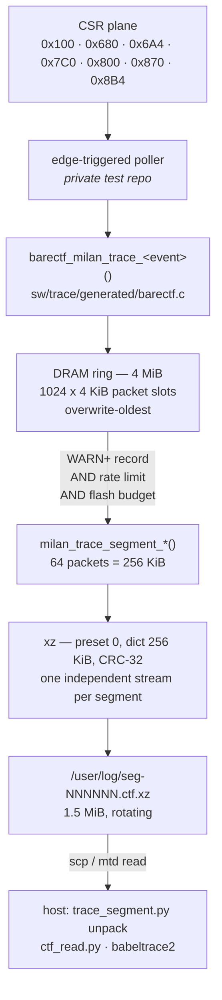

# Fault logging — the CTF trace in `/user`

When this end-station misbehaves, the evidence that has actually solved every
fault in its history is **CSR-plane state**: a link-guard status word, an
`RST_EPOCH` tick, a stream-table `CTRL` register reading `0` while the bind
record says bound, a parser counter climbing while its match counter does not.
None of that is text. A text log large enough to hold it would burn out the NOR
flash it is stored on, and would still not answer the question, because the
question is always *"what did these eight registers read, in this order, in the
two minutes before it broke"*.

So the fault log is a **binary trace**, in the **Common Trace Format**, produced
by [barectf](https://barectf.org/) (dependency-free generated C — no LTTng
runtime), buffered in DRAM, and written to the `/user` jffs2 partition **only
when something has gone wrong**, as rotating independent `xz` segments.

> **Roadmap:** [`TODO.md`](../../TODO.md) Phase 10 row **H4**. Composes with
> [`SAVED_STATE_FASTCONNECT.md`](SAVED_STATE_FASTCONNECT.md) §10, which owns the
> `/user` partition itself; this document owns what goes in it.

---

## 1. Status ledger — proven vs designed-only

Read this first.

| Piece | State | Evidence |
|---|---|---|
| Trace ABI (`milan_trace.yaml` → CTF `metadata`) | **generated + pinned** | `sw/trace/test_trace_roundtrip.py` gates 2, 3 |
| Producer C (barectf output + the DRAM ring) | **compiles and runs on a host** | gate 4 (`-Wall -Wextra -Werror`) |
| 23 event types, all exercised | **measured** | gate 5 — 87 805 records over 1607 s of simulated board time |
| Compression chain + ratio | **measured on real produced traces** | gate 6 — 1 839 104 → 387 028 B, **0.2104** |
| Torn-segment recovery | **measured, prefix-exact** | gates 7, 8 |
| Structural refusal of damaged packets | **measured** | gate 9 |
| Flash-wear token bucket | **exercised, closed-form checked** | gate 11 |
| Rotation / eviction policy | **exercised** | gate 12 |
| `journal` + `user` flash slots in the SoC map | **in `FLASHBOOT_LAYOUT`, gated** | gate 1 |
| `fixed-partitions` DT node | **generated + `dtc`-checked** | gate 1 |
| Linux **binding** an mtd driver to LiteSPI | **NOT ESTABLISHED** | no board has been booted with an mtd node; §12 gate T1 |
| `/user` mounted, jffs2 | **designed only** | [`SAVED_STATE_FASTCONNECT.md`](SAVED_STATE_FASTCONNECT.md) §10 |
| The board daemon (poller + compressor + writer) | **private test repo** | §11 |
| Compressor cost on the softcore | **ESTIMATED, not measured** | §7.3 — the `trace_flush.ms` field exists to replace the estimate |

Nothing below claims "fault logging works on a board". What is delivered is the
**contract** (an ABI, a container format, a flash map), the **producer**, the
**host tooling**, and a round trip that runs anywhere `python3` and a C compiler
do.

---

## 2. What is worth tracing

The event set was not designed from first principles. It was designed by reading
[`RECURRING_DEFECT_PATTERNS.md`](../limitations/RECURRING_DEFECT_PATTERNS.md)
and [`TROUBLESHOOTING.md`](../limitations/TROUBLESHOOTING.md) and asking, for
each real fault: **which registers, read in which order, would have ended the
investigation on day one?**

| Event | Registers | The fault it answers |
|---|---|---|
| `boot` | `0x000` ID, `0x004` VERSION | *which gateware wrote the rest of this trace.* Every other field's meaning depends on `VERSION`; a trace without it is undecodable evidence |
| `heartbeat` | — | the box is alive and the tracer is running. Also **mandatory**: it bounds the 32-bit record timestamp (§3.2) |
| `link` | `LINKG_STAT 0x774`, `LINK_CTRL 0x71C` | the link-guard `eth_rst` deadlock; the MAC-TX wedge on a link bounce. `state`/`rx_alive`/`tx_alive`/`eth_rst` in one record is the guard's whole FSM |
| `mac_reset` | `RST_EPOCH 0x720` | **the shadow-lie canary.** [Pattern 8](../limitations/RECURRING_DEFECT_PATTERNS.md) — a CSR that reads its pre-reset value is indistinguishable from a configured one *unless you know a reset happened*. This event is what makes every later register value in the trace interpretable |
| `acmp_listener` | `0x6A4`, `0x6A8/0x6AC`, `0x6B4` | the fast-connect ladder, as a transition list instead of a hand-poll |
| `srp` | `0x694/0x698/0x69C` | reservation state, and `[11]` **attribute-row shortfall** — documented as the *only* software-visible symptom of a refused reservation row |
| `srp_refusal` | (requester side) | an admission refusal as an event, distinct from a status word that happens to read badly |
| `stream_ctx` | `0x800` window: `0x810` CTRL, `0x814/0x818` SID | **the fabric-listener accept blocker.** [§21](../limitations/TROUBLESHOOTING.md) is one word: `A_STRMW_CTRL` reads `0` while the bind record says bound. That comparison needs both halves in one record |
| `stream_ctx_write` | the writes themselves | ordering is load-bearing (*stage SID before CTRL*), and an ordering defect is invisible unless the **writes** are traced, not only the resulting state |
| `parser_probe` | `APRB 0x8B4-0x8C4` | the only listener-side view **upstream** of the stream-table match. `parsed` climbing with `matched` static is the exact signature; `wire_sid` is what you diff against the bind record |
| `avtp_rx` | `0x6B8/0x6BC/0x6C0/0x6C4/0x6EC` | accept rate, format rejects, sequence gaps, ring drops, stream-sync error |
| `ltap` | `0x870` taps, `0x898` | per-stage latency, **plus `saturated`** — a 16-bit `max` that hit `0xFFFF` during a fault describes the fault, not the system, so the trace records that the number is contaminated instead of quoting it |
| `ring` | RX/TX BD + PCM rings | the multi-flow collapse was hardware lapping an un-gated ring; head/tail *at the lap* is the evidence |
| `journal` | `JNL_STAT 0x7C0`, `JNL_SEQ 0x7C4` | the saved-state verdict taxonomy is exactly this enum ([`SAVED_STATE_FASTCONNECT.md`](SAVED_STATE_FASTCONNECT.md) §6.3) |
| `maap` | `0x6D0/0x6D4` | a DMAC collision is the documented cause of lwSRP failure code 5 |
| `mediaclk` | `0x8F8`, `0x6D8`, `0x6E0` | "pumping" was a media-clock rate error; the trim/fill pair is the signal |
| `ptp` | GM id, `pdelay 0x6E4`, PHC | `asCapable` never true was a multi-day fault. The PHC value is **payload**, so a clock step is data (§3.2) |
| `csr_access` | any | the generic audit hatch. Deliberately not the default: a trace of raw addresses is a hex dump, not evidence |
| `trace_flush` / `trace_drop` / `trace_evict` | — | the tracer describing itself. Without these, "the evidence is not in `/user/log`" is ambiguous between never-written, dropped and evicted |
| `daemon` | — | which producer started, stopped or failed |
| `note` | — | free text. **Last on purpose**: it is the thing this design exists to avoid, and every use of it is a missing typed event |

Two members ride on **every** record, in the CTF event common context, 2 bytes:

* **`sev`** — `DEBUG`/`INFO`/`NOTICE`/`WARN`/`ERROR`/`FATAL`. Not decoration: a
  record at `WARN` or above is what **arms a flush to flash** (§4.2).
* **`src`** — `FABRIC`/`JOURNALD`/`LINKMON`/`PROVISION`/`AUDIO`/`KERNEL`/
  `TRACE`/`TEST`. Several producers share one ring through the same CSR plane;
  *who saw this* is half of every postmortem.

**The producer is edge-triggered, not a sampler.** A poller reads the CSR groups
and emits a record when a value *changes* (plus a low-rate heartbeat). That is
what makes 87 805 records cover 27 minutes of board time in 378 KiB rather than
in gigabytes.

---

## 3. The trace ABI

### 3.1 One YAML is the contract

```
sw/trace/milan_trace.yaml ──barectf──▶ generated/metadata      the DECODE ABI
                                    ▶ generated/barectf.[ch]   the PRODUCER
```

Both generated artifacts are **checked in**, so the repo gate runs on a machine
with no `barectf`. When `barectf` *is* importable, gate 2 regenerates and
byte-diffs (modulo the generation timestamp), so the two can never drift.

**Event-record type ids are assigned by SORTED EVENT NAME** — measured in
`barectf/config.py`, not assumed. Adding an event called `abort` would renumber
every event after it alphabetically. Two consequences, both load-bearing:

1. **`metadata` must travel with the segments.** `trace_segment.py unpack`
   copies it into every unpacked trace directory. A reader that uses the
   *current* metadata on an *archived* trace does not get slightly wrong
   answers; it gets confidently wrong ones.
2. The id → name map is **pinned in the gate** (gate 3), so a renumber is a
   visible diff in a commit rather than a silent mis-decode of every trace
   already on a flash.

### 3.2 The clock is monotonic microseconds, not the PHC

The CTF clock is `CLOCK_MONOTONIC` in µs. It is **not** the PHC, and that is the
single most important decision in the container.

A gPTP correction steps the PHC — backwards, by design. A CTF clock that moves
backwards corrupts the *whole* trace: `timestamp_begin`/`timestamp_end` stop
bounding their packets, packet ordering inverts, and every reader's index is
wrong. So PTP time is carried as **ordinary payload** in the `ptp` event
(`phc_tod_ns`, `offset_ns`), where a step is *data you can see* instead of
damage you cannot.

The event-record timestamp field is **32 bits over a 1 MHz clock**, so it wraps
every 4294.97 s (71.6 min); a reader rebuilds the high half from the packet's
64-bit `timestamp_begin`. That reconstruction is only correct while consecutive
records are less than one wrap apart, which turns the heartbeat into a
**requirement, not a nicety**: `MILAN_TRACE_HEARTBEAT_MAX_US` = 60 s, a 71×
margin, and gate 10 checks both the constant and the worst gap in a real
produced trace (measured: 19.9 s, set by the storm phase).

### 3.3 Packet shape

4 KiB packets, ~150-250 records each. Header: 4-byte magic + 1-byte stream id.
Context: 32-bit `packet_size`/`content_size`, 64-bit begin/end timestamps,
32-bit `events_discarded`, 32-bit `packet_seq_num`, 32-bit `boot_id`.

* the **magic** is kept (barectf can drop it) because it is the resync anchor
  for a torn or partially decompressed segment;
* the 16-byte trace **UUID** is dropped and replaced by a 4-byte `boot_id` —
  same question ("same boot?"), a quarter of the bytes, and it also separates
  packets from different boots sitting in `/user/log` together;
* `packet_seq_num` + `events_discarded` are what let a reader **prove records
  are missing** after a truncation or a ring overrun, instead of assuming
  continuity across a gap.

---

## 4. Where it lives



### 4.1 The inversion: a big RAM ring, rare flash writes

**Flash is the scarce resource; DRAM is not.** The `/user` partition is 2 MiB of
NOR with 64 KiB erase blocks and finite erase cycles. DRAM is **512 MB** on the
AX7101 and **256 MB** on the Arty. The naive design — append every log line to a
file on flash — inverts that and destroys the part (§5).

So: every record lands in DRAM. The recommended ring is **4 MiB = 1024 packets**
(0.8 % of the AX7101's DRAM, 1.6 % of the Arty's). At the measured **20.9 raw
bytes per record**, that is ~200 000 resident records — about **an hour** of
history at the selftest's 54.6 records/s.

The ring is **overwrite-oldest and never blocks a producer**. A tracer that can
stall the thing it is tracing is a fault injector, and one that starts refusing
records when the system gets busy loses exactly the busy period anyone cares
about. Overwritten packets are counted and reported as a `trace_drop` record.

### 4.2 When flash is written

A flush is due when **all three** hold:

1. a record at `WARN` or above has been produced since the last flush (or the
   caller asked explicitly — shutdown, a bench request);
2. at least `flush_min_interval_us` (default **60 s**) has passed;
3. the **flash-wear token bucket** has at least one worst-case segment's worth
   of tokens (§5).

When a flush is refused, `milan_trace_flush_hold()` says which of the three
refused it, and that reason belongs in the trace. A fault log that stops writing
for a reason nobody recorded is the same as one that lost the records.

### 4.3 Segments

A **segment** is the unit of compression, rotation and loss: at most 64 packets
(256 KiB) of CTF, compressed as **one independent `xz` stream**, written to one
file. `milan_trace_segment_begin()` closes the packet in flight first, so a
segment always ends on a packet boundary — a CTF packet split across two
compressed segments would be undecodable in both.

Writing is **write-then-fsync-then-rename**, so a reader never sees a
half-written segment; a power cut leaves at most one `*.partial` file, which the
next boot deletes.

When the ring holds more than one segment (after a burst the flush could not
keep up with), the daemon **drains oldest-first** into successive segments. That
keeps exactly one ordering policy in the system: the ring empties in order, and
`/user/log` rotation (§6) decides what survives.

---

## 5. The flash write budget, and the lifetime it implies

### 5.1 The numbers

| Quantity | Value | Source |
|---|---|---|
| `/user` partition | 2 MiB @ `0xE0_0000` | `FLASHBOOT_RESERVED`, [`SAVED_STATE_FASTCONNECT.md`](SAVED_STATE_FASTCONNECT.md) §5 |
| `/user/log` region | **1.5 MiB** = 24 × 64 KiB blocks | `trace_segment.DEFAULT_LOG_BUDGET`, gate 13 |
| left for the rest of `/user` | 512 KiB | entity/group names, channel maps, mixer state |
| erase block | 64 KiB | device sector size |
| endurance | **"more than 100 000 program/erase cycles per sector"** | the QSPI part's datasheet (vendor spec, not measured here) |
| retention | "more than 20 years" | same |
| compressed bytes per trace record | **4.41** | gate 6, measured |

Life-time erase throughput of the log region:

```
24 blocks x 100 000 cycles x 64 KiB = 146.5 GiB erased
```

jffs2 write amplification, because a block must be garbage-collected before it
is reused. Whole-segment files deleted oldest-first make most blocks *fully*
obsolete, so GC copies nothing and WA tends to 1; **3× is used below as the
pessimistic case**, giving **48.8 GiB** of payload.

### 5.2 What the design actually writes, and for how long

| Regime | Flash written | Lifetime @ WA 3 | @ WA 1 |
|---|---|---|---|
| **Nominal** — a handful of faults a week (10 flushes × the 42 KiB measured average) | 21.3 MiB/**year** | ~2 300 years | ~7 000 years |
| **This design's ceiling** — 512 KiB/h token bucket | 12 MiB/day | **11.4 years** | 34 years |
| Rate limiter *only*, no budget (1 flush/60 s × 70 KiB) | 98 MiB/day | **1.4 years** | 4.2 years |
| Naive text syslog @ 1 KB/s | 84 MiB/day | 1.6 years | 4.8 years |
| Naive text syslog @ 10 KB/s | 844 MiB/day | **59 days** | 178 days |

Three things fall out of that table:

* **Continuous logging to flash is not a conservative choice, it is a
  two-month choice.** That is the whole argument for the DRAM ring.
* **A rate limiter alone is not enough.** One flush per minute wears the part
  out in about eighteen months, and a permanently-faulting board is exactly the
  one that would do it. That is why there is a token bucket, not just an
  interval — and why gate 11 drives the real bucket and checks that a
  continuously-faulting board is held by the **budget**, not by the interval.
* At nominal rates the **20-year retention spec binds before endurance does**.
  Endurance stops being the interesting number long before the log stops being
  useful.

### 5.3 The bucket

`MILAN_TRACE_BUDGET_BYTES_PER_HOUR` = **512 KiB**, bucket depth one hour,
refilled from the monotonic clock, spent by `milan_trace_flush_wrote()` with the
**compressed** size (that is what actually hits flash). It starts **full** at
boot: the first minutes after a reset are when a fault is most likely and least
affordable to lose.

A flush is refused unless the bucket holds `MILAN_TRACE_MIN_FLUSH_BYTES`
(96 KiB — the worst measured per-segment output is 0.2800 × 256 KiB = 73 KiB).
Refusing a *partial* write would be worse than refusing outright: it spends an
erase block on a fragment.

Measured (gate 11): a continuously-faulting board writing 100 KiB per flush gets
**5 flushes** and then holds on `BUDGET`; the bucket refills to full over an
idle hour.

---

## 6. Rotation and eviction

`/user/log/` holds `seg-NNNNNN.ctf.xz` files plus one copy of `metadata`.
Rotation runs against the 1.5 MiB budget.

**Policy: evict oldest first, with exactly one pinned segment.**

The alternative — stop logging when full — was rejected. It guarantees silence
exactly when the box has been up long enough to hit the interesting bug, which
is the opposite of what a fault log is for. Losing old evidence is a cost;
losing *the evidence of the fault you are currently chasing* is a defect.

The known weakness of a pure ring is that the **first** fault after a boot gets
overwritten by the noise it caused — and the first fault is usually the one that
started the cascade. That is bought off with **one pinned segment** (`seg-000000`,
never evicted) rather than by changing the policy, so there is still only one
rule to reason about.

Every eviction emits a `trace_evict` record, so "the evidence is not in
`/user/log`" is never ambiguous between *never written* and *rotated out*.

Measured (gate 12): 30 segments / 2 100 000 B → 22 kept / 1 540 000 B inside a
1 572 864 B budget; segment 0 survives; the oldest rotating segments go first.

---

## 7. Compression

### 7.1 The pinned chain

```
LZMA2 preset 0, dict_size = 256 KiB (= the segment size), check = CRC-32,
one block, one xz stream per segment file
```

### 7.2 Why, with the measurements

Measured on 1.75 MiB of traces this producer really wrote (9 segments, 87 805
records), host, best of 5 runs:

| chain | ratio | MB/s | ms / 256 KiB | encoder address space |
|---|---|---|---|---|
| **preset 0, dict 256 KiB** | **0.2104** | **29.5** | **8.9** | **~9.2 MiB** |
| preset 2, dict 256 KiB | 0.2092 | 23.8 | 11.0 | ~9.2 MiB |
| preset 3, dict 256 KiB | 0.2092 | 19.8 | 13.2 | ~9.2 MiB |
| preset 4, dict 256 KiB | 0.1936 | 6.9 | 38.2 | ~10 MiB |
| preset 6e, dict 256 KiB | 0.1997 | 5.3 | 49.6 | ~10 MiB |
| `xz -6` (dict 8 MiB) | 0.2016 | 5.5 | 47.5 | ~99 MiB |
| `xz -9e` (dict 64 MiB) | 0.1997 | 2.7 | 96.9 | ~679 MiB |

Address space is the smallest `ulimit -v` at which the encoder still completes,
bisected — it includes ~3.5 MiB of process baseline, so it is an upper bound on
what the encoder itself needs, measured rather than quoted.

* **The ratio cliff is the match finder, not the preset number.** Presets 0-3
  (HC4) land within 0.6 % of each other; presets 4+ (BT4) buy ~7 % of the bytes
  for 3-6× the CPU. On a ~100 MHz softcore that is a multi-second stall in the
  same core that runs gPTP, ACMP and the audio stack, so the cheapest member of
  the HC4 family is the right pick and the cliff is not worth paying for.
* **A dictionary bigger than the segment is dead weight** — nothing can match
  beyond the start of the input. Capping it at the segment size is *free*
  quality: `preset 6e, dict 256 KiB` produced byte-identical output to `xz -9e`
  at 2× the speed and 1/68 of the memory. `xz -9` is not a conservative default
  here, it is 679 MiB of address space for nothing.
* **CRC-32, not the xz default CRC-64** — cheaper on a softcore, and it is the
  check the BIOS's vendored `xz_embedded` already implements, matching what the
  kernel slot already does.
* **One block.** `--block-size` costs 7-15 % of the ratio (measured: 0.2660 →
  0.2849 at 128 KiB, → 0.3072 at 16 KiB) and buys nothing for truncation (§8).
  The honest cost is that **none of a truncated segment is check-verified**;
  jffs2's own per-node CRCs and the reader's structural validation (§8.2) carry
  that instead.

Result on the full corpus: **1 839 104 → 387 028 bytes, ratio 0.2104 (4.75×),
4.41 compressed bytes per trace record.** Per-segment ratios range 0.1522 to
0.2800 — the low end is the storm phase, where a repetitive fault compresses
almost away, which is the behaviour you want when a board is screaming.

### 7.3 Cost on the softcore — ESTIMATED, not measured

`8.9 ms` per 256 KiB segment is a **host** number, on a modern superscalar
out-of-order x86-64 core. The board runs a single-issue in-order VexiiRiscv at
~100 MHz with a memory system this project has measured at up to 1424 ns per
miss. A 50-200× slowdown is the honest bound, giving **≈ 0.45-1.8 s per
segment** — acceptable for an event-triggered, non-real-time flush, and 5-6×
cheaper than the `preset 6e` chain would have been.

**This is an estimate and is labelled as one.** The `trace_flush` event carries
an `ms` field precisely so the first board boot replaces it with a measurement,
in the trace itself, without anyone having to instrument anything.

---

## 8. Torn writes

Power can be cut at any instant. The segment being written is torn; everything
already renamed into place is a complete, independent `xz` stream and is
unaffected. What follows is about the torn one.

### 8.1 A truncated xz stream is NOT lost — measured

The folklore is that truncating an `xz` file loses it entirely. **That is false
for the data**, and it was worth measuring rather than designing around.

One 256 KiB segment (64 packets), single block, cut at fractions of the
compressed file, decoded with `lzma.LZMADecompressor` and cross-checked with
`xz -dc`:

| cut at | compressed kept | plaintext recovered | whole CTF packets |
|---|---|---|---|
| 10 % | 6 974 B | 23 021 B | 5 |
| 25 % | 17 435 B | 58 938 B | 14 |
| 50 % | 34 870 B | 121 676 B | 29 |
| 75 % | 52 305 B | 191 983 B | 46 |
| 90 % | 62 766 B | 233 835 B | 57 |
| 100 % | 69 740 B | 262 144 B | 64 |

Recovery is **proportional, with no cliff**. The same experiment with 32 KiB
independent blocks recovered 6/16/32/48/57 packets — no better, for 13 % worse
compression. `xz -dc` exits non-zero on the truncated file *and writes the same
prefix to stdout*; the error is about the missing integrity check and stream
index, not about the data.

What is genuinely lost with a single block is **verification**: the block's
CRC-32 never arrives, so none of the recovered bytes is check-confirmed. That is
an accepted, stated trade — see §7.2.

### 8.2 A truncated trace decodes to a PREFIX, and says so

Gate 8 asserts something stronger than "some events come back": at every
truncation point, the recovered record list is **byte-identical to the prefix of
the intact decode of the same length**. A truncated segment produces *less*
data, never *different* data.

Measured: `10 %→5 pkt · 25 %→15 · 50 %→32 · 75 %→49 · 90 %→59 · 100 %→64`.

Gate 7 does the same for a **raw** segment cut mid-packet: 32 of 64 whole
packets recovered from a cut at byte 132 306, 8 096 records, reported as
`packet 32 truncated: needs 4096 B, 1234 B left`. The reader stops at the last
whole packet and *says which one* — it never decodes past damage.

Gate 9 is the negative control. A clobbered packet magic and an impossible
`content_size` are both refused **at that packet**, with the three packets
before the damage intact; an all-ones (erased flash) tail ends the decode
quietly, because an erased tail is a normal end, not corruption.

---

## 9. What survives a power cut

**Only what was already flushed.** Plainly:

* the DRAM ring is volatile. A fault still only in RAM when the rail drops is
  **gone**;
* the `/user/log` segments already renamed into place survive, subject to jffs2
  doing its job;
* the segment in flight is torn, and yields the prefix measured in §8;
* a `*.partial` file may be left behind; the next boot deletes it.

This is a deliberate trade, not an oversight. The alternative — write every
record straight to flash so nothing is ever lost — is the 59-day design in §5.2.
The mitigation is that the flush trigger is **severity**, not a timer: the first
`WARN` produced by a developing fault flushes the ring, so the *history leading
up to* the fault is on flash long before the fault becomes fatal.

Two ways to shorten the window when it matters:

* `milan_trace_flush_request()` before a deliberate reboot or a risky operation;
* lower `flush_min_interval_us` for a bench session and accept the wear (the
  budget in §5.3 still holds the ceiling).

---

## 10. Reading a trace

```sh
# on the board (or from a copy of /user/log)
python3 sw/trace/trace_segment.py verify   /user/log
python3 sw/trace/trace_segment.py unpack   /user/log -o /tmp/trace

# no external tools needed - pure python3 stdlib
python3 sw/trace/ctf_read.py /tmp/trace --format summary
python3 sw/trace/ctf_read.py /tmp/trace --min-sev WARN
python3 sw/trace/ctf_read.py /tmp/trace --event stream_ctx --event parser_probe

# the canonical reader, when it is installed
babeltrace2 /tmp/trace
```

`ctf_read.py` is a CTF 1.8 reader in the Python standard library, **driven by
the shipped `metadata`** rather than by a second copy of the layout. That is
deliberate: a reader carrying its own idea of the wire format is a model that
shares the implementation's bugs
([pattern 7](../limitations/RECURRING_DEFECT_PATTERNS.md)), and it would decode a
trace written by a different ABI version into plausible nonsense. It refuses
loudly — pointing at `babeltrace2` — on anything outside the subset barectf
emits (bit-packed fields, floats, sequences, variants).

A worked line, from the scripted fault run:

```
[               0] ERROR  FABRIC    stream_ctx  dir=0 idx=0 ctrl=0
                   sid=0x200000000020000 dmac=0x91E0F000FE01 vlan=2
                   bound=1 enabled=0 armed=1
```

`bound=1` with `ctrl=0`/`enabled=0` **is** the accept blocker, in one line,
without a board, without a controller, and without three days of narrowing.

---

## 11. Scope boundary

**In this repo** — the contract and everything host-runnable:

| Path | What |
|---|---|
| `sw/trace/milan_trace.yaml` | the ABI source (barectf config) |
| `sw/trace/generated/` | vendored `metadata` + `barectf.[ch]` + `barectf-bitfield.h` |
| `sw/trace/milan_trace.[ch]` | the DRAM ring, flush arming, rate limiter, flash-wear bucket, segment API |
| `sw/trace/trace_selftest.c` | the scripted fault run, linking the *shipping* producer |
| `sw/trace/trace_segment.py` | segment container: pack / unpack / verify / rotate / ratio |
| `sw/trace/ctf_read.py` | stdlib CTF reader |
| `sw/trace/test_trace_roundtrip.py` | the 14-gate round trip |
| `sw/dts/gen_mtd_partitions.py`, `sw/dts/mtd-partitions.dtsi` | the `fixed-partitions` node, generated from the SoC flash map |
| `sw/litex/milan_soc.py` | `FLASHBOOT_LAYOUT` + `FLASHBOOT_RESERVED` + `check_flash_map()` |

**In the private test repo (`fpga/`)** — everything that needs a filesystem, an
init system or a board:

* the **CSR poller** that turns register reads into events (the register groups
  are in [`REGISTER_MAP.md`](../reference/REGISTER_MAP.md); the edge rule is in
  §2);
* the **compressor + writer**: liblzma with the §7.1 filter chain,
  write → `fsync` → `rename` into `/user/log`, then
  `milan_trace_flush_wrote(compressed_size)`;
* the **rotation cron / on-write hook** applying §6;
* the **init script** ordering: mount `/user` → delete stale `*.partial` →
  start the tracer → *then* `S50milan`/`S51`;
* rootfs budget for `liblzma` (~180 KiB stripped, against the ~0.775 MiB of
  slack left in the shrunk rootfs slot — **unverified, needs a build**).

---

## 12. Bench recipe for the half that needs a board

Everything here needs a board and a flash. Each gate is falsifiable on its own,
so a failure localises. This is the trace-side counterpart to
[`SAVED_STATE_FASTCONNECT.md`](SAVED_STATE_FASTCONNECT.md) §11, and **T1 is
literally its G1** — the partitions appear once, for both features.

### T0 — build with the new layout (host only, no board)

```sh
python3 sw/dts/gen_mtd_partitions.py --map      # the slot table
python3 sw/dts/gen_mtd_partitions.py --check --dtc
python3 sw/trace/test_trace_roundtrip.py        # ALL GATES PASS
```

Then rebuild the gateware and **read `deploy.sh flash-images`' printed size vs
budget line for `rootfs` before writing anything** — the rootfs slot is now
6.375 MiB, not 8.5, and `deploy.sh` does not yet know that (see §13).

### T1 — the partitions appear

```sh
cat /proc/mtd                    # expect journal and user at the right sizes
```

**Pass:** two writable partitions. **Fail here** = DT/kernel/mtd binding, not
the tracer. This is the step nothing in this tree has ever executed.

### T2 — `/user` is writable and survives a reboot

```sh
mount -t jffs2 /dev/mtdblock<user> /user
touch /user/marker && sync && reboot
# after the reboot
ls -l /user/marker
```

### T3 — the tracer produces a segment

Start the daemon, then force a flush:

```sh
ls -l /user/log/
python3 sw/trace/trace_segment.py verify /user/log
```

**Pass:** at least one `seg-*.ctf.xz` plus `metadata`, and `verify` reports
packets and events with no note. **Record the `trace_flush.ms` value** — that is
the measurement that replaces the §7.3 estimate.

### T4 — a real fault lands in the trace

With a talker advertising, provoke the §21 signature by hand (the standing
workaround writes, in the wrong order on purpose):

```sh
devmem 0x90000800 32 0x000        # SELECT idx 0
devmem 0x90000810 32 0x0          # CTRL first  -> arms the override with en=0
```

**Pass:** the trace contains a `stream_ctx_write` sequence with `reg=0x810`
*before* `reg=0x814`, followed by a `stream_ctx` at `ERROR` with `bound=1`,
`enabled=0`. Then re-stage in the right order and confirm the recovery records.

### T5 — the torn-write drill

1. provoke a fault so a flush is in flight;
2. **cut power at the wall** during the write, ~10 times;
3. every boot: `/user/log` mounts, at most one `*.partial` exists, and
   `trace_segment.py verify` decodes every complete segment plus the readable
   prefix of the torn one.

**Pass:** no boot loses a previously complete segment, and no decode raises.
This is the gate that proves §8 on real flash rather than on a truncated file.

### T6 — the wear budget on real flash

Leave a board faulting continuously for 24 h. **Pass:** total bytes written to
`/user/log` ≤ 12 MiB (§5.2), and the trace contains `trace_flush` records with
`verdict = RATELIMIT` or a `trace_drop` with `reason = BUDGET` showing the
limiter doing its job rather than the daemon silently going quiet.

---

## 13. Open items

* **`deploy.sh` does not know the rootfs slot shrank.** It derives each image's
  ceiling from the *next image* offset in `flashboot_layout.json`, and the
  reserved slots are exported under a separate `reserved` key it does not read —
  so its printed `rootfs` budget is still `16 MiB − 0x78_0000`, and an oversized
  rootfs would be accepted and would overwrite `journal`/`user`. Each image
  entry now carries its own `budget` field; the fix is one line in
  `do_flash_images()` preferring `budget` over the next-offset computation.
  Deliberately left out of scope here; until it lands, the printed size line is
  a manual check.
* **`build.sh flash` / `deploy.sh flash-images` must never erase the writable
  slots.** Same requirement as [`SAVED_STATE_FASTCONNECT.md`](SAVED_STATE_FASTCONNECT.md)
  §10 item 4, and for the same reason: a gateware update that silently wipes the
  fault log is worse than having no fault log, because the box then comes back
  amnesiac *sometimes*.
* **No mtd driver is known to bind** to the LiteSPI controller in this kernel
  config. Reads are memory-mapped and work today; writes are the open half. T1
  is the falsifier.
* **The Arty gets neither slot** until its rootfs is slimmed (~15 KiB headroom).
  Degradation is graceful and is part of the design: no `/user` → no fault log →
  the board behaves exactly as it does today.
* **`babeltrace2` is not installed on the development host**, so gate 14 skips
  and `ctf_read.py` is currently un-cross-checked against the canonical reader.
  Installing it closes that.
* **Kernel-side events.** `ring` covers the driver's BD rings but nothing emits
  them yet from `kl-eth`; a small trace shim in the driver (or a netlink hook)
  is the natural follow-up.
* **Segment 0 pinning is per-boot, not per-fault.** It pins the *first* segment,
  which after a clean boot is the boot record plus early steady state. Pinning
  the first segment that carries an `ERROR` would be strictly better and is a
  small change to the rotation policy.
