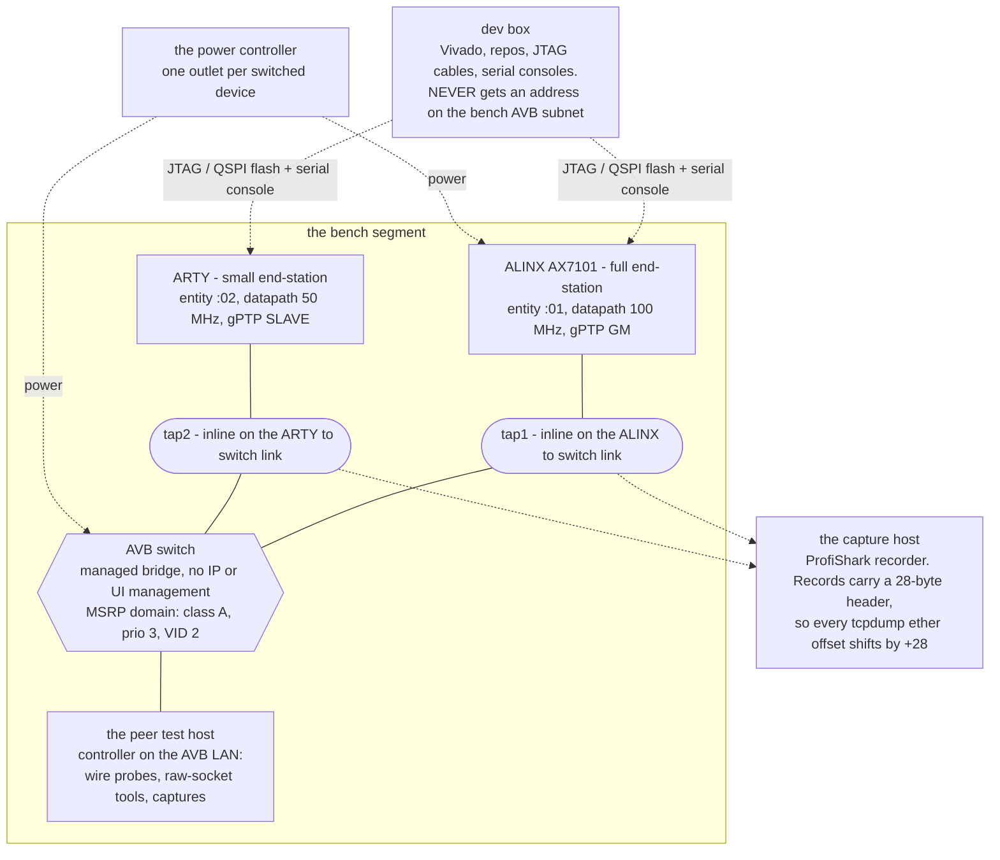
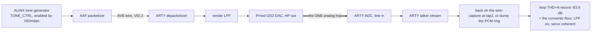
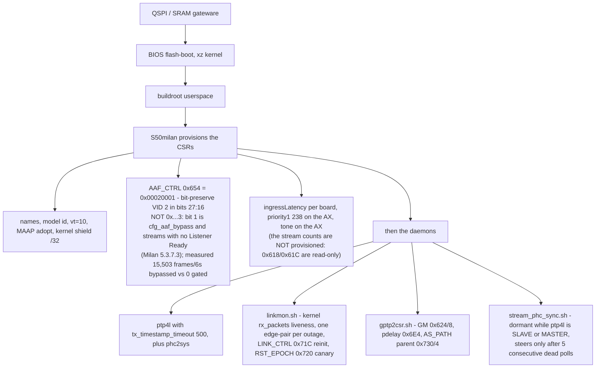

# BENCH TOPOLOGY & WHERE-IS-WHAT — the context-reset handover

Concrete bench values (hostnames, serials, IPs, outlet numbers) live in the private test repo's bench notes.

Written 2026-07-20 (post history-rewrite). This is the single document a
fresh session needs to operate the bench. Live campaign state is tracked
in the GitHub issues; the remaining compliance work is
[`docs/MILAN_COMPLIANCE_GAPS.md`](../MILAN_COMPLIANCE_GAPS.md). Naming rule: the conformance suite is
called **the bench suite** everywhere (commits, docs, comments) — never
any other name; its material is private (see §7).

## Contents

- **[0. The map](#0-the-map)** — Answers "where do I plug the analyzer": tap1 is inline on the ALINX link, tap2 on the ARTY link. The caveat that follows the picture is the useful bit — a tap sees one *link*, so traffic the switch drops crosses neither tap.
- **[1. Machines](#1-machines)** — Role and reach for every host, plus three facts that change what you can do: the dev box never gets an address on the AVB subnet, the switch has no IP or UI management at all, and capture records carry a 28-byte header so every `ether[]` offset shifts by +28.
- **[2. Boards (DUTs)](#2-boards-duts)** — The two DUTs side by side — entity ids, the FTDI serial and part each flash command needs, 50 vs 100 MHz datapath, and which one is grandmaster. Ends with the audio loop diagram and why −83.9 dB is the converter floor rather than a datapath limit: exactly one hop is analog.
- **[3. Consoles from the dev box](#3-consoles-from-the-dev-box)** — The serial↔FIFO daemon you must **recreate after a context reset**, and its three traps: output racing the read window, `dmesg -n 1` to unbury the console, and a foreground pipe wedging the shell.
- **[4. Repositories & artifacts](#4-repositories--artifacts)** — Which of the five trees holds what — gateware, bench/private, LiteX venv and build dirs, buildroot output, standards PDFs. Standing warning: both repos diverge from their GitHub origins, so any push needs `--force`.
- **[5. Build → flash → verify pipeline](#5-build--flash--verify-pipeline)** — The commands, copy-ready: 3-seed sweep, the per-board flash invocation with its environment, and the WNS ≥ 0 gate. Also the chronic non-error to ignore (`write_cfgmem SPI_BUSWIDTH` on ARTY) and the regression set required before any commit.
- **[6. Peer-host wire tooling (all sudo, iface enp6s0)](#6-peer-host-wire-tooling-all-sudo-iface-enp6s0)** — The probe scripts and what each one proves, the capture filters with the three multicast groups, and the full THD+N chain from tap capture or ring dump to a number.
- **[7. The bench conformance suite (PRIVATE — never in git, never pushed)](#7-the-bench-conformance-suite-private--never-in-git-never-pushed)** — The privacy rules, in force: `/private/` is never `git add`ed and only one name for the suite ever appears in committed text (a script enforces the deny-list). The score to beat is 63/63 scenarios per board.
- **[8. Board runtime (what runs where)](#8-board-runtime-what-runs-where)** — Power-on to streaming: boot order, everything `S50milan` provisions, the four daemons, and a CSR quick map. Two rules are buried here and cost real time — the `0x654` write must bit-preserve VID 2 or the switch floods the stream as best-effort, and a new plain-RW CSR missing from `is_plain_rw()` makes reads lie.
- **[9. State at handover (2026-07-21 morning - campaign closed)](#9-state-at-handover-2026-07-21-morning---campaign-closed)** — A dated snapshot of what was in each board's flash and what was open that morning. Read as provenance, not current state — it flags its own −73.4 dB figure as later superseded.
- **[10. Standing rules (violating any of these has burned us)](#10-standing-rules-violating-any-of-these-has-burned-us)** — Seven rules, each written after it was broken. Includes the one people get wrong at cleanup time: kill builds by output-dir match, because killing the Python parent leaves the Vivado child running.

## 0. The map

*Where do I plug the analyzer to see traffic from a given board?* Solid lines
are the AVB wire; dashed lines never carry stream traffic. Concrete values stay
out of the picture by rule — this is roles and links only.



So: **tap1 for anything the ALINX sends or receives, tap2 for the ARTY.** A tap
sees one link, not the segment — traffic between the ARTY and the peer host
crosses both taps, traffic the switch drops crosses neither.

## 1. Machines

| Name | Reach | Role |
|---|---|---|
| dev box (this host) | local | Vivado 2026.1 (the local Vivado install, 96 cores), repos, JTAG cables, board serial consoles. NEVER gets an address on the bench AVB subnet. |
| the peer test host (`peer-host`) | `ssh peer-host` | Test controller on the AVB LAN: `enp6s0` = `<peer-host-mac>` = `<peer-ip>`. Bench-specific subnet, role split: .1 = AX eth0, .2 = peer, .3 = ARTY. All wire probes run here (needs sudo for raw sockets + PACKET_MR_PROMISC — raw AVDECC tools MUST join promisc or responses are NIC-dropped). |
| the capture host (`capture-host`) | `ssh capture-host` | ProfiShark capture host. `<tap1-if>` = tap1 **inline on the ALINX↔switch link**; `<tap2-if>` = tap2 **inline on the ARTY↔switch link**. Records carry a **28-byte header**: all tcpdump `ether[]` offsets shift +28 (ethertype at `ether[40:2]`, SMAC at `ether[34:4]`); FCS included. |
| the power controller (`power-host`) | `ssh power-host` | Power strip: `powerstrip off/on <outlet>` — outlet numbers are bench-specific (one outlet = **the AVB switch**, another = AX7101 power; see the private bench notes). |
| a reserved bench host | — | **NEVER TOUCH** (standing rule). |
| AVB switch | **no IP/UI management** (USER 2026-07-22; the old ".1 ssh open" row was stale — .1 is now the AX's eth0) | Managed AVB bridge. clockIdentity `<bridge-clockidentity>`, port MAC toward AX `<bridge-port-mac>`. Claims gPTP priority1=246/cc248/acc0x20 (tap-read) — why boards run priority1=238 (USER default; ship posture 246\|248). MSRP Domain = class A, prio 3, **VID 2**. |

## 2. Boards (DUTs)

| | ARTY (small endstation) | ALINX AX7101 (full endstation) |
|---|---|---|
| Entity/board name | "ARTY", entity :02 | "ALINX", entity :01 |
| MAC / entity_id | 02:00:00:00:00:02 / 020000fffe000002 | 02:00:00:00:00:01 / 020000fffe000001 |
| IP (eth0) | `<board-ip>` (.3 on the bench subnet) | on the same /24 (read via console `ip -br addr`) |
| JTAG/flash | `--ftdi-serial <arty-ftdi-serial> -c digilent`, part xc7a100tcsg324 | `--ftdi-serial <ax-ftdi-serial> -c ft232`, part xc7a100tfgg484 |
| QSPI policy | **boot**: bitstream@0 + image set (16 MB) | **boot** since 2026-07-21 (USER "to flash use qspi"): bitstream@0 + images — the old kernel-clobber trap described the DEAD kernel@0 layout; the manifest-"full" map has a dedicated 4 MiB bitstream slot. JTAG-load remains the belt until the mode-pin self-config test is confirmed. |
| Datapath clock | 50 MHz | 100 MHz (timing-critical; the serial-MAC LPF exists because a combinational biquad fails here) |
| gPTP role | SLAVE (priority1 248 base cfg) | **GM** (S50 sed-REPLACEs priority1 → 238) |
| Serial console | `/dev/serial/by-id/<board-usb-serial>` (Digilent FT2232 channel B, `-if01-port0`) | `/dev/serial/by-id/<board-usb-serial>` (CP2102N, `-if00-port0`) |
| ssh | dropbear, root, no password — `ssh root@<board-ip>` **from the peer test host** (large-file path; console base64 fails) | same (find IP first) |

Audio loop: ALINX tone (S50 enables TONE_CTRL) → AAF → ARTY DAC (Pmod
I2S2 HP out, through the render LPF) → analog cable → ARTY ADC (line in)
→ ARTY talker stream → wire. Loop THD+N record −83.9 dB (LPF on, MMCM-DRP servo
coherent chain — the CS4344⊕CS5343 converter floor; the old −73.4 was NCO-era).

*Which hops of that loop are digital, and which single hop is analog?* The
answer is why the record is the converter floor and not the datapath's:



## 3. Consoles from the dev box

A tiny daemon per board bridges serial↔FIFO+log (session-scratchpad
based — after a context reset, RECREATE it):

```sh
S=<scratchpad>           # this session's scratchpad dir
# console_daemon.py (see below) + per board:
~/litex-milan/venv/bin/python3 $S/console_daemon.py <serial-by-id-path> $S/arty_in $S/arty.log &
mkfifo $S/arty_in first; same for ax. Then:
$S/con.sh arty '<shell cmd>' <wait-secs>     # types cmd, returns new log tail
printf 'root\n' > $S/arty_in                  # login (user root, no password)
```

`console_daemon.py`: opens the port at 115200, thread appends all RX to
the log, main loop forwards FIFO lines to TX. `con.sh`: record log size,
write cmd to FIFO, sleep, print the log delta. Traps: output races the
window (retry with bigger wait); `dmesg -n 1` unburies the console; a
foreground pipe wedges the shell (write ctrl-C to the FIFO).

## 4. Repositories & artifacts

| Path | What |
|---|---|
| `~/prjs-avb-on-fpga/milan-fpga` | THE gateware repo. `hdl/` RTL in standards-clause layout (ieee17221/{adp,acmp,aecp}, ieee1722/{avtp,aaf,crf,maap}, ieee8021q/{ts,srp,filtering}, ieee8021as/ptp_timestamp, milan/ tops, common/{csr,eth_event_counter,cdc}), `tb/verilator/*` (aecp 474, milan_dp 105, pcmlpf 7, + suites), `syn/yosys/run.sh` (device-portability gate), `sw/litex/` (milan_soc.py, **sweep.sh**, **build.sh** incl. the `flash` verb, deploy.sh), `avdecc/` (AEM JSON models + `gen_aem_store.py` → `hdl/ieee17221/aecp/gen/aecp_aem_rom.svh` + `milan_controller.py`), `docs/`. Author `hackerman-kl`, ONE-LINE commits, no trailers. |
| `~/the-private-test-repo` | Bench/test repo. `fpga/` (kl-eth driver, buildroot br2-external incl. the **rootfs overlay** = S50milan, linkmon.sh, gptp2csr.sh, stream_phc_sync.sh, gptp.cfg, S65/S66), `fpga/tests/` (tone_thdn.py, pcm_ring_dump.c, silicon_battery.py), `fpga/dts+boot/` (dtb + opensbi per board), `private/` (**untracked, git-ignored**: the bench conformance suite + its reference run — see §7). Commits: author `hackerman-kl` (USER 2026-07-22, both repos), one line, no trailers. |
| `~/litex-milan` | LiteX + venv (`~/litex-milan/venv` — PATH needed for build/flash python). **`work/`** = all Vivado build dirs (`build_<board>_<seed>_<tag>/`). |
| `~/br-milan-output` | Buildroot out-tree. Rebuild rootfs: `cd ~/br-milan-output && make O=$PWD && xz -9 --check=crc32 -c images/rootfs.cpio > /tmp/scratch/rootfs.cpio.xz`. Kernel `images/Image` (xz it for flashing). |
| the private pre-rewrite backups (off-repo) | Pre-history-rewrite bundles + the private-material tar. KEEP PRIVATE. |
| the local standards PDFs (`$STANDARDS_DIR`) | All specs: 1722.1-2021.pdf, 1722-2016, Milan v1.2 consolidated, 802.1AS/Q, the official validation test plan, etc. Extracted text: `/tmp/scratch/1722.txt`, `milan12.txt`, `certplan.txt` (re-extract with pdftotext after reboot). |
| `~/refs/AX7101` | Board reference repo (schematic, flash + PHY datasheets). Read-only. |

**Both repos DIVERGE from their GitHub origins** (2026-07-20 history
rewrite). Push ONLY when the user asks — needs `--force`.

## 5. Build → flash → verify pipeline

```sh
# 3-seed Vivado sweep (3 parallel instances × 32 threads = the box rule)
cd ~/prjs-avb-on-fpga/milan-fpga && ./sw/litex/sweep.sh <arty|ax7101> <tag>
# WNS: grep -B2 -A6 "Design Timing Summary" ~/litex-milan/work/build_*_<tag>/gateware/*_timing.rpt
# Gate: WNS >= 0. Pick best seed.

# ARTY (QSPI boot: bitstream + images):
PATH="$HOME/litex-milan/venv/bin:$PATH" PYTHON="$HOME/litex-milan/venv/bin/python3" \
KERNEL=/tmp/scratch/Image.xz ROOTFS=/tmp/scratch/rootfs.cpio.xz \
OPENSBI=~/the-private-test-repo/fpga/boot/opensbi_arty.bin \
DTB=~/the-private-test-repo/fpga/boot/milan_arty_vexii.dtb \
./sw/litex/build.sh flash arty:build_arty_<seed>_<tag>
openFPGALoader --ftdi-serial <arty-ftdi-serial> -c digilent --reset   # then ~100 s boot

# AX (QSPI boot since 2026-07-21: bitstream@0 + images, one verb):
KERNEL=... ROOTFS=... OPENSBI=~/the-private-test-repo/fpga/boot/opensbi.bin \
DTB=~/the-private-test-repo/fpga/dts/milan_ax7101_linux.dtb \
./sw/litex/build.sh flash ax7101:build_ax7101_<seed>_<tag>
# JTAG-load the same bit for the immediate session (belt until the
# mode-pin self-config question is settled by an openFPGALoader --reset):
openFPGALoader --ftdi-serial <ax-ftdi-serial> -c ft232 --fpga-part xc7a100tfgg484 \
  ~/litex-milan/work/build_ax7101_<seed>_<tag>/gateware/alinx_ax7101.bit
```

Known chronic non-error: arty builds print a `write_cfgmem SPI_BUSWIDTH`
failure after the .bit — harmless, our flow flashes the .bit directly.

Regression before any commit: aecp + milan_dp + pcmlpf TBs green,
`./syn/yosys/run.sh` = `RESULT: PASS` (check it REALLY passed — a piped
tail can eat the exit code).

## 6. Peer-host wire tooling (all `sudo`, iface `enp6s0`)

| Tool | Purpose |
|---|---|
| `/tmp/milan_controller.py` | Entity(iface) with discover (cdl=56!), read_descriptor, `_aecp`, ACMP helpers. The repo master: `milan-fpga/avdecc/milan_controller.py`. |
| `/tmp/dyninfo_probe.py <01\|02>` | GET_DYNAMIC_INFO (7.4.76) batch vs classic responses, byte-exact + BAD_ARGUMENTS case. Expect PASS on ≥ mf38/AX23 silicon (mf37 had the BSCAN race). |
| `/tmp/crf_inject.py [n]` | 500 Hz Milan CRF source (subtype4/type1/48k/ival96), sid = peer-host MAC + `0001`, synthetic exact-2ms timestamps (CRF_RATE reads ≈0). Provision the DUT: CRF_SIDLO/HI + CTRL en, watch 0x744-0x74C + lock. |
| `/tmp/ctr.py` | STREAM_INPUT counters snapshot (LOCKED/UNLOCKED/RESET/UNCERT) — the media-health detector. |
| runner scripts → see §7 | conformance suite runners. |
| capture | `tcpdump -i enp6s0 ether proto 0x22f0` (AVTP/AVDECC). AECP is unicast; ADP/ACMP multicast 91:E0:F0:01:00:00; MAAP 91:E0:F0:00:FF:00. |

THD+N: capture the stream at a tap (`pcap2s32.py` in /tmp/scratch
strips ProfiShark+VLAN, extracts S32BE), or `pcm_ring_dump --ring
0x4ff00000 --bytes N` on the ARTY (ring only in the ARTY DT! `--secs`
segfaults) → scp via the peer host → `tone_thdn.py --chans 2 --f0 1000`.

## 7. The bench conformance suite (PRIVATE — never in git, never pushed)

- `~/the-private-test-repo/private/recreate` = the behave conformance-recreation
  suite (features es-2.1…es-4.13, hive-counters, link-flap; steps, pdu
  lib, tools-la-avdecc probe). `private/official-run` = the reference run
  results. `/private/` is git-ignored; **never `git add` it**; the only
  name for it in any committed text is **the bench suite**.
- Runners live on the peer test host under the suite's legacy-named home
  directory + venv, driven by two /tmp run scripts (DUT :02 = the plain one,
  DUT :01 = the -alinx one) — peer-host-local paths, not in any repo; the
  EXACT paths are in the session memory index (private), or list the suite's
  home directory + `/tmp/run*` on the peer host. Link-flap helpers:
  `~/bin/arty-linkflap.sh`, `~/bin/ax-linkflap.sh` (phy_crg_reset
  0xf0003800 via console). la_avdecc lib+probe: `~/la_avdecc-{src,build,probe}`
  (counters-probe expects ENTITY GET_COUNTERS = SUCCESS+empty).
- Score to beat: **63/63 scenarios per board** (bench suite; ship pair
  ARTY `asl_milanfinal53e` (VERSION 0x000A) + ALINX `AX39`; the suite grew past
  the earlier 43/43 on asl_mf35 + eppo_AX21).

## 8. Board runtime (what runs where)

Boot: QSPI/SRAM gateware → BIOS flash-boot (xz kernel) → buildroot →
`S50milan` provisions CSRs (names, model id, vt=10, MAAP adopt, kernel
shield /32, **AAF_CTRL 0x654 = 0x00020001 — bit-preserve VID 2 [27:16]
or the switch floods the stream as best-effort. NOT `0x00020003`: bit 1 is
`cfg_aaf_bypass`, which ORs past BOTH qualifying terms of the admission gate,
so the talker streams whether or not any Listener Ready is registered. Milan
v1.2 5.3.7.3 conditions streaming on "declaring a Talker Advertise attribute
**and receiving a Listener Ready or Listener Ready Failed attribute**"; the
repo's own paraphrase of that clause read as an unconditional "a Stream Output
SHALL NOT be stopped" and is what licensed the bypass. Measured 2026-07-28:
with bit 1 set and nothing bound, 15,503 tagged AAF frames in 6 s; cleared, 0 —
while MSRP TalkerAdvertise/Domain continue either way, so 5.3.7.2 is intact**,
ingressLatency sed
3511(ARTY)/1490(AX) ns, priority1 238 on
AX, tone on AX) → daemons: `ptp4l` (tx_timestamp_timeout **500**),
`phc2sys`, `linkmon.sh` (kernel rx_packets liveness, one edge-pair per
outage, up-after-settle, LINK_CTRL 0x71C reinit, RST_EPOCH 0x720
canary), `gptp2csr.sh` (GM 0x624/8 — publishes LOCAL ckid when we are
GM; pdelay 0x6E4; AS_PATH parent bridge 0x730/4 from PARENT_DATA_SET),
`stream_phc_sync.sh` (dormant while ptp4l is SLAVE **or MASTER**; only
steers after 5 consecutive dead polls — earlier versions caused the
~100 s media-unlock cycle).

*What runs, in what order, between power-on and a provisioned streaming board?*



CSR quick map (base 0x90000000, addresses = offsets): 0x600 ADP ctrl ·
0x60C/0x610 model id · 0x618/0x61C caps+counts (**RO**, elaborated) · 0x624/0x628 GM ·
0x654 AAF_CTRL {vid[27:16],bypass,en} · 0x680 lwSRP · 0x6A4 ACMP-L state
· 0x6B8/0x6BC/0x6C0 RX monitor stat/frames/err · 0x6C4/0x6C8 PCM ring ·
0x6CC-0x6D4 MAAP · 0x6D8 drift rails · 0x6DC TONE · 0x6E4 pdelay ·
0x6EC ts_delta · 0x71C LINK_CTRL · 0x720 RST_EPOCH · 0x724/0x728
ENT_NAME · 0x72C LPF_CTRL (default 1) · 0x730/0x734 AS_PATH parent ·
0x738-0x74C CRF {ctrl+locked@31, sid lo/hi, delta, rate, status}.
New plain-RW CSRs MUST be added to `is_plain_rw()` in milan_csr.sv or
reads lie (shadow).

## 9. State at handover (2026-07-21 morning - campaign closed)

- **ARTY QSPI = `eppo_milanfinal41` (+0.078) + rootfs #8**: 0x4B
  byte-exact PASS, bench suite 63/63, sink-1 chain proven, CRF rx proven.
  `mf42` (format-family parity, e3391d9) is the one pending ARTY spin -
  flash it when built, re-check dyninfo + READ_DESCRIPTOR formats.
- **ALINX QSPI-BOOT = `eppo_milanfinal30` (+0.026) + rootfs #8** (first
  closing AX after 7 rounds; L2 32K, sweep always 1-hart): 0x4B PASS,
  bench suite 63/63, CRF talker LIVE (500.3 PDU/s, DMAC = MAAP claim+1),
  **CRF e2e locked at the ARTY, RATE +6.7 ppm**. JTAG-loaded + QSPI
  written; the --reset self-config test tells whether the mode pins
  boot it standalone.
- The bench suite = 63 scenarios (private/recreate snapshot
  <recreate-snapshot-20260721>); tap helpers gptp_cadence.py + srp_domain.py
  on the capture host; es-4.5 self-quiesces (poll, no fixed sleeps).
- Loop CLOSED 07-21: -73.4 dB (record *that date*, NCO-era) x3 on mf42+AX30, both
  channels, LPF A/B flat — **later superseded by the MMCM-DRP servo at −83.9 dB**
  (converter floor); the night's -2.8 was a lapsed-bind + capture artifact
  (I2SPB_DBG decode = (word>>7)&0xFFFFFF — LRCK-aligned window shows
  the Philips 1-bit delay; re-bind + `tcpdump -B 16384` before
  measuring; THD on the longest seq-gap-free run only).
- Open for the day shift: switch gPTP claim for the es-1.1/1.2 BMCA variants,
  gaps-doc deferred list (MMCM-DRP servo actuator [**since BUILT + silicon-proven
  −83.9 dB**], 2nd lwSRP attr, GMII CDC reinit, 8ch render, class-B, shadow
  invalidate, pcm_ring_dump segv, kl-eth tx-stamp latency). Note: the PCM ring can
  now also target on-chip BRAM (`--pcm-ring bram`); DRAM ring stays the default.
- Bench-tooling fragilities learned tonight: arty-linkflap.sh drives
  the SESSION console (a login race eats the flap - verify SHELL-OK
  before suite runs); background flashes need ABSOLUTE paths; `timeout
  N sudo tcpdump` leaves the root child alive; tagged-stream tap
  filters = ether[44:2].

## 10. Standing rules (violating any of these has burned us)

1. The reserved bench host is untouchable; the dev box never joins the bench subnet.
2. AX QSPI-boot works since 2026-07-21 (see §2: bitstream@0 + images) — this
   supersedes the old "AX QSPI never receives a bitstream / always JTAG-reload"
   rule; JTAG-reload remains the belt until the mode-pin self-config `--reset`
   test is confirmed. Every openFPGALoader call carries the right `--ftdi-serial`.
3. Commits: one line, no trailers; milan-fpga = hackerman-kl,
   the-private-test-repo = the Alexandre Malki identity. Push only on request
   (and remember: force-push after the rewrite).
4. Max 3 parallel Vivado; WNS ≥ 0 or it doesn't ship. Kill builds by
   output-dir match (killing python parents leaves vivado children).
5. New HDL is SystemVerilog in the house style; CBS shaper is never
   removed; measure-don't-assume (HW counter before any conclusion).
6. Bench-suite naming + `/private/` rules of §7. Neither the suite's
   former external name nor any conformance-program name appears in
   committed text (`scripts/docs_check.py` enforces the deny-list).
7. The 0x654 write preserves VID 2; new RW CSRs go into is_plain_rw;
   validate wire frames by LENGTH, not just header fields.
