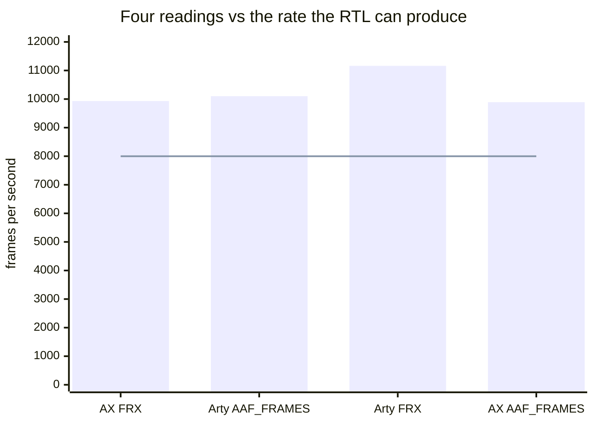
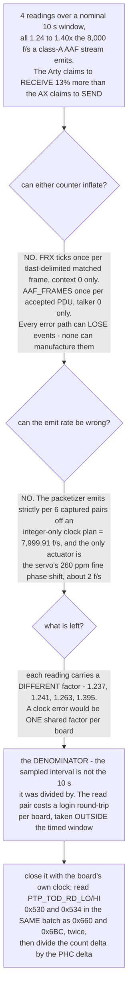

# Live bench campaign — 2026-07-26

Read-only health and function sweep of both boards plus the controller host,
run after the 0x000F–0x0013 landings that closed the fabric-listener blocker.
**Nothing here was reflashed**: both boards carry earlier gateware, so this is a
regression and health baseline for what *is* deployed, not a test of the
freshly landed RTL.

Roles (see [`BENCH_TOPOLOGY.md`](BENCH_TOPOLOGY.md) for the map):

| role | board | flashed VERSION | uptime at test |
|---|---|---|---|
| listener + talker | AX7101 (8×8 shape) | `0x0001_000B` | 21.6 h |
| listener + talker | Arty (4×4 shape) | `0x0001_000A` | 79.7 h |
| controller host | x86 host, media stack | — | 13.3 h |

## Contents

- **[Verdict](#verdict)** — The whole sweep as one table: every quantity read, on which board, and what it means. Headline is both boards healthy and streaming both ways, with zero format errors and zero timestamp-uncertain.
- **[What was confirmed](#what-was-confirmed)** — Five results with their numbers: the AX is grandmaster, each board is bound to the other's stream, the entry-0 listener workaround was **still armed 21 h later**, ~2 G frames carry 0 format errors, and a 3 s capture returned exactly 1,152,000 bytes. Also the trap that will waste your afternoon: the card takes `S32_BE` only, and `S32_BE` cannot go in a WAV container, so captures must be `-t raw`.
- **[The frame-rate arithmetic does not close — and the RTL says why not](#the-frame-rate-arithmetic-does-not-close--and-the-rtl-says-why-not)** — The most useful section on the page: four rate readings that are all 1.24–1.40× the only rate this packetizer can physically emit (7,999.91 f/s), and the elimination that follows — neither counter can inflate, the clock plan is integer-only, so the *denominator* is wrong. Ends with the measurement that would settle it: read the PHC in the same batch as the counters and divide by Δ(PHC ns).
- **[Confirmed-still-broken (already known, now observed live)](#confirmed-still-broken-already-known-now-observed-live)** — Two known defects caught in the act: the `0x200` RMON group reading a clean zero, and a netdev reporting `speed = -1` while its own `MAC_STATUS` has the right answer. Both are fixed in RTL and both are waiting on a flash.
- **[Observed and explained, not a fault](#observed-and-explained-not-a-fault)** — A 100× `rx_dropped` asymmetry that is *not* a bug: control-plane multicast arriving with no socket to receive it. Dropped is not errored, and the stream never traverses that path — the prefilter is why the board accepted 152.7 M AVTP frames while its netdev saw 1.86 M packets.
- **[Controller host](#controller-host)** — A state observation, not a finding: the host media stack and its time daemon are up, but no Milan node is in the graph because the ring source is not loaded.
- **[What this campaign could NOT test](#what-this-campaign-could-not-test)** — The version-by-version ledger of everything sitting behind one Vivado build and a flash, `0x000F` through `0x0013`, and which of this campaign's observations each one would have changed.

## Verdict

**Both boards healthy and streaming bidirectionally.** No kernel errors on
either, no MAC errors, no CRC errors, gPTP converged, and a live audio capture
off the listener is bit-plausible and correctly sized.

The whole sweep on one page — *what was read, on which board, and what it says.*
A dash means the sweep did not read that quantity on that board.

| what was checked | AX7101 | Arty | reading |
|---|---|---|---|
| gPTP role | **grandmaster** (its own entity ID) | synced to the AX | healthy two-node domain |
| bound stream | listens to `0x0200_0000_0002_0000`, route `DMA` | listens to `0x0200_0000_0001_0000`, route `RENDER \| DMA` | both directions live, both talkers emitting |
| AVTP frames accepted | 152.7 M | 1.95 G | both accepting |
| SEQ_NUM_MISMATCH | 11 | 51,523 | 7 × 10⁻⁸ vs 2.6 × 10⁻⁵ — and the Arty's is a **truncating** 16-bit field on this gateware, so a floor |
| UNSUPPORTED_FORMAT | **0** | **0** | wire format is right |
| TIMESTAMP_UNCERTAIN | **0** | **0** | presentation timestamps are right |
| kernel / MAC / CRC errors | 0 | 0 | clean |
| entry-0 listener workaround | still armed 21 h later, `A_STRMW_CTRL` = `0x3` | — | stable across a long soak |
| RMON group `0x200` | dead, reads zero | dead, reads zero | known root cause, fixed in RTL, awaiting a flash |
| netdev link speed | — | reports `-1` while `MAC_STATUS` reads 100 Mb/s | the `REQ-MAC-03` gap, SoC-glue half unfixed |
| `rx_dropped` | 18.4/s | 0.18/s | control-plane multicast with no socket — dropped, not errored |
| live capture | 1,152,000 B for a 3 s capture, exact to the byte | — | no under-runs, no short reads |

## What was confirmed

### gPTP domain is converged, and the AX is grandmaster

Both boards report the **same** grandmaster identity, and it is the AX's own
entity ID — so the AX is GM and the Arty is synced to it. That is a healthy
two-node domain and it matches the long-standing finding that the switch never
masters into the board ports.

### The two boards stream to each other

Read through the `0x800` window with SNAP discipline:

| board | listens to stream_id | route |
|---|---|---|
| AX | `0x0200_0000_0002_0000` (the Arty's MAC + uid 0) | DMA |
| Arty | `0x0200_0000_0001_0000` (the AX's MAC + uid 0) | RENDER \| DMA |

Both directions are live and both talkers are emitting (`AAF_FRAMES` ticking on
each).

### The listener-blocker workaround persists

The AX's entry-0 override — staged sid + `CTRL = 0x3`, applied earlier the same
day — was **still armed 21 h later** (`A_STRMW_CTRL` reads `0x3`, sid intact)
and the listener is still accepting: `AVTPRX_FRX` = 152.7 M and climbing
~14 k/s under the tick test. The workaround is stable across a long soak, not a
momentary poke. (The RTL fix that makes it unnecessary is `VERSION 0x000F`,
which is not on either board yet.)

### Stream quality is clean

`AVTPRX_ERR` decodes as `[31:16]` SEQ_NUM_MISMATCH, `[15:8]` UNSUPPORTED_FORMAT,
`[7:0]` TIMESTAMP_UNCERTAIN:

| board | frames accepted | seq gaps | format errors | ts-uncertain |
|---|---|---|---|---|
| AX | 152.7 M | 11 | **0** | **0** |
| Arty | 1.95 **G** | 51,523 | **0** | **0** |

Zero format errors and zero timestamp-uncertain on nearly **two billion** frames
is the meaningful result: the packetizer, the wire format and the presentation
timestamps are right. The only defects are sequence gaps, at 7 × 10⁻⁸ (AX) and
2.6 × 10⁻⁵ (Arty ≈ 0.18/s). Note SEQ_NUM_MISMATCH is a 16-bit field and the
Arty's count is approaching its ceiling — treat it as a floor, not an exact
count, on a long-lived board. On the flashed gateware that "floor" was wishful:
the field **truncated**, so past 65,535 it would have counted up from zero again
and a worsening link would have read as a healing one. From VERSION `0x0013` it
**saturates** (all-ones = "at least this many") and the honest full-width value
lives at `A_STRMW_CNT` `0x83C`.

### Live audio capture works

On the AX, `hw:0,0` presents as *"Milan AVB streams … 1 capture"*. A 3-second
capture returned **exactly 1,152,000 bytes** = 48000 × 3 × 2 ch × 4 B — the
expected size to the byte, so no under-runs and no short reads. Content is not
silence: 49,069 of the first 65,536 bytes nonzero, and **256 distinct byte
values**, i.e. full range rather than a stuck pattern.

**Format trap worth recording:** the card accepts **`S32_BE` only** — AVTP wire
byte order. `S32_LE` is rejected outright, and `S32_BE` cannot go into a WAV
container (`arecord` refuses), so a capture must be `-t raw`. The working
command is:

```sh
arecord -D hw:0,0 -t raw -f S32_BE -c 2 -r 48000 -d 3 /tmp/cap.raw
```

## The frame-rate arithmetic does not close — and the RTL says why not

The tick test also recorded, over a nominal 10 s window:

| direction | receiver `AVTPRX_FRX` | peer talker `AAF_FRAMES` |
|---|---|---|
| Arty → AX | AX **9,930/s** | Arty **10,102/s** |
| AX → Arty | Arty **11,162/s** | AX **9,892/s** |

Two things are wrong with that table. One class-A AAF stream at 48 kHz with
6 samples per frame is **8,000 frames/s**, and every figure is 1.24-1.40× that;
and the Arty claims to *receive* 13 % more frames than the AX claims to *send*.

*How far is each reading from the only rate this packetizer can physically
emit?* The line is 7,999.91 f/s — the integer-only clock plan's own answer,
derived below.



**Read out of the RTL, both counters are frame-exact and neither can inflate.**
`AVTPRX_FRX` (`0x6BC`) increments once per `tlast`-delimited AVTP stream-subtype
frame whose 64-bit `stream_id` matched an enabled stream-table entry *and* whose
AAF header matched the bound format — the parser latches `parsed` on the header
beat and clears it only at `tlast`, the match loop yields exactly one index, and
the monitor's event queue drops rather than duplicates when it is full. It is
also **context 0 only** (a write-through mirror of stream 0's context words), so
a wider build cannot sum extra streams into it. `AAF_FRAMES` (`0x660`) likewise
increments once per PDU whose last beat was *accepted* by the TX AXIS, for
talker 0 only. Every error path in both counters can lose events; none can
manufacture them. So `FRX ≤ AAF_FRAMES` must hold on a lossless link, and the
observed inversion cannot come from the fabric.

The rate is pinned too. The packetizer emits strictly per 6 captured pairs (no
timer, no fill threshold), and pairs arrive at the I2S capture rate
`clk_audio / 512`, where `clk_audio` is an **integer-only** two-stage plan
(100 MHz → 31.081081 MHz → 24.575739 MHz) on both boards. That is
`fs = 47,999.49 Hz` ⇒ **7,999.91 frames/s**, and the only actuator on it is the
media-clock servo's fine phase shift, whose ceiling is 260 ppm (≈ ±2 frames/s).
No configuration in this tree's history produces 9,892 or 10,102 frames/s — and
note the old 48,828.125 Hz "pumping" divider is not in this path at all.

**What is left is the denominator.** Each of the four readings is a *different*
factor (1.237, 1.241, 1.263, 1.395); a clock error would be one shared factor
per board, and the ratio of the two inflation factors, 1.395/1.237 = **1.128**,
is exactly the "13 %" — i.e. the asymmetry is the difference between the two
boards' sampling overheads, not a frame-count difference. A per-reading scatter
of ±6 % on a counter that is frame-exact by construction is the signature of a
sampling interval that is not the 10 s it is divided by (the read pair costs a
login round-trip per board, taken outside the timed window). The same skew is
already recorded elsewhere in this tree: an earlier session logged 12.5 k/s,
16.6 k/s and 9.6 k/s for the same steady stream, and its "sustained 5 s" sample
is 47,973 frames = **exactly 6.00 s** of 8,000/s traffic.

*Why does the denominator take the blame rather than the counters or the clock?*



**This is a diagnosis, not a proof** — the RTL cannot tell us what wall-clock
interval a host script used. The measurement that would close it uses the
board's own clock as the denominator: read `PTP_TOD_RD_LO/HI` (`0x530`/`0x534`)
in the *same* batch as `0x660`/`0x6BC`, twice, and divide Δcount by Δ(PHC ns).
Two cross-checks come free: `AAF_PAIRS` (`0x664`) ÷ `AAF_FRAMES` must be exactly
6.000, and on a reflashed board `APRB_PARSED`/`APRB_MATCHED` (`0x8B4`/`0x8B8`)
localise any real inflation to the wire rather than the counter.

## Confirmed-still-broken (already known, now observed live)

* ~~**RMON counters are dead on both boards.**~~ The `0x200` group reads zero
  and does not tick. This was the 2026-07-22 root cause — `i_mac_events` tied to
  `0` in SoC glue — **fixed in RTL 2026-07-26** (VERSION `0x0013`): the tie is
  gone, `KL_mac_rmon_events` derives the pulses at the MAC boundary, and the
  lanes that genuinely have no source now say so in `STATS_CAP` (`0x204`)
  instead of reading as a clean zero. Still pending a flash, like everything
  else below.
* **The Arty's netdev reports `speed = -1`** while its own `MAC_STATUS` reads
  100 Mb/s correctly (`[2:1] = 01`). That is exactly the `REQ-MAC-03` gap: the
  CSR now derives `is_1g` from the real speed, but [`sw/litex`](../../sw/litex) still ties the
  link/speed inputs to constants and nothing populates the driver's view. The
  fix for the CSR half landed in the 0x000F–0x0013 set; the SoC-glue half did not.

## Observed and explained, not a fault

`rx_dropped` differs by 100× between the boards — AX **18.4/s**, Arty
**0.18/s** — with `rx_errors = 0` and `rx_crc_errors = 0` on both. The AX rate
matches control-plane multicast the host receives but has no socket for
(gPTP ~8-16/s, plus ADP, MAAP and the MRP pair). Dropped is not errored, and the
AVB stream itself does not traverse that path — the AX accepted 152.7 M AVTP
frames while its netdev saw only 1.86 M packets, which is the prefilter working
as intended. The asymmetry between boards is unexplained and low-priority.

## Controller host

The host media stack (3 processes) and its session manager are up, the host time daemon is running with
`/dev/ptp0` present, and both boards are reachable. **No Milan node is present
in the host media graph** — the ring source is not loaded at the moment.
That is a state observation, not a fault; the capture path on the board is what was
exercised above.

## What this campaign could NOT test

Everything the 0x000F–0x0013 landings built, because **neither board has been reflashed**: the
listener fix (`0x000F`), the lwSRP row sizing and per-stream TSpec (`0x0010`),
the six-queue egress map (`0x0011`), DMAC-based control classification
(`0x0012`), the playback chain, the persistence journal and the CTF trace. All
of it is gated behind one Vivado build and a flash.

*Exactly what is sitting behind that flash?*

| VERSION | what it brings | where it would have changed this campaign |
|---|---|---|
| `0x000A` | **what the Arty is actually running** | — |
| `0x000B` | **what the AX is actually running** | — |
| `0x000F` | fabric-listener fix — the staging set is tagged with the index it was staged for | retires the entry-0 override workaround the AX is leaning on |
| `0x0010` | lwSRP row sizing + per-stream TSpec | not exercised here |
| `0x0011` | six-queue egress map | not exercised here |
| `0x0012` | DMAC-based control classification | not exercised here |
| `0x0013` | RMON pulses derived at the MAC boundary + honest `STATS_CAP`; SEQ_NUM_MISMATCH **saturates** instead of truncating, full width at `A_STRMW_CNT` `0x83C` | both "confirmed-still-broken" rows above, and the Arty's 51,523-gap ceiling |

Not version-tagged above, and equally unflashed: the playback chain, the
persistence journal and the CTF trace.
