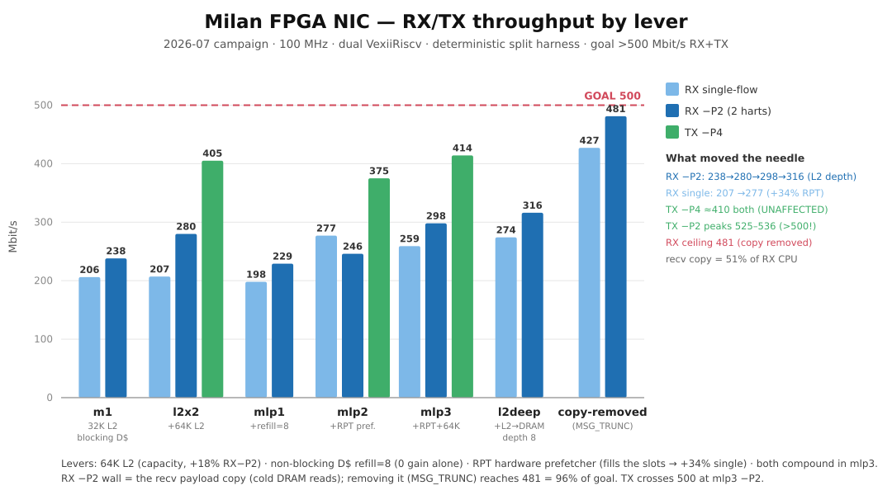
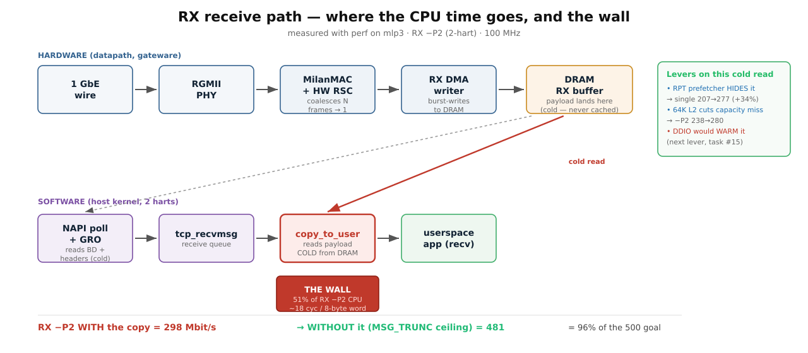
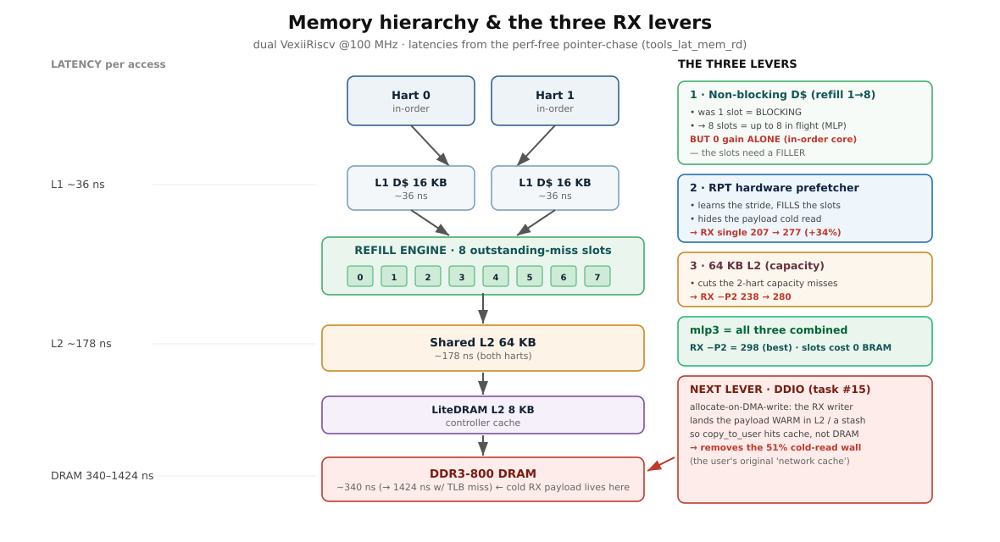
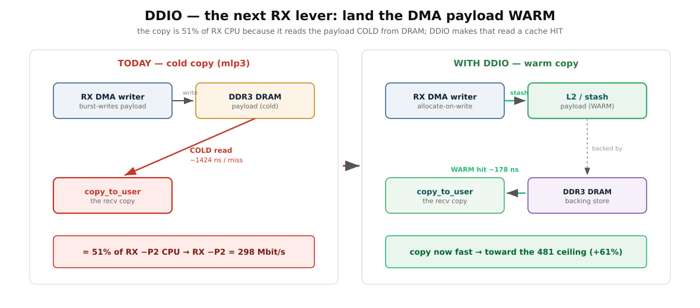

# Throughput goal  -  >500 Mbit/s RX *and* TX, reach for 1 Gbit/s

> 📌 **CAMPAIGN CLOSED 2026-07-10/11 (header-split zero-copy RX).** This doc is the consolidated
> campaign **record**; every number in it is a **2-hart perf-campaign** measurement — the
> **ship shape is 1-hart + `--l2-bytes 32768`**, so these are perf-lineage records, not the
> shipped configuration. The per-lever ledger is [`../CHANGELOG.md`](../../CHANGELOG.md); the
> as-built datapath is [`../fpga/PIPELINE_STAGES.md`](../fpga/PIPELINE_STAGES.md); the profiling
> method is [`PERF_ON_MILAN.md`](PERF_ON_MILAN.md); the memory root cause is
> [`LATENCY_INVESTIGATION.md`](LATENCY_INVESTIGATION.md). **DDIO was REFUTED** — the copy tax
> was removed by header-split, not DDIO.
> Consolidated 2026-07-25: this file absorbed [`RX_TX_PERFORMANCE.md` (archived)](../../historical_now_obsolete/findings/RX_TX_PERFORMANCE.md) (the plain-language RX
> story + diagrams) and [`GIGABIT_HEADROOM_ANALYSIS.md` (archived)](../../historical_now_obsolete/findings/GIGABIT_HEADROOM_ANALYSIS.md) (the cycles/byte budget model); the
> originals are archived under [`historical_now_obsolete/findings/`](../../historical_now_obsolete/README.md).

## Contents

- **[Final scoreboard — reconciled at campaign close (2026-07-11)](#final-scoreboard--reconciled-at-campaign-close-2026-07-11)** — **Start here.** Three documents used to freeze this campaign at three different dates with conflicting numbers; this is the one reconciled table, with the close-out method spelled out. Verdict: both directions crossed 500, and socket `recv()` closed at 381/374 — the residual is the kernel socket API, not the silicon.
- **[⚡ FORCED-MARCH RESULTS (2026-07-09 evening  -  R1 refuted, R2 LANDED, R3 in flight)](#-forced-march-results-2026-07-09-evening-----r1-refuted-r2-landed-r3-in-flight)** — Frozen mid-flight, with outcomes annotated after the fact. R1 refuted *with a mechanism* (a structural ~1 ms kernel window-cycle at 100 MHz), R2 doubled the no-copy ceiling to 925. The most reusable part is the transient-vs-steady correction: short cells are slow-start-flattered, so sustain claims now require the peer-side time-series.
- **[The goal](#the-goal)** — Two sentences of target, and the framing the rest depends on: the 64-bit datapath has 6.4 Gbit/s of raw bandwidth, so 1 Gbit/s is a *system* problem — per-frame CPU cost, DMA and memory latency — never a wire limit.
- **[Where we stood (measured on silicon, 2026-07-09  -  waypoint; final numbers in the scoreboard at top)](#where-we-stood-measured-on-silicon-2026-07-09-----waypoint-final-numbers-in-the-scoreboard-at-top)** — A dated waypoint table whose **footnotes carry the real content**: TX reader prefetch refuted by probe data, the CBS default-shaping root cause (with a 2026-07-27 banner marking its literals as four-queue-era), both RX overload wedges root-caused in sim, and the L2/refill/RPT lever chain.
- **[The path to RX > 500 (forced march  -  each phase gated by silicon numbers; 2026-07-09 plan, executed)](#the-path-to-rx--500-forced-march-----each-phase-gated-by-silicon-numbers-2026-07-09-plan-executed)** — The plan, and its budget logic in one line: `RX = min(ceiling, ceiling − copy-tax)`, so 500 needs *both* a higher ceiling and a smaller copy. Each of the three phases carries an explicit numeric gate and a stated fallback if it misses.
- **[R0 baseline (signed, 2026-07-08, build_dp100_m1 WNS +0.056  -  CAMPAIGN_500_PLAN)](#r0-baseline-signed-2026-07-08-build_dp100_m1-wns-0056-----campaign_500_plan)** — The signed 12-cell starting matrix. What it decided: parallel RX pays a measured famine-plus-retransmit tax and a 58 % park-close tax, and the close-reason counters were built precisely so that call did not have to be guessed.
- **[R1 result (2026-07-08, build_dp100_m1, hash_sel=0  -  2-queue fan-out LIVE)](#r1-result-2026-07-08-build_dp100_m1-hash_sel0-----2-queue-fan-out-live)** — The fan-out works, and the old "RxSteer hangs at 100 MHz" was the wedges all along. Benchmark hygiene note worth keeping: results are bimodal on the 4-tuple hash — two flows collide about half the time, so use ≥4 flows or controlled source ports. The 238 cap is both harts at 99–100 %.
- **[T1 result  -  CORRECTED (2026-07-08): TX 452, gate ≥420 MET](#t1-result-----corrected-2026-07-08-tx-452-gate-420-met)** — The correction is the lesson: the first sweep's peer-side `ethtool -C` never applied at all (it needs sudo and the errors were suppressed), so a whole knob was "measured" against a constant. The genuine sweep shows the peer knob is mild and the real levers were board-side.
- **[T1 result (2026-07-08, build_dp100_m1  -  TX gate ≥420 MET at 417)](#t1-result-2026-07-08-build_dp100_m1-----tx-gate-420-met-at-417)** — The original notes, kept beneath their own correction. Still the record of the lever itself: the never-measured peer-side coalesce zone, and the board `rx-usecs` ladder 500→1k→2k that scaled TX 236→352→417.
- **[Phase X MEASURED (2026-07-08)  -  clock uplift REFUTES the linear projection](#phase-x-measured-2026-07-08-----clock-uplift-refutes-the-linear-projection)** — 112.5 MHz reached on silicon, and a projection killed: +12.5 % of clock bought +4 % (−P4) and +8 % (single). The structural reason is that `--milan-clk-freq` leaves the datapath at 100 MHz, so neither direction reaches 500 by clock alone.
- **[Phase X status + T2 latency decomposition (2026-07-08)](#phase-x-status--t2-latency-decomposition-2026-07-08)** — The RTL win banked (one `stream.Buffer` stage cut every violator out of the TX reader's cone) against a boot failure (QSPI CRC at the higher sys clock). Then latency decomposed: threaded NAPI off removes 0.65 ms, ~1.0 ms remains unexplained — and since TCP runs 0-retr and CPU-pegged, latency is *not* the blocker.
- **[The RX story in plain language (2026-07-08/09  -  folded from RX_TX_PERFORMANCE.md, 2026-07-25)](#the-rx-story-in-plain-language-2026-07-0809-----folded-from-rx_tx_performancemd-2026-07-25)** — The teaching version, with charts. Best single insight: eight refill slots alone bought *nothing* because an in-order core replays the missing load rather than running ahead — capacity for parallelism is not parallelism, and the RPT prefetcher is what filled them. Then `perf` naming the wall (51 % of RX CPU in one copy) and DDIO dying on residency rather than on principle.
- **[Gigabit headroom at 100 MHz (2026-07-09/10 night  -  folded from GIGABIT_HEADROOM_ANALYSIS.md, 2026-07-25)](#gigabit-headroom-at-100-mhz-2026-07-0910-night-----folded-from-gigabit_headroom_analysismd-2026-07-25)** — The cycles-per-byte budget model, and the conclusion that reframed the campaign: two harts have 200 M cycles/s, the no-copy path spends 1.73 cy/B and the with-copy path 4.0, so even a *free* copy leaves ~470 Mbit. Reaching the wire means removing bytes from the socket path, not polishing it. Includes ranked RX/TX levers and the app profile that traced 83 % of the app hart to the **misaligned** usercopy loop.
- **[Why we are not at 1 Gbit/s  -  the early bottleneck map (pre-07-08 view; close-out view = the headroom chapter above)](#why-we-are-not-at-1-gbits-----the-early-bottleneck-map-pre-07-08-view-close-out-view--the-headroom-chapter-above)** — Superseded by the headroom chapter, kept for the *order* the walls surfaced in as load rose — shaper, then DMA reader, then per-frame CPU, with memory latency at 1424 ns/miss underneath all of it.
- **[Roadmap toward >500 Mbit/s, then 1 Gbit/s (historical execution plan  -  campaign closed 07-10/11)](#roadmap-toward-500-mbits-then-1-gbits-historical-execution-plan-----campaign-closed-07-1011)** — The historical execution plan, with items struck through as they were done or refuted. Useful now mainly as the list of levers that carry on past 500 — faster memory, more queues or harts, and the separate UDP-offload track.
- **[Detailed investigations (read these for the evidence)](#detailed-investigations-read-these-for-the-evidence)** — One row per investigation, pointing at the document that actually holds the data. The index to use when a number above needs its evidence.
- **[Ground rules for this campaign](#ground-rules-for-this-campaign)** — Three rules: MTU stays 1500, hardware and software counters are read side by side and *the books must balance*, and the driver identity is verified every time — stale drivers and console garble have produced phantom regressions before.

## Final scoreboard — reconciled at campaign close (2026-07-11)

Three docs used to freeze this campaign's scoreboard at different dates with conflicting
numbers: this one at 07-09 (TX −P2 525–536, RX −P2 316), `RX_TX_PERFORMANCE` at 07-09 eve
(TX −P4 513, RX ~370–410 sustained, no-copy 925), `GIGABIT_HEADROOM_ANALYSIS` at 07-09/10
night (TX 503–513, RX 368–407). None of those was wrong — each was a dated waypoint of a
moving system. This table is the ONE scoreboard now; the waypoints survive below in their
dated sections. Close-out method for every record row: peer `tx_bytes` 5-second deltas,
first and last intervals excluded, fresh client ports per cell, TX gate after every RX change.

| metric | record | date | build (gateware + driver) |
|---|:--:|:--:|---|
| **TX TCP** | **582–646** | 2026-07-10/11 | `build_hsq8`/`build_hsq10` TX gates + kl-eth `hsplit11/12` |
| **RX TCP, real `recv()` copies** | **381 steady / 374 over a 120 s soak** (−P4 2:2) | 2026-07-10/11 | `build_hsq10` (16 KB pages) + `hsplit12` |
| RX TCP single-flow | **329** (cut-through) | 2026-07-11 | `build_hsq12` + `hsplit14` |
| **RX no-copy stack ceiling, hs era** | **585–594** (`MSG_TRUNC`, sustained) | 2026-07-11 | `build_hsq10` keeper + `recv_trunc` |
| RX no-copy stack ceiling, mslot era | **925** (`MSG_TRUNC` −P2, ~98 % of the ~941 wire ceiling) | 2026-07-09 eve | `build_r2slots` + `mslot60c` (60 KB RSC aggregates) |
| RX steady, mslot keeper | 368–407 (−P8, peer time-series) | 2026-07-09/10 | `build_r2slots` + `mslot60d` |
| UDP TX / RX goodput | 24 / 65 | 2026-07-11 | keeper (no USO / UDP-GRO offloads) |

**Verdict: both directions crossed 500** — TX 582–646, RX 585–594 no-copy. The
socket-`recv()` path closed at 381/374: the residual is the kernel socket API's copy +
envelope cost on two 100 MHz in-order harts, not the silicon (see the headroom chapter
below — the data-plane itself measured 925 of a ~941 wire ceiling). The two no-copy
ceilings are different geometries, not a contradiction: 925 was measured on the 60 KB
multi-slot-RSC generation, 585–594 on the 16 KB header-split keeper generation.

Waypoint lineage, RX −P2/−P4: 165 (07-08, `build_dp100_m1` R0) → 230–238 (07-08, m1 +
2-queue fan-out) → 280 (`build_l2x2`) → 298 (`build_mlp3`) → 316 (07-09, `build_l2deep`) →
368–407 −P8 steady (07-09/10, `build_r2slots`) → **381/374** (07-10/11, `build_hsq10`).
TX: 238–247 (07-07, `build_dp100_p0`, CBS-paced) → 452 −P4 (07-08, `build_dp100_m1` T1) →
525–536 −P2 (07-09, `build_l2x2`/`build_mlp3` A/B) → 513 −P4 (07-09, `build_r2slots`) →
**582–646** (07-10/11, hsq series).

## ⚡ FORCED-MARCH RESULTS (2026-07-09 evening  -  R1 refuted, R2 LANDED, R3 in flight)

*(Frozen mid-flight. Outcomes: R3 112.5 MHz was shelved — three builds, best WNS −0.036
corrupted QSPI reads on-die; R3b rpt-ahead-8 measured flat (see the headroom chapter, R-4).
The lever that closed the campaign was header-split zero-copy RX, 07-10/11 —
[`../fpga/HEADER_SPLIT_DESIGN.md`](../fpga/HEADER_SPLIT_DESIGN.md).)*

**R1 (warm copy)  -  REFUTED with mechanism** (details: memory `r1-warm-copy-refuted`,
tools `tools_wakebench.c`/`tools_recv_spin.c`): bounded receive windows are throttled by a
**structural ~1 ms kernel window-cycle at 100 MHz** (ICMP kernel turnaround 0.574 ms tight;
sleep-wake 340–560 µs/leg) → rate ≈ rwnd/1.2 ms ≈ 100–240 Mbit for 48–384 KB buffers,
regardless of copy warmth.

Unbounded windows self-defeat residency (slow copy ⇒ 1–3 MB
standing Recv-Q ⇒ cold copy). DDIO×spin×paced-entry all measured flat. Keepers: busy-poll
receiver (`recv_spin`, +8% over iperf3), quickack regime rule (helps lockstep, kills
streaming  -  default OFF), threaded=0.

**R2 (RSC multi-slot × geometry)  -  LANDED, the campaign's structural win** (`build_r2slots`
WNS +0.018 + kl-eth `mslot60c`, commits a238f84/98b9708/b880cdf/5c6f1a6).

Park was 90% of
closes at −P2 and aggregates were 16 KB-buffer-bound at 10.6 segs  -  so the fix is 4 aggregate
slots (kill interleave parks) × 60 KB order-4 buffers (segcap 60, agemax 2 ms) × a
**pop-ordered completion queue** that keeps BD order == posted-pop order BY CONSTRUCTION
(the RX-wedge invariant generalized; both historical `~agg_open` gates removed; driver ABI
unchanged  -  v2 BDs still carry no address).

Timing needed a MATCH pipeline stage + staged
close-meta (CQ_FILL). Driver: lost-edge IRQ race closed (PLIC edge + re-enable race → BDs
rode the 5 ms idle poll; p90 5.5 ms stalls measured, re-check after enable_irq).

**Silicon: no-copy ceiling (MSG_TRUNC −P2) 458 → 925 Mbit (~93% of line rate, 2×);
coalesce ratio 10.6 → 22.8 segs/agg; TX −P4 513 (no regression); §V storm 5 rounds mixed
3-flow 620–668 Mbit aggregate, drops delta 0, canary 0.**

**⚠ Transient vs steady (measure-don't-assume, applied to ourselves AGAIN)**: every
short-cell (6–20 s) TCP number is slow-start-flattered  -  the 8 Recv-Qs absorb a ~700+
Mbit ingest burst while the apps drain at copy speed, so an 8 s cell reports 520–660
"received" (582/610/660 measured) while the **peer tx_bytes time-series shows the steady
truth: −P8 = 379–407 Mbit flat** (256 KB reads; other read sizes lower in steady despite
looking better in short cells).

Both harts are 100 % (cpu0 all-softirq, cpu1 all-sys/copy)
 -  a genuine CPU equilibrium; the full-queue regime costs more per byte than the transient
(window-update + sock-lock backlog double-handling). mslot60d (KL_BD_POST 48→60) zeroed
the famine drops.

**Sustain claims henceforth require the peer-side time-series.**
Honest R2 @100 MHz ledger: steady RX ~390–410, transient-drain proof ≥520, ceiling 925.

**R3 (112.5 MHz sys on the R2 keeper) + R3b (112.5 + `--lsu-rpt-block-ahead-max=8`)  - 
both building.** Needed for >500 steady: +25 % over 400  -  clock gives ~+8–12 %, rpt-8
attacks the copy's cold-read rate (cpu1 is pure copy). Expected: R3 ~430–450, R3b TBD.

**North star for the performance campaign on the fully-FPGA Milan NIC** (Alinx AX7101,
dual VexiiRiscv RV64IMA @100 MHz, 64-bit datapath, MTU 1500 everywhere).

## The goal

1. **Sustain > 500 Mbit/s best-effort TCP in *both* directions** (RX and TX) at MTU 1500.
   **Raised 2026-07-07** from the prior **≥200 milestone, now MET** (measured: TX 238–247, RX
   209/223). 500 needs roughly **2×** the current best in each direction.
2. **Reach toward 1 Gbit/s (PHY line rate)** on both directions wherever the hardware allows.

The NIC's PHY is 1 GbE and the 64-bit datapath has ample raw bandwidth (3.2 Gbit/s @ 50 MHz,
6.4 Gbit/s @ 100 MHz), so 1 Gbit/s is a *system* problem (CPU per-frame cost, DMA latency,
memory latency), not a wire limit. Every step is measured on silicon with HW counters +
CPU profile side by side  -  no blind changes.

## Where we stood (measured on silicon, 2026-07-09  -  waypoint; final numbers in the scoreboard at top)

| path | best measured | ≥500? | bound by | next lever toward 500+ |
|------|:-------------:|:-----:|----------|------------------------|
| **TX TCP** (100 MHz dp, CBS unshaped)³ | **−P2 525–536** · −P4 ~410–475 | **✓** | **datapath/shaper-bound**, not CPU (the refill/RPT change was TX-neutral) | done  -  TX crosses 500 at −P2 |
| TX TCP, CBS default (historical²) | 238–247 | ✗ | CBS shaper pacing BE at 300 Mb/s (config bug  -  fixed³) |  -  (fixed) |
| **RX TCP parallel (−P2)** | **316** (build_l2deep: mlp3 + L2 `downPendingMax` 4→8)⁵ | ✗ | **the recv payload copy = 51% of RX CPU** (cold DRAM read; perf-verified); memory-depth levers exhausted at ~316 (L2=16 flat, LiteDRAM cmd=16 flat) | **copy removal**  -  header-split + app zero-copy, or a residency-winning stash (ceiling 481, task #17) |
| RX TCP single | **277** (build_mlp2: RPT prefetcher, +34% over 207)⁵ | ✗ | same recv copy (cold read) | DDIO / app zero-copy (single ceiling 427) |
| TX TCP single, 50 MHz (historical) | 145–186¹ | ✗ | superseded by the 100 MHz datapath |  -  |
| UDP TX / RX | 19.5 / 40 | ✗ | no TSO / no coalescing | USO / UDP-GRO offloads (not built) |

¹ 145 unpinned / 186 pinned-SSH with HW-TSO zerocopy; the datapath-input probe proved the
50 MHz shaper stage was the wall.

² **MEASURED 2026-07-07** on `build_dp100_p0` (reader latency/starve probes, `phase0_measure.sh`,
two runs, rsc250 hwtso+rsc_clk_mhz=100, hash_sel=1): TX **238/247 Mbit/s, 0 retr**. Reader is only
**3.8% busy**; `L_pay = 45 cyc` (450 ns, NOT the ~140 assumed); prefetchable read-latency stall is
only **~13%** and interconnect depth (`rxw_out_hi`) is **2**. So **reader prefetch was refuted**  - 
the walls were datapath back-pressure (`stall` 39%) and CPU/ring-empty (`idle` 39%). Full evidence:
[`historical_now_obsolete/findings/TX_READER_PREFETCH_PLAN.md`](../../historical_now_obsolete/findings/TX_READER_PREFETCH_PLAN.md) (MEASURED VERDICT + Appendix A). "Never assume, always measure."

³ **CBS root cause, MEASURED + FIXED 2026-07-08.** The 39–42% datapath-input `stall` was the
**802.1Qav CBS shaper actively pacing best-effort traffic**: `milan_csr` reset `CBS_EN_RST=0011`
shaped **q0 at idleSlope 300 Mb/s** while the default class map (`cls_dpcp=0`, `cls_tcq=0xE4`)
routes untagged/BE traffic exactly to q0  -  two defaults contradicting each other (the comment even
says BE stays unshaped per REQ-CBS-02).

Verified live on silicon (q0 read back idle=0x11E1A300,
en=1), then clearing en via `devmem 0x9000_040C` dropped `tx_dma` stalls **418‰ → 4‰** on the spot.
Permanent fix: **`CBS_EN_RST = 4'b0000`** (all queues strict-priority at reset; SRP/AVDECC opts SR
classes into shaping)  -  `tb/verilator/csr` updated (76 checks green), built as `build_dp100_cbs0`
(WNS **+0.031**), **verified at reset on silicon** (q0–q3 en=0).

> **Superseded values, 2026-07-27 — the fix itself is intact.** Every literal in
> this footnote is from the **four-queue** era. Since VERSION `0x0014` the egress
> is five queues in 802.1Q order (six from `0x0011` to `0x0013`), so:
> `CBS_EN_RST` is **`5'b00000`** (still all
> unshaped at reset, which is the point); the class map reset is
> `cls_tcq = 0x004898C0` at 3 bits per entry, not `0xE4`; the reset slopes are
> per-queue (q4 class A 450 Mb/s … q0 best effort 25 Mb/s), not one 300 Mb/s
> figure on q0; and the on-silicon check is now `q0–q4 en=0`. The *finding* —
> that shaping best effort at reset paces all BE TX — is unchanged and is why
> reset-unshaped is deliberate. See
> [`CBS_DEFAULT_SHAPING_BUG.md`](CBS_DEFAULT_SHAPING_BUG.md) and
> [`../reference/EGRESS_QUEUE_MAP.md`](../reference/EGRESS_QUEUE_MAP.md).

Un-paced TX then measured
265 single / **339 −P4 @ rx-usecs 1000** / **354 dual-process**  -  now genuinely **CPU-bound**
(`/proc/stat` 84–96% busy; the +23% from rx-usecs 500→1000 = fewer ACK-batch wakeups; iperf3 −P is
single-threaded, hence the dual-process-per-hart test; noZ costs ~20% → zerocopy is load-bearing).
⁴ **RX overload wedge  -  ROOT-CAUSED IN SIM AND FIXED (2026-07-08, commit `09e3a09`).** Symptom:
parallel RX (−P2) reliably killed RX **delivery** while **every HW stage kept flowing** (stage
probes wire=core=dp=dma in lockstep; writer still committing BDs).

Root cause, reproduced by a
minimal deterministic sim (`test_bd_ack_flush_vs_open_agg_order`): the **pending-ACK timeout
flush (`ACK_POP`) pops a NEW posted buffer and completes its v1 BD while an OPEN RSC aggregate
still holds an EARLIER buffer whose v2 BD only comes at close**  -  completion order inverts
posted-buffer pop order, and the driver's FIFO page pairing (`page[comp_i++]`) then mispairs
every later completion: RX delivery dead, HW healthy.

−P2 made it near-certain (two data flows
churn the single aggregate slot so one is almost always open; the iperf control connection's
pure ACKs sit in the merge slot and expire mid-aggregate); single-flow rarely hit the window.

**Fix:** never flush the pending ACK while an aggregate is open  -  IDLE gates `ack_expired` on
`~agg_open`, and DISPATCH closes the aggregate first for a different-flow mack newcomer (the
extra ACK delay is bounded by the aggregate's own `rsc_tout`). BD order == pop order by
construction.

Verified: `test_ring_bd.py` **22/22**  -  17 pre-existing + minimal repro + −P2
storm cocktail + heal-race (5 disable phases) + seeded fuzz ×2 against a `DriverModel` that
mirrors kl-eth's reap bit-for-bit. Driver keeps the v1 address-verify realign guard
(`kl-eth 83aa7ec`) as defense-in-depth. Gateware with the fix: `build_dp100_wfix`.
Also seen: idle RTT is 3–11 ms (irq 13 fires but delivery rides the 5 ms fallback poll;
`rx-usecs-low` 200 µs storms the CPU)  -  a completion-IRQ NAPI is the latency fix, now unblocked.

**UPDATE (later 2026-07-08): a SECOND wedge was subsequently root-caused and fixed**  -  the v1
BD's 16-bit `drops` field aliased bit 56 (the v2 marker) at drops ≥ 256, making every v1
completion parse as a v2 aggregate under parallel-storm famine (`2c44757`). **Both fixes are
silicon-validated on `build_dp100_v2fix` (WNS +0.123)**: the previously-fatal storm sequence
runs clean (192/145/112/142/196 Mbit, canary 0, drops 4792). Full record:
[`historical_now_obsolete/findings/RX_OVERLOAD_WEDGE.md`](../../historical_now_obsolete/findings/RX_OVERLOAD_WEDGE.md).

⁵ **RX memory levers, MEASURED 2026-07-08** ([`historical_now_obsolete/findings/RX_MEMORY_HIERARCHY_PLAN.md`](../../historical_now_obsolete/findings/RX_MEMORY_HIERARCHY_PLAN.md) + [`docs/fpga/LSU_NONBLOCKING_DCACHE.md`](../fpga/LSU_NONBLOCKING_DCACHE.md)). Chain: −P2 was 238 (2-hart fan-out). (a) **64 KB L2** (`build_l2x2`) → −P2 278–280 (+17 %, L2 *capacity* lever, single flat). (b) **Non-blocking D$ alone** (`build_mlp1`, `lsuL1RefillCount=8`, 0 BRAM) → **no gain** (229≈238): on the in-order core the demand miss REDO-replays, so 8 refill slots sit empty without a filler. (c) **RPT hardware prefetcher** (`build_mlp2`, `--lsu-hardware-prefetch=rpt`, +2 BRAM tiles) *fills* the slots by stride-prefetching the payload copy → **single-flow RX 207→277 (+34 %)**, −P2 +7 %. (d) **Combination** (`build_mlp3`, refill+rpt+64 KB L2) → **−P2 298 (best, §V canary=0, split-verified)** + best TX−P4 431  -  the two levers compound (capacity + latency-hiding). RPT=single/latency, L2=aggregate/capacity. The 2-hart aggregate remains a *shared-resource* wall (~1.2× single); >500 needs more queues/harts or fewer memory touches, not more cache.

**Status vs goal (>500):** **TX ✅ done (−P2 525–536). RX = 316  -  and RX > 500 is a HARD GOAL:
the campaign does not close without it** (goal reasserted 2026-07-09 evening).

Position: the RX
wall is the **recv payload copy** (`copy_to_user`, ~35–51 % of RX CPU, cold DRAM reads, perf-
proven); the `recv(MSG_TRUNC)` ceiling says the *rest* of the stack tops at **481**  -  so **no
copy trick alone can cross 500**: the path must both close the copy tax *and* raise the stack
ceiling.

Refuted (measured, do not retry): page-flip zero-copy recv (flip 44.9 vs copy 25.0
µs/page), BRAM stash (residency 1–3 MB), *unscoped* shared-L2 DDIO at default rmem (pollution),
depth-2 interconnect, L2 > 64 KB for capacity, software prefetch, deeper LiteDRAM cmd queues.
1 Gbit/s remains the stretch. UDP is a separate (offload) problem. Every step measured on silicon.

*(How the 07-09 hard goal resolved: no copy trick crossed 500 through `recv()` — the copy
tax fell to header-split zero-copy RX on 07-10/11, which took RX no-copy to 585–594 and
with-copy to 381/374. See the final scoreboard at top.)*

## The path to RX > 500 (forced march  -  each phase gated by silicon numbers; 2026-07-09 plan, executed)

Budget logic: `RX = min(stack-ceiling, stack-ceiling − copy-tax)`. Today: ceiling 481 (MSG_TRUNC),
copy-tax ≈ 165 (481−316). 500 requires ceiling ≈ 550+ *and* copy-tax ≤ ~50. Three stacked phases:

| phase | lever | why the refuted-list doesn't block it | gate (measure!) | expected |
|---|---|---|---|---|
| **R1  -  warm copy** (days, sw + existing bitstreams) | **`build_ddio` (exists) + SMALL receive queue** (`tcp_rmem`/`SO_RCVBUF` ≈ 24–48 KB/flow) + low `rx-usecs` (small BDP needs small RTT; threaded=0). The DDIO flat result was measured at **default rmem = 1–3 MB Recv-Q**  -  residency was impossible *by configuration*. Cap the queue so in-flight payload **fits the 64 KB L2**, and allocate-on-DMA-write finally lands warm for a copy that runs at L2 speed (~5 µs/page vs 25). Sub-options: 96 KB L2 rebuild (new justification: residency headroom, not capacity), completion-IRQ NAPI (T2, re-entered: cuts RTT → smaller BDP → tighter cap without throttling). | DDIO was never measured with a bounded residency window | perf copy-share < 25 %; **RX −P2 ≥ 380** | 316 → 380–450 |
| **R2  -  raise the ceiling: RSC multi-slot** (RTL + driver, sim-first vs `test_ring_bd.py`) | Kill **park (58–66 % of aggregate closes)**  -  the single aggregate slot forces early closes whenever flows interleave. 2–4 slots/queue + longer `rsc_tout` ⇒ aggregates 2–3× larger ⇒ fewer skbs/GRO merges/BD reaps per byte  -  this **raises the 481 no-copy ceiling itself** (and cuts with-copy cost the same way). Buffers are DRAM-side (`KL_RSC_BUFSZ` is a driver alloc)  -  0 BRAM. | park% is a measured counter (`rsc_close park=…`), not a hypothesis | park < 10 %; **MSG_TRUNC −P2 ≥ 550**; TCP −P2 ≥ 450 with R1 | ceiling 481 → ~550+; TCP → 450–520 |
| **R3  -  clock 112.5 MHz** (1 build, final mile) | +4–8 % measured system-wide. The earlier "stay at 100" was a *convenience* call  -  its blocker (QSPI CRC) is already fixed (1×-SPI, `a80c955`; reader-Buffer `d35f666` closes timing) | it was deprioritized, never refuted | WNS ≥ 0, QSPI boot clean, §V; **RX −P2 ≥ 500** | ×1.04–1.08 ⇒ crossing margin |

Fallbacks if a gate fails: R1-miss → 96 KB-L2 residency rebuild, then RX-scoped `allocateOnMiss`
(only the RX writer's Puts, not all DMA); R2-miss → per-flow aggregate hashing instead of slots;
final-mile-miss → `AF_PACKET` `PACKET_RX_RING` demonstrator (copy-free by design, the real AVTP
path) recorded *alongside*  -  but the socket-TCP number remains the goal of record.

## R0 baseline (signed, 2026-07-08, `build_dp100_m1` WNS +0.056  -  CAMPAIGN_500_PLAN)

12-cell matrix, per-cell coherent probe capture, **zero wedges, canary 0 throughout**;
`txrd` books balance (Σbuckets == cyc); steered/coalesce-ratio ≈ committed BDs.

| cell | u500 | u1000 | evidence highlights |
|---|:--:|:--:|---|
| TX single | 174 | **253** | wakeup-cost effect confirmed on m1 |
| TX −P4 | **~306**¹ | ~283¹ | `txrd` idle 73 %  -  CPU-feed still the wall |
| TX −P8 | ~294¹ | ~249¹ | first stable −P8 numbers ever |
| RX single | **206** | 191 | |
| RX −P2 | 165 (1172 retr) | 140 (1682 retr) | **famine drops 13k/cell** → retransmit tax |
| RX −P4 | 106 (2173 retr) | 103 (1934 retr) | famine drops 15.7k/cell |

¹ counter-derived (tx_dma frames × 12112 b / txrd_cyc); iperf summary lines lost to a
harvest nit, hardware numbers authoritative.

**What R0 tells the plan:** (a) RX parallel is stable but pays a measured **famine +
retransmit tax** and a **park-close tax** (close reasons: park 58 %, psh 41 %, timeout 1 %,
**seg-cap 0 %**; coalesce ratio 7.8 segs/agg)  -  R1's 2-queue fan-out attacks *both*
(per-queue buffer pools + per-queue aggregate slots); window/cap tuning would buy nothing,
exactly what the close-reason counters were built to decide. (b) TX −P4 ≈ 306 is the new
single-process reference; T1 starts there toward the 420 gate. (c) The wedge fixes hold
under the full battery.

## R1 result (2026-07-08, `build_dp100_m1`, hash_sel=0  -  2-queue fan-out LIVE)

**The fan-out works and is stable**  -  the historical "RxSteer hangs at 100 MHz" is gone
(it was the wedges): 15/15 cells + **10/10 −P2 storm rounds healthy, canary 0**. Results
are bimodal on the 4-tuple hash: when 2 flows split (52/48 measured, e.g. steer
q0=107.5k/q1=99.7k), **RX −P2 = 230–238 Mbit with 0 retransmits** (+22 % over single's
195, famine tax eliminated); when both flows collide on one queue (~50 % of 2-flow
rounds), 133–144 with 1.2–1.7 k retr  -  use ≥4 flows or controlled source ports for
deterministic splits in benchmarks.

**Why split rounds cap at 238, not 2×195:** `/proc/stat` during the 238-Mbit round shows
**both harts 99–100 % busy**  -  the 2-hart CPU ceiling at the current per-frame cost, read
directly off the counters. The R1 ≥300 gate therefore hands off to **R2** (cheaper
aggregates) and **T2** (completion-IRQ pacing), with **X** (112.5 MHz) as the measured
backstop. Fan-out itself is done and validated.

## T1 result  -  CORRECTED (2026-07-08): TX **452**, gate ≥420 MET

**Correction (measure-don't-assume applied to ourselves):** the first T1 sweep's
"peer rx-usecs" cells never applied  -  peer-side `ethtool -C` needs sudo and errors were
suppressed; the peer sat at 1000 µs throughout. The genuine (sudo'd) sweep at the real
operating point (board `rx-usecs=2000`, softirq NAPI `threaded=0`, steer on, −P4):
peer 3/50/200/1000 = **437/435/452/424 Mbit/s, all 0 retr** (repeat band 398–452)  - 
the peer knob is mild (±5 %); the real levers were **board-side u2000 + softirq**.

Single-flow TX 350. The threaded→softirq switch also cut idle RTT 1.7→1.08 ms
(threaded-NAPI wakeup ≈ 0.65 ms; ~1.0 ms fixed remains, poll-independent, IRQ-per-packet
verified  -  latency is NOT the 500-blocker, so T2 driver surgery is deprioritized).

**T3 refuted by its proxy**: dual-process at the operating point = 341 < 417 single-process
−P4  -  a second TX queue is not the binder; CPU per-byte is.

### (original T1 notes below)
## T1 result (2026-07-08, `build_dp100_m1`  -  TX gate ≥420 MET at 417)

The never-measured **peer-side coalesce zone** was the lever: peer `rx-usecs` 50 µs +
board `rx-usecs` 2000 µs (steer on) scales TX monotonically  -  board u500→u1k→u2k =
236→352→**415/417** (−P4, 0 retr, repro band 378–417; u5k 392). **Single-flow TX = 350**
(from 253). Peer 100/200 µs ≈ 293 (too coarse begins ~100); peer 1000 collapses (207,
historical). Fewer, larger ACK batches at BOTH ends = less per-wakeup CPU on the board.

**Still CPU-feed-bound**: at 387 Mbit the reader (`txrd`) is 5.8 % busy / **65.8 % idle**
 -  T2 (completion-IRQ) and X (112.5 MHz) keep their headroom toward 500. RX stands at 238
(2-hart ceiling, R1); its next lift is also T2/X. Operating point recorded: peer=50,
board=2000, hash_sel=0.

## Phase X MEASURED (2026-07-08)  -  clock uplift REFUTES the linear projection

**112.5 MHz is reached on silicon**  -  closed timing (WNS +0.038 via the reader-source
`stream.Buffer` cut, `d35f666`) AND boots clean from QSPI (single-lane SPI-flash read,
`a80c955`, after the 4x quad read CRC-failed non-deterministically at the faster sys clock).
Measured on `build_dp100_x1125d`, **guarded driver verified loaded** (`rsc_clk_mhz=100`,
`hwtso=Y`, `rsc=Y`  -  the same stack as the 100 MHz baseline), **peer-side rates** (clock-
correct; the serial-boot images carried a stale built-in driver  -  caught and discarded):

| path | 100 MHz | **112.5 MHz** | Δ | vs +12.5% ideal |
|---|:--:|:--:|:--:|:--:|
| TX −P4 (operating point) | 452 | **459–479** (avg ~470) | **+4 %** | ⅓ of ideal |
| TX single | 350 | **379** | **+8 %** | ⅔ of ideal |

**The +12.5 % CPU clock yields only +4 % (−P4) / +8 % (single)  -  the 508 projection is
REFUTED.** Measured TX at 112.5 is ~470–479, **still short of 500.**

The reason is
structural: `--milan-clk-freq` keeps the **datapath at 100 MHz** (only sys/CPU moved to
112.5), so any datapath- or TCP-dynamics-bound fraction of TX does not scale with sys  -  and
−P4 (more of that fraction) scales worse than single-flow (more purely CPU-bound).

This is
the measure-don't-assume payoff: the clean CPU-bound story at 452 (reader 66 % idle) does
**not** translate to linear clock scaling; the operating-point ceiling is a CPU/datapath/TCP
*mix*, not pure CPU. Caveat: the board ran a 100 MHz-timebase dtb (its own clock miscalibrated
12.5 %); peer-side rates are unaffected, but a fully-clean run wants the dtb rebuilt for 112.5.

**Consequence for the goal:** neither direction reaches 500 by clock alone. TX needs the
datapath at a higher clock too (the dense-datapath timing problem that drove the split-clock
architecture in the first place) or per-frame CPU-cost cuts; RX needs the structural work
(per-queue aggregate slots vs the park-58 % tax, >2 queues). The single-lane SPI fix and the
reader-cone cut are permanent wins that make 112.5 usable; the throughput lift it buys is
real but modest (~+4–8 %), not the projected ~+12.5 %.

## Phase X status + T2 latency decomposition (2026-07-08)

**X (sys clock)  -  RTL WIN, throughput measurement pending a boot fix.**
112.5's first build failed WNS −0.226 with **every violator in the TX reader's byte-assembly
cone** (`blen_r → in_last → a_nxt → CDC FIFO write`  -  the CPU itself closed).

A `stream.Buffer`
register stage between the reader `source` and the CDC (`d35f666`) cuts that cone off the
FIFO write-setup path  -  reader RTL untouched, +1 cycle TX latency, CSR map identical, 28/28
sims  -  and **112.5 MHz now CLOSES at WNS +0.038** (`build_x1125b`). (106.25 was refuted at
elaboration: no PLL config exists with sys≠100 sharing the 200 MHz input against milan=100  - 
only 100 and 112.5 are legal.)

**But the throughput number is not yet measured**: QSPI
flashboot fails a CRC at 112.5 (the SPI-flash memory-mapped read clock is sys-derived and
marginal at the higher rate; DRAM/memtest pass, so DRAM is fine). Fix = cap the SPI clock
independent of sys (`add_spi_flash(clk_freq=25e6)`) or serial-boot  -  one rebuild.

**TX ≈ 508
(452 × 1.125) remains a PROJECTION until booted and measured**  -  never-assume applies to our
own optimism too. RX ≈ 268 likewise. The engineering result (112.5 is reachable) is banked;
the measurement is the immediate next step.

**T2 (latency), decomposed and deprioritized:** with per-packet IRQs verified (`irqs`
delta == ping count) the delivery latency is **poll-independent**: peer→board 1.7 ms at
any active `rx-usecs`. Switching threaded NAPI off (`/sys/class/net/eth0/threaded=0`)
removes 0.65 ms (kthread wakeup) → **1.08 ms, mdev 36 µs**; the remaining ~1.0 ms is a
tight unexplained constant (not the poll, not the IRQ, not the peer  -  peer localhost
0.058 ms).

Throughput A/B: threaded on/off is neutral → **`threaded=0` is the standard
operating mode** (latency win, no cost). Since TCP runs 0-retr and CPU-pegged at the
records, **latency is not the 500-blocker**  -  T2 driver surgery is parked.

**T3 (2nd TX queue): refuted by its proxy**  -  dual-process at the operating point totals
341 vs 417 single-process −P4: the xmit path is not the serializer; CPU per-byte is.

**Ops gotcha for the record:** peer-side `ethtool -C` requires `sudo -n`  -  the first T1
"peer sweep" silently never applied (peer sat at 1000 µs); always verify with
`ethtool -c` readback. The genuine peer knob is mild (437/435/452/424 at 3/50/200/1000).

## The RX story in plain language (2026-07-08/09  -  folded from [`RX_TX_PERFORMANCE.md`](../../historical_now_obsolete/findings/RX_TX_PERFORMANCE.md), 2026-07-25)

*Written 2026-07-09 after the R2 multi-slot-RSC campaign; kept as the pedagogical
walk-through of the RX levers. Deep mechanism:
[`LSU_NONBLOCKING_DCACHE.md`](../fpga/LSU_NONBLOCKING_DCACHE.md) and
[`RX_MEMORY_HIERARCHY_PLAN.md` (archived)](../../historical_now_obsolete/findings/RX_MEMORY_HIERARCHY_PLAN.md).*

The whole campaign on one chart:

### How we explained the RX improvements (the short version)

Think of RX as a bucket brigade: the NIC drops each frame into DRAM, then the CPU has to pick it
up and hand it to the application. We made the *pickup* faster in three ways, then found the real
wall.

1. **Bigger shared L2 (64 KB).** With two harts both doing RX, their working sets were evicting
   each other out of the 32 KB cache. Doubling it stopped the thrash → **RX −P2 238 → 280**.
2. **Non-blocking data cache (8 refill slots).** The CPU's L1 could only have *one* cache miss
   outstanding at a time  -  every miss stalled the core until DRAM answered (~1424 ns). We widened
   it to 8. **On its own this did nothing** (229 ≈ 238): an in-order core replays the missing load,
   it doesn't run ahead, so the 8 slots sat empty. Capacity for parallelism isn't parallelism.
3. **RPT hardware prefetcher  -  this is the one that worked.** It watches the access pattern, learns
   the stride, and *fills* those 8 slots ahead of the CPU, so the data is already on its way before
   the CPU asks. **RX single-flow 207 → 277 (+34%).**

Combined (config **mlp3** = 64 KB L2 + refill=8 + RPT), **RX −P2 = 298**  -  the best so far, and
the refill slots cost **zero BRAM** (they're flip-flops), so the AVDECC logic budget is untouched.

#### Then `perf` told us the truth

We cross-built `perf` for the board and profiled RX. **51% of the RX CPU is one line: the
`copy_to_user` in `recv()`**  -  the kernel copying the payload from DRAM into the app's buffer. And
it's slow (~18 cycles per 8-byte word) because it reads the payload **cold**  -  the NIC DMA'd it to
DRAM and this is the CPU's first touch, so every line misses.

We proved it with a ceiling test: a receiver that drains the socket with `recv(MSG_TRUNC)` (which
skips the copy) hits **RX single 427, −P2 481**  -  **+61%, i.e. 96% of the 500 goal.** So the copy
*is* the wall, and removing it essentially reaches the target.

### TX (and why the RX change didn't touch it)

TX already **crosses 500**  -  a back-to-back A/B of the pre-change (l2x2) and post-change (mlp3)
gateware showed TX is **unaffected** by the refill/RPT change (ranges overlap; both −P2 peak
525–536). That's expected: **TX is datapath/shaper-bound, not CPU-bound**, so a CPU-memory lever
doesn't move it. The RX-targeted change carries **no TX regression**  -  good.

TX got to 500 earlier in the campaign via: the CBS default-shaping bug fix (`34cc2bc`, it had been
pacing best-effort traffic at 300 Mb/s), HW TSO, and softirq-NAPI + peer receive-coalescing.

### DDIO (the "network cache")  -  measured 2026-07-09, and why it died

The copy is fundamental to the socket API  -  the driver can't remove it (its zero-copy path is dead
code and wouldn't help the `copy_to_user` anyway). Two ways to beat it:

- **App zero-copy recv** (`MSG_ZEROCOPY`/mmap) → the 481 ceiling, but the *application* must opt in.
- **DDIO / allocate-on-DMA-write** → make the copy's read a cache **hit** by landing the DMA'd
  payload *warm* in the L2 (or a small dedicated stash) instead of cold in DRAM. Works for any app.

This is the **"dedicated cache for the network"** idea from the very start of the campaign  -  first
dismissed, then vindicated once `perf` showed the dominant cost is the copy's cold reads of the
DMA'd payload.

**MEASURED on silicon (2026-07-09).** Good news first: VexiiRiscv's coherent L2 (SpinalHDL
`tilelink.coherent.Cache`) *already has* an `allocateOnMiss` policy hook, and its opcodes include
the DMA write (`PUT_FULL_DATA`)  -  so shared-L2 DDIO is **a one-line config, not weeks of RTL**
(wired as `--l2-ddio`; `build_ddio` closed timing at the same WNS +0.102 and 0 extra BRAM).

The
bad news: **it didn't help**  -  RX −P2 ~300 (flat vs mlp3's 298), and single/−P4 dipped slightly.
Allocating *every* DMA write into the 64 KB shared L2 **pollutes** the CPU's working set without
**warming** the copy: under two harts streaming 16 KB payloads, each payload is **evicted before
`copy_to_user` reads it** (the NAPI→recv gap). Scoping the allocate to RX-writer Puts would only
recover the small regression, not fix the *residency* problem.

**So DDIO on this SoC needs the payload to survive from DMA-write to copy-read**, which the shared
L2 can't guarantee. That points at a **dedicated stash** (a small cache reserved for in-flight RX,
not competing with the CPU/other DMA)  -  real RTL, and it still has to win the residency race  -  or
the **header-split + app-zero-copy** path (a driver+HW change so `TCP_ZEROCOPY_RECEIVE` can
page-flip; measured 0% today because the HW-RSC frag isn't page-aligned). Both are substantial.
**The practical RX ceiling with tractable levers is mlp3's ~298**; the measured 481 says the
headroom is real, but capturing it is a project, not a knob.

*(That project was then built: header-split zero-copy RX  - 
[`../fpga/HEADER_SPLIT_DESIGN.md`](../fpga/HEADER_SPLIT_DESIGN.md)  -  and it closed the
campaign on 07-10/11.)*

### The levers at a glance (measured)

| lever | effect | note |
|---|---|---|
| 64 KB L2 | RX −P2 238 → **280** | capacity (both harts) |
| refill=8 alone | 229 ≈ 238 (**no gain**) | in-order core; slots need a filler |
| **RPT prefetcher** | RX single 207 → **277** (+34%) | fills the slots; +2 BRAM tiles |
| mlp3 (all three) | RX −P2 = **298** | slots cost 0 BRAM |
| **L2→DRAM depth 8** (l2deep) | RX −P2 = **316 (best)** | `downPendingMax` 4→8: 2 harts stopped serializing at the L2's DRAM port; knee at 8 (16 flat; LiteDRAM cmd 16 flat) |
| shared-L2 DDIO | ~300 (**flat**) | allocate-on-DMA-write pollutes without warming (residency) |
| *ceiling if copy removed* | RX −P2 = **481** | via `recv(MSG_TRUNC)` |
| copy removal  -  **CLOSED, measured dead** | (481 unreachable via sockets) | stash: refuted on residency (Recv-Q 1–3 MB ≫ BRAM). Zero-copy recv: the kernel's `can_map_frag()` demands order-0 4 KB driver pages at offset 0 (16 KB compound RSC pages can never flip), **and** `mapbench` measured the flip machinery at **44.9 µs/page vs 25.0 µs/page for the cold copy**  -  page-flipping *loses* on this 100 MHz sv39 core |

**Checkpoint verdict (2026-07-09, superseded the same evening).** With the levers measured so far,
socket-API TCP RX sat at **~316**, and the 481 stack-ceiling was reachable only by consumers that
never materialize the payload through `recv()` (`MSG_TRUNC`-class, `AF_PACKET` mmap rings  -  the
latter being how the real Milan/AVTP media path works, copy-free by design).

**The goal was then
reasserted: RX > 500 over standard TCP recv is a hard goal  -  the campaign does not close without
it.** The engineering consequence of the 481 measurement: *no copy trick alone can cross 500*  - 
the path must raise the stack ceiling **and** close the copy tax.

The forced-march plan (R1 warm
copy via DDIO + bounded residency; R2 RSC multi-slot to kill park-closes and raise the ceiling;
R3 112.5 MHz final mile) is the "path to RX > 500" section above.

**Refuted along the way** (so we don't retry them): the depth-2 DMA interconnect (RX writer has
30× headroom), growing L2 past 64 KB, a BRAM buffer scratchpad, software prefetch (blocking D$),
and 112.5 MHz (only +4–8%). See [`../CHANGELOG.md`](../../CHANGELOG.md).

## Gigabit headroom at 100 MHz (2026-07-09/10 night  -  folded from [`GIGABIT_HEADROOM_ANALYSIS.md`](../../historical_now_obsolete/findings/GIGABIT_HEADROOM_ANALYSIS.md), 2026-07-25)

*2026-07-09/10 night. Every number here is silicon-measured on `build_r2slots`
(+ kl-eth `mslot60c/d`) unless marked **hypothesis**. Clock fixed at 100 MHz by
direction (112.5 MHz shelved: three builds  -  best WNS −0.036 corrupted QSPI reads
on-die; a future 112.5 needs a dedicated retiming/floorplan campaign, not seeds).*

### 1. Where the link stands

Wire ceiling at MTU 1500: **~941 Mbit/s** TCP goodput.

| path | measured | % of wire | binder (measured) |
|---|:--:|:--:|---|
| RX, full stack, **no copy** (MSG_TRUNC −P2) | **925** | 98 % | none  -  HW+driver+GRO+TCP run line-rate-class |
| RX, TCP with real `recv()` copies, sustained | **368–407** (flat, peer-tx_bytes time-series) | ~41 % | 2-hart CPU equilibrium: cpu0 100 % softirq, cpu1 100 % sys/copy |
| RX transient drain (slow-start window) | ≥ 520 real reads | 55 % | proves the drain machinery exceeds steady state |
| TX −P4 (iperf3 `-Z`) | **503–513** (−P2 record 525–536) | ~54 % | CPU descriptor feed: TX reader **63.4 % idle**, busy 6.2 %, datapath stall 4.1 % |

**The one-sentence verdict: the gateware + driver data-plane is already a gigabit
data-plane (925/941); everything still on the table is the cost of the kernel
socket API on two 100 MHz in-order harts.**

### 2. The budget model (anchor for every lever)

Two harts × 100 MHz = **200 M cycles/s** total compute.

| regime | throughput | system cycles/byte | notes |
|---|:--:|:--:|---|
| no-copy stack (925 Mbit) | 115.6 MB/s | **1.73** | GRO+TCP+reap only |
| with-copy steady (400 Mbit) | 50 MB/s | **4.0** | + copy + recv envelope + full-queue tax |
| wire (941 Mbit) | 117.6 MB/s | 1.70 | the whole budget |

Decomposition of the with-copy 4.0 cycles/byte:
- **cpu0 (softirq/GRO/TCP): 2.0 cy/B**  -  already amortized by R2's 60 KB aggregates
  (22.8 segs/agg; interleave parks eliminated).
- **cpu1 (app hart): 2.0 cy/B**, of which the **raw copy is only 0.64 cy/B**
  (26.37 µs/4 KB cold, mapbench)  -  the other **~1.36 cy/B is the recv() envelope**:
  syscall + sock-lock (incl. backlog double-handling in the full-queue regime) +
  skb-chain walk + rcvbuf accounting + window updates.
- **Full-queue tax ≈ 25 %**: steady 390 vs ≥520 transient with identical machinery  - 
  when Recv-Q pegs, every byte drags window-update generation and sock-lock backlog
  processing with it.

Consequence: even a *free* copy inside the present socket path leaves ~3.4 cy/B ⇒
~470 Mbit. **No tuning of the existing recv() path reaches the wire. Reaching the
wire means removing bytes from the socket path, not polishing it.**

### 3. RX levers, ranked

| # | lever | expected (measured basis) | effort | confidence |
|---|---|---|---|---|
| R-1 | **Userspace data-plane on the existing BD ring** (UIO/mmap export of the completion-BD ring + posted buffers; DPDK-style poll-mode consumer; kernel keeps control-plane) | **toward 925**  -  the ring/buffer architecture already exists and measured 925 through a heavier path; no RTL | driver: UIO/mmap export + small user lib | high (arch exists; the 925 proves the HW side) |
| R-2 | **AF_PACKET v3 RX_RING for the AVTP/Milan product path** | same class as R-1, standard ABI; copy-free by design | none in RTL; app-side | high  -  this is the real media path anyway |
| R-3 | **HW header-split** (writer scatters payload across order-0 4 KB pages at offset 0, headers in a side ring; BD carries the page count) → unlocks `tcp_zerocopy_receive` / io_uring zero-copy RX for *socket TCP* | **MEASURED ENABLER (tonight): batched trap-free PTE moves = 1.22 µs/page vs copy 26.3 µs  -  21.5× cheaper** (mremap ping-pong, mapbench mode C). The old refutation (48 µs "map-cycle") was a trap-per-page artifact; the real vm_insert_pages path pays no traps. Budget: copy 0.64 cy/B → ~0.03; socket TCP ~700–870 Mbit becomes arithmetically reachable at 100 MHz | RTL: writer 4 KB-scatter (AW/W already splits at 4 KB boundaries  -  geometry fits) + driver posts order-0 pages / multi-frag skbs + `tools_recv_zc.c` already exists for validation | **high**  -  enabler measured; remaining risk is the insert+zap syscall envelope (est. 3–5 µs/page batched, still 5–8× under copy) |
| R-4 | ~~rpt-block-ahead-max=8~~ **MEASURED FLAT**: copy 27.04 vs 26.37 µs/4 KB, steady −P8 371–394 ≈ keeper  -  ahead=4 already saturates the memory path's useful MLP at the downPending=8 knee (`build_r2rpt`, WNS −0.077, not a keeper) | 0 % | done | measured  -  refuted |
| R-5 | Pool 63 + rmem ~800 K ×8 flows (pool ≥ Σrwnd, tax-reduction attempt) | +5–10 % **hypothesis**  -  196 K rmem was catastrophic (window < 2 aggregates), 1–2 MB untested against pool 7.5 MB max | config | low-medium |
| R-6 | recv envelope micro-opts (io_uring multishot, busy-poll) | ~5 % class | app/driver | low |

Refuted / structurally capped (do not revisit without new evidence):
- Aggregates > 64 KB: v2 BD `len`/`agg_off` are 16-bit and GRO's skb cap is 64 KB  - 
  60 KB is the practical max for skb-based delivery.
- DDIO / BRAM stash / page-flip zero-copy / bounded-rmem warm-copy: all measured dead
  (residency physics + 1 ms structural window-cycle + sv39 remap cost).
- 3rd hart: **slices 98.24 %**, LUTs 82.7 %, BRAM 83.3 %  -  does not fit beside this
  datapath on xc7a100t.
- 112.5 MHz: shelved by direction; empirically needs WNS ≥ +0.03 to survive QSPI on
  this die (−0.036 corrupted flash reads).

### 4. TX levers, ranked

At 503 Mbit the reader idles 63.4 % waiting for descriptors (books balance:
busy 6.2 + stall 4.1 + pre-pass 15.9 + rd-wait 9.8 + idle 63.4 + setup 0.6 = cyc).
The datapath could carry ~8× more. TX is purely a CPU-feed problem:

| # | lever | expected | effort |
|---|---|---|---|
| T-1 | Userspace TX ring (mirror of R-1; the TX BD engine already reads straight from arbitrary addresses) | toward line rate for the data-plane | driver export |
| T-2 | Feed batching: larger app writes, `sendmsg` batching, doorbell coalescing (`xmit_more` is already batched  -  verify), TCP autocork tuning | +10–20 % **hypothesis** | config/driver |
| T-3 | Board-side ACK-RX cost: the RSC ack-merge already coalesces; extend merge window at high TX rates | small | RTL knob exists (`rsc_tout`) |
| T-4 | csum pre-pass removal (16 % of *reader* cycles, structural double-read) | 0 % until T-1/T-2 land (reader isn't the binder) | RTL, later |

### 5. What actually reaches the wire (recommendation)

1. **Product path (AVTP/Milan): go around the socket.** R-1/R-2 (userspace BD ring
   or AF_PACKET ring). The 925 measurement is the proof the silicon side is done;
   this is driver+app work with no RTL and no timing risk. This is how this class
   of NIC reaches line rate everywhere (DPDK/AF_XDP precedent).
2. **Socket-TCP benchmark path: header-split (R-3) is the door to ~700-870 Mbit,
   and its enabler is now MEASURED** (PTE-move 21.5× cheaper than copy, mapbench
   mode C tonight). This is the highest-value RTL investment left in the design:
   4 KB-scatter in the RSC writer + order-0 page posting in kl-eth, validated by
   the existing `tools_recv_zc.c`.
3. **Keep harvesting the cheap %:** pool/rmem coupling (R-5), TX feed batching
   (T-2). rpt8 measured flat  -  struck off.
4. **Re-open 112.5 MHz only as a real timing campaign** (retime the writer-match and
   reader-assembly cones, floorplan CPU vs datapath)  -  worth +8–12 % on every
   CPU-bound number above, but not seed-lottery material.

*(Outcome, 2026-07-10/11: R-3 was built  - 
[`../fpga/HEADER_SPLIT_DESIGN.md`](../fpga/HEADER_SPLIT_DESIGN.md). It carried RX
with-copy to 381/374 and no-copy to 585–594  -  but the `TCP_ZEROCOPY_RECEIVE` flip path
itself measured 110–113 Mbit at 87 % flipped (hsq13, 4 K pages): the flip loses to the
aligned copy on this core, so the ~700–870 socket-TCP projection was not realized. What
landed instead was the **aligned-copy** win predicted in the app profile below.)*

### 6. Evidence index (that night)

- 925 no-copy: two MSG_TRUNC flows 480.7+444.3, steer split live, drops Δ0, canary 0.
- Steady 368–407: 75 s / 60 s runs, peer `tx_bytes` 5 s windows, flat; both harts
  100 % via /proc/stat (cpu0 softirq-dominated, cpu1 sys-dominated).
- Transient ≥520: 8 s −P8 cells read 553 MB of real copies (rate-sum cross-checked).
- Copy 26.37 µs/4 KB, trap-fault remap-cycle 48.03 µs, **batched PTE move 1.22 µs
  (21.5× under copy)**  -  mapbench modes A/B/C on r2slots.
- TX buckets: POST deltas at 503 Mbit −P4, books balance to cyc.
- Famine: KL_BD_POST 48→60 zeroed 60 s drops (earlier +137/60 s at 48).
- Full histogram at −P2: psh 55 %, rollover-park 45 %, tout 0.2 %, cap/age/prs 0,
  ratio 22.8.

### App profile (2026-07-10, keeper @ steady −P8 334 Mbit, per-hart, symbolized)

- **cpu1 (app hart): 83.2 % of cycles in ONE kernel loop**  - 
  `fallback_scalar_usercopy_sum_enabled+0xa8..0xcc`. Disassembly: the **misaligned
  shift-and-merge path** (`ld; srl; ld; sll; or; sd` = 5 ops per 8 B), NOT the fast
  64-B-unrolled aligned path 0x6c bytes earlier (≈1.06 ld+sd per 8 B).
- **cpu0 (softirq hart)**: ~19 % is the same usercopy (second app's share), 4.6 %
  `_raw_spin_unlock_irqrestore`, 1.4 % softirq dispatch, rest fragmented GRO/TCP/driver.
- **Root cause of the misalignment**: the 54/66-B frame header inside the copybreak
  linear part shifts the payload boundary to dst%8=2/6; every subsequent frag byte
  copies through the slow path. Per-aggregate payloads are 8-multiples (n×1448), so
  once misaligned, always misaligned.
- **Consequence: header-split fixes the copy tax twice**  -  (a) zerocopy for full 4 K
  frags, and (b) even the *copied* fallback becomes aligned (payload at page offset 0)
  ⇒ ~2–3× faster copies before any mmap. The 0.64 cy/B "raw copy" figure in §2 is a
  *misaligned* figure; the aligned budget is ~0.25–0.3 cy/B.
- Keeper-side partial trick (rx offset +2 to align doff=5 payloads) helps only
  timestamp-less flows (doff=8 → 68%8=4)  -  not pursued; hsplit is the clean fix.

## Why we are not at 1 Gbit/s  -  the early bottleneck map (pre-07-08 view; close-out view = the headroom chapter above)

The datapath is never the raw-bandwidth limit (64-bit × 50–100 MHz ≫ 1 Gbit). The real walls,
in the order they surfaced as load rose:

- **TX ≤ ~186:** the 50 MHz CBS-shaper stage adds per-frame grant latency (datapath-input
  probe: 60% stall). Raising the datapath to 100 MHz halved that (→27% stall) and moved the
  wall to the **RingDMAReader**, which is serial/latency-exposed  -  one outstanding coherent
  DMA read at a time (70% starve). See
  [`historical_now_obsolete/findings/RX_FANOUT_AND_TX_CEILING.md`](../../historical_now_obsolete/findings/RX_FANOUT_AND_TX_CEILING.md), `tx-datapath-limit`.
- **RX per-frame CPU cost:** each RX frame pays DMA cache ops + skb alloc + stack traversal;
  a single flow saturates one hart in `sys` at ~40 Mbit/s. **RSC** (HW receive coalescing)
  amortizes this and lifts single-flow RX to 209; the 2-queue fan-out reaches 223. Beyond
  that, the ceiling is CPU per-frame cost again.
- **Memory latency is the deep limit** ([`LATENCY_INVESTIGATION.md`](LATENCY_INVESTIGATION.md)): **1424 ns/miss**
  (≈50% TLB walk + 50% DRAM), DDR3-800, 32 KB L2. Both directions are ultimately gated by
  how fast a 100 MHz RV64 core can touch uncached DMA memory per frame.

## Roadmap toward >500 Mbit/s, then 1 Gbit/s (historical execution plan  -  campaign closed 07-10/11)

**Immediate bar: >500 both directions** (≥200 met; TX at 354). The phased, gateware-gated
execution plan was **[`historical_now_obsolete/findings/CAMPAIGN_500_PLAN.md`](../../historical_now_obsolete/findings/CAMPAIGN_500_PLAN.md)** (M1 instrumentation → R0 re-baseline →
R1 2-queue fan-out → R2 RSC geometry → T1/T2 TX levers + completion-IRQ → conditional
T3/X)  -  every phase has a numeric gate read from HW counters. The levers below are the
same ones that carry on to 1 Gbit.

0. ~~**Fix the RX overload wedge**~~  -  **DONE in sim (2026-07-08, `09e3a09`)**: root cause was
   the pending-ACK flush popping a buffer while an open aggregate held an earlier one (BD order
   inverted pop order → driver mispaired forever); fixed by gating the flush on `~agg_open` +
   close-first in DISPATCH (footnote ⁴). `test_ring_bd.py` 22/22 incl. storm/heal-race/fuzz.
   **Remaining: silicon validation**  -  flash `build_dp100_wfix`, re-run the −P2 trigger that
   wedged 100% before, then the full RX matrix and TX −P4/−P8 stability.
1. ~~**TX reader prefetch**~~  -  **REFUTED by measurement (2026-07-07)**; and the `stall` half of
   the old bottleneck map is **also resolved**: it was the CBS default shaping BE (footnote ³,
   fixed in `milan_csr`). The measured TX levers now: cut per-ACK/per-reap/per-wakeup CPU cost
   (rx-usecs 1000 already buys +23%), a second TX queue for dual-hart xmit, completion-IRQ
   latency. See [`TX_READER_PREFETCH_PLAN.md` (archived)](../../historical_now_obsolete/findings/TX_READER_PREFETCH_PLAN.md) MEASURED VERDICT.
2. **Recover 100 MHz timing margin:** +0.031 ns on `build_dp100_cbs0`; **2-queue RxSteer at
   100 MHz** still needs re-validation once the wedge (item 0) is fixed  -  it may have been the
   wedge all along. Then run both directions at 100 MHz with the fan-out intact.
3. **Cut RX per-frame cost further:** wire a completion IRQ (drop the hrtimer poll  -  idle RTT is
   3–11 ms today and `rx-usecs-low=200` storms the CPU), scale the RX fan-out to more
   queues/harts, and lean on RSC + GRO. Line-rate RX needs fewer frames or more parallel harts.
4. **Attack memory latency:** faster DRAM (DDR3-800 → higher), bigger/smarter L2, huge-page or
   pinned DMA arenas to cut the 50% TLB-walk component. This is what ultimately unlocks 1 Gbit.
5. **UDP offloads (separate track):** USO (TX segmentation) + UDP-GRO (RX) to bring UDP off the
   per-frame path. Until then UDP is inherently ~20 (TX) / ~40 (RX) Mbit/s.
6. **More/faster cores:** a higher-clock or higher-IPC RV64 (or >2 harts) shortens the per-frame
   critical path directly  -  the single biggest lever, at the cost of timing closure.

## Detailed investigations (read these for the evidence)

| topic | doc |
|-------|-----|
| **RX overload wedge**: completion-order inversion, sim repro + fix (2026-07-08) | [`historical_now_obsolete/findings/RX_OVERLOAD_WEDGE.md`](../../historical_now_obsolete/findings/RX_OVERLOAD_WEDGE.md) |
| **CBS default-shaping bug**: reset config paced BE TX at 300 Mb/s (2026-07-08) | [`docs/findings/CBS_DEFAULT_SHAPING_BUG.md`](CBS_DEFAULT_SHAPING_BUG.md) |
| Reader-prefetch refutation (Phase-0 probes, MEASURED VERDICT) | [`historical_now_obsolete/findings/TX_READER_PREFETCH_PLAN.md`](../../historical_now_obsolete/findings/TX_READER_PREFETCH_PLAN.md) |
| HW-TSO, single-flow ceiling, RX fan-out, datapath-input probe, 100 MHz datapath | [`historical_now_obsolete/findings/RX_FANOUT_AND_TX_CEILING.md`](../../historical_now_obsolete/findings/RX_FANOUT_AND_TX_CEILING.md) |
| Memory-latency root cause (1424 ns/miss), floorplan/clock experiments, the second-core refutation | [`docs/findings/LATENCY_INVESTIGATION.md`](LATENCY_INVESTIGATION.md) |
| Header-split silicon history (hsq4-hsq12) + live BD v2/v3 ABI | [`docs/fpga/HEADER_SPLIT_DESIGN.md`](../fpga/HEADER_SPLIT_DESIGN.md) |
| RX RSC coalescing + `ethtool -C rx-usecs` (default 250 µs) | `../the-private-test-repo/fpga/kl-eth/README.md` |

## Ground rules for this campaign

- **MTU stays 1500** everywhere. Best-effort TCP is the primary metric.
- **Measure both HW and SW at every step**  -  `milan_tlm` counters (incl. the datapath-input
  and RX-pipeline probes) read alongside `/proc/stat` + `/proc/profile`; "the books must balance."
- **Verify the driver identity** (`MODULE_VERSION`) and measure over a clean path  -  console
  garble and stale drivers have produced phantom regressions before.
