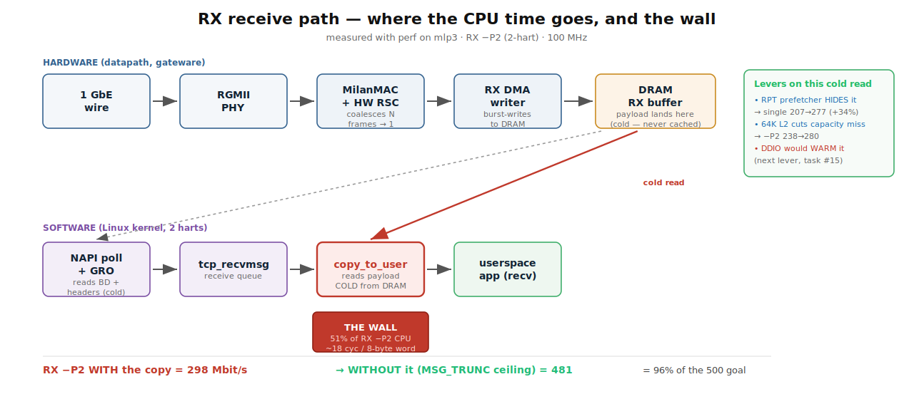
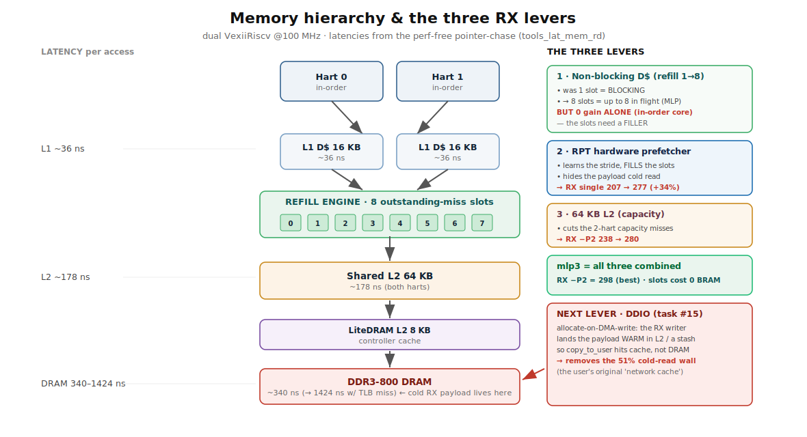
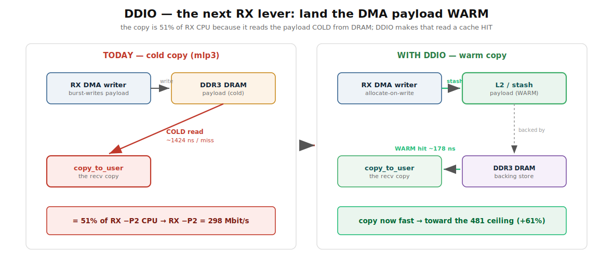

# RX / TX performance  -  what we improved, how, and what's next

*Authoritative current-state reference (2026-07-09, updated after the R2 multi-slot RSC
campaign). Plain-language story of the >500 Mbit/s campaign, with the measurements and
diagrams. For the per-commit log see [`../CHANGELOG.md`](../../CHANGELOG.md);
for the deep mechanism see [`LSU_NONBLOCKING_DCACHE.md`](../fpga/LSU_NONBLOCKING_DCACHE.md) and
[`RX_MEMORY_HIERARCHY_PLAN.md`](RX_MEMORY_HIERARCHY_PLAN.md). Older phase docs are point-in-time
snapshots  -  trust the numbers here.*

## The goal, in one line

Best-effort TCP throughput **>500 Mbit/s in both directions** on the fully-FPGA Milan NIC
(Alinx AX7101, dual VexiiRiscv RV64 @ 100 MHz, DDR3-800, MTU 1500).

## Where we are (after R2  -  `build_r2slots` + kl-eth `mslot60d`)

| direction | measured (2026-07-09 eve) | goal | verdict |
|---|:--:|:--:|---|
| **TX** | **−P4 513** on the R2 gateware (historical −P2 525–536) | 500 | ✅ **crosses 500** |
| **RX, no-copy stack ceiling** | **925** (MSG_TRUNC −P2, ~93 % of line rate; was 481) |  -  | ✅ the stack itself is line-rate-class now |
| **RX, TCP with real copies** | **~370–410 sustained** (−P8 spin, peer-tx_bytes time-series, flat, canary 0) · short-cell bursts 520–660 are slow-start transients  -  do not quote them | 500 | ⏳ 2-hart CPU equilibrium (cpu0 100 % softirq, cpu1 100 % copy); 112.5 MHz + deeper RPT prefetch (R3b) in flight |

**R2 in one line**: 4 RSC aggregate slots + 60 KB buffers + a pop-ordered completion queue
(the wedge invariant kept *by construction*) took the per-byte stack cost down ~4×  - 
interleave parks (90 % of closes) eliminated, coalesce 10.6 → 22.8 segs/aggregate  -  and
two real driver bugs fell out (lost-edge IRQ race → 5 ms stalls; posted-pool famine at
60 KB pages). RX went 316 → ~390 sustained / 925 no-copy. The residual wall is the
recv-side CPU: the full-queue TCP regime (window updates + sock-lock backlog) costs ~25 %
over the transient drain rate (≥520 proven).

The whole campaign on one chart:

---

## Part 1  -  how we explained the RX improvements (the short version)

Think of RX as a bucket brigade: the NIC drops each frame into DRAM, then the CPU has to pick it
up and hand it to the application. We made the *pickup* faster in three ways, then found the real
wall.

1. **Bigger shared L2 (64 KB).** With two harts both doing RX, their working sets were evicting
   each other out of the 32 KB cache. Doubling it stopped the thrash → **RX −P2 238 → 280**.
2. **Non-blocking data cache (8 refill slots).** The CPU's L1 could only have *one* cache miss
   outstanding at a time  -  every miss stalled the core until DRAM answered (~1424 ns). We widened
   it to 8. **On its own this did nothing** (229 ≈ 238): an in-order core replays the missing load,
   it doesn't run ahead, so the 8 slots sat empty. Capacity for parallelism isn't parallelism.
3. **RPT hardware prefetcher  -  this is the one that worked.** It watches the access pattern, learns
   the stride, and *fills* those 8 slots ahead of the CPU, so the data is already on its way before
   the CPU asks. **RX single-flow 207 → 277 (+34%).**

Combined (config **mlp3** = 64 KB L2 + refill=8 + RPT), **RX −P2 = 298**  -  the best so far, and
the refill slots cost **zero BRAM** (they're flip-flops), so the AVDECC logic budget is untouched.

### Then `perf` told us the truth

We cross-built `perf` for the board and profiled RX. **51% of the RX CPU is one line: the
`copy_to_user` in `recv()`**  -  the kernel copying the payload from DRAM into the app's buffer. And
it's slow (~18 cycles per 8-byte word) because it reads the payload **cold**  -  the NIC DMA'd it to
DRAM and this is the CPU's first touch, so every line misses.

We proved it with a ceiling test: a receiver that drains the socket with `recv(MSG_TRUNC)` (which
skips the copy) hits **RX single 427, −P2 481**  -  **+61%, i.e. 96% of the 500 goal.** So the copy
*is* the wall, and removing it essentially reaches the target.

---

## Part 2  -  TX (and why our RX change didn't touch it)

TX already **crosses 500**  -  a back-to-back A/B of the pre-change (l2x2) and post-change (mlp3)
gateware showed TX is **unaffected** by the refill/RPT change (ranges overlap; both −P2 peak
525–536). That's expected: **TX is datapath/shaper-bound, not CPU-bound**, so a CPU-memory lever
doesn't move it. The RX-targeted change carries **no TX regression**  -  good.

TX got to 500 earlier in the campaign via: the CBS default-shaping bug fix (`34cc2bc`, it had been
pacing best-effort traffic at 300 Mb/s), HW TSO, and softirq-NAPI + peer receive-coalescing.

---

## Part 3  -  what's next: DDIO (the vindicated "network cache")

The copy is fundamental to the socket API  -  the driver can't remove it (its zero-copy path is dead
code and wouldn't help the `copy_to_user` anyway). Two ways to beat it:

- **App zero-copy recv** (`MSG_ZEROCOPY`/mmap) → the 481 ceiling, but the *application* must opt in.
- **DDIO / allocate-on-DMA-write** → make the copy's read a cache **hit** by landing the DMA'd
  payload *warm* in the L2 (or a small dedicated stash) instead of cold in DRAM. Works for any app.

This is the **"dedicated cache for the network"** idea from the very start of the campaign  -  first
dismissed, then vindicated once `perf` showed the dominant cost is the copy's cold reads of the
DMA'd payload.

**MEASURED on silicon (2026-07-09).** Good news first: VexiiRiscv's coherent L2 (SpinalHDL
`tilelink.coherent.Cache`) *already has* an `allocateOnMiss` policy hook, and its opcodes include
the DMA write (`PUT_FULL_DATA`)  -  so shared-L2 DDIO is **a one-line config, not weeks of RTL**
(wired as `--l2-ddio`; `build_ddio` closed timing at the same WNS +0.102 and 0 extra BRAM). The
bad news: **it didn't help**  -  RX −P2 ~300 (flat vs mlp3's 298), and single/−P4 dipped slightly.
Allocating *every* DMA write into the 64 KB shared L2 **pollutes** the CPU's working set without
**warming** the copy: under two harts streaming 16 KB payloads, each payload is **evicted before
`copy_to_user` reads it** (the NAPI→recv gap). Scoping the allocate to RX-writer Puts would only
recover the small regression, not fix the *residency* problem.

**So DDIO on this SoC needs the payload to survive from DMA-write to copy-read**, which the shared
L2 can't guarantee. That points at a **dedicated stash** (a small cache reserved for in-flight RX,
not competing with the CPU/other DMA)  -  real RTL, and it still has to win the residency race  -  or
the **header-split + app-zero-copy** path (a driver+HW change so `TCP_ZEROCOPY_RECEIVE` can
page-flip; measured 0% today because the HW-RSC frag isn't page-aligned). Both are substantial.
**The practical RX ceiling with tractable levers is mlp3's ~298**; the measured 481 says the
headroom is real, but capturing it is a project, not a knob.

---

## The levers at a glance (measured)

| lever | effect | note |
|---|---|---|
| 64 KB L2 | RX −P2 238 → **280** | capacity (both harts) |
| refill=8 alone | 229 ≈ 238 (**no gain**) | in-order core; slots need a filler |
| **RPT prefetcher** | RX single 207 → **277** (+34%) | fills the slots; +2 BRAM tiles |
| mlp3 (all three) | RX −P2 = **298** | slots cost 0 BRAM |
| **L2→DRAM depth 8** (l2deep) | RX −P2 = **316 (best)** | `downPendingMax` 4→8: 2 harts stopped serializing at the L2's DRAM port; knee at 8 (16 flat; LiteDRAM cmd 16 flat) |
| shared-L2 DDIO | ~300 (**flat**) | allocate-on-DMA-write pollutes without warming (residency) |
| *ceiling if copy removed* | RX −P2 = **481** | via `recv(MSG_TRUNC)` |
| copy removal  -  **CLOSED, measured dead** | (481 unreachable via sockets) | stash: refuted on residency (Recv-Q 1–3 MB ≫ BRAM). Zero-copy recv: the kernel's `can_map_frag()` demands order-0 4 KB driver pages at offset 0 (16 KB compound RSC pages can never flip), **and** `mapbench` measured the flip machinery at **44.9 µs/page vs 25.0 µs/page for the cold copy**  -  page-flipping *loses* on this 100 MHz sv39 core |

**Checkpoint verdict (2026-07-09, superseded the same evening).** With the levers measured so far,
socket-API TCP RX sits at **~316**, and the 481 stack-ceiling is reachable only by consumers that
never materialize the payload through `recv()` (`MSG_TRUNC`-class, `AF_PACKET` mmap rings  -  the
latter being how the real Milan/AVTP media path works, copy-free by design). **The goal was then
reasserted: RX > 500 over standard TCP recv is a hard goal  -  the campaign does not close without
it.** The engineering consequence of the 481 measurement: *no copy trick alone can cross 500*  - 
the path must raise the stack ceiling **and** close the copy tax. The forced-march plan (R1 warm
copy via DDIO + bounded residency; R2 RSC multi-slot to kill park-closes and raise the ceiling;
R3 112.5 MHz final mile) lives in [`PERFORMANCE_GOAL.md`](PERFORMANCE_GOAL.md).

**Refuted along the way** (so we don't retry them): the depth-2 DMA interconnect (RX writer has
30× headroom), growing L2 past 64 KB, a BRAM buffer scratchpad, software prefetch (blocking D$),
and 112.5 MHz (only +4–8%). See [`../CHANGELOG.md`](../../CHANGELOG.md).
