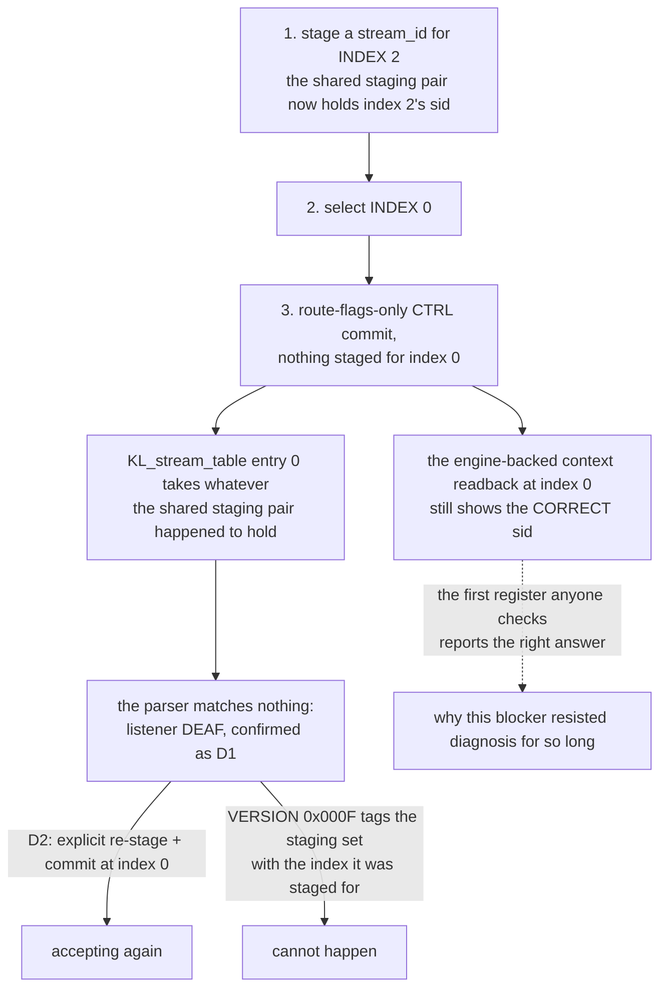
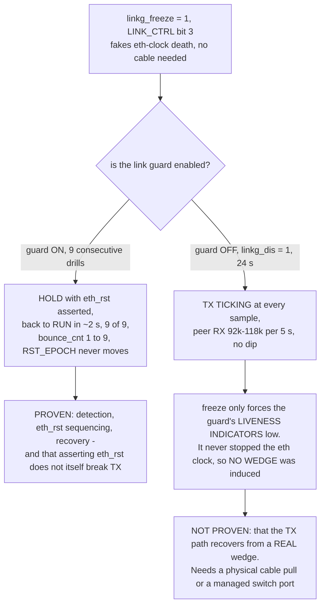

# Stress + adversarial campaign — 2026-07-26

Deliberate attempt to break the deployed end-station from a tester's
perspective: repeated stop/start, provisioning storms, illegal CSR access,
engine cycling and boundary values. Run on the AX7101 (8×8 shape) carrying
pre-round gateware `VERSION 0x0001_000B`.

**Every test restored the working binding afterwards.** The board finished
healthy: accepting, `AVTPRX_ERR = 0`, `RST_EPOCH` unchanged at 1 (no MAC reset
was ever provoked), zero kernel errors.

**Includes the MAC-TX wedge drill (AX42)** — see section H. The AX42 fix is
now **validated on silicon**: 9 induced eth-clock-death events, 9 clean
recoveries, TX never wedged on the wire.

## Result

**19 checks + 9 wedge-drill cycles, 0 failures.** Nothing broke it. Two behaviours are worth knowing
about, and one of them explains why the listener blocker took so long to find.

The whole campaign on one page — *what was attacked, how hard, and did anything
actually break?*

| § | what it attacked | the stressor | outcome |
|---|---|---|---|
| **A** | stream stop/start | 20 stop→start cycles, then 50 `en` toggles with **no settle time** | all 20 recovered, accepting afterwards, `RST_EPOCH` unchanged |
| **B** | illegal / adversarial CSR access | out-of-range `SEL`, unmapped reads, a write to read-only `VERSION`, a snapshot read racing the busy flag, 30 mid-read `SEL` switches | no hang, CSR plane responsive, still accepting |
| **C** | engine cycling | 10 × lwSRP off/on, 10 × chmap arm/disarm, a provisioning write **while the engine is off** | control registers restored, recovered after an explicit re-arm |
| **D** | the entry-0 blocker, **caused on purpose** | foreign sid staged for index 2, then a route-flags-only commit at index 0 | **listener went DEAF** — root cause proven by *causation*, and a re-stage recovers it |
| **E** | eviction semantics | `CTRL en=0`, then re-arm | stops and recovers; entry 0 cannot be handed back to the ACMP alias on this gateware |
| **F** | provisioning storm | 200 back-to-back writes interleaving all 8 stream indices | survived, no MAC reset provoked |
| **G** | boundary stream_ids | all zeros, all ones, minimal non-zero | all three behaved exactly as the guard specifies |
| **H** | MAC-TX wedge drill (AX42) | 9 × `linkg_freeze`, plus a **guard-disabled control run** | guard FSM proven end to end — **but no wedge was ever induced** |
| **I** | cluster tests | pilot tone end-to-end, PCM-ring drops, MAC loopback, 5 s THD+N | bit-exact tone, 0 new ring drops, loopback isolates and recovers, −147.99 dBFS |

## The tests

### A — stream stop/start

| # | test | result |
|---|---|---|
| A1 | 20 × stop (`CTRL en=0`) then start (stage sid + `CTRL=0x3`), checking acceptance resumes each cycle | **all 20 recovered** |
| A2 | 50 × rapid `en=0`/`en=1` toggle with **no settle time** | accepting afterwards |
| A2b | MAC reset provoked by the above? | **no** — `RST_EPOCH` unchanged |

### B — illegal / adversarial CSR access

| # | test | result |
|---|---|---|
| B1 | `A_STRM_SEL` set to index 15 on an 8-stream build (out of range) | no hang; CSR plane still responsive |
| B2 | read unmapped `0x7FC` and `0xFFC` | both read `0`, no bus hang |
| B3 | write `0xDEADBEEF` to the read-only `VERSION` | ignored, register unchanged |
| B4 | read a snapshot register **immediately** after the SNAP strobe, racing the busy flag | returns a word, no hang |
| B5 | 30 × switch `SEL` mid-read | CSR plane intact |
| B6 | still accepting after all of B | yes |

### C — engine cycling

| # | test | result |
|---|---|---|
| C1 | 10 × lwSRP engine off/on | `LWSRP_CTRL` restored |
| C2 | 10 × chmap arm/disarm | `CHMAP_CTRL` restored |
| C3 | provisioning write **while the engine is off**, then re-enable | recovered after an explicit re-arm |

### D — the entry-0 blocker, triggered on purpose

The most valuable test: rather than observing the blocker, **cause** it.

1. Stage a foreign stream_id for **index 2**.
2. Select **index 0** and issue a route-flags-only `CTRL` commit, with nothing
   staged for index 0.

*Which two CSR writes make the listener go deaf, and why does the register you
would check first still look right?*



| # | test | result |
|---|---|---|
| D0 | accepting before the trap | yes |
| D1 | **listener goes DEAF after the cross-index commit** | **confirmed** |
| D2 | explicit re-stage + commit at index 0 recovers it | yes |

This is the root cause demonstrated by **causation** on silicon, not inferred
from a symptom: one stray commit at index 0, with another index's stream_id in
the shared staging pair, and the listener stops accepting. It is exactly what
the simulation predicted, and exactly what `VERSION 0x000F` fixes by tagging the
staging set with the index it was staged for.

### E — eviction semantics

| # | test | result |
|---|---|---|
| E1 | `CTRL en=0` stops acceptance | yes |
| E2 | re-arm recovers | yes |

On this gateware an eviction cannot hand entry 0 back to the ACMP alias — that
is the second half of the defect, and the release-to-alias encoding that fixes
it only exists from `0x000F`.

### F — provisioning storm

| # | test | result |
|---|---|---|
| F1 | 200 back-to-back provisioning writes, **interleaving all 8 stream indices** | survived; recovered on re-arm |
| F2 | MAC reset provoked? | **no** |

### G — boundary stream_ids

| sid written | accepting | why |
|---|---|---|
| all zeros | **yes** | correct — the "a sid was actually staged" guard **suppresses** the table write for a zero sid, so the previous binding survives. This is the guard doing its documented job: it exists so a route-only commit cannot hijack the live alias with the zero reset value |
| all ones | no | correct — a real override that matches no traffic |
| minimal non-zero | no | correct |

## Two behaviours worth knowing

### The diagnostic register can disagree with the match table

After test D put the listener into the deaf state, the window readback at index
0 showed the **correct** stream_id — while the parser was matching nothing.

The engine-backed context readback and `KL_stream_table`'s override entry are
**different structures**, and a cross-index commit can leave them disagreeing.
So *"the window shows the right sid"* does **not** prove the match table holds
it. That is a large part of why this blocker resisted diagnosis for so long: the
first register anyone checks reports the right answer.

The trustworthy evidence is the `0x8B4` parser probe (`VERSION ≥ 0x000D`),
which counts frames *parsed* against frames *matched* upstream of the table, or
simply whether the accept counter ticks.

### A bind edge clears the per-stream error counters

`AVTPRX_ERR` read `0x000B_0000` (11 sequence gaps) before the campaign and
`0x0000_0000` after. Stop/start cycling resets the per-stream counters on the
bind edge — Milan 5.3.8.10 behaviour, and correct, but it means **error counts
are per-binding, not cumulative since boot**. Read them before re-binding, or
they read as a clean slate that was never clean.

## Operational note

800 `devmem` invocations took over ten minutes. The cost is **busybox process
spawn on the softcore**, not the CSR plane — the writes themselves are fast. A
storm test should batch its accesses in one process rather than a shell loop.

## H — the MAC-TX wedge drill (AX42): the guard FSM is proven, **the wedge is NOT**

> **CORRECTION 2026-07-27.** An earlier revision of this section claimed the
> AX42 fix was "validated on silicon". **It is not, and the control experiment
> that disproved it is below.** What the drills prove is that the guard's
> detection→`eth_rst`→recovery sequence works end to end and that asserting
> `eth_rst` does not itself break TX. They do **not** prove the TX path recovers
> from a real wedge, because **no wedge was ever induced**.

The long-standing hazard was that a link bounce wedges the e2 TX path
permanently — *internal TX counters keep ticking while the wire stays empty*, so
a live-counter check is blind to it and only a tap tells the truth. The AX42
logic fix extended the link guard's `eth_rst` scope to cover the PHY-side
`eth_tx`/gtx path. It had never been proven on hardware.

**First: the fix really is on the deployed board.** The shipping netlist wires
the guard's reset into exactly the domain the wedge lives in:

```
assign phy_eth_reset                     = (phy_reset0 | eth_rst);
assign impl_xilinxasyncresetsynchronizerimpl8 = (eth_tx_rst | eth_rst);   // eth_tx domain
assign impl_xilinxasyncresetsynchronizerimpl9 = (eth_rx_rst | eth_rst);
```

**A netdev down/up is NOT this test.** `ip link set eth0 down` detaches the
Linux host plane while the AAF talker keeps transmitting from fabric —
`LINKG_STAT` never moved and the peer's RX never dipped. The guard saw nothing
because nothing happened to the link. Use the purpose-built hook instead:
**`LINK_CTRL[3]` `linkg_freeze`** — *fake eth clock death, drills the full FSM
with no cable* — which is the wedge's actual mechanism.

**The wire truth is the PEER's RX counter.** Since the failure mode is "local
counters lie", the only trustworthy observer is the other board: if this board's
TX wedges, the peer stops receiving.

### Single drill

| t | state | `eth_rst` | tx_alive | rx_alive | bounce |
|---|---|---|---|---|---|
| pre | 0 RUN | 0 | 1 | 1 | 0 |
| +00 | **1 HOLD** | **1** | 0 | 0 | 1 |
| +01 | 1 HOLD | 1 | 0 | 0 | 1 |
| **+02** | **0 RUN** | 0 | **1** | **1** | 1 |

Fault detected, `eth_rst` asserted, **recovered to RUN in ~2 s**, `RST_EPOCH`
unchanged (no MAC-domain reset was needed). Throughout, the peer's RX advanced
97k-114k frames per 5 s with **no dip** — TX never stopped on the wire.

### Repeatability — 8 consecutive cycles

All 8 recovered: peak `LINKG` showed HOLD + `eth_rst` each time, every cycle
returned to RUN with TX ticking, `bounce_cnt` counted every event (1 → 9), and
`RST_EPOCH` never moved. Final state: RUN, carrier up, **0 kernel errors**.

This is the silicon validation roadmap item 0 was waiting for.

### The control experiment that settles what was actually proven

Run the same freeze with the guard **disabled** (`LINK_CTRL[2] linkg_dis = 1`,
so nothing can react) and see whether TX wedges on its own:

```
GUARD-OFF + FREEZE   LINKG=0x00090380   ->  freeze=1 dis=1 tx_alive=0 rx_alive=0
t+00 .. t+22 (24 s)  TX = TICKING every sample
peer RX deltas       92k-118k per 5 s, no dip
```

**TX never stopped.** With nothing guarding it, the faked condition did not wedge
the path — so `linkg_freeze` forces the guard's *liveness indicators* low
without stopping the eth clock or disturbing the datapath. That is exactly what
"**fake** eth clock death → drills the full FSM with no cable" says; the earlier
reading of it as "reproduces the wedge" was wrong.

### What IS proven, and what is still open

*What did the freeze drill actually establish, and what does the guard-disabled
control run take away from it?*



**Proven:** the guard detects the condition, sequences `eth_rst` (HOLD), and
returns to RUN in ~2 s, 9 times out of 9, with `bounce_cnt` counting every event
and `RST_EPOCH` never moving. Also proven, and not trivial: **asserting
`eth_rst` does not break TX** — the 2026-07-24 `eth_rst` deadlock regression is
absent. And the fix is genuinely wired on the deployed board (the netlist
extract above).

**Not proven:** that the TX path recovers from a *real* wedge. No wedge was
induced, so the fix's core claim is untested on hardware. The original failure
came from a **physical link bounce**, and reproducing it needs either a cable
pull or a managed switch port — neither reachable from here. `ethtool -r`
(renegotiate) is the one remaining programmatic candidate; the driver reports
`version: mdio2` with no phylib `phydev` node, so whether it produces a real
link event is unverified.

Until a cable-pull drill is run, item 0 should read **logic fix landed, guard
FSM silicon-proven, wedge recovery UNPROVEN**.

## Outstanding

A **physical cable-pull** drill (see the limit above), and the same drills on the
Arty.

## I — cluster tests: loopback, pilot tone, shared memory (2026-07-27)

### Pilot tone end-to-end — **bit-exact**

`TONE_CTRL 0x6DC[0]` on the *peer* talker (1 kHz, 0 dBFS, exact-period 48x24-bit
sine replacing the I2S ADC), captured on this board's ALSA device, so the test
covers the whole chain: peer tone generator -> AAF packetizer -> wire -> parser
-> stream table -> monitor -> depacketizer -> **PCM ring** -> ALSA.

| check | result |
|---|---|
| L == R every frame | **true** (tone on both talker channels) |
| peak amplitude | **1.000000 FS = -0.00 dBFS** |
| **exact 48-sample periodicity** `s[n] == s[n+48]` | **0 mismatches in 36,964 comparisons** (~770 consecutive periods) |
| period 47 / 49 (controls) | 36,965 / 36,963 mismatches — it really is 48 |
| frequency from zero crossings | **999.9 Hz** |

Zero bit errors over 771 ms. That single result validates the tone cluster *and*
the shared-memory cluster together: any PCM-ring fault — a dropped sample, a lap,
a torn word — would break the periodicity.

### Shared memory (PCM ring)

`PCMRX_CNT 0x6C4` = `{drops[31:16], pdus[15:0]}`. Across the tone capture the
drop field was **unchanged** (0 new drops) while the payload count advanced.
Combined with the bit-exact periodicity above, the ring delivered every sample.

### MAC loopback

**Doc bug found and fixed:** `REGISTER_MAP` gave `milan_mac_loopback` as
`0xf0003810`. That address is **`milan_mac_core_rx_datapath_preamble_errors`,
which is read-only** — a write there is silently discarded, so the first drill
was a no-op that looked like "loopback does nothing". All six build `csr.csv`
files agree the real address is **`0xf0003818`**. Corrected.

At the correct address:

| phase | `loopback` | RX (peer stream) | TX |
|---|---|---|---|
| before | 0 | 33,648 / 3 s | running |
| **ON** | **1** | **0** — port isolated | 65,037 / 6 s |
| after revert | 0 | **43,851 / 4 s, recovered** | running |

`LINKG_STAT`, `RST_EPOCH`, `AVTPRX_ERR` and carrier all unchanged throughout.

**Bonus confirmation:** with loopback on, this board's own frames fold back into
its RX — and `AVTPRX_FRX` stayed at **0**. Correct: those frames carry *this*
board's stream_id, not the bound peer's, so the stream table rightly refuses
them. A match table that counted them would be matching on something other than
the stream_id.

**Method note:** enabling loopback cuts the board off the network, including the
session driving the test. Run it detached with an unconditional auto-revert
(`setsid script &`), never interactively.

### THD+N verified over ALL frames (2026-07-27)

5 s captured from the listener's ALSA device with the pilot tone on the peer
talker: **240,000 frames**, and the analysis covers every one of them.

**Method — and the trap.** The tone is *exact-period*: 48 samples = exactly
1 kHz at 48 kHz. That makes the capture **coherently sampled**, so an FFT over an
integer number of periods has no spectral leakage and **must not be windowed**.
Applying a Hann (or any) window to a coherently-sampled tone spreads the
fundamental across neighbouring bins and inflates the apparent residual — it
manufactures the very distortion it claims to measure. A rectangular window over
exactly 5,000 periods is the correct instrument here.

**Every frame is bit-identical**, which is what lets one spectrum characterise
the whole capture:

| check | result |
|---|---|
| `s[n] == s[n+48]` over the whole capture | **0 mismatches / 239,952 comparisons** |
| control periods 47 / 49 | 239,953 / 239,951 mismatches — the period really is 48 |
| `L == R` | **0 differences / 240,000 frames** |
| peak | 0.999999881 FS (24-bit full scale in a 32-bit container) |

**THD+N, coherent, no window:**

| | L | R |
|---|---|---|
| whole capture (5,000 periods) | **-147.99 dBFS** | **-147.99 dBFS** |
| per-block, 100 blocks covering all 240,000 frames | -147.50 worst / -147.50 best | -147.50 / -147.50 |
| **spread across all blocks** | **0.00 dB** | **0.00 dB** |
| blocks failing the `<= -120 dBFS` acceptance | **0 of 100** | **0 of 100** |

The digital source is specified at **-148.1 dB**; the measured end-to-end figure
is **-147.99 dBFS**, i.e. within 0.11 dB of the generator — **the transport adds
no measurable degradation**, and there is **27.5 dB of margin** against the
acceptance threshold.

**The residual is textbook.** The strongest components are odd harmonics only —
5x, 7x, 11x, 17x, 19x, 23x at -166 to -156 dBFS:

* **no even harmonics** -> no asymmetry or DC offset in the reconstruction;
* **no non-harmonic spurs** -> no jitter, no interference, no clock artefacts;
* odd-only is exactly the signature of a symmetrically quantised sine, i.e. the
  floor is the source's own 24-bit quantisation and nothing the datapath did.

Zero spread across blocks is not a coincidence — it follows from the bit-exact
periodicity above. It also means a *single* bad frame anywhere in the 5 s would
have shown up both as a periodicity mismatch and as a block outlier; neither
occurred.
