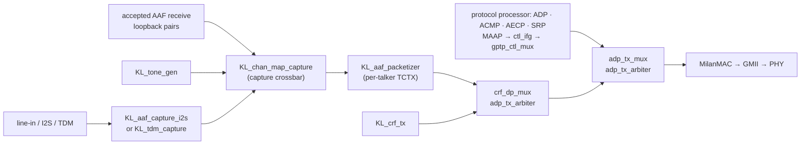
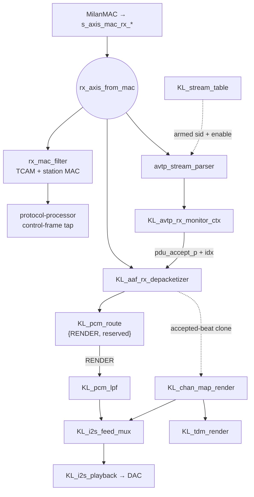

# One AAF frame, hop by hop

*The page to read before you go looking for a module.* It follows a single
audio frame through the fabric in each direction, names the RTL instance at
every hop, and gives the CSR you would read to prove the frame got that far.
Nothing here is new behaviour — it is the connective tissue between
[FPGA_DESIGN.md](FPGA_DESIGN.md) (what each module is),
[../reference/REGISTER_MAP.md](../reference/REGISTER_MAP.md) (what each register
means) and [../reference/EGRESS_QUEUE_MAP.md](../reference/EGRESS_QUEUE_MAP.md)
(which queue a frame takes).

Two companions cover the neighbouring concerns:
[../integration/AXIS_CORES_ON_BAREMETAL_SOC.md](../integration/AXIS_CORES_ON_BAREMETAL_SOC.md)
documents the supported bare-metal SoC boundary, and
[../AAF_LATENCY_TAPS.md](../AAF_LATENCY_TAPS.md) puts hardware timers on the
hops named below.

Every instance name in this page is the identifier in
[`hdl/milan/milan_datapath.sv`](../../hdl/milan/milan_datapath.sv); every offset
is from the register map. If the two disagree, the RTL wins and this page is
wrong — say so.

---

## Contents

- **[0. The one thing to know first](#0-the-one-thing-to-know-first)** -- Product traffic is emitted by fabric protocol and media engines. There is no classifier/queue/shaper chain in the shipped trunk.
- **[1. Egress: a captured sample becomes an AAF frame (the fabric talker)](#1-egress-a-captured-sample-becomes-an-aaf-frame-the-fabric-talker)** -- Follows capture, mapping, packetization, admission, arbitration, and MAC egress with a live observation point at each hop.
- **[2. Egress: where the classifier/queue/shaper chain went](#2-egress-where-the-classifierqueueshaper-chain-went)** -- Records why the queue/CBS chain is no longer instantiated, what remains of it in the register map, and where the blocks still live.
- **[3. Ingress: a frame off the wire reaches fabric render](#3-ingress-a-frame-off-the-wire-reaches-fabric-render)** -- Follows the RX tee through parsing, stream matching, monitoring, depacketization, fabric routing, channel mapping, and physical I2S/TDM render.
- **[4. What is \*not\* on either path](#4-what-is-not-on-either-path)** -- Three things people go looking for in the wrong place, including the fact that capture and render are two *different* crossbars with two different map RAMs.

## 0. The one thing to know first

**Product egress is generated in fabric; there is no shaper chain in the trunk.**

The classifier, queues and credit-based shaper have no packet source in the
bare-metal product shape and, since VERSION `0x0056`, are not
instantiated by `milan_datapath` at all; their CSR words remain as write-only
scratch for compatibility and the blocks stay under focused RTL verification.
The AAF and CRF talkers, protocol-processor traffic, MAAP, and fabric gPTP all
inject through `adp_tx_arbiter` mergers.

That is deliberate and it is stated in the RTL at the interface declarations
(the TX-trunk note) and at the CRF merge: *"neither AAF nor CRF is
credit-shaped ... class-A shaping of the fabric's own stream sources is a
separate lane"*. AAF admission uses the processor's ACMP and SRP class-D
state plus MAAP. The consequence for a reader: queue assignments select no
product traffic, which is the same boundary
[EGRESS_QUEUE_MAP.md](../reference/EGRESS_QUEUE_MAP.md#where-the-fabric-bypasses-all-of-this)
says from the queue's side.

Section 1 is the live fabric talker path; Section 2 records where the queue
chain went so its register footprint is not mistaken for a target packet API.

---

## 1. Egress: a captured sample becomes an AAF frame (the fabric talker)

The dynamic-map and media-clock claims are checked against the
[Milan feature status ledger](../reference/MILAN_FEATURE_STATUS.md):

<!-- milan-feature-status:start -->
| Feature ID | Status | Canonical value |
|---|---|---|
| `aem.served-command-set` | `implemented` | - |
| `crf.media-clock-consumption` | `implemented` | - |
<!-- milan-feature-status:end -->

| # | hop | instance in `milan_datapath.sv` | what happens | read it at |
|---|---|---|---|---|
| 1 | **capture** | `aaf_capture` (`KL_aaf_capture_i2s`) or `tdm_capture` (`KL_tdm_capture`) | the I2S/TDM front end recovers L/R sample pairs and hands them over as a `pair_valid` + slot + 24-bit L/R bus. Which one is built is an elaboration choice, not a runtime one | `LTAP_TX_EPOCH` `0x874` samples the gPTP ns at this edge |
| 2 | **channel map** | `KL_chan_map_capture` | the capture crossbar picks, per wire slot, which I2S/TDM pair, tone source, receive-loopback pair, or zero feeds it; reserved source encodings resolve to silence. The map resets empty; `CHMAP_CTRL` selects the CSR-programmed crossbar, and with the enable clear the front-end pair drives the packetizer bit-identically | `CHMAP_CTRL` `0x900` is the direct diagnostic writer. `GET_AUDIO_MAP` reads the live stores, and `ADD_AUDIO_MAPPINGS` plus `REMOVE_AUDIO_MAPPINGS` update them through the processor's transactional path. See [../CHANNEL_MAP_64.md](../CHANNEL_MAP_64.md) |
| 3 | **packetize** | `aaf_packetizer` (`KL_aaf_packetizer`) | accumulates a PDU's worth of pairs, then emits one AAF frame: VLAN tag from `AAF_CTRL[27:16]`, destination from `AAF_DMLO`/`AAF_DMHI`, source = the station MAC, `avtp_timestamp` = the PHC now plus the presentation offset AECP holds. Per-talker state lives in the TCTX rows the `0x800` window writes | `AAF_FRAMES` `0x660`, `AAF_PAIRS` `0x664`; `LTAP_TX_D0/D1` `0x87C`/`0x884` bracket the accumulate + serialize |
| 4 | **admission** | `aaf_stream_en_w` inside the packetizer | a stream emits when the common AAF enable and MAAP term are true and its processor-owned ACMP talker and SRP bandwidth state grant admission. `AAF_CTRL[1]` is the documented debug bypass | `PP_STAT` `0x924`, `AAF_CTRL` `0x678`, and the processor class-D diagnostics |
| 5 | **merge boundary** | `crf_dp_mux` (`adp_tx_arbiter`) | the packetizer output heads the data lane and the CRF talker joins it here. Product audio sees no queue and no credit accounting - there is no shaper in the trunk (Section 2) | `TXARB_DIAG` `0x784` lane 2 |
| 6 | **merge with control** | `adp_tx_mux` / `gptp_ctl_mux` (`adp_tx_arbiter`) | the protocol processor's packed ADP/ACMP/AECP/SRP stream merges with MAAP in `ctl_tx_mux`, passes through `ctl_ifg`, and joins the fabric media lane here. CRF joins AAF through `crf_dp_mux`. With the product-default option on, the fabric gPTP stream joins at the final `gptp_ctl_mux` | -- |
| 7 | **control-lane IFG** | `ctl_ifg` (`tx_ifg_gasket`, `GAP_CYCLES = 512`) | spaces control frames so the MAC cannot eat one that arrives back-to-back behind another. **Control lane only** — fabric audio and the other protocol/time lanes do not pass through it, so it costs no stream throughput | — |
| 8 | **MAC** | `tx_axis_to_mac` → `m_axis_mac_tx_*` | out of `milan_datapath`, into the SoC's MilanMAC (LiteEth GMII), onto the wire | `STAT_TX_FIFO_GOOD_FRAME` `0x21C`; `LTAP_TX_D2` `0x88C` closes the chain |

> **The `LTAP_TX_D2` reading, corrected.** `D2` spans hop 3's last beat to hop
> 8's egress, i.e. hops 5–8 — the arbiter chain and the MAC boundary. It does
> **not** span a CBS slot, because a fabric-talker frame never enters the
> shaper (Section 0). [../AAF_LATENCY_TAPS.md](../AAF_LATENCY_TAPS.md) attributes the
> measured `D2` maximum to a shaper slot; that attribution cannot be right for
> this lane, whatever the measurement itself shows.

The gPTP egress timestamp is taken independently of all of this, at the MAC
boundary by `KL_gptp_txstamp` (armed by the plane's own lane) — which is why
merge order does not perturb gPTP accuracy
([EGRESS_QUEUE_MAP.md](../reference/EGRESS_QUEUE_MAP.md#why-gptp-sits-below-the-shaped-classes)).

## 2. Egress: where the classifier/queue/shaper chain went

There is no classifier, queue bank or credit-based shaper in the shipped
`milan_datapath` since VERSION `0x0056`. The chain
(`traffic_controller_802_1q`, plus the `ptp_ts_top` TX/RX record stampers that
followed it) had exactly one packet source - the retired transmit path - and #259
removed that plane; every product source enters the trunk at the merges below
the point the chain occupied, so an elaborated chain was silicon on a tied-off
input and a CSR face advertising a shaper no frame could reach. The blocks are
unchanged and verified stand-alone (`classifier`, `queues`, `cbs`,
`shaper_core`, `datapath`, `controller_rate`, `ptp_ts` suites; `datapath_wrap`
and `ptp_ts_top` Yosys tops) as the building material of a class-A shaping lane
over the fabric's own sources - a separate lane.

What a reader still sees of it:

| where | what remains | why |
|---|---|---|
| `CLS_*` `0x300`, `0x400`-`0x49F`, `PTP_INGRESS/EGRESS_LAT` `0x540`/`0x544` | write-only scratch: stored, read back as documented, consumed by nothing | the register map is an ABI; no address moves |
| `CAP[8]` `0x008`, `IRQ_STATUS[0]` `0x010`, `TXARB_DIAG` lane 1 `0x784` | structural zero | the shaper, the TX record stamper and the `aaf_final_mux` merge are gone |
| `CAP[3:0]` = 5 | the retained `0x400` window geometry | see [EGRESS_QUEUE_MAP.md](../reference/EGRESS_QUEUE_MAP.md) |

The full queue table, the reset slopes and the reserved-DMAC rows are all in
[EGRESS_QUEUE_MAP.md](../reference/EGRESS_QUEUE_MAP.md) - it is the authority
and this page does not restate it.

## 3. Ingress: a frame off the wire reaches fabric render

The RX side **tees**. A pre-filter copy feeds the media plane, while the filtered
copy feeds the protocol processor's control-frame classifier. There is no
target memory-delivery path.

| # | hop | instance | what happens | read it at |
|---|---|---|---|---|
| 1 | **RX tap** | `rx_axis_from_mac` | the MAC stream itself, fanned out untouched to the filter and the two pre-filter media taps; gPTP ingress stamps are the plane's own (`KL_gptp_shadow` off the filtered tap) - the `ptp_ts_top` RX stamper that sat here is no longer instantiated (Section 2) | `LTAP_RX_EPOCH` `0x894` samples the gPTP ns here |
| 2a | **control-plane filter** | `rx_filter` (`rx_mac_filter`) | station-MAC exact match + multicast hash + the 16-entry TCAM, armed by `TCAM_CTRL[1]`. Surviving frames are observed by the protocol processor's classify-first control tap | TCAM group `0x700`; `STAT_RX_FIFO_GOOD_FRAME` `0x230` |
| 2b | **stream parse** | `avtp_rx_parser` (`avtp_stream_parser`) | lifts the AVTP header off the wire — `stream_id`, `subtype`, `sequence_num`, `avtp_timestamp`, the `tu` bit, format bytes — and compares the `stream_id` against the armed table | `APRB_PARSED` `0x8B4`, `APRB_MATCHED` `0x8B8`, `APRB_SID_LO/HI` `0x8BC`/`0x8C0`, `APRB_INFO` `0x8C4` |
| 3 | **what to match** | `stream_table` (`KL_stream_table`) | holds one `{stream_id, enable}` row per listener and drives the parser's `cfg_stream_id_i`/`cfg_stream_en_i`. Entry 0 **aliases the live ACMP bound record** unless an explicit `0x800`-window override is armed for it | `A_STRMW_CTRL` `0x810` / `A_STRMW_SID_LO`/`_HI` `0x814`/`0x818` per selected index |
| 4 | **accept or not** | `avtp_rx_monitor` (`KL_avtp_rx_monitor_ctx`) | the verdict. Per-stream state: sequence continuity, format support, media lock, timestamp sanity against the presentation offset. Emits `pdu_accept_p` + the stream index — this pulse **is** the commit | `AVTPRX_FRX` `0x6BC` (accepted frames), `AVTPRX_STAT` `0x6B8`, `AVTPRX_ERR` `0x6C0`, per-stream `A_STRMW_CNT` `0x830 + 4k`; `LTAP_RX_D0` `0x89C` = MAC_RX→ACCEPT |
| 5 | **depacketize** | `aaf_rx_depkt` (`KL_aaf_rx_depacketizer`) | replays the same tapped stream, gated by the monitor's accept pulse, and emits the payload as full 8-byte beats in wire order (S32BE interleaved), tagged with the stream index in `tuser` | `PCMRX_CNT` `0x6C4`; `LTAP_RX_D1` `0x8A4` |
| 6 | **route** | `pcm_route` (`KL_pcm_route`) | the 2-bit ABI word is `{RENDER, reserved}`. Bit 1 feeds the direct fabric render tap; lowest-indexed RENDER stream wins. Bit 0 is forced to zero on write and ignored; `0b00` discards after counting | written by the `0x800` window `CTRL[2:1]` commit; `LTAP_RX_D2` `0x8AC` closes at the selected fabric-render edge |
| 7a | **direct DAC render** | `pcm_lpf` → `i2s_feed_mux` → `KL_i2s_playback` | the selected listener tap is band-limited and serialized to the DAC with wire-truth channel stride | `I2SPB_STAT` `0x6D8` |
| 7b | **mapped physical render** | `KL_chan_map_render` → `i2s_feed_mux` / `KL_tdm_render` | an accepted-beat clone is de-interleaved by each PDU's own channel count; the map projects stream channels onto I2S physical channels 0/1 and the TDM render bank | `CHMAP_CTRL` `0x900`, `CHMAP_SNAP` `0x910`, `CHMAP_LOOP` `0x914` |

### Reading the ingress path when nothing arrives

The probes are ordered so that the *first* counter that stays at zero names the
hop that failed. Walk them in this order:

| if this is 0 | the frame never reached | look at |
|---|---|---|
| `APRB_PARSED` `0x8B4` | the parser — nothing AVTP-shaped is arriving at all | link, switch forwarding, the reservation |
| `APRB_MATCHED` `0x8B8` (with `PARSED` climbing) | the stream **table** — we are parsing frames but matching none | `APRB_SID_LO/HI` shows the sid *on the wire*; compare it with `A_STRMW_SID_*` and check `A_STRMW_CTRL[0]` is actually set |
| `AVTPRX_FRX` `0x6BC` (with `MATCHED` climbing) | the monitor's accept verdict | `AVTPRX_ERR` `0x6C0` for the reason — format, sequence, timestamp |
| `PCMRX_CNT` `0x6C4` (with `FRX` climbing) | the depacketizer | accepted-PDU handoff and depacketizer drops |

`APRB_*` exists because everything below it only counts *after* a match: a
bound listener that accepts nothing used to read zero everywhere with no way to
tell parse failure from match failure. That gap is what made the entry-0
provisioning defect take so long to corner — see
[Section 21 of ../limitations/TROUBLESHOOTING.md](../limitations/TROUBLESHOOTING.md#section-21-acmp-says-success-the-listener-declares-itself-bound---and-not-one-frame-is-accepted-root-caused-and-fixed-version-0x000f-mechanism-confirmed-on-silicon-2026-07-26).

## 4. What is *not* on either path

Worth stating so nobody looks for them in the wrong place:

* **The protocol processor's ADP, ACMP, AECP, and SRP traffic plus MAAP** never
  touches the classifier or a queue. It enters through the control merge in
  Section 1 hop 6. CRF joins AAF on the separate data-side merge. Their ingress is
  handled by taps from the RX stream.
* **The channel-map render crossbar** (`KL_chan_map_render`) sits on the
  playback side of Section 3 hop 7b, not on the capture side of Section 1 hop 2. They are two
  different crossbars with two different map RAMs —
  [../CHANNEL_MAP_64.md](../CHANNEL_MAP_64.md) has both.
* **The media-clock servo** (`KL_mmcm_drp_servo`) is not in the frame path.
  Since #74 the root's `media_clk_resolve` verdict engages it: with the CRF
  source selected it steers the audio MMCM from the CRF rate error, and the
  power-on INTERNAL state leaves it idle. Either way it changes *when*
  samples are clocked, never which bytes move.
