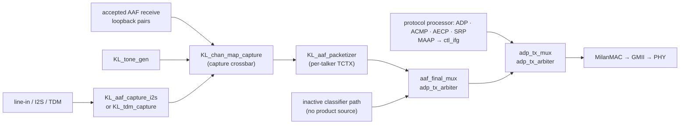
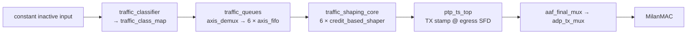
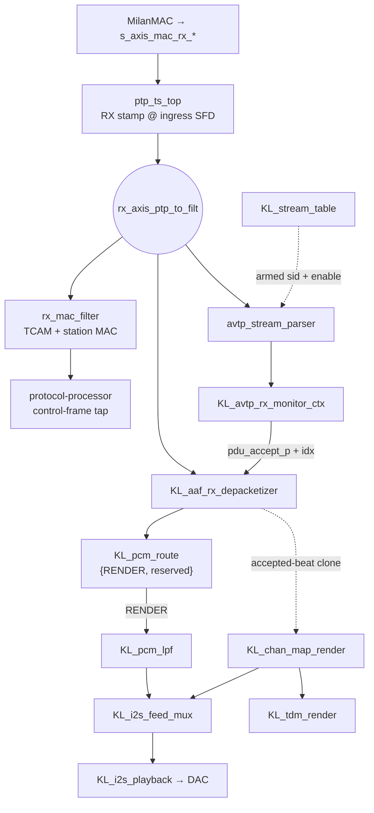

# One AAF frame, hop by hop

*The page to read before you go looking for a module.* It follows a single
audio frame through the fabric in each direction, names the RTL instance at
every hop, and gives the CSR you would read to prove the frame got that far.
Nothing here is new behaviour — it is the connective tissue between
[FPGA_DESIGN.md](FPGA_DESIGN.md) (what each module is),
[../reference/REGISTER_MAP.md](../reference/REGISTER_MAP.md) (what each register
means) and [../reference/EGRESS_QUEUE_MAP.md](../reference/EGRESS_QUEUE_MAP.md)
(which queue a frame takes).

Two companions cover the neighbouring concerns:
[../integration/AXIS_CORES_ON_BAREMETAL_SOC.md](../integration/AXIS_CORES_ON_BAREMETAL_SOC.md)
documents the supported bare-metal SoC boundary, and
[../AAF_LATENCY_TAPS.md](../AAF_LATENCY_TAPS.md) puts hardware timers on the
hops named below.

Every instance name in this page is the identifier in
[`hdl/milan/milan_datapath.sv`](../../hdl/milan/milan_datapath.sv); every offset
is from the register map. If the two disagree, the RTL wins and this page is
wrong — say so.

---

## Contents

- **[0. The one thing to know first](#0-the-one-thing-to-know-first)** -- Product traffic is emitted by fabric protocol and media engines. AAF streams never enter the retained classifier/queue/shaper chain.
- **[1. Egress: a captured sample becomes an AAF frame (the fabric talker)](#1-egress-a-captured-sample-becomes-an-aaf-frame-the-fabric-talker)** -- Follows capture, mapping, packetization, admission, arbitration, and MAC egress with a live observation point at each hop.
- **[2. Egress: the inactive classifier path](#2-egress-the-inactive-classifier-path)** -- Records why the queue/CBS implementation remains present but has no product packet source.
- **[3. Ingress: a frame off the wire reaches fabric render](#3-ingress-a-frame-off-the-wire-reaches-fabric-render)** -- Follows the RX tee through parsing, stream matching, monitoring, depacketization, fabric routing, channel mapping, and physical I2S/TDM render.
- **[4. What is \*not\* on either path](#4-what-is-not-on-either-path)** -- Three things people go looking for in the wrong place, including the fact that capture and render are two *different* crossbars with two different map RAMs.

## 0. The one thing to know first

**Product egress is generated in fabric and skips the retained shaper chain.**

The classifier, queues and credit-based shaper have no packet source in the
bare-metal product shape. Their input is tied inactive; their CSR-visible
configuration remains for compatibility and focused RTL verification. The AAF
and CRF talkers, protocol-processor traffic, MAAP, and fabric gPTP all inject
downstream through `adp_tx_arbiter` mergers.

That is deliberate and it is stated in the RTL at the merge point: the AAF
talker is *"injected AFTER the shaper (MVP: bypasses CBS for continuous
emission, like ADP; class-A shaping = the `is_1g` follow-up)"*. Its admission
uses the processor's ACMP and SRP class-D state plus MAAP. The consequence for a reader:
queue assignments do not select any product traffic today, which is
the same boundary
[EGRESS_QUEUE_MAP.md](../reference/EGRESS_QUEUE_MAP.md#where-the-fabric-bypasses-all-of-this)
says from the queue's side.

Section 1 is the live fabric talker path; Section 2 records the deliberately
inactive queue path so its presence in RTL is not mistaken for a target packet API.

---

## 1. Egress: a captured sample becomes an AAF frame (the fabric talker)

The dynamic-map and media-clock claims are checked against the
[Milan feature status ledger](../reference/MILAN_FEATURE_STATUS.md):

<!-- milan-feature-status:start -->
| Feature ID | Status | Canonical value |
|---|---|---|
| `aem.served-command-set` | `implemented` | - |
| `crf.media-clock-consumption` | `missing` | - |
<!-- milan-feature-status:end -->

| # | hop | instance in `milan_datapath.sv` | what happens | read it at |
|---|---|---|---|---|
| 1 | **capture** | `aaf_capture` (`KL_aaf_capture_i2s`) or `tdm_capture` (`KL_tdm_capture`) | the I2S/TDM front end recovers L/R sample pairs and hands them over as a `pair_valid` + slot + 24-bit L/R bus. Which one is built is an elaboration choice, not a runtime one | `LTAP_TX_EPOCH` `0x874` samples the gPTP ns at this edge |
| 2 | **channel map** | `KL_chan_map_capture` | the capture crossbar picks, per wire slot, which I2S/TDM pair, tone source, receive-loopback pair, or zero feeds it; reserved source encodings resolve to silence. The map resets empty; `CHMAP_CTRL` selects the CSR-programmed crossbar, and with the enable clear the front-end pair drives the packetizer bit-identically | `CHMAP_CTRL` `0x900` is the direct diagnostic writer. `GET_AUDIO_MAP` reads the live stores, and `ADD_AUDIO_MAPPINGS` plus `REMOVE_AUDIO_MAPPINGS` update them through the processor's transactional path. See [../CHANNEL_MAP_64.md](../CHANNEL_MAP_64.md) |
| 3 | **packetize** | `aaf_packetizer` (`KL_aaf_packetizer`) | accumulates a PDU's worth of pairs, then emits one AAF frame: VLAN tag from `AAF_CTRL[27:16]`, destination from `AAF_DMLO`/`AAF_DMHI`, source = the station MAC, `avtp_timestamp` = the PHC now plus the presentation offset AECP holds. Per-talker state lives in the TCTX rows the `0x800` window writes | `AAF_FRAMES` `0x660`, `AAF_PAIRS` `0x664`; `LTAP_TX_D0/D1` `0x87C`/`0x884` bracket the accumulate + serialize |
| 4 | **admission** | `aaf_stream_en_w` inside the packetizer | a stream emits when the common AAF enable and MAAP term are true and its processor-owned ACMP talker and SRP bandwidth state grant admission. `AAF_CTRL[1]` is the documented debug bypass | `PP_STAT` `0x924`, `AAF_CTRL` `0x678`, and the processor class-D diagnostics |
| 5 | **merge boundary** | `aaf_final_mux` (`adp_tx_arbiter`) | the packetizer output joins the structurally inactive classifier path. Product audio sees no queue and no credit accounting | — |
| 6 | **merge with control** | `adp_tx_mux` / `gptp_ctl_mux` (`adp_tx_arbiter`) | the protocol processor's packed ADP/ACMP/AECP/SRP stream merges with MAAP in `ctl_tx_mux`, passes through `ctl_ifg`, and joins the fabric media lane here. CRF joins AAF through `crf_dp_mux`. With the product-default option on, the fabric gPTP stream joins at the final `gptp_ctl_mux`, independently of the inactive generic classifier/shaper path | -- |
| 7 | **control-lane IFG** | `ctl_ifg` (`tx_ifg_gasket`, `GAP_CYCLES = 512`) | spaces control frames so the MAC cannot eat one that arrives back-to-back behind another. **Control lane only** — fabric audio and the other protocol/time lanes do not pass through it, so it costs no stream throughput | — |
| 8 | **MAC** | `tx_axis_to_mac` → `m_axis_mac_tx_*` | out of `milan_datapath`, into the SoC's MilanMAC (LiteEth GMII), onto the wire | `STAT_TX_FIFO_GOOD_FRAME` `0x21C`; `LTAP_TX_D2` `0x88C` closes the chain |

> **The `LTAP_TX_D2` reading, corrected.** `D2` spans hop 3's last beat to hop
> 8's egress, i.e. hops 5–8 — the arbiter chain and the MAC boundary. It does
> **not** span a CBS slot, because a fabric-talker frame never enters the
> shaper (Section 0). [../AAF_LATENCY_TAPS.md](../AAF_LATENCY_TAPS.md) attributes the
> measured `D2` maximum to a shaper slot; that attribution cannot be right for
> this lane, whatever the measurement itself shows.

The PTP TX timestamp is taken independently of all of this, at the egress SFD
inside `ptp_ts_top` — which is why queueing order does not perturb gPTP
accuracy ([EGRESS_QUEUE_MAP.md](../reference/EGRESS_QUEUE_MAP.md#why-gptp-sits-below-the-shaped-classes)).

## 2. Egress: the inactive classifier path

The classifier, queues, and CBS remain synthesizable and CSR-visible, but the
target has no packet-injection interface. `tx_axis_to_shaper.tvalid` is tied
low in `milan_datapath`; fabric gPTP and every product media/control source use
the downstream merges described in Section 1.

All three classifier/queue/shaper blocks are children of one wrapper,
`traffic_controller_802_1q`.

| # | hop | instance | what happens | read it at |
|---|---|---|---|---|
| 1 | **inactive input** | `traffic_classifier` → `traffic_class_map` | the input valid is tied low, so no product frame is classified | `CLS_CTRL` `0x300`, `CLS_TC_QUEUE_MAP` `0x310` retain their documented reset values |
| 2 | **enqueue** | `traffic_queues` | `axis_demux` fans the frame out by `tdest` into one of five `axis_fifo`s. A FIFO drains only while the shaper grants it | `CAP.num_queues` `0x008` reads 5 |
| 3 | **shape** | `traffic_shaping_core` → five `credit_based_shaper` instances | per-queue 802.1Qav credit accounting decides which backlogged queue is *eligible*; a plain grant mux (not a second arbiter) selects among the eligible ones, highest index first. **Every queue powers up unshaped**, so at reset this is pure strict priority | `0x400 + q*0x20` for `q ∈ [0,5)` → `0x400`–`0x49F`; `CBS_CTRL[0]` at `+0x0C` per queue |
| 4 | **timestamp** | `ptp_ts_top` | remains on the shared egress boundary. The legacy metadata stream is drained internally; fabric gPTP uses its dedicated timestamp handshake | PTP group `0x500` |
| 5–7 | **merge + MAC** | as Section 1 hops 5–8 | the shaped stream is the *data* port of `aaf_final_mux` and then of `adp_tx_mux` | `STAT_TX_FIFO_GOOD_FRAME` `0x21C` |

The full queue table, the reset slopes, the reserved-DMAC rows and the argument
for gPTP sitting at q3 are all in
[EGRESS_QUEUE_MAP.md](../reference/EGRESS_QUEUE_MAP.md) — it is the authority
and this page does not restate it.

## 3. Ingress: a frame off the wire reaches fabric render

The RX side **tees**. A pre-filter copy feeds the media plane, while the filtered
copy feeds the protocol processor's control-frame classifier. There is no
target memory-delivery path.

| # | hop | instance | what happens | read it at |
|---|---|---|---|---|
| 1 | **RX timestamp** | `ptp_ts_top` | ingress-SFD capture for gPTP event messages, then the frame continues unchanged on `rx_axis_ptp_to_filt` | `LTAP_RX_EPOCH` `0x894` samples the gPTP ns here |
| 2a | **control-plane filter** | `rx_filter` (`rx_mac_filter`) | station-MAC exact match + multicast hash + the 16-entry TCAM, armed by `TCAM_CTRL[1]`. Surviving frames are observed by the protocol processor's classify-first control tap | TCAM group `0x700`; `STAT_RX_FIFO_GOOD_FRAME` `0x230` |
| 2b | **stream parse** | `avtp_rx_parser` (`avtp_stream_parser`) | lifts the AVTP header off the wire — `stream_id`, `subtype`, `sequence_num`, `avtp_timestamp`, the `tu` bit, format bytes — and compares the `stream_id` against the armed table | `APRB_PARSED` `0x8B4`, `APRB_MATCHED` `0x8B8`, `APRB_SID_LO/HI` `0x8BC`/`0x8C0`, `APRB_INFO` `0x8C4` |
| 3 | **what to match** | `stream_table` (`KL_stream_table`) | holds one `{stream_id, enable}` row per listener and drives the parser's `cfg_stream_id_i`/`cfg_stream_en_i`. Entry 0 **aliases the live ACMP bound record** unless an explicit `0x800`-window override is armed for it | `A_STRMW_CTRL` `0x810` / `A_STRMW_SID_LO`/`_HI` `0x814`/`0x818` per selected index |
| 4 | **accept or not** | `avtp_rx_monitor` (`KL_avtp_rx_monitor_ctx`) | the verdict. Per-stream state: sequence continuity, format support, media lock, timestamp sanity against the presentation offset. Emits `pdu_accept_p` + the stream index — this pulse **is** the commit | `AVTPRX_FRX` `0x6BC` (accepted frames), `AVTPRX_STAT` `0x6B8`, `AVTPRX_ERR` `0x6C0`, per-stream `A_STRMW_CNT` `0x830 + 4k`; `LTAP_RX_D0` `0x89C` = MAC_RX→ACCEPT |
| 5 | **depacketize** | `aaf_rx_depkt` (`KL_aaf_rx_depacketizer`) | replays the same tapped stream, gated by the monitor's accept pulse, and emits the payload as full 8-byte beats in wire order (S32BE interleaved), tagged with the stream index in `tuser` | `PCMRX_CNT` `0x6C4`; `LTAP_RX_D1` `0x8A4` |
| 6 | **route** | `pcm_route` (`KL_pcm_route`) | the 2-bit ABI word is `{RENDER, reserved}`. Bit 1 feeds the direct fabric render tap; lowest-indexed RENDER stream wins. Bit 0 is forced to zero on write and ignored; `0b00` discards after counting | written by the `0x800` window `CTRL[2:1]` commit; `LTAP_RX_D2` `0x8AC` closes at the selected fabric-render edge |
| 7a | **direct DAC render** | `pcm_lpf` → `i2s_feed_mux` → `KL_i2s_playback` | the selected listener tap is band-limited and serialized to the DAC with wire-truth channel stride | `I2SPB_STAT` `0x6D8` |
| 7b | **mapped physical render** | `KL_chan_map_render` → `i2s_feed_mux` / `KL_tdm_render` | an accepted-beat clone is de-interleaved by each PDU's own channel count; the map projects stream channels onto I2S physical channels 0/1 and the TDM render bank | `CHMAP_CTRL` `0x900`, `CHMAP_SNAP` `0x910`, `CHMAP_LOOP` `0x914` |

### Reading the ingress path when nothing arrives

The probes are ordered so that the *first* counter that stays at zero names the
hop that failed. Walk them in this order:

| if this is 0 | the frame never reached | look at |
|---|---|---|
| `APRB_PARSED` `0x8B4` | the parser — nothing AVTP-shaped is arriving at all | link, switch forwarding, the reservation |
| `APRB_MATCHED` `0x8B8` (with `PARSED` climbing) | the stream **table** — we are parsing frames but matching none | `APRB_SID_LO/HI` shows the sid *on the wire*; compare it with `A_STRMW_SID_*` and check `A_STRMW_CTRL[0]` is actually set |
| `AVTPRX_FRX` `0x6BC` (with `MATCHED` climbing) | the monitor's accept verdict | `AVTPRX_ERR` `0x6C0` for the reason — format, sequence, timestamp |
| `PCMRX_CNT` `0x6C4` (with `FRX` climbing) | the depacketizer | accepted-PDU handoff and depacketizer drops |

`APRB_*` exists because everything below it only counts *after* a match: a
bound listener that accepts nothing used to read zero everywhere with no way to
tell parse failure from match failure. That gap is what made the entry-0
provisioning defect take so long to corner — see
[Section 21 of ../limitations/TROUBLESHOOTING.md](../limitations/TROUBLESHOOTING.md#section-21-acmp-says-success-the-listener-declares-itself-bound---and-not-one-frame-is-accepted-root-caused-and-fixed-version-0x000f-mechanism-confirmed-on-silicon-2026-07-26).

## 4. What is *not* on either path

Worth stating so nobody looks for them in the wrong place:

* **The protocol processor's ADP, ACMP, AECP, and SRP traffic plus MAAP** never
  touches the classifier or a queue. It enters through the control merge in
  Section 1 hop 6. CRF joins AAF on the separate data-side merge. Their ingress is
  handled by taps from the RX stream.
* **The channel-map render crossbar** (`KL_chan_map_render`) sits on the
  playback side of Section 3 hop 7b, not on the capture side of Section 1 hop 2. They are two
  different crossbars with two different map RAMs —
  [../CHANNEL_MAP_64.md](../CHANNEL_MAP_64.md) has both.
* **The media-clock servo** (`KL_mmcm_drp_servo`) is not in the frame path.
  The current root pins its selection to INTERNAL, so it does not steer the
  audio MMCM from CRF/AVTP timestamp error. Restoring clock-source consumption
  would change *when* samples are clocked, never which bytes move.
